# SciPy 2018视频专辑 - P69：SciPy 2018视频专辑 (P69. The Jupyter Interactive Widget Ecosystem _ SciPy 2018 Tutor - GalileoHua - BV1TE411n7Ny

 Well， good good afternoon and welcome to the Jupiter widgets tutorial if you're not here for the Jupiter widgets tutorial。

 We won't be offended if you go out either door， My name is Matt Craig I teach physics and astronomy at Minnesota State University Moorhead a small University Northwest Minnesota。

 My involvement in Python is primarily through the Astropy package and then。

 My first sci-fi five years ago。 I think I went to what was the first tutorial on IPython notebooks and got introduced to widgets and have been hooked since。

 Got two other presenters who are here today Jason Grot， and Martin Bredles and。

 The way we have things set up will we've each got a block of the of the tutorial that we'll run through。

 Before I forget we should have a break around 230。

 But if it gets to 230 240 and we haven't had a break yet somebody should raise their hand and interrupt us the foods only out from。

 230 to four and I don't want to miss the food so， We if you run into we've got some post-its coming around there in the back of the room now。

 Soon you'll have a blue bluish post-it and an orange post-it if you have a problem during the tutorial stick the orange posted up on your computer or raise your hand。

 There'll be a couple times and we're working on exercises that we ask you to put up the blue post it when you're done。

 So we know how far along people are， Okay， so， Let's get started。

 But before I go any further does everybody have the notebooks open？ Okay。

 So I'll be running the tutorial and in Jupiter lab most of the widgets interface works just fine in Jupiter lab。

 There will be a couple things that I'll point out when we get to them that aren't working in Jupiter lab yet。

 But they're fairly minor all of it works in the classic notebook， so the idea widgets is to。

 Make it easier for you to interact with your data so a you know。

 Standard use of a terminal might look something like this you want to know it nine time nine times。

 nine times nine is， You enter it you get a result。

 You want to do this for several different numbers maybe so you write a function。

 and then to test the function you pass a devalue and see if you get the， result that you expect。

 widgets give you away， fairly easily， Taking a function you've already written so we didn't modify our function after it is just straightforward Python function。

 Give the interact function from IPI which it's a little bit of information about what values we want the argument to have and then it wires up。

 a GUI so that as， You change the slider the value of X is updated that's passed into the function and the result is printed out on in the browser。

 Interact behind the scenes is， generating some， Widgets for you and what we're going to spend a fair bit of time in this first？

 45 minutes of the tutorial is going through the base widgets that are included in IPI widgets that the building blocks from which you can build something more interesting。

 The， So one type of widget is a float slider widget。

 We'll see there's several different varieties on this。

 for any of these widgets you can have more than one instance of it running in the browser window and。

 They are two different views on to the same underlying model。

 So if I move one of the sliders the other one moves。

 You can get the values of widgets from the Python side and you can set the value of a widget from the Python side。

 So one of the things that excited me about widgets initially my very first。

 Sort of public example of programming was in middle school in the mid-1980s。

 And I told the library and sure I'll write you a video game for the TRS 80。

 You know in those days you you made things on the screen by poking values into memory， and。

 The big display of the the game ended up being a bunch of people watching me mutter under my breath as I typed it a keyboard and desperately。

 Wish I'd never said yes， And so when I saw that when I saw widgets and I was like wait。

 You mean I can just write Python and I can make GUI elements。

 I got just absurdly excited that I could do all this without having to learn any JavaScript or。

 anything complicated， so， You can customize these customize what happens when you do something with a widget so。

 You can define a function that the widget observes。

 So here I've written a function handle change that when it gets a change event from the widget。

 Updates the value of a variable。 We're gonna be coming back to each of these pieces in a little bit。

 So we're going to do more detail then， Let's see。 So right now the slider value is set to eight。

 So I should get 64 when I square and I do， If I go back up， Just the slider。

 The square has been updated， Finally you can link， widgets together so。

 I've got two widgets now the text widget down here and the slider and I've linked the two of them together。

 So that when I change one the other changes and it works in both directions， Right。

 So there's a limit when we decide when we define this slider it went from。

 minimum five to maximum of ten so， When I try setting a value of 15 the slider stops at 10。

 So as I'm gonna go to the next notebook now and you can either follow along with these。

 from this index page or， If you look in a files view we've named all of the files so that they should be presented in the order we're gonna go through them。

 So I did a version of this tutorial about five， five and a half weeks ago at my institution there's a faculty member there who teaches astronomy and a couple of students and they。

 In our department in our intro astronomy classes， There are a lot of flash based interactives that we used that we used flash is going away and we wanted to replace those and so。

 Sort of motivation and and to set the scale for where we expect you to be in five weeks。

 The and because it's a nice illustration of what you can do with widgets even though each of the individual pieces is fairly simple。

 this is a single widget that combines several pieces to it so there's a three-dimensional view of a binary star system in the upper left corner using the package pi 3 js a。

 plot that changes， I'll show you an animated version of this in a moment as the stars orbit around each other the plot gets updated and。

 Using the graph is they're using the plot are using the package bq plot。

 and all of the controls you see down towards the bottom are， Let me get this up in the full screen。

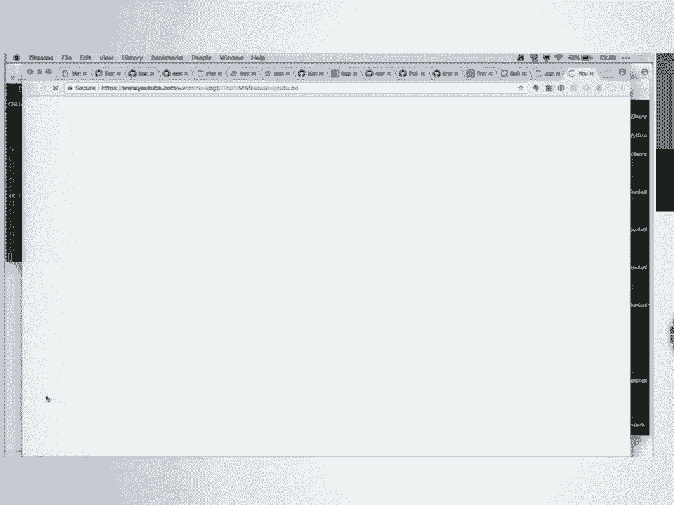

 Are from playing ipi widgets， so one of the things included in ipi widgets is a play widget。

 The way we have this set up is you adjust the what's called the inclination the angle of the orbit you get different views of the binary star。

 System and the light curve is updated in the upper right as you as you。

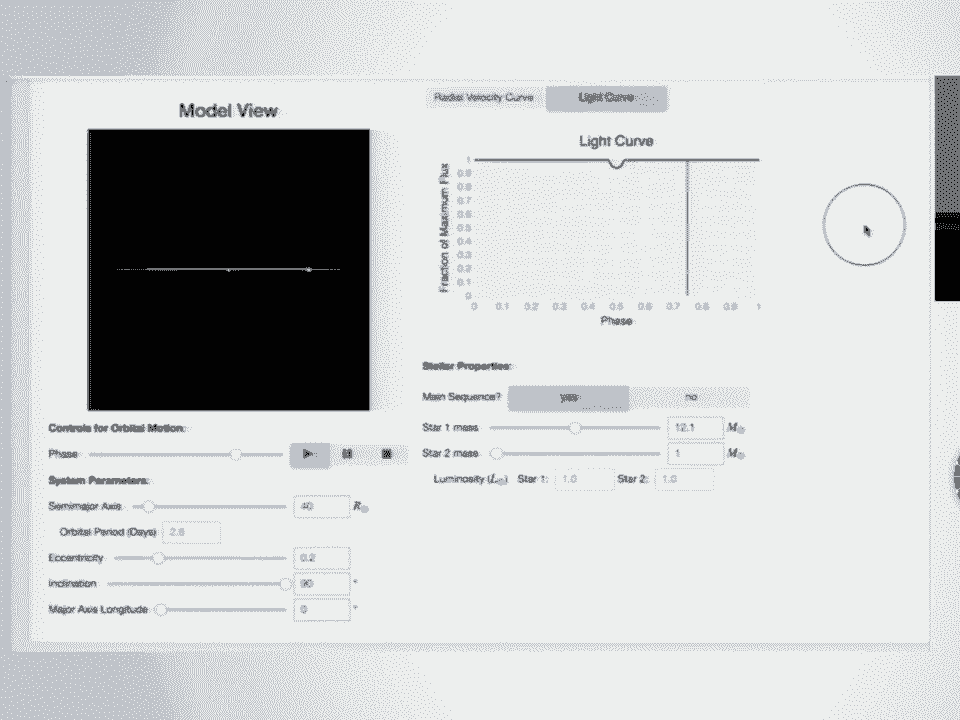

 Move the star you can change properties of the stars。

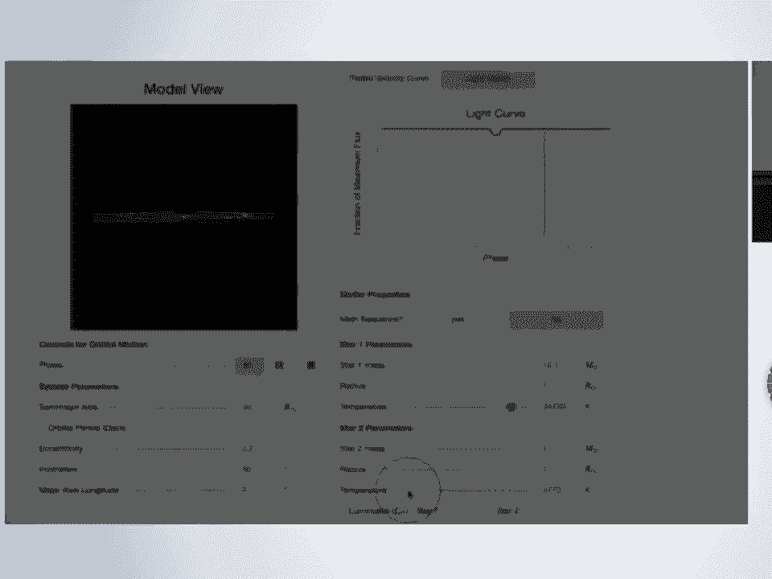

 We've set things up so the display doesn't update until you let go of the control so you have some flexibility and how often your your。

 Model gets in our updated and， Can I find the right， There we go， Right。

 so I want to include this because what what surprised me a little bit was that。

 The goal for the summer for the folks I did this with was to write three or four。

 Interactives the Spinary star simulator was on there as a well if we get to the end of the summer。

 And we have some time we'll put this together， but they got through everything's， Okay。

 we missed the we missed the electrical socket， That's what I was watching is like， okay， no， they。

 Get so excited about widgets and I just can't control myself， Yeah。

 so it's you know what I'm looking forward to is seeing what you guys do with this in a month or two months。

 So， Want to spend， Five ten minutes here showing you first about a tool called interact that lets you。

 Construct and display a widget interface without having to do to write any low-level widget code yourself。

 So if you could get to this notebook， Thanks， And， Let's see， so let's go through the imports here。

 So interact is a function that's part of ipi widgets。 Thank you， Yeah。

 probably I guess I'd maybe should just ask for a straw， so。

 Interact lets you take a function that you've written and if you give it some hints about what type of variable。

 The argument is then it will generate for you a widget and by default it prints out the return value of the function。

 So you pass in as the first argument to interact the function that you want it to。

 Generate the UI for， If you say something about what the argument is by setting a default value then it will use that to guess what kind of widget you want。

 So in this case it's on integers the argument guest you want it an integer sided to go along with that。

 If we'd said X was a boolean it would generate a checkbox。

 If X was a string then it would generate a text field， Write that updates in real time。

 You can also use interact as a decorator， so， This syntax is exactly the same as before and that the controls are generated by the default values that you pass in in this case。

 We've passed in a floating point numbers。 We get a floating point slider out of it。

 It is possible to， Set specific values and keep those values fixed as you're modifying the other arguments to the function。

 By adding a fixed keyword， So now as we change P is the first argument Q is the second argument as we change the value of P that updates in the display。

 But the value of Q is kept fixed to 20， My PhD work was in cosmology。

 So when I see these the first thing I think was okay。

 so if we're gonna set the Hubble constant the expansion rate of the universe and see what happens if we change the density of the universe this is。

 Perfect for that case， What we've seen so far is have essentially been， abbreviations for widgets。

 You could if you wanted to instead of saying， Interact F and then just saying x equals 10 which is what we've done before you could pass in what？

 I pi widgets behind the scene substituted for that integer。

 Slider so you could set them in value the maximum value in the step。

 We'll see it a easier syntax for doing that in a moment。

 Like we said a couple minutes ago the type of the keyword argument is what determines the type of。

 GUI element that's generated so I， Actually find myself using interact not infrequently in the classroom or what I want to be able to do is show a graph of something and。

 Demonstrate how the graph responds if I change something and I don't start out with。

 At the base level making a box widget and then a graph and then a slider widget and putting all those together。

 I write the function and I use interact so in a couple minutes。

 We'll see some graph examples using interact to， Questions at this point。 Yes。

 So the question was if you have something like interact that you're using in a script that runs in an in a notebook is there a。

 Something you can do so that the user will get a warning if they try running it outside of an notebook。

 If the import I try if I can we just doesn't exist then you'll get an error on the import。

 Is that sufficient or are you saying if you're not connected to a front end？ Yeah。

 you'll probably get an error when you try to open a comp it'll try to make a connection to the front end and。

 And it'll probably give you an error， So for the recording the answer to the question was if。

 IPE which is not installed an error will get raised at that point if you try to import it。

 Or we think that there should be an error thrown if you at the stage where the widget tries to send a message to the kernel。

 And the kernel doesn't exist in practice。 I haven't run into that too much because。

 The most of the widget you know most of this kind of stuff。

 I'm doing in a notebook and so I can't run the notebook from the command line， Other questions。

 Okay， so， Right if all you want to do is change the minimum and maximum values of a slider would be a。

 Pain to have to type out insider， Gadiadiyata and so there are shortcuts for that if you give two values those are used as the min and the max。

 If you give three it's min max and step， And if you want to give a min max in a step and also。

 Specify the default value or the starting value， Then you can do that using the decorator this way。

 So in the decorator you're saying what you want the bounds of the slider to be in the step and then in the function definition。

 You're providing the default value， You can also do dropdown widgets this way， and。

 You can set up dropdown widget so that there's difference between the value that's displayed in the dropdown and the value that's sent back to Python。

 so in this case if， You select one the number 10 is being sent to our function f without function did was multiplied by three。

 So we get 30 out if you change it to two we get 60， Okay， so， Okay， so。

 Interactive is similar to interact but returns a widget so。

 We haven't displayed it quite yet we'll get there in a moment， so what we got back from W is a。

 widget it turns out that when you have something with several pieces to it and in what we've seen so far there really been two or three widgets involved。

 So if I back up to this dropdown there are at least three widgets here。 There's the dropdown itself。

 There's a widget that holds the output from the function and both of those are put together inside of a box。

 Oh， sorry。 Yeah。 Yeah， I switched my did the YouTube video and forgot switch back。 How's that？ Okay。

 great， Right， so if you look at the children we can see what the， Children oh， oh， yeah， yeah。

 right。 We haven't displayed this one yet， To display the widget。

 You can do one or two things you can display or just type with W by itself as the last thing in the。

 in， cell， And so this widget right the top one top or first child is a integer slider that goes from minus 10 to 30。

 Second one integer slider that goes from minus， 20 to 60。

 The difference is that now we have an object that is this widget so we can get the values of the。

 of the keyword arguments out of the widget we can get the result of the。

 Function out of the widget and so what interactive gives you over interact is a widget that you could if you wanted to take an embed in some other widget。

 So if I wanted to do back to my， Expansion in the universe example if I wanted to have two tabs one that showed them a Hubble constant of expansion rate of the universe of 50。

 And one that's at a hundred I could generate two， interactive plots with two different values of the this Hubble constant。

 Using interactive save those two widgets and put them into a tab widget。

 Right that's the other advantage is now once you have this you can go in and change things so if I。

 I， Wanted to change the minimum value of the first child which is an integer slider to， Ten whoops。

 Oh， yeah， yeah， yeah have a typing expansion program on and W is with thanks。

 Now the moment of truth， So you can write so that is the other advantage you can modify the widget once you have it。

 So let's do a quick interactive plot so， We're writing a function of that plots a straight line using map plot libs。

 so it's using the normal map plotlib， commands your your familiar width if that's the package you use for graphing and。

 To make the plot interactive we just feed it into as a function in into interactive this would work with interact also。

 And we get out a graph where you can adjust the slope。

 Adjust the intercept and watch it change in real time， Is。

 Anybody it's as you adjust these sliders and on your computer or any of you seeing some lag between when you move the slider and when yeah。

 so， That's one difference， I've noticed between Jupiter lab and the classic notebook isn't the classic notebook the updates take a really long time。

 on in Jupiter lab they don't， If you make the function more complicated or the better way to say it's the more complicated the function is longer。

 It's going to take to update so even if it in Jupiter lab if I drop in a complicated enough function。

 I'll see， In almost comical amount of lag sometimes as I adjust the slider and then get five minutes of watching it update。

 Thank you for mentioning that so， It is possible to set up the widget so that。

 instead of the widget updating continuously so， What's happening up here is that as I drag this every time the value of the slope of the line changes a message is sent to my function。

 I function updates the plot， What you can do instead is。

 Disable those continuous updates and there's two ways of doing that。

 So for this demonstration we've got a function that doesn't do a whole lot except sleep。

 Which on a warm Texas day after a nice big clay pit lunches made appealing but。

 So if you use interact manual instead of interact then you get the usual， user interface。

 Events so in this case we had one argument that we're setting to a float slider。

 Nothing gets run until you push the run interact button。

 so in interactive you can do the same thing the details of how you do it are a little bit different you pass in a。

 Dictionary it's a second argument and say that manual is true， the other way of handling this is。

 To use a special keyword on the float slider widget。

 you can set continuous update to false and the way this works is that I。

 Can move the widget around all I want a， Event won't trigger and call my function until I let go。

 Personally I prefer this to the run interact thing because I forget to push run interact。

 But in the binary star simulator for example that I showed you a couple minutes ago。

 continuous update is set to false because it takes some time to recalculate each of the models and so you wait till the user is。

 Has set the parameters they want and then， then it goes。

 Sometimes you might have like five controls that you want to set in conjunction with each other and then having the button is nice。

 Yeah， you just all five controls and then press the button to go， Yeah， that's a good point， Okay。

 so small exercise here， What I want you to do is， We want to modify this。

 plotting widget so that the， values only update when you release the mouse。

 so it's maybe gonna be easier as a first， Step here if we add a cell above。

 And then display right here， So take a couple minutes。

 I've got the line of code here already that that sets continuous update for。

 the first child the slope slider here to false so。

 Please go ahead and make the second slider behave the same way。

 There's not a lot that you're intended to type in here。

 And once you're done with it if you could stick your blue green post it onto your computer。

 And if you don't have a blue green post it raise your hand， And， You， You， You， You， You， You， You。

 You， You， You， You， You， You， You， You， So if you got a question while you're working just raise your hand or check somebody here you。

 And when you've got a working stick your main host， I'm your computer， You， You， You， You， You， You。

 You， You， You， You， You， You， You， You， You， You， You， You， You， You， You， You， You， You。

 So the fix here is the if we look back up the widget first child is the slope second child is the y intercept and so if we want to set the second second child's。

 We just need to change the index of into children and then it should only update when you release the sliders。

 Yep。 >> And there is a -- has it been released？ Has iPIE been released yet？ >> See multiple plots。

 >> And then if you do a plot， >> What is it that you want the plots to append or you just want to keep writing on top of the same plot？

 >> Okay。 >> Can you interact with the one level for the interact？ >> Yeah。 >> [Inaudible]， >> Oh。

 good question。 So the question was， so suppose we save the snowbook， we push it up to github。

 is it going to be interactive on github？ No。 Do you want to come up in？ >> Yeah。

 So it does render on nb viewer， but github doesn't do it because of security issues。

 So I don't see that changing soon。 And be conferred。 So if you save the notebook。

 will it render on github？ No。 Security issues。 It does render on nb viewer。 >> Yeah， I use that。

 >> Yeah。 >> So towards the end， we'll come back to how do you present widgets to users？

 Some users are okay with download repo and go to the command line， some aren't。 Other questions？

 Yep。 >> I don't。 So the question was， does it work with task？ I don't know why it wouldn't。

 >> So if I， for example， interact with one， in the next cell， I just type interact with one again。

 I have the same ones and they are the same。 Does this use more resources or is this a view？

 >> I mean， so using more resources in the sense that yes in JavaScript， there is a new view created。

 But the amount of， but essentially no。 And the amount of resources we're using anyway for these widgets。

 compared to what you would see if you went to a YouTube page。 It's fairly small。 >> Okay。

 so we have the questions。 Okay， let's go to the next notebook。

 We've already seen at least roughly what widgets are and what they can be used for。

 There's a couple new things that we want to show you in here。 So let's do the import。

 So the two ways to display a widget。 One is to take advantage of the fact that the way that notebooks work is that the representation of whatever the last line of code is in a code cell is displayed in the cell below。

 If that object has a particular method defined for a representation in the notebook。

 And so one way to show a widget is just to have the last thing in the notebook like typing in interactive plot。

 There is a command display that lets you， it's a little bit more flexible about where in the cell you make the display happen。

 We've already seen that if you display the same widget more than one time。

 you're making more than one view of it。 On the reason this works is that on the Python side there's one widget object that you created when you define the widget。

 On the JavaScript side there's a model of that widget that's created and then you can have as many views of that model as you want to in the notebook。

 You can close a widget by using close。 And if we remake remake the widget again we can get and set values。

 The useful thing to know about is that each widget has a bunch of keys defined and the keys are the things that you can pass back and forth from the front end JavaScript to Python。

 The keys that are available depend on the type of the widget but you can always get that list by looking at the keys property。

 So this is a slider。 So there's a continuous update property we've already talked about in the description。

 we'll come back to in a minute。 Disable does what you think it would do if you said disabled equals true then you can't interact with the slider。

 We'll be talking quite a bit about layout in a little bit， max and min we've already seen。

 And so because I don't have the widgets documentation open in front of me at all times。

 it's not in frequent。 I use this feature not frequently to remind myself what can I do with this widget。

 It's possible to add things to this without having to do any JavaScript side coding。

 So if you want to add other traits that widgets have that can be synced across widgets it's impossible to do that without too much trouble。

 So you can set values to some of those properties when you create the widget。

 I'm in this case we're setting the value and whether or not it's disabled so I can't type as with the。

 let me modify this a little bit。 I can change whether control is disabled programmatically。

 Another cell now I can edit。 Change it back。 You can link two widgets together。

 So here we've got a float text and slider widget。 And there's a function。

 two functions for linking one called link and one called jslink。

 jslink makes a link happen on the client side in the JavaScript。

 So if you were to upload this notebook to github and then look at it in an end view where it would render the widgets and as you dragged one widget down here you'd see the text box update。

 Or if you change the text box you'll see the slider update。 In a couple minutes。

 well probably after the break we'll come back to just plain link which has the link in the Python side。

 And then unless you're connected to a computer that's running Python in the background the links aren't going to work。

 And you can also unlink them programmatically。 Questions。 Okay。

 so next notebook up is a list of a bunch of widgets。

 Although I could read all of this to you it would get a little painful。

 So what it's just we do instead is take your green sticky off if you have your green sticky。

 Take the next five or ten minutes。 Run through the notebook here， execute each of the cells。

 see what the different widget types look like。 There will be a couple places where I want to say something but take five ten minutes run through the cells。

 Let us know when you have questions。 Also if you're having any installation issues or things aren't working for you please raise your hand so we can get that's all wrong。

 So if you've made it all the way through this notebook and you're ready to move on slap on the green sticky。

 There's a couple things I want to point out。 You can see in this notebook what gets displayed if you have run a notebook you've made widgets。

 you save the notebook， you close down the kernel and a day later you open the notebook back up。

 You don't at least by default see the widgets you see a text。

 Short text saying there was a widget here essentially。 Let me go through here。

 So there are a variety of sliders。 We got a question during the working time。 Where was it？ Okay。

 it's coming up。 Ah， okay here's a good example。 Well maybe it's not the best。

 So notice this label on the slider is cut off。 I'm in Texas so。

 By default out of the box each of the labels has a fixed width。

 We'll come back in a couple notebooks to how you change that。

 The advantage of it if you're using short labels is that automatically all the labels are aligned and all the controls are aligned。

 But it is changeable。 Okay， where we at？ Okay， let me say something about the text widget because there are four of them。

 So the text and text area are intended to be input areas。 The text for short text。

 the text area for longer text。 Labels are intended to be short pieces of text that you're going to put next to some sort of control。

 If you have paragraphs and paragraphs of text， we recommend you use the HTML or HTML math for rendering those。

 And okay， so output we're going to talk about a fair bit。

 So questions about any of the widgets leading up to output？ Yep。

 Question was can you use an image with a button？ I think the answer is no。

 you cannot decorate a button with an image。 If we have some time at the end。

 I wrote this little package。 It may be a very bad idea called IPy events。

 It would let you make an image clickable。 Yeah， so part of the answer here is if you know any JavaScript。

 then you can do anything。 Whether or not it's advisable。

 There is a package called IPy events that lets you attach events to widgets。

 That can be a really slow way to process browser events。

 So depending on what you need it might work。 Other questions before we get to the output widget？

 Can you demonstrate again how you extend the text field？ Sure， so there's， let me find that。

 So quick answer to your question if we change， we set the style to this。

 Then we're seeing the full string now。 The downside is that the space for the label has come at the expense of the space for the slider。

 When we get to the styling notebook we'll talk about how to break those two apart and give the label its own widget。

 the slider its own widget and put them next to each other。 Other questions？ Okay。

 so what the output widget does is let you capture the output that would normally go to the notebook。

 So unlike some other widgets when you first display an output widget there is nothing in the browser。

 If I execute this set of print statements instead of going to the style underneath it goes to the output widget。

 anything that you can display in a Jupyter notebook can be displayed inside of the output widget。

 So if you get， if this tutorial is moving a little bit too slowly you can start playing last year's tutorials and bump it up to double speed with YouTube and there are some changes coming up though so don't go too far ahead。

 So we'll come back and talk more about the output widget in a moment。 The animation。

 the play widget essentially provides a loop for you looping over integers that you can then feed into another widget。

 So in this case we're using the play widget to drive a slider。 Controller is not working right？

 Right， okay。 So in principle you can link to a game controller also。

 In practice don't try that over Bluetooth at the last minute。

 A couple widgets which will be handy later once we start writing our own custom widgets are the box。

 HBox and VBox， each of which is intended to be a container that holds other widgets。

 HBox is by default lays things out horizontally， VBox lays them out vertically。

 So in this case we've got two VBoxes， one with zero and one。

 one with two and three and then we've put those two VBoxes into an HBox。

 There's an accordion widget。 So inside of this you can put any other widgets you want to。

 In a tab widget which again can have widgets inside of it and you can put them inside of each other even if you want to。

 You can control programmatically which tab is selected so if I change this to zero I get the zero tab。

 With the accordion you can set it to none selected if you want everything to start out closed。

 You can nest them。 This particular example doesn't do a whole lot except show that you can have accordions inside of tabs and I think in principle you can do tabs inside of accordions。

 Questions？ Yep。 >> So clear the output from an output widget？ >> Yes。 >> Yes it is。

 Let me add a cell back up here by the output widget。 Yep。 So it's out。Clear output。 Okay。

 I should say this just in case。 So you probably may already all know this but in the notebook you can tab complete so I almost never really。

 even if I remember， yeah you can clear， I almost never remember what the command is。

 So I just hit tab and let the notebook tell me what to do。

 You can also use the standard clear output widget inside the output you can say without and inside of that you can say clear output。

 I probably not display clear output。 So it works just like you would expect it in a normal set。

 >> Other questions？ Yep。 >> So on the play there is an interval。

 I tried putting a lot lower and I guess you run into the profit speed。 >> Yeah。

 it certainly looks like it's milliseconds。 >> I guess it's a request animation frame so it has a lower bound of about 16 milliseconds。

 >> 16？ >> 16 milliseconds。 Yeah， I think it's a request animation frame。

 So it doesn't update faster than the refresh rate of your screen。

 This is what the sensible lower bound。 >> Other questions？ Okay， so let's。

 I'm thinking let's do the output widget and then break。 And then do exercises？ Okay。

 >> Or we can do output widget and then exercises and whenever you finish take your break。 >> Sure。

 yeah that works。 Okay， so a little bit more about the output widget。

 So in this case we added a border to the output widget and we'll come back after the break and talk more about widget styling。

 And as we saw before you can dump output in there。 We've already seen both of these。

 So you can put widgets inside of output widgets。 So we decided to the slider。

 So this next cell I'm going to run is not going to work in JupyterLab。

 It does work in classic notebook。 If you are looking for something to do this weekend and will be at the sprints。

 then this would make a great sprint project。 So if you're in classic notebook。

 then you should have seen， you would have seen output here， but not in JupyterLab yet。 Oh。

 great question about clear output。 You can also use an output decorator to capture what comes out of a function。

 So one of the things you'll run into as you start writing more widgets and you're trying to debug what's going on as you're handling events is any errors that are raised inside of an event handler don't make it into the notebook。

 And this gives you a way of doing that。 So we wrote a function that printed something and raised an exception in a decorated with this output capture。

 And so back up in the output widget， here's our print statement and our exception。

 This is an important difference between the classic notebook and JupyterLab that in the classic notebook printing inside of a function that is a。

 actually we'll cover this later。 It's too complicated。 Yeah， we'll come back to later。 Okay。

 so let's run this。 We've got three integer slider， sliders rather。

 a function that prints their values。 And as you adjust the sliders。

 the output is getting captured by the output widget and displayed。

 So here's like an interact that you get to control how things are laid out。

 And I can mention a moment ago for debugging errors in callbacks。 Output is really nice。

 I don't think I can say out loud how many hours I've spent remembering that， oh right。

 the errors don't get printed。 So， actually， let me take this out first。

 Because I have done this so many times。 So， I'm writing a widget and I have a button。

 I want something to happen when I click the button。 And so， in this case。

 I'm supposed to get an exception。 Maybe I was trying to do something more productive。

 And my callback function didn't seem to be doing anything。 So， I'm like， I know。

 I'll raise an exception inside the callback function。 Surely that will break things。 So。

 that this is happening behind the scenes as the kernel talks to the front end。

 By adding in the capture widget， then when I click the button。 Ah， thank you。 Hours telling you。

 We get the exception。 So， I guess we don't get it multiple times。

 I'm going to clear up what you prefer around the head。 Ah， ah， ah。 Thank you。 Right。

 now I'm truly exceptional。 Sorry。 Ah， you can use -- you can also use the output widget if you use Python logging。

 To capture log messages。 But not in JupyterLab。 There you go。 Sorry， won't hit shift return。 Yeah。

 Yeah， what's not working is the output appending， right？ Questions。 Okay。 So。

 let's take a look at the exercises。 So， okay， let me show you one thing。 So。

 with each of the exercises， we have solutions available。 So。

 if you're at a point where you want to see what -- or one way to do this， do it， do it。 So。

 I think with that， start working on the exercises。 We'll gather back together at 15 minutes。

 20 minutes。 All right， so， any other questions？ All right。 So， what we'll do is we'll move on now。

 I'm going to go ahead and maximize this to give us a little more room。 It is full screen。 Okay。

 Actually， I can take off the toolbar。 There we go。 Now we have even more room。

 One of the widgets that comes with IPY widgets， these standard controls widgets。

 has two properties that are useful for changing the styling and the layout of these widgets。 So。

 one property is the layout attribute， and the other property is the style attribute。 So。

 the layout attribute， what it does is it essentially exposes to you a lot of the CSS。 So。

 CSS is the way to lay the style things in a browser。

 And what the layout attribute does is it exposes CSS essentially to you so you can control the look and feel of these widgets。

 And in particular， what the layout property does is it lets you control sort of the outer box for the widgets。

 So， how wide the widget is， how tall it is， a border， a background color。

 sort of the container that the widget lives inside of。 So。

 there's a bunch of attributes like height width， max height， max width， min height， min width。

 whether it's visible， overflow controls， whether there's a scroll bar， for example。

 if you have a box， do you want the box to only go so big and then have a scroll bar to access anything else in the box？

 The border， the margin， the padding。 So， how many people here have any experience with CSS in a browser？

 Okay， so a fair number of people。 So， this is just trying to give you some of the capabilities that you would expect with a browser based thing。

 We embed the flexbox layout attributes and just recently as in not yet released but in the pre-release that we released last week。

 And in the soon to be released release， okay， let me put some numbers with that。 In 7。2。

1 which is the current release， we just have flexbox and 7。

3 which is a release that we'll release probably next week and the pre-release is out already。

 We also have the CSS grid layout attributes。 Okay。

 so let's skip through a bunch of these and just go straight to the examples。

 I think things will be a little more explanatory。 So。

 the idea here is that for every widget you have an attribute called the layout attribute and you can give it a layout widget。

 And layout widget is just a widget that has all these properties with height， border， etc。

 And these properties are literally just the CSS， you just put the string that you would put in CSS there。

 So， we want to look up what should be in there。 Look up the CSS spec for border or the CSS spec for height。

 You can do it in pixels and percentages， EM， which is basically anything the browser supports。 So。

 in this case， I have a button。 The description is of course what's in the middle。 The layout。

 it's 50% which means 50% of my window here。 The height is 80 pixels。

 The border is two pixels dotted blue。 And it's very easy to set those CSS properties。

 One of the things that gets a little annoying sometimes to create a layout object so you can just pass a dict as well。

 And it works just fine too so you can just give it curly braces if you want。

 And it will automatically convert that dict into a layout widget and then assign the layout widget to the widget。

 You can assign the same layout to multiple widgets。

 It's an easy way to get consistent look and feel across many widgets。 So。

 here I'm making another button but I'm giving it the layout。

 It's the same layout as the first widget。 And now if I set and because it's a widget。

 I can set the attributes and they're automatically communicated。 So。

 I can set the border to be one pixel solid red。 And because this layout is shared between both。

 both widgets have their layouts changed。 So， because the layout is a widget itself。

 I can change its properties and those properties are automatically communicated and changed。 So。

 you can dynamically change these layouts as you wish。 Questions。 Okay。 The description。 So。

 we talked a little bit about this。 The description sometimes is too long for the thing。 Again。

 with the standard set of reference controls that came with high-py widgets。

 we tried to be pretty opinionated about how they looked and how they fit together。

 And in particular， we were opinionated about how they should stack nicely next to each other。

 Instead of forcing you to make a grid and all this kind of stuff。

 we tried to make them all sort of uniform size so that you could just put them right on top of each other。

 And it looks like they're all nice and aligned and everything。

 And so in particular that meant that our labels are all the same width。

 And so they stack up really nicely and line up really nicely without you having to do any extra work。

 But sometimes that cuts off the description here。 And so it's very easy for you to adjust this。

 Here's two ways to do it。 One way is to sort of deconstruct this widget。

 It sort of has a label on the left-hand side and the slider on the right-hand side。

 It's sort of smashed together in a single widget and you can deconstruct that and make a label that's just a specific label widget and then an in slider。

 And you end up with something like this。 You'll notice that this slider is a full width slider here and a full width label。

 So that's one way to do it。 You kind of mess up the nice stacking layout that you have but it gives you the description that's as long as you want。

 Or you can change what we call the style。 This is the second attribute that exists on all the widgets。

 Layout is about controlling the CSS of sort of the box of the widget and style lets you drill down into specific properties of the widget。

 And so in this case any widget that has a description property also has a style attribute that and the style attribute has a description width attribute and the description width。

 Again it's a CSS width。 Initial is a CSS keyword that just says do whatever you would normally do CSS like don't pay attention to any other people saying to make you a certain width etc。

 And what CSS typically does for boxes that have text is just size them to however big the text is。

 And so setting the description width to initial is telling the browser make this as wide as you need for that particular text whatever the text is。

 And so what happens here is I have a slider。 I've set the style attribute of the slider and in the style attribute it has an attribute called the description width。

 And the description width I've said make that the CSS value initial which means use as much space as you want。

 Which means that the whole width of the widget stays the same because we're opinionated still but the whole widget being I think 300 pixels wide。

 We've reached in and we said description can be as wide as it wants which means the rest of the widget sort of is crammed over on the side。

 So you can pick your battles and decide what you want。

 Of course you could say I want the layout to be more than 300 pixels I want it to be 400 pixels。

 And so you can make the entire widget bigger if you want to compensate for the description being bigger if you like。

 And so these are the trade offs you have to decide as you're laying out your widgets。

 Style itself is a widget just like layout is。 You can for convenience specify it in the initial construction of a widget with a dictionary or you can actually create a style widget。

 But you can see here that let's give this a name。 So I is my slider and here's the well I guess it doesn't。

 Here's the style and in particular I can set this description width to be again you know whatever 30 pixels。

 And then it automatically syncs that description with back and forth to the widget。

 So it's sort of widgets all the way down。 You've got your insider widget and it has two sub widgets。

 The style widget and a layout widget each one of those has some properties layout widget is about controlling the sort of overall size and dimension and look and feel of the widget。

 And the style is very specific to the widget unless you reach into different parts of the widget and control different properties of the particular widget。

 And both of those have attributes that can sync back and forth。

 And I can use the style like I can use the same style widget for all of my widgets and have the same description with for everyone just like I can with layout。

 Okay questions about the style。 We'll see a few more style examples at the bottom of this worksheet。

 Alright， so HBox and VBox， HBox for horizontal box， VBox for vertical box。

 It's just a way of laying out your widgets。 So in this case I've set up an HBox that has two VBoxes and inside the VBoxes I have the particular buttons that I'm making。

 And so I end up with this nice grid。 This is a very typical thing to sort of deconstruct your layout into HBoxes and VBoxes horizontal and vertical boxes。

 Up until 7。3 which hasn't been released， up until now。

 HBoxes and VBoxes are sort of the best we could do for trying to arrange a grid。

 There's a very powerful capability coming in 7。3 to let you get a real grid。

 a 2D grid instead of just trying to match up sort of 1D HBoxes inside of VBoxes inside of HBoxes。

 Let's see， the label widget also does math， of course。 The number formatting。

 when you have a readout field you can specify the readout format using the Python format language。

 Okay， so Flexbox。 This is a bunch of text in here and essentially。

 so this worksheet is essentially from the IPY widget's documentation。

 It was taken from with permission from the complete guide to Flexbox。

 If you want to really try to understand this Flexbox system for browsers， for laying out things。

 or read that guide， here's just a brief overview that might get you started。

 We'll just skip down to the examples to get an idea and we'll talk through some of the things in the examples。

 How many people have dealt with Flexbox in the browser before？ Okay， great。

 So let's do some examples so we can see。 Okay， so what's this doing？

 I'm constructing some layout widgets。 Here the width is auto。

 So the button default is a certain number of pixels wide and I'm just going to let it grow however wide the container is here。

 And in this layout， I'm going to make it a Flex layout。 It's going to be a column。

 So it means things are stacked on top of each other。

 The line item stretch means I want everything inside the box to fill the box horizontally and the border solids。

 the width is 50%。 So I'm trying to set the size of the box and then I'm saying everything in there should fill the size。

 And I end up with the buttons that fill the size and the box is 50% of my width here。

 I can have proportional sizing。 So this is a little bit more advanced use of the Flexbox layout parameters。

 Essentially what's happening here is I'm trying to say these buttons should have different widths sort of weighted with respect to each other。

 The bottom one is the easier one to see。 Essentially what it's saying is this button。

 think about each of these buttons as being zero sized and this button should have three times。

 you know， every time I'm trying to portion out space。

 this button should have three times the amount of space that these do。

 And so you end up with a button that's I think three times as big as these two buttons。

 And you get that from this right here。 Excellent right click。 Here's the weights right here。

 The one， three and one。 And again， if you read the CSS spec or the Flexbox layout guides。

 you can get pretty complicated。 You can do some really cool stuff with it。

 You can portion sizes of things。 You can have things sort of naturally flow and lay out next to each other。

 Here I'm saying on the bottom， on the bottom rows I'm saying this middle button should be sort of three times the size of the other buttons。

 a weight of three。 On the top row what's happening is this auto means that each button has sort of a natural width。

 And so think about sort of the total space that I have。

 Each button has a natural width that's going to be automatically determined。

 I think by the text inside of it。 And then I'm going to take the space left over and take the space left over。

 I'm going to portion out three times as much space to this guy as to these two people。

 So basically you can think about Flexbox is really about laying things out like they should be。

 And then taking the space left over and apportioning it to the children according to these weights。

 And the reason why it works so nicely in this case is we're explicitly saying each of these buttons has takes up no width。

 And so there's all the space left over and now a portion all of that space left over with a weight of three here and a weight of one to each of the side buttons。

 This can get really complicated。 You can do a lot of powerful stuff with it。

 Read the Flexbox layout guide either here， the summary of the article or the original article。

 And I think things will help out a little more。 Here's a bigger example。

 In this example we are again saying I want to flex layout columns or I want to stack things。

 Here's the border。 A line item stretch means just I want to fill things from the edge to the edge here。

 So that's why these widgets aren't a specific width。

 They're all filling the entire box horizontally。 And here what I'm doing is I'm portioning a space in between。

 Anyway， there's a lot of parameters here。 I don't want to get too far into the Flexbox layout because it is really a complicated spec。

 But you can do some examples and we put some examples here to try to help you understand at least how to do some simple stuff。

 Here's something that does help you。 Here's one more example。

 Here I'm setting a row layout so instead of stacking them vertically we're stacking it horizontally。

 And here I'm using a particular height and here's a particular width。

 And so with this particular width for the box there's going to be some scroll bar here。

 So again lots of possibilities to lay things out here。

 Lots of control for each widget to say how much space it should take up。

 And the idea behind the FlexLayout is you want a layout that can be responsive to how wide the notebook is。

 how short， how small the notebook is， how big your screen is， etc。

 And Flex tries to give you an algorithm and give you parameters to naturally resize things to fit whatever space you're in that's available。

 This is actually a really nice example。 This basically goes。

 let me try to get the whole example onto basically one page。

 This gives you a way to play with all the Flexbox layout parameters and just get an idea of what the layout looks like here。

 So for example I can set the Flex direction to be column and of course I can set the border and it's changing things in real time。

 So here's the FlexFlow which is how things are being laid out。 It's column now。

 And this particular example is giving you the actual code that you would need to write to get that particular layout。

 So you can play with this quite a bit to try to understand better how the Flexbox parameters are affecting things。

 Very simply though we tried to make very opinionated choices with the stock default controls so that things will look nice without having to do a lot of the Flexbox stretch and weights and all sorts of stuff。

 That things look fairly nice just stacking them right on top of each other。

 possibly changing the description widths if you need to have a little bit more room for your descriptions。

 So we try to be opinionated so it's very easy to come up with something that looks okay。

 And then if you want to go deep this can go pretty deep。 Alright， styles。

 So a button in particular has several different styles， danger， warning。

 This just changes some values in the button styling。

 You can also set things from the specific style attribute and here's where I promise that we come back and look at some of the styles for some of the different widgets。

 So we saw up above how basically any widget that has a description out to the left-hand side has a style parameter that tells you it lets you control the width of that description。

 Buttons have a button color parameter in their style attribute so you can change it to be whatever color you want and these are CSS colors。

 So I guess you can do something like this。 You can get all the style attributes for a particular button or a particular control by doing that dot keys。

 So we also have a font weight style attribute and we're adding these attributes as people sort of request them and want them。

 We try to be somewhat judicious about using attributes that a lot of people will want。

 But somebody said， "Well， we want the font weight attributes。"， Okay。

 we'll add essentially the ability to control the font weight inside the button as a specific style attribute。

 And again， like we said above， the style is a widget。

 It's a sub widget of your button widget in this case and so you can assign it to other buttons as well and assign it to other values as well。

 And another style attribute that we have is the color of the slider handle。

 And then I guess we have a list of all the style attributes。 You can run this。 Oh， right。

 Some nice person went through。 Does this still work？ Yeah， sure。

 Some really nice person went through all of the widgets and all their names and figured out all the properties and made this nice tabular cross tab thing。

 So here's all the attributes and here's all the widgets and the X is if that widget has that attribute。

 And here's all the styles。 So this is the -- these are still keys。 Okay。 There's the style keys。

 Yeah。 So almost everything has a description width because we tried to make every widget have a description attribute that you can control。

 All the sliders have a handle color。 So I mean these come through inheritance。

 So basically all the widgets that have a description inherit from the single base description widget class。

 All the sliders inherit from something that has this handle color style。

 So we have font weights and that's about it I guess right now。 Okay。

 Questions about styles or layouts？ Yes？ Is what？ Oh。 No。 You'll notice that the -- where is it？

 The button -- where it was？ The button styles。 Here it is。 This actually came from bootstrap。

 We originally -- the widgets originally were written with bootstrap and we moved away from bootstrap。

 But for backwards compatibility we kept some of these names and tried to mimic the bootstrap styles。

 But the short answer is no。 But there's still some effect from when we previously did have bootstrap styling。

 Other questions？ Layouts and styling？ Yes？ Is this going into the direction where you might have a CSS file for your widget and then you have each widget as it might be。

 And that is controlled by the properties in the CSS file。 Good question。

 So the question was is this going in the direction and maybe if I can rephrase your question just a little bit。

 would it be possible in the future to have a CSS file where each widget has a particular ID and your CSS file？

 Controls those -- controls those IDs。 Okay。 So the answer is slightly different than the -- than what the question was asked。

 The problem with using IDs is that you can only have one ID on a page at a time。

 But you can have multiple widgets that are representing the same underlying model on the page at a time。

 So IDs is not the way to do that。 But classes is the way to do that。

 And you can assign classes to a button or to any widget。 Let's take this button， for example。

 Let's put this。 So you can assign add class and give it a class。

 And now that button has that class applied to it。 And now if you want to separately put some CSS on the page that styles things with that particular class。

 you're more than welcome to。 So that's the way you can sort of have an escape hatch to do whatever you want with the CSS styling。

 And then you can reach down。 The caveat with that is that the DOM structure of these widgets is explicitly not a public API and not something that we support as a stable API。

 And so if you're messing with things like inside the widget that's explicitly tied to the DOM structure of the widget。

 then it might break on an update。 That's why we have sort of a very constrained style property that's the public API that would maintain going forward as a stable API。

 But certainly you can add a class and you can put CSS on the page if you need an escape hatch。

 Did I answer your question？ Yeah。 Great。 Yeah， that's a good question。 Again。

 this is an escape hatch， please don't do this。 Unless you really need to。 It's there。 You can do it。

 For embedding？ Yeah， so if you were embedding widgets on a standard HTML page。

 you have control over what CSS is on that HTML page。 If you wanted to make a dashboard or a web app。

 you can put CSS on a page doing a percent HTML and then style。 Blah， blah， blah， blah。

 Be careful with that sort of thing because in JupyterLab， you might have two notebooks open。

 And if you're applying styling to an entire page， you might be affecting the other notebooks。

 So you've got to be careful with how you're putting styling on the page。

 But there's some ways to get styling on the page。 In JupyterLab。

 you could write an extension or put it in the theme or something like that。 In the classic notebook。

 Interesting。 In the classic notebook， you can also use the percent percent HTML to put some styling on the page。

 I think you maybe have a percent CSS。 You can at least do a percent HTML to put some styling on the page。

 There are questions？ Actually， technically you could use an HTML widget to put styling on the page if you really wanted to。

 If you wanted to keep it which it's all the way down。 Okay。

 So I think there's some exercises for the widget layouts。 So Matt， do you want to describe these？

 Sure。 And then we'll go into the widget events。 Right。

 Within the next hour we'll have written a simple password generator。

 This is actually more complicated than what's shown in this GIF is more complicated than what we're going to end up doing。

 There are a series of exercises here which have you go through practicing some of these layout things。

 So I think we'd set in 10 minutes for this。 You'll probably want to have the styling notebook open also。

 And each of the exercise boxes I've tried to mark where it is that you need to change things。

 So go ahead and start and raise your hands from your questions。

 As our approach to this was rather than reading you the really long style document。

 it made more sense to us to put together some exercises that would force you to digest it a little bit more。

 So maybe take down the green things from your computer and then put it back up when you're done。

 And of course orange things if you have a question。 [inaudible]。

 So a lot of you may be confused that you're not seeing very much effect。

 Again Flexbox is about taking the space left over and apportioning that out how you're asking to。

 So if your width is constrained so that there's no space left over then you won't see much of a difference。

 You want to see how it's trying to space things out。

 Make your browser wind a wider et cetera to really see how it's spacing things out。 [inaudible]。

 We'll probably give it another minute。 We're running just a few minutes behind so give it another minute or so。

 Ask for questions and then move on。 [inaudible]， [inaudible]， [inaudible]， All right let's move on。

 You have solutions to all of those so you should be able to peek at the solution if you want to move forward faster or keep trying if you want to probably remember the solution better。

 We want to cover events though but first any questions that came up from the layout stuff。

 Okay we have a question for you sounds like a professor。

 Okay if you don't have a question for me I've got one for you。

 So we could with some amount of effort modify that。 Was it the styling demo widget。

 Where is it it's not in here anymore。 [inaudible]。

 So with some effort this could be turned into a widget where you so you've got your widget that you're defining。

 We could change this so that you can attach that widget to these controls adjust the layout interactively and copy and paste Python out at the top。

 Would that be really helpful thumbs up or whatever or don't bother。

 Okay so the people who are responding are saying yes I'd like that。

 Thanks for participating in our user survey。 Okay so let's move on to widget events。

 So that was about setting up things and this is about actually imparting activity interaction to the widgets。

 So I guess this is for Python 2。 Okay so there's a couple of different ways to add actions based on widget events。

 The button is a little bit specific and different in this way。

 With the button you can do something when you click and you can do that by registering it on click handler。

 Here's the documentation for it essentially the the you register it by giving it the function。

 You can say remove equals true in order to actually remove the registration。 So here's an example。

 So click me。 What you'll notice here is that here let me comment this out so that you can see what happens here。

 Here if I click me it appears that nothing is happening。

 In the classic notebook you'll actually see the stuff printed out。

 This is one difference between the classic notebook and JupyterLab。

 In JupyterLab we're a little more correct with how we do things and we insist that you capture any output inside of an output widget。

 So here I'm displaying the button and the output widget。 Can't see the output widget。

 There now you can see the output widget。 And now as you click it the output widget is capturing the print that's happening in that button handler。

 So that's how to get a function run when the buttons clicked。

 An easier way to do this in both the classic notebook and JupyterLab is to use that decorator output。

capture。 There we go。 And this also works as well。 So you can register a function to be run whenever buttons clicked。

 And if you want to print something then make sure you're capturing an output and an output widget。

 For most of the widgets though it's not a specific click function that you're registering。

 Most of the widgets what we have is any time this particular value changes run this other function。

 And so this is using the observe function method on a widget。

 And basically the observed method takes a handler。

 It takes a list of attributes that we're going to listen to。

 And it takes an event type that we're going to listen to。

 And right now there's basically one event type called the change event。

 So the type right now is mainly for forward compatibility if we decide to have more different types of events。

 But what we'll often use is the handler。 That's the actual function we're going to run when the value changes。

 And then the names saying which attributes of a widget to listen to。 So let's do an example。

 So here what we're going to do is we're creating an end slider and an output widget。

 We're capturing the print statement so we can actually see when this function is running。

 And we're saying the end slider we're going to observe。 It's a little bit kind of a maze here。

 We're going to observe this particular attribute of the end slider。

 And when this attribute changes we're going to call this function。

 And so what you'll see here is as we change the value of the slider the function is called and the function is appending something to this output widget。

 I'll point out that this is run if it changes on the front end but it also is run if it's changed on the back end。

 So if I change the value here the function is still run。

 So as something observing the widget you can't tell whether or not the user clicked it or if it was programmatically changed。

 But the idea is that all you care about is that the state of that widget changed。

 The particular value that you're listening to changed and then you can react to those changes。

 So observe your handler and the attributes that you're actually listening to。

 Your handler is given this change object。 This change object has a couple of properties and it's listed in this documentation here。

 The couple of properties are the type of notification， the owner。

 So you get a handle on the actual widget that was changing。 The old value。

 the new value and the name of the attribute that changed。

 You can actually use the dictionary syntax or you can just do it like this to change。

new for convenience。 Okay， questions about how to hook up a handler to a change event。 Okay。 Oh yeah。

 What is the value？ Value is the attribute of the slider that I'm listening to。

 So in this case the value is wherever the slider handle is。 I could listen to the max of the slider。

 What's going on？ So here I'm listening to the max and if I change the value， notice nothing happens。

 But if I change the max， you have some autocorrect on your computer。

 If I change the max then the handler is triggered。

 And you could just eliminate this and that would listen to any change on any attribute of that widget。

 So that's sort of the sledgehammer way of responding to any change in the widget。

 Sometimes what you want to do is just synchronize widgets。

 So like your handler is just setting the value of another widget to make sure that the values stay in sync。

 And this is what the link does。 We saw the link before。 Just real quick again。

 the link function takes a widget and an attribute and another widget and it's attribute。

 And it just registers basically a change on the layer on each widget saying when that value changes。

 when that attribute changes， set this attribute on this other widget and vice versa。

 And so what's happening here is that these two sliders are synchronized。

 Now what's literally happening is slider one is changing in JavaScript。

 Its value is getting synced back to Python kernel。

 This link is seeing that value change and it's running in Python to set the other value。

 the other widget's value。 And then that other widget's value is getting synced back to JavaScript and then updating the slider。

 So there's sort of a round trip to the kernel happening here。 D-Link is a one directional link。

 It says when the source attribute value changes， set the target value to that to whatever the value was for the source attribute。

 But it doesn't go the other direction。 So in this case， the source changes the target。

 but the target doesn't change the source。 And when it's different。

 then as soon as I change the source， that handler runs and it syncs back up again。

 You can unlink these things which just D registers to change notifications。

 These are just convenience functions。 You could do this with registering two change notifications on each。

 a change notification on each widget。 It's just convenient to be able to just say link。

 Make sure these two values stay the same。 Alright。

 so we have a bunch of attributes that are passed in to this change handler like the new。

 And you can do a bunch of stuff with it。 So here I'm changing the value。

 Here I'm not just linking the two values。 I'm actually doing some programmatic changing of this text value。

 If the new is less than zero， then set this other things value to be one string or another string。

 And so I can be a little bit smarter about these change notifications。

 I said before when you do a link， it's actually a round trip from the front end where you're interacting back to the Python side。

 where actually the sync is happening and then the value is sent back。

 That's great and all but it's a little bit of latency to do that round trip。

 And if you end up putting these widgets on a webpage without a kernel。

 then you don't get that syncing。 And so we provided a different way of syncing these widgets。

 The JS link function basically syncs them in JavaScript。 So in this case， as I change range one。

 in JavaScript， the range two slider is actually listening to the range one slider values。

 And so there's no round trip to the kernel。 Instead， as I change range one。

 range two in JavaScript is listening to it and it changes it and then both independently sync back to the kernel。

 And so the syncing happens and happens in JavaScript and then each independently communicate their value back to the Python side。

 And JS D link is the same but directional linking just like the Python directional linking。

 And you can unlink those as well。 And then we already talked about continuous updates。

 So this is an example that illustrates the continuous updates for the first two。

 I've said continuous update false。 For the second two， I said continuous update true。

 And then I linked everything together。 Everything to A's value。

 So you can see nothing updates as I change A because it's continuous update false。

 So essentially it's not communicating its update until I let go of the slider and then everything updates。

 And same thing here。 As I'm typing the number， nothing changes until I press enter or move outside of the text box and then changes communicated as opposed to these where as I'm dragging the slider the changes communicated in real time。

 And we're here。 See I'm changing the changes communicated in real time。 Okay。

 So there's a short overview of how to hook up changes and widgets。

 But really the philosophy here is each widget has state the values of the attributes and you react to changes on those states。

 And except for the button click where it's actually an action that you're reacting to。

 Almost always in widgets the philosophy is you react to changes in the state of the widget。

 Okay questions？ Yes。 [inaudible]， So yeah good question。

 Why do you not use the JavaScript way of linking？ Why do you use link instead of always using JS link？

 [inaudible]， Oh yeah。 Martin， I have had this conversation quite a bit。

 Sometimes in the implementation of the widget。 So for example when you have the select drop down。

 What's actually synced over to the you have a bunch of convenience attributes that are on the Python side that aren't on the JavaScript side。

 So when you have a drop down and you select the value you have a dot value on the Python side but you don't have a dot value on the JavaScript side。

 Instead what happens on the JavaScript side is we just keep track of the actual index number and so you can't do a JS link for the value in a drop down。

 Yeah， thank you for reminding about that。 And other questions？ Okay。

 so we have another exercise about password generation。

 And the caveat with all of these things is please don't use this as a real password generator。

 We did use the Python secrets library but remember the syncing is happening in plain text between your kernel and your browser。

 So don't actually use this as a password generator but it's a nice small constrained UI that you can build。

 So question in our schedule we've got about these exercises will take about 30 minutes and then a break。

 The food goes away at four o'clock so we could if you prefer we can take a break now。 Okay。

 we'll go ahead and do a break now。 Just a last chance for food for the afternoon and let's be back by four。

 Alright， let's get started back up。 We are going to spend the next 15 minutes or so writing a password generator。

 As Jason indicated please don't go out and use that in the real world to generate your passwords。

 So we want the password generator to look like this once we're done with it。

 And the first step here tell you what I think in the interest of time。 Tell people to do solution。

 Yeah， well so there's a bunch of widget libraries you want to show off。

 Here what I'd like to practice is some of the event stuff so rather than having you construct the widget just go ahead and load the solution here to get。

 So we're going to start running up with it。 Right。

 so there's an import with our import setup at the very top you have to run and then。

 uncomment the solutions to bad pass pass pass one widgets or whatever it is so that you've got a widget looks like this in the browser。

 So it won't generate a password yet but we've got the controls in place。

 So we've provided a function in the next cell here to calculate a password and it needs a couple things you need to do。

 So the first is add a line at the end of the function that will set the value of the widget password text。

 So the value will be calculated in the function put into the。

 variable password and we want to use that to set the value of the password text widget which is the one up here。

 Okay， so when we run this it doesn't do anything we haven't called the function yet。 Okay。

 so somebody remind me what I want to have happen is I drag the slider and the password value updates。

 So if I want to do something in response to the slider changing which object do I start with？

 The slider widget， the password widget which which one of those？ Okay。

 so I got started with the slider which was called password length。

 And then what method is it that I want to do？ Yep。

 I want to observe the password length slider and when something happens I want to call my function calculate password。

 And so now that's disappointing。 Oh， yeah， I do have to give it a name don't I？

 That's a positional argument so you don't have to say name equals you can just do the function comma the names。

 Yes， I am。 Okay， so that's fine question。 Let's take a look。 So that's what I have。 Word for words。

 How about start writing fresh there might be some extra widgets that are not the widgets that are there。

 Okay。 There we go。 Okay， I have no idea what happened there。

 As you can see I changed absolutely no code and just reran cells。

 Sometimes what happens is you define a widget and then you set up a function and then you redefine the widget。

 You run the cell again and now you created a new widget but the function has a handle on the old widget and not the new widget and see if the redefine the function again too so that it's paying attention to the current global widget。

 Anyway， sometimes my guess is that's the sort of thing to happen here。 Yeah。

 so we haven't mentioned it yet but one of the most useful features of notebook does restart and run all cells。

 It's especially true with widget programming。 If you were at the Jupyter lab tutorial this morning and so you know you can write your own keyboard shortcut for that。

 Okay， so this was except for the order of execution problem we had fairly easy to set up this straightforward password generator。

 We're going to do another run through with this and the idea with our next run through is going to be it would be nice to start to separate a little bit the logic of generating the password from the widgets。

 So you can imagine if we're making a real password generator we might want to test the password generator in an automated way not in a browser with a whole bunch of different possible settings。

 Right now the way we've written this you can't because if you try to run the calculate password function it's going to expect there to be a password text widget somewhere that's been defined and has a value property。

 So our next notebook is going to end up with exactly the same widget。

 Now we're trying to separate out the logic from the rest of the widget and so we've written a function that just calculates the password given the length。

 And so this you could put in to an automated test or whatever you want to do with it。

 Run a command line make sure it gives you the results you're expecting。

 The GUI code so far is the same as what we had before so we've got the same controls again。

 And now we'll write a function that updates the value of the password text whenever the password length is changed。

 So we sort at the bottom so when the password length is changed that's what we're observing we're going to call our update password function。

 The update password function calls calculate password get the new password and then sets that value。

 And so once again we've got a password generator。 So the change for the last time the only change from the last time really is that the password calculation has been factored out into a separate function that you could change and test it whenever you want to。

 The other nice thing is that way in ipide widgets 10 when there's some change to the Python API you don't have to update your password calculating part of the code。

 I think I'm going to skip the interact stuff actually。

 In this case you could do the widget the way we have it just using interact。

 So there's a third way to do this and there's a couple of new features in here that we haven't described yet that I want to make sure we hit。

 So in this approach we're going to add up with the same password generators before。

 We're going to have one class that we defined for the widget so that somebody could or for the graphical part of it so that somebody could simply import that widget and use it like a box or a slide or whatever。

 A separate class for handling the logic and then a class to bring the two of them together。

 Did I run？ Yes I did。 Okay。 So most of the code here is the same GUI code we have before。

 It's just I'm putting it inside the init of a class。

 I'm creating the helpful text and the password text and password length as attributes of the class。

 I'm sub-classing from widgets vbox so that everything will be laid out vertically。 So far so good。

 I can move the slider。 Nothing happens yet。 It would be nice if this had a value so you can imagine that if you're using this pass gen widget that we're writing you'd like to be able to do pass gen。

value because all the other widgets have values， and so it'd be nice to pull out the value as a password。

 You maybe don't want the user to be able to set a password and so in this next cell I've added a property for the values so that you can get the value out。

 But you can't set it because I don't want the user to bypass my fancy password generator that's ultra secure by just setting the password to ABC or something。

 So now and this feels a little bit like overkill in this case。

 I'm making a class to simply calculate the password and calculating the password is just generating a random string。

 There is one new thing in here a couple new things in here。

 So where I'm going with this class is I want the class to have traits that I can link to the widget properties so that when I connect these two together I don't have to write function callbacks。

 I'll take a trait from the logic class a trait from the GUI class and just link those together and then when one of them changes the other one gets updated without me having to do anything。

 And so my password generator I'm going to subclass subclass from has traits which is from trait let's which is a class that provides the things that you link together。

 And you define your traits here is how the after the final class attributes not instant instant attributes。

 And then I can observe for changes in the length and whenever change of the length happens that this method gets called。

 And oh I have to execute the cell。 So when I run that。

 I get a generated password so in this first example I had to just print the generated password to the screen。

 In a moment we'll do that in a slightly different way so what we're going to do instead is we're going to make a trade for holding the password。

 And so and what the calculate password method will do is when length changes calculate password gets called calculate password finds a new password and saves it in this logic classes password field。

 Oops again have to run it so if we do that and I set the length to 110 and print out the password I get 110 character password。

 Great。 Unfortunately I can set a negative length password which is not so desirable I'm told from the security point of view。

 And so one other thing you can do is validate the value of a trade and there's a decorator from tradelets for doing that so I want to validate the trade length。

 And the way you do that is you define a method it doesn't matter what you call the method。

 The method will get an argument proposal that's a dictionary that contains the new value。

 You go through and put in whatever logic you want for deciding whether or not the trade is valid。

 If it's not valid you raise an exception a particular type of exception otherwise you return the good value。

 So in that binary star simulation that I showed you at the beginning for example you don't want a negative mass star。

 And now if we try setting a negative value we get a trade error。

 Okay so now we've got two pieces we've got a class for the graphical interface that we call pass gen GUI。

 We've got a class for the logic that we call pass gen logic and I'm going to make one more class to tie those together。

 So I'm classing from the GUI so this will behave like the password generator that we're interacting with。

 I make an instance of the model to hold my password and then all I'm doing to connect the model up to the widgets is a couple of links。

 And so now when the password length slider changes here that will be linked to the model password length。

 When the password length changes in the model that triggers the observe to update the password。

 The password is updated in the model in this pass gen logic class and that password is linked back to the GUI element in our widget。

 And so right you have to execute the cell don't just talk about the cell。 So there we go。

 So this last way of doing things is maybe a little bit easier if you're going to provide fairly extensive widgets where it's nice。

 You got some complicated logic like modeling a binary star。

 You have some complicated user interface and you'd like to be able to test that interface without it without worrying about testing logic at the same time and then tie them together in a straightforward way。

 Questions？ Okay， so are you switching computers now？

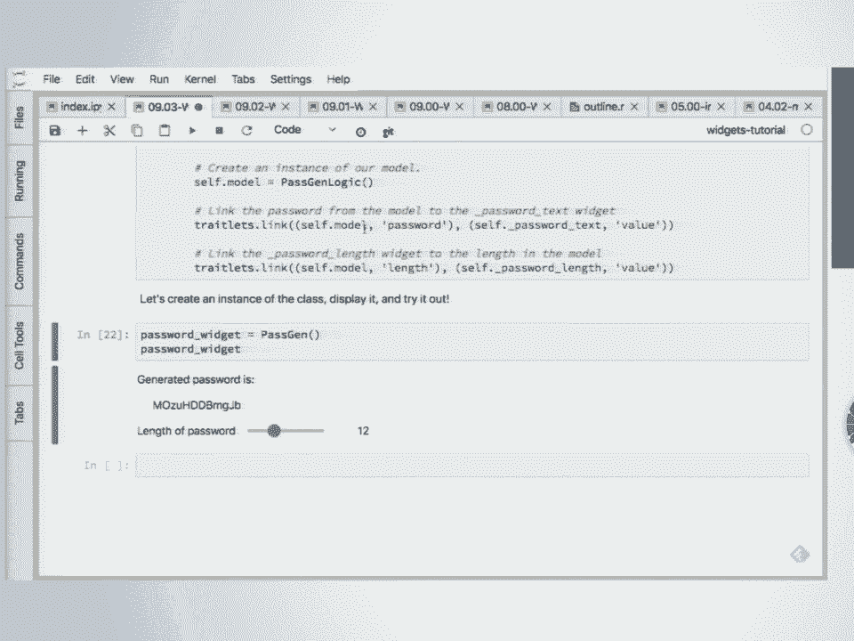

 Okay。 So my name is Martin Bellos and you have a screen。

 Is this large enough？ So what you saw until now were basically the basic widgets that come with IPY widgets but it's not just buttons and sliders。

 It's a framework and which they're built。 And using this framework you can build like new widgets on top of this。

 And that's actually how I got into IPY widgets。 I had a like a visualization library or a piece of JavaScript and you could push data to it but it was not like interactive。

 It wouldn't send data back。 I wanted to have buttons sliders and you don't want to reinvent the wheel。

 So I started like creating a widget library called IPY pholeum under and demonstrate this later。

 And then it basically ties all together so you can put in the sliders etc。

 So let me show some of that。 So if you want to build your own widgets after this on the IPY widget website there's a tutorial。

 There's a more in depth tutorial this medium article。

 And you can use cookie cutters to set everything up。

 So you don't have much boilerplate to worry about。 So let's start with BQ plot。

 So BQ plot was developed at Bloomberg。 You can think of it as an interactive widget library for a visualization bridging D3。

 So many of the ideas come from the grammar of graphics as you'll see now。

 So there are actually two interfaces。 One that I really like which is like the high level plotting interface which looks like a map plot lip。

 And a lower level which is basically a library of all the widgets。

 So just some imports and generating some data。 So we import the pipe plot interface。

 And this looks like map plot lip but instead of getting a static image you have an interactive visualization。

 So you have line plots， scatter plots and also this one。 It's interactive or histograms。

 But every component is a widget。 So let's make a similar plot but now using the not in high level but the lower level API。

 So using the grammar of graphics you have to define what the scale is but basically translates from data to like visual properties。

 Could be coordinates or colors。 Some data。 Create lines， axes and the figure which is built up。

 which basically builds the whole figure。 And you have this dataset。 And line is a widget。

 So line is this thing。 And if you modify the traits like with any widget it updates it。

 So it's really like a live plot。 Same with the scatter plot。 And everything is animated。

 And that's really useful if you want to see what the effect is of like changing a parameter。

 And you see the data changing that's way more useful than basically seeing the image suddenly change。

 So that can be really useful。 So also the access which is a scale。 So let me go back。

 So this is a linear scale。 So the minimum is not set so it's computed from the data but if we set it or set it to none again。

 And then it computes it from the data。 So every property can be changed。

 So also the x-axis if you change the label it's directly reflected in the plot。 So let's build。

 Let's go a bit quickly。 This plot where you can have a selector。

 So this is really nice selector where the height gives you the width and the location。

 And say you want to select this region。 And because it's widget the selection so what you selected gets synchronized to the kernel。

 So we can access this。 Or maybe we need to cheat a little bit and say well this looks much better。

 There are tools for it。 It could also be useful to draw sometimes a function。

 Like it's difficult to express in a function but you know how to draw it。 It's pretty easy。

 And you can then access what I've drawn and input this into your model or whatever。

 And one of the examples we're going to move points around。

 So this is a demo where you can take a point and move it。 And the line shows the mean of this。

 So you can use it for instance if you have a model。

 So what's the influence of this particular data point on whatever you're computing。

 So this is also a pretty nice feature。 So another library built on top of ipi widget is called Py3。

js。 So it is a bit of a low level library。 So Py3。js basically is built on a 3。

js which is like a synchro of library for doing WebGL rendering。 So let's make a rendering。

 And as you see you need to set up a lot。 So you need to create a mesh， a camera， a light。

 a scene and a renderer。 And then you have an a control to move this。

 And again all of them are widgets so if we change something。

 we can change them from the kernel change all the properties。

 So this is an example of a surface where you can select points on this surface。

 And this is using WebGL so the performance is really great。

 And again you can change everything because it's a widget。 So using the same library 3。

js but ipivolium is also using 3。js but ipivolium is more like a plotting library。

 So it's similar to the 3D plotting of a modplot lip。 So just import ipivolium， numpy， ipivoligits。

 And it looks pretty similar to the Pyplot interface of a modplot lip。 So you create a figure。

 a scatter and you show it。 And so now we have an interactive 3D plot。

 So if you happen to own a Google carport， you could even do like stereo rendering。

 So you may be wondering okay but how do I get this on my phone。

 So ipivolium is pretty easy to create a standalone HTML file。

 So let's say you created your like a nice plot you want to show to a colleague。

 You want to bring this on your tablet。 You just save it to an HTML file。 Yeah。 Okay， well trust me。

 This usually works。 So let's take a look。 It's the file called standalone。 I'm not 70 kilobytes。

 It's not so large。 Yeah。 So this is something you can render on your phone。

 put in your Google carport and you can see it in VR。 You can also do Quiffer plots。

 So this shows the direction also。 If you have like a factor field， you want to visualize。

 Let me make this a bit smaller。 And again because it's well that's basically the reason to implement this in ipi widgets。

 I don't have to create sliders because they're already built and I can easily link them together。

 So if I want to link the size of the quiver to a slider， it's just one line。

 So now you can change these using the sliders。 I have a call up picker。

 So you don't have to reinvent all the wheels， just a few。 You have a nice link。

 Just a few lines of code。 So there's animation support in ipi volume。

 So that's all happening on the client。 So you just send a piece of data like a set of time series。

 And what you see here， what you saw probably before was the play widget。 So let's play this。

 And if you look at the slider， so the time step is pretty large。

 But because everything's interpolated， like if you change something。

 it takes the old value and new value interpolates， it looks pretty smooth。

 So these are just 14 time steps。 But it looks really smooth。

 So you can get away with a really coarse time step so that your files also not become too large if you want to show this on a tablet。

 So everything's interpolated， so also the sizes and colors。 So this is the same。

 But now for each point there's a color and a size。 So you see this wave， the sizes are changing。

 the colors are changing and they're all interpolated。 Can you show the full screen as well？ Yeah。

 you can do it full screen as well。 Okay， doesn't want to exit。 Let me stop this。 Yeah。

 so shortly on IPython leaflet， Jason will say a bit more about this。

 So IPython leaflet is built on leaflet。 It's a map widget， so interactive as well。

 And of course you can， again， it's a widget so any property can be changed so you can change the zoom level using a slider if you prefer that or using this interface。

 So Jason will say a bit more about this。 So why I was interested in this library is to build this new library。

 which was the reason for that。 And I need to change to the classical notebook for this。

 It was a library I created called FEX， which is a library that gives you out-of-core data frames。

 So it's a bit like Pandas but for larger data sets。 And one of the things it does is visualization。

 I wanted these to be interactive。 So what I have here is the New York Taxi data set for 2015。

 So it contains the drop-off and the pickup locations for， in this case， 150 million taxi trips。

 How big is it？ 23 gigabytes。 So it's 23 gigabytes but it's using memory mapping so it doesn't matter how many times you open it。

 etc。 Basically it does everything lazy。 And using IPLiflet you can overlay an image。

 So what it does is every time you change， so I'm basically observing the changes of the IPLiflet map。

 And every time something changes I calculate like a density map， do some coloring。

 make an image and overlay this on top。 So you're scanning through all 23 gigabytes every time it changes。

 Is that right？ I'm using， well， not only the data that's necessary。

 So this is a nice view of the airport。 So let's take a dark matter simulation。

 So this is 120 million rows。 So here you don't want to overlay it on a map。

 So here I'm using a big queue plot。 And again， each time you zoom in， it's weights a little bit。

 recomputes。 So the previous libraries I showed you were like new IPI widget libraries built on top of IPI widgets。

 And this is a library that's using these components to build applications。

 And one of the things why I built this 3D library was that we can now use in volume rendering display these huge data sets also in 3D。

 So now you see it here in 3D。 So this is basically creating a density in 3D and visualizing that using volume rendering。

 And what you can now do is if you want to zoom in， it weights a little bit， computes it。

 and you can zoom in to really large data sets and really go into the detail you want to get at。

 So what is the largest data set that you need to work with？

 So all this work was basically for the guy at data set， and that's 1。7 billion rows。

 So that works not on my laptop but on a computer we had takes about half a second to to visualize all of that。

 Okay， we can talk later。 Okay， let's see if we can get this working。 What？ Did I miss something？

 Yeah， you accidentally re-made it。 Okay， so there's another library called IPay WebRTC which is a library that exposes the webRTC capabilities of the browser and that's something that Google kind of pushed to get Google hangout into the browser。

 But it also caused the new API， the media stream API that kind of puts -- wait。

 I should also do this from the classical notebook。 So if you re-taste using master。

 you have to use master， and that's in this environment。 Okay， so you can have a --， Well。

 let's skip the video。 We'll use the camera twice。 So hi everybody。

 IPay volume can take a media stream which could be a camera or a video。

 Because the browser sits a powerful platform， you can just like pause anything for a texture。

 And this happens to be like the camera， which is a media stream。 It comes as a media stream。

 So at some moment， does this work？ Can I do this？ Yeah， you can plot itself on itself。 It's like。

 okay， the browser is a pretty nice platform。 So you can create these really psychedelic things。

 But what it's actually made for is video conferencing。 So let's try that out。 Yeah。

 So these are connected over Wi-Fi using the webRTC。

 They basically try to find ways to find each other。 Okay， I need to hold this。 And again。

 this is a media stream， this thing on the right。 So I can also plot this on here。

 And then you can do crazy things as well。 And maybe you think， oh man， I need to record this。

 So also the media stream can be recorded。 So we can take this， record this， let's see if it worked。

 Yeah。 So we can make this recording and download this， et cetera。

 And actually I did this to record a 180 degrees movie。 So I'll give a talk on Friday。

 And I'll show you how I created a 3D movie for displaying in a dome。 Okay。

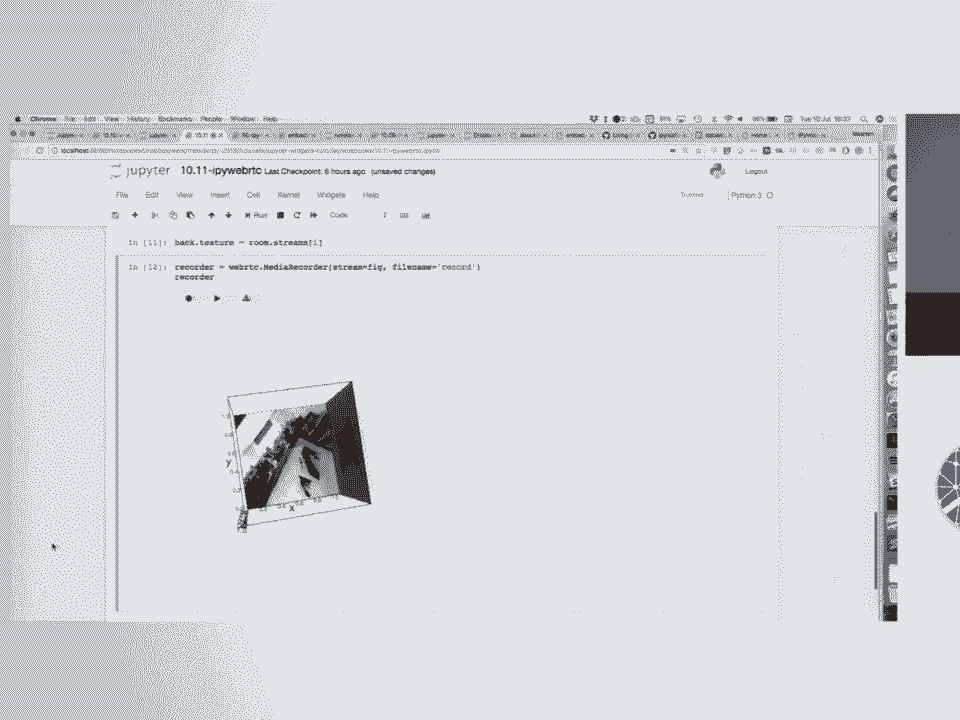

 And that's all I wanted to say。 Do you want to continue？ Sure。 That's a hard act to follow。 Thanks。

 [inaudible]， Okay。 So I just want to emphasize again。

 everything you saw there was using ipi widgets to synchronize between the front end and the back end。

 And the power of that， so we were teaching you some tools for interacting with changes with ipi widgets。

 for listening to changes， to running your own stuff and affecting other things。

 and setting values that would then be propagated to the front end， et cetera。

 And while it seems kind of like we're playing a little tiny sandbox with changing a slider and I set a value of a text box and stuff like that。

 the real power， the real cool parts of this come when you have a library like BQP。

 Or ipi volume or pi through JS or something like this。

 where you have a graph and the selection is being communicated to the back end。

 And you can listen to whenever that selection changes。 And when the selection changes。

 you run another model and you affect the 3D plot over here， et cetera。

 And so you can have these totally dynamic interfaces。 The reference controls。

 the sliders and text boxes and stuff like that are just really sort of pretty standard minimal reference controls for user interactions。

 But ipi volume and BQP。 And some of these other tools are really trying to push forward what's possible if you can interact with your data and have those interactions。

 then spawn further calculations that then come back and are visualized in other ways， et cetera。

 And it's really exciting to see not just the ipi widget sliders and check boxes and things like that being used to design interfaces。

 but to see each one of these tools that sort of is participating in a common framework to be used together。

 So you have a slider that controls a BQ plot and the BQ plot that you can select in the BQ plot and that controls the selection and a visualization in the 3D。

 which then controls a map， et cetera。 Like everyone's participating in the same framework。

 So each person sort of brings together a powerful platform， makes a powerful platform。 Okay。

 so I just wanted to show real briefly some interesting things you can do in JupyterLab with ipi widgets。

 Some of the capabilities that JupyterLab gives you and uses a demonstration platform。

 the ipi leaflet library。 How many people work with geographic data？ That's seismology， yes。

 some USGS people， et cetera。 Okay， so I'll show you some of the work that's been done recently。

 Martin， I think you worked on this and Sylvan worked on this。 I worked on it and other people。

 you've worked on it， right？ ipi leaflet？ No， okay。 You might work on it eventually。 Okay。

 and Sylvan's worked on it。 A bunch of people have worked on this library and tried to push it forward。

 The nice thing about this is that there's a ton of people investing a ton of time and expertise in designing nice libraries in JavaScript for the browser。

 And what we're doing is we're building on top of those shoulders to just wrap their nice 3D libraries。

 to wrap the nice webgl or the webRTC APIs to wrap the nice plotting libraries or the geographic libraries。

 and just expose those to this sort of interactive computation platform that we have。 Okay。

 so let me open up this example again。 I'll make this a little bit bigger。 Collapse the sidebar。

 Okay， so this is --， I didn't want to do that quite yet。

 So this is the ipi leaflet map that Martin presented。

 So one thing you can do is put the map right here in your notebook。

 and then as you do stuff with the map， you know， like zoom on it。

 This makes it interactive slider automatically。 Okay， that changed the map a little bit。

 I can clear the layers so that it's sort of blank again。 I can add another tile map on top of it。

 I can print whatever the current interactive state of this map is。

 but you can see pretty soon I'm getting to the point where it's scrolling up。

 And I'm trying to do interactive stuff to this thing that's living way up there。

 And so it'd be nice if I could sort of pull that output out so that I can have it sitting over on the side while I interactively work with that particular output。

 And Jupyter that makes this really easy。 You can just right click， create new view for output。

 And what this does is it copies this output to a new tab。 And it's exactly the same output。

 It's exactly the same model。 It's a new view for this -- for the model。

 So it's like rendering that map in two different outputs， except it's in a new tab instead。

 So you can see as I change one， the other is automatically affected because they're both talking to the same model。

 So the nice thing about this in JupyterLab though is I can put it outside it and then I can keep working here。

 And as I work with it， I add a marker。 So there's my marker that I added。

 I can change the opacity using a slider， et cetera。

 And now I really have this interactive feel here。 I can pull it out， keep it over the side。

 and start working with it。 Kind of like you would do like a map podlib plot if you were doing the interactive map podlib plots or many other sort of workflows where you pull it off to the side。

 And now you're going to sort of work with that object all throughout your notebook。

 So that's one way to do it。 To do this， right click， create new view for output。

 Another thing that Sylvan Corley recently did was to make a new widget called a sidecar widget。

 So in JupyterLab we have these sidebars。 There's a left sidebar。

 There's a right sidebar you can't see。 There's nothing's in it。

 But basically it took an output widget and instead of putting the output widget in the output area of a notebook。

 he's threw it over to the sidebar。 And so as an example of this， let's go back up here。

 Here's this import from this new sidecar widget。 So what I'm doing here is I'm creating a sidecar。

 Yep。 Is that better？ Okay。 So I'm creating a sidecar and giving it a title。

 Let's do that in one cell。 And what it is， pop it over here on the right sidebar。

 So this is very specific to the JupyterLab interface。 And this is an output widget。

 So anything I could do with output widgets， anything I can print or capture or errors or whatever。

 appear now on the right hand side。 And I can clear the output。

 It's literally just an output widget that ends up appearing over on the right hand side。

 And so let's see。 I already ran that line。 So I can make a slider and I can display that slider and it appears in the sidecar。

 So this is similar to that create a new view for the output and have a tab I can move around。

 But it just throws it over there。 I can create a new sidecar。 Sidecar output too。

 And it just appears in a tab over here so I can switch between the two outputs here。

 And here's another one with another slider， et cetera。 So again， this is a very nice， easy way。

 And it doesn't have to be sliders。 It's a normal output widget。 So with sc， print， hi。

 I can put any output I want down there。 Let's see if that went to this one right here。

 So it's really an output widget。 I can log errors。 I can do whatever I want。

 And it throws it over to the sidebar。 And then of course I can collapse the sidebar just by clicking on the tab there。

 Okay。 So this becomes really powerful again when I'm working with something like a map or an interactive widget where I have some output that I want to keep on the screen。

 as I work through the notebook。 And so for example here I'm going to create this map。

 put it over in the sidecar。 Let's delete and let's close some of these other sidecars by clicking on the X's。

 There's my map。 And notice the map actually resizes to be the full size of the sidecar。

 And again I can interact。 And you see that it's changing the actual sidecar there。 Go to the layers。

 add a layer。 I can get information from the map。 And if the person changes the map。

 I can get the new information， the new center， the new zoom， et cetera。 Okay。

 So now I'm going to show you some things that you can do with the IPILIFLIT。

 But in this nice framework where I have this map over on the side。 So I create a marker。

 I can change the interact。 I can change the opacity just by programmatically changing the mark。

opacity。 Or IPILIFLIT has a nice feature where it's kind of like the interact feature in IPILIGITS。

 where it can automatically make a GUI for any particular attribute。

 So here I'm making a GUI for the opacity attribute for this marker。 I can make a pop-up。

 So here's an HTML pop-up。 I'm going to add it to that particular mark。

 And now when I click on that mark， I got a nice little pop-up。 I got a cluster marker cluster。

 So if there's a ton of markers on the map， if there's too many markers， it just gets overwhelming。

 And so if you zoom out a lot， it sort of combines markers into this sort of cluster object。

 And then I can click on the cluster object and it zooms in。 Let's see the actual markers。

 And I can pull those off the map。 Let's see。 I can overlay an image。

 IPILIFLIT on interactive computing。 This is， I think。

 essentially how the VEX works where you overlay a heat map for it。 Okay。 Here's a polyline。 Okay。

 So a polyline is a， you know， just some drawing that I'm doing on the map。

 I can set the fill on opacity， et cetera。 I can take it back off the map。

 So I can really sort of interactively work with this map， programmatically work with this map。

 Notice here what I'm doing is I'm making a polygon for the bounds of the current map。

 So then I can zoom out so I can see exactly what people are looking at and pull it off。

 Here's another example， a rectangle。 You can see the rectangle was at the bounds of the map。

 A circle。 Here again， I'm making an interactive control for this particular circle。

 So let's zoom back in。 So there's my circle and I can change the weight， change the opacity。

 et cetera。 You get the idea。 And I can query stuff from that circle。

 There's a particular idea associated with the circle。 I can pull it off。 I can examine the map。

 see what kind of layers I have on the map。 Look at the circle。 Let's see。 Circle marker。

 So you do lots of， lots of marks on the map。 I think you get that idea。

 You can do more than just programmatically put marks on the map though。 Let's go to this example。

 So let's pull this map off and let's get that side card code from over here。

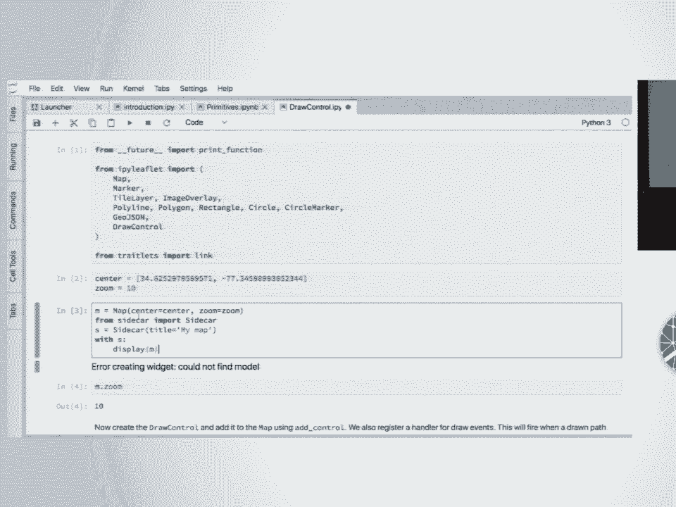

 Here's my map。 And here's my zoom level。 So what I want to do is I want to instead of programmatically add stuff to the map。

 I want to actually draw on the map。 So I'm going to add a draw control。

 So you see I have standard polygons， lines， et cetera。 And then as I draw on this map， so man。

 you know， really want to investigate this or I want to somehow interact with this。

 So there's a polygon。 And now this DC thing， this draw control is a widget。 And I can see。

 query it what the last action was。 And I can actually get the coordinates of that drawing point。

 And I can listen to the drawing points as well。 So if you want to trigger something。

 anytime somebody draws on the map， you get the coordinates and you can do all sorts of analysis。

 et cetera。 You can clear any sort of polygons or anything that's on the map。 You can draw。

 you can synchronize the two things。 So here I'm drawing whatever I drew on the one map。

 Now I'm creating a new map and putting that same polygon on this map， et cetera。 So again。

 I have interactive controls for geographic information。 And I'll show you one more。 Yes， question。

 Yes。 >> [inaudible] >> Good question。 Good question。 I'm not sure。 But we can find out。

 We can find out。 As in， can I pick a specific longitude and latitude here without just eyeballing it？

 >> Yeah， without eyeballing it。 Because I'm thinking， you know。

 I have a bunch of roads saying that I'm working for a mine that could possibly be in North America。

 It's an open pipeline。 And I want to examine some of the net operating hours of trucks may happen when they're going across in a road。

 But I want to pick the power。 >> Right。 So can I actually pick the X-Y coordinates and match them to GPS coordinates that I may have stored when the trucks are ready back and forth？

 >> Yeah。 Good question。 Since you can programmatically also do things。

 you might be able to pick something and then translate that in Python。

 Like do that calculation in Python and then programmatically put the line or something that you want on the map。

 Like you have the full power of your Python libraries to be able to deal with this interaction。

 But good question。 And let's hook you up with the people that understand the mapping part of this better than I do to see what's possible。

 I'll just show one more because it's a pretty demo。 So this is adding a velocity map。

 So here I have a map。 And let's go ahead and create a new view for this map so that we see it over to the side or maybe down below。

 All right。 And I'm just going to open up a velocity field and whoo。 And sec。

 I'll replace my notebook with that because it's so beautiful。 Yeah。 So again， IPay widgets。

 additive velocity map and I get it just stare at it mesmerized for a while。 So again。

 the emphasis here is like when we say interactive controls and we talk about a framework for having user interaction automatically synced up to kernel side state and actions running triggered based on state changes there。

 And reflected back to the user interface like really， you know。

 go wild and let your dreams come true as far as like any sort of interaction。

 We're talking about here， not just sliders and text boxes or anything like that。

 Anything where it's interesting， you have an interesting user interface where you can interact。

 push those changes to Python automatically do whatever computations you want。

 triggered from those interactions and the push changes back to be visualized on the browser side。

 Okay。 Questions。 All right。 What's next Matt？ Oh， yes。 Right。

 So next is what if you want to do this stuff outside of the notebook and we've got you covered here。

 So during the transition， there are a couple notebooks to see up here that are not in the repository。

 They were stuff that we didn't know would be ready。 If it would be ready to share or not。

 we will get those uploaded later this week。 So。

 So the basically comes back to the question you had for the rendering it， rendering a notebook。

 So there are actually two parts。 So let me go back to this on this plot that I showed you before。

 Let me first do this。 So this is the same plot。 So I have here the defectors and the sliders。

 And what you can do in a classical notebook， it's not just in JupyterLab。

 So go to widgets and bet widgets。 Copy to clipboard。 So that's， let me show this again。

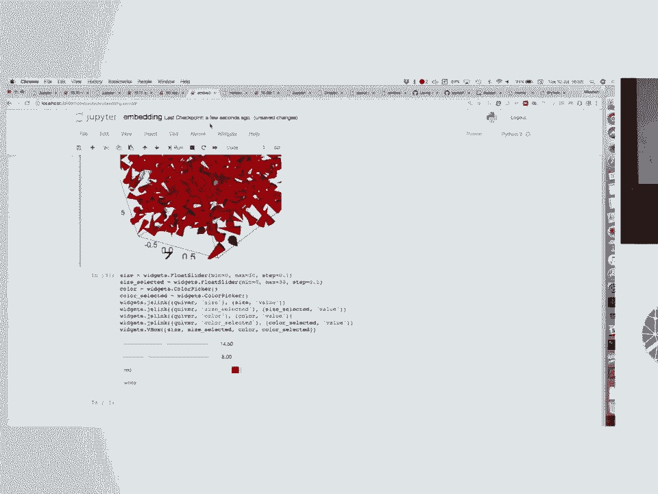

 So this is an HTML snippet that contains the whole state of this of the widgets that you see。

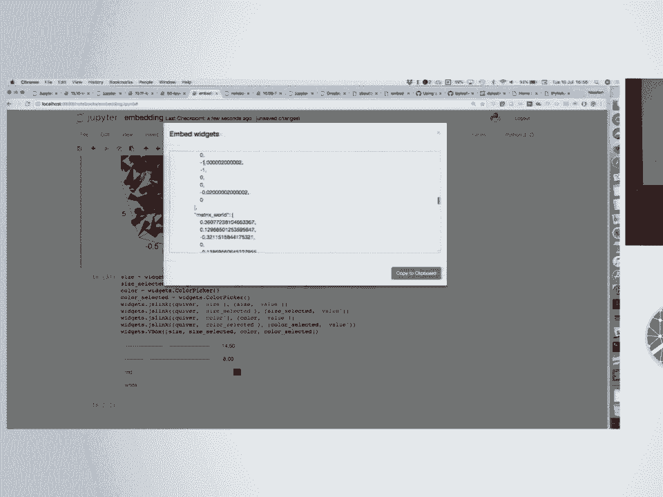

 Copy that to clipboard。 Paste this into an HTML file。 Save it。 I edit it now。 And you have it here。

 So I showed you programmatically and I by volume you can do this。

 but there are ways to do this this way as well in the classical notebook。

 And what you can also do if you do widgets， save notebook widget state。

 Now the widget state is embedded in the notebook。 Which makes your notebooks really big， by the way。

 So you can already do this。 You upload this to say get up and adjust。 Which is this one。

 So you see get up doesn't render this for security reasons。

 But if you go to MB viewer and this is the URL of the notebook。

 you see that it renders the notebook。 Notebook in here。

 But this does not have a backend connected to it。 So how do I show this？

 So the example that I showed you with the map， with the taxi data。 So this is really short。

 What's important is that in the end you have a Python script。 And it has a variable called map。

 And that's the final widget that we're going to display。 So if you use。

 let me increase the font size。 No， that doesn't work。 So if you install iPad widget server。

 This is the module name。 This is the widget variable name。

 It starts up a special kind of Jupyter notebook like server that has a special kernel that cannot execute arbitrary code。

 Just that piece of code and show you the widget。 So you go to localhosts。 And I hope that it works。

 And now the example that we had in the notebook， you can have this in on a real server。

 And you can like of course change the HTML。 So just to show that there are like ways to get it out of the notebook。

 So there's not a project that I started using Flask。 There's not as mature as this。

 But if people are interested in that， let me know。 So a question。 >> [INAUDIBLE]。

 >> So you mean this？ So this， let me do another example in port。 >> [INAUDIBLE]。

 >> So now you have a， let me close something， widget server。py。

 which is a Python module that can be imported if you're in the same directory。

 which it underscore server。 And now you run ipay widget server， the module name。

 which in this case is widget server without a dot by。 And then slider。 Yeah， some exception。

 Apparently not so important。 And then you can render any widget。

 And this widget couldn't be an H box or a V box。 It can be a whole user interface。

 But now there's a connected kernel。 So it's really， you can execute Python code。

 Like basically what you have in the notebook， but without the whole notebook interface。

 And what's important is you cannot execute arbitrary code unless a special value of this will do Rm minus Rf。

 Still a nice or something。 But you really have to do like actively make it execute code。

 And this kernel can't do that。 So it's pretty safe。 Yeah， another question。 >> [INAUDIBLE]。

 >> [INAUDIBLE]， >> [INAUDIBLE]， >> Jason。 >> [INAUDIBLE]。

 >> So what in ipay widget itself or Jupiter widget I should say the front end code for all of this。

 As far as we know there's no way to execute arbitrary code。

 So we don't do like evil and people can put something in the text box。 So it should be pretty safe。

 But yeah。 >> [INAUDIBLE]， >> Good。 >> More questions？ Yes？ >> [INAUDIBLE]， >> [INAUDIBLE]， >> Well。

 I mean， it's really nice actually that there's quite some competition between browsers。

 So I think there are really like everybody's trying to catch up with each other。

 And I think now Firefox has a lead。 I think that the main browsers are all fine。 I didn't see。

 at least from the performance point of view， I didn't see any major issues。

 Maybe you have some more to say about this。 We're just anecdotal like feeling more than any measured。

 >> [COUGH]， >> It must be different。 I think， I mean。

 there are minimum browsers that we support and we don't support IE9 for example。 And I think IE11。

 we support in the classic notebook。 >> [INAUDIBLE]， >> Yeah， Chrome works。 Actually。

 everything that I， so I usually use Chrome for development。 And if I try it out on my phone。

 I believe it's the same code base。 So everything seems to work。 At least on Android with Chrome。

 So about the dashboarding。 So there is， that's Thursday。 Really？ This time？ Okay。

 There's a bunch of feather session on dashboarding。 So if you're interested in that。

 want to like brainstorm， feel free to join。 >> Yes。 >> Got out like， see like， so。 >> [INAUDIBLE]。

 >> So， action can like， and like。 >> [INAUDIBLE]， >> Cross filter。 >> Used a lot in these like。

 types of visualizations。 Are they like， part of the， do you， do you， like， cross filter。

 almost when， like， here， like， like， interactions and like， one charge change that like， like。

 another charge。 And also like， when I programming， like， I'm trying to， I can like， slow， do。

 do that。 And then， I'm trying to， like， do individual pieces relatively， like， and I like。

 wanted to do those like， but I'm not seeing a blue blue。

 but I'm trying to set them all to that kind of like， show how you get， like， interaction from the。

 like， HTML back to the pipeline。 >> So， so the question was about like， filtering and。

 and if I understand correctly， so you have a plot， you do some， selection here and how to show that。

 So， I think there's some work to be done on this。 So， let me show， I hope this works。 So。

 does this work？ Yeah。 So， in， I pat volume， you can do like， selections。 So now。

 it's selected these。 And so， let me show you。 So， that actually gives you an array of the indices。

 Well， it's actually a double array。 There's a bug。 This is my development version。

 But you can link this。 So， let me continue。 So， now I have the same， so I have a 2D plot。

 and a 3D plot with the same data。 Okay。 I didn't import this。 I did this here for some reason。

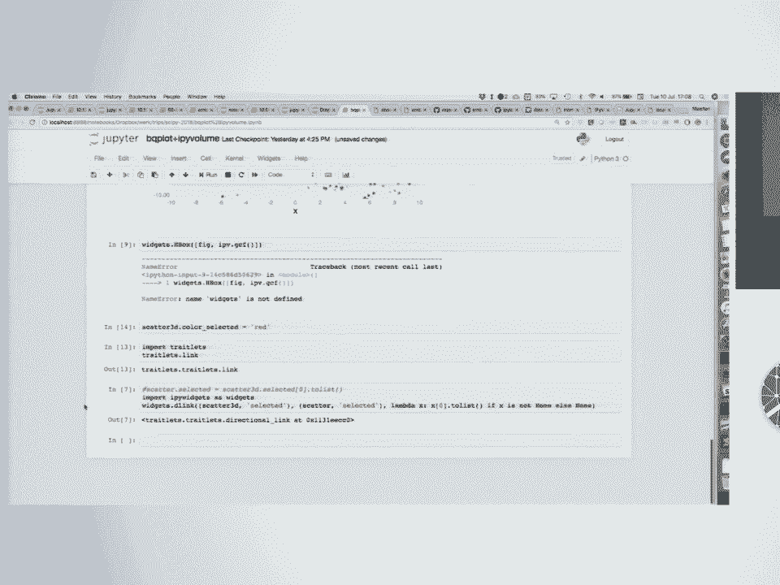

 And you can link， here I do a D link， which is directional link。 So。

 anything that's my selected in the scatter 3D， get synced to this scatter， the 2D scatter selected。

 So， in the D link， you also have a transform method that takes， like this data set。

 that's the advantage of doing the linking also on the front-end。

 is that you can do a calculation with it。 So， you can do some transformation。 So。

 I converted to a list because BQ plot actually wants it to be a list in this case。

 And now I can do selections。 And these are synchronized between the 2D。 So。

 I think there's more work。 I think this needs to be。

 we need to define like how to do this also on the front-end。 So。

 it can all be done in the front-end。 So， once you have like saved this to a static HTML on your tablet。

 you can do selections， and it doesn't have to go through a front-end。

 And we also need to define like a hovering picking。 So， if I click on a particular value。

 I also want to show it。 And if I hover over a particular point。

 I also want to see it in all the other plots。 And also plotly just recently。

 I'm not sure if they converted， but they at least embraced widgets。

 And they probably have their own way as well。 They put some energy into defining how to do this。

 And it would be nice if all the libraries would like have some common API or format to communicate this in the front-end。

 So， yeah， there's some work to be done on this。 But it's already possible now。 Thank you。 Yeah。

 Jason。 I'm a little bit interested in this。 Well， I'll give you the my class figure answer。 Okay。

 I assume you were going to talk about like events。 I mean。

 should be something in BQ Potter's option。 Yeah， there is a hover。 There is a hover。

 I think there's a hover handler in BQ plot。 I didn't show you。 Is this on？ Okay。

 We didn't show you the example in IPython leaflet that lets you catch the coordinates that the mouse is hovering over and you can react to those like in real time。

 They're sent back to the back-end。 And IPython events is your escape hatch。

 Should we advertise this or not？ I don't know。 So， in January。

 Matt and another person named Kaya decided that they wanted the full JavaScript interaction paradigm all JavaScript events available kind of like。

 you know， we let you set classes and then you can push whatever JavaScript or CSS you want over。 So。

 Matt and Kaya made a widget that lets you register a handler for any JavaScript event。

 including hover。 Right？ Oh， we don't cover hover。 It's mouse。 Oh， mouse events。 Okay。

 Mouse move events。 That's why I don't know the mouse moves in BQ plot。

 You can hover over something in BQ plot and have it change。 Okay。

 And I think you get that value in the back-end。 So， it's certainly possible。 Right？

 Any interaction paradigm you have in the front-end， you could push to the back-end。 The question is。

 you know， how much do you want to push to the back-end。

 how you supposed to push to the back-end and stuff。 And some libraries let you do that。

 Like IPython leaflet， I'm pretty sure BQ plot。 And I think Matt's widget essentially allows you to tap into the mouse events over anything。

 over any widget。 All right。 So， what's going on from that？

 Is it possible to get like mouse and keyboard events without hovering over a specific widget？

 But if you wanted to change the widget， it was focused based on keyboard events。 Okay。

 Matt's going to show you his。 There's the skate packs here。 So。

 it's not clear this is actually a good idea。 Yeah。 That's the big thing。 But I will say。

 you have problems with the browser and key events and focus。 Right？

 The browser won't -- you have to worry about focus issues when you're dealing with key events and events in general in the browser。

 So， we're limited by whatever the browser allows， obviously。 Do you have an example， Matt？ Well。

 you know， just in case this happened， I made sure to load up this page and I'll upload this later。

 Let me --， Right。 So， this was originally written for the purpose of being able to mouse over an astronomical image。

 zoom in and out of it， get pixel locations off， and transform those into positions on the sky。

 In that kind of thing， it hasn't worked out so well yet。 But -- so。

 I made a widget called the event widget。 And the event widget can watch for DOM events or browser events on another widget。

 So， in this example， I've got a label that you will be able to interact with by clicking or pushing a key down or when the mouse enters。

 The widget space and I've got a HTML widget to display the event info。 So， if I mouse --， Oh。

 this is awkward。 That's not working。 Oh， I didn't -- I didn't include -- I didn't install the lab extension。

 Let me flip it to classical。 [ Pause ]， There we go。 So， when I click。

 I just grabbed all of the events at the browser normally returns or all of the attributes at the browser normally returns。

 Get returned as Python dictionary back to Python。 You get different information for key presses than you do for mouse events。

 It doesn't make any sense to have a pixel location for a mouse event， for example。 Yeah。

 keyboard event rather。 If you add a new view， then if I press a key in that view。

 I get the event set back to my widget and you update the value。

 You can get a list of the available events。 Turns out for mouse events。

 there are several different versions of coordinates that can be returned。

 I don't honestly understand all of them。 [ Pause ]， They were there。 Why not return them？

 It was harder to take them out。 I've got a link to information about them。

 You do need to be careful with this sort of stuff， so you think， okay。

 I want to catch a double-click event。 A double-click event is a series of several events in the browser。

 You have to be a little bit careful what you're watching for。

 because if you're watching for clicks and double clicks。

 you're going to get two click events and a double click for every double click。 Today。

 there's some explanation about the different types。 This is the one that really drives people crazy。

 You can turn off default interactions。 For example， let me go back up here。

 One of the keyboard shortcuts in a Jupyter notebook， I'll just overwrite it。

 is that if I push the A button， it gives me a new style。 Not anymore。 If you're over the widget。

 it doesn't do that。 I felt that was necessary because you don't want to accidentally push DD over your widget。

 or you're interacting with it， and have it disappear because the notebook interpreted that keyboard shortcut。

 You can turn off some of the context menu stuff， at least in classic notebook in Jupyter Lab。

 It doesn't work。 It's about 5。25 anyway。 It's 5。20。

 We wanted to make sure we leave some time at the end for whatever questions you have。

 or if you want to play with any of the stuff you see in the last hour for the next 10 minutes and ask those questions。

 You get to the point with this， where the question is whether it's easier just to write the JavaScript。

 and write a new widget， and write the JavaScript to do what you want， and package that up。

 versus trying to push all of your code from JavaScript over to Python to handle all of your interaction。

 If it's simple interactions， you want to be able to click on an image。

 or click on some widget in your interface and have something happen， you do that， this is useful。

 It's turning out not to be that useful for an image browser。

 If you're doing all of the calculation on Python， you have to keep pushing images back and forth。

 Other questions？ Yep。 [ Inaudible ]， Got the mic。 [ Inaudible ]， Okay， so there are updates coming。

 IPAs widget 7。3 is -- we held off on releasing it。

 so we didn't want to destabilize everything for this week， so 7。3 is in pre-release right now。

 and one of the big things that has a grid box in control is that the laythings out in a grid。

 But you asked about something specific。 Asynchronous widgets。 Asynchronous widgets。

 What do you mean by asynchronous widgets？ [ Inaudible ]。

 So you can -- there's various strategies for handling separate threads and widgets。

 There's a notebook in the documentation for some patterns for handling separate threads with widgets。

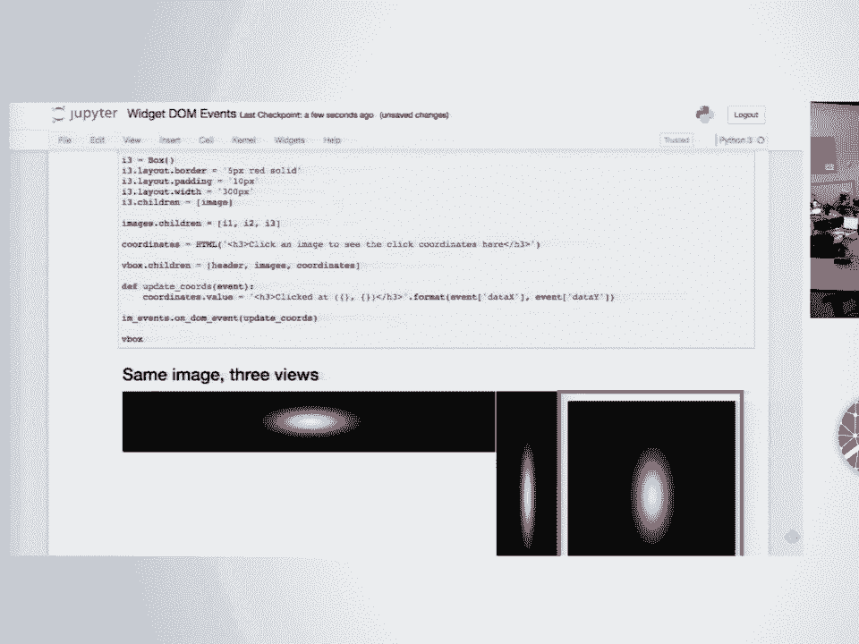

 We're in a sense fighting some issues with the notebook itself and dealing with threading and output and things like that。

 But those are avoidable。 We can overcome some of the issues that we're fighting with there。

 But you should be able to do some of what you're thinking of right now。

 I'm not sure if we're going to be able to do the full aspect。

 But I guess as we can do what you're describing right now and check out the documentation for the asynchronous widgets documentation。

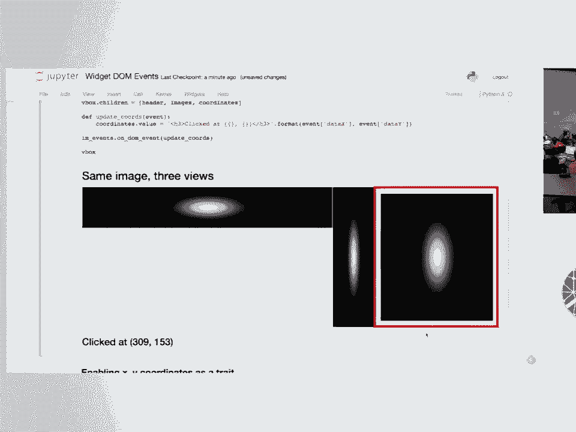

 [ Inaudible ]， Everything's thread safe， so you can change trades from any thread。

 It's thread safe because we have a global interpreter lock and Python。

 So everything's thread safe there。 Yes， we're pure Python。 So we're good。 [ Inaudible ]。

 None particularly， but we're interested in having conversations with whoever wants to talk to us about it。

 More questions？ It looks like you got something working。 Well， I mean， yeah。

 I copied the image file over。

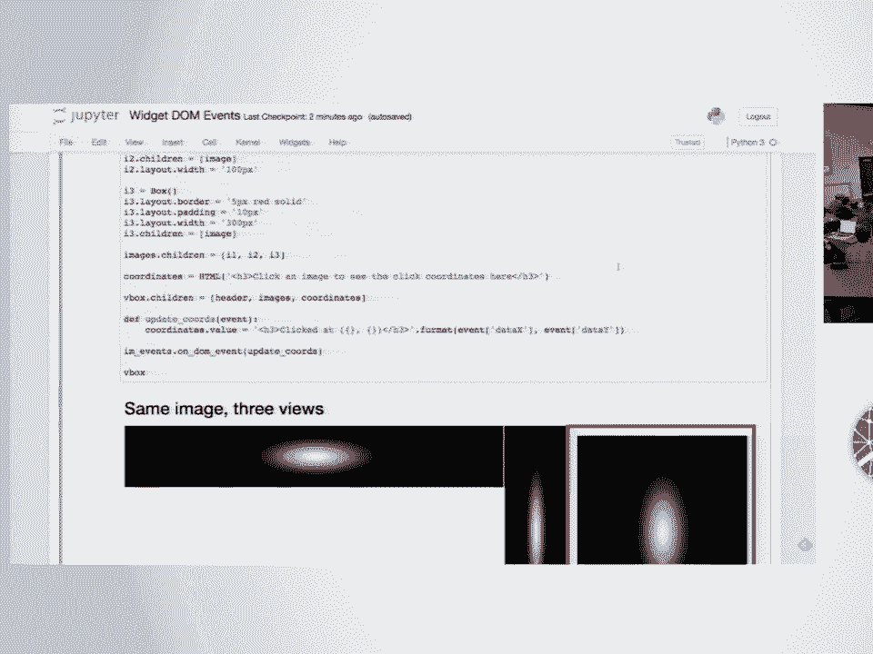

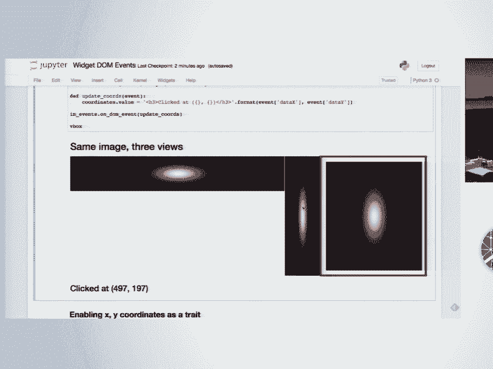

 So you click and you get the mouse coordinates of the click event back。

 You can also get those back as properties and it's possible to monitor the mouse。

 Let me see if I have it open。 No， I don't。 You can also monitor the mouse position and return that as you move also。

 So I think just to wrap up， we have the birds of feather session on Thursday for dashboarding and web apps。

 We have several talks dealing with widgets like Martin pointed out his talk on Friday。

 There's several other talks about widgets that you're welcome to come to。

 We'll be around during the conference if you want to stop by and chat about widgets。

 And another great time to get together is JupiterCon。 JupiterCon's August 21st。

 3/25th in New York City。 And a lot of Jupiter people will be there。

 And there's sprints this weekend if you want to work on widgets or you want to work on some project based on widgets or whatever or work on your own projects。

 And are you going to be there？ So Matt will be here for the sprints。 So is there anything else to？

 So we don't officially end up 5。30。 We'll be here。 I'm sorry。 We don't officially end up 5。30。

 We'll be here until 5。30。 But rather than trying to cram three more examples into your brain in the next seven minutes。

 we'll just stop now。 And if you want to play around with stuff and ask questions， we're here。

 And if you want to ask when is dinner， that's a great question。 We can go。 Or whatever。 Yeah。 Okay。

 All right。 Enjoy the conference。 [applause]。

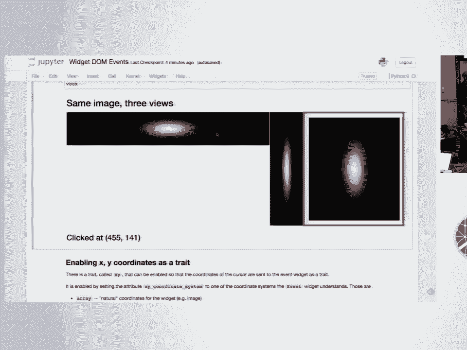

 [BLANK_AUDIO]。