# SciPy 2018视频专辑 - P70：SciPy 2018视频专辑 (P70. The Sheer Joy of Packaging _ SciPy 2018 Tutorial _ Sarahan, - GalileoHua - BV1TE411n7Ny

 Hello everybody。 Thank you for coming。 Thank you for your excitement about packaging。

 We have a wonderful team up here to give you a tutorial of packaging today。 My name is Michael。

 Sarahan。 I work for Anaconda on condo build stuff in particular。 My name is Chris Barker。

 I'm an oceanographer at NOAA but do a lot of software development and I have to deal with a lot。

 of packages。 My name is Luke Fermanas。 I mostly volunteer with Conda Forge and。

 I also do a lot of packaging。 My name is Jean-Christophe。 I work at Kiteoia。 I work on a medical。

 imaging platform named Pretty Sliceo and also work on a python packaging， psychic build。

 psychic CI and I spend quite some time working on the system。 My name is Matt McCormick。 I also。

 work at Kiteware。 I do a lot of building and packages and distributing platforms。 Jonathan， Helves。

 I work at Anaconda。 I work on the distribution team， make a lot of packages and， a lot of them。

 Great。 Thank you everybody。 Mostly what I want to emphasize is nobody on this team。

 came into life as a software engineer that I know of。 We all came in as scientists people。

 and packaging was so painful that we all got really good at dealing with it。 And so what we're。

 hoping to do today is to share with you some of that the knowledge that we've accumulated from。

 fighting with things。 And so with that， I think I'm going to let Chris。 Yeah。

 Is it a title I have on it？ No？ I'm going to say it's perhaps more than a little tongue in cheek。

 but I have a personal joy in this and I think other people do。

 It's like solving puzzles and you get， better and better at solving puzzles and you hit the same kind of puzzle each time and it gets。

 easier and so building those muscles is fun。 But yes， this is an exercise in beating your head。

 against the wall and I make no illusions about it。 Yeah。 If you're enjoying moment work。

 you're very frustrating when it doesn't。 Great。 So if you guys have any questions， raise your hand。

 Will the people who are not talking will come around and help you out and if we think it's。

 important enough to tell everybody about， we'll get the speaker to talk about it。 So Chris， please。

 get us started here。 Thanks。 Okay。 Okay。 Just quickly， we're through the agenda here。

 We're going to sort of talk about packaging， in general， specifically Python packages。

 then talk about how to build packages and upload them。

 to PyPy and deal with all that kind of stuff and deal with binaries and whatnot and then get into。

 conduct packaging as another alternative。 And where did I put that next？ Yeah， there we go。

 I had another tab for a reason。 I'm actually missing。 Where did we put the getting setup？ Ah。

 here it is。 Okay。 So this is what you all want to do now。

 So there is a repo for this tutorial on GitHub。 And if you go there。

 you'll be able to get access to all the slides or also publish this GitHub pages。

 And there's also example code and stuff in the repo。 So if you clone that repo on your machine。

 somewhere early in the talks， you'll be ready to roll。 So I'm going to pause for a moment。 And。

 so you can get there by going to this bit。ly link。 So it's bit。ly， joy of packaging。

 It might be case sensitive， so I would do it。 Yes。 Thanks， Jonathan。

 That's why we have all these people here helping out。

 So this is GitHub repo and then actually linked from the repo are all these same materials rendered。

 as HTML。 So we're going to be picking up here。 So you might want to follow along。

 on the HTML version and that way you can sort of cut and paste examples and stuff if you want。

 I never know how to switch to another window。 All right。

 So is everybody either already in process on the GitHub page or actually is anybody not in。

 process and that is still lost？ Okay。 Great。 Thanks。 So really broadly。

 I'm going to kind of dive in about， we talk about packages a lot， so I want。

 to kind of get into what it is。 And so really a packaging you can install with your package。

 manager， which is a nice recursive definition。 In the Python world， the word package is used。

 in two related but different ways。 A particular sort of set of files on disk is a Python package。

 as well as being a package that you can manage with your package manager and pip install and。

 things like that。 So there's a lot of package managers out there。 Some of them are kind of。

 focused on the operating system like apt and yum and homebrew and whatnot。 Others are focused on。

 particular languages like MPM and Python's pip。 And then these are all generally connected to。

 repositories of packages where people publicly put up stuff that you can get at。 Things like， pipy。

 anaconda。org and crann and CPAN and all that。 But the thing about all package managers is。

 that they have some kind of dependency manager and they have a repository where you can sort of。

 put these artifacts that represent the packages。 And the whole idea here is so that you can just。

 install something and it will work。 So if it has dependencies， it depends， these will get。

 installed for you。 If it needs to be built in some special way for your system， it's ready to go。

 But essentially packages can be in kind of two types。 They can be in source form and then they。

 can be binary and ready to go。 So focusing on Python， because Python is a dynamic language。

 the distinction between source and binary packages gets a little bit blurred because for pure Python。

 you don't need to compile it or anything to run it。 So a source package and a binary package that。

 basically behave about the same way。 On the other hand， if there's compiled code involved in that。

 package for Python extensions or calling into C libraries or things like that， then building from。

 source can be a serious challenge。 And this is why we have binary packages。 Because of course， if。

 like pip， for instance， if you just do pip install some package and it finds a source package on pipy。

 it'll bring it down to your machine and try to compile it for you。 And if it's pure Python， that'll。

 probably work。 And if it's not， then your system needs to be properly set up with compilers and。

 libraries and all this stuff。 And sometimes packages are really big and take a long time to burn。

 So that's why we go with binary packages。 So binary package is a whole collection of code。

 artifact that's just ready to run on your system。 So that's great。 You just install it， you go。

 But the problem is binary packages tend to be platform independent。 I mean， almost by definition。

 they are。 And also， they may in fact depend on other dependencies that they're expecting to find in。

 your system that you may or may not have。 And then， so it's like， how do you manage all this。

 especially if the dependencies aren't actually in the same language as your library？ So。

 widely in the Python world， most people are using PIP， which is kind of the official Python。

 package manager。 It pulls packages from pipy， which is the official Python package repository。

 It'll handle source and binary packages。 But it's really only designed for Python。 So if you are。

 working and a lot of people here at scipy are might also be working with are or some C library or。

 something。 PIP isn't so helpful there。 Which is why Conda was developed and Conda is very widely。

 used in the scipy community in particular。 It finds its packages on a Conda。org。 Conda package is。

 just a binary artifact。 It's ready to run。 It's not the source code。 It may have source code in it。

 but it isn't the source code itself。 And the nice thing is it supports Python very well。

 but it also， supports C， Fortran， R， Perl， Java， potentially it can support anything。 And in fact。

 Conda can， manage the Python executable itself。 And then in contrast to this。

 our OS package managers， so Linux， all the Linux distributions have their own package management system。

 OS X doesn't really have one， but there are home brew and Mac ports and SPAC that can be used with that。

 And then with Windows， there's chocolatey and say we analyze other systems。

 And a lot of those will handle Python， packages， but it means somebody who develops in that system with that package manager has to have。

 made that， done that job。 And so we're not kind of talking about those solutions， but your OS may。

 have done it for you already。 All right。 That's the quick overview。

 So let's talk about Python packages， is really what we're about here at this conference。

 So let's talk a little bit about making a Python， package。

 So first I have no idea what the background is at all of you。 So how many of you know what it。

 means to have a directory with a dunder。py file in it？ Okay。 So that's most。

 I'm going to run through， this kind of quickly。 So Python we talk about modules and packages。

 A module is a single name， space， usually a single file， something else is just a Python file。

 something。py。 And it can have， functions， constants， class definitions， anything that is Python。

 And a package is essentially the， same thing。 It's a module except that it can be a module that can hold other modules as well as。

 other sub packages。 And the way packages are usually handled is you have a directory with a， dunder。

py file， like I just mentioned。 So basically if the directory has a dunder。py file in it。

 then Python will recognize that as a package and you can import it。 And then if there's another。

 directory inside that that also has a dunder。py file， then it can import that as well。 The dunder。

py file has to just exist in order your thing to be a Python。 There doesn't have to be。

 anything in it。 And often it actually is empty。 But at other times， especially at a top level。

 package， it'll at least have like a version number and a few things like that and maybe some names。

 that you want imported。 But all the code that's any， if there is any code in dunder。py file。

 that's what gets run when the package gets imported。 So when you type import a package。

 it's the code in the dunder。py file in that directory that gets run。

 And then you will have that name in that package namespace。

 Now if you have a module within a package， then a package。moduleA from this previous example here。

 this is a module sitting inside that package， will not be automatically imported。

 So you can directly import it by saying import a package。moduleA。

 And this is where we get into all the Python's flexibility with you can do from a package import。

 module A or import a package。moduleA as some other name and all these other ways of importing。

 So how does Python know how to find your package？ So you've set up this directory with this stuff in。

 it。 And the way it does that is it's got keeps an internal list of places to look for packages。

 called sys。path and this gets populated automatically when your Python starts up。

 And you actually have access to that and it's actually just a Python list that happens to have。

 a bunch of paths in it。 So you can write code that goes in there and manipulates sys。path and。

 goes and adds another directory to it so it can then go find your modules。 But you really don't。

 want to do that。 And another note when you go to import a module is it'll have a dunder file name。

 in it which will be the path to where that file actually lives。 So sometimes you can kind of play。

 around with that to find stuff。 >> I can interrupt you for just a second。 >> These do。

 >> If you guys have ever heard of problems with Python path， this is why。 And so。

 when it does it monkeys with that search path。 And if you have stuff that is like too complicated。

 or the wrong version or something like that on Python path， it'll interfere with things。 It'll。

 be incompatible and stuff will blow up。 >> Right。 So how do you actually go and make a package？

 All right。 Well， first of all， why？ Part of it is there's a lot of tools out there like PIP and。

 what not that help you work with packages。 So if you make your own code into a package， you'll。

 really use those tools。 And also if you might have code that you're just using yourself， but if you。

 ever wanted to give it to somebody else， being able to make a proper package out of it is an easy。

 way to distribute it to other people。 And that might be for public distribution on PyPy or Condaford。

 or something or it might just be giving it to your co-worker or even yourself on another computer。

 So what actually is a package？ Well， it's a collection of modules。 And this is now getting into the。

 larger definition of package。 Not just a directory with a dunder。init file。

 but a full proper package， that you might give to somebody else or put up on PyPy has modules also documentation and also tests。

 and also top-level scripts。 Maybe if you're writing a command line utility， any data files it needs。

 and a way to kind of build and install。 So Python for a very long time has come with the。

 distutills module， which is a distribution utilities。

 And it lets you set up build packages and distribute， them and stuff like that。

 But it's getting pretty clunky and hard to extend。 And so quite some years， ago now。

 setup tools came on as a third-party package。 And it's now still a third-party package。

 but it's very tightly integrated with the Python community。 And for the most part。

 if you have Python installed， you will have setup tools。 And so it does the basic packaging stuff。

 that distutills does。 It also has features for auto-finding packages， doing handling scripts better。

 managing non-code files。 It has a develop mode so you can be installing your code directly from source。

 I'm going to talk about that a little bit later。 So here's some links for future reference。 You。

 can go check out。 I'm just going to move on to that。 So let's talk a little bit about it basic。

 When you go to setup a package， you want to set up a directory structure that looks like this。

 Most of this is convention rather than dictated， but it's a convention you really want to follow。

 At top-level directory， you usually have the name of the package and everything。

 and sits inside that。 And then traditionally， you've got a bunch of metadata files here。

 like license。txt and readmees and stuff。 And then you have the package itself。

 So these are all the kind of standard files that get included。 Changes， license， manifest， readme。

 And then the setup。py is a Python script that knows how to build your package。 And that's what。

 I'll be getting into in a moment。 The bin directory is where you put top-level scripts。 Some people。

 call that scripts instead of bin， but it has the same function。 And what's important there is that。

 the idea behind the scripts is if you're writing like a command line utility， you want people。

 anywhere that don't even know about Python to be able to run that command。 And so by structuring。

 it this way， we'll get into that in a second， those scripts can be made available。 And then。

 of course， the test directory is for your unit test。

 which of course you all have a complete suite of。 And so once you have unit tests installed properly。

 you can do things like install the package and， then import tests and run package name。test。

 run all or something like that。 You also sometimes， keep your test outside of the package。

 I've got some notes there you can read if you like。 There's a。

 lot of debate about whether you want your test in the package or outside。 Personally， it comes。

 down to me if it's a small test suite， I put it in the package and if it's a huge test suite。

 I keep it， out。 So let's get to the setup。py file。

 This is where you really both describe the package and how， to build it。

 And it's just a Python file。 So you can put any code you want in there， which is。

 a little treacherous。 But if in the simple cases， it essentially is a declarative file。

 But it handles versions， package metadata， tells you what the packages are， tells you what other。

 files there are， tells you what the dependencies are， and talks about extensions to be compiled if。

 there are some。 So this is an example of a relatively simple setup。py。 And this is what I mean by。

 being declarative。 You import setup from setup tools and then you call a setup function and you're。

 just passing in all these keyword arguments， which are all the information you need to run this。

 file。 So things like the name and the version and then there's sort of metadata stuff like author。

 and author email。 That's not required， but it's good to have。 And then this is important bar is。

 actually saying these are the package they want to install。

 This is the actual code that's going to be， my package。 And then we can have requirements as well。

 There's also a setup。config file， which uses an I&I style file where you can put essentially a lot of redundant information with。

 what's in setup。py。 But by putting in a config file， you can let your users kind of easily go in。

 and change configuration options and stuff like that。

 And it's some better way to put certain things。 I'm not going to get into much detail there。

 but it's good to know about。 Michael's got to be pointed。 Let me explain why that's better。 setup。

py is a file you have to run in order to make any sense of。

 That's terrible because you're asking somebody to execute arbitrary code to understand what。

 they're even going to get in the first place。 And so setup。config is a much better way of。

 specifying things in a way that people can parse it safely， but also so it's less flexible。

 But where it can work， it's much simpler to work with。 Right。 That's a good point。

 So in this example， all we're doing is calling the setup function。 So this is pretty safe to run。

 But this is a Python file。 You get an arbitrary code in there。

 and often there is all kinds of complex code that's doing configuration and fiddling around with things。

 So when you actually get a package， whether it's yours or you got it from somewhere else。

 what you want to do is run the setup。py script。 And you can do things like build a source。

 distribution from it。 You can build a wheel， which we'll be getting in later on。

 You can build the package or you can install the package。 And then there's my favorite。

 which is develop mode， where you do Python setup。py develop。 And I'll get into that a little bit。

 Which you can also get up by doing pip install。 And you may not be able to see that。

 but that's a dot， which means pip install， whatever is in this， current directory。

 And what pip does is looks for a file called setup。py。 And goes from there。 So I really。

 really love develop mode。 And what it does is it's basically putting a dot pth file。

 which is into site packages。 It's basically a link back to your source directory。

 So Python knows to go look in your source directory， for packages。

 And this is really nice because it appears to all the rest of the code， as though。

 your package is installed properly in Python。 But in fact， it's just sitting there in your。

 directory where you're working on it。 And that means you can write your tests and examples。

 and people can do stuff with your code。 You can do stuff with your own code just as though we're。

 installed。 But you also can be changing and working on the code and not have to reinstall it each time。

 So this is kind of the difference。 A regular install actually copies all the code into Python。

 site packages。 The development install just adds a pth file， which tells Python to go look in that。

 directory。 Installs use one created content packages。 We'll get into that later。 And the other。

 difference is that the development install always puts it at the end of sys。pass。 It makes it the。

 lowest priority thing。 So if there's two copies of the same one， the one that's properly installed。

 will be found first。 I think what a lot of scientists start out with is writing a script in a folder。

 like with their data。 And then they may copy that file around to other folders with data。 And what。

 we're really trying to instill in you now is a better way to consolidate your code and to version。

 it better and put it in one place， but to be able to use it in many different projects。

 So that's the key concept here。 We're trying to keep your code separate from your analyses。

 and be able to use it in your analyses。 This is what we're teaching you how to do。 Right。 Exactly。

 A lot of scientists do kind of have their collection of little utilities that， they use for things。

 And I see a lot of questions in the mailing list。 Where do I put this so that， I can find it？

 And there's all too much copying and pasting and stuff going on。 But this is the。

 answer is you make a little package called my utilities or whatever。 You put all your stuff there。

 and then if you do a develop install， it means that you can then any of your scripts can use those。

 utilities。 Yeah。 So this is Python set up dot pi。 That also is the hidden stuff that she。

 is in different history。 There's a subtle difference， but yeah， but functionally not。

 When you do pip install slash E， what pip is actually doing is it's configuring things。

 a little differently， but it's calling setup tools develop。 So I'm kind of advocating using。

 pip install minus E partly because in the future， pip may actually grow the ability to deal with。

 other types of packages。 But I'm in the old habit of doing develop as well because that's what I've。

 done for years。 Yes。 This so far， everything works the same way on Windows。 Okay。 So we're now。

 now we're coming to the tutorial part。 So what we're going to do is take a sort of jumble of code。

 your typical scientist may have created and make a proper package out of it。 So you can find this。

 code in the GitHub repo in Python packaging tutorial setup example。 I'll go look for that。

 By the way， if any of you have max and haven't discovered how to put this new terminal at folder。

 thing on， go Google it。 It's great。 Okay。 Don't mind that little trick。 What I was doing there is。

 making sure I've got a con environment that's running Python three。 This is a Python three script。

 There's at least one thing that won't work in Python too。 So， all right。

 So let's look for a minute and see what's in this。 So this is my， really trivial little example。

 I never know how to get back into， the right window。

 So this is basically a completely useless utility。 But what it will do is it's a。

 little command line tool that will read a text file capitalize all the words in it and then write。

 it out again。 So that's kind of stupid。 But you can imagine that all the structure is the same if。

 you actually had something that was doing something useful to a text file。 So it's a good example。

 because we've got a little module that actually does the work。 We've got a command line script to。

 start it all up with。 There's a little data file that it needs。 And it's got tests。 So we've。

 basically got all the pieces we need to make a proper package。 So this is what's in there。

 So capital mod dot pi is the logic。 Let me actually bring these out here。

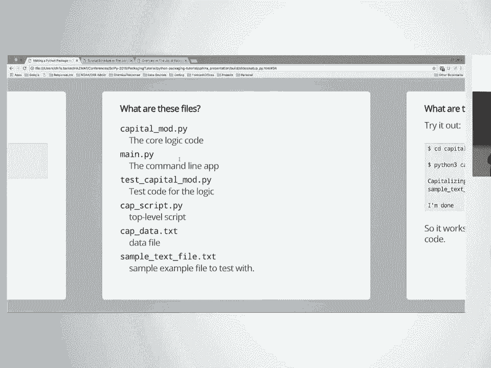

 Let's see if this works。 Is that bigger than it needs to be？

 So this has just got a couple of functions in it。 Load special words。 So that'll come up later。

 when we have a data file。 And because what it does is it's got a little， you give it a little list。

 of words that you don't want to capitalize like A and it and things like that。 It's got a nifty。

 little way to go figure out where the data file is。 And then it's got the real work here where it。

 capitalizes a particular line in a file。 And then the full on in file name， out file name， it loops。

 through the file， capitalizes each line， writes it out。 All right。 So pretty simple。 What else have。

 we got in there？ All right。 So our command line utility here is in a main module。 It's kind of a。

 tradition sometimes of calling it that。 Got a little help text。 And then this is main。

 What this does， is it parsesys。rv to figure out what file name you've passed in。

 And then it actually calls the， operational code here。 So this is our main program。

 And then traditionally you have actually a top， level script that all it does is import main and run it。

 And I'm going to right now delete these two， lines because they're not supposed to be there。

 I thought I got rid of that already。 Anybody knows how to go to that mode again。

 So that's kind of the basic structure。 Then there's a test。

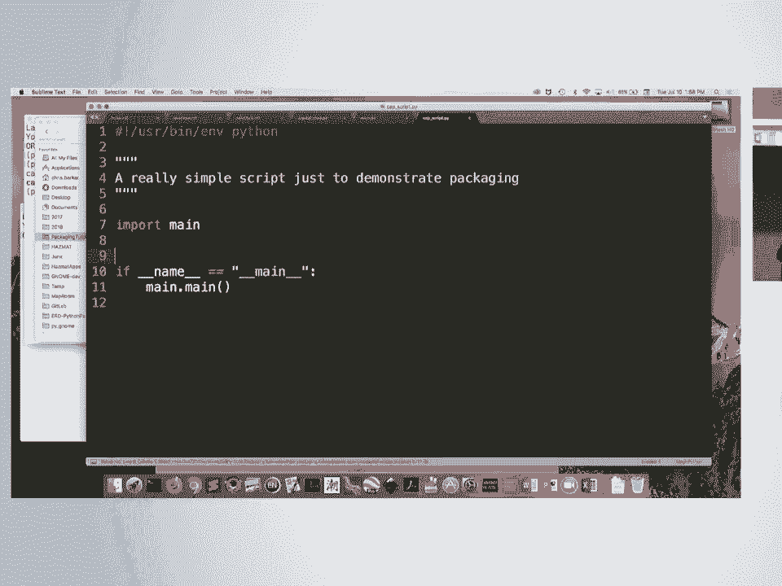

 file which runs the test。 I've got a little sample data file to play with and the cap data。

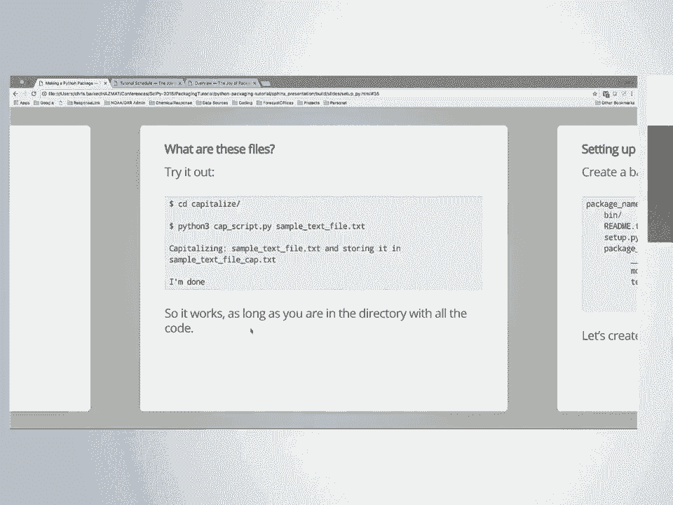

 text。 So let's see if we can actually run this code。 All right。 So here I am。 And I call python。

 Cap script。py。 So that's the top level script。 If I just run that， I get the help。 It says you。

 have to pass in a file name。 So I'm going to do that。

 And I have a little sample file here to mess with。 And then I run that and it says capitalizing。

 Sample text and story。 So my program works。 This is， great。

 Why do I have to fiddle around with packaging？ Well。

 now let's say you want someone else to be able to use this utility。 What do you have to do？ Well。

 you're given this bundle of code and they have to put it somewhere and then they have to CD into this。

 actual directory in order to run it。 Not very convenient。

 So does everybody have this code on their machine and， able to actually run this now？ Okay。

 Actually， anybody not？ That's really the key question。 So。

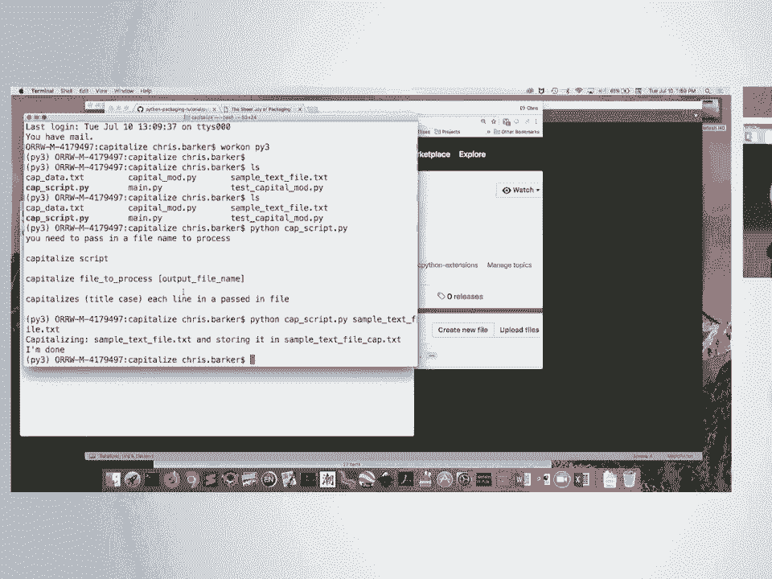

 all right。 If you're having trouble， one of our helps here will come around and get you on board。

 because in a moment we're going to need to mess with it。 I know there's got to be a keystroke that。

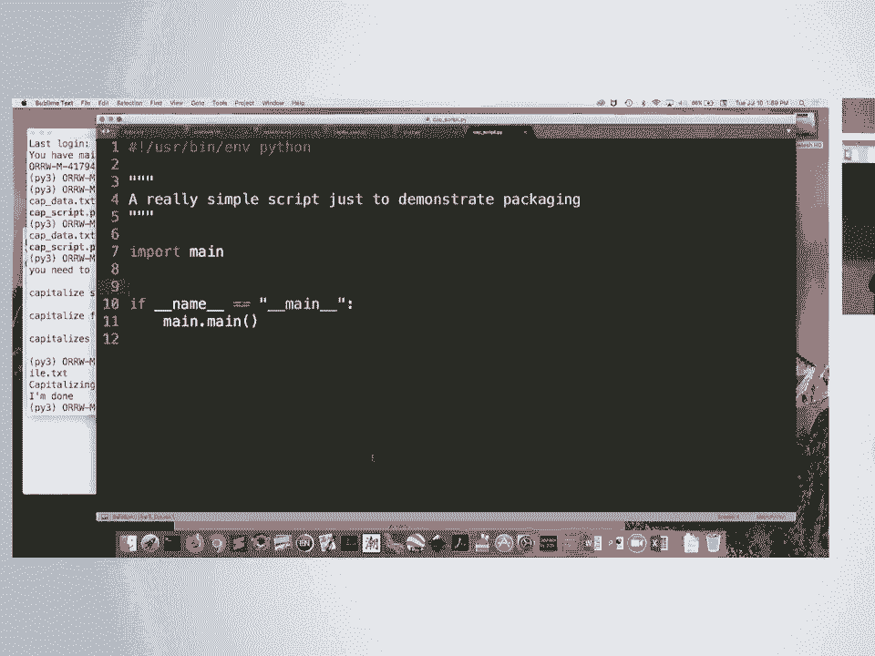

 will go to this。 Yes。 Oh， I deleted two import lines in capscript。py。 Right。 So if you look at this。

 this is a tiny script。

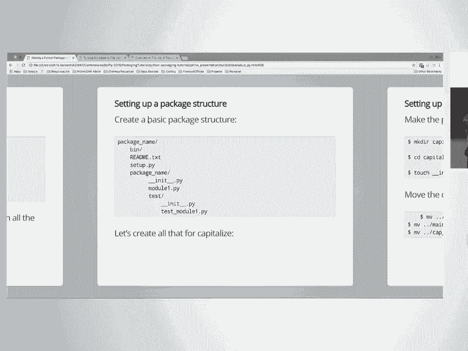

 And the only thing it needs is the main module。 And I had it importing two others。

 We'll get to that in a， moment actually。 It'll still work like it is。

 So this is what a basic package structure looks like。

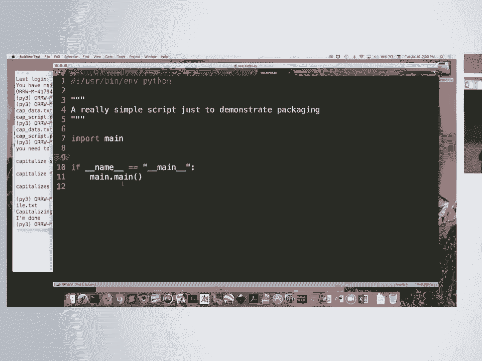

 Right。 We've got the package name and then inside there we have a bin directory。

 You might have a read， me。 You have your setup。py file， critically。

 And then the actual code of the package goes inside。

 another directory which is an actual package directory with a dunder。in file。

 Traditionally you use the same name for both of those。 So what we need to do is create。

 this structure to put our capitalized code in。 So I've got up the full set of command line ways to do that。

 But you can also do it with your。

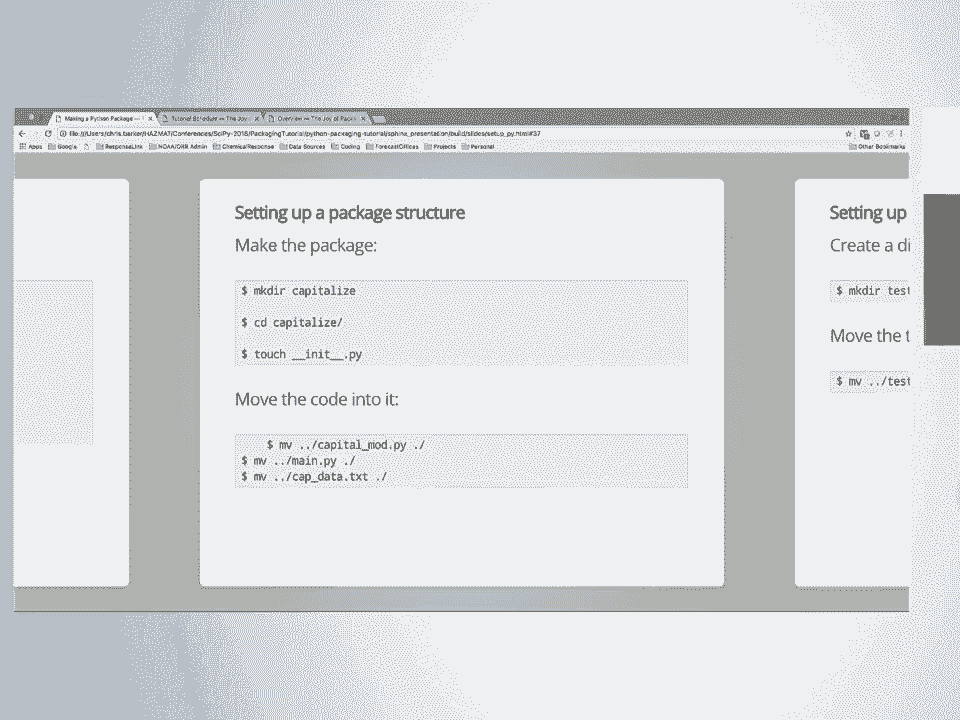

 file manager if you want。 Which I think maybe I'll do because it's a little more visual。 Okay。

 So first we need a directory to put our dunder。in file in。 Okay。

 So now I have that capitalized directory。 I'm actually going to cheat here。

 So this is going to be our package directory。 So what do we need to make something a package？

 What makes a directory a package as far as Python is concerned？ >> Dunder。 >> Dunder。inet。

 So let's add a dunder。inet file。 You can also just create like an empty text file and save it as dunder。

inet。py。 It doesn't much matter。 But on the unis command line。

 what touch does is change the modification time on a file。 But if the file doesn't exist。

 it'll just create an empty file for you。 All right。 So now we have something with the dunder。inet。

py in it。 What we want is for our code to be in here。 So let's move our code into this directory。

 So we need our capital mod。file needs to be in there。 Main。py needs to be in there。

 Our little data file is going there too。 If you had more than one。

 you might have a special place for it， but I'm going to leave it there for now。

 We don't want to put our sample data in there。 And what about the test code？

 Where should the test code go？ Test， right？ We want a directory called test or tests。

 I'm going to put it inside the package in this case。 [inaudible]， Okay。

 So test is -- and sometimes it's helpful to make test a package itself so that --。

 so that it can actually be imported and you can run the test in there。 So I'm going to do that here。

 Let's see where we are。 Okay。 All right。 Is anything else need to get moved around here？ All right。

 Do you all need a little time to catch up？ >> Yes。 >> Okay。

 Wave your hand up if you're actually stuck on anything。 >> So just to be a little bit --。

 >> If you're getting up post-ex-pack with the APS。

 you need to get an environment that's not pretty fast。

 >> The test in your finder is a bit small to bring up。 >> Yeah。 It is。

 Anybody know how to make that bigger？ Yeah。 I don't think that works in the finder， unfortunately。

 All right。 Well， since y'all are trying to catch up， I'm going to -- I know there is a way to do it。

 I've done it。 Yeah。 I think you still have the same size small profile， though。 Is it in general？

 Oh， I'm just trying to make the font bigger in the finder。 But --。

 >> If you go to show view options， there's a text size。 >> Is that on this page？

 >> It's in the wheel or the gear is the top。 There's a gear button。 Show view options。

 It only lets you go up to 16。 >> Okay。 >> What are we doing？ >> Wait， where are we？

 >> In finder at the top。 >> Oh， actually in the finder。

 >> There's a dropdown with a gear on the bottom。 >> So --。

 >> And the bottom is showing view options。 >> Oh， view， maybe。 Oh， look at that。 All right。

 There you go。 Is that better？ >> It's only a little better。 >> Oh。

 here's the gear you were talking about。 Did I make it as large as I can？ Yeah。 Okay。 Well --。

 >> Well， we need to --， >> It probably could go --， >> But you need to edit the operation。 >> Well。

 yeah。 I'm not going to do that right now。 All right。 Well。

 let's be all fashioned and look at the command line here， which I can make nice and big。

 So now where I did have my code， I should have a directory called capitalize。

 And my sample file is still here。 And the script is still there， too。

 So where should I put the script？ Anybody remember？ Right。 I want to create a bin directory。

 So I'm going to make a bin directory and move the script。 There。 Well， I thought， well。

 I was going to get to this last step， and then cat people catch up。 All right。

 So this is where you're trying to get to， is in our main capitalize directory we started with。

 we shouldn't have any actual code。 We have some sample text files。 That's it。

 And a capitalize and a bin directory。 And then in the capitalize directory。

 there's the actual code and a dunder iNIT。py file and a test directory。

 Test directory has the dunder iNIT and the test file。 Okay。

 So do y'all need a little bit of time to catch up here？ Okay。 Now， I will know that in real life。

 what you'll do is you'll start with this directory structure。

 and start putting your code in it right away。 So you won't be on doing all this weird filling around。

 Is there a command that does that？ Is there a way to do a LS that shows you the whole hierarchy of files and directories？

 Okay。 So there's that。 What did you want me to try？ T-R-E-E。 Okay。 Wait， just tree？ Oh。

 apparently not。 What's in？ Oh boy， just all the trickery here。 Oh， there you go。 That's a good one。

 Okay。 Ignore all those dunder pie cache directories。 So we've got bin with capscript in it。

 We've got capitalized with dunder iNIT， the cap data， the capital mod， all the main。

 and there's test which has a dunder iNIT in the test。

 file and then our sample test files at the top。 Now， while you're working on that。

 think for a minute， what's going to happen if I try to run， this code now？ Oh， worked。

 Which actually， oh。 Ah， yes。 I believe I was testing this out before and I have already installed this package。

 I don't even use pip that much。 Will that work？ Might be a paper move， but we'll see。 Yeah。

 Should have created a brand new clean environment。

 Can you screenshot that tree and go it in with Slack？ Ooh。 John， I think you do that？ Well。

 I can do that。 I just don't have slack up。 All right。 Now I have a screenshot。

 but where to put it is the question。 Oh， there you go。 We'll use the iPhone screen capture。 Yes。

 Okay。 So， I will show you quickly。 This package has one data file that you want to get included with the package。

 And I think I've got that in there。 Unfortunately。

 we've got a lot of other stuff we're trying to cover today， so we can't get into all those details。

 Actually， while you're doing that， I am going to create a clean environment because I'm confusing things here。

 Actually， I just need create now， don't I？ Ah。 Python equals three。

 Has anyone else got this set up and tried to run the code again？ Yes。 I don't think it worked。

 So it did work on that command script。 Huh。 So I'll just run the SK build。 Right。 Oh， yeah。

 You should be able in any environment。 It's just that my problem is that the environment I was using。

 I had installed this package into an hour ago。 So it's kind of hard to show what happens if it isn't already installed。

 Well， I don't think you really need to show them。 Just you get an import error。 Right。 We asked。

 we'll get an import error。 So the thing that， talk here。

 So what should happen is you should get an import error。

 And it happens because it goes and looks on Python path。

 Because of the way that you've changed things， it's not on Python path anymore。

 And so what Chris was going to show you then after this， I assume is to get a set up。

py file in place。 Right。 And run， install-e。py or Python set up。py develop。

 And either way you're going to put these files back on Python path。 Okay。 In fact。

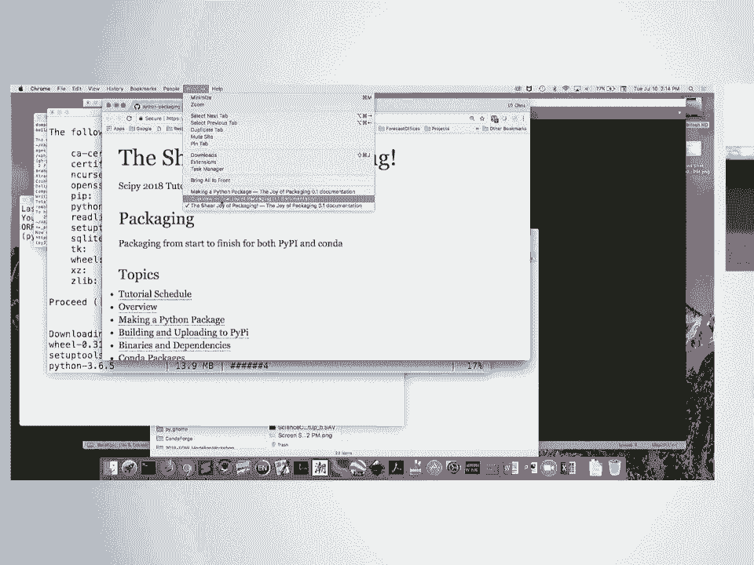

 Okay。 So this is all the instructions of the stuff we've created。 And you go to run it。

 you're likely to get an import error。 No module named capital on。 The one trick is。

 and this is something that bites you every so often， the local folder。

 your current working directory， is always on Python path。 Right。 And so depending on what you do。

 things can either succeed to import or import the wrong thing。 In lots of different ways。

 But so whenever things are just like， you have no idea what's going on or why things are working or why things are working strangely。

 take a moment to pause and say， what folder am I in？ What is available in the folder that I'm in？

 Because it can be extremely confusing。 Right。 The big one that will bite you is if you accidentally name your own Python modules。

 the same as something that's in the standard library。

 And then all of a sudden it's finding yours instead of the standard library one。

 And that gets very confusing。 Or for that matter， some other package you've installed。

 So to now get this package structure that we've created on Python path properly。

 we need to create a set up。py。 I'm going to take a quick look and see if， wow， this is being slow。

 Sorry。 This is my like virus scan computer。 I think that's um。

 Can you maybe push the other structure？ Ah， yeah。 I can do that。 It's a good idea。

 Making sure I'm in the right place。 Okay。 Okay。 Oh boy。

 Problem is I didn't get to lead any of this stuff。

 So is there a way to kind of bulk say delete stuff that's already been moved around？ I run it。

 You'll have to say it had a you or at the you。 I run it。 You have to add the remove files。 Okay。

 Yeah， let's move on。 Well， let me just do this quick and we might have it。 Okay。 Enough of that。

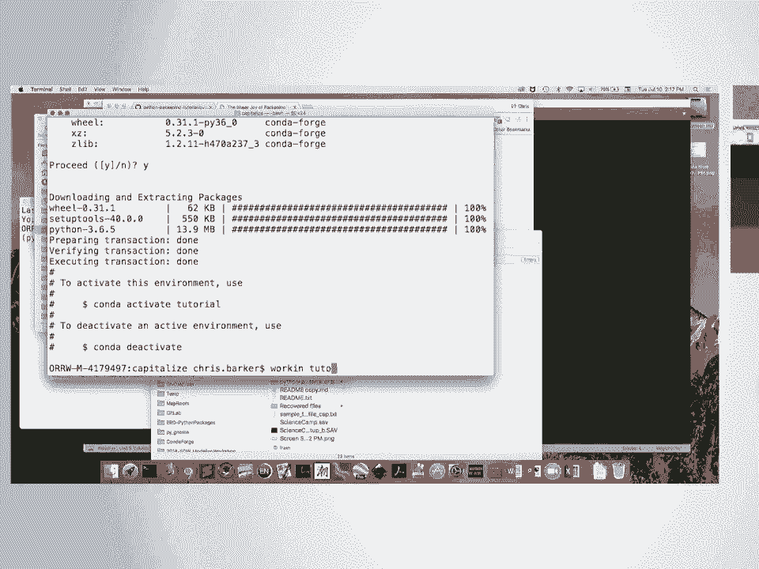

 Nothing like typos。 All right。 So here I am again。 All right。 So we need a set up。py file。

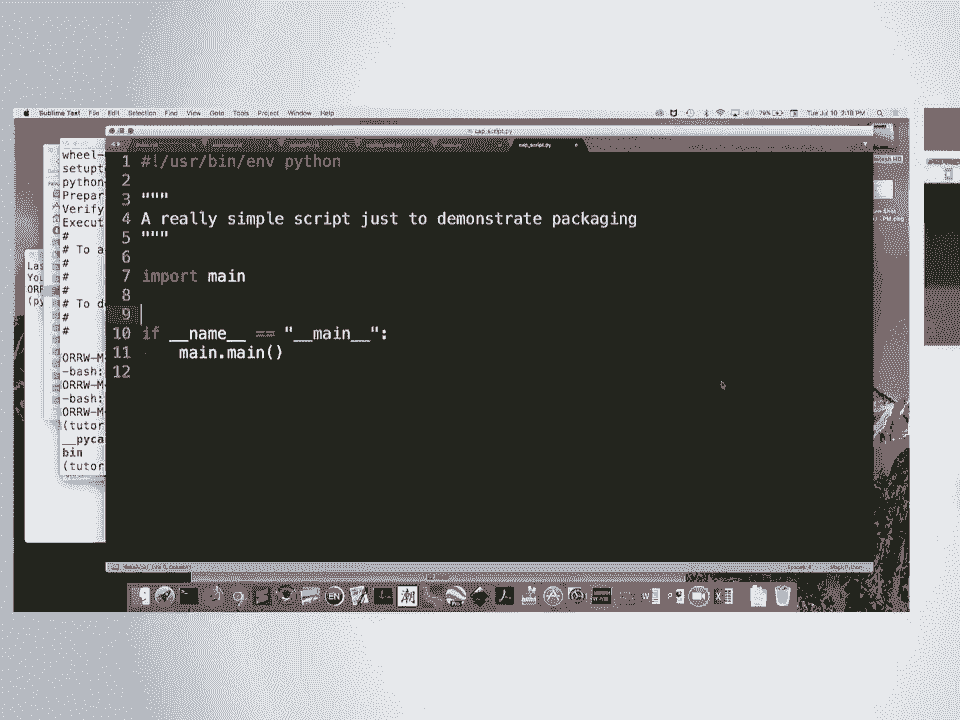

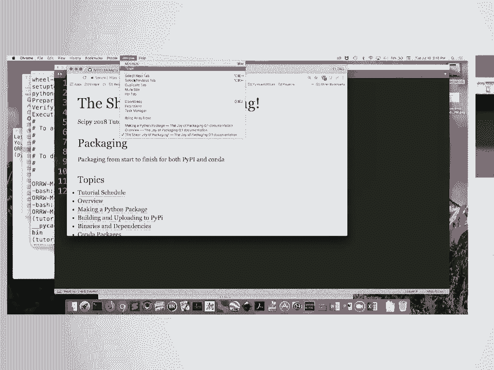

 And so here's one and you should be able to actually just copy and paste this code。

 into your editor and save it as set up。py and then we'll talk about what's in it。 Whoa。 Tab。

 All right。 So I'm creating a new file。

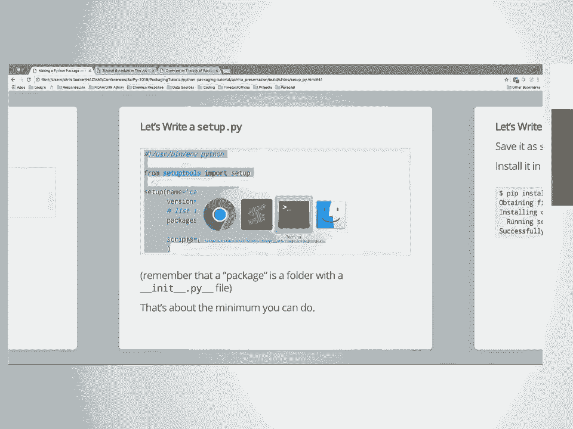

 I went out to you guys while we're working on this。 Set up。

py doesn't actually ride along with your package。 It's something external to your package。

 So you find it in your source code repository and it says what your package should contain。

 But set up。py itself doesn't go along with your package。

 All of its metadata gets kind of baked in in other formats。 Right。

 So that means we want to be saving it。 Sorry， you can't probably see that very well。

 but we're saving it here outside of that， capitalized package directory。 All right。

 So let's look at what's in here。 First of all， we're importing set up from set up tools。

 And then I'm giving it a name and a version， which I think is strictly not required。

 but a good idea。 And now I'm telling it what packages。

 what Python packages I want to put and get installed。 So the capitalized directory has a dunder。

py file。 It's a package。 And then I'm explicitly installing the capitalized。

test package inside there as well。 Set up tools comes up， comes with a utility called find packages。

 which will walk a directory tree looking for files， looking for dunder。net files。

 So you can use that， although I kind of like to be explicit。 It's nice to be careful。

 And then I'm telling it the scripts I want to install。 And actually。

 I think I put the bin directory outside of the package this time。 You may have to do that。 So now。

 I'll use the pip method。

 I should be able to do pip install -e for editable mode。

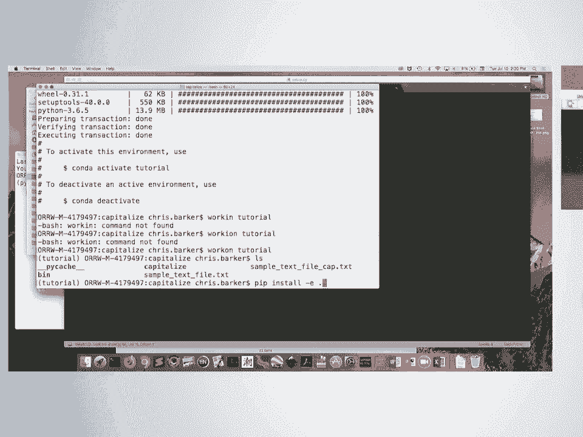

 And dot。 Okay， so it runs through and it says， okay， it's installing the capitalized package。

 It's successfully installed it。 And then it gives me a little warning that I should upgrade pip。

 which I'm not going to do right now。 So let's see what happens now。

 So now it should have installed my capitalization script on my somewhere on my search path so I can。

 just run it。 And indeed， I can， except I get an error。 So I'm getting。

 now running my capitalization script， it got found， it ran。

 and then I got an error with import main。 Module not found。 No module named main。 And that is in。

 make sure I'm looking at the right one。 The cap script got fine。

 So if you look at your cap script dot pi file， it says import main。 And we can't find it。

 So where is it looking for that main module？ Anybody know？ It's looking on to stop path， right？

 But we haven't installed a module or a package called main， have we？ What have we installed？

 We've installed capitalized and so where is main？ To end the capitalized package， right？

 We have to do from capitalized import main。 Now Python will go and look for a package called capitalized and look and see if there's。

 a module named main within it。 And this is the neat thing about development mode。

 I just changed this file。 Make sure I'm saving it to the same place。 [BLANK_AUDIO]。

 I just saved this file in my capitalized package where I'm working on the code。

 And since I installed an editable mode， Python should still find it。 [BLANK_AUDIO]。

 Except it doesn't。 [BLANK_AUDIO]， It might be because you're-， No， because this， yeah， no。

 it's because I edited the。 I'm actually supposed to be doing the one in the bin directory。

 There we go。 Okay。 [BLANK_AUDIO]， That's interesting。 >> Thank you。 Overrope made with cash group。

 Bye。 >> Did I？

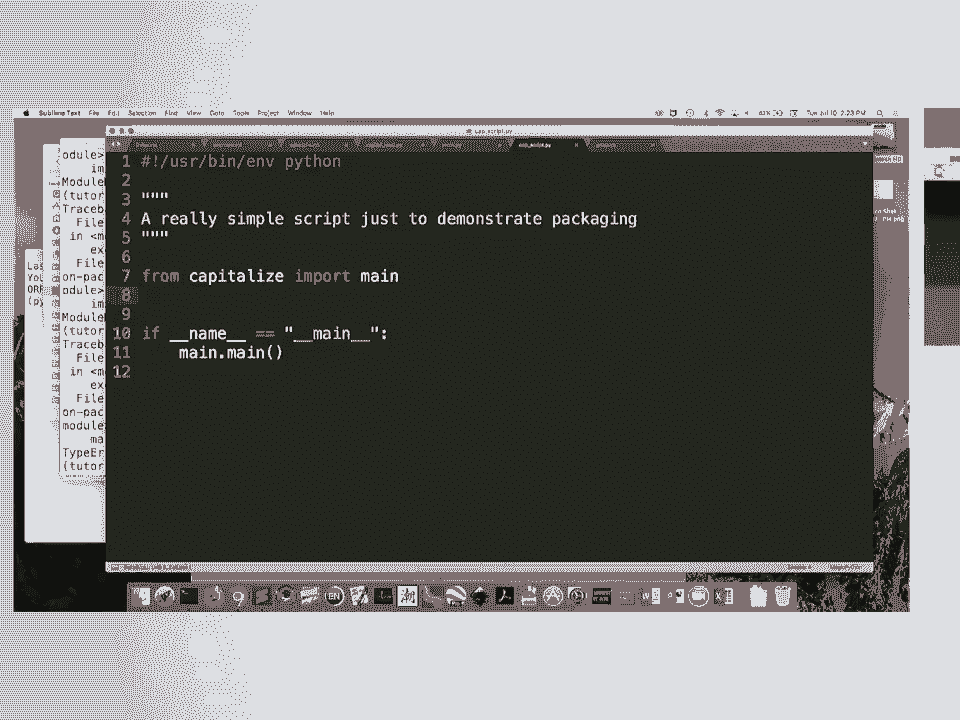

 Titch， titch， titch。 [BLANK_AUDIO]， Thank you。 Did I save it？ [BLANK_AUDIO]， Yes， I did。

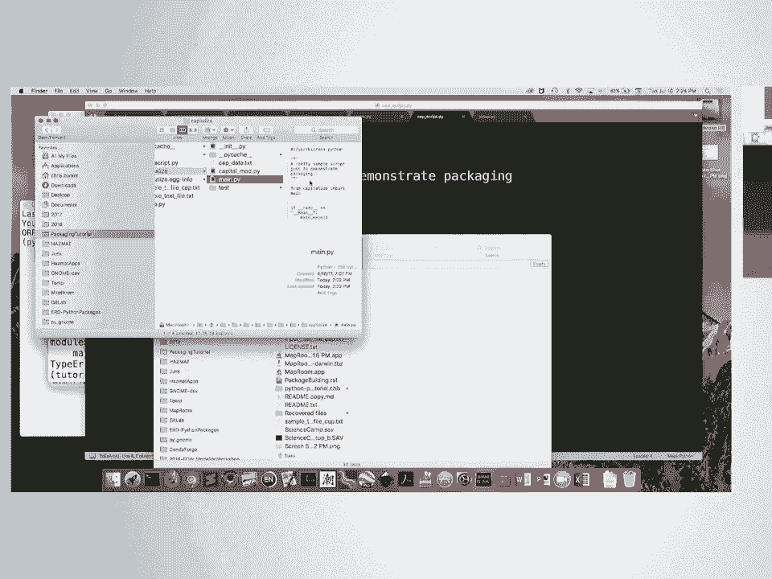

 [BLANK_AUDIO]， Hmm。 Shouldn't it be there？ I committed it。 [BLANK_AUDIO]。

 And let's see if it runs again。 Okay。 >> Chris， we got a no-， >> Yes， we did。 >> It's over。 >> Okay。

 So what we found here is that I had to change that import and sorry for my confusion of writing over the files。

 And now I'm getting a similar error， but this time it's in main。py。

 So we have to go through and change our imports all over the place。 And in the interest of time。

 [BLANK_AUDIO]。

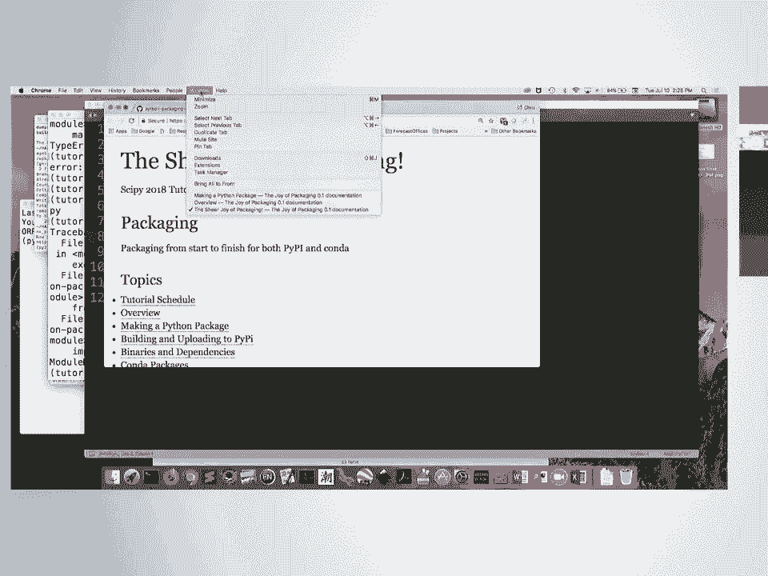

 So we need to do basically everywhere we're doing these imports we have to change from capitalized import main。

 And then once you've done that you should be able to run your capitalized script and actually run your tests as well。

 [BLANK_AUDIO]， So in the interest of time I'm going to let you guys leave that as an exercise for the reader。

 We're not using the same package later on so we're all right。

 I want to just make note of a few things is that this is a bit of a process building up this directory structure and having all the right files and stuff。

 So if you're really building a full on package， you might want to take a look at the cookie cutter project。

 Which basically lets you start with a template for a package of a certain type and you just run cookie cutter on it and it builds up the whole directory structure and everything for you。

 So it's well worth checking it out。 We got some links on there。

 >> Even if you have an existing project it is totally worthwhile to use cookie cutter to set up the directory structure for you and paste your code into it。

 So I do that all the time， I start out just like projects and notebooks or who knows what。

 Then I'll go to cookie cutter to create a template with the proper structure and。

 I'll copy stuff into that folder structure。 So don't feel like， it's an existing project。

 I can't use cookie cutter anymore。 Not true， right？ Go ahead and pull it out。

 just paste your stuff in。 >> So I want to talk a little bit about requirements。

 In this particular example there were no requirements but a lot of times your package is going to depend on other Python packages that aren't in standard library。

 You might need to request library or NumPy or whatever else。 So in your set up。

py file you can do install requires and， give a list of packages that your package requires。

 And then when pip goes to install it it will go and look and see whether those packages already exist and if they don't it will try to install them for you。

 You want to be careful about this。 Another way to do it is use a requirements。txt file。

 You've probably seen these。 And then you can pass that requirements。txt file onto pip and。

 pip will install all the requirements for you。 You can actually build that file by calling pip freeze which will basically give you a whole list of all the packages exactly what packages are installed in your current environment。

 You generally do not want to， you want to use that to recreate your environment for operational use but。

 you don't want to use it as your requirements。txt that you pass off。

 Because it will be asking for very specific versions of packages and。

 it may be if something else needs a slightly different version then the whole thing is going to choke on you。

 Go read this blog post if you want to try to understand about how to use requirements。

txt versus putting requirements in set up。py。 Another option is to put your requirements in a set up。

config and as Michael mentioned earlier that gives you the advantage of being able to read that file and work with it without actually running the set up。

py file。 So that can be a really good way to do it as well。

 So we are going to move on to the next step which is now you've got your package。

 How do you actually build it up into a thing you can give to other people put on pipai what not。

 We are going to take a short break while we switch out computers and instructors and we can all use the bathroom。

 Is it possible to keep a break to five minutes？ Let's see it's 2。28 now so let's start again at 2。

35。

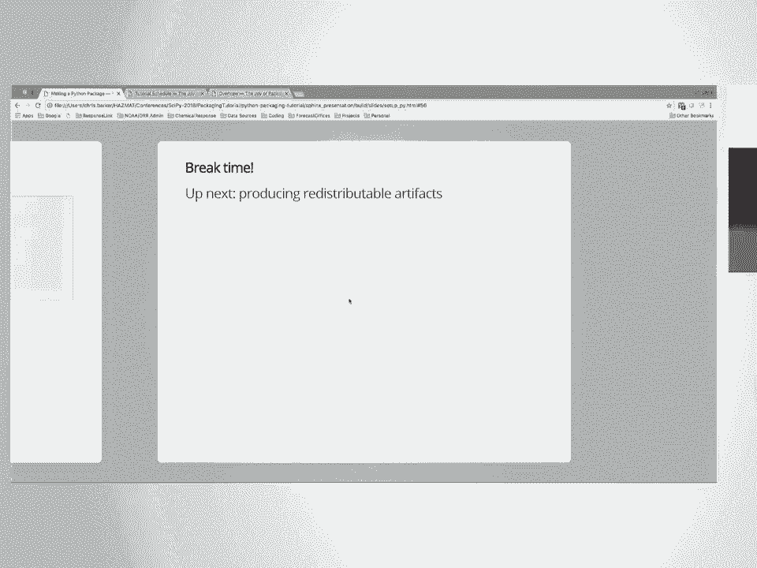

 [inaudible]。

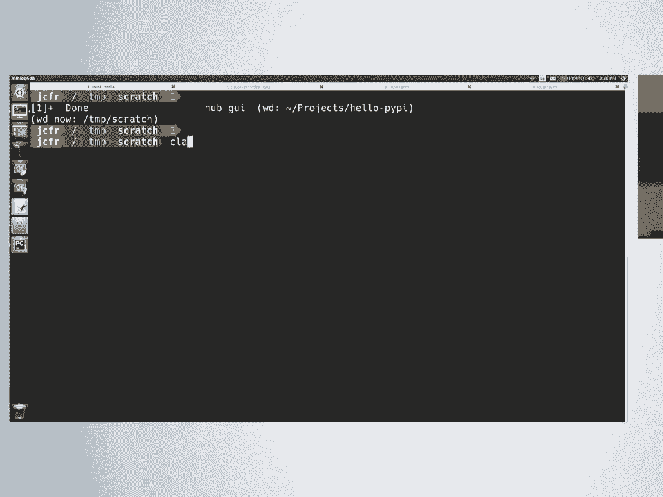

 Hello everyone。 Just to situate you are going to show you where I click to get to that next part。

 From the website you are going to click on building and uploading to pipai。

 And these are the HTML website and right now I'm going to use the slide I generated。

 And I'm going to click on build and uploading to pipai。 Okay。

 what we're going to see in the next 45 minutes is a review of the terminology。

 In the previous section we looked at what was setup。py， setup。cfg and now we organize the files。

 But there's a lot of terminology to describe the different type of packages distribution。

 And when I'm in packages here it's not like the package with the underscore underscore in it or the dunder in it。

 It's all the files together， bundled in what we call a distribution and then made available for other user to install。

 And then after that we're going to have a small tutorial section where we're going to review some of the common tasks and then a few exercises。

 Okay， let's start。 Let's review some of the key concepts。 First what is pipai？

 Are you all familiar with what is pipai？ Yeah， pipai is a package index。

 It's where we publish all the packages that we can install。 And they are also called distribution。

 There's two types of server。 There's a regular pipai where we have all the package uploaded that you can download。

 And there's also a test server called test pipai that you can access。

 And every few days the set of packages is cleared up。 Then we have pip。

 Pip is a tool to install Python package。 And by default it's talking to the pipai server and it's querying the server to find out which package are available。

 Yeah， that tool's pip is both an integration front end and a built front end。

 I will let you read the details to figure out。 What is pipai？

 Pipai means the Python packaging authority and often on mailing list or on website you're going to see that。

 It's a working group that tries to standardize tooling around packaging。

 And the associate website is pipai。io and it refers to the goal specification roadmap as well as a packaging user guide with a lot of useful information。

 Okay。 What is the source distribution？ Earlier we mentioned that setup。

py wasn't shipped to the user within Soling。io package。 The only place where setup。

py and all the file I included is what you call a source distribution。

 And it allows us to build our final package and it's similar to your source repository。

 We have a build distribution also called a B-DIST and that includes metadata pre-built files。

 And it doesn't include setup。py。 It only includes the p。y script， some compiled code if you're any。

 And it can be simply extracted and installed on the system。 There's no build step。

 An important distinction is the type of distribution。 They could be pure or non-pure。

 And when we mean pure it means it only includes the Python script。

 They are not specific to any CPU and there's no ABI。 It means there's no compile code。

 no coding interface。 It's purely Python。 And then we have the non-pure。 The non-pure we have an ABI。

 We usually include compiled code。 That's generated from a Python of home surplus plus or fortron。

 For example， scipy， psychic learn， elixml， all these type of all these package in compiled code。

 And also numpy。 And a build distribution which include non-pure files， meaning compiled code。

 it's what we call a binary distribution。 And it's platform specific and usually it includes compiled extension。

 And now what is a will？ Often you will have terminology will。 Will is a specification。

 It's a format to specify how do we organize the file in the binary distribution or build distribution。

 And usually the fine name is name of the distribution。 For example numpy， scipy， the version。

 a build tag， a Python tag， ABI tag， platform tag。 We also have the parallel two wheels。

 We have called a called a contact package。 And later on we can cover all the details and the differences between both。

 A very important concept is a virtual environment。

 How many of you are using virtual environment or great？

 Each time you work on a specific project you want to create an environment to isolate the different package you installed。

 And you can do that in Condau or in the regular Python with virtual m or vm。

 In the build system or build backend by default in Python it includes setup tools and the wheel package。

 And these two tools allow to create Python wheels。 But there's also alternative build backend。

 For example， fleet。 And fleet doesn't require set。py。 It just requires a yaml file or a JSON file。

 We have described the different metadata， the license， the auto and so on。

 And then you can create a wheel for only for pure distribution。

 It means only if you have a Python file。 If you have a compiled code， fleet for example won't apply。

 Let's look at the big picture。 First we have the development tree。

 the source code that you get from Git。 And then you commit， you push some change。

 And then from there you can create a source distribution as this。

 But you can distribute and other can then create a wheel from that。

 Or we can directly upload it for other system to create their own package。

 From the source release we can create the wheel。 And then when we get the wheel we can upload it to the to pipi。

 And then the user can pip install the wheel。 And all the user can install the source distribution。

 And also on the environment like Debian， red hat， open source and other language distribution。

 Repackage your source distribution into a meaningful unit that can be installed with a very expected package manager。

 And also one of these use case。 >> How does twine and setup to dialogue？

 >> They are completely different。 Twine is a utility to upload wheels and source distribution into pipi。

 That's it。 There is an upload command that has been deprecated and shouldn't be used。

 It means the build back end to generate the source distribution of the wheel。

 But it doesn't take care of uploading。 >> It is confusing。 >> Yes。 >> That's how they effect。

 >> Yeah。 With the longest story and things have been changing。

 And they are trying to communicate what is the current state of the art。

 >> Is there a reason why you don't get into pip install on the source distribution。 >> No， yes。

 You could be in store a distribution。 >> And then it will -- >> Yes。 >> Yep。

 >> And I will update the slide to include that。 >> Yeah。

 >> Because the packaging ecosystem is kind of at a crossroads。

 We are set up tools in the past over putting them into better things。

 And we are not quite there yet。 And I don't want to even start to get into them。

 But what Em alluded to was that pip is going to learn how to do a lot of these new things。

 And setup tools won't know how to do it anymore。 So right now is an awkward time for packaging。

 But there are great things。 >> And already some of those are people。 >> Yeah。

 They are a little bumpy。 But we will get there。 >> Yeah。

 And the reason why I also get set up the py install is when you -- and that's something。

 Matt would cover later。 If you want to give argument to -- add an argument to some of these。

 command， if you just use pip， you can't pass all the argument that you want。

 And there is some limitation。 But for simple use case， pure Python package， there is no problem。

 And the pip install will do the job。 Okay。 Now let's look at a few use case and which command we can use and which tools to achieve。

 some of this task。 So we are developing a distribution as I mentioned。

 It's important to create environment with Conda or virtual amp。 After you get your environment。

 you can build your source distribution。 And there is no interface to building a source distribution with pip。

 And to do that， you have to directly call Python。set。py。

 I guess we always upload the source distribution to support the case where you have a new version。

 of Python and there is not yet a distribution available。

 And when there is no build distribution available， Python -- I mean。

 pip will know how to recreate the wheel for that version of Python where there is no wheel。

 And that applies only for binary distribution that are specific to Python version。

 If you write some code that is forward compatible， you could potentially only upload the wheel。

 And you don't -- you wouldn't have to care about the source distribution because the pure wheel。

 will be installable in any environment。 Then to build the wheel， we use pip， pip will。

 then we specify the folder where we have our project。

 and we specify a directory where we want the wheel to be generated。

 And building the wheel using pip wheel under the wood， it's calling Python。py。

 How do we install a wheel？ To install a wheel， it's the command pip install。

 the name of the package。 But we can also install a wheel given a path to the wheel。

 And then looking at the documentation， there is a sumo option。

 You can also have your own -- your own pip by server， your own -- where you -- you have a trusted。

 set of extension and you don't want to rely on the official extension -- on the official package。

 And then you can also use the distribution。 As mentioned earlier。

 we can do pip install and provide the path to the -- to the TARGZ。 And under the wood。

 it transparently builds the associated wheel and install it。 Publishing to pip， we use a twine。

 And it's available in both condine and pip by as a package。 If you do condine， you will get it。

 And I guess let's spend some more time doing the exercise。

 I suggest you all create a new environment， for example， a low pip by。

 And then you activate that environment。

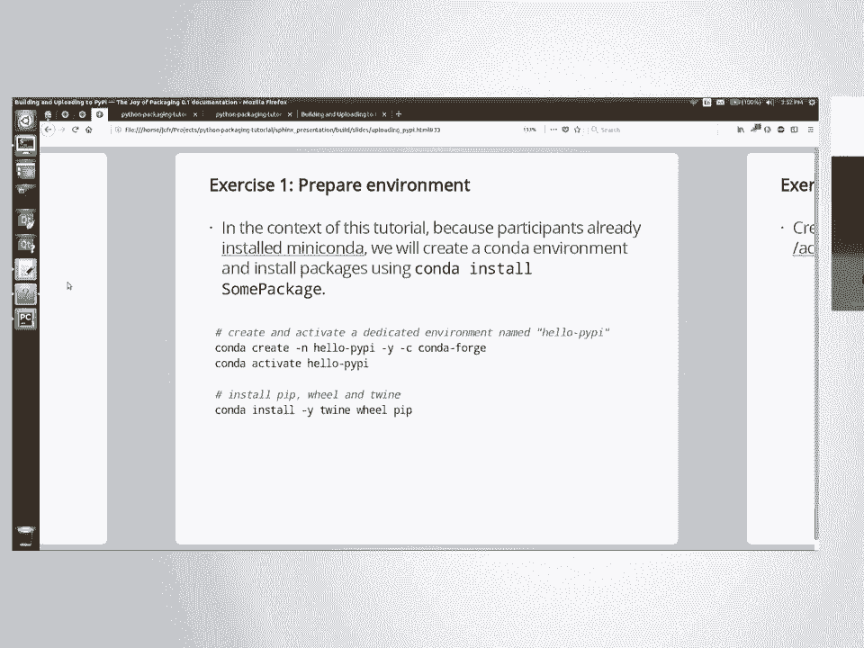

 And I'm going to do the same thing here。 [ Pause ]。

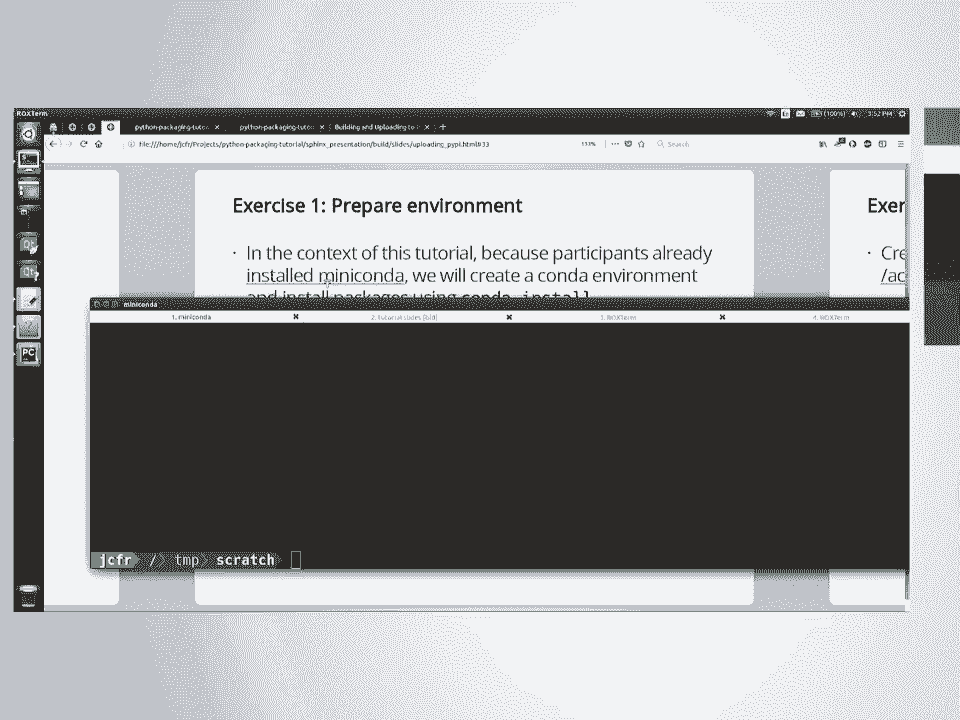

 And since I don't have condine in my path， I explicitly activated the base -- base environment。

 And then I'm going to copy each command。 [ Pause ]， That's why I mean automatically say yes。

 Otherwise it's going to ask you do you want to -- and since I already have --。

 I call it dash yellow。 [ Laughter ]， And since I already created the environment earlier。

 I just activated it。 And then I'm going to install the twine wheel and pip。 [ Pause ]。

 You should have the environment set up。 If you do pip dash elp。

 you should be able to see the elp of pip。 Something I also did。

 I created a scratch directory in my temp folder。 Because there you will download some package and build some project。

 I suggest you do the same。 Okay， next。 If you haven't done it yet。

 or if you have done it like a week ago， make sure you have an account on test pip。org。

 because we are going to upload a wheel to test pip。 And it's pretty quick to create the account。

 A name， email， username， password， and then you click create an account。

 Since you're going to have to type the password， at least for the first exercise。

 and if you have an， created account， just put something very simple， at least for the tutorial。

 Easy to type。 Everyone got an account？ Yeah， they are too different。

 My understanding is they are too different back then。 The test pip is clear。

 Everything is different。 Even if you enter the same name and email address and stuff。

 it's actually a separate account。 Yeah。 Actually， I never had to recreate my account on test pip。

 That means I'm assuming they keep the list。 Okay。 One thing we have of pip is that you have a username and a password。

 There is no concept of API key。 It means when you want to do some automation。

 you will have to use that password and that user name。 You can't create API key and revoke API key。

 Yeah， it would be nice to support API key。 That webinar for a given organization。

 you could create an API key and you could mitigate， risk and also mitigate credential leak。

 It means that sometimes when you automate process on a continuous integration services。

 the password could be leaked in the log and it happens a few times。

 It means if you use the same password in all of your project， you will have to update all of them。

 That could be problematic。 Or you could also create a dedicated account for each project or group of projects to compartmentalize。

 It's something we do， for example in GitHub。 Sometimes you need to use a create API key for your user to。

 for example， automatically create a release。 And if you create the API key with your regular user and you have access to a lot of projects and private projects。

 you don't want to use API key from your user on the continuous integration service。

 You want to create a bot user。 And easy trick is to， for example， if you have a Gmail address。

 you can， let's say you are John at Gmail。com。 You can do John plus and then you give the name of the organization and you can use that to create a bot for each one of your organization。

 GitHub may flag that and say， "Hey， guys， there's something wrong。"。

 But then if you directly talk to them and you say， "That's legitimate，" and you explain。

 they're going to reactivate your account。 And that happens to me and I explain and ask if you have like other possible approach to mitigate credential leaking and there's no other approach yet。

 It means it's okay to create bot user。 Okay， now we can， since I don't know if everyone has Git。

 we can just install a WGet and then we can download the source of a small project named "Elopipi"。

 It means install WGet。 And that's pretty neat to use Conda because then you can have WGet a cross-platform。

 And now we're going to download the source of a small project and it failed for some reason。

 That's it。 That's it。 Yay！ It worked。 Then we have a master zip。 And next step is to unzip。

 But since I don't know if everyone got zip， let's just install unzip。

 And then you're going to unzip it and go inside the folder。 Okay， we just extracted the content。

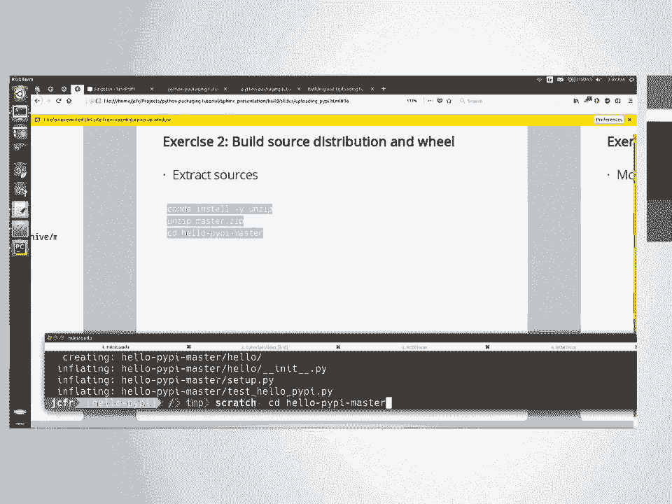

 And it's a very simple package。 We have a LO package and then a setup。

py and we also have a small test written with PyTest。

 And next step is to make sure we all modify the name of the package because we're all going。

 to upload it。 And since we can't upload the same package twice。

 at least with the same version number， just， prefix the name of the package with your name or any。

 It's worth pointing out that this is one of the most important fundamental differences。

 between PyPI and say anaconda。org。 Or anybody has their own channel and everybody can have that package name on their own channel。

 And so it's sort of， you know things are more authoritative on PyPI perhaps。 But at the same time。

 it doesn't provide a good way for people to provide their own custom。

 skills that aren't built the same way as the authoritative ones。 Question？ Yes。

 Aren't there any space problems then when historically a project， if you have multiple。

 packages with the same name， if I interpret what an encounter does to your paper。

 There certainly can't be。 If you mix channels， you can end up with namespace conflicts。

 Like it's rare that you have two packages that are completely different with the same name。

 That's not a terribly common problem。 What is much more common is that you have different builds of the same package that are。

 not compatible in some way。 And yes， that's a huge problem and maybe we'll talk a little bit about that later on。

 Let me see what I just did。 I did a， I pre-fixed the package with JCFR tutorial because we small and already did JCFR。

 Okay。 And next step will be to build the different distribution。 Now if you look inside the folder。

 we have the source distribution。 And let's look what's inside to confirm。 You can just use a TA or。

 Yeah， oh yeah。 I just use an A1 pack。 The small tools I just recognize the extension and does it for me。

 And if you look inside， we have the setup。py， setup。tfg， and then the LOA package。 Okay。

 I'm removing it。 And then the next step will be to build the wheel。 And people。

 the dot is to explain the current folder and then W， where do we want to put， the wheel？

 And now what do we have？ We have the wheel。 And that wheel is not specific to any specific architecture or version of Python。

 I mean， yeah， it's specific to Python 3。 And then the next step will be to upload。

 And in that exercise， we directly give the URL of the。 This is the server。

 And then you have to type your name。 And I set up a password that I will change after。 [laughter]。

 Because it's on video。 Okay。 That's why the test pipeline is separate account。 Yes。 And yeah。

 now we just uploaded the wheel and let's check。 Where's the link？ That's pipeline。 And let's see。

 New release。 Oh， yeah。 Yeah， I just got mine。 And we can see if you're the one。

 And we can also install the package from test pipeline。

 It means you're going to use the same argument。 And we can do the repository。 Yeah。

 I believe we do that。 And we do pip install。 I probably have the permit of wrong。

 We're going to look at the help。 Yep。 [inaudible]， I'm not seeing something here。 [inaudible]。

 I'm not sure why。 [inaudible]。

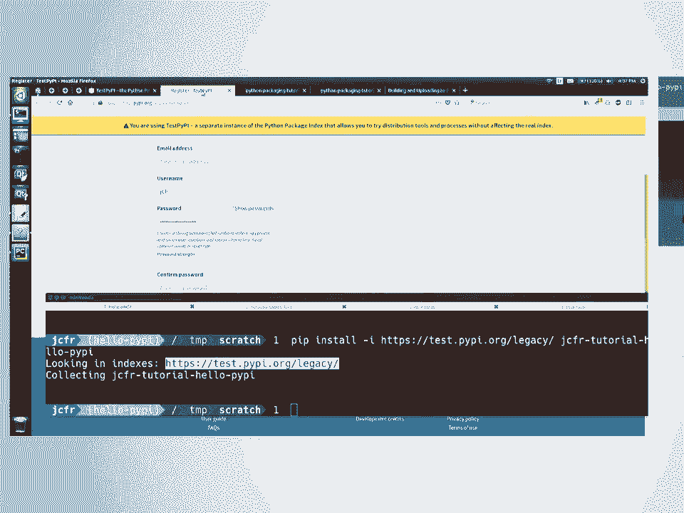

 Okay， next step。 Can I ask a question before？ Sure。

 When we run the command of the source distribution， we get an， egg info file。 A folder。 A directory。

 Are we the completely deprecating or disregarding eggs and python？ Yeah， we use it。

 It's not a fact from set up tools。 And set up tools under the wood is still using a command。

 It's egg， eggs or egg info。 And we're creating some of the file。

 And these file are used to generate the source distribution and the， wheel。 But yeah， ultimately。

 egg is going to go --， So there's a really important distinction。 The egg info file。

 an info folder or file has a lot of metadata that， is still absolutely relevant。

 What's not used anymore is egg files as a distribution medium。

 And it's not quite as important as a set up。 And it's not as important as a set up。

 And it's not as important as a set up。 And it's not as important as a set up。

 And it's not as important as a set up。 And it's not as important as a set up。

 And it's not as important as a set up。 Okay， now here you manually enter your name and the password。

 But this is a way to automate that。 And to automate you can simply create a py。

 A py/rc file in your own directory。 And then you will outcode your user name and password。

 Just make sure that file is not readable by other user and， yourself。

 And don't commit that file in your repository。 Yeah， I'll change your password right away。 But yeah。

 I will let that as an exercise for you。 And then another thing is if you want to set up continuous integration。

 we have a master with CI branch in that project。 And for this one we use a circle CI。

 And you can look at the details how we can set up， the CI with circle CI and Python 3。7。

 And here they sound like a dummy step to implement the deployment。

 And here instead of deploy release， that happens only when the tag。

 instead of doing a code depot release， you will do a twin upload。

 And with the will that has been generated in the source distribution。

 And that will happen automatically each time you tag your repository。

 Some other things we didn't cover right now in that small project。

 The version has to be manually updated。 Each time you tag or each time you whenever you want。

 But there is a way of automating that。 And for example， a neat project is named version here。

 And the version number is encoded in only one location。

 It's your first control defined what is the version。 And it's the tag。

 If it's a tag it's going to be the name of the tag for the version of your package。

 And if you build your will or your source distribution， if you commit after。

 it will automatically create a unique version number。 And then if you create a source distribution。

 it automatically package a file with the right information。

 It means even if you build without -- without Git without being a Git version control。

 it will have the correct information。 And in the next presentation we will see how we can set up the conscious digression for binary package。

 And it's going to be a more elaborate version of this file。

 And for secrelesia are going to be used for Linux。

 And then are they are going to be used for the windows wheel and travis for the Mac wheel。 And yep。

 is there any question？ Do we know why that failed？ No， I will look into that and report。

 Did anybody get it to succeed on theirs？ No， fail in the same way。

 It could just be a bug with pipey eye。 I'm not sure。 That does happen。 So before the next session。

 I'm going to do a little giveaway teaser， some special important information。

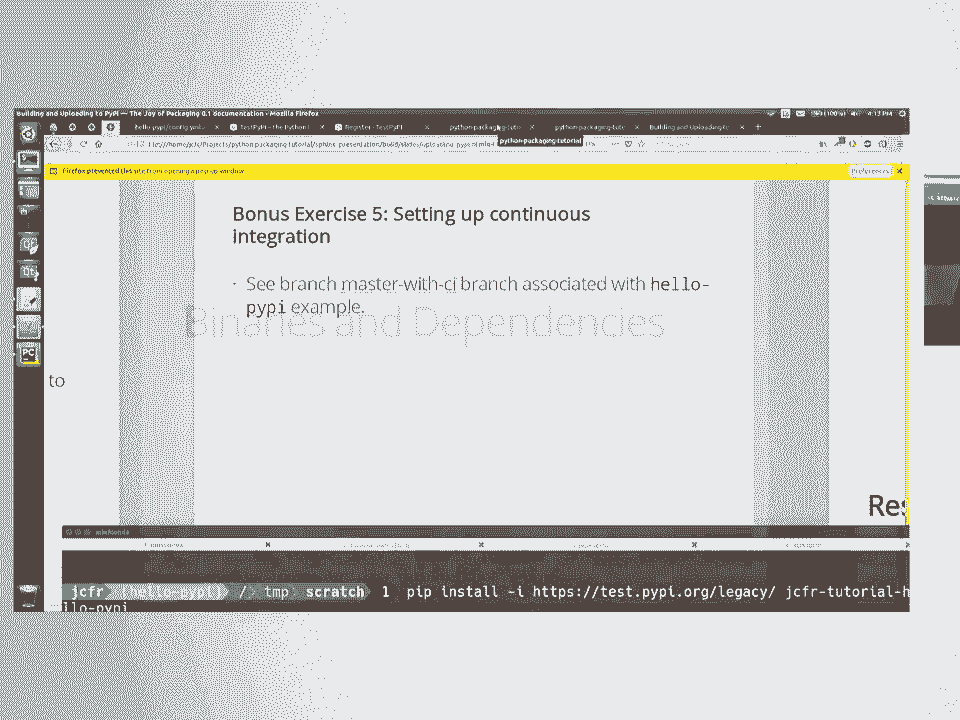

 Is that France beat Belgium in the semi-final？ That is a spoiler。 That is a spoiler。 I'm sorry。

 I'm sorry。 So then this section we're going to give out more spoilers。

 more information about binaries and dependencies。 And unveil some secrets that are maybe unintentional secrets and mysteries about the build process for native binaries and how dependencies fit into that。

 So the overall goal for this section is to really kind of get some understanding of what's happening here and remove that mystery and make it less scary。

 So first， for kind of review why this is important。

 especially when doing scientific computing and packages。

 And to understand the binaries build process and how dependencies fit into them。

 then we're going to review the components that are involved in the build process。 And then finally。

 we'll learn how binary compatibility works and the major lesson that we're taking home from today。

 which is how C run time library compatibility fits into this picture。 And finally， at the end。

 we'll kind of have a good understanding of what these tools and packages psychic build and conduct do and why in most cases。

 unless something goes wrong， we won't have to know about everything that we just learned。

 So the material， first， let's remind ourselves why this is important。

 This is really important if we want to do scientific computing and concentrate pretty quickly because we have large data sets and we have complex algorithms。

 So some high performance is required。 And to do high performance on computers on modern microprocessors and clusters。

 we want to minimize the number of operations that we do on the CPU。

 Parallel computing is very important。 And we also need to explicitly manage memory usage where data goes and how long it lives there。

 And how do we do that？ So in this process， we want to reduce the number of steps we take to do an operation down to the minimal number possible。

 And so to make that possible， we just want to have a few instructions。

 operations that happen on the CPU。 And so if we want that to happen。

 then we want to avoid interpreting the human readable code and trying to figure out what that means for the CPU all the time。

 So this means going from Python source code into binary code in the general case。

 We also want to do parallel computing， but Python and CPython itself has this kind of inhibitor to parallel computing。

 That's part of the implementation details of Python， the global interpreter lock。

 And this stops that in many cases。 It makes it difficult。

 And then finally we want to manage our memory explicitly and deterministically。

 So we can do that with some other languages that are compiled into native code and is managing the memory in a well-defined way。

 So if we can， in some cases， just write pure Python code and we can also make it run fast by not pre-compiling binaries。

 you know， using tools like Numba。 But if we're doing any practical real world research。

 we will end up needing to either create binaries or run binaries or develop packages with binaries。

 Because we don't have the resources in practice in the real world to rewrite everything。

 Things that have been done for multiple decades， we can't do that， we do that work。

 And we don't want to do that work in many cases because our job is to build on top of the work of our predecessors and reproduce their work when we're trying to do science。

 So that brings us to kind of the main lesson to take home today， the main point。

 And that is for building binaries， it's important to understand that the lingo franca of computing。

 for scientific computing， is a scene programming language。 Why is that？

 Fundamentally comes down to the fact that the operating systems themselves， they're written in C。

 So the Linux kernel is written in C and the Darwin Mac kernel is written in C and the Windows one is C and C++。

 As a result of that， the native binaries of executables that run on your system。

 they kind of have artifacts that reflect the characteristics and how to be compatible with the C programming language。

 And related to this property is that the reference implementation of CPython is implemented in C。

 It's kind of fundamental languages。 And also for scientific computing。

 CPython is sort of the most widely used。 And the reason for that is again because of its C compatibility。

 So C binary compatibility is a very important thing。

 And that's what we need to understand and shoot for when we're developing native libraries。

 So what languages are the binary Python C extension modules written？

 A lot of the existing code out there is written Fortran or C itself。

 There's a lot of scientific codes written in C++。 There's another language out there that's called Python。

 It's a little confusing because it's very close to Python and C Python。

 But it can be built down into native code。 And a new one that's out there is Rust。

 So we want to build a binary and package it。 And so what goes into that process？

 What are the components and the requirements to achieve that goal？

 The first set of components are the build tools。 And that's kind of what we're discussing today in many cases。

 So what build tools are those？ There's different parts， classes of build tools。

 And so I'm going to go from the kind of most fundamental basic classes and then build up from there。

 So these build tools， you have the fundamental ones and then there's higher level ones that use the most fundamental ones。

 And it kind of builds a hierarchy from there。 So the most fundamental one is the compilers。

 And that is what takes your human readable high level source code and translate it into the specific machine readable binaries that your specific。

 processor or computing processor can interpret。 Examples are GCC， Clang Visual Studio。

 So that goes from C to binary。 And you take one source code。

 high level source code file and that compiles that into a binary。

 Then we want to take those binaries and combine them together and create something that you can run。

 And that's the job of the linkers。 So the linkers will take in the output of the compilers and combine them together and create a DLL with shared library C extension module。

 And that is what you run when you say import my C extension。

 And that's what that ring system will run。 Those are the basic build components but how do you invoke them to run the builds。

 And that's what the next level up comes to。 And these are the build systems。

 So before Chris mentioned distutels。 So distutels is shipped with Python but it's a very。

 very basic build system that will -- is very limited。

 But then there are more flexible build systems that are more common depending on what platform you are。

 like make files or there's this new one called NINJA or something that Visual Studio comes with。

 called MSBuild。 And the job of the build system is to take these compilers and linkers and also a set of flags that kind of define the build and run them。

 So they just are basically kind of like very advanced shell scripts also you can think of that take these things and run them。

 They have one other feature is that they only build out of date build targets。

 So builds can take a long time so it will check timestamps on the different files that are involved and kind of have a dependency and only build things that you need them to build when you're doing incremental development of your own。

 And then build a development of your native binary packages。 Okay。

 so compilers and linkers and then build systems make files。

 So the make files use the compilers and linkers but we actually need another level of abstraction higher above that。

 And those are the system introspection tools。 So these help answer the question what are the compile commands that need to go into the build systems。

 So and what are the flags that need to go into these build systems。

 So these are tools like CMake or AutoTools for older。

 You'll do dot slash configure type of thing or Maison is a newer one。

 And the job of these tools are to examine your system。 Figure out what compilers available。

 Which compiler do I want。 If I want to customize the build in some way you can specify that to these systems。

 And what they will generate is a make file or a ninja build out ninja file as their output。 Okay。

 so then going up the stack once more and how do you invoke these build systems。

 And then you use your package managers so kinder or pip right as we've been discussing and using today。

 So these things will their job what they add to the process is they're at the higher level。

 And they first resolve dependencies。 So if your package depends on another package they pull in those other packages and provide these tools themselves。

 So they'll provide the compiler in some cases and they'll provide the build system and they'll provide other pieces to the build process to bring everything together。

 So these are very important。 So those are the different build tools and you need the tools that comes into the process。

 And the other thing that you need into the process is the other inputs which are your source code itself that are involved in the build process。

 So going back to this main principle that we're learning that C is kind of the fundamental programming language that we need to understand for binaries。

 Is that when we're building a binary we'll see a header file。 And you'll see these sitting around。

 These are often end in dot h and what is in these files。

 They contain essentially the names of the variables and the functions that are defined for a C program。

 So just like your Python program where you have a function， a function name or variable。

 This contains the names of these human readable symbols。

 So human readable functions which refer to as symbols。

 So the binaries will contain these human readable function names， symbols and the native code。

 And so when an operating system wants to run them and bring them together and make them interoperable。

 it's looking at these symbols and running them。 So binary compatibility is about C program symbols。

 And these are found in the header files。 You also in many cases need the actual binary itself。

 And so that is needed in many cases。 There's one special kind of thing to note here when we're building Python binaries。

 An exception to this rule is that we actually don't in many cases link in the shared library。

 the Python library that's used by the Python executable。 Because of details。

 And so the third component to be aware of is the target system artifacts。 So what is。

 we're using these build tools and we're using these headers brought in from other dependencies maybe。

 And libraries。 But what are we producing？ So the output is this shared library， this DLL。

 So Python C extensions are these shared libraries essentially。

 So they're C binaries that are run on the native system。

 They're just like other DLLs or executables that you find that is what gets included with your Python package and gets executed in your wheel or your kind of package in the end。

 Here's another kind of definition that's maybe interesting to know。

 We have this distinction then between the whole system。

 which is the thing that's building and the target system。

 which is the thing that we're generating the binary for。 And if they're the same。

 then we're just doing a native build。 But if they're different， this is called cross compiling。

 So those are kind of the major overview of the different build tools components and the requirements。

 Are there any questions？ Yes， no。 It's a lot。 Yes。

 >> The way that you were saying shared libraries or executables。

 are you intending to say that these are similar or are major different kinds of things that we should be able to do？

 >> It depends on what operating system and you are in many cases。

 But they're more or less the same thing。 A executable that you can run from a shell in the command line is sort of like a shared library。

 but it has this one special C function， a symbol that has， it's called main。 And in many aspects。

 they're almost the same。 There are some differences between the shared library and an executable。

 but in many ways they're very similar。 Good question though。 >> Some exercises。 >> Okay。

 >> And we'll have some questions。 >> Okay。 Yes。 That's good。

 >> So to then provide a little more details on this compatible C runtime。

 so we're creating binaries and they're specific to the platform that you create。

 So the non-pure packages are specific to the platform we create and how do we create them so that when I create a binary in my computer。

 I can give it to someone else on the same platform and they can also run it。

 And this is determined by which version of the C runtime we have。

 And that depends on the compiler and also the actual C runtime that is there。 And this is。

 it comes from different sources based on the platform on Linux。

 The C runtime is this thing called Glib C。 And for compatibility。

 the thing to understand is that all the Linux distributions have a Glib C。

 Your package doesn't ship with the C library itself that is used by the system。

 But it needs to be compatible with other packages。 And this Glib C has， it is。

 for its compatible with versions but it's not backwards compatible。

 So if you want something that will work on many systems。

 you build with a old Glib C and then it will work on old systems and newer systems。

 To make that happen， there's a Docker image that's available for wheels。

 And if you use the compiler that comes with Kanda and the distribution that comes with Kanda。

 it comes with an old version of Glib C。 So that is why your binary is compatible across systems on Linux。

 On Mac OS， there is something called your deployment target。 So your Mac computer。

 it has the C library that is updated with each major version of Mac OS X 10。6， 10。7。

 And the binaries that you build can be made for 10。9 or they can be made for 10。8。

 And the tool chain for building things on Mac called Xcode。

 it comes with the ability to build for older systems。 And that is possible。

 And so you can build for older systems and you can give it to someone on a newer system and it will still run because your newer systems have support for binaries for older systems。

 The take home message from that is that you specify how old of a system you want to support when you build your binary。

 And if you are building with PIP and setup tools， this is a plot name。

 There are different conventions for the binary distributions。 For the Kanda distributions。

 I don't know， Mike， do you know what version of OS X the binary is set for？ Currently we are on 10。

9。 Yeah， so currently we are on 10。9 and we target a particular version of OS X by downloading a particular SDK。

 So we found that it doesn't work very well to have the newest Xcode。 We can't get it to support 10。

9 backwards compatible。 So in practice we've had to go fetch the older SDKs and sometimes that's painful because of reasons。

 Yeah。 So just to show you how automatically you match the platform version that Python itself is going and building in。

 No， you have to be explicit about it here。 So if you don't put this platform name here。

 then you are going to get the latest version of what you are operating on。 When are you building on？

 So you have to be explicit。 And disutils， you can use scikit build that we are talking about earlier and specify it this way and then it will build for this older platform。

 So that's kind of a build detail process of doing the system introspection and finding out which compiler you want to use。

 which libraries you want to use and that's kind of a detail there and that's what scikit build can help do more reliably in your build process。

 And you can use scikit build packages in Conda too。 And to round off the big three。

 the powerful three， we have windows and how does the C runtime compatibility work on windows。

 This is a little different and so you get the C runtime is associated with the compiler version on windows。

 So if you have version 2。7， if you are building a binary for version 2。7。

 when you are building binaries， you need to build for platform。 Some Linux back windows。

 you need to build for architecture。 Most of the laptops are x86， 64。

 AMD 64 systems but there's other architectures for Raspberry Pi's， et cetera。

 And you also need to have the binary compatibility for the Python version because Python is written in C and then it has a different set of symbols for each version that it's using。

 And so you need to have a specific binary for each Python major。 Minor version。

 There's some exceptions that can be made for version。

 newer versions of Python 3 but if you are building a Python 2。7 on windows。

 you need to use the VIGIUS Studio 2008 compiler because that will give you the C runtime that the C Python binaries are distributed with。

 If you are using， it was the same that you would have to switch compiler versions for every major。

minor version of windows until recently。 And now recently they changed the C library that's distributed with the compiler so it's more compatible across versions。

 So version 3。5 and above we can use VIGIUS Studio 2015。

 2017 and it's shipping with the kind of compatible C runtimes。 And as a matter of fact。

 this is why it's becoming incredibly painful to support Python 2。

7 on windows because you're stuck with an ancient compiler and people are getting fed up with the old C and C++ standards。

 They're going ahead and using new features。 And then we have to figure out ways to either revert those to the old code or a lot of the time that we're just dropping Python 2。

7 support。 So there's also some people that are moving to say， "Well。

 why can't we just build plugins with VS 2015， right？ Why can't we do that？"。

 The answer is you can in theory but if you have memory that crosses the boundary from an old runtime to the new one and it kind of gets destroyed in the other one。

 your program will either crash or do horrible things。

 So you're sort of like setting up a time bomb and it's really not a good idea to mix runtimes that way。

 And as time goes on， if people are really desperate to keep Python 2。7 around。

 maybe we do something else as a whole system but you can't mix them in any good way and a good safe way。

 Cool， so that's a great point。 And so that determines the binary compatibility。

 Are there any other questions or comments about binary compatibility？ So far。

 I've looked a little bit further on the top。 Everything's kind of C or C plus a B。 Right。

 Would all this kind of logic transfer over to Fortran if that's where we're stuck？ Okay。 Yeah。

 you have the Fortran build process but then that's always kind of being brought into these native binary ex-cuputables that are kind of again reflecting the C system。

 So these symbols related to C symbols is kind of you might be having issues there related from going from Fortran。

 Fortran function names into the C symbols and getting those compatible。

 So what you run into especially with compatibility stuff is which Fortran compiler you use determines what symbols are going to be present。

 And that determines what runtime， what G Fortran or whatever runtime has to be present at runtime。

 So that's something a little tricky。 And then C plus plus two。

 so C plus plus is kind of like C but not like C。 And so but you take the function names and you have to generate symbols from them。

 And then so binary compatibility means the symbol names have to be compatible between the binaries that you generate and what you're trying to bring together。

 And so C is fairly nice and easy to work with。 Something to realize is because it had just have simple simple function names but C plus plus has this thing。

 Feature of the language templates。 So it's kind of like templates where you generate code。

 And then but you have the defined symbols after compile time for that。

 And so when you're looking for compatibility you need to have a compatible C plus plus runtime that corresponds to the C symbols that are generated from the C plus plus code。

 And the C plus plus library that you are linking into your application。

 So that's another reason you need to have compatible compilers and the C plus plus runtime that you're using in your kind of distribution。

 For example。 So the way that we can talk about this is how this works。

 But how do you do these stacks of new files and how you can add new properties now in the cross-compiler？

 Okay。 Then if we're doing cross compiling it is then a good opportunity in your whole stack of tools to see how you have well separated sets of concerns of what is a build tool that is something that's supposed to run on the host system。

 And then what is a dependency that is intended to be used for the build process for what you're creating for the target system。

 So as long as there is a clean separation there it is possible to cross compiling。

 And the challenge with cross compiling is to keep a good track of what is for the build system and what is for what you're building for。

 And that is why tools like CMake have good support of defining。

 And this is something that I'm going to use for the build for the target system。 Okay。

 And so then after that good discussion we kind of have an overview of flavor。

 a taste of what goes into the build process。 And the nice thing。

 the good thing is that if we use these high level tools， scikit build and conda。

 they will take care of the build systems。 They will take care of invoking the compilers。

 They will take care of doing the system in its perspective for us。

 And we just kind of have to understand these things if things go wrong。

 So scikit build then is what is it really？ It is an improved build system generator for CPython C。

 C++， and extension to avoid these symbol clashes for example。

 And it allows us to not just support the compilers that disutail supports but other compilers。

 other build systems， like the engine build system。

 better cross compilation support by keeping track of things， locating dependencies。

 And how does it use from your perspective？ You invoke it inside the setup。py command。

 And if you set up the configuration and set up。py， set up your tools， Python module。

 And then for the Python side of things， all the Python metadata that Chris and JC went over。

 And then for the C or C++ or four trans side of things。

 you write another configuration file for this CMake build tool that's a dedicated system for a build system generator。

 And then since it's using set up utils， then you can just build and install using pip as was discussed for pure Python packages before。

 And the same process if you want to do a in development build， where it is building， rebuilding。

 invoking the compiler when needed and being able to run it from your source tree。

 So that is for developing locally on a package。 And then if you want to create a binary package for pipi。

 then this is the command you would create。 It's the same command that you would use for a pure Python distribution。

 And then how does Conda fit into this？ Well Conda helps bring in the right compiler with the right C run time for Linux。

 It helps bring in the second build， it helps bring in all the header files that you can't get with pip。

 It's more there as available with pip if you have a C++ library that you're trying to build or a 4-time library or to get all these tools。

 So Conda helps bring in all the dependencies and make them available。

 Matter of fact I could add just a tiny bit。 Snowflakes is a funny word these days that it gets used in a lot of different contexts。

 And let me give you one that you may not have heard。

 Build systems a lot of the time are snowflakes because you create these computers that take like 18 million steps to get all the dependencies involved。

 And it's a provider of all those different packages and dependencies that helps you not create snowflakes。

 That helps you create really easily reproducible environments。

 So that's how Conda builds on this situation。 Excellent。 Okay。

 so this is kind of summarizing what Mike said there。

 And Conda has support for these different languages。

 So bringing in these other languages is easier with all the different kind of packages for other native libraries。

 So really they extract away and manage the platform specific details for you。

 Your setup to Pi doesn't have anything about Linux， Mac， Windows， ideally。

 neither does your CMake configuration。 And then， and neither does your Conda invocation。

 And you just go build and it will build and do all the right things for you。

 Find the right things and invoke them for you。 So that was the process and now we're just going to do a few。

 a couple quick examples and more kind of the goal here is to look at the output of running a build for some of these packages and try to understand what we're seeing there。

 And what are the different components？ How are they being used？ How are they being brought in？

 So we'll start with a CPython extension that has a little bit of C++， a very basic C++ one。

 You can download it。 The link is there。 I'll let you go there and do it。

 But I'm just going to do it locally quick here。

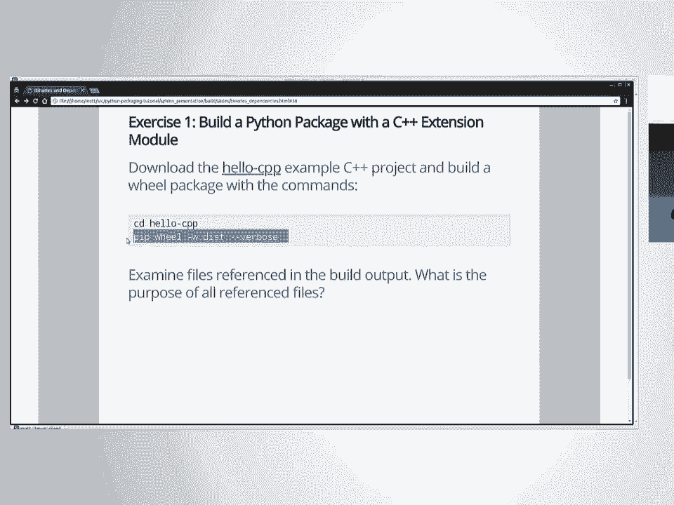

 So inside this package that we created， this hello package。

 We're going to move this away for a second here。 We have the package itself， which is hello。

 And that contains the under init file for the package。

 for the Python side of things and then contains the C++ file。 So that's our source code。

 We have a little test Python file。 And so for our package configuration， again we have the setup。

pile， which is all the author， metadata， etc。 For the Python package and what Python files are going to the package。

 and then there's the C side configuration， which is the CMakeList。txt。

 That's where the C configuration is。 You can take a look at those if you want to。

 But that's as a package builder and developer。 Those are the things we care about。

 And the other thing we care about is how to invoke our build tools。 So to invoke our build tools。

 we can again use pip wheel。 And we're going to put it into the directory。

 We are going to be verbal so we can see all the different commands that are being executed。

 And then we pass in dot for the current directory that we want to build a wheel package from。

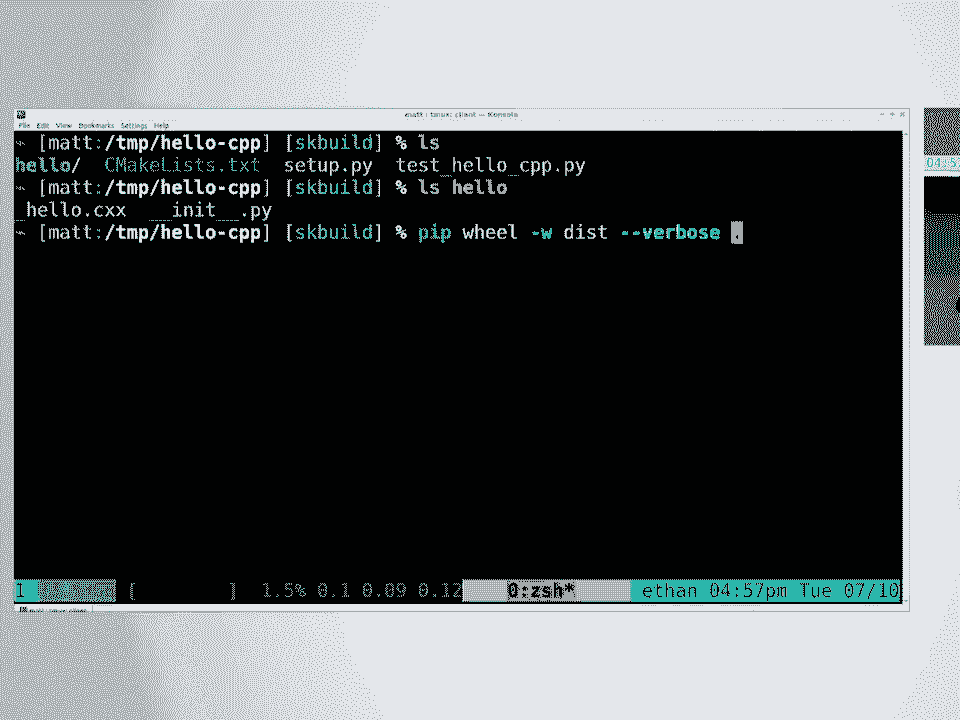

 Okay， and things are happening very quickly and successful at the end。

 So let's kind of walk through this and try to understand what is happening here and what is all this。

 It's not garbage。 It's actually really beautiful。 Beautiful things。 It's very beautiful。

 So we're seeing here， we're building with pip， package manager， kind of， we'll do a similar thing。

 First it's starting off， it's kind of creating a build directory， temporary build directory。

 and slash temp。 And it's pop-o-ing there。 And then it's going to look through the setup to Pi。

 and it's going to install the dependencies， that you need。 Since it's pip。

 it can only satisfy Python dependencies。 If it was Kanda， here would be。

 maybe if we needed a C++ library， it wouldn't install that for us。

 And make those header files available。 Then the next thing it's doing， it's going to run Python。

 and then it's going to invoke setup tools here。 And then when you invoke setup tools， B diswheel。

 This guy right here。 So instead of Python setup。py， develop， we're doing Python setup。py。

 B diswheel essentially is what pip is doing for us。 And what that is doing。

 since we're using scikit build to do our C build， that's invoking this， CMake tool。

 And that is our build system generator。 And so CMake is going to go through and inspect our system。

 find the compiler， and create our build， system configuration file。

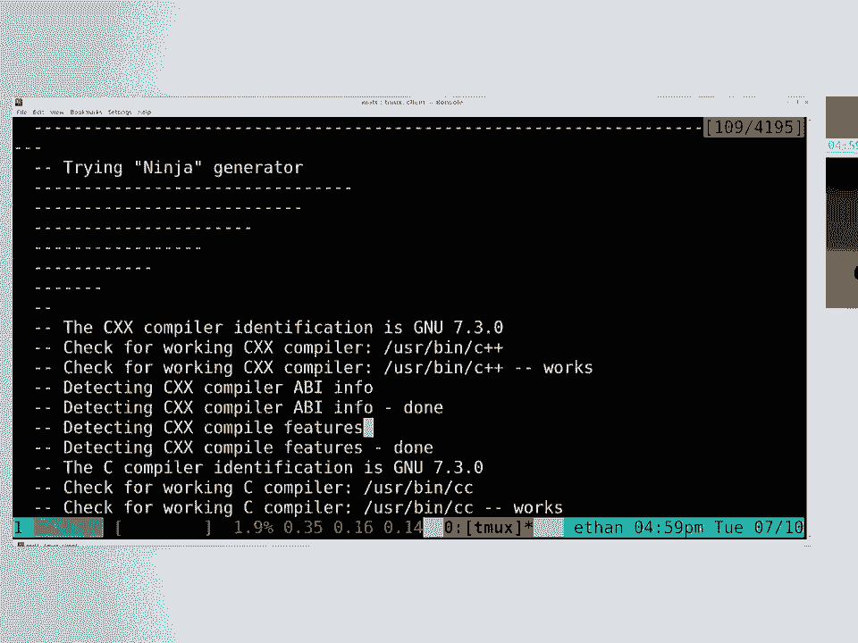

 So CMake goes through， it says， "Hey， I'm going to create this ninja generator。

 I'm going to use that。"， That's what it's saying here。 And it's saying， "Oh， I found a compiler。

 GCC for us。 And this is where it's located。

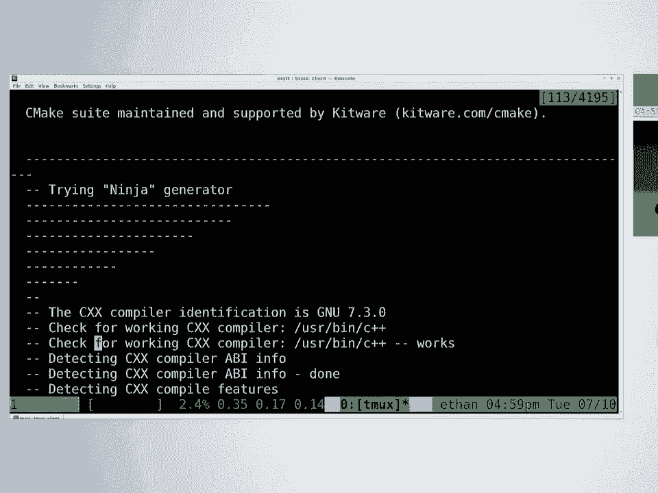

 And this is the different features that it has。"。

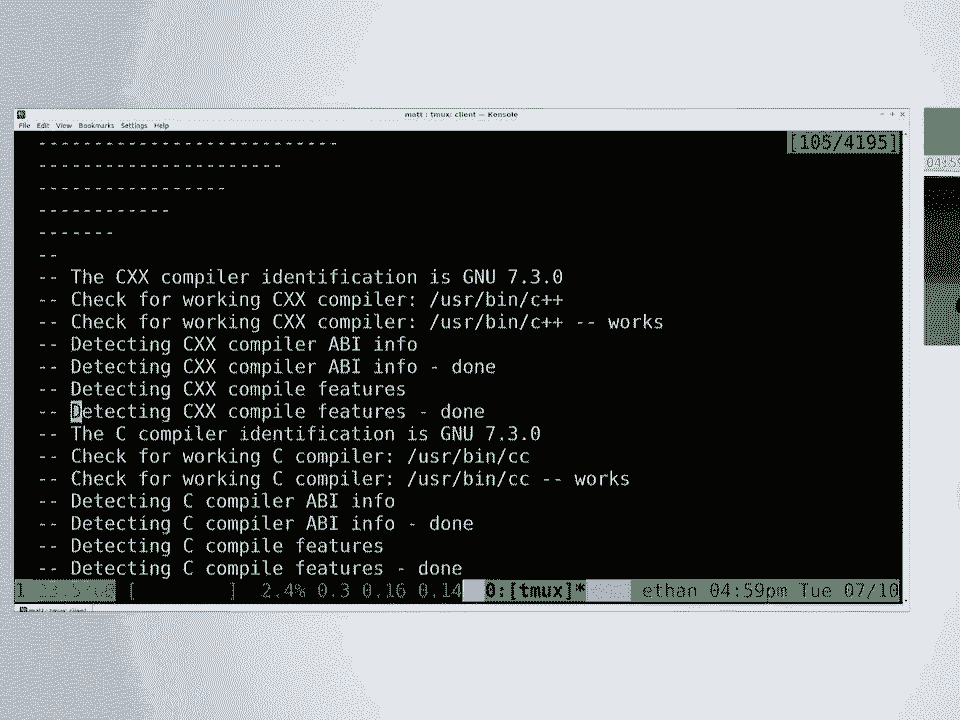

 And then it's generating the build。ninja file， which is what ninja will invoke to run the build。

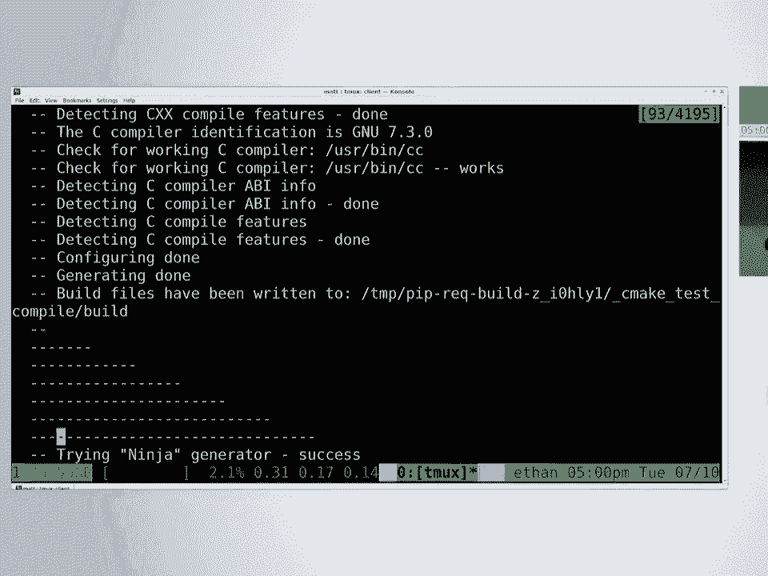

 So it generates， and it does this a few times。 So it's inspecting the system。

 making sure we're using the right Python， interpreting it， and the corresponding library。

 And it already took care of this kind of detailed， confusing thing called weak linking。

 It just takes care of that for us。 And the output is a build。ninja file。 Maybe we can't see it here。

 But then we invoke this ninja build tool。 And what is that tool going to do？

 That tool is going to run the compiler in the linker。 So at this point， this output right here。

 it says one of three。 That's where ninjas starting to be executed。 And the first thing it does。

 it takes that hello。cxx file， source code file， and it builds it into native binary code that can be interpreted。

 Well， this is kind of pre-christured to that。 And then after it does building all the C++ source code files。

 it brings them together and creates this native executable， the shared library。

 that is run by the system when we do import hello。 So that is what this 。so file here is。

 So then that build process is completed。 Then it's going to put together these things into a package。

 So it's taking the Python file and the 。the shared library that was created。

 and then zipping them together into a 。zip file， which is the wheel in the end。

 And also putting together the metadata that gets created， this egg that was discussed previously。

 that contains other metadata。 So this is the metadata。

 And then our result is our package that we can upload as JC discussed before。

 And then if you look in dist， this is the package that gets created。 And we can unzip。 It's a 。

zip file。 Unzip that file and see the contents are basically the Python source file。

 then this native binary that gets generated， and other metadata of the package， dependencies。

 author information， the questions there。 Questions。 What do you find beautiful about it？

 What do I find beautiful about it？ Is that it worked？ I just had to run one command and it worked。

 And then， you know， it's very nice。 At the end， we have something that I can give to Mike so that he can。

 reproduce saying hello to me。 That's great。 So you can distribute this to other people or you can reuse it in your own work on other platforms or systems。

 This will work on any Linux system。 That's a good question。 And then， yes？ Okay。

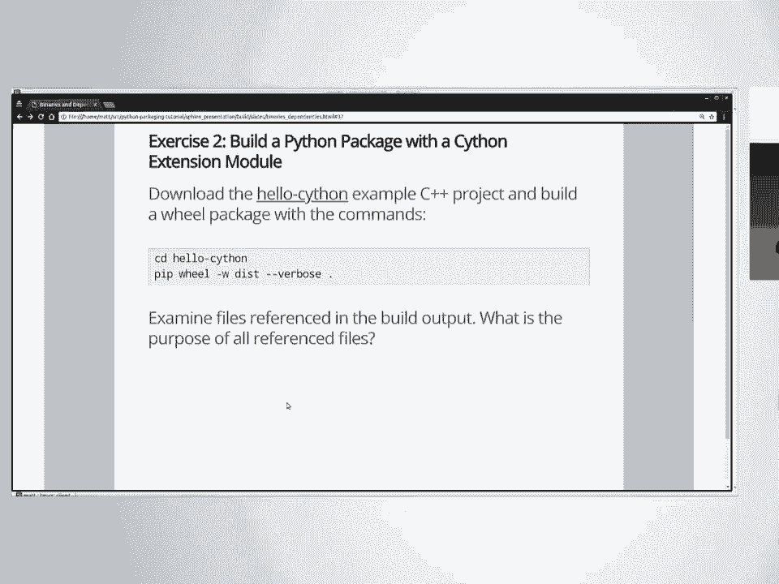

 So passing this is a good question。 So then， if we looked at the output， you know。

 this CMake system， you can maybe say， I wanted to use a different compiler when I build。

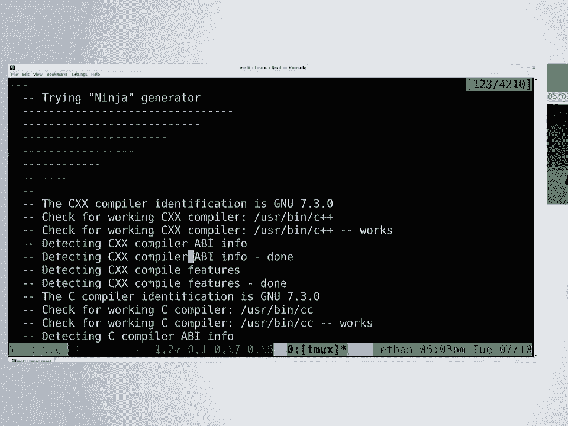

 And let's try doing this on my system here。 So if I want to pass other options for building the wheel。

 I'm going to go back instead of using the pip wheel。 Okay。 Yeah。 So there's a couple ways。

 All these conventions with building across different platforms。

 And that is supported and abstracted。 Again， supported all these different conventions and different platforms by these systems。

 So one way is if I wanted to use Clang， I could do export the CXX variable。

 which is a convention for environment of variable and Clang like that。

 And then if we do pip wheel now， we see it picks up Clang instead of CXX before。

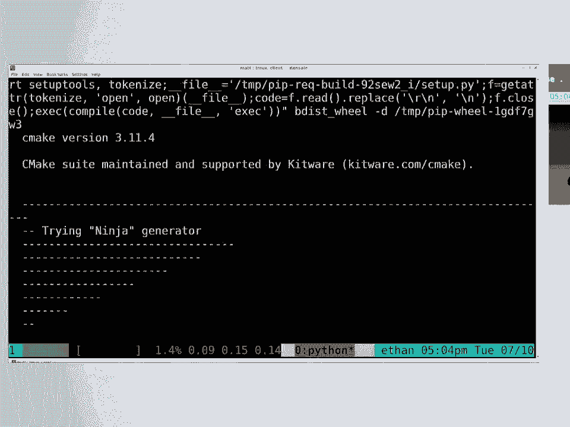

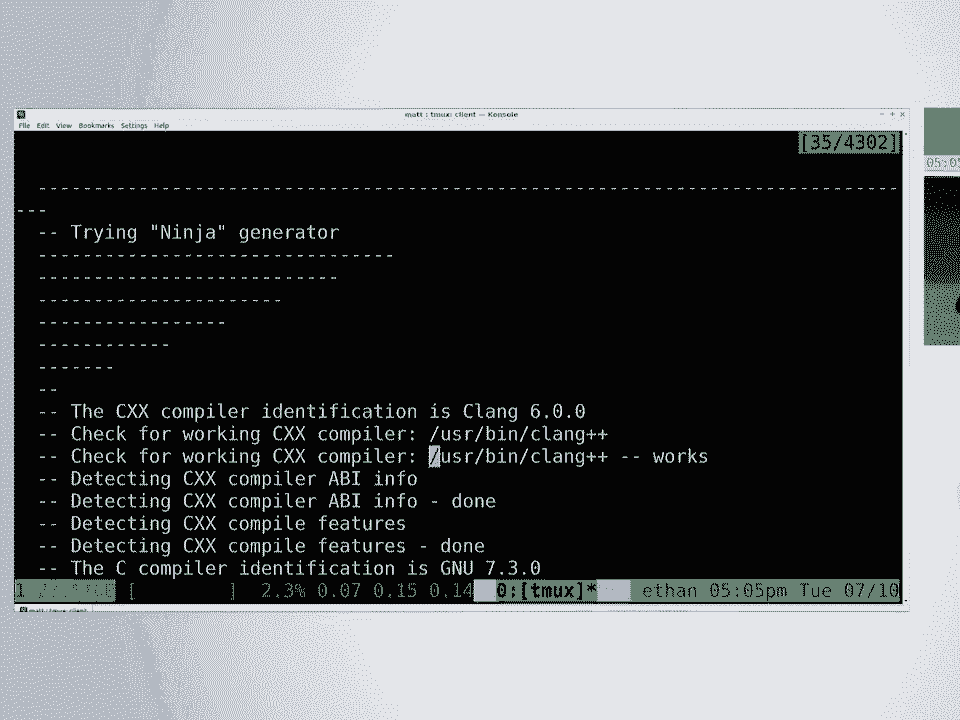

 That's one way， like JC recommended。 And I don't want to do that。 Another way。

 because we're transitioning again from Python setup。py， developer， what not， using pip。

 I'm not sure offhand what it is to with pip， but with invoking setup。py directly， we can do。

 if we were building the wheel， I'm going to be just wheel。 And then you would pass flags for B。

 just wheel options normally if you're just building a pure Python wheel。

 But if we're using scikit build， which is using cMake internally。

 we can pass flags to cMake by doing dash dash at the end。 Correct？

 And then another way of specifying the compiler there explicitly， it's a little more。

 It works across systems。 I guess the CXX works across systems too。

 but if it wasn't a compiler and you didn't have a special environment in variable。

 you can pass it this way。 CXX compiler equals Clang。 And then it picked up Clang again。

 And then that way we can say we want to enable feature of our library。

 disable a feature of our library， and create different types of packages。 Good question。

 [ Inaudible ]， Okay， cool。 So then going down the stack， JC was saying that to repeat what JC said。

 So we're going from Python set up to the setup tools and Python set up。py。

 Then we're going down the stack into cMake， which is our build system。

 And then if we want to then remember cMake generates the ninja configuration and it works ninja。

 So if we want to pass some arguments to ninja like dash J7。 Right？

 This means build with seven different C++ files at the same time， then we could do that。

 And that's going to pass that argument to ninja。 Cool。 Very cool。 So that's great。

 I'm going to skip the next example since it's very similar。

 So this is -- there's another example that you can look at on building a Python file。

 It's very similar， right？ It's going to invoke the Python compiler first。

 which is going to create a C file。 Because again， C is what we think about for compatibility and building scientific Python extensions。

 And then that's going to build that with the compiler， the linker， a similar output we'll。

 see in this case too and generate a similar package。 So it's using another language。

 And this is a bonus exercise here。 So the kind of the last thing I'll do interactively is we'll go back to the C++。

 And if you build your kind of package， you don't have this G-lib C library version because。

 it uses the correct old G-lib C。 But if you're building a compatible Linux package and here。

 we're doing the cross-compiling， essentially， this should work on Mac。

 I think it might be broken windows at the moment， unfortunately。

 But we can invoke this in a Docker environment， which is an isolated environment that has an。

 older G-lib C that will be compatible with many systems。 So this is the many Linux Docker image。

 And we have a helper script here。 This is something called DocCross。

 It's a helper script for doing cross-compiling。 And we can essentially first create that script by first running the image and kind of bootstrapping。

 this bash script that we created。cross any Linux。 So how that works is that here I'm going to remove these old artifacts first。

 sorry， from， the code。 So the code can set up to Pi。

 doesn't do this clean build environment that pip does。

 So essentially how this works is that you call this script and then you call commands that。

 you want to run inside the Docker environment and we'll use the local sources and use the。

 tools inside that environment so it's isolated。

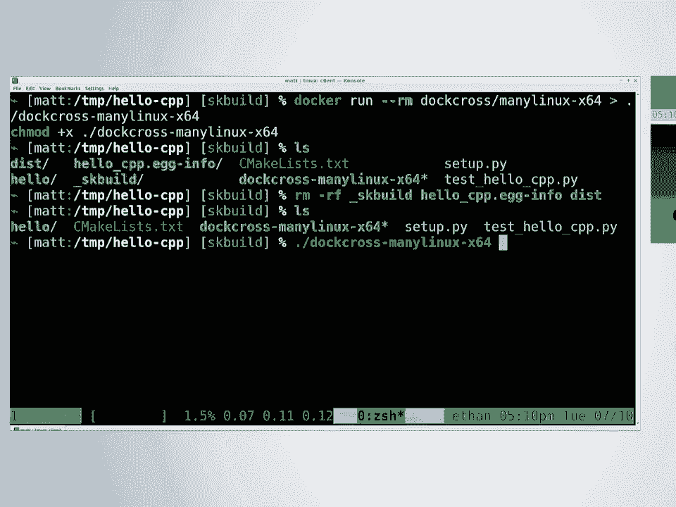

 Inside that environment in this Docker image it contains all the different CPython versions。

 and the compiler and the basic tools you need for building。

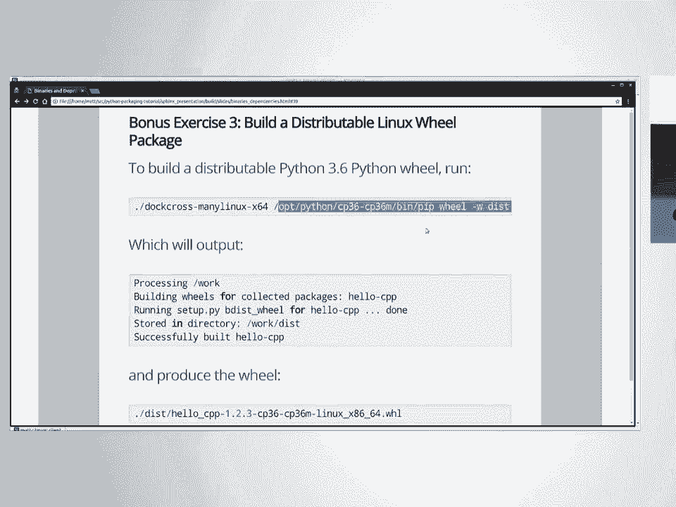

 And so we will invoke the pip there to create a binary for a certain pip version。

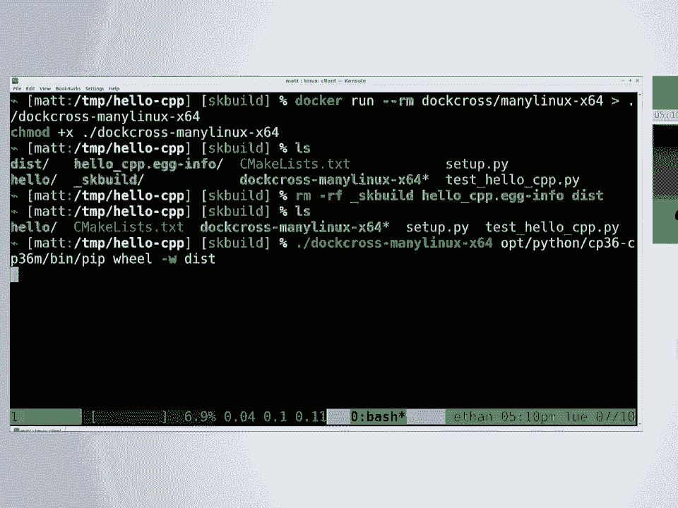

 >> Same leading slash。 >> Oh， thank you。 >> Okay， so that's the path inside the Docker image for the pip that we want to use。

 And so this is going to run the build inside the image and create a wheel。

 But this wheel is going to be president。 Let's see， everything here。 Oh。

 I also need to add the dot at the end。 Thank you。 The directory we want to build。

 So this is going to build the wheel but inside this Docker image using the Glib C that is。

 compatible with our system。 So what we can do is we can then build the wheel。

 We can look at this wheel。 Take apart this wheel。 Run a command。 We can unzip the wheel。

 And just a zip file。 And then look at the different symbols。

 the C symbols that are part of that wheel that are， used for loading。

 And see what symbols we have there。 And one of the symbols that is for all these C extensions。

 they need to use a standard library。 Just like the Python standard library。

 C has a standard library。 And it has a version of that library with Glib C。

 So we see when you inspect the symbols， that's what this object dump utility does。

 We see that it gives us Glib C and it also is associated with it a version。

 So then for binary compatibility， we have to think about having that version old enough。

 so it's available on all the systems we want to work with。 So if I can interrupt。

 who has tried to install TensorFlow from IPI and add it no more？ Quite a few people， right？ Well。

 the main reason why is because Google has kind of said it's too hard to continue。

 supporting older C++ standards and things that we're just going to build with newer tools。

 And if you run the same analysis on their wheel to look at what symbol they have， their baseline。

 Glib C is quite a bit higher。 So it's minimum operating system requirement is quite a bit higher than what these guys are。

 showing you building with this image。 So it's probably true that you can't build TensorFlow out of the box with this image。

 You have to patch it a lot。 There's reasons why Google does things the way that they do。

 It's not just capricious， but that's what's in play here。 Cool。 Cool。

 So hopefully that was insightful， maybe， on everything that goes into binary compatibility。

 and sort of what you need to do， at least to build a system。 And if something goes wrong。

 maybe that kind of explains where it can go wrong and why it can go wrong。

 And then just to add a little more information and a little bit of teasers。

 what are the next steps that you do？ Now you've built your package and you've created a package out of it。

 The next thing that you're going to do is to run CI。

 So there are CI services that you can use on GitHub。

 And here's some links for the three different platforms so that you can create different packages for。

 Maclinics Windows for the different versions of Python。 And because we're using right。

 C runtime compatibility practices， another binary compatibility practices。

 these will work across as many systems as possible。 So then you can do that with CI。

 And then as a teaser， the next thing you're going to do is then also create a kind of package。

 recipe configuration out of it and do CI and kind of forage， but those things are coming next。

 So take a break， I guess， next。 Yeah， we'll take a break。 Come back at 420。 [ Inaudible ]。

 So we have come to my favorite part of the time。 Conda build。

 And what I'm going to talk about is how Conda build builds on top of all the stuff you've seen today。

 to make packages easier to provide to people as binaries。

 And so Conda was created as a tool to distribute binary stuff and has seen a lot of popularity。

 in the scientific Python world because it makes dealing with binary so easy。

 And so the crummy thing about dealing with binaries。

 you guys have seen that there's a lot of compatibility concerns。

 And what that means is you have to build stuff a lot of different ways to support everybody on the planet。

 And so what we'll talk about is how Conda build recipes work， how you can specify stuff to build。

 And then we'll talk about other ways that Conda build helps you be more efficient。

 And you get to do less work， but the machines do more work。 So let's get started。

 Why has Conda been successful？ Conda packages and wheels came out right around the same time。

 I think it depends on who's telling the story。 And so I'm going to take neither side。 Yeah， wheels。

 you can use them in any Python installation。 And so that's kind of like you could use it with a system Python。

 you could use it with an anaconda Python。 You can use them anywhere。

 You can only use Conda packages in Conda installations。

 So that's kind of like you don't necessarily have to install Miniconda or Anaconda to use Conda。

 But it's kind of the only way to use Conda packages。

 There's just too much metadata to handle otherwise。

 Wheels are mostly specific to the Python ecosystem except for these crazy kitware guys that somehow put CMake on PyPI。

 Whereas Conda packages are totally general purpose。 They can be configuration。

 They can be web servers。 They can be anything that you want them to be。

 Oftentimes they just simply set environment variables。 So they're much more flexible， I'd say。

 than a wheel。 You guys have seen how good wheels are at specifying saying they run on any Python 3 or Python 2。

 7， and 3， or whatever it is。 Wheels have a very well worked out way to do that。

 Conda is not very good at that right now。 So that's something we're kind of working on。

 We call it no arch。 But we don't have a very good notion for some arch。

 Where it's compatible with a range of things but not everything。

 So that's kind of a weak point of Conda at the moment compared to wheels。

 The key distinction in the scientific Python world between wheels and Conda packages is that wheels very much operate under the assumption of the system。

 They can't contain external dependencies。 There's no way to specify that external dependency。

 And this has been a subject of a lot of heartburn and a lot of arguing on a PIPA mailing list。

 The long story short is it just isn't supported at the moment in the wheel world and nobody knows if it will ever be。

 So you have to do static linking or you kind of have to leave dangling dependencies and tell people to do that。

 And tell people hey you need to install this with your system dependency and make it available somehow or else it won't work and maybe people forget to specify that stuff。

 It's kind of a mess。 In Conda we take the opposite role。

 We say your package should really only be exactly your thing。

 And you should fulfill your dependencies with shared libraries as much as you can。

 And what it does is it decentralizes the work to each different project。

 It reduces the build times and we also end up with a more compatible complete control of all the binary dependencies across the system。

 So Conda build。 This is why I'm excited。 Conda build has been my baby for about two years and it's a tool that mostly handles a bunch of really boring shell script jobs。

 So what it does is it creates environments for you。

 It provisions those headers and things that we talked about earlier。

 And it automates the running of the test processes and the build processes。

 It's kind of intended to be flexible so currently it can create conda packages and wheels。

 There's nothing saying it couldn't create RPMs or whatever。 Just kind of an implementation detail。

 It is not the same thing as Conda but they're pretty tightly integrated。

 It is a totally open source project。 It's actively developed。

 You guys are welcome to go find it and harass me on there。 So first things first。

 Go ahead and install Conda build on your systems please。

 You should be able to just say Conda install Conda dash build。

 If you're on Windows you might want to install these extra things that will take a little longer。

 And whenever you're ready just to test that you have it working。

 I'm assuming here you guys have a git clone of the Python packaging tutorial。

 If you don't do I need to step back and go get it。 I think we all cloned it earlier。 Great。

 So cd into the Conda build recipes folder and run Conda build on the first recipe。 Yeah。

 [ Inaudible ]， So JC had a good question。 Why can't Conda build automatically require these？

 The answer is well M2 patch is kind of mandatory and I think Conda build might depend on it。

 Pauseix is like everything you need to run a bash shell and by no means is it mandatory。

 So that one's just an optional dependency。 That's another thing Conda is terrible at by the way right now that we're working on is optional dependencies。

 And so Pip has this way of specifying like oh if you want this package plus this extra functionality this is how you do it。

 So we're working on ways to improve that with Conda but we're a little behind on that。

 So whenever you guys get this Conda build going take a look up and I will move on。 [ Inaudible ]。

 Yeah so that's a really good question。 I think Chris talked earlier about how Pip doesn't really have a meaningful solver。

 And what Conda is is it's something called a SAT solver a satisfiability solver and it's more complicated than I really understand。

 But it is a whole bunch of constraints that are the specs that you provide and it does a lot of math to figure out what is the optimal condition。

 And it figures out like how do I maximize the version of all the things that have been manually specified。

 I minimize the overall package count。 There's a lot of different conditions that it goes through to say what exactly it's going to install。

 And sometimes it takes a while。 Usually what I find when it's taking a long time to solve something is it's actually downloading like the repo data JSON in the background。

 It's not actually taking that long to solve。 Solving is pretty quick when you actually have the data available。

 So I think you'll find that once it's cached it goes pretty quick。 Okay so what did you see happen？

 Whole bunch of text。 Much like the happy stuff that Matt showed。

 Yeah let me go ahead and do it just so that I can talk about it。

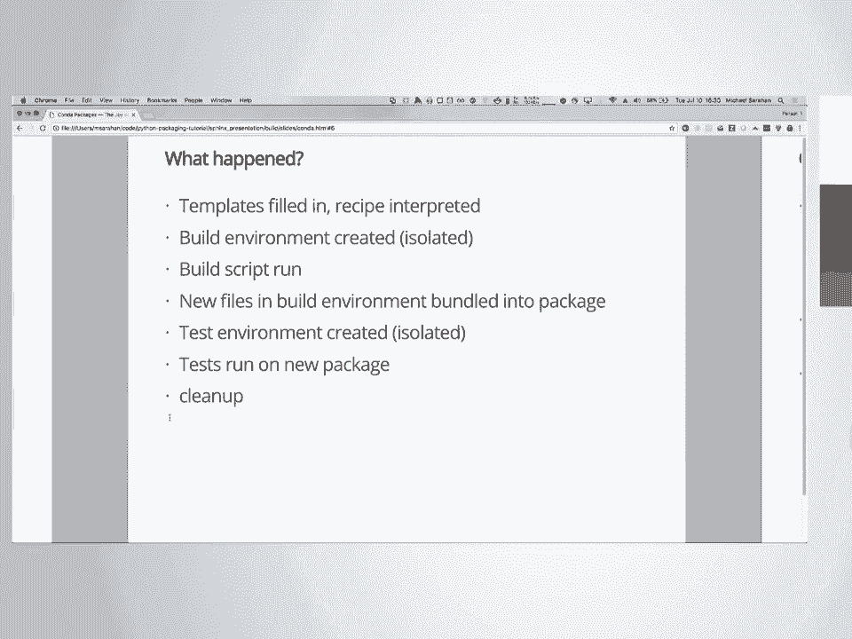

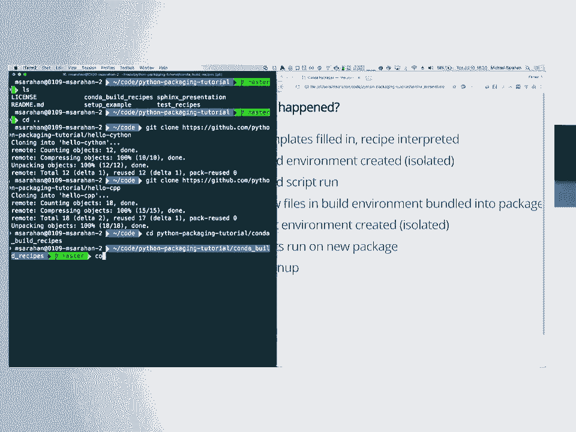

 And is this text big enough for you guys or do I need to make it a little bigger？ A little bigger。

 I'll just switch over this so I can show you what's going on。

 Okay so what's going on is first Conda build is taking a look at the recipe and it's figuring out what exactly it's building。

 Conda build has the requirement that it has to know exactly what the thing is going to end up as in terms of like important stuff。

 And basically saying it has to know what all it's going to use to create the package before it ever goes to create it。

 And that is what goes into the name。 Then we download the source if there is any。

 This is where we would create the build environment and once the build is done we begin packaging things。

 Next we go on to Conda build is saying hey you don't have any files。

 Are you sure this is a good package？ That's not normally a good package。

 And then you go through and you start the automated test stuff。

 So this example if we take a look at what's in it is the absolute bare minimum of what a recipe has to be。

 It just has to have a name and a version。 And so there's really practically nothing that Conda build is going to do with this。

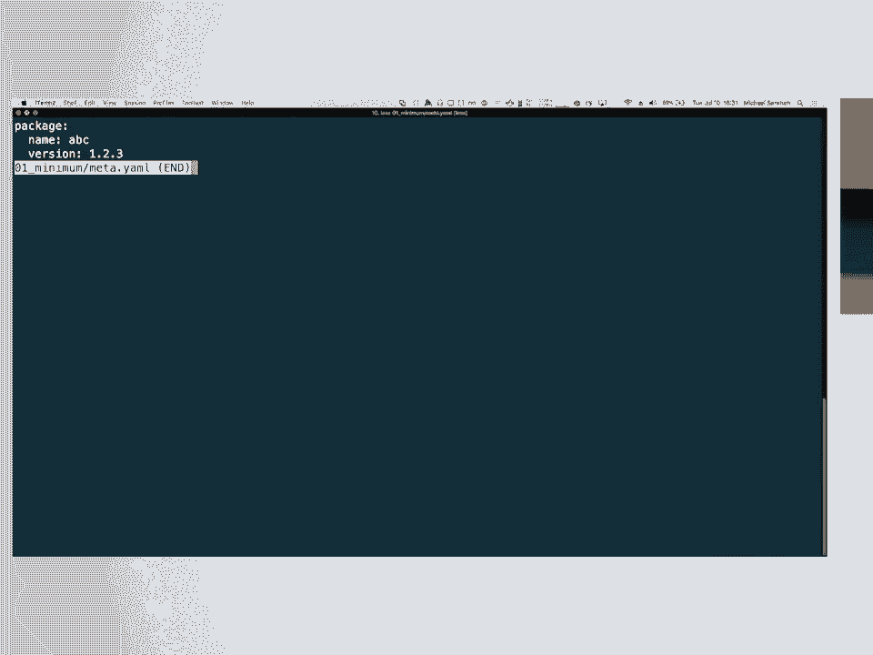

 It's just to show you what the bare minimum is。 So let's go back here。

 How do you get recipes to feed Conda build？ What I would recommend， first things first。

 try to go find somebody else who already did it。 Because these things are puzzles。

 they're fun to work out except when you get stuck on them for weeks。

 And the best place to find them is either Continuum or Anaconda's collection here at Anaconda recipes or at Conda Forge。

 And so I'll talk a little bit about what each of these things are。 Anaconda recipes。

 if you've ever wondered how Anaconda's packages are created， this is where you go to find out。

 This is all of our recipes。 So you can go here。 Since Anaconda 5。0。

 which came out in about September last year， these are recipes that we have forked from Conda Forge。

 And the intent there is to keep in sync with Conda Forge。

 Because we really want to both contribute our effort directly to the community and benefit from the community's effort。

 So we made this switch back in September。 We still are undergoing the very long process to try to merge these things。

 And so right now the recipes you find on Anaconda recipes are different from what you'll find on Conda Forge。

 because we've done extra work to modernize them a bit and they've kind of drifted。

 So that's work that is ongoing。 I'll talk first about what Conda Forge is and then I'll talk about the repo structure and we have a celebrity in the audience too。

 [ Inaudible ]， So Anaconda recipes isn't necessarily in need of review because we don't let anybody else really use it。

 So people can put up PRs to us。 We don't give anybody permission to change stuff。

 That's like a totally Anaconda controlled organization。

 And we probably won't ever give anybody direct access to that。

 We would ask that the interface for the community be Conda Forge。

 And any of the improvements that are made to Conda Forge， we would hope to capture。

 And we hope that the peer review process， including us as peers in Conda Forge， will catch that。

 Okay， so Conda Forge is the brainchild of a couple of people in the room here。

 We've got Phil Elson and Philippe here。 Yes， did a lot of great work to come up with this idea。

 It is a really， really cool idea of how to distribute the responsibility of maintaining recipes。

 And so prior to these guys' idea， there were several different single repositories of boatloads of recipes。

 And the crummy thing there is that if you want to give somebody permission to change a recipe。

 by definition you give them permission to change all the recipes。 Whoops。

 probably not what you want。 And so the really great innovation here is that you do one GitHub repository per recipe。

 and you have really great granularity over the permissions。

 Each different package can have its own maintainers。

 And Phil also came up with really clever ways to automate this using the free CI services。

 And so these things are set up to where users don't have to learn very much to set up these automated package builds。

 You just submit a Conda recipe to a particular place and then the rest of the magic happens for you more or less。

 So that， I wanted to talk a tiny bit about that one repository per recipe。

 because what you see when you go to Anaconda recipes or to Condaforge。

 is this massive collection of things called feedstocks。

 And a feedstock is a Conda recipe plus the CI scripts that run it。

 And so when you're looking for a package recipe， that's how I would start with it。

 And so I might go to Google and say zero MQ Conda recipe。

 And the first hit here is probably going to be the Condaforge feedstock。

 And if you take a look in the feedstock， you got the recipe and here's the magic。

 You can fork this for yourself， you can build it yourself。 You can also kind of。

 even if the recipe you want is not present， you can kind of say， "Well。

 what's something that's roughly like what I want？"， And go find it and fork that recipe。

 build on it， make your own。 Okay， any questions on this ecosystem so far？ Nope。 All right。

 And thank you， Phil and Felipe， for getting that started。 The other way， well。

 one other good way to create a recipe， if you don't have a reference on one of those Anaconda recipes or Condaforge places。

 is you can pull it from PIPI or from CRAN or from CPAN。 And this is called a skeleton。

 And there is a Conda command for this。 It will save you some boilerplate work。 It might work。

 it might not。 But at the very least， it'll hopefully get you started。

 And go ahead and give this a try at your terminal here。

 So， oops。 What I want to say is。 Conda skeleton， PIPI。 And click is a simple pure Python tool。

 What that's doing is it's going out to PIPI， downloading the package from PIPI， inspecting it。

 tearing it apart， running that setup。py thing that I told you is really bad。

 because it could be arbitrary code， so I could have just killed my computer。

 And then it's figuring out， isn't that fun？ Think about that。

 Every time you install something from PIPI， this could be running arbitrary code。 Yeah。

 If you have wheels， yes， that's good。 That's a very good point。 Yeah， if you have wheels。

 not so much。 Just not everything has wheels， unfortunately。

 So here what happened is Conda build first went around and looked at what was available。

 Since we didn't specify a version， pick the latest version for us。

 It told us if you want to use a different version， you can use the dash dash version flag。

 Downloaded the package。 Took a look at this。 Here it's creating the environment to be able to run the setup。

py file。 All right。 And after it runs setup。py， it knows how to create a recipe。

 so the program ends pretty shortly， thereafter。 But what we're left with is a folder from the thing that's that we got a recipe for。

 Oops。 And I want to show you guys what's in that file。

 It's a Conda recipe that has a whole bunch of complicated GINJIT2 templating stuff that I'll talk about a little later。

 At this point， all I really want to show you is that this is a good way to get a recipe for anything on PIPI pretty quickly。

 Okay。

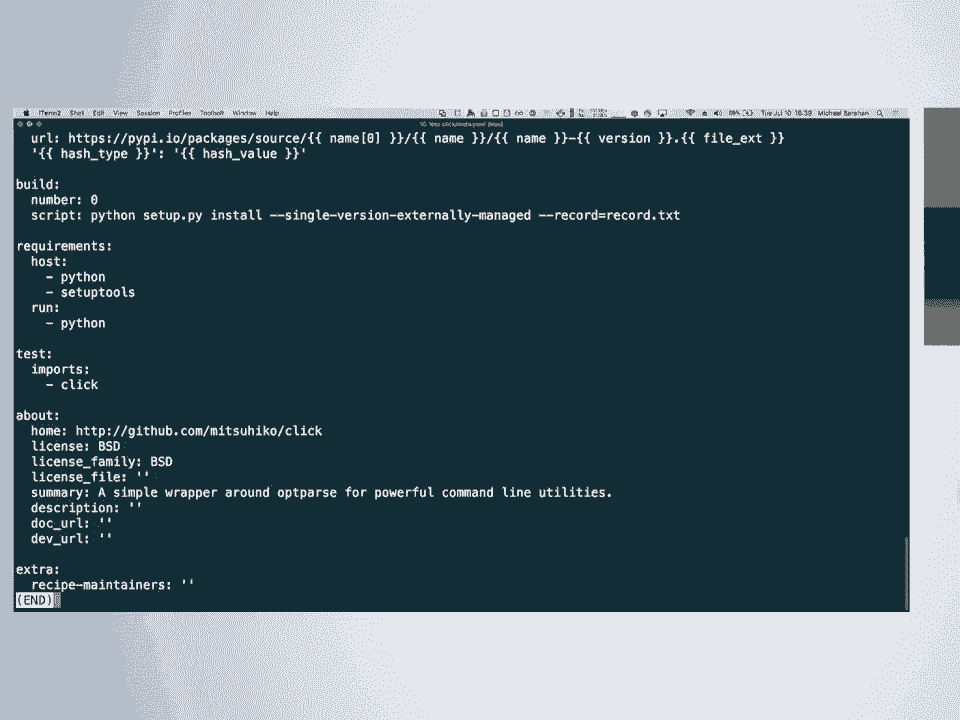

 So back here， there are things that have， like， Py instrument is a package that used to be self-contained but split up into a C extension and a pure Python thing。

 And so there are things where you can build a skeleton and it won't work。

 It'll say it has a missing dependency。

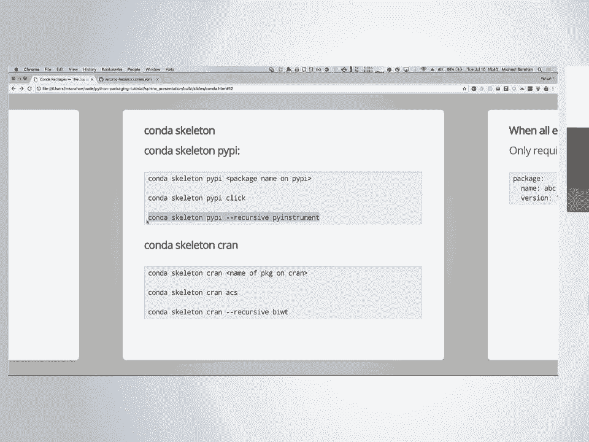

 So let's go ahead and say Conda Skeleton， PyPI， Py instrument。

 Just to give you guys an idea of the many， many， many different things that can go wrong。

 So if we now say Conda build Py instrument， Conda build is going to say， I can't do that。

 It's missing this extra package。 And so that's what this --recursive flag is。

 It'll go in and create all the different recipes。 And， yeah。

 So we get Py instrument and it'll also then figure out that it also needs to get Py instrument CXT。

 And after we have that， we can say Conda build。 And Conda build is smart enough to say you need Py instrument CXT。

 I see the folder sitting right here。

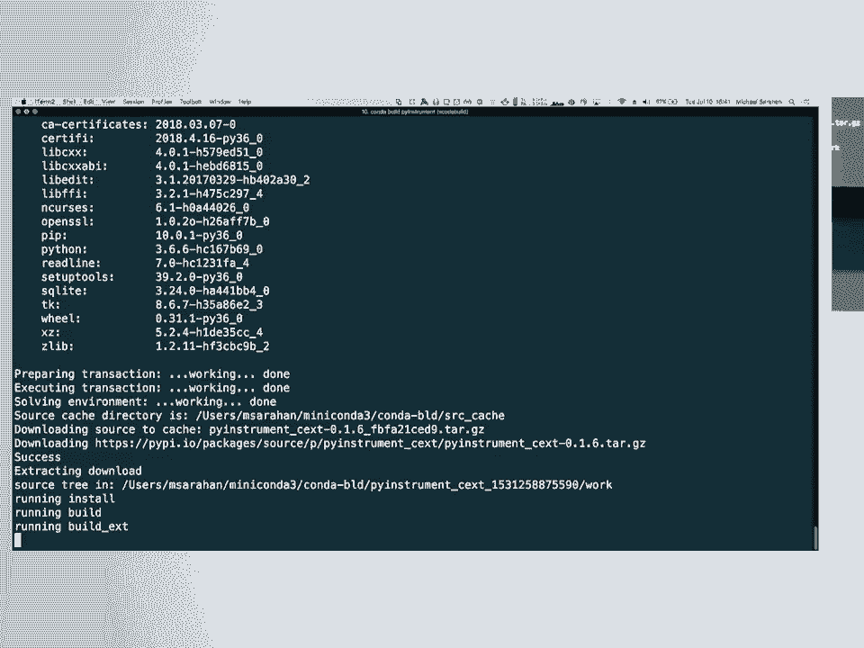

 Okay。 So there's an equivalent for CRAN and for CPAN。 I'm not going to run those。

 If you're interested in those， talk to me later if you'd like to learn more about how they work。

 But I guess that's just to say there's quick ways to get recipes that almost work。 Most of the time。

 All right。 When all else fails， you're stuck writing a recipe。 Sorry， but that's what I do all day。

 You'll get over it。 You'll be joyful。 So in this folder， I've given you several different recipes。

 You can look at them if you'd like to cheat。 But what I'd like you to do is try to create a basic recipe that really just builds and does nothing。

 So if you guys remember， the bare minimum of what you have to define is that the package name and the package version。

 Here we go。 So go ahead， write a meta。yaml file。 Meta。yaml is the file that CondaBuild always wants。

 And it's always expecting to find only one。 So it will recurse through folders looking for them。

 But it gets confused if you give it a root folder that has more than one meta。

yaml throughout the tree。 So you put it in the root folder， and then we have such tree structure。

 So this is another kind of like convention thing。 And what you see most commonly is that many libraries have two recipes。

 And so one recipe will be a development recipe and that will sit in their source code。

 So I'll go ahead and show you CondaBuild。 CondaBuild has a folder called Conda。recipes。

 That's pretty standard-ish。 And yeah， this is a recipe that kind of serves primarily to run CI and to make sure that the Conda package builds are still working on CI。

 What you'll then also have is some recipe over at， say， CondaForge， the feedstock。

 CondaBuild feedstock。 And so this is， it really looks almost the same。

 But what you'll notice is there's a few key differences， especially in the source。

 So the source here is the Git URL that points one folder up。

 So it's just referring to the Git repository that is its parent。

 And that's useful again for CI builds。 Whereas when you're building something for release。

 you want to lock down the version。 And so it's like the recipes serve two different purposes。

 And for that reason you'll often have two different recipes。

 And it's a tiny bit painful to like forget missing。

 If you add a dependency to one and forget to add it to the other， that's kind of painful。

 but it's just life。 Okay。 Has everybody been able to get their first package？ Congratulations。

 Cookies for everyone。 CondaBuild supports a whole bunch of different kinds of sources。

 And so URL is kind of like， it can be any file that you put a URL for。 It can also。

 this is kind of a hack because of the way that path works。

 It can also be a relative path to some file on disk。 And so you can have it be that。

 You can do Git repositories， mercurial subversion， and local paths。

 If you'd like to know more about any of these for your particular source， go check out the docs。

 But for now， what I'd like you to do is take your recipe and add in an entry to it。

 a source entry to it， so that it's going to look on your local disk for files。

 And so go ahead and take a look at the docs。 Here， this source from a local path。

 And make it so that it's going to look in the current folder for its source。

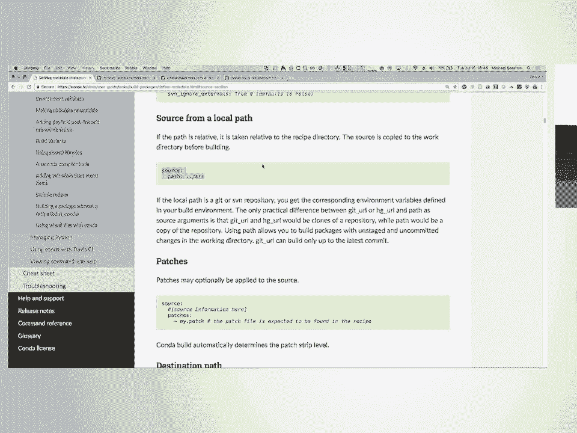

 Not yet， because we haven't actually done anything with that file that we provided it。

 We were providing the source files at build time， but we're not doing anything with them。

 so they don't end up in the package。 And we don't do anything different really from the first recipe。

 So， let's go a little further。 How do you do stuff in the recipe？ There are a lot of different ways。

 but kind of the most common or oldest way to do it is these two special files。

 that you're on to build goes looking for。 If you're on a Mac， the name of the file is build。sh。

 If you're on Windows， it's BLD。bat。 If you want to know why there's a difference there， I would too。

 One day maybe we'll change it or something。 But it is what it is。 And if you get those wrong。

 unfortunately， there's no way for CondaBuild to say， like， "Hey， you spelled the file name wrong。

 I'm not doing anything。 Sorry。"， It just ignores it at the moment。

 So if you find that your recipe is doing nothing， when you think it should be doing something。

 it's oftentimes a good thing to check whether you have these file names， right？

 So what goes into these？ It's on Mac and Linux。 The shell script is just a shell script。

 Do anything you want。 But the key idea of how this all works is that CondaBuild takes a snapshot of the files in what's called。

 dollar sign prefix， which is the prefix where the host dependency -- I'll talk about what。

 the host dependencies are in a bit。 It's where Conda goes looking for stuff。

 Where CondaBuild goes looking for stuff。 And so we take a snapshot after we've created the environment and we have all the files installed。

 And that's like our reference snapshot。 And then we run this script。 And then we say， "Okay。

 what's new？"， And right now we don't look at things that change。 We only look at brand new files。

 right？ So that is the fundamental basis of like any CondaBuild script is simply moving stuff into。

 dollar sign prefix。 That's it。 Nothing more complicated than that。

 And everything else that is more complicated than that is serving that purpose， ultimately。

 All right。 dollar sign prefix is not the only useful environment variable you have。 There are many。

 And so this link in the docs kind of tells you a lot of different things that might be useful。

 to you。 So dollar sign prefix is the build prefix to which the build script should install。

 Package name， package version。 SpDUR is the other one that you find really most useful。

 That is the site packages DUR， which if you're familiar with Python stuff， that's like the。

 main place on Python path。 So when you copy a 。py file into dollar sign SpDUR。

 it'll be in the right place when Conda， unpacks it。 All right。 Build。bad。

 Does anybody notice any differences here？ Is the exact same as the shell script。

 except you have to use this batch script environment， variable notation， right？

 So go ahead and write one of those scripts that's appropriate to whatever system you're。

 on and copy that file that you created in your previous recipe so that it gets picked。

 up in the package。 >> Into the metadata。 >> Yes。 That's a great question。

 It's a tiny bit more advanced than I'll get to it in a little while。

 The tricky part about it is it comes down to how do you specify the variables， right？

 Because you can't write dollar sign prefix because it doesn't work on Windows。

 And so I'll give you the more advanced ways to say， well， run it this way on Windows and。

 run it this way on the next whatever。 >> So if you do that， then the dot build。

 the dot S h are optional。 >> They're totally optional if you can。 Yeah。 People very。

 very often do that with pure Python packages。 So yeah。

 >> So you can use that same type of install command on all lot of works。 >> Right。

 >> So that's all you need to install and you can just。

 >> If you don't need any environment variable access， you're golden。 Yeah。 Most of the time。 Okay。

 So this was all I did in my script。 Copy some file into dollar sign prefix。

 And if you're on Windows， another annoying thing is CP doesn't exist on Windows by default。 Yeah。

 So there one day we will support PowerShell， but that day is not today。 Okay。 Everybody happy there？

 As long as you keep that concept in mind， like everything else is a bug hunt to say， well。

 why didn't the right stuff end up in the prefix？ Right。

 What do I need to change about my build dot S h from my build dot bat so that it gets put。

 in the right place？ And so that's what you spend almost all of your time doing with Conda recipes is just。

 trying to get the contents of build dot S h or build dot bat to do the right thing。 Okay。

 And all Conda build is doing is giving you the nice encapsulated environment that's reproducible。

 that you can just kind of rerun anytime you want。 Okay。

 So there's this other section called the build options。 I'm mostly going to skip over these。

 These are kind of tweaks to the build process。 This script entry is what Kevin asked about where you can just do one off lines。

 one off， commands if they're similar on all platforms。

 And there's all kinds of things that you tweak about the build process in this build， section。

 So way， way， way too much stuff to talk about here。 Just know that it's there。

 A more important section is the requirements。 And this is how Conda build knows what to create in terms of environments for you at。

 build time。 So there's three different kinds of environments。 There's build host and run。

 And I want to tell you a little bit about how these differ from each other。

 You should think of build requirements as tools that you build packages with。

 Not things that are headers， not things you link against。 So mostly it's like compilers， CMake。

 maybe， archive tools。 If you download something with curl or WGet。

 maybe you'd put it in your dependencies here。 But it's stuff that doesn't really like participate in the build in terms of becoming part of your。

 output。 It's something that acts on that pile of goo that becomes your output。

 The host on the other hand， this is where the magic happens。

 This is where you install all your headers。 It's where you install Python， R， Perl。

 whatever you're doing。 And because you install these things in the host prefix。

 when you use tools from that host， prefix to install other things， they go in the right place。

 So the fact that you list Python as a host dependency means that when you use Python or。

 pip to install something in your build。sh， it goes in the right place。

 So that's the foundation here of how that stuff works。

 Stuff that is defined in the host requirements is not automatically available at runtime。

 So if it needs to be available in both， you'd need to list it in the run dependency also。 Okay。

 And that takes me the run requirements， which are the run time requirements。

 This is the stuff that Conda is going to install for you when somebody says Conda install your。

 package。 Right。 So these are the libraries or other dependencies， Python library， different stuff。

 And again， they're not automatic。 Well， I lie。 I'll tell you about how they are automatically。

 So historically， there was only the build section。 There was no host section。

 The host section came in with Conda build three kind of around last summer。

 So if you take a look at a recipe that only has a build section， don't get too confused。 It's okay。

 Conda build does this stuff to try to merge them。 But for new recipes you create。

 just put everything in host。 It's just a lot simpler。

 And use the build section for where you put in compilers。 And if you're confused about any of this。

 come find us on our Gitter channel or on Conda， Forge and we'll be happy to discuss it with you。

 So what I'd like to do now is for you to take your recipe and add a Python requirement。

 to it and try to run Python in your environment in your build。sh script to tell you where it。

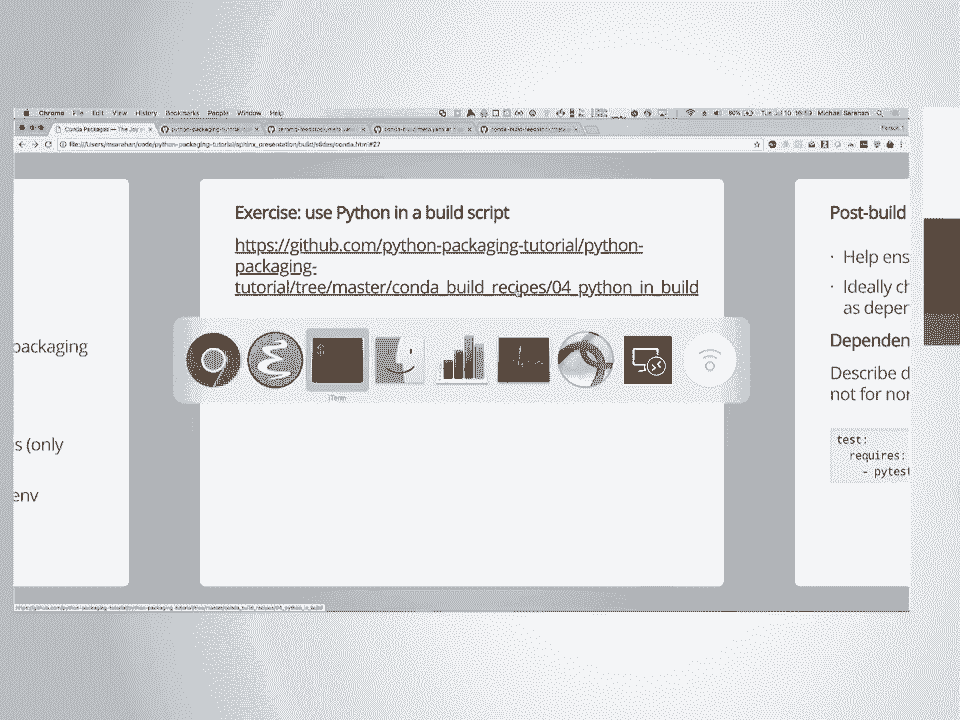

 comes from。 And so what I think I would like to do is， oh， that's interesting。 So yeah。

 I don't have anything hugely meaningful here。 So I can say which Python and that'll tell me which Python's available to me in that environment。

 And if you're on Windows， it's where Python。 Yay。

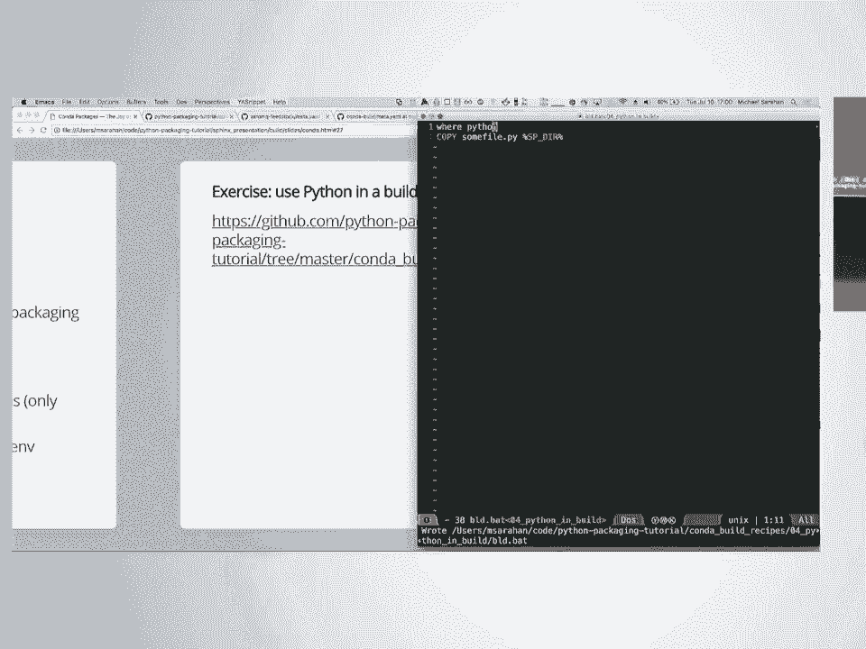

 But you see now that we have some requirements， our logs get a lot longer and Conda being。

 driven by Conda build is telling us what environment it's creating there。

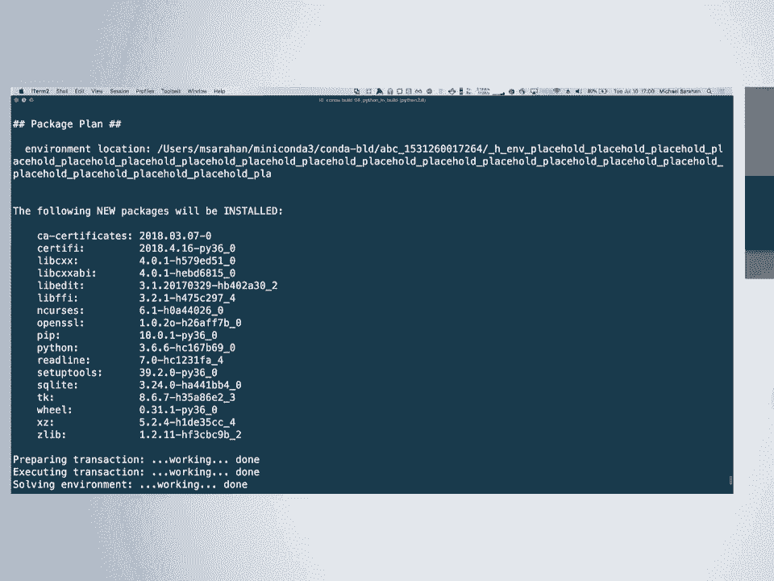

 So we specified Python in meta。yaml as a host requirement。

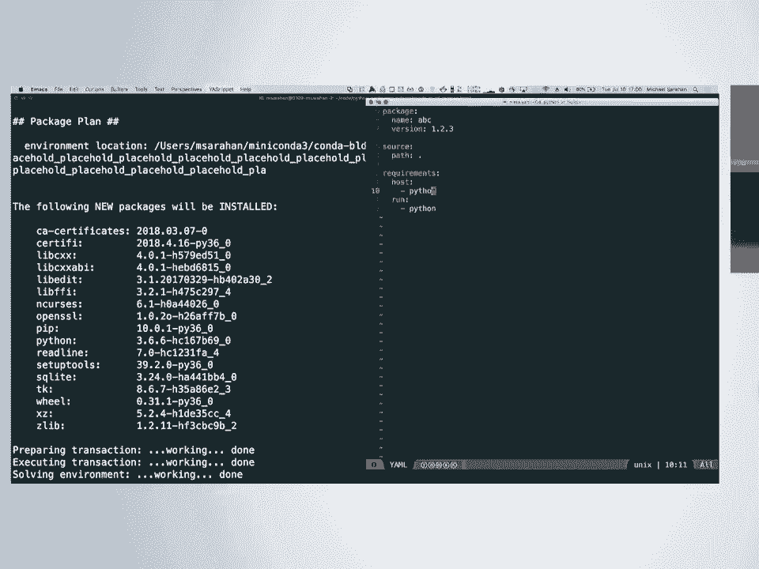

 And so when this thing creates the host environment， it's there。

 Why don't we see anything for the run？ Yeah， we haven't specified any run tests。

 So there's nothing to run at the moment。 It won't create a runtime environment。

 If you want the run stuff to run， specify some tests。 And so that's what I'd like us to do next。

 And it's a small enough increment。 I think we should just move on to doing that。

 Tests are so incredibly important。 And one of the nice things about Conda build is that you can just define automated tests。

 to make sure you aren't screwing up little bitty pieces of your package。

 So they can do a lot of different things。 They can just check whether a file is available or they can run more involved things like unit。

 test suites。 Ultimately， what you can or can't do is limit it to how long you want to wait for it to happen。

 So you can specify requirements that are specific to the test phase different from the run phase。

 You can specify your test to run in a few different ways。

 And so there's a bunch of specially named files。 If you have this file next to your recipe。

 Conda build will find it and run whatever is。

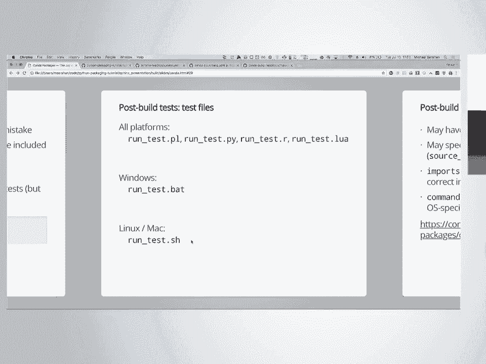

 in there。 And so let's take our recipe in here。 Say run test。sh。 So this is going to be fun。

 What I've done here in my recipe just to keep you guys apprised is I've copied some file。

 dot pi into the site package store。 So you remember this is where things run Python path。

 And so by copying some file into spdert， it should be just straight up importable。

 And so that's what I'm going to do in my run test。

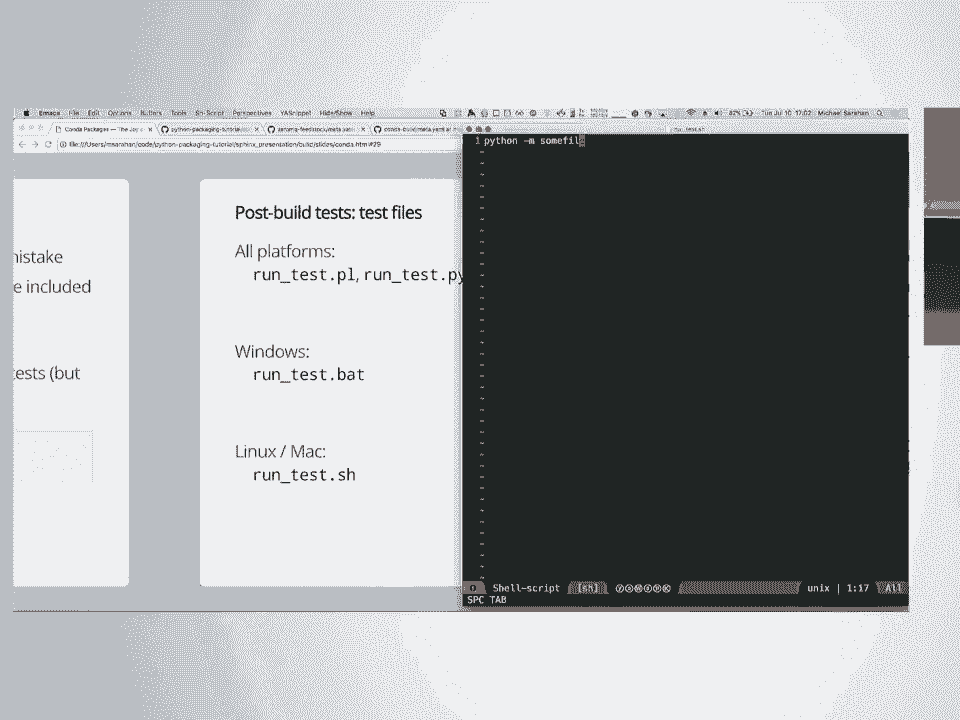

 I'm going to say Python dash M some file。 See what happens。 Okay。

 So we see we're actually getting environment created because we have tests now。

 And we're executing that file。 It says yes， I'm a file and I live in this really horribly long path。

 Right。 So this really horribly long path， you might say is atrocious and I'd have to agree with。

 you。 But it does serve an important purpose。 On platforms that embed paths in binaries。

 you have to have a long embedded path because， you can't expand that path after the binaries created。

 And so part of what kind of build is doing is creating these fudged blown up paths to。

 make sure you've got all that padding so that when people install your package， if they。

 have a really deep install path， they can still use it。

 And so the problem that we were having before was we were building packages for like say。

 normal desktop users with relatively short prefixes and people who were using clusters。

 who ended up with deeper nested paths couldn't use our packages。

 And so we had to go do this scheme to pad things deeper。

 That's why that's there。 And so I'm sorry for all the mess it makes。 Okay。 Test， yeah。

 It really depends on your package。 So not everything breaks this way。

 And we're a little bit overly conservative and I can't say for certain that it would break。

 But it could， yes。 Okay。 So there's a lot of extra stuff you can do for tests in meta。yaml itself。

 You can specify just simply imports。 And so these are like Python modules to automatically import。

 This is a really simple way to test your Python packages at the end of your thing。

 You can also run arbitrary commands。 You can also do any combination of any of these things。

 So run test。sh is totally fine to have with commands and imports and just do whatever you。

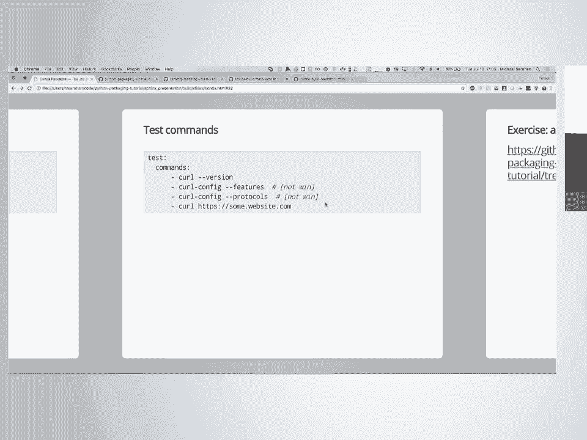

 want。 So let's go ahead and start playing with some more tests。

 I guess what I ended up doing was no run test。sh。 I just added in some commands and I added an import of some file。

 And why does import some file work？ Yeah。 It's in SPDER。 Right。 So as long as you copy it to SPDER。

 that's how Python will find it。 It's on Python path。 And this is， like it's not。

 I'd say it's not common to copy things directly to SPDER。 This is just a simple example。

 So most recipes you run for their installation， for pure Python stuff anyway， is going to be。

 nothing more than Python set up dot pi install。 Or sometimes there's some extra arguments for eggs。

 But yeah。

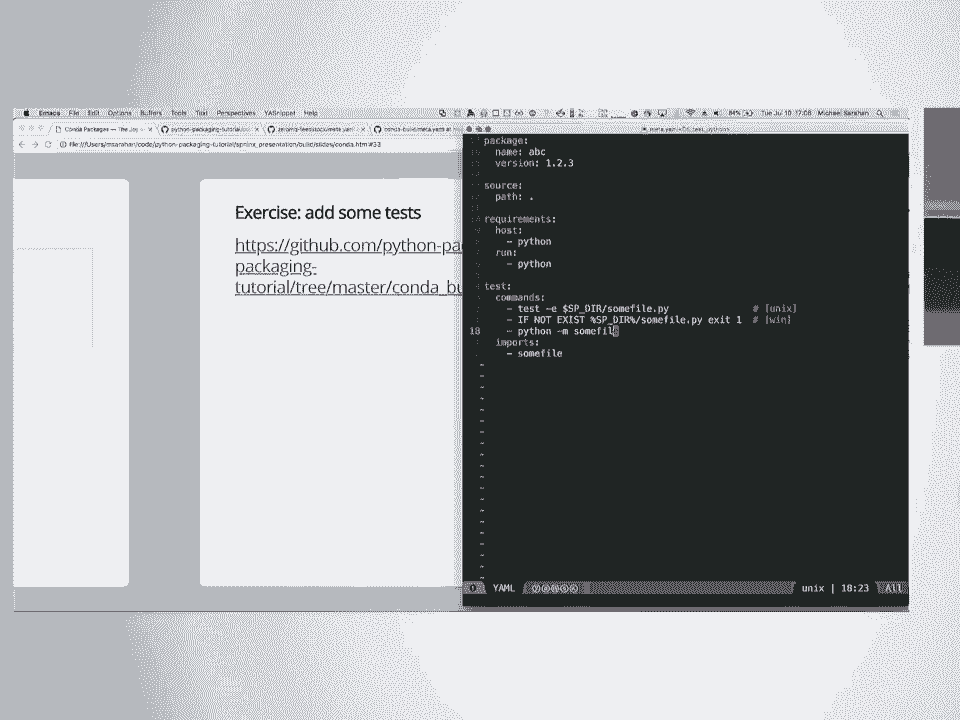

 So let's run this one and see what happens。 Okay。 So we got a couple of different things happening。

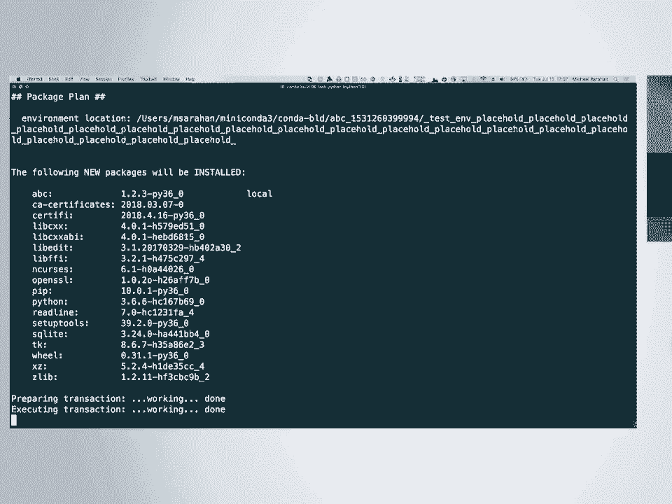

 And one of them， this first one is the import test， right？ It says， oh， I'm going to run import。

 When you run import， that is bringing the file in and running it， right？

 And we also have this test dash e， which is testing whether the file exists。

 These tests are pretty common。 Just simply file existence checks。

 And then we finally have Python dash m， some file doing that。

 These things over here are what I alluded to Kevin as ways to change what gets run on。

 what platform they're called selectors。 And so syntax is just like a couple of spaces， a hash。

 then the brackets。 And there's some predefined variables that you can use in that space to say where to。

 do what。 All right。 That's pretty much it。 There's a lot of extra complicated stuff that I'm not going to get too much into。

 Recipes are incredibly flexible。 You can have many different source inputs。

 You can also have many different outputs。 So a single recipe can output many packages。

 And so sometimes you want to do this because you build a humongous C++ package that has。

 Python wrappers。 And you want to only build the C++ package once and build the Python wrappers quickly。

 around the edges。 That's what this feature is for。 So I'll mention it。

 It's too complicated to do today， unfortunately， but I'd be happy to talk to you more about。

 it later。 There's also this about section that is metadata as far as licenses。

 things like that that， people care about sometimes。 And finally。

 there's this extra section where if you get creative and you want to control。

 something about your recipe， so for example， Condafour uses this for their maintainer list。

 This section is totally open。 Anybody can do anything in it。

 And we won't -- Conda build won't touch it。 We won't consider it when we do stuff。

 So I want to move on to some more advanced stuff。 Please stop me if I'm going too fast because we're running out of time。

 And I want to tell you all the cool stuff。 So selectors we've seen。

 The namespace includes some pretty fundamental stuff， mostly just what operating system it， is。

 And I'm going to tell you a little bit about a way in a minute of getting arbitrarily detailed。

 selector variables。 So you can use this in any recipes to skip particular platforms or particular Python versions。

 or anything like that。 They're very helpful constructs。 Ultimately， all meta。

yaml files use GINJIT2 templating。 And so GINJIT2 is just a generic templating system。

 We don't support quite all of it。 You can't do extensions of other templates。 But otherwise。

 you can do everything。 And templating can save you a ton of time when you reuse some value in your recipe。

 So this is a really common use of it for just the version。

 Oftentimes you'll set it in the version itself。 And you'll also change the source URL link。

 stuff like that。 GINJIT in many different places at once just by updating the top。

 The way that you use variables in GINJIT2 is this double bracket syntax。

 So you'll see that an awful lot in different recipes。 You can also do conditional sections。

 So I'd advise you to take a look at the GINJIT2 docs to see what you can do with GINJIT2。

 GINJIT2 is the basis of CondaBuild 3， which I call GINJIT2 on steroids or variants。

 It is the ability to allow you to set variables in a much more flexible way。 And so for variants。

 you define a file that looks like this just dead simple yaml with。

 a list of values and then in meta。yaml or really in any of your recipe files， you can。

 use that variable and it loops over all the values you provide。

 And so if you have a recipe like this where you're using skip_bear， right， so skip_bear。

 is not one of our defined selector variables， obviously， because it's a nutty name。

 But you can then have that defined in this variant config file， CondaBuildConfig。yaml。

 And anything you define in CondaBuildConfig。yaml is valid both as a selector and as a variable。

 anywhere in meta。yaml。 Okay。 So what this is going to do， we can create， oh， why do you do that？

 I did copy， not see。

 Oops。 (drum beats)， (sniffling)。

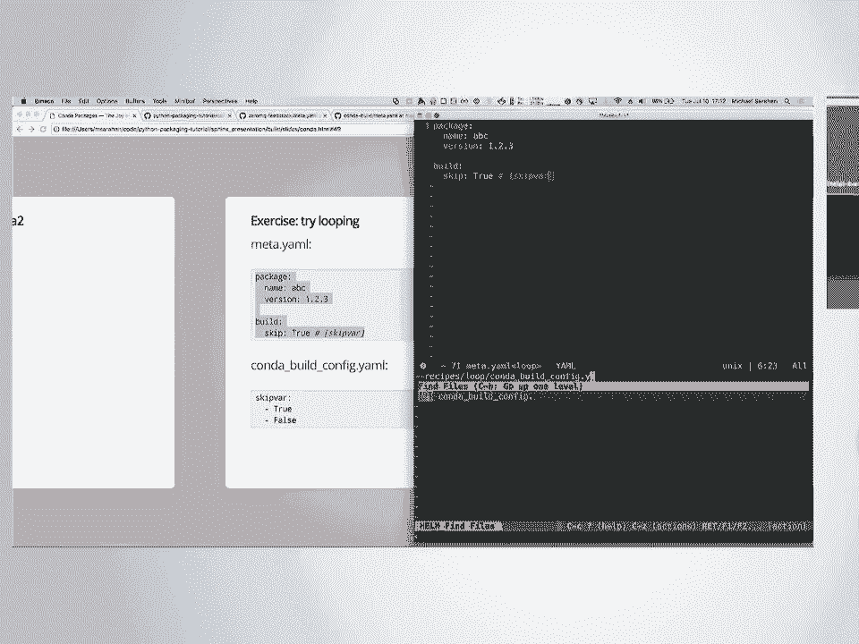

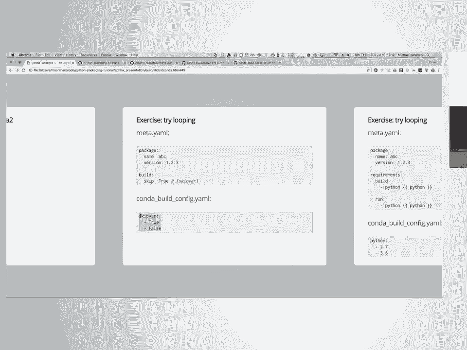

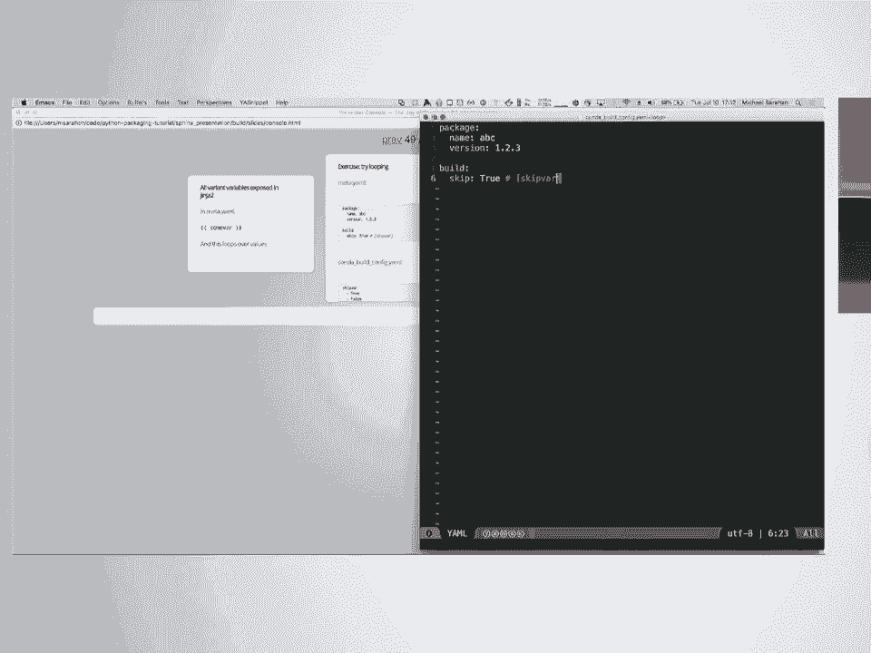

 Cheeky。 Eugh。 (sighing)。

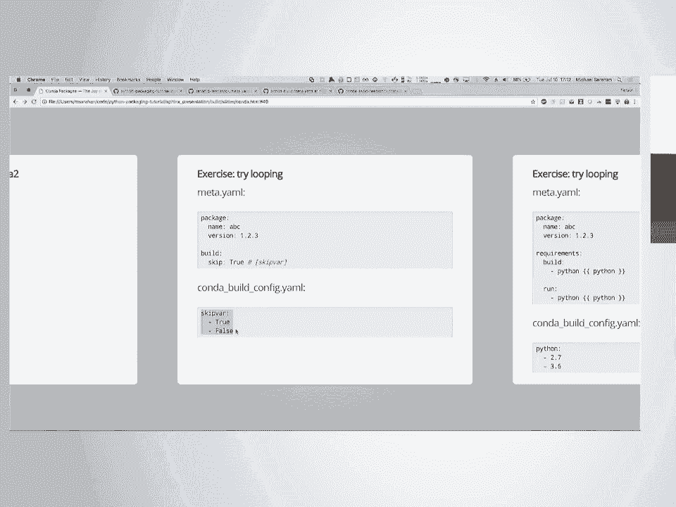

 Okay， and so what I wanna do here is just show you。

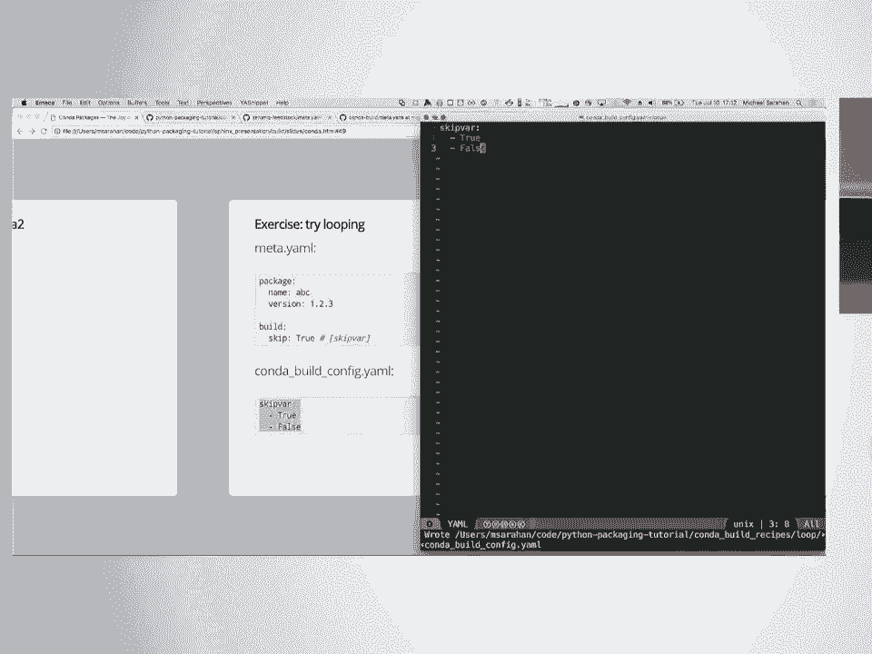

 how come to build treats that。 It's gonna build two different things。

 but only one of them is actually gonna get built， because Skip is true for one of them， right？

 And so up here we're gonna say we built this。 Skiped， ABC from whatever defines build skip。

 for this configuration， right？ Cool。 So that is very， very powerful。

 You can use it to loop over arbitrary things。 And so we use this to loop over different Python versions。

 We need to support Python 2。7， 3。5， 3。6， now 3。7。2。 So when I wanna build something。

 I don't wanna have to go and issue my build command， over and over and over。

 What I really wanna do is provide a matrix， and alter that matrix to build out different things。

 Okay。 So this is showing explicit looping， where I'm using those Python values。

 The really key thing to notice here， is that this thing matches this thing。

 The key in the kind of build config。yaml， has to match the use of it in meta。yaml。

 There's also this implicit matching， in the requirements section。

 So if there's something named Python， in the kind of build config。yaml。

 that matches the requirement， then it'll match it up and say， oh good， this is what you want。

 I'm gonna go ahead and loop over this。 All right。 There's also a whole lot of cool dynamic ways。

 to get data from your source code， and to also make your pins or your constraints。

 on your recipes be dynamic， based on what's present elsewhere in the recipe。 So， JC， I think。

 mentioned version here。 Version here is awesome， because it lets you define your version in just one place。

 And it would kinda stink， if you had to come to your conda recipe， and define it manually here。

 So this is one way you can load stuff， from setup。py， which draws from version here。

 and have it then injected into your conda recipe。 For development recipes， this is like awesome。

 And then for the other ones， it doesn't work so well。 But it's just， yeah。

 There's an equivalent for arbitrary data。 So some people have funky external repacks。

 that they wanna do。 You can use patterns to extract data， from absolutely anything you want。

 And if you guys have questions on that， let me know。

 But what I'm really excited about is this dynamic pinning。 And the reason why is， what happens。

 what has happened to us a lot in the past， is we build a recipe， and we build this recipe， say。

 against JPEG 8C。 Now the JPEG world moves on， and we now build packages for JPEG 9A。

 And those are not compatible。 But we have not done anything when we built our package。

 to constrain it against future breakages。 What this dynamic pinning is meant to do。

 is to kinda give you a nice automated tool， that handles that for you。

 And so the way that works is you say， you have the requirement， be in host。

 and that'll get matched up either with some， kinda build config。yaml value， like here it be， say， 1。

9 for NumPy。 And this pin compatible expression is gonna say， okay， good。 Well。

 I know that actually when you say。

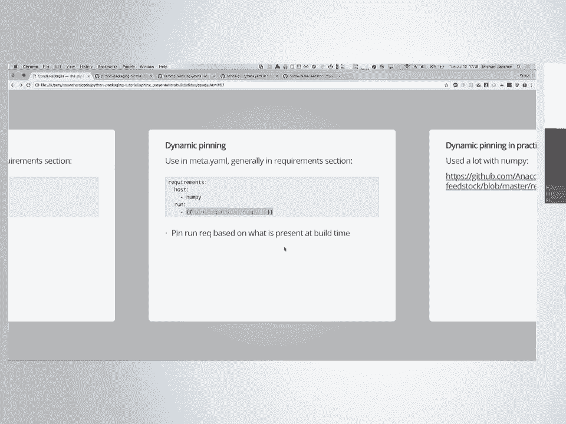

 pin compatible 1。9， that's gonna end up as something， like greater than or equal to 1。9。3。

 'cause it's gonna be exactly what the lower bound is。 And it's gonna say also less than 2。0。

 So it's just kinda like an automatic smart pinning。

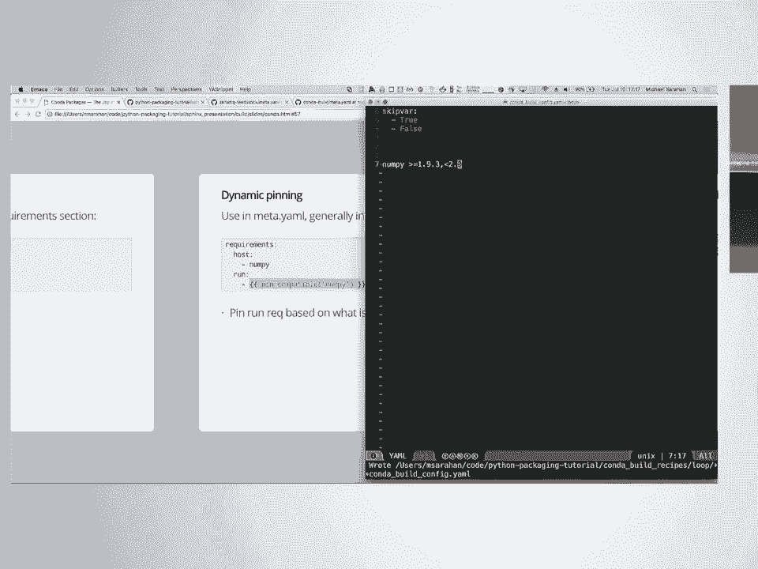

 with this expression， and you can tweak this。 So you can also say here pin compatible NumPy。

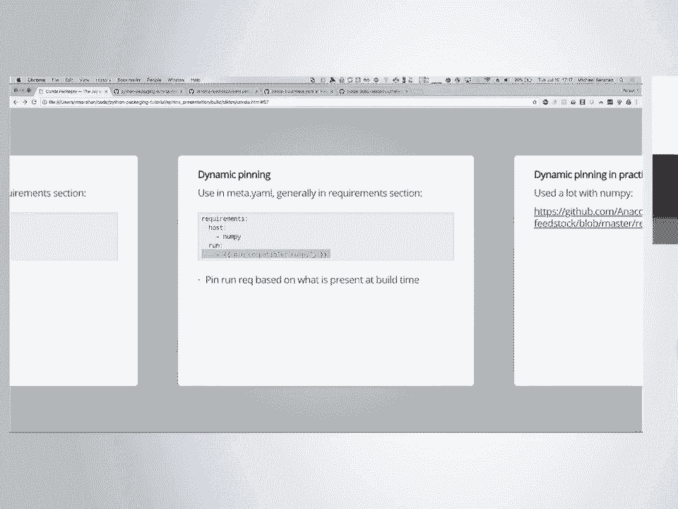

 and then change how that bound is。 So you can change it to be two pins out， or three pins out。

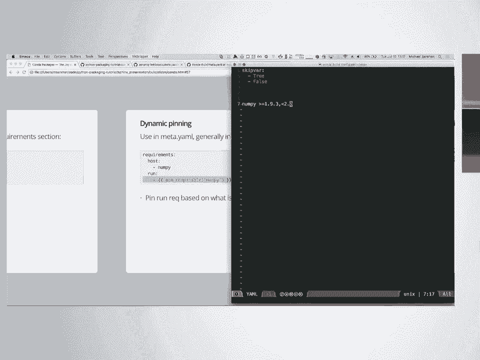

 or whatever's appropriate for your， thing。 Okay。 I think， yeah， I wanna talk about compilers。

 and run exports a bit， and Philippe， if you wanna finish up in five minutes， maybe。 I know。

 I want you to invite people to the sprints。 - I know， we're not on the。

 - So we'll please give you five minutes， right？ - Yeah。 Okay。 So one of the really。

 really key changes， in CondaBuild 3 is that we're asking people。

 to explicitly declare that they need a compiler。 So prior to CondaBuild 3。

 it's always been implicit。 People just simply install it on the system somehow。

 and it's present on path， and it gets used， and if it's not present， the recipe doesn't build。

 but it doesn't really say why。 And what we're asking people to do now。

 is to use this GINJA 2 construct， that says， "I need a compiler that can compile C。"。

 That's all this says。 It doesn't say what compiler。

 And what compiler you use is a configurable thing。 And so right now， for example。

 CondaForge has one compiler package that they use， and defaults， and a Conda。

 has a different one that they use。 And they can use the same recipes。

 because it's not actually in the recipe， right？ Which compiler you use is part of that variant configuration。

 And that makes this really， really nice and powerful。

 and it's also helping us bring the recipe ecosystems together。 So we talked a bit about that。

 RunExports is this really， really cool thing。 We talked about dynamic pinning earlier。

 This is kind of an extension of that idea。 And what it is meant to address， is the idea of saying。

 like， if you build a link against some library， you need a runtime dependency on that library。

 And furthermore， that I know that the compatibility bounds， of that link are this。

 There's a really cool site called ABI Laboratory， that I'll show you guys real quick。

 This site is incredible for looking up， at what the binary compatibility of a given library is over time。

 Right？ So we can say， oh boy， they removed 11 symbols， in between 1。1 to 5 and 1。1 at 6。

 So that's a little naughty。 We probably need to constrain that one， a little bit more tightly。

 So the way that RunExports work， is that some package that uses some other package。

 so I'm going to call this upstream one， ABC。 We're going to build this one first。 And that one says。

 if anybody uses me， they need to add this dependency。 And yeah， is that clear or ish？

 We'll show you an example in code in just a sec。 So this is a recipe。 It has this host dependency。

 When it goes to figure out what it should be， at the end of this build， it's going to say， oh。

 this package has a RunExports entry， of ABC1。0。star。 That 1。0。

star thing gets added in here by kind of build。 So it's a way for people upstream to say。

 I know that these are the compatibility bounds， of my package。

 I'm going to impose those on people downstream。 It is to say， I as package maintainer。

 know my bounds better than anybody else。 And I don't want to impose that responsibility。

 on anybody but myself。 That's kind of what it's saying。 So this is a cool way to do it。

 It's a very advanced feature。 I don't think we probably can get into this today。

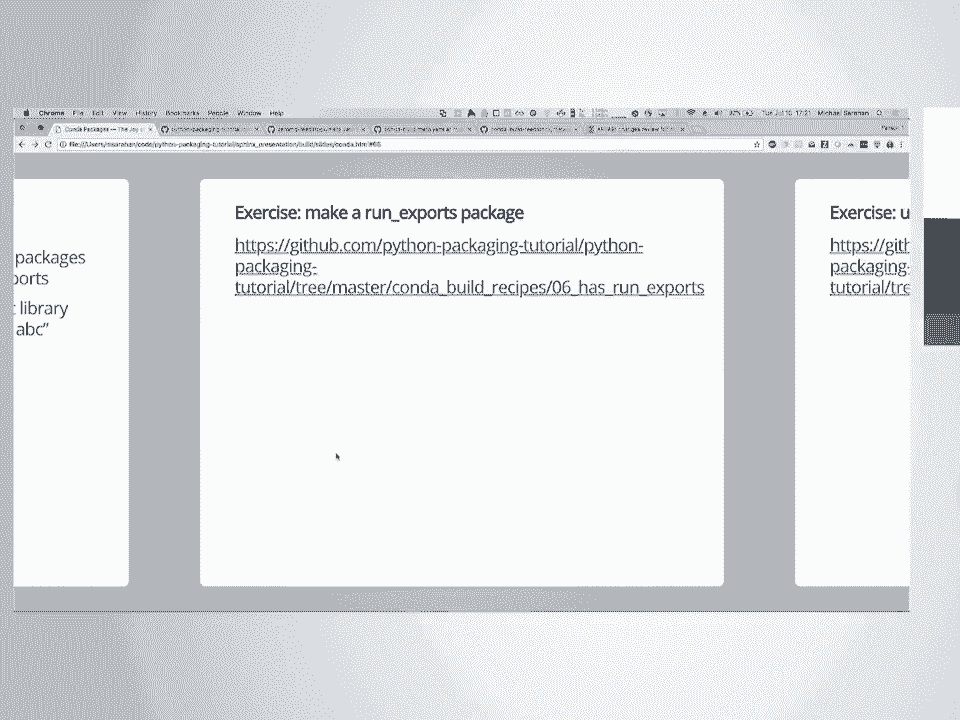

 If you'd like to see an example of it， you can build this 06 has RunExports package。

 And it's very simple。 All it's saying is that we are imposing a RunExports。

 that is this dynamic pinning， pin sub package。 And I'm pointing a pin sub package at myself essentially。

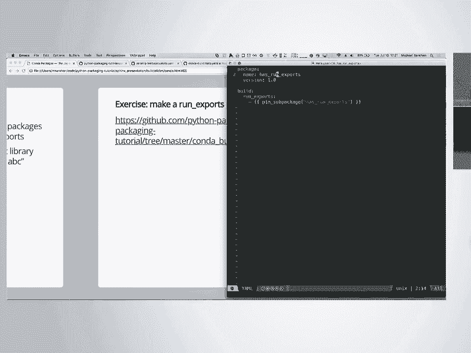

 So I'll go ahead and build that here for you。 And this will be a good opportunity。

 to show you those dynamic pins too。 And then I have this other recipe。 No， that's not what I want。

 I have another recipe that uses that package。 That's it， nothing more。

 And so what there's a cool Conda build command， called Conda render。

 And this is going to get Conda to do all of its magic， to evaluate all the templates and show you。

 what it's going to look like， at the very end of all this magic。 And if we use that on Conda render。

 you're going to look that it goes and finds， oh， has RunExports， has this extra thing。

 This is the exact version of has RunExports， that it's going to install in the host requirements。

 And this is the dynamic pinning that we saw before， right？

 So you remember the greater than or equal to。

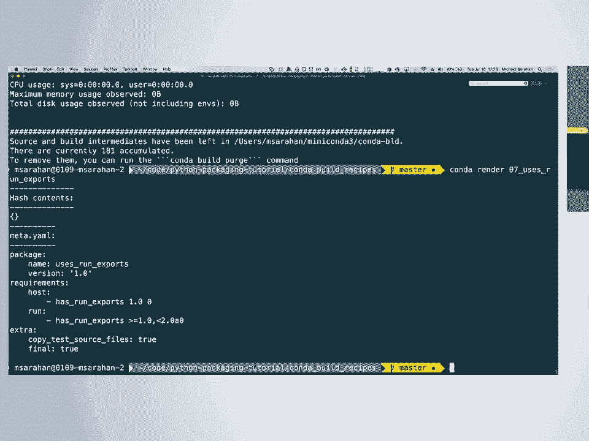

 and less than the next major version。 So let's tweak it just a tiny bit。

 I'm going to say this is something like this。 And I'm also then going to configure this。

 to go to three places。 And let's see what this does。

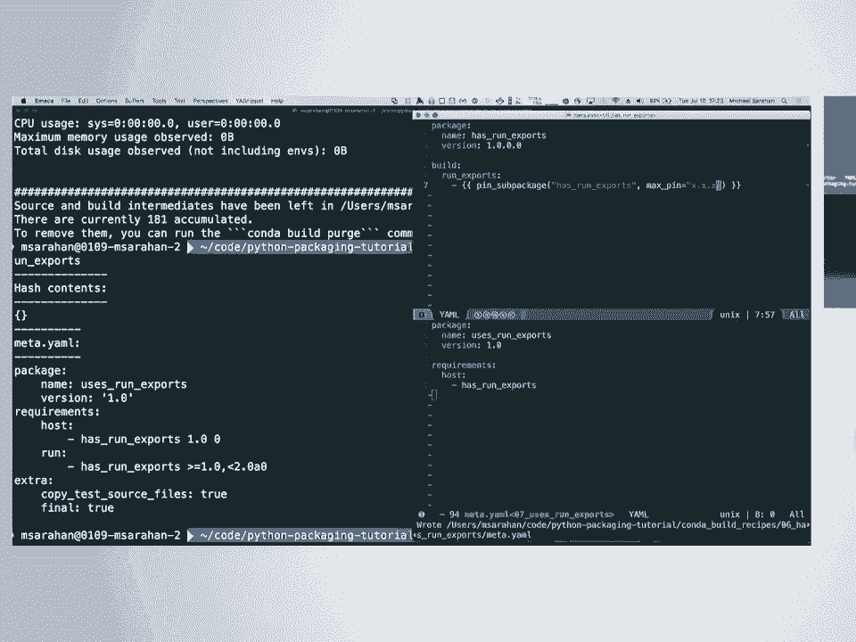

 Right now， it's not going to change anything， because I haven't rebuilt that package。

 The RunExports live in the package itself， right？ Not in the recipe。

 So they don't take effect until you've rebuilt， that other package。 And so there we go。

 We've pinned out to three places on that dynamic pinning。 Okay。

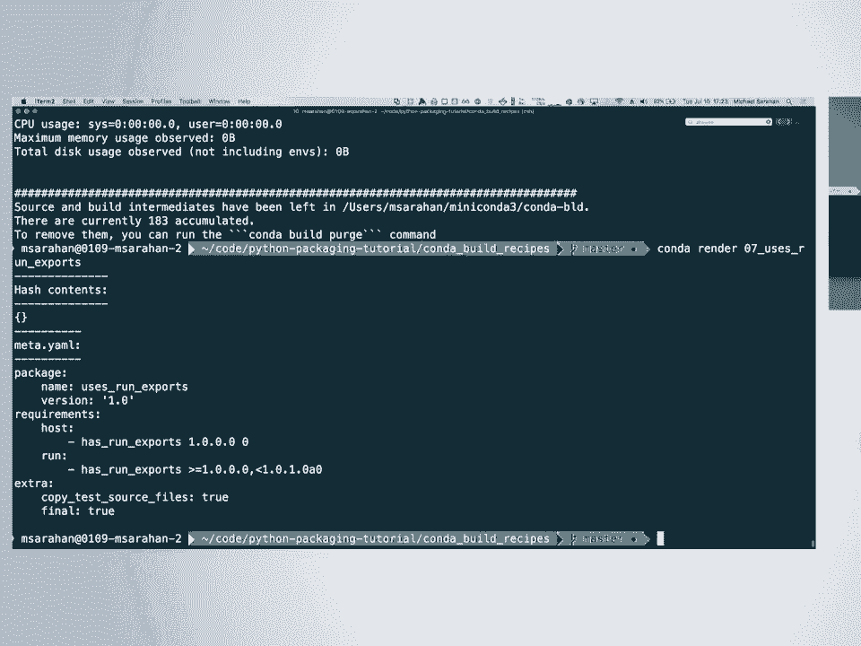

 Who knows about anaconda。org？ It's kind of like PiPI。 The major difference we talked about earlier。

 you can own your own channel。 You own everything on your channel。

 It's up to you to maintain binary compatibility， within your channel， but that's pretty easy。

 You don't change the way you build pretty， very often， right？ But that's kind of。

 it's how you share things in the Conda ecosystem。 And what you would probably often do。

 is build things yourself locally， upload them to your anaconda。org channel。

 And when you felt like you had them working well enough。

 you should go to Conda Forge and submit a recipe。 Get things going there。

 'Cause that's just like a really great， centralized authoritative resource for a Conda packages。

 Yeah。 There is no package size limit that I know of。 There is like an account size limit。

 and I don't know exactly what that is。 It's some gigabytes。 But I think we're pretty liberal。

 about giving people more space， if they ask and have good reason。

 Conda Forge has unlimited for what it's worth。 Yep。 Great。 So that's what I've got。

 And thank you guys for listening。 I'm happy to talk with you guys more。

 or to help you guys write recipes。 Hopefully， would you like to come and invite people？

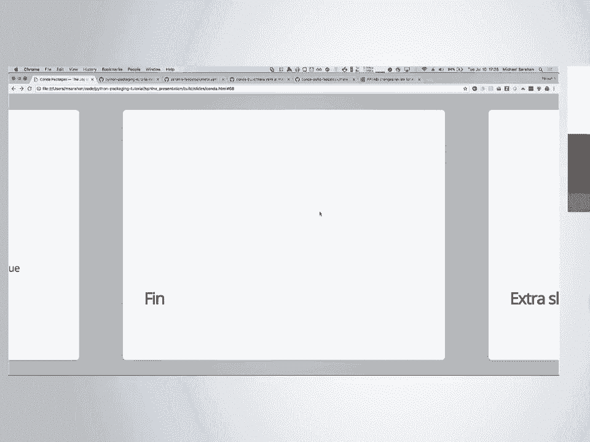

 [BLANK_AUDIO]。