# SciPy 2018视频专辑 - P73：SciPy 2018视频专辑 (P73. Website for Interacting w_ Oceanographic Data & Numerical M - GalileoHua - BV1TE411n7Ny

 So I'm Kristen Thing， I'm at Texas A&M in the Department of Oceanography。

 I'm a physical oceanographer。 I do mostly numerical modeling and also some data wringling。

 I've done this work with Martino Marta Alameda。 He was a postdoc once upon a time in our department and he is。

 I think， in Portugal， but has some affiliations in Spain。 So I will be talking about this website。

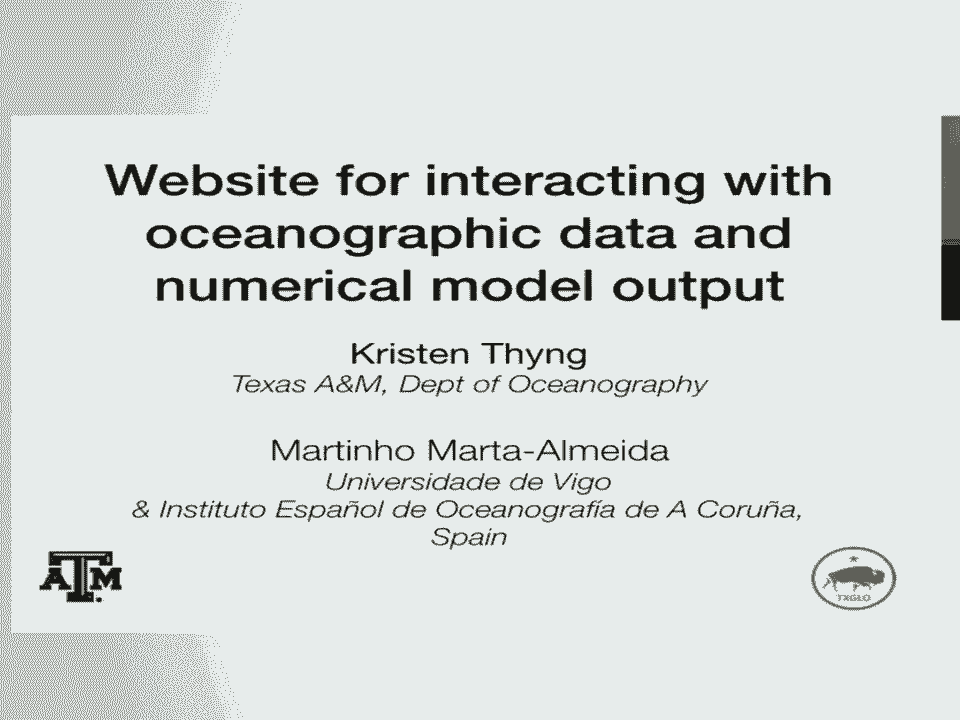

 We've both contributed heavily to it and so I'll be presenting both of our parts of it。 Okay。

 so the motivation is that we have 20 years， over 20 years of buoy data funded。

 by the Texas General Land Office to help support oil spill response。

 This data has been served online for， I think， the same amount of time。 But the website has。

 I think， also been around that long and so it needs a revamp。

 There is numerical model output to also support this oil spill response effort that has been。

 funded about as long。 And so we'd like to integrate these different sources of information together to present。

 them in on a modern website。 And I just wanted to note that the user base here is potentially anybody。

 basically。 So it could be， it's the Texas General Land Office looking at oil spills， but it could。

 be fishermen， it could be people who want to go out recreationally。 It's scientists。

 I tried to make it so that I could use it in my own research， which I。

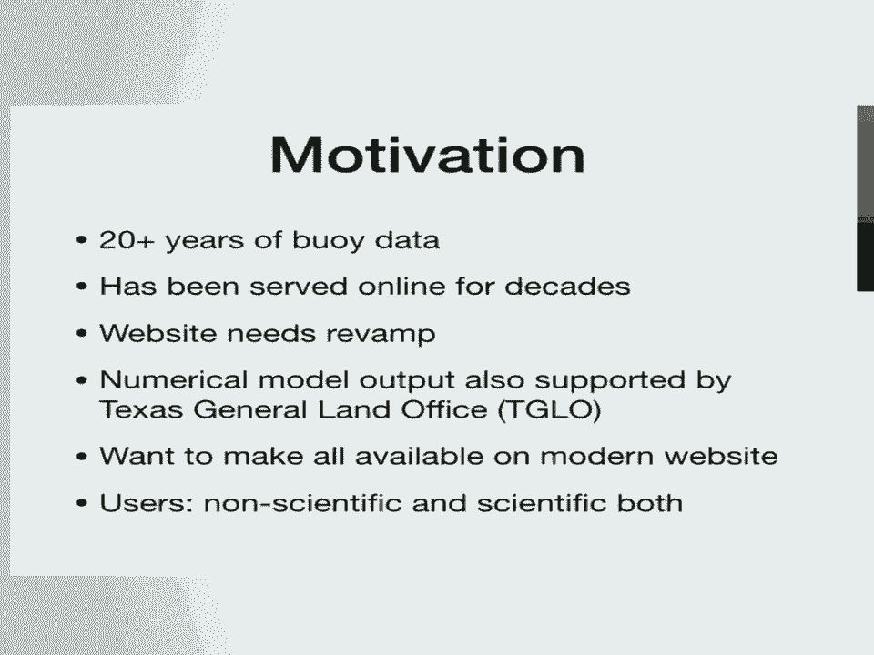

 do， my colleagues， et cetera。 So there are tons of different people who might be looking at this。

 Okay， so the Texas General Land Office is in charge of a lot of resources Texas-wide。

 In terms of my connection there is the oil spill response division。

 So if there is an oil spill in Texas， they need to go respond to it， figure out where， the oil is。

 try to predict where it's going so that they can better anticipate and gather， that oil up。

 So to do that， they have been supporting this buoy effort for a long time。

 The tabs buoys or the Texas automated buoy system， they're all in Texas waters。

 They provide surface currents， so where the water is moving， therefore where the oil would。

 be moving if there's oil in the water。 These are developed。

 the technology was developed and they're maintained by the geophysical。

 geochemical and environmental research group at Texas A&M。 We just always say gurg。

 so I don't know the acronym super well。 So they take care of this。 You can see a buoy here。

 They at least measure surface velocity but also many other variables。 Temperature， salinity。

 sometimes wave height for example。 Okay， so here we have the existing。

 just a snapshot of the existing website。 So you can see there is a static map or I'll just tell you there is a static map in the。

 middle。 The arrows change to show the most recent data。 The green circle。

 the green stations are the tabs buoys。 They have an arrow for water movement and arrow for wind directionality as well。

 If they have that information， there are a few other buoys from NDBC also shown。

 And then there's some links around the edges and stuff。

 So the pros are the site is very fast and it's very straightforward especially once you're。

 used to it。 The cons are it's， you can't tell from this but it's difficult to access data that spans。

 more than 60 days at once。 You have to repeatedly go in to get that。

 There's no model output shown here and it's an old style so it would be nice to have a。

 new modern interface。 So here is a screen shot of the new site and I will just jump over to introduce you guys。

 a little bit。 Okay。 So first of all I took all those links and I stuck them in drop down menus。

 There's a bunch of other stuff going on I won't go into in there。

 And on the right side we still have similar to before a buoy listing showing the most， recent data。

 Now you can hover over it and you can see the most recent time series data so of these。

 different variables that are being measured。 The time series of the data are shown in black and additionally in the apples to apples。

 comparison the model output is shown as a time series in blue。

 If it's in the future it's shown as a dashed line for the forecast model。

 And so you can hover over these。 Additionally we have other stations now included。

 So the funding agency wanted to have this have more information available if possible。

 So there are these other NDBC buoys and other buoys as you scroll down。

 And you can see these are then shown over here on the map。 So the map you can interact with。

 It moves around。 You can zoom。 You can turn things on and off。

 And there are a lot of layers of information。 So there's the model output that's what you're seeing as the big color。

 We can show various fields from the model output。 Right now it's surface salinity so it's more blue there's more fresh water or it's more。

 yellow there's more salty water。 You can see the data stations with all these markers。

 You can see surface currents in the smaller arrows here。

 These are the water velocities predicted by the model。

 If I turn those off you can see a little better the HF radar。

 This is surface velocities measured by radar from the land。

 You can see wind for the model on and off。 You can change the arrow size。

 So basically we tried to do as much as we could。 You can download this I'll talk about that more a little bit later too。

 And you can change in time。 So you can push the arrow to go forward in time in the forecast。

 You can jump to previous times and then step forward。 You can play a span of time to animate that。

 What I want to do right now in case the internet won't cooperate。

 Okay let me go back to my presentation。 So I'm going to focus first telling you a bit more about what went into this the different。

 parts of the website starting with the map shown in the big red box here。

 So Martinho did this part of the website。 This is basically kind of a separate piece that's put into the PHP page as an iframe。

 And as you saw there are a lot of pieces of information together that can be potentially。

 layered here which is a lot of information to be sending over the internet potentially。

 So one of the big jobs that Martinho had was figuring out a good compromise between how。

 much data to send across the internet。 So you can at one extreme you can send all the information giving your user most interactivity。

 and choices。 And at the other extreme you can only send a single static image giving almost no choices。

 to the user but that would be much faster。 So we wanted to try to figure out a good happy medium。

 So these were mostly in case the internet didn't work。 But so we saw tabs buoys also other stations。

 Hf radar which is a new thing in Texas。 East and West coast have had it before but we now can do radar from land here。

 The numerical model I showed surface salinity but we also have in their surface temperature。

 surface speed from the model bottom oxygen。 So this is for management purposes for where areas of low oxygen or hypoxic regions are。

 Sea surface height。 Okay so what Martinho ended up deciding to do and this was a development over time was。

 to use static images for the complex plots。 So the model output would count as the complex plots here。

 So the surface salinity for example he saves as a PNG for all these different times， several。

 resolutions and then the other stuff that goes on top is sent as simple data。

 So these are the arrows that go on top。 And then the clients， the local browser puts those on top。

 And one advantage of this among others is that you can add new information relatively。

 easily instead of say if every image was static， every you have to have every combination and。

 you have to remake those anytime there's something new to say。

 So as a visual to go with that basically the server makes the PNG of the model output and。

 then these aren't super visible but they're just a bunch of arrows， just little visuals。

 So here's the model arrows， the buoy winds， the isobath showing the depths for example。

 maybe the radar currents。 All these things are being sent to the client as data and they're just drawn as simple arrows。

 and circles。 This ends up being pretty quick， these can be layered together and combined and then they're。

 drawn as SVGs for being dynamic and pictorial。 I think we touched on all of these things to different options that you can play around。

 with。 And like I mentioned you can set up the plot the way you want it， the website will remember。

 your settings and then you can choose the time to animate over。

 I did a very short one to save space but yeah maybe you get the idea。 So you can also save it for。

 save the images or save the animations for yourself for later。

 This was also hard to do but Martino persevered and so you can set up a date range， you can。

 choose how often of the， you know you can have it every hour， you can have it every six。

 hours daily or whatever for the delta T and you can download the SPNGs or MP4s。

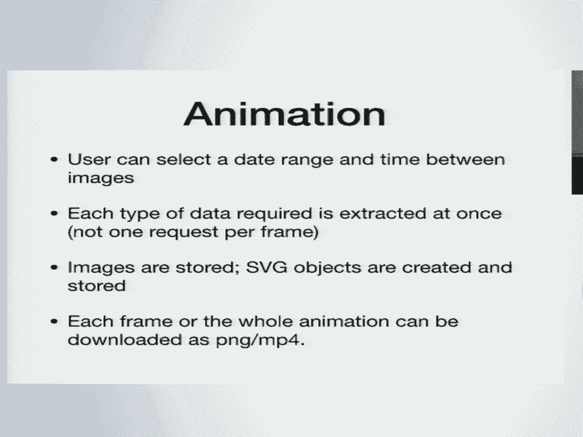

 So a challenge with this was data management。 This was done using NumPy and SyPy with as needed the Python multi processing library。

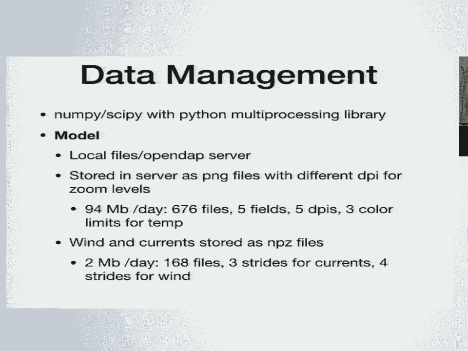

 I'll just touch on a few of these things， the model depending on what server you're on at。

 the moment can access the model either locally or over an open-dap server。

 And then the server creates these PNG files with as I mentioned before different DPI for。

 different resolutions that the user might be zooming at。

 And you can see this adds up quickly so 94 megabytes per day of model output for these。

 different things that we have available for the user。 And then in terms of the other things。

 wins and currents and on the next slide radar and， buoys， those are all relatively small。

 they're just so saved as NPZ files locally in order， to be sent over and plotted by the client。

 The Mississippi River was another option I think I didn't show but you can overlay that。

 to see what the Mississippi River has been doing lately since that's very important for。

 the region and that's not very much information。 And the server is Flask written in Python and easily integrated with Apache。

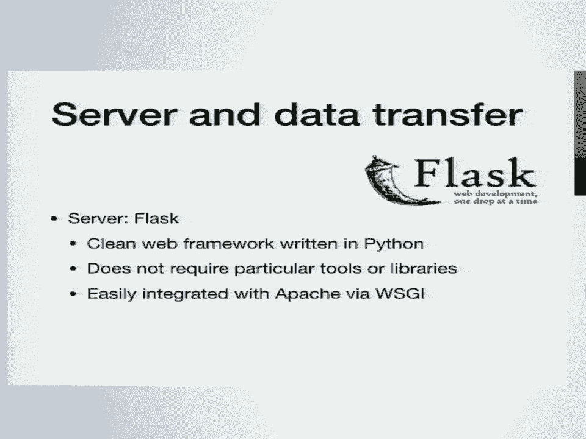

 Okay， so I'll talk briefly about the other part of the website now too so kind of the。

 rest of the stuff around the outside is generally what I mean here。

 So the pages are PHP and HTML and some bits of other stuff as well as needed。

 And this the PHP will call Python when needed to access the data， wrangle the data， do various。

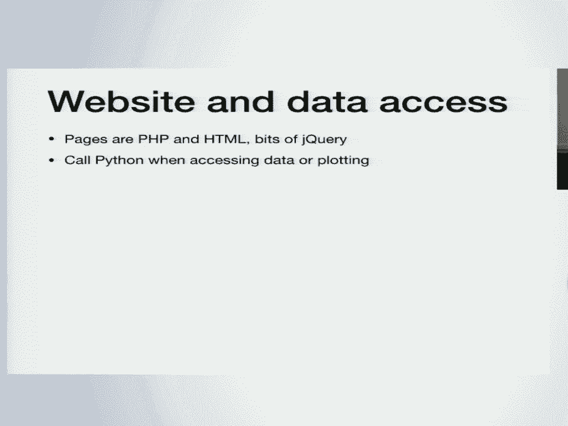

 things and plot。 The station data is accessed for our buoys。

 the tabs buoys are on a server at Gerg in MySQL， and that's accessed by the website and for the other data we aggregate it and sort locally。

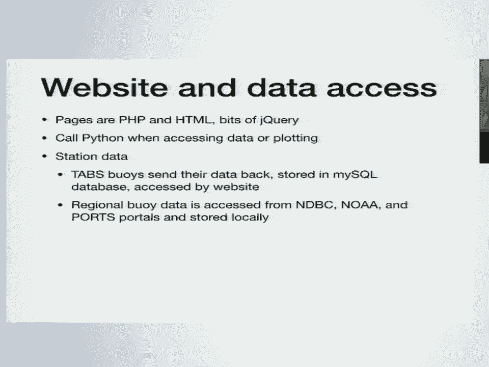

 And the model output is always available on a thread server， it's Rob Hetland's model。

 at Texas A&M and it's publicly available too so you can go check it out here at the， thread server。

 And in particular to make the model output more quickly accessible for the time series。

 we have a separate file that just saves it at those 75 or so stations saves out the model。

 output separately。 Okay， so as I showed before you can hover on the right side。

 this is just a screenshot， of course but you can hover on the right side to get these quick images of recent data and。

 recent model output and the forecast going forward。

 And these are created every 30 minutes by the server in order to have them just really。

 quickly and easily available， updated with new information as it's available or whatever。

 is available at the half an hour mark。 And you're also able as a user to go into a database page I'll show in a second where。

 you can make your own selections， choose your buoy， everything， those are made on the fly。

 by the server。 And the data is managed by pandas so it's data frames being sent around and then the。

 plots are made with mapplotlib。 So here's one example and here is the database page。

 Basically the idea is you can choose as many things as hopefully makes sense so you can。

 choose the buoy， you can choose the time range， you can choose whether you want it plotted。

 you just want the numbers or you want to download it， time zone， units， etc。 And yeah。

 you can download it directly from here too。 So here's just another example of these time series plots。

 One nice thing about this was it looks a lot better just plotting it in Python and mapplotlib。

 The quiver looks great， you know the fonts are everything just it looks great。

 So just switching to Python did that。 So it's nice。

 I save these to PNG and PDFs to be available for the user。

 This computes an R squared shown if there's both data and model output to give you a feel。

 for how well the model is doing。 And you can also get more information about the stations on the website。

 You can also just download the whole data set if you want to have links for the different， pages。

 You can just click it and download it。 You can also when you do a query through the database there's an exposed query there so。

 you can edit you can pretty easily figure out how to edit that directly and I have notes。

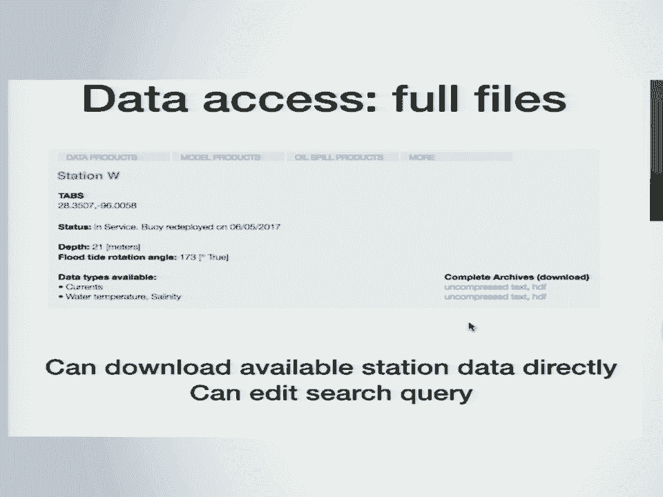

 on the page about that too。 I also wrote a package to access data through the website。

 So the website is great for interactivity and looking at it but if you like me just want。

 the information at the end of the day you can use this and I tried to make it pretty， easy。

 pretty straightforward which was easy because the website does all the work。

 So now you just import this package and you can just do this basic read whatever your。

 buoy name is in the time range and it works for the model output and the data too。

 So this is probably actually how I will use it subsequently。

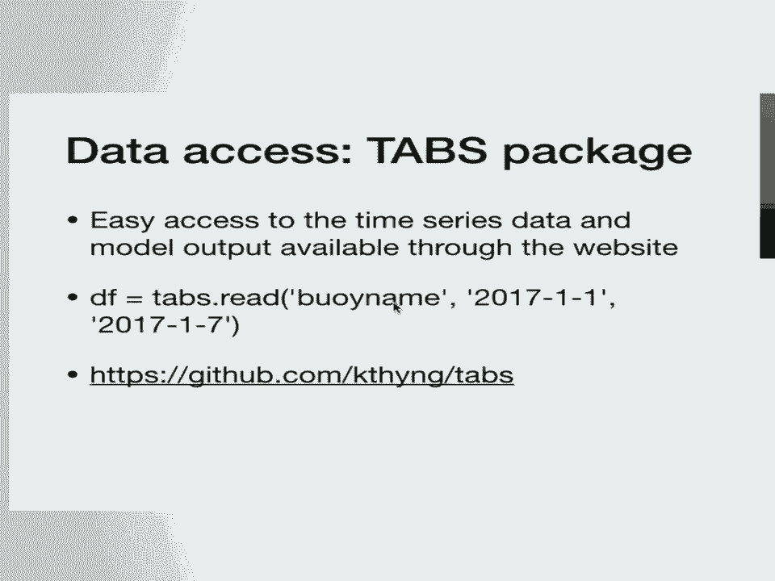

 And I think I'll。 Okay， sorry。 Not even using Microsoft right now。 So this is。

 I thought I'll have a little bit of bonus material here。

 I actually didn't even know that he had done this but Martino has put in this bonus interactive。

 mode that will be sort of usable for other users probably on it but for research purposes。

 He has this package he's worked on for a long time， Okean， which uses NumPy， SciPy， Matplot。

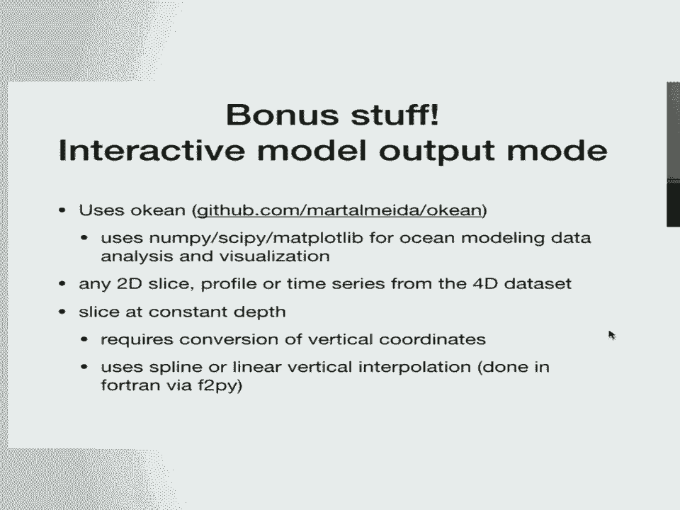

 Lib for dicing up， slicing and getting into numerical ocean model output in various ways。

 which isn't always straightforward。 So it turns out there's a secret menu that you can turn on and I just learned this last。

 week and then it basically instead of just looking at the stuff at the surface that I。

 went through you can go get all sorts of different combinations。

 It's not time optimized like the other stuff so you'll have to。 It's sending the data。

 everything's interactive and on the fly but I'll probably use it all， the time。

 For example here is a slice at a constant depth of other variables that aren't available。

 on the more general website。 In the model output there are four tracers available so this is one of them。

 For this numerical model this is run in ROMs。 If you think about the C-bed and the C-surface basically the numerics work by dividing the。

 vertical distance into layers so you kind of instead of having like depth， depth， depth。

 depth you have these layers of depth。 So this is showing one of these layers。

 Another way of looking at the output that's important depending on what you're trying， to do。

 Here for example we have a constant isoslices so the first depth where the temperature is。

 some fixed value so this would be an isothermal surface or even a variable isoslices。

 The first depth where the temperature is some 2D array so in this case it's a surface temperature。

 minus 1 degree Celsius。 So basically all these different ways that you can get into the information。

 Just a quick list of challenges。 Figuring out over time and deciding how to accommodate these compromising between interactivity。

 level access level but also time。 That is I think always a challenge。

 The website pulls from many sources which is part of the benefit but it's also a challenge。

 because there's different sources break at different times so I've had to build a lot。

 of contingencies into the system。 So the whole website doesn't break or lots of different things。

 It's also the same problem with the forecast model if anybody does modeling especially in。

 an operational sense。 These need to be reliable and they really need to be reliable if they're being displayed。

 constantly on a website。 I haven't had to deal with that as directly my colleague DJ Kibashi has had to do a lot。

 of that and he's gotten a lot of pokes from me when something breaks and then he has to。

 figure out contingencies in a similar way for the model output。

 Making the time series plots generalized for all the different options available was hard。

 and didn't really happen really。 There's just like a lot of different options that are possible in the script。

 One small thing I just thought I'd mention is I think at least when I was working on。

 this I don't know that it's changed。 River plots didn't work with the date time indices of Panda's data frame。

 I have to and maybe date time generally I'm not sure。

 So I have date time on the X axis and I want to have a quiver plot which all my plots have。

 I have to convert from the Panda's data frame date time indices into some other units so。

 that it knows how to do that。 It's a small thing but it kind of makes my code that much more complicated for all of。

 the time series plots。 Okay so thanks you can see the website currently here。

 It will eventually be moving on to the kind of normal website but I think it will always。

 be available here too。 Thanks very much to all these packages that we use so heavily。 NumPy， SciPy。

 Mapplotlib， Panda's， NetCDF and X-ray we use for accessing the model output。

 and here's my information。 Thank you。 And just perfect timing。 Are there any questions？

 Speak up don't be shy。 We've got plenty of time so we can sit here in awkwardness。

 So you said you wrestled with a lot of trade offs on pushing data to the client or keeping。

 it on the server。 So did you look at dynamic plotting of the say the booty data with D3 or something？

 Not to my knowledge。 Well for example when I also inherited this project from other people。

 So when Martino and I started working on it the arrows were being drawn dynamic。

 The data was all being sent over and then an arrow would be drawn with kind of like in。

 a more complicated way。 I believe from there Martino eventually was like this is taking way too long and then。

 decided to do SVG from there for the arrows。 So I don't think。

 I think he like looked into it and thought that was a reasonable way， of doing it。

 And I think it's a really good way of doing it。 And so I think it's a really good way of doing it。

 And so I think it's a really good way of doing it。

 And so I think it's a really good way of doing it。

 And so I think it's a really good way of doing it。

 And so I think it's a really good way of doing it。

 And so I think it's a really good way of doing it。

 And so I think it's a really good way of doing it。

 And so I think it's a really good way of doing it。

 And so I think it's a really good way of doing it。

 And so I think it's a really good way of doing it。

 And so I think it's a really good way of doing it。

 And so I think it's a really good way of doing it。

 And so I think it's a really good way of doing it。

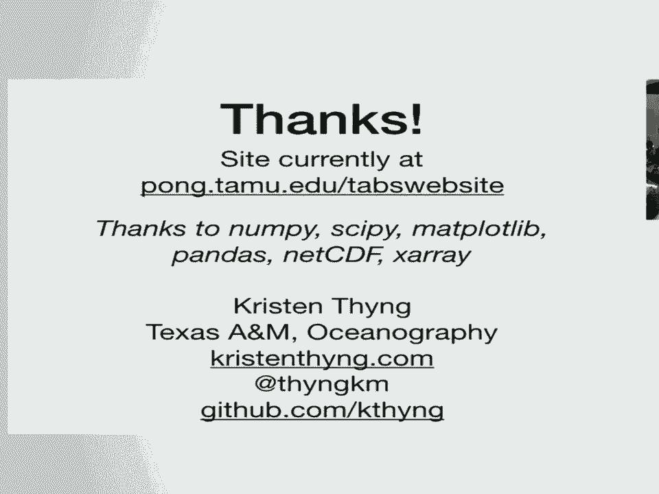

 And so I think it's a really good way of doing it。

 And so I think it's a really good way of doing it。

 And so I think it's a really good way of doing it。

 And so I think it's a really good way of doing it。

 And so I think it's a really good way of doing it。

 And so I think it's a really good way of doing it。

 And so I think it's a really good way of doing it。

 And so I think it's a really good way of doing it。

 And so I think it's a really good way of doing it。

 And so I think it's a really good way of doing it。

 And so I think it's a really good way of doing it。

 And so I think it's a really good way of doing it。

 And so I think it's a really good way of doing it。

 And so I think it's a really good way of doing it。

 And so I think it's a really good way of doing it。

 And so I think it's a really good way of doing it。

 And so I think it's a really good way of doing it。

 And so I think it's a really good way of doing it。

 And so I think it's a really good way of doing it。

 And so I think it's a really good way of doing it。

 And so I think it's a really good way of doing it。

 And so I think it's a really good way of doing it。

 And so I think it's a really good way of doing it。

 And so I think it's a really good way of doing it。

 And so I think it's a really good way of doing it。

 And so I think it's a really good way of doing it。

 And so I think it's a really good way of doing it。

 And so I think it's a really good way of doing it。

 And so I think it's a really good way of doing it。

 And so I think it's a really good way of doing it。

 And so I think it's a really good way of doing it。

 And so I think it's a really good way of doing it。

 And so I think it's a really good way of doing it。

 And so I think it's a really good way of doing it。

 And so I think it's a really good way of doing it。

 And so I think it's a really good way of doing it。

 And so I think it's a really good way of doing it。

 And so I think it's a really good way of doing it。 Hi， Kristin。

 I'm a student here at UT studying data。 And as a fellow Texan， I'm wondering， do you ever have to。

 coordinate with other coastal states for data？ I'm thinking about these are Texas buoys。

 but of course the， Gulf borders many other states。

 And I'm wondering if you have to work in a silo or coordinate， with the other states？

 My impression from the funding side is Texas is what matters， because that's their--， [laughter]。

 There might be a number of reasons for that， but the， mission is certainly Texas-oriented。

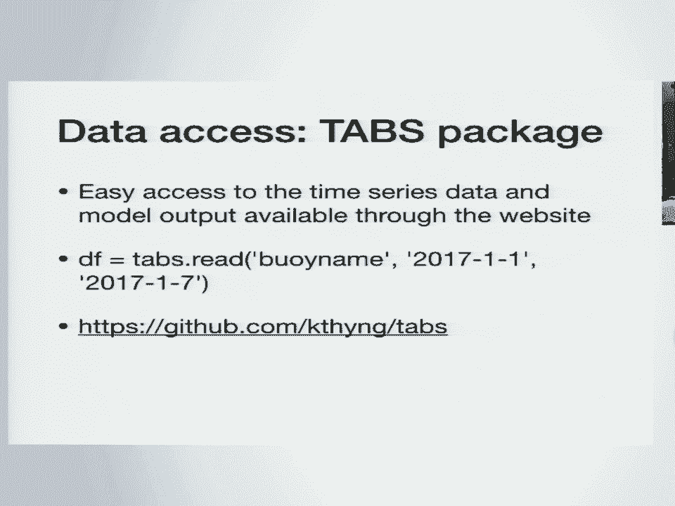

 I mean， it's not like oil stops when it gets to the border with， Louisiana。

 When I was looking at what stations to include when the。

 funding agency asked me to aggregate more information in， then I started looking around。 I realized。

 well， one， it's really hard to find。 And two， there's a lot。

 And I thought I should at least do whatever is in the model， domain， which does span into-- well。

 nobody talks about Mexico， really， kind of just stay with the U。S。 when you're doing this。

 sort of stuff for some reason。 But I did look into Louisiana and Alabama。

 But I can't say there's a lot of specific coordination。 I'm more like。

 looked at what's out there and tried to build on， what I could find。

 So I'm wondering if you've looked into saving， like， GEOJson or GEOTIP。

 so you could put this in a web mapping， surface so that， you know， if you had a problem like that。

 you could expand it much easier。 I don't think it'd be that much more work for you to at least get。

 that type of format out， but we're going to be getting it into a， web mapping surface somewhere。

 I think I can't talk knowledgeably about that。 I think Martino could， but I think I can't。

 But let's talk afterward。 I'd like to pass on to him。 Thanks。 Another quick question from the chair。

 Typical oceanography talk has everything finishes at the ocean， surface。

 Is there another framework like this that's being worked on for。

 atmospheric data for Texas and around the go？ Amazing viewing platform you built here。 Thanks。 No？

 I mean， oil is a powerful motivator and it provides a lot of money。

 I think every barrel of oil produced is taxed at a small rate or gets a。

 small fee on it and that goes into being able to fund the sort of。

 work to then respond when there are accidents。 So I don't think there's an equivalent for that。

 Miss。 Oh。 Yeah， it's called the railroad。 Okay。 That's one of them and that's why I'm asking you because it's probably。

 been part of the computer。 I'm not sure about it。 I'm not sure about it。

 Time for one more quick question。 It's okay。 It's okay。 It's okay。 How do you access that？ Oh。

 how do you access the hidden menu？ So you have to， I had to email him。

 I saw his slides and I was like， what？ How do you do that？

 So you have to be like active on here and push I。 But it doesn't all work yet。

 So I couldn't do all the things that he did somehow。 Okay。 Thanks everybody。

 Thank the speaker again。 [applause]， [APPLAUSE]， [BLANK_AUDIO]。

