# SciPy 2018视频专辑 - P9：SciPy 2018视频专辑 (P9. Physics - A Gateway to Bayesian Deep Learning _ SciPy 2018 _ - GalileoHua - BV1TE411n7Ny

 My name is Senator Kolachi。

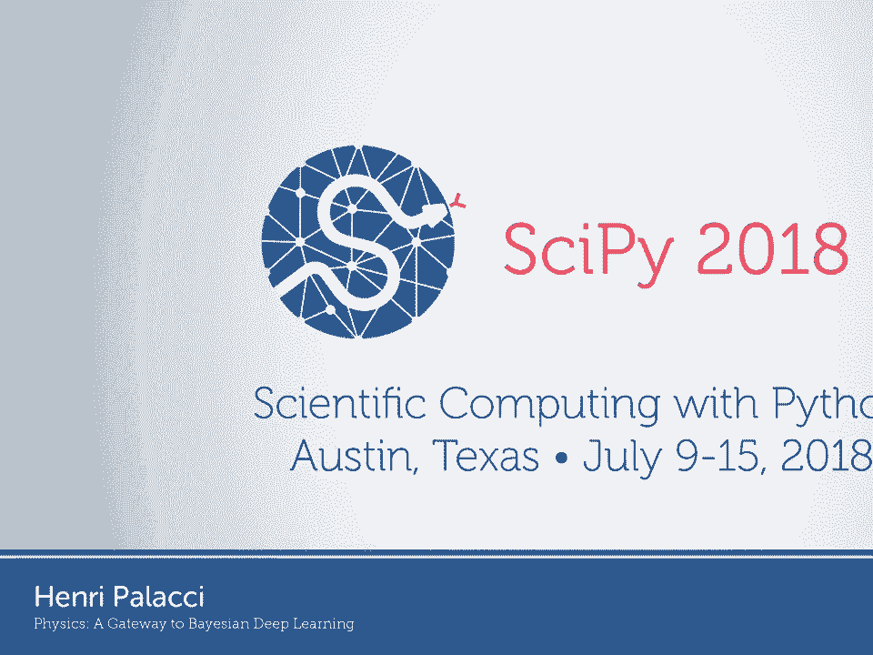

 I just graduated from Columbia University。 And today， I'm going to very humbly。

 talk about some points of convergence， between physics and machine learning。

 So this is really old stuff。 It's been-- I mean， these common points。

 have been around since the '90s with really prestigious， researchers。

 So I'm really going to only show you， the very beginning of a very small slice of the research。

 I did during my PhD。 I'm going to start by talking more about deep learning。

 and machine learning very quickly。 And then we're going to completely。

 shift to physics and more specifically， statistical mechanics。 And I'm going to end by showing you。

 how statistical mechanics， statistical physics， and machine learning are kind of the same in some points。

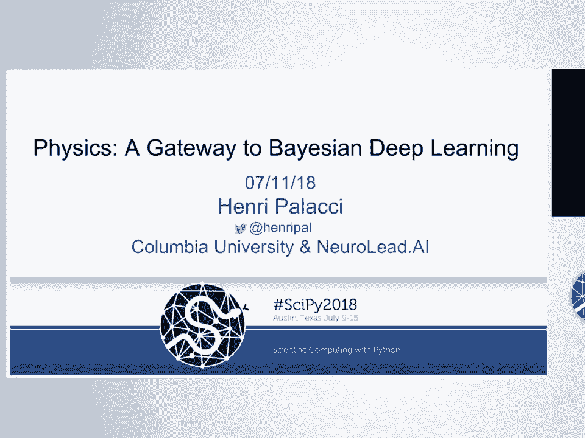

 All right， let's get started。 So deep learning is-- and some of you might。

 have grown at this-- is the state of the art for speech， recognition and generation。

 language recognition， and understanding， image and video processing。

 and decision making in controlled environments， in very controlled environments， such as games。

 So we'll all agree that deep learning is useful。

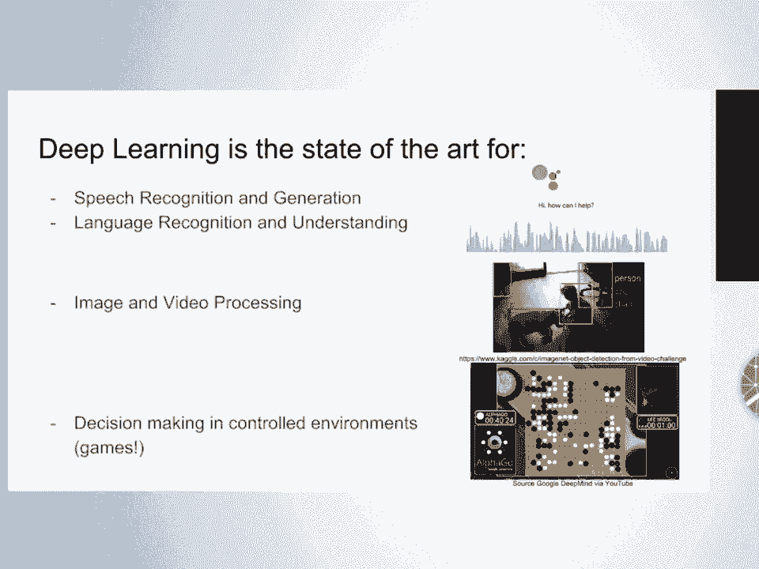

 That said， deep learning has pretty grave limitations。 Deep learning algorithms are black boxes。

 They're completely uninterpretable。 They can't identify unusual data。 And what I mean by that is--。

 let's say you train your algorithm， on a specific training data set and all of a sudden。

 you deploy it in the real world。 And then some data points come in that。

 don't look at all like your training data set。 Your algorithm is still going to make predictions。

 as if nothing was wrong。 So it's not going to be able to tell you。

 that it doesn't recognize that kind of data。 And more importantly。

 for someone with a statistics background， like me， there is no notion of error bounds。

 The predictions are what they are。 You can't draw error bars， which drives me crazy。

 And which can prove to be really， really problematic。

 If you're using deep learning for ad recommendation， or to play go， if you're making a mistake。

 it's not that bad。 But when you're moving to more serious applications， like health care。

 like self-driving cars， it's really， really important to be able to have those error， bars。

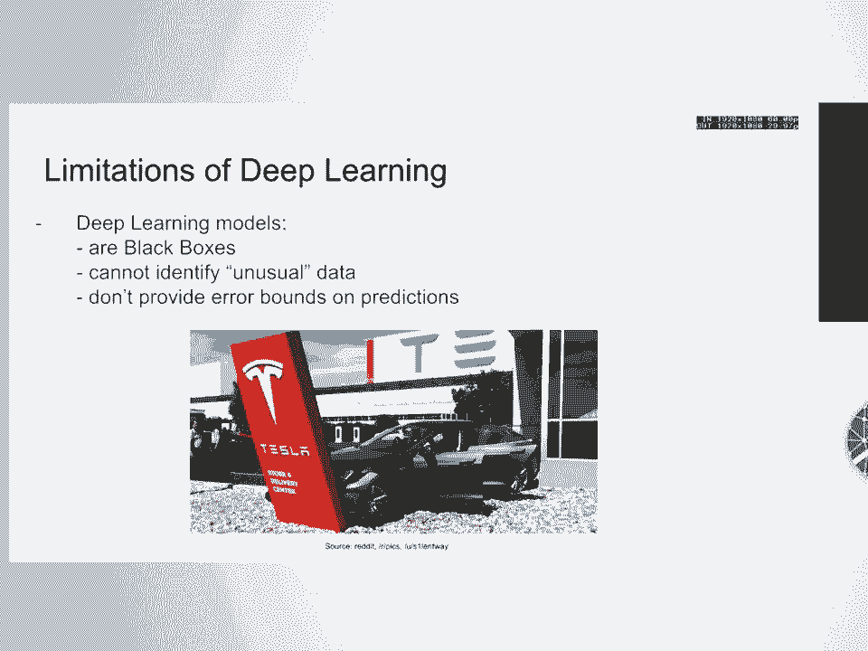

 Another limitation or theoretical mystery， I would say。

 is that we don't really understand that well why， deep learning works so well。

 So this is the traditional bias variance graph， where the blue curve represents your training。

 error as a function of model complexity。 So as you add layers through your models。

 as you make your layers wider and wider， your training error is just kind of always。

 going to go down and down and down。 But at some point， you're going to start memorizing。

 there's an example in overfitting， and then your validation error is going to go up。

 and you're going to start overfitting。 On this curve， deep learning is kind of an outlier。

 Deep learning models are really， really complex。 They can have parameters that are sometimes have。

 the of higher dimensions than your data set itself。 And still。

 you get kind of an implicit regularization。 The validation error can still be very low。

 I would really recommend you take a look， at this rethinking generalization paper， which。

 talks about this in a depth。 So to set the stage， a normal classification problem。

 you're trying to identify if an image is a dog or a mop。 You have your data x1， xm。

 which is in this case a dog， or a mop， and then your labels dog and mop。

 And we'll consider our deep net as just a kind of parametric， function model。

 which takes us input the data xi， and then the weights or the parameters w。

 And model returns either， in this case， dog or mop。 What we want to do is learn the weights。

 so your model behaves well。 We can learn the weights w by minimizing a loss function。

 on training data。 How do we do that？ The workhorse algorithm is stochastic gradient。

 and descent and all its variance。 So you compute the gradient of the loss。

 and then you take a small step in the opposite direction。 So the update step looks like this。

 Your new weights are equal to their previous weights。

 minus your learning rate lambda times the gradient of the loss。 And that looks like this。

 And what this does is it gives you a minimum。 But it gives you one minimum。

 It gives you one set of points， w minimum。 And by using deep learning-- and again。

 the Bayesians of mine， you might have grown at this--。

 is switching from this one point for the best parameters， for your neural network to a distribution。

 for your neural network。 You're switching from one point， and you're。

 winding this to a distribution。 What is the right distribution of the weights that still fits。

 my training data？ If we had this probability distribution for w。

 we would have error bars because we， would be able to have several models with their different。

 probabilities and average those。 This would help reduce overfitting because there。

 is a less likely chance that we would get stuck， in a very deep local minimum。

 And it may help detect unusual data， because now you have a way to quantify uncertainty。 OK。

 so that's Bayesian deep learning in one slide。

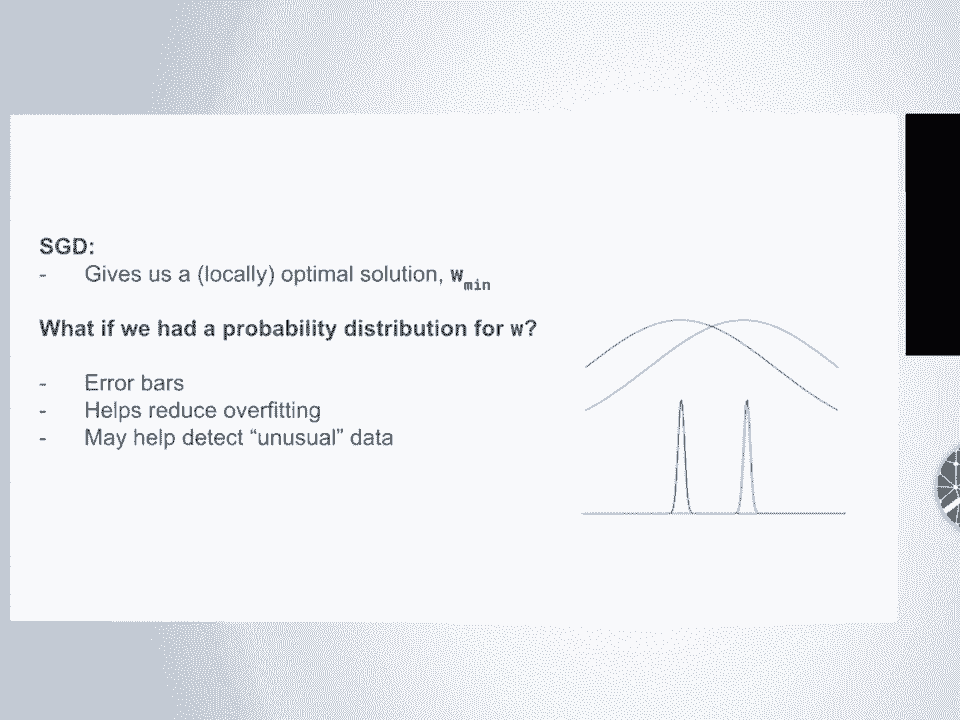

 So now I want to talk about statistical mechanics， and completely switch gears。

 Statistical mechanics is one of the major pillars of physics。

 It deals with small systems that have randomness in them。 So here。

 this is a video-- it's not very impressive， I know-- of milk， fat droplets in water。

 And they're not static。 They move around with motion。 That's called branion motion。

 These physics are so important。 They're not at all covered by the mainstream media。

 And they're really incredible results in physics right now。

 in statistical mechanics that are completely overlooked， because of quantum mechanics， I guess。

 But why this is so important is that if you think about--， you want to understand how a cell works。

 A cell is like this。 It's water with really， really small proteins moving in it。

 And they have this random motion。 And all the current advancements in biophysics。

 are using statistical mechanics to prove really， incredible results。

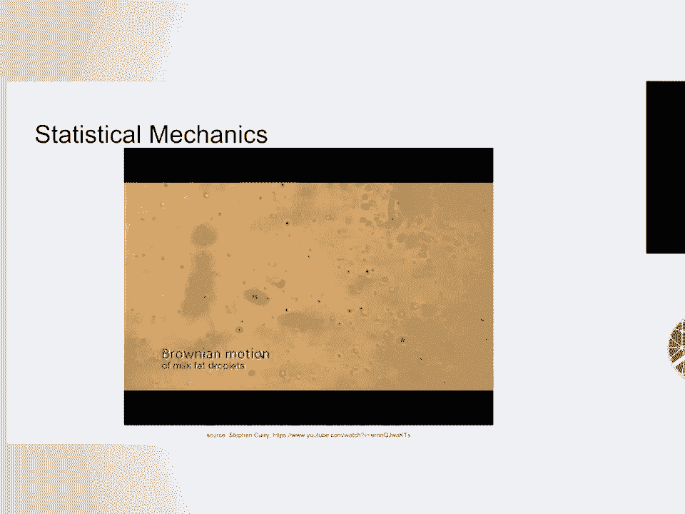

 So I'll try to give you an overview of statistical mechanics， really briefly。

 Just generally in physics， the particles that， are subject to this random motion and any object really。

 is going to be driven to lower energy states by a force。

 So the force is going to be minus the gradient of energy。

 And you can see this as you're putting a marble in a bowl， and the marble is going to roll around。

 until it comes to the lowest energy state， which， is the bottom of the bowl。

 Another really important force when you have randomness。

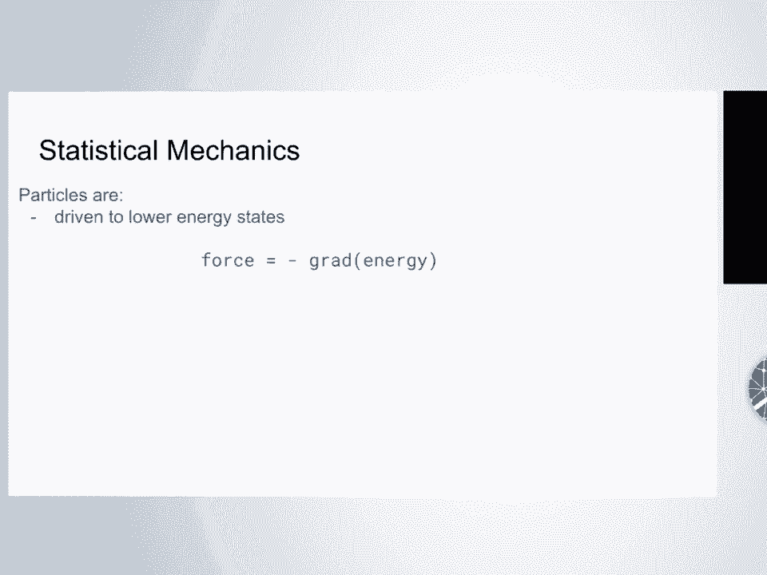

 is this combinatorial force。 Your system of particles is going。

 to be driven to the most frequently occurring configurations。

 So if you look at this box with a bunch of particles， that I drew。

 if you look at the configuration on the left， and you compare it to the configuration on the right。

 you may be a little more surprised if the particles are。

 moving around to see all the particles bunched up， in the corner like that。

 But this might seem more likely。 And it's maybe not completely obvious in this drawing。

 but imagine all the air molecules in this room。 They're pretty uniformly distributed。

 And they are constantly moving around。 How likely would it be that all the air molecules would。

 be in the corner of this room bunched up？ Pretty unlikely。

 And that's just because there is more ways， for the particles to be uniformly distributed。

 than being in the corner of the room。 There's nothing mysterious about it。

 It's just you count the ways that you can organize those， particles。

 There's just more ways for them to be uniformly semi-ununiformly。

 distributed than in the corner of the room。

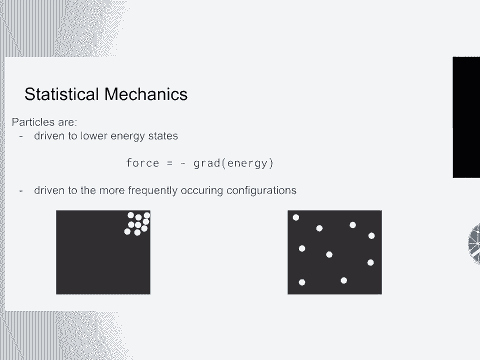

 So let's think about water in a pot。 So these are your water molecules in a pot。

 and you turn on the flame below the pot。

 Now， water molecules like to be next to each other。 And as you turn the flame higher and higher。

 you're increasing the randomness。

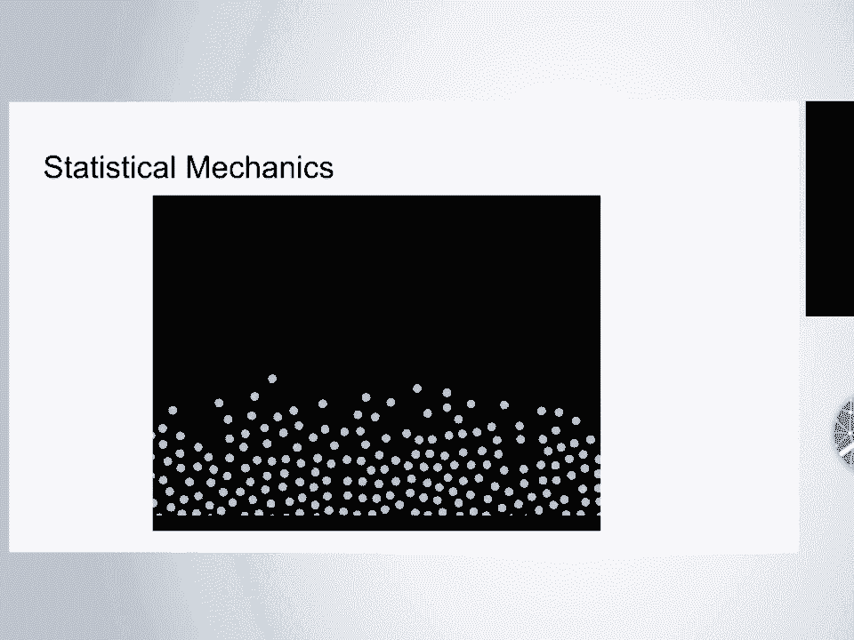

 You're increasing the temperature。 And this force that binds them together。

 is increasingly dominated by this random force， this agitation。

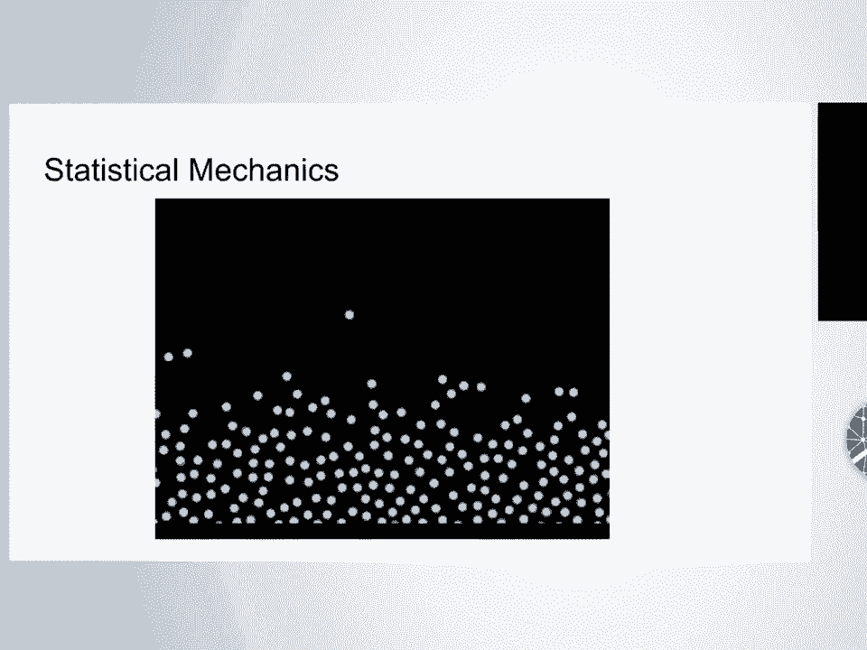

 And all of a sudden， your water evaporates。

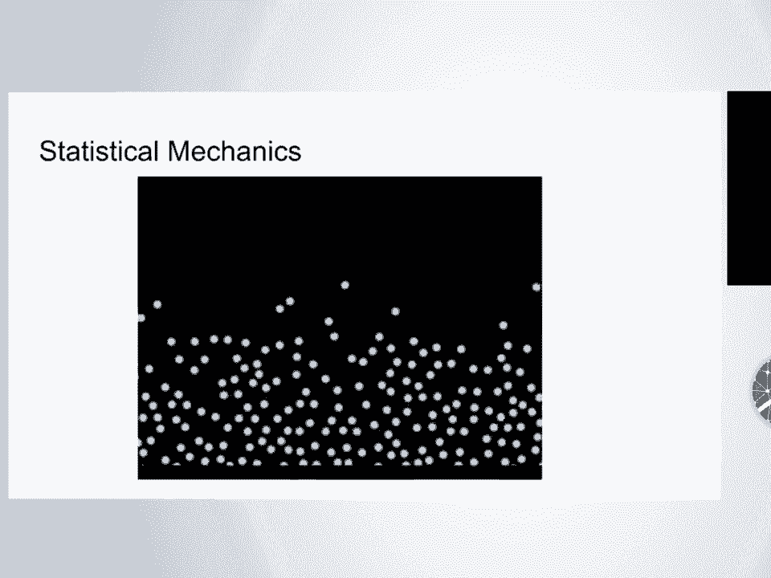

 and occupies our entire room。 So that's what statistical mechanics is about。

 It's about this balance of these two forces。

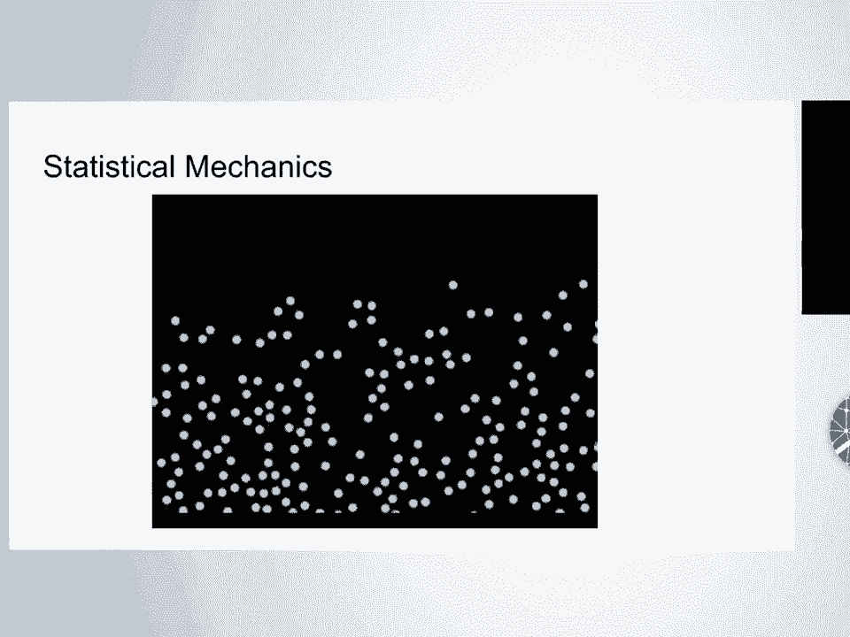

 So to recap， your particles are， going to be driven to lower energy states。

 You're going to minimize your energy。 And they're going to be driven to the more frequently occurring。

 configurations。 Nothing mysterious about it。 Just you're counting。

 And we write that in physics as the max， of the log of the number of configurations。

 And this log of number of configurations， you've all heard of it under way more mysterious pretenses。

 It's none other than the entropy。 That's what entropy is。

 It's the log of the number of configurations。 It's on Boltzmann's grave。

 And as we saw in the previous video， it looks like there's a knob that's。

 going to make us lean towards the energy side or towers， the entropy side。

 And it's linked to how high that flame is under your pot。

 The dial between these two forces is the temperature。 So what we're going to do is we're。

 going to minimize the energy minus the temperature， times the entropy。 If the temperature is zero。

 the energy term， is the one that dominates。 The particles are going to be stuck together。

 And if you increase your temperature， the entropy term is going to start dominating more and more。

 and lead to water occupying the entire kitchen。 These are the fundamental concept of statistical mechanics。

 And if you understand that， you understand， a lot more than most thermodynamics undergrads。

 You can use a little math on this under various conditions。

 And this is where the machine learning people here， are going to start having their bells ring。

 If you do this， you can calculate the probability， of a given configuration， W， as being。

 the exponential of minus the energy of that configuration， divided by the temperature， divided。

 by some normalization constant， which is really important。 But we won't talk about it。

 And you might recognize this as being the softmax function。

 And that is also the Boltzmann distribution， and statistical mechanics。

 And it makes a lot of sense that the configurations。

 with the lowest energy are going to be the most probable。 And the width of this distribution。

 is going to be controlled by that temperature term。 A way to simulate this in physics。

 A way to understand this is using launch of undynamics。

 There's a lot of other ways to go about doing this， but the one we're going to talk about。

 is launch of undynamics。 And launch of undynamics in physics。

 is an update rule for the positions and velocities， the positions of your particles。

 where your parameters， at step t plus dt is equal to the parameters。

 at the previous step minus some force term， plus some mysterious normalizing factor times noise。

 So all you're doing is that each step， you're adding square root of the size of your step。

 times the temperature times noise。 And that's launch of undynamics。 And if you simulate particles。

 and that's what I did on those videos， where you see the particles moving。

 I use launch of undynamics， and it's used all the time in physics， to simulate complex systems。

 then you get this nice probabilistic distribution。 So of course。

 and now the leap to machine learning， and deep learning becomes pretty obvious， right？

 The state of the particles and statistical physics， is gonna be equivalent to the parameters。

 in statistical learning。 The energy in physics is gonna be equivalent to the loss。

 you're moving to a lower energy， you wanna move to a lower loss。 And this relaxation to equilibrium。

 where you start with a random state， with a marble near the wall of the bowl。

 is in finish at the bottom of the bowl， is gonna be equivalent to loss minimization。

 and statistical learning。 And another one that's a little bit more iffy。

 is the maximum entropy principle。 It's beyond the scope of this talk。

 and we can talk about it after if you want， and it's a little iffy。

 there's no real correspondence there。 So remember our stochastic gradient descent update。

 where the weights were updated by the learning rate， times the gradient of the loss。 Well。

 you can just do launch of undynamics on that too， where you update your weight。

 and then you have the learning rate times the gradient， of the loss。

 which is stochastic gradient descent。 And then you're at the scaling term square root。

 of the learning rate times Gaussian noise。 And at this point， it seems almost trivial。

 that you can do that。 And that's the paper from Welling and Tain in 2011。

 And this is a way to prevent， so remember that graph where your parameters。

 went to the lowest of the energy， by adding noise at every step。

 you're preventing it from collapsing it to a minimum， and you're getting a distribution。

 instead of getting to a minimum。 So this is where during my undergrad in 2001。

 this would have been months of C++。 But thanks to the scientific Python community。

 testing those ideas， it becomes unbelievably easy。 I remember when I read that paper and I'm like。

 okay， I'm gonna implement it， and you know， we were talking about advisor， and said。

 it's probably gonna take a week to implement it。 And I opened the PyTorch repo。

 and I started looking at the code。 And I had it finished in 20 minutes。

 And it's not because I'm really good at programming， I'm not， it's just because it's really easy。

 So this is two lines from the PyTorch repo， where it's the only thing you need to understand。

 from stochastic gradient descent is P is your parameters， and you're taking your gradient。

 and putting in a DP， which makes a lot of sense。 And then to P。

 you're adding the learning rate time， minus the learning rate times the gradient。

 That's stochastic gradient descent in PyTorch。 So it's in this file。

 you can take a look at a link to it too， and it might read both。 There's a lot of other stuff。

 but it's a hundred lines of code， it's really， really readable。

 And having this ability to modify state of the art code， to make it yourself。

 I think is a superpower， and science right now。 And so if you want to do stochastic gradient。

 a launch of un-dynamics， you add one， I guess one and a half line of codes。

 you determine launch of un-noise as a normal， Gaussian variable。

 and then instead of adding the gradient， you add noise and you'd properly scale it。 And that's it。

 and that's why it took me 20 minutes， and that's pretty long for these one and a half lines。

 of codes already。 And so you can test those ideas really， really quickly。 I'm gonna show you。

 I'm gonna briefly show you some results。

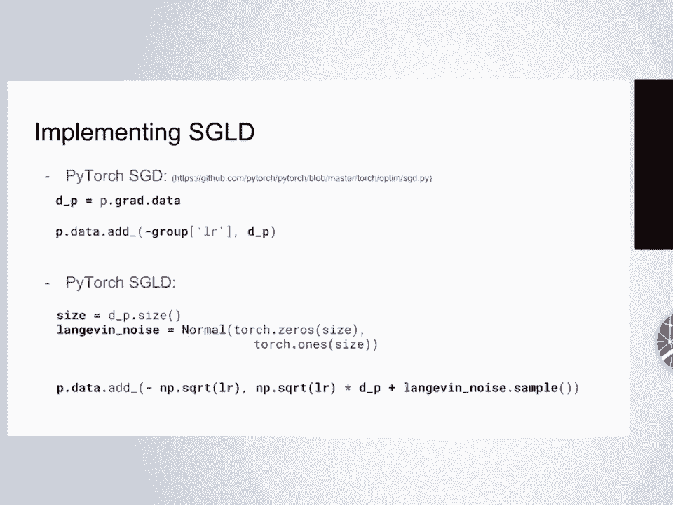

 of how this is useful in real life。 So you've all seen the MNIST dataset， it has 60。

000 training images and 10，000 test images， and you can train a convolutional neural network。

 like in all the tutorials out there， to recognize those digits。

 And what I was concerned with is the unusual data problem。

 What happens if you take your convolutional neural network， and instead of feeding it numbers。

 you start feeding it something that doesn't look， at all like that data。

 So I found this cool data cell called NotNIST， by Yarislav Bulidov。

 which is instead of being numbers， are just letters。 So it's A， B， C， D， E， F， G， I think。

 or maybe it goes to H。 It has 20，000 images， they're scaled like MNIST， they're available online。

 and you can look at what happens， when you use your pre-trained convolutional network， on NotNIST。

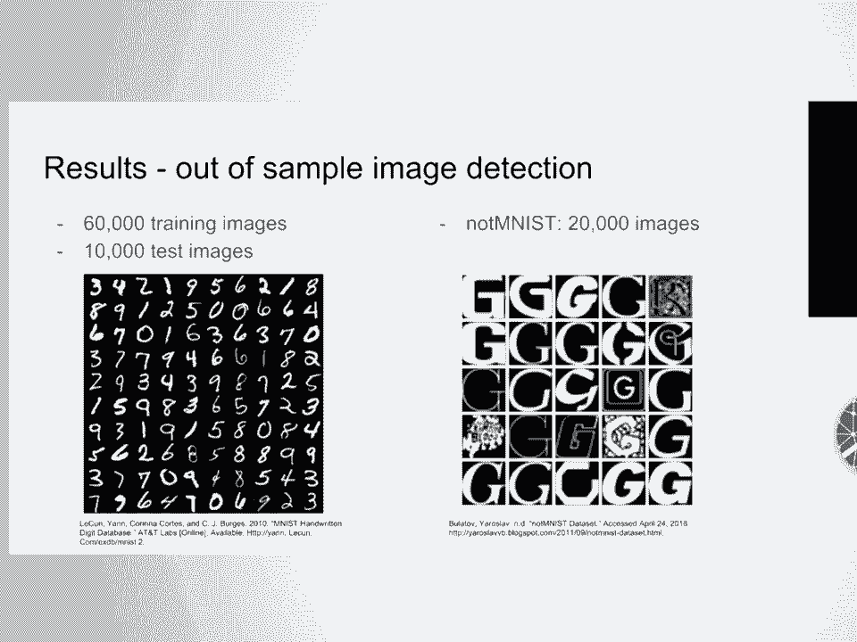

 So this is what I call out-of-sample image detection。

 That's maybe not the most object-graft to read， but this is your normal stochastic gradient descent in blue。

 and the yellow one is launch of on stochastic gradient descent。

 And this is the distribution of the confidence， and predictions。

 So there was a weird normalization effect， but in a nutshell。

 if you use stochastic gradient descent， and you feed it， NotNIST， what you really， really want。

 is that the probability of the most likely label， to be really low。 You want it to say。

 I don't really know what this is， but it doesn't do that。

 It gives you relatively high probabilities， because you can see most of them are above 80%。

 But all of a sudden you add the launch of on noise to that， and you average those models。

 and you get an unbelievable shift in that distribution。

 where now the probabilities on NotNIST are around 10%， are centered around 10%。

 So I felt that was a really strong result， for Bayesian neural networks。

 that you can use them to kind of like give you， the uncertainty on this out of sample image detection。

 There's a lot of caveats to that。 It doesn't really work on all the data set。

 but it does really work well here。 Well， that's pretty much all I had for today， but it's a really。

 really quick introduction。 And as I said at the beginning。

 this field and trexizing machine learning， and statistical physics is extremely rich。

 and there's a lot of things that are happening， in theoretical statistical physics right now。

 that could be used in machine learning。 So if you're a machine learning researcher。

 it's worth looking at thermodynamics of information， the link between statistical mechanics。

 and information theory。 There's unbelievable progress that's being done right now。

 that's not at all covered by the press。 So I have this repo with a little launch of dynamic package。

 but I also added in the readme， I added the links to the slide。

 I added the links to three blog posts， I wrote that go a little more in depth。

 I added a link to a paper that kind of like， shows the different ways that you can do。

 stochastic gradient launch of dynamic， so which I would really encourage you to check it out。

 It's on my repo and it's called SGLD。 Yeah， thank you so much for listening。

 and I'm happy to take any questions。 (audience applauds)， (audience applauds)， All right。

 we've got about five minutes for questions， so we can certainly manage a few。

 Remember one question per person， phrasing the form of a question。

 and we'd like to take a question from one， first， if possible。 So。 Yeah。

 thanks for showing the false positive curve。 I assume you've done the first false negative。

 by running the NIST itself， the actual images， and see it didn't reduce them？ It didn't reduce them。

 so it performs very similarly， to stochastic gradient descent。 If you look at our。

 I see on a workshop paper， we have a really pretty in depth comparison。

 that shows also the positives， yeah。 (audience member speaks off mic)。

 So I'm not sure if I got the gist clearly， but are you saying that it's not the actual prediction。

 that's different， but you're actually coming up， with a different set of weights。

 and that's giving you a lower confidence， in the out-of-sample images？ So yeah， so that's kinda。

 I kinda hit that in the talk。 You're really getting a lot of， you're not getting one set of weights。

 you're getting several set of weights， because you're sampling from that distribution。

 that's really what you're doing， it's kinda like a weird Monte Carlo。

 and so that allows you to have better uncertainty。 A way to quantify uncertainty that's different。

 than just using that softmax vector。 So the actual training is not harder。

 because you're just adding that noise， it's a little bit slower than SGD。

 because you're adding noise， where it's a little more computationally expensive。

 is that instead of running one inference， you're running inference with several set of weights。

 So at inference time， it is a little more computationally expensive。

 but usually that's not the limitation in deep learning today。 - The answer will be less。 - Okay。

 - Great talk， thank you。 In Bayesian deep learning， how do you incorporate prior knowledge。

 like in your NIST and not MNIST example， like if you know that digits are millions of times。

 more common than the letter G， how would you encode that？ - Yeah， that's a really good question。

 because of course， like I described Bayesian neural networks。

 as being neural networks with uncertainty in the weights。

 and obviously that there's a lot of other stuff， going on in Bayesian statistics。

 and one thing that you can do， is incorporate prior knowledge in the weights。

 You're touching on a really sensitive point here， is that when you think of Bayesian models。

 you're thinking of graphical models， where the prior is mean something。

 where you can use and form priors， according to your expert knowledge。

 here the prior is the prior on the weights， and I don't know how to express correctly。

 expert knowledge on the weights， so here the prior information is just trying。

 to be as least informative as you can， and in this case， I just use normal initialization。

 type uncertainty on the weights。 So there might be a way to do that， it's just not straightforward。

 - Yeah， regarding the output， you had the confidence or some of the binomial probability。

 model output， and we saw that one of the original one， had a very high confidence。

 and your Bayesian output had a very low confidence。 I mean， the Bayesian usually just provides you。

 the kind of probabilistic sense of your output， like in terms of distribution or dispersion。

 but your C is just simply giving very poor output。

 not giving the probabilistic sense of your output。 Isn't it just the result of a poor training？

 - So simply， I can see any benefits coming out from Bayesian。 Well， if， so yeah。

 I should have shown， that the Bayesian algorithm performs just as well， if not better。

 on MNIST itself。 And in terms of confidence on MNIST itself， the confidence are very high。

 So it's just not that I'm kind of like training， the network badly。

 they're trying to the same level， of accuracy and confidence on MNIST itself。

 and you only see the difference when you use the not MNIST data， not when you use the MNIST data。

 So that's really where you see that， the power of this approach。 - All right， thank you very much。

 and let's all thank Henri again for--， - Thank you so much。 (audience applauds)。

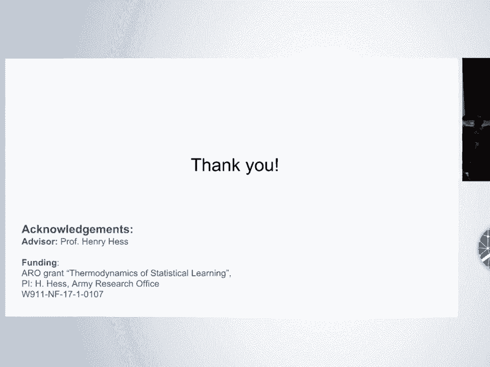

 - Thank you。 [BLANK_AUDIO]。