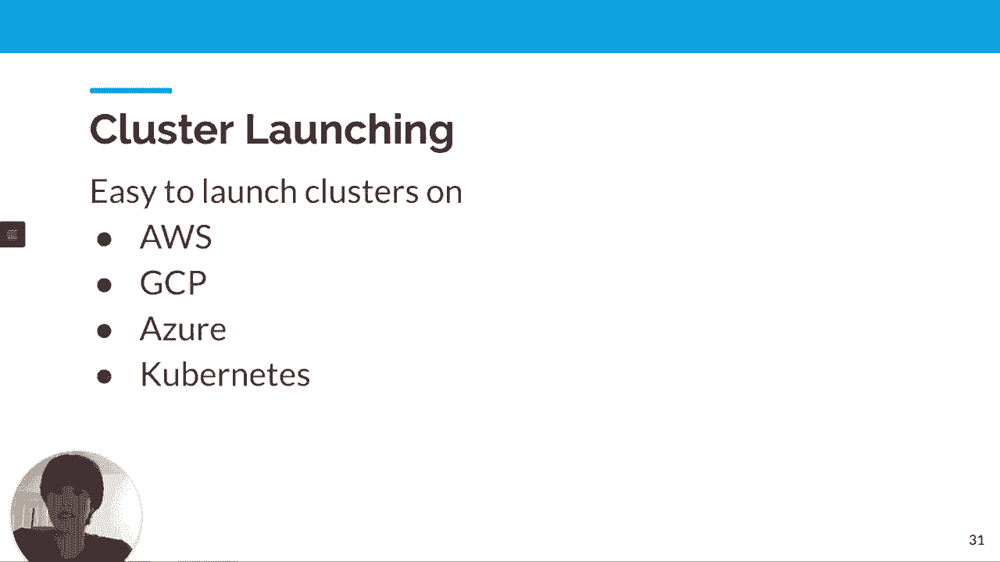
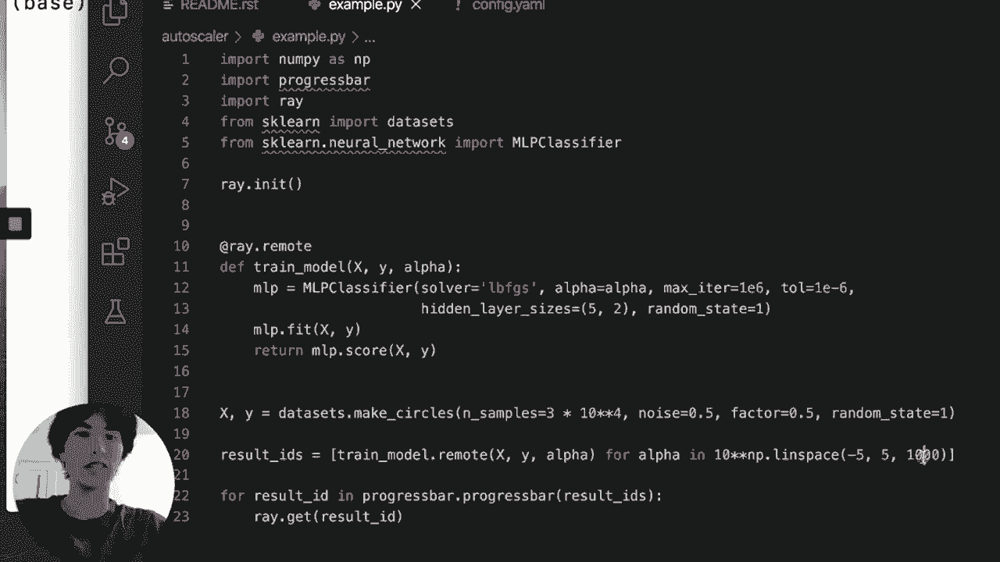
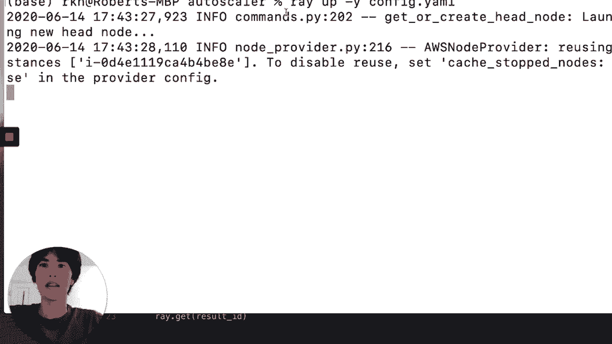
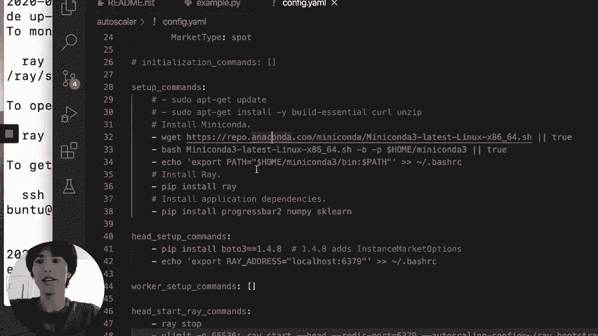
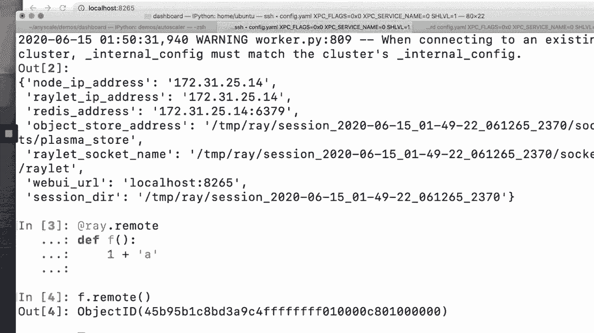
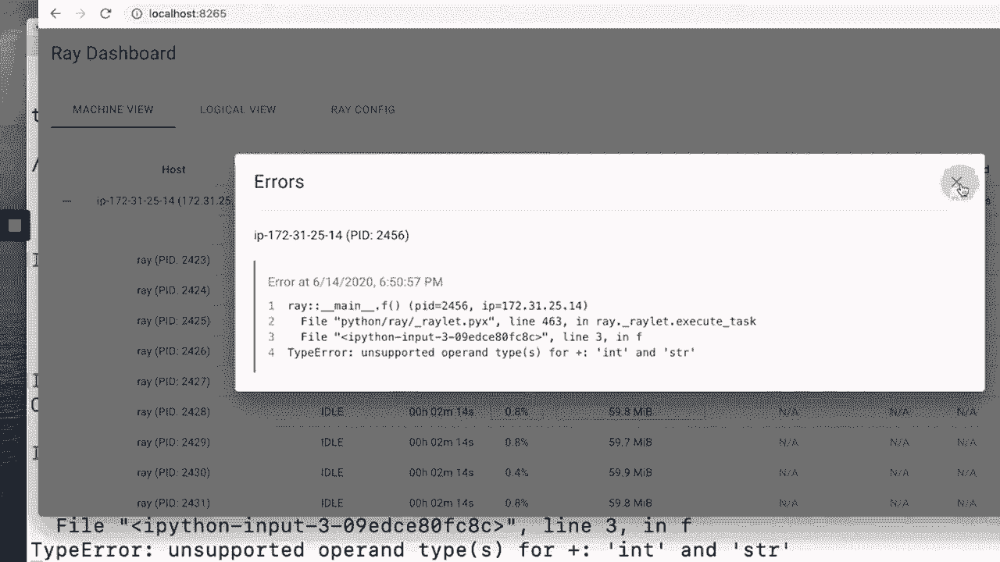
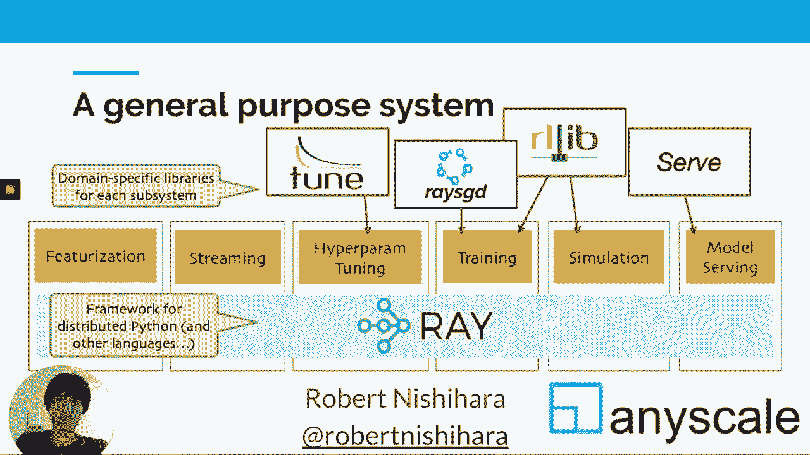

# P10：Ray- A System for Scalable Python and ML ｜ Robert Nishihara - 爱可可-爱生活 - BV1Fv411q7k3

 Hi， I'm Robert。 I'm going to tell you about RE which is a distributed system for scaling。

 Python applications and scaling machine learning applications。 So we actually began working。

 on RE about four years ago and RE is associated， you know， it began its life in the AMP lab。

 and RISE lab and bear at UC Berkeley。 And these labs have a long history of creating。

 influential open source projects like Apache Spark， Mesos and Cafe。 And so we were， you， know。

 in kind of the perfect ecosystem or environments with experts in systems and experts。

 in machine learning that we could learn from to really， and that really fostered the development。

 of RE。 So to tell you what RE is， RE is three different things。 First， it's a simple library。

 for distributed computing。 It lets you scale your Python applications from your laptop。

 to a cluster without really modifying the applications much， just adding a few decorators。 Second。

 it's an ecosystem of libraries built on top of the lower level primitives。 So we。

 have built libraries targeting scalable machine learning like hyperparameter search， training。

 serving models and production and so on。 And lastly， it's a collection of tools for launching。

 clusters on cloud providers， on your Kubernetes cluster or anywhere。 And I'll demo that later。

 So here's a depiction of the RE ecosystem。 At the lowest level in here in the blue， we。

 have the core RE API。 And that's an API for scaling， taking Python functions， taking Python。

 classes and translating those into the distributed setting。 It's very general and you can build。

 arbitrary applications on top of RE。 On top of that API， you have higher level libraries。

 that we've built like TUN and ReS-GD for training， serving， reinforcement learning and so on。

 So to orient， to give you a sense of what RE where it sits with relation to the rest of。

 the ecosystem。 RE is similar in nature to tools like Dask， PySpark。 If you're familiar with。

 GRPC or Erlang or Aca， these are actually important comparison points as well。 Basically。

 these are tools that people use and of course， PySpark and Dask are much higher level。 GRPC。

 Aca and Erlang are lower level。 But these are tools that people use to build distributed。

 applications。 So RE is not a replacement for Kubernetes。 RE can run on top of Kubernetes。

 it can run on top of AWS， any cloud provider， you can run it on top of your laptop。 One。

 of the main advantages of RE is that you can run it anywhere。 And lastly， RE is also not。

 really like NumPy or Pandas or TensorFlow or any of these things。 These RE is a tool you。

 can use to scale your NumPy or Pandas or TensorFlow or Spacy applications。 So， you know， like I。

 mentioned， we began RE about four years ago and we've seen a lot of adoption that's been。

 really exciting， ranging from a number of production use cases to researchers using RE to many。

 startups using RE。 And it's being developed openly on GitHub。 And we've seen one metric。

 we care a lot about is contributors and we've seen a really thriving community of contributors。

 So a natural question is why build a new distributed system？ Because distributed systems are not。

 new， right？ Going back to the 80s， we have high performance computing running on supercomputers。

 More recently in the 90s， we have large scale web serving。 After that， we have big data， right？

 You have systems like MapReduce and Hadoop targeted at crawling the web and building。

 search indices。 And more recently， you have the rise of deep learning with tools like TensorFlow。

 and PyTorch。 So distributed computing has been around for quite a while。 What's new now。

 what's changed is that these are no longer isolated workloads。 Whereas before， you might。

 run your web serving to serve all the traffic visiting your web page and that would be a。

 standalone application or you might run your molecular simulation， your molecular dynamics。

 and that again would be a standalone application。 And because these are all standalone applications。

 we have specialized tools built to serve these applications。 And that's great。 But what we're。

 seeing now is that these applications are starting to overlap。 So you have， for example。

 reinforcement， learning， which combines deep learning and training models with high performance computation。

 and large scale simulations。 And you also have online learning， right？ Where you have applications。

 that are interacting， continuously interacting with the real world， learning from that experience。

 and then taking actions in the environment。 And that， of course， combines many of these， boxes。

 And many of these applications are data driven and data is being fed into the。

 training or being fed into the simulations or into the services。 And so there's a natural， question。

 right， that now that these workloads are all overlapping， the question is， you know。

 there's a sort of an obvious need for a general purpose distributed system that can support。

 all of these workloads。 And of course， the question is， what should that look like？ And。

 this is precisely the goal we set for ourselves when we began working on REI。 So that hopefully。

 provides some of the context about why we're building REI and where we think it can go。

 So now I'm going to tell you about the REI API。 So the REI API is very simple。 And it's。

 basically taking functions and classes and letting you translate those into the distributed。

 setting。 So to start with functions， here's a here to regular Python functions。 One reads。

 a file and returns an array and the other adds two arrays together。 So we can take these。

 Python functions and add this remote decorator on top。 And now when we invoke one of these。

 functions， we add the dot remote keyword。 And instead of， you know， blocking while the。

 function is executed， it starts a task， which it runs asynchronously in your cluster。 And。

 then it immediately returns a future。 And because it immediately returns a future， we。

 can submit a second copy of the task before the first one finishes。 And so that will execute。

 in parallel。 And that's how， you know， futures enable parallelism。 And of course， we can submit。

 tasks that depend on previous tasks。 And then if we want to retrieve the actual value associated。

 with one of the tasks， we can call ray。get。 So that's just， of course， this is already。

 very powerful。 You can do quite a bit with this kind of API。 But of course， when you're。

 programming， you use functions and classes， right？ So functions are just half of the picture。

 So how does Ray deal with classes？ Well， Ray turns classes into actors。 So here's a Python。

 counter object。 It's class， it's just a simple class that has a single method for incrementing。

 a counter。 And now if you add the ray。remote decorator， and you create an instance of this。

 counter object， that will create a service running in the cluster that has a copy of， this object。

 And now you can invoke methods on that object not to send tasks to that service。

 And those return futures。 And if you'd like， you can call ray。get to retrieve those values。

 And this is a stateful service。 So unlike the functional part， which is stateless， here。

 you actually have mutable state that lives inside of the actor。 And of course， you can。

 specify resource requirements for the actors for the tasks， if they need GPUs or TPUs or。

 more memory or whatever， that's straightforward to do through the API。 So now I'm going to talk。

 about some recent highlights in Ray。 We'll talk about performance tools for automatically。

 launching clusters on various cloud providers or Kubernetes， the recent dashboard we've added。

 to make it easy to debug Ray applications。 And two things I won't talk about but are also。

 important。 We've recently added new libraries for distributed training and for deploying。

 machine learning models in production， as well as we also have preliminary support for windows。

 finally。 Okay， so on the performance side， we actually recently re-architected Ray going， from 0。

7 to 0。8。 And the point of this was to address some of the common， you know， the。

 most frequently occurring user issues that we had。 So what is performance？ Our users。

 want Ray to be as fast as GRPC， as fast as if they built a specialized distributed system。

 from scratch to support their application。 And the reason is that， you know， the applications。

 that we support have very demanding performance requirements。 And so we want， you know， we。

 don't want there to be a performance cost for using Ray。 So the second was about reliability。

 One of the most common reliability issues we faced was related to out-of-memory issues。

 And this is something we solved by with a distributed reference counting and distributed。

 garbage collection in 0。8。 And that was made easier by the re-architecture。 Okay。 And of， course。

 we wanted to do all of this without any compromises in the programming model。 So， if 0。

7 is here in terms of performance and generality， the goal with 0。8 was to move here。

 And while it was mostly about performance， having better performance actually increases。

 the generality because the more， you know， the higher the performance， the more applications。

 you can support。 Okay。 So what was the key idea？ Well， to understand， the change we made。

 you have to understand that if you want to provide a simple fault-tolerant。

 API using distributed memory， then the system has to require， you know， it has to track certain。

 kinds of control state。 And the way that was done with previous versions of Ray was to。

 have this global store which stored certain state。 And so if you look at the life cycle， of a task。

 it would start in one process that would invoke the task。 That task would go。

 through a scheduler and the scheduler would write some metadata to the global store。 And。

 then the task would go to the worker process that would ultimately execute the task。 And。

 that involves， you know， a number of RPC round trips。 So of course， you can see the potential。

 for optimization here， right？ If you're able to go directly from process to process， you。

 can eliminate a number of RPCs and potentially speed things up quite a bit。 So how do you， do that？

 Well， the key idea with this re-architecture was to move the control state from the global。

 store into the worker processes themselves。 And that both simplified the design and enabled。

 us to implement features like distributed reference counting and direct calls。 It also， allowed。

 you know， allowed us to go directly from process to process to substantially to。

 bypass the scheduler in the common case and speed up performance。 So if we're looking。

 at some micro benchmarks， here is 0。7 task throughput， both for regular tasks as well， as actors。

 And here is task throughput for 0。8。 Of course， higher is better。 And so in， some cases。

 you're actually seeing an order of magnitude performance improvement。 Here's， a scaling benchmark。

 again， comparing 0。7 to 0。8， showing that 0。7， at least for this， workload。

 is maxing out at around 5 or 10，000 tasks per second， even on a active task per。

 second for a larger cluster。 And here the 0。8， it's going to 250，000， so a quarter of。

 a million tasks per second on a cluster with 256 CPU cores。 So these are pretty substantial。

 differences。 And note that the x-axis here is on log scale。 Okay， so now I'm going to。

 talk a little bit about tools for launching clusters。 So Ray， you know， of course it's。

 the API for developing distributed applications and the libraries on top of that。 Ray also。

 includes tools for launching clusters on AWS， GCP， Azure， or Kubernetes。 And of course。

 all of that is in addition to being able to run Ray on your laptop。 So now I'll give。

 a quick demo showing how to use these tools to speed up a Ray application on a cluster。

 Here's a simple Ray application that trains a thousand different scikit-learn models with。

 a bunch of different regularization parameters。 So if I run this on my laptop， Python example。

 dot pi， it'll be prohibitively slow。 Despite the fact that we are using Ray to parallelize。

 the application across and the training across all the cores on my machine， so about 16 cores。

 So the fact is we're training a thousand models， it's just going to take a really long time。

 So instead of waiting for this， I'm going to cancel this because we don't want to wait， for it。

 And start a cluster on AWS using Ray。 So I'm going to run Ray up fig dot email。

 And what that's doing is it's taking this cluster config and using that description to。

 start a cluster on AWS。 And so if you look at that cluster config， there's a minimum and。

 maximum number of workers， auto scaling policy， we're specifying the cloud provider。 Of course。

 we could change that to GCP or Azure and launch a cluster on a different cloud provider if。

 we wanted to。 I'm going to specify region instance types， AMIs， commands for to install。

 to to set up the cluster。 So here it's installing an anaconda， things like that。 And most of these。

 are optional。 They're good defaults。 So now the cluster has started。 And so now we're。

 going to go back and take the original application and run that on the cluster。 So to run this。

 on the cluster， you're going to run Ray submit config。yaml example。py。 And what that will。

 do is that will submit the application to run on the cluster。 And it'll copy over all the。

 relevant files。 And now we see if we look at the elapsed time， it's because we have a 10， cluster。

 it just finished in a total of four seconds。 So we went from a prohibitive amount。

 of time running on our laptop with 16 cores to starting a 10 node cluster with just one。

 command submitting our scripts to run on that cluster。 And then it took only four seconds。

 Now I'm going to tell you a little bit about the ray dashboard。 So it's not so so far， I've。

 just talked about how to use Ray to develop distributed applications， but developing。

 distributed applications is not enough。 Because once you develop the application， you have。

 to we're probably going to spend a lot of time debugging the application， right？ And。

 debugging distributed applications can be very painful。 You may have to SSH to tons of。

 different machines， you know， parse a bunch of log files on all these machines， collect。

 all the log files together。 It's a mess。 So it's not enough to make it easy to develop。

 distributed applications。 You have to really make it easy to debug these applications。

 And that's the point of the dashboard。 So now I'd like to show you some properties。

 features of the ray dashboard。 So here's what it looks like one view with an idle cluster。

 So now I'm going to start a ray application and connect to the cluster。 And I'm going to。

 start by showing you how you might use ray to debug a failing application。 So this will。

 be in the simplest case where the application will the task will raise an exception。 So I'll。

 try to do something invalid like adding an integer to a string。 So now I'm going to run， f。remote。

 Now， if we head over to the dashboard， we can click on the errors and see that the。

 dashboard gave us an appropriate error message for with the appropriate exception。 You can't。

 add an integer to a string。 And this is important because when you're running on a cluster， there's。

 lots of outputs and， you know， standard out and standard error and exceptions that are， happening。

 you know， in many different machines， hundreds of machines across a cluster。 And。

 so the last thing you want to have to do is to SSH into 100 different machines， you know， parse。

 grip through all the different log files to figure out what's going on。 So being able。

 to aggregate these in a single view is extremely important。 Another， and of course， with Ray。

 we also care about propagating these error messages to the user in a reasonable way。 And。

 so even if the user doesn't look at the dashboard。

 they will see this error message in their terminal。 Okay。

 And the same is true for regular standard out print and standard input。 So if I instead。

 of doing something invalid， I print a string and then run that task that will both be streamed。

 to the console as well as visible in the logs。 So now I want to show you the logical view。

 So this is a display where we currently show， you know， a non cluster centric view of the， cluster。

 So non， it's not machine centric。 Instead， it's application centric。 So I'm。

 going to define a a ray actor， which is just going to be a slow actor， which I'm going to。

 try to figure out why it's slow。 So it's going to have a single method。 This is going to be。

 a really simple example where it loops around and creates a large NumPy array。 We'll say。

 it's a 1000 by 1000。 And then it's going to multiply that matrix with itself。 Okay。 So。

 this is a very contrived application。 But here we go。 So we're creating the slow actor。

 And if I go over to the logical view， we can see this slow actor has shown up here。 Now。

 if I then execute some invokes and methods on the actor， say I go look around 50 times。

 and call the slow actors method。 Okay。 So now going back to the logical view here， we see。

 there are a number of pending tasks。 And I'm going to add a few more tasks to the queue。

 Now if I go click on this profile button， because say I know that this actor is too， slow。

 and I want to figure out where the time is being spent， we can actually， we actually。

 run a profiler to profile the actors code and keep in mind that the we didn't have to instrument。

 their application at all。 So we can click on that profiling result button， and that pulls。

 up a essentially like flame graph of where time is being spent， we can see a lot of time。

 is being spent in the dot task， or sorry， the dot NumPy dot dot function， as well as in。

 the actor's method， you remember the that was the the actor's method is called method。

 And there are different views。 You can also look at this view where you can see that time。

 is being spent in the dot， you can see the time is being spent in the method， and so on。

 So what we just did here was we created an actor， we were running a ray application， and。

 we managed to profile the running application without instrumenting or modifying or even。

 planning for profiling at all up front， we just started running the application， and then。

 we clicked a button， and we're able to produce the profile of the actor code。 And so this。

 kind of tool can actually make debugging much simpler。 So what's next for Ray？ Well， we have。

 a lot planned。 As you can imagine， we're always doing work on performance， and that's not just。

 because performance is important for its own sake， but performance is actually a key enabler。

 of generality。 One of the main advantages of Ray is the fact that it's very general purpose。

 and can support many different kinds of workloads。 And when you support have a general purpose。

 distributed system that supports workload A， B and C， streaming and training and reinforcement。

 learning and so on， production serving， you inherit the most stringent performance requirements。

 from each of these different workloads。 And so the more the faster we can make the performance。

 the better we can make the performance， the more types of workloads we can support。

 Now one thing I didn't touch on much at all， of course， so Python is our main focus， but Ray。

 also supports Java。 We have there are some production use cases of Java。

 And we're looking forward to， adding support for more languages。

 Ray itself is designed in a language agnostic way that back。

 end is written in C++ with Python and Java language bindings。 We're also looking forward to writing。

 building great， you know， really improving the auto scaling support。 We want to get to the point。

 where users can think just about their application logic。

 where they don't have to think about servers， or cluster sizes or scaling up and down or instance types or anything like that。

 They just， write their application logic and it automatically takes advantage of all the cluster resources。

 you know， scaling up and down as needed without users having to to worry about that。 And that'll be。

 you know， a key part of making developing cluster applications as easy as developing。

 applications on your laptop。 Next， you know， you already saw a little bit about the dashboard that。

 we're building。 There's a lot more to do there。 We're super excited to make it easy to debug。

 distributed applications。 You know， it's one thing to make it easy to develop distributed applications。

 but we all spend a lot of time actually debugging applications。 So， and you know， the debugging。

 distributed applications or debugging performance issues with distributed。

 distributed applications can be way more complex than debugging these things on your laptop。 And so。

 we can provide a great experience for that and make it an experience similar to that on your laptop。

 That will be that's something that we're really excited about。 There's a lot more things we want。

 to do to make it easy to monitor production applications with Ray and that's something we're。

 working on。 And lastly， you know， we already have。

 initial support for Windows and that's something we're going to continue to work on。 Lastly。

 I want to leave you with this figure。 So again， this is depicting Ray， the Ray ecosystem。

 At the core， there's the Ray API， which provides a simple way to take Python applications。

 Python functions and Python classes and translate those into the distributed setting。

 And using those just a couple simple primitives。 On top of that， we've built a rich ecosystem of。

 libraries for hyperparameter tuning， for training， for reinforcement learning。

 for serving production， machine learning workloads。 And there's much more to come here。

 So I'll leave you with that。 And， I'd be happy to answer any questions。

 Any scale is the company where we're developing Ray。 Thanks so much。

 [BLANK_AUDIO]。