# P4：GPU-Accelerated Data Analytics in Python ｜ Joe Eaton - 爱可可-爱生活 - BV1Fv411q7k3

 Hey guys， so this is Joe Eaton。 I'm gonna talk about Rapids。

 and GPU accelerated data analytics today。 So let's dive right in as soon as we bring up。

 the right stuff here。 We're gonna talk about the evolution of data processing。

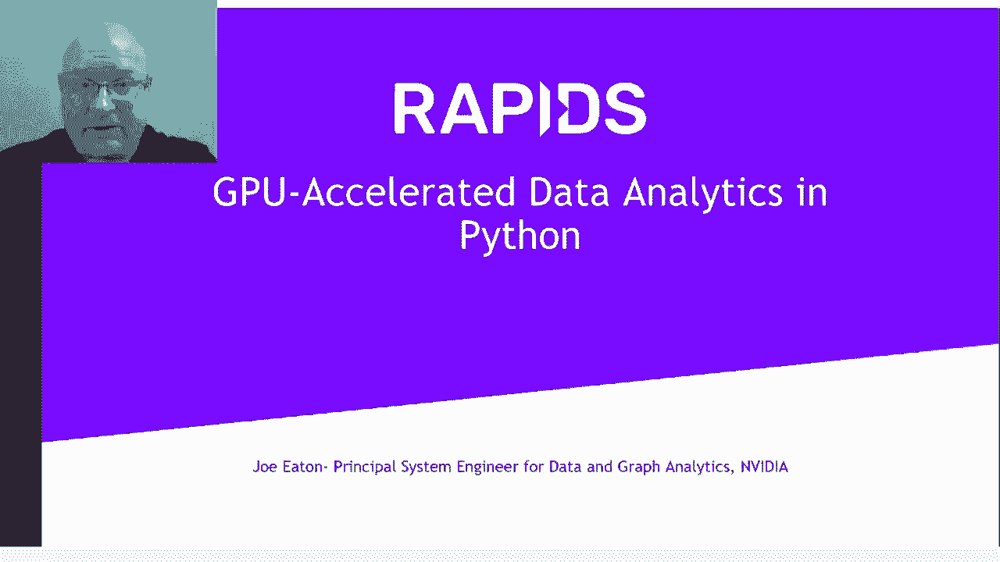

 I think a lot of you have already used， some of these packages， Hadoop， Spark。

 and maybe even dabbled in some GPU processing。 And generally， you know， there's been progress。

 We've been able to do more data in less time， but there was a really big bottleneck。

 The bottleneck was not the compute itself。 GPUs are very fasted compute。

 The bottleneck that we found was， when you connect two applications together。

 sometimes they don't share the same data format。 And this requires a copy and convert step。

 Now every time we do a copy and convert step， we're moving a lot of data。

 we're doing a lot of extra compute， that doesn't help us get our job done。

 So by eliminating these copy and convert steps， we can really bring up more of the full potential。

 of GPUs。 And what we've adopted is Apache Arrow。 We've adopted their in-memory binary format as a standard。

 So every application can agree， on what does an array of floats look like。

 in terms of memory layout， in terms of bit order， all of those things。

 So now we have one common interchange format， and all of these applications and data formats。

 can agree on what that is。 And that directly unlocks a ton of capability now。

 So I'm gonna talk about rapids。 Rapids is the realization of this idea。

 along with a lot of other goodies， that we're gonna get into in more detail。

 But when you see the whole thing， when it's actually all working together。

 we're able to deliver a couple orders of magnitude speed up。

 on these really large data processing jobs。 So this is what motivated us was Kaggle competitions。

 and this is the process of developing new data science， workflows， it's iterative。

 You have to keep looping back， updating your feature set， reloading your data。

 picking out different data slices。 And the faster you can go through that iteration。

 the faster you make progress。 So that was really what motivated us。

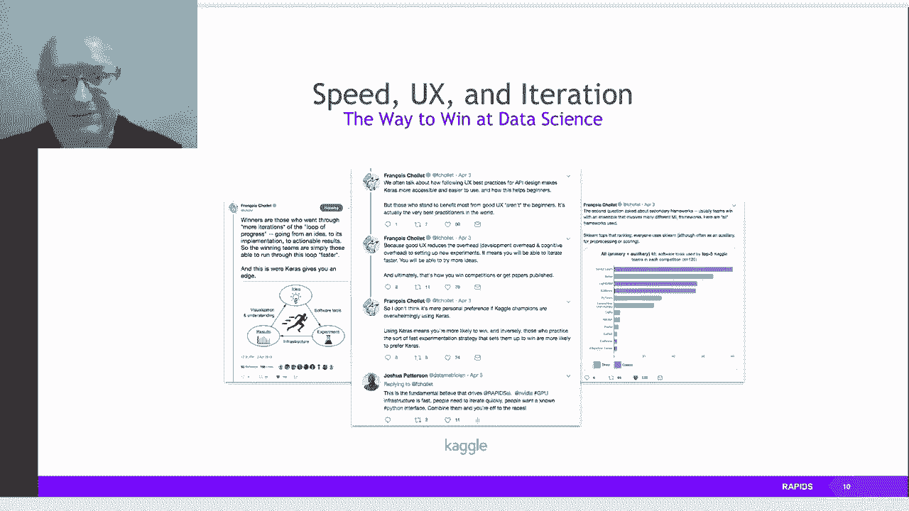

 to put all these pieces together。 Let's talk about the core of rapids。

 Oh， I should mention， any time you guys， this is all recorded， right？ You're watching a recording。

 So you can hit pause anytime。 I've got a lot of slides to go through。

 We're gonna go pretty fast sometimes。 Feel free to hit pause and read the details on the slides。

 I'm not gonna be reading out every word on every slide。

 What we started with was the open source Pi data stack， right？ This is pandas， scikit-learn。

 network X for graph analytics， dask for distributed computation。

 And what we wanted to do was GPU accelerate the whole thing。 And that's what this looks like。

 Rapids is attempting to do a drop-in replacement， for pandas， for scikit-learn， and for network X。

 It brings along the goodness it's already there， in PyTorch， TensorFlow， and MXNet。

 And also accelerates visualization of datasets， by adding in GPU power to plotly。

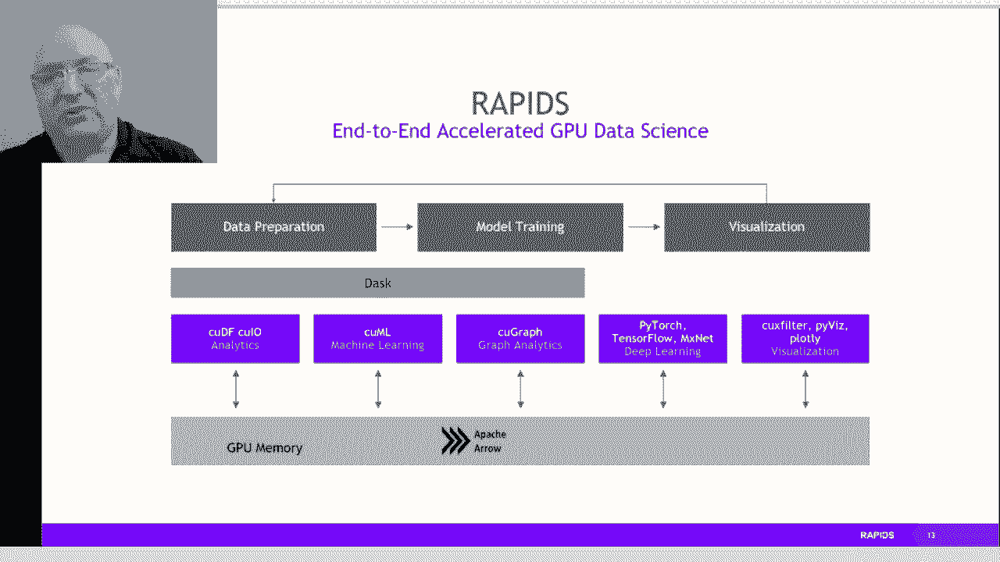

 or PiViz， or data shader。 So I mentioned dask。

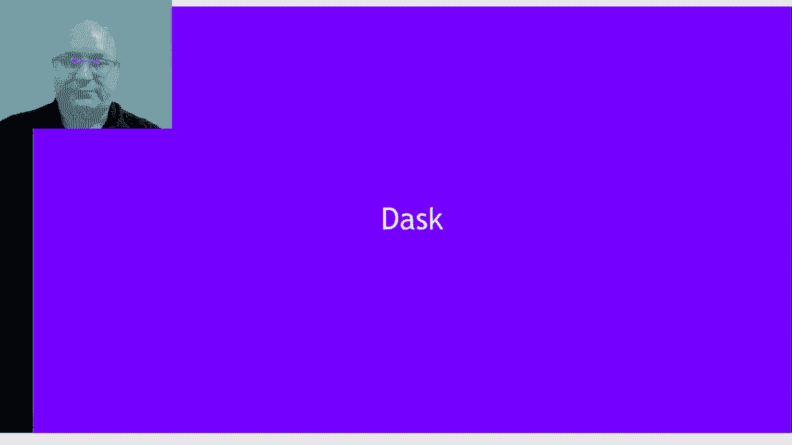

 We'll start off right there。 Why is dask such an important piece here？

 It really is the bridge to get off of a single desktop， or laptop into a larger resource pool。

 right？ So we can deploy dask onto very large clusters， into the cloud， you can use Hadoop or Spark。

 It's native Python， so it's easy to connect， to existing packages。

 It has all the same training APIs， has a large developer community， it's easy to scale up。

 and it's very popular。 So we grabbed dask and we said， yes， let's work with this。

 So here's an example。 Take an existing code base， you can add in a few hints to dask。

 to tell it where the tasks are defined， and what the dependencies are。

 and dask will go off and build a task graph， and then take responsibility for executing that graph。

 and making sure that all the tasks are completed， as fast as possible。 So what this does。

 it allows you to connect， all those users out there who've been coding away， using their laptops。

 using their desktops， you can take their work， you can throw dask on top of it。

 dask will expand out the resource pool， without them changing their code dramatically。

 and encompass a much larger class of computers。 Now， for example， clusters。

 large supercomputers can run dask today， and by taking all that work of scheduling tasks。

 graph management， handling failovers， handling data copies between nodes， desk handles all of that。

 You can just worry about writing， a successful machine learning algorithm。

 and dask lets you scale it up to much larger datasets。 So we also have brought in OpenUCX。

 So this allows us to bring in new hardware capabilities。 TCP sockets are great， they're slow。

 So we've allowed users to connect in better hardware， when it's available。 So in Finaband。

 shared memory capabilities， or even N relink are now accessible， for transport inside dask。

 And what this means is going from TCP with UCX， so we're achieving a starting point。

 about two gigabytes a second to merge two data frames。 Now。

 taking the same data and using UCX with NV link， we get almost twice the performance immediately。

 We can also bring in Finaband。 If you have in Finaband on your nodes。

 you can now connect them together to 11。7， almost 12 gigabytes a second between those nodes。

 You can then stack these advantages。 You can stack NV link with Finaband。

 So NV link handles communications within a node， inside workers within a node。

 and in Finaband connects across nodes。 And then， all the way up to a fully dedicated node。

 like a DGX2， a 16 GPU's in it， can achieve 37 gigabytes a second using UCX。

 So this is our way of getting to this kind of vision， of an easy to use Pi data stack。

 with acceleration on a single node with rapids。 And then once you have your debugging done。

 and you're ready to scale out to a really big data set， you can use dask with UCX。

 and get that same acceleration， now across hundreds of nodes。

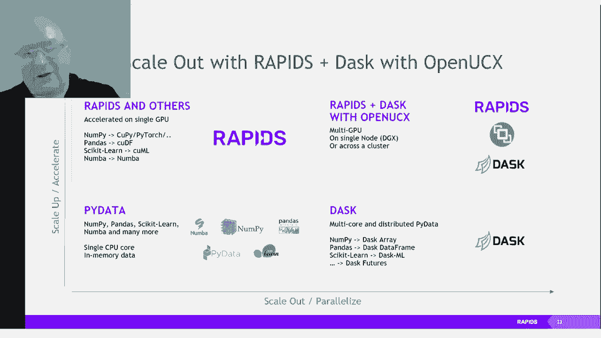

 for the very biggest problems。

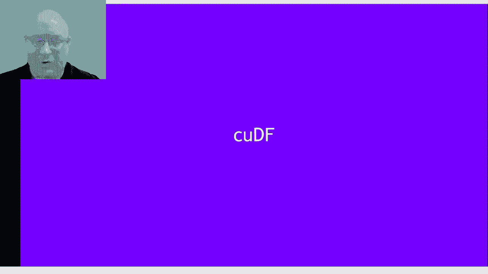

 Okay， let's go on to some more details。 So CUDA stands for CU DataFrame。

 It's the equivalent of the pandas data frame， or that's the intent anyway。

 It also is coupled with an IO package called CUIO， for reading data sets， parsing data sets。

 and doing data transformations。 So this is really the motivation here is ETL。 You know。

 a lot of data scientists spend 90% of the time， they need to learn to learn to learn to learn to learn。

 about the data。 So that's what we're doing here。 We're doing a lot of data。

 We're doing a lot of data。 We're doing a lot of data。 We're doing a lot of data。

 We're doing a lot of data。 We're doing a lot of data。 We're doing a lot of data。

 We're doing a lot of data。 We're doing a lot of data。 We're doing a lot of data。

 We're doing a lot of data。 We're doing a lot of data。 We're doing a lot of data。

 We're doing a lot of data。 We're doing a lot of data。 We're doing a lot of data。

 We're doing a lot of data。 We're doing a lot of data。 So that's what drove us to make QUDF。

 is to get that ETL time down and let people work on much more， I guess。

 interesting parts of the data science workflow。 So here is our stack。 QUD is at the bottom。

 QUDL libraries sit on top of the QUDL language。 We've got a set of core primitives in C++。

 connecting down to call QUDL libraries。 That's wrapped with Cython。

 And then the user sees a Python package at the end。 So this is kind of a common pattern。

 We're going to rinse and repeat this several times， as I go through the rapid components。

 But at the end of the day， QUDF is a Python library。 It looks very much like pandas。

 It has a lot of the same commands。 You can use the same familiar kind of patterns。

 of manipulating your data frames。 But coupled with it is a very fast data I/O package。

 So now you can load data into memory 10 times faster， using a CSV reader with GPU acceleration。

 You can sort your data faster。 You can sample your data faster。

 You can do data cleanup and imputation faster。 So you can even do your own custom user defined functions。

 using number for things that only you need。 So here's some benchmarks。

 We're going to-- first thing that matters when you do acceleration。

 and how much acceleration is there。 And for QUDF， it's dramatic。

 We're talking 300x speedups on things， like joins of data frames， sorting data frames。

 running group buys on large data sets of 10 million rows， or 100 million rows。

 This is assuming things like we're， using a memory pool to reduce the overheads of memory allocation。

 And we're using a single GPU here。 OK。 Well， the data frame is not the end of the story。 I mean。

 I talked about some of the things that come up， in pandas are not data frames。

 We'll just basic string support。 In the past， strings were not great on GPUs。

 We've really worked hard to change that。 We've got regular expressions。

 We can do a lot of string operations， natively now at a native string column in QUDF。

 And the speedups are really significant。 Speedups are 20 to 30x for basic string operations。

 We can do categorical columns， dictionary， encoding。

 all of these things now very well supported on QUDF。

 I mentioned the data format readers and parsers， CSV。 Of course， very first one we did， 10x speedup。

 We can now do parquet。 We can do org。 We can do JSON， JSON lines， Avro。

 And we're working on more all the time。

 But ETL， again， is not just data frames。

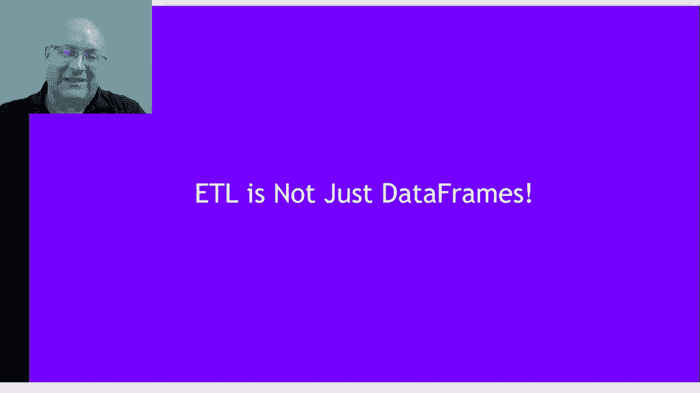

 We want to talk about what if you have image data？ What if you have audio data？ Well。

 we can connect that data。 You can use QUDF or the general array formats。

 to load your data and then direct hand it off， to PyTorch TensorFlow or MXNet with zero copy。

 because we're adopting the DLPAC interface for arrays， tensors。

 the CUDA array interface for arrays and tensors。 And by using these APIs。

 we're able to zero copy handoff， data without moving data across to deep learning packages。

 PyTorch TensorFlow。 We can use MXNet。 We can use MPI and QIPI。

 All of these can share information with zero copy。

 We've also been able to show direct replacement for NumPy， arrays in Dask。

 So instead of Dask relying on NumPy， as the chunk inside of a large distributed array。

 we can now replace that with QPy。 And those chunks are now in GPU memory。

 And that means that because it's in GPU memory， GPU memory is faster。 You can move data faster。

 You can operate on it faster。 You can get 100 XPdups on gigabyte size data。

 So it doesn't need to be terabyte size。 Even just on a single gigabyte， you're。

 getting 100 XPdups over a single GPU here。 SVD-- so SVD is a dense operation， has a lot of compute。

 But distributing that efficiently and getting good speedups， is still challenging。

 And that's where the combination of Dask and QIPI together， are able to perform 20 million rows， 1。

000 columns SVD， in less than one minute。 Also for the very， very largest data sets。

 we've been able to run arrays that， added up to 3。2 petabytes of data using Dask and QIPI。

 So if there's more details， you want， to see there's some great examples of using Dask inside。

 of a notebook showing the actual progress of how Dask builds。

 the task graph and executes the task graph。 You can actually see it stepping through the tasks on each。

 worker。 And these are videos linked here on YouTube。

 that you can go look at and enjoy the pretty pictures。

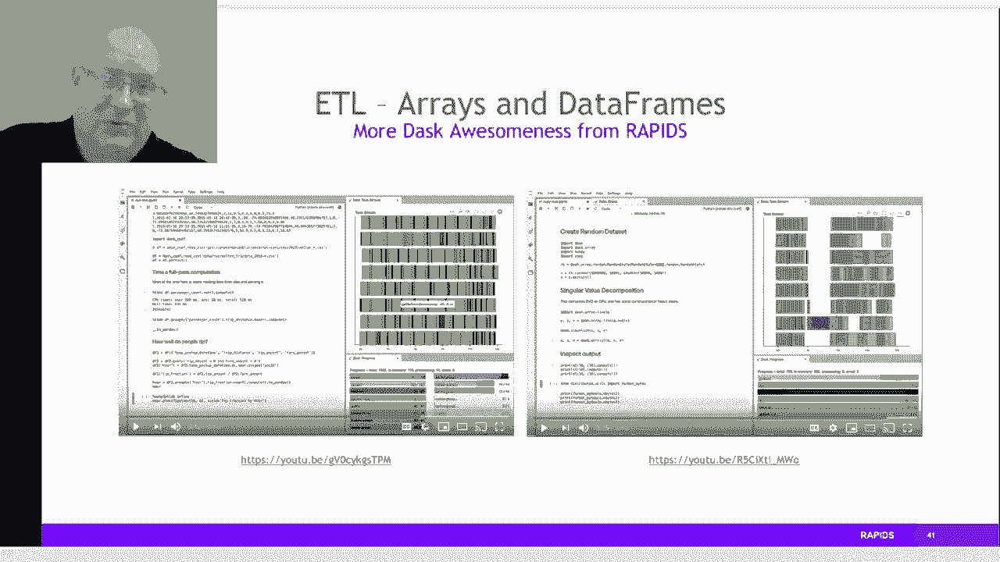

 Let's talk about cool ML， the machine learning part。 This is a Scikit Learn look-a-like。

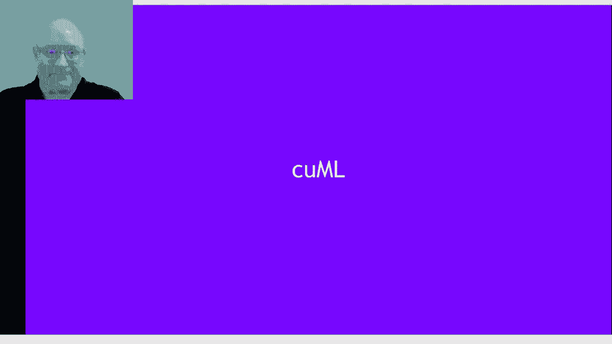

 It's in where Scikit Learn would fit into the Pi data stack。 This is trying to address--。

 we've had access to data for quite a while。 And we keep getting access to more data。

 We keep getting larger data sets。 But how do we efficiently organize the data？

 How do we clean it up？ How do we gain insight from that data， in a fixed amount of time。

 even though the data sets keep， getting bigger and bigger？ Well， cool ML is our answer。

 So it's a familiar story。 We start with CUDA。 We build up CUDA libraries。

 We build primitives from those libraries。 We write our new machine learning algorithms using。

 the primitives。 And we wrap that in sites on。 And what the user sees is Python at the end of the day。

 So here's an example of clustering using the Moon's data， set。

 This is a standard example in Scikit Learn using pandas。 You can take that exact same code。

 You can swap out the import statements， replacing pandas with CUDAF。

 replacing Scikit Learn with QML， and get the same results just a lot faster。

 So here's a list of some of the algorithms in QML， mimicking Scikit Learn。

 A lot of these are familiar regressions， classification， inference， clustering， decomposition。

 dimensionality， reduction， time series， hyperparameter tuning。 And we're always looking to add more。

 So these are some benchmarks。 We've got single GPU QML here compared to Scikit Learn， on a 2。

20 core CPUs。 Now， the speedups here vary by algorithm。 They also vary by the size of the data。

 And generally speaking， the larger the data feed to the GPU， the more speed up you're going to see。

 Up until the limit， the maximum we can shove into that GPU。 Now。

 that's because GPUs love to be fully loaded。 It gives them more opportunity for parallelism。

 It gives them more opportunity to reuse the data。 And the speedups are 10， 20x in a lot of cases。

 In some cases， 50， 100x。 So it depends on your data size and your use cases。

 But these speedups are real。 And these are drop-in replacements for Scikit Learn。

 Let's talk about inference。 So inference is the concept of taking a trained model。

 be it a neural network or just a random forest， and running it forward， running it。

 to give a prediction as fast as possible。 What we've added is a forest inference library。

 So if you've trained a random forest model， trained a boosted tree model， we can take that。

 compress it down to its bare essentials， and run it in parallel on the GPU。

 And we can do 100 million inferences a second， with this library now。 And we're showing speedups。

 20， 30x speedups over CPU-only， based inference。 XGBoost。 XGBoost was-- and still is-- probably。

 the most important machine learning package， that we've linked into rapids。

 We've had it from the beginning。 XGBoost now builds a very tight connection into rapids。

 It's able to do zero copy data import from QDF， Kupai， Numba， or PyTorch。

 And it's been rewritten and improved， as we've evolved together。 We're able to use much less memory。

 oftentimes 2/3， less memory than before。 And we can support new capabilities。

 like learning to rank on the GPU now。 There's a lot of notebooks， give me examples。

 of using XGBoost if you're interested。 Also， if you're really interested in using the cloud。

 rapids integrates with Amazon SageMaker。 It integrates with Azure ML and Google AI platform。

 They all work out of the box with rapids and desk today。 And we've also done some really great work。

 for hyperparameter optimization using RayTune。 If you've got a job which has hyperparameters。

 and that's very common in machine learning， you need to do a sweep， run a few tens to dozens。

 of hundreds of jobs to sweep over the parameters， and find the best parameters for your job。 Now。

 oftentimes this takes a lot of time。 Now， we were able to accelerate that on GPU with desk。

 And because in the cloud， literally， you're paying， for the time you use， this translates directly。

 into lowering the cost of doing your work。 We're able to see 7X reduction in cost for the same job。

 for the same tuning job using rapids versus using CPUs only， in the cloud。 Cougraft。

 cougraft is a network X lookalike， for graph analytics， something very near and dear to me。

 So we've been trying to provide out of the box， a breakthrough level of performance and scale。

 for the familiar algorithms in network X。 So I'll show you a list of the algorithms in a little bit。

 But the idea is we can take the familiar， easy to use network X API。

 We can add in property graph support， we can add in scalability up to billions of edges。

 We can keep it in Python， we can make it function and run， using C++ and CUDA underneath。

 And we can keep adding on new capabilities as we go。 So the stack looks quite familiar。

 It's CUDA at the bottom。 CUDA libraries on top of that， we have our own primitives。

 we have our own algorithms that use those primitives， we wrap it in Syson， and then the user。

 sees a Python layer on top。 The algorithms long list here， community detection， components。

 link analysis， link prediction， basic things like renumbering a graph。 So you can take a graph。

 oftentimes your graphs， don't have nice convenient integer IDs。 They may have strings。

 they may have IP addresses， with a port number and a timestamp。

 So we can combine all those together， into a single identifier。

 And then renumber it back to integers， for convenience of computation。

 And that's something provided out of the box by CUDAF。 We also allow you to do a brand new feature。

 is graph layout for visualization。 You can visualize very large graphs。

 with GPU accelerated force atlas as a layout engine now。 We can do graph traversals， shortest paths。

 and brand new betweenness centrality， both edge and vertex betweenness centrality。

 are now accelerated。 So here's some benchmarks， how fast is it？ We can drop in a luvain modularity。

 page rank， breadth first search， and single source shortest path on common datasets。

 We're seeing hundreds， 200 x speedup versus network x。 If that's what you're used to。

 you can get tremendous speedups， just by using CUDAF instead。 And if you have really big datasets。

 we have multi GPU capabilities for page rank， and more algorithms coming down the line。

 that will allow you to achieve tens of giga taps， performance on those big datasets。

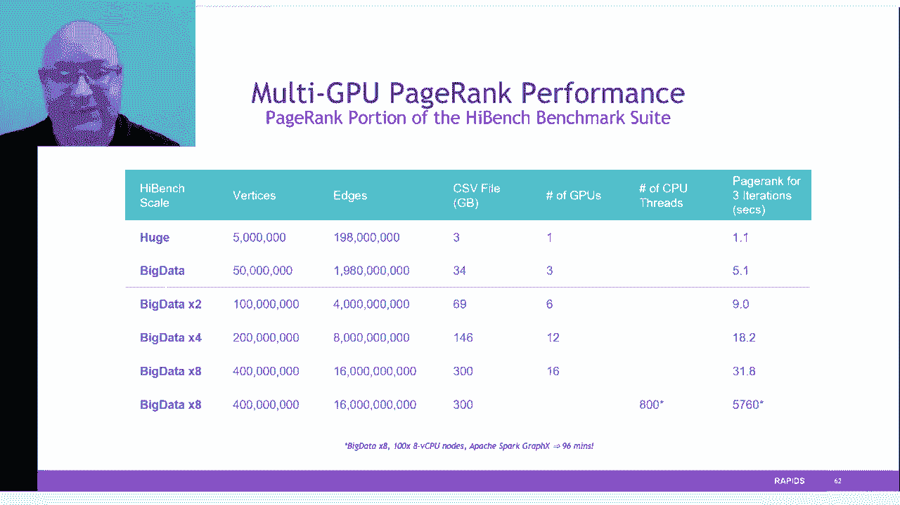

 No， visualization， let's talk about visualization。

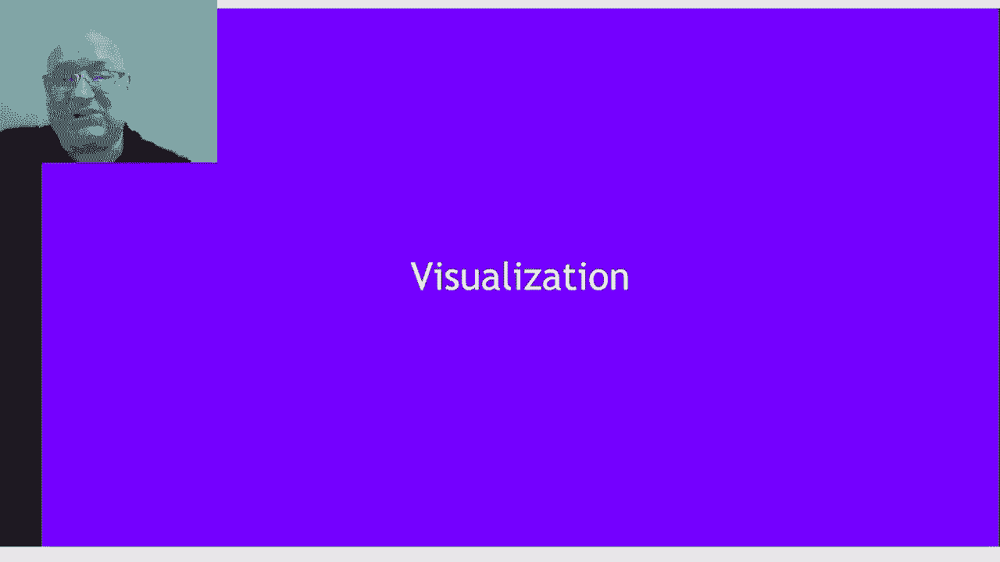

 Oftentimes these datasets are so large， even conceptually getting your head around them is difficult。

 and visualizing them is key to being able， to find the interesting parts hiding in that data。

 So we've had for a while now， CU cross filter， GPU accelerated cross filtering。

 for any data in a data frame。 And this allows you to build up a dashboard， to view your data。

 It's very low overhead， very little line， few lines of code need to be written。

 and you can quickly visualize and understand your datasets。 PyViz。

 PyViz again allows you to bring in large datasets， and quickly render them on the screen。

 so you can look at them and gain insight faster。 We're able to run a 10x faster， 100x faster。

 on these really large datasets， because of the integration with CUDAF。

 and the ability to do zero copy for the visualization。 Plotly dash is another one using bokeh。

 using our connection with rapids。 We're able to show here a really nice demo。

 Every person in the 2010 census is a data point。 So that's 300 million data points。

 and we can visualize them， interact with them， slice and dice， do geo queries， these kind of things。

 all in a really interactive UI。 So here's what we're talking about at the end of the day。

 We want to have rapids at the center， of everything to do with machine learning。

 Rapids connects to the IO， Rapids connects to the visualization， it connects to the analytics。

 it connects to features， it connects to partitioning the data。 It scales up， it scales out。

 We're really trying to have rapids available， to help everyone spend more of their time on their real work。

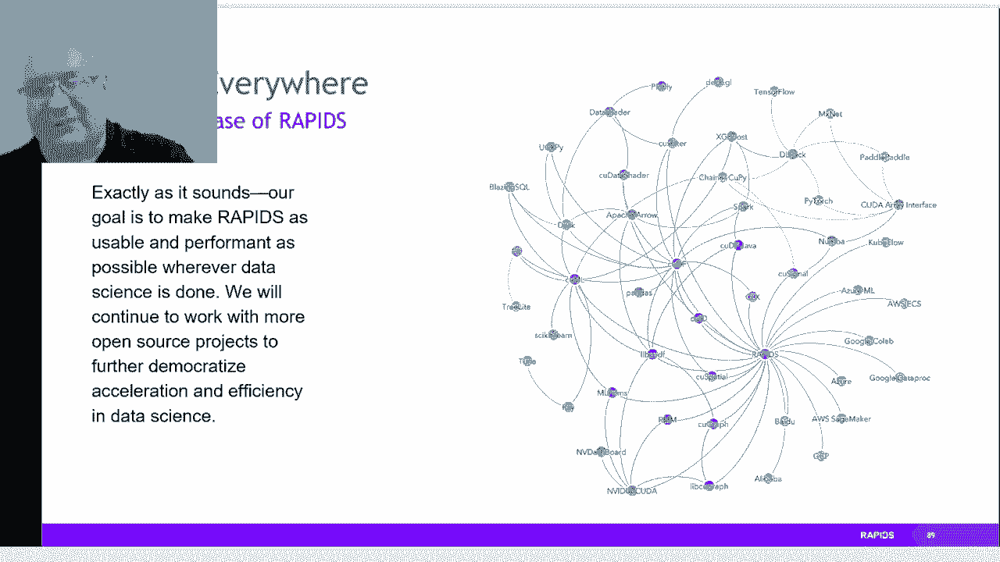

 and less of their time on ETL。 And we're not doing this alone。

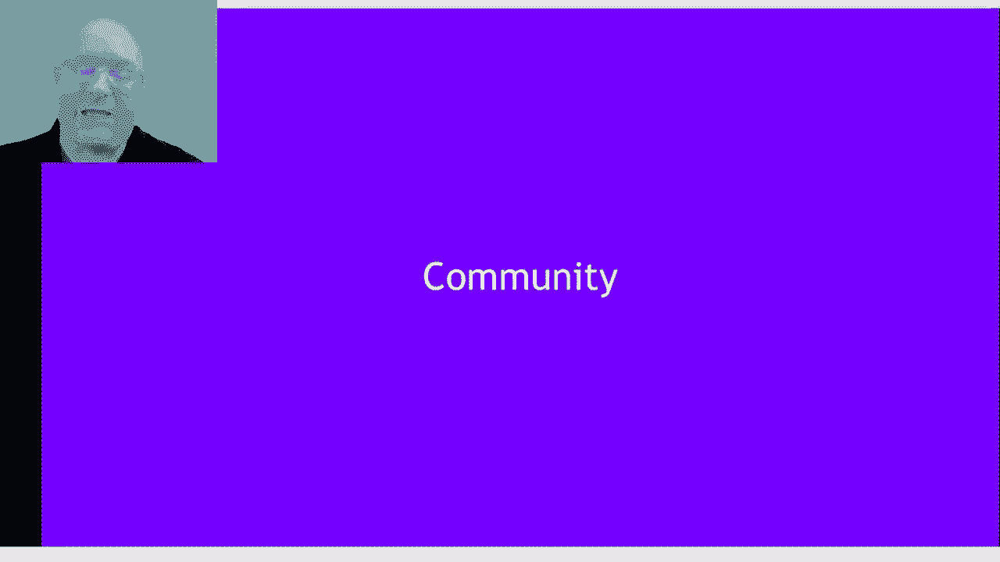

 We've got a nice community working with us， contributing back code。

 keeping this an open source project， keeping this out there for everyone。

 We've got many adopters in industry， using this for their own workflows。

 seeing great value from this open source software， in their day-to-day work。 We've got Blazing SQL。

 This is a GPU accelerated SQL engine， to run SQL queries built on top of QDF。

 So we can run the entire TPCH query set， and it runs out of， for example， Amazon S3 bucket。

 No need to do any special data prep， and you can just load the data as it sits。

 So by now you might want to know how to get started with this。 So there's several ways。

 You can use Docker containers， you can do Conda source downloads， you can use Google Colab。

 We've got a lot of walkthrough videos， blog content。

 We've got a GitHub open for everyone to look at。 You can grab the latest nightly builds from GitHub。

 lots of tutorial notebooks， for examples， of how to use the code。

 an example workflows for end-to-end data analytics， starting from a raw CSV file。

 going all the way to a trained model， and visualizing the results of that model。

 We've got an installation helper。 That's a little interface。

 Let's you click on all the different versions。 You might want to download。

 Find the right one for you。 We've got， I mentioned our GitHub fully open source。

 You can look at all the code。 You can see all the tricks。 It's all right there。

 And docs keep getting better。 I admit we can always do better with documentation。

 but we've got an extensive set of documentation online。 And we're open。

 We can accept Slack requests。 We can accept GitHub issues。 We can accept even full notebooks。

 If you want to contribute back a notebook， that you worked out a new way to do something。

 we will accept contributions from the public。 And we're active on Google Groups on our Slack channel。

 We have a Docker hub site， and Stack Overflow for any questions you might have。

 So these are the main ways of getting the code。 GitHub， a Mconda， the NVIDIA GPU cloud。

 has fully built containers or Docker also。

 we can have a repo directly with Docker。 Thank you very much。

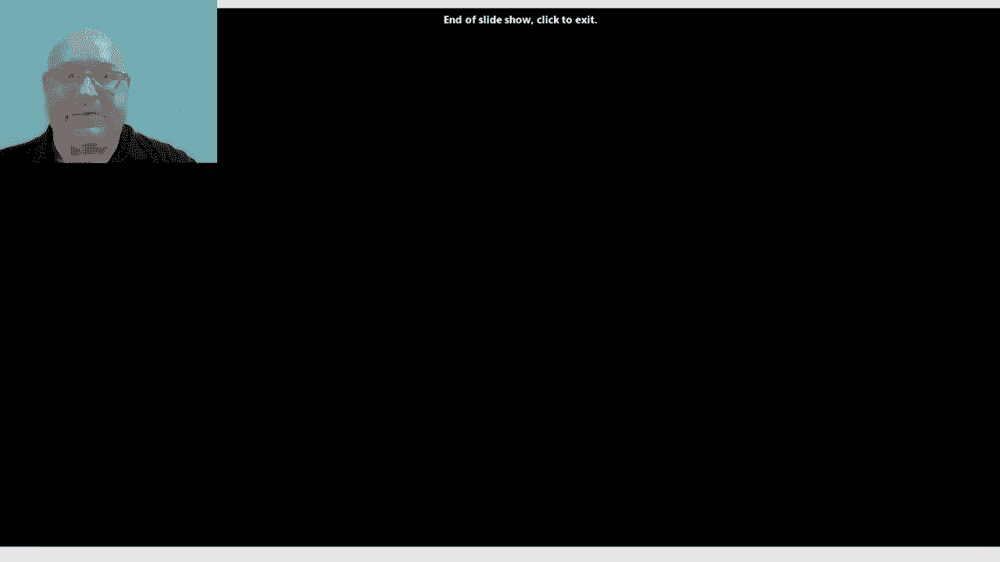

 I hope you enjoy using Rapids and have a good one。 [BLANK_AUDIO]。

