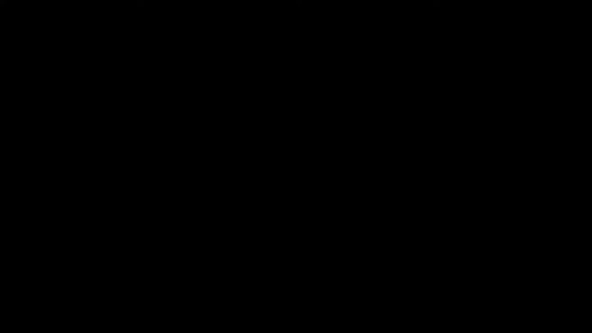
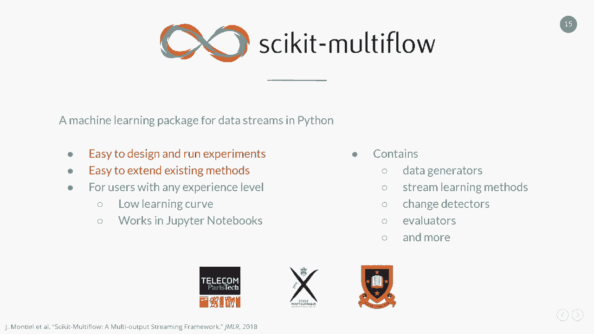
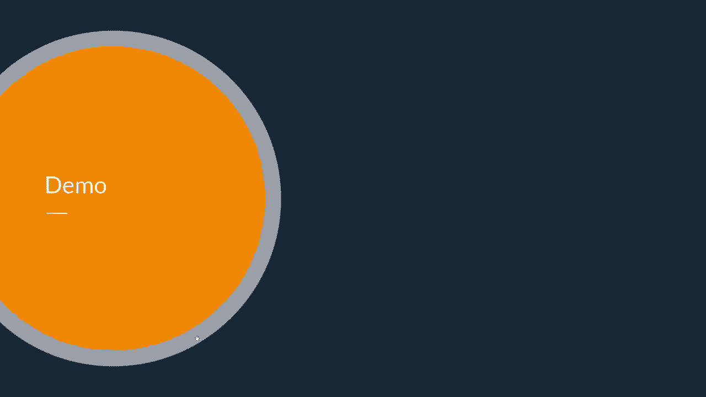
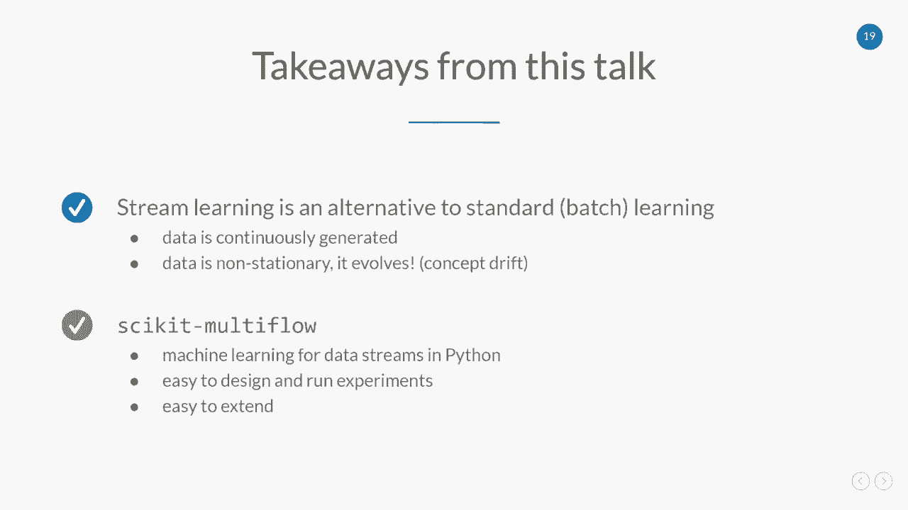

# P6：Learning from Evolving Data Streams ｜ Jacob Montiel - 爱可可-爱生活 - BV1Fv411q7k3

 Welcome to the top learning from evolving data streams。

 My name is Jacob Montiel。 I'm a researcher at the University of Waikato in New Zealand。

 I would like to start with describing， what is the standard machine learning。

 This is basically based on data batches。 And that's why we also know it as batch learning。

 And it's describing these pipelines。 So what we are going to do is that we。

 are going to collect data over time， and it's going to be stored in some device。

 And then we're going to use that data， to train the mathematical model that eventually will be deployed。

 and will be used to get predictions on some unknown new data。

 This approach is the state of VR performance， for multiple applications。 However。

 there are some situations， where this might be challenging to take into real life， applications。

 For example， let's consider if our data is continually， regenerated， meaning that it's not。

 available at once， as it is in many cases， where we have real time data。

 And another challenging situation， can be if data changes over time。 So to exemplify this。

 we have this article， from the MIT technology review related to the supply change。

 And this quote explains what is happening。 So it took less than a week at the end of February。

 for the top 10 Amazon search terms in multiple countries。

 to fill up with products related to COVID-19。 So what happened here is that first。

 data was coming continuously， being generated by the users。

 And data was changing because the consumers changed， their behavior。

 And what we saw is that the automatic systems in supply。

 change were not able to cope with the situation which， resulted in some disruption。

 So this is the kind of situations， that we are interested in dealing with。 For this。

 we have an alternative， which， is known as stream learning。 In stream learning。

 we are going to assume， that data is going to be infinite。 And in this situation。

 we have to maintain models， in an online fashion。 What those study implies is that we。

 have to work with onboarded training sets。 We are going to incorporate data on the fly。

 We have to be resource-wise efficient because we， are talking about infinite amount of data。

 And we need to detect changes and adapt to them。 So when we talk about stream learning。

 we usually work based on these requirements。 First， we are going to process one sample at a time。

 And we are going to inspect it only once。 This is because it's unfeasible to store a large amount of data。

 And maybe you don't need to do it。 Second， you are going to use a limited amount of memory。

 for this impression because all data streams， is going to be infinite。 Next。

 we are going to work in a limited amount of time。 This is because we have to be ready to read as soon。

 as new data is being generated。 Otherwise， we are going to risk to meet some of the data。

 that is coming。 And the fourth requirement is that we are going to be always， ready to predict。

 This is a major difference with respect， to the virtual learning setting。 Where does that come from？

 If we visualize the pipeline of learning from data streams。

 so what happens is that our model is always， going to be ready to get some data from the stream。

 So what happens is that it's going to take labeled data。

 and it's going to use it to train or update itself。 It's internal state。

 And then it's going to ask for more data。 Now， it's going to use some labeled data。

 to get some predictions。 I was going to return those predictions。

 And then it's going to get back to this state where， is basically observing more information。

 So remember， we have to work with one sample of the time。 There are limited resources。

 And we want to predict it anytime。 So to just exemplify how we do this， I want to take this example。

 The decision tree classifier， which， is a very popular batch method， which。

 has a very good performance。 And the next thing is that it has interpretability。 So in this case。

 I'm showing decision， three for deciding if you want to buy a new scar。

 So what happens is that there are some features， or some attributes that are important for this decision。

 And let's say that the first one is that for mostly users。

 they want to decide if they can do a test drive。 If they cannot do it， then they are going to skip。

 or they are not going to buy that car。 If they can， maybe they are not going。

 to decide if they based on the manage or also in the gears。 So what we see is that we're going。

 to have a displayed notes or internal notes on features。 And then in the leaves。

 I'm going to take the decision。 Now， in this scenario， the construction of the tree。

 is using recursive induction。 So what happens is that we are going to take all the data。

 And we are going to filter the data in the structure of the tree。

 We are going to decide what is the most important attribute。 We're going to create the splits。

 And we are going to create this tree。 Now， the limitation on this is that--。

 or the trick is that we have to see all the data。 And for doing that in stream learning。

 it's not possible。 We don't have all the data。 We only have one sample at a time。

 So how would we deal with that？ There is the alternative， which is called the very fast decision。

 tree and also known as the holding tree。 And the idea behind this is that we。

 want to incrementally expand or split the nodes。 And this is basically-- we are going to start with a root node。

 And we are going to start collecting some data here。 And at some given time， we are going。

 to break it and split it。 So we are going to have now to leave nodes and one split node。

 And what was of service that for doing this， we only need a small sample of data。

 And we only need to see all of the information。 And the trick of this is that we。

 have to choose when I have seen enough information。

 or when I have seen enough data to make the right decision， on this split。 And for that。

 it was found that the holding bound， would let us do the correct sample size for doing that。

 So what is happening is basically that the holding bound。

 is going to let us know when we should do the expansion。

 It is going to let us give us some theoretical guarantees。

 that now have seen enough data and I can do the split。 So this split is going to keep going。

 So having us observing more data， I'm just going to keep creating to tree。

 And then this is going to be happening incrementally， as I'm seeing more samples。 Now。

 this is a popular string method， that keeps some of the characteristics of the batch version。

 which is it has low variance， it has low overfitting。

 And the next thing is that it's asymptotically close， to the batch model。

 If the number of data is large enough， then the model is going to be very close。

 which is the case for the string learning， that we are going to see large amounts of data。

 The other thing that is challenging， is we were talking about changes in data。

 So in dynamic and understanding our environment， the data distributions can change over time。

 So we have something called change detection。 And the goal is that we want to raise an alarm。

 if there is going to be a distribution change。 One of the applications for this kind of drift detection。

 is to detect changes in model performance。 Here I'm showing some of the most common。

 trees that we see in applications。 First， we have some abrupt change。

 So basically we are changing from one concept to the other。 Incrementally。

 when we have some intermediary concepts， while we transition from one concept to the other。

 then we have gradual change where the two concepts。

 are going to be interacting during some transition part。

 Recurring when we are changing from one concept， and back。

 And what is important here is that in change detection， we are also going to be trying to avoid。

 marking outliers as change。 One popular method for doing this change detection， is called adding。

 which stands for adaptive windowing。 And what it's doing is that it's。

 going to keep an adaptive window with two subwindals。 So what adding is doing is that it's。

 going to keep two subwindals。 It's going to decide based on the data that it has observed。

 Where is the point that is going to keep the average of the two， subwindals similar？

 And what happens is that as we observe more data， it's going to happen that at some point。

 the averages are going to be different。 And if that happens， that means that the distribution is。

 changing， and then it's going to raise an alarm。 Now。

 the next thing about this is that this adaptive process。

 is also maintaining the subwindals in an online manner。

 So it provides logarithmic memory and update times。

 So this is very useful for stream learning applications。

 because it's basically keeping the amount of memory。

 used for monitoring the stream under some constant memory。 At the processing time。

 it's also sublinear。 So in this example， I'm showing why we want to use， in some case， scenarios。

 stream learning methods。 In this case， this is a synthetic data set， with three abrupt drifts。

 And I'm comparing two popular algorithms。 At the top， it's a batch model， which is XGBoost。

 which is an ensemble method that is a collection of trees。

 And in the bottom is the stream learning method， called adaptive random forest， which。

 is a stream learning version of random forest， which， is also an ensemble method for trees。

 And what happened here is that， in the case of the batch， model。

 this was trained on some data beforehand， to just be employed in this stream。

 So what happens here is that we see that， OK， the concept is the same to what I've seen to train。

 and XGBoost is doing fine。 But then what happens is that after the first week happens。

 the performance drops。 Because the model that was trained， doesn't recognize this data。

 so it starts to fade。 Then we see another drift。 And actually。

 it goes up because maybe this concept， this new concept， it's kind of similar to what it was before。

 And then it kind of improves。 But then we see another drift。 And this new drift or this new concept。

 is not as close as the previous one。 So we see that performance is not as good as it could be。

 On the other hand， we see this three model that at the beginning， we see that it starts learning。

 And then it keeps a good performance， then it sees the first drift。 It drops。

 but it recovers quickly。 That's still the most important thing。

 that we can recover quickly and get good performance again。 Another drift happens。

 and we see the same thing， or the same behavior。 So in this case。

 the adaptability and the reaction time， are very important。

 And what is usually the case in some deploy models。

 in the batch learning model is that when they see a drift， or there is a drop-off performance。

 this is basically where people start panicking， and people start trying to see what's happening with the model。

 We have to trigger again a batch learning pipeline。

 And it gets additional steps to make these batch models work。

 In the context of changes of data distribution。 Now， I have been talking about evaluating models。

 And this is an important thing， because also in this scenario， of stream learning。

 there are some considerations， that we need to take into account。

 So for doing evaluation of stream learning methods， we have two main approaches。

 One is the hold-out approach that is similar to the case， of the one in batch learning。

 And we are going to keep an independent test set。 And we are going to store some of the data from the stream。

 there， and we are going to use that test set to test， or model set some intervals。

 On the other hand， a very popular approach in stream learning， is the prequatient evaluation。

 also known as test and train， because here it's the border matter。

 So the next thing about the prequatiential， is that we are going to use all of the data from the stream。

 Why I say this， the order matter is， because we are going to take one sample。

 we are going to use it for testing， and then we are going to use it for training。 And again。

 the next thing about this， is that we are going to use all of the data from the stream。

 And another important thing is how can I do this？ And for that。

 let me introduce you to scikit multiflow， machine learning package for data streams in Python。

 The objective of scikit multiflow， is that it is easy to design Android experiments。

 and it is easy to extend existing methods。 scikit multiflow is designed for users。

 with an experienced level。 It has a low learning curve and works with Jupyter Notebooks。

 The current state contains multiple features， such as data generators， stream learning methods。

 change detector， evaluators， and more。

 And now I would like to give a short demo。

 on how you can use scikit multiflow。 We're going to run a classification task。

 We're going to show how to implement， the prequatient evaluation， and then we。

 are going to show how you can use， to evaluate prequatiential class in scikit multiflow。

 The second part is about concept drift detection， with the detection test， and then we。

 are going to evaluate predictive performance， when there is drift into data。 So for the first part。

 we are going， to run a classification task。 Here I'm going to use a stream， the C generator。

 This is a generator that is going to be creating data， on the goal。

 And then we are going to use as a classifier， to enable base classifier。

 For the prequatient evaluation， it's actually very easy， to implement as a loop。 In this case。

 we see that the prequatient evaluation， is going to first work until I have reached the max number。

 of samples。 In this case， I'm setting it to 2，000。

 And the other condition is that there will be data in the stream。 So in this loop。

 what we are going to do first， is we are going to query the stream for data。 By default。

 we are going to get one sample， and then we're going to store features and target， for that sample。

 Next， we are going to predict。 Remember， the prequatient evaluation， first， we are going to test。

 So we are going to predict on these features， and we're going to get some prediction。

 or some class predicted by this classifier。 In this case， I'm just going to check for accuracy。

 So I'm going to compare what I predicted， or what the model predicted versus what。

 is the correct answer from the stream。 And then we are going to proceed to incrementally。

 training the model with the new data。 So in this case， we are going to call partial feed。

 and I'm going to pass the features and the class target。 And we are going to keep going this。

 until we have reached the conditions marked by our loop。 If we're going to， we see that the 2。

000 samples were processed， and the accuracy is above 93%。 And the important thing here to remember。

 is that we are training and testing on one sample at a time。 Now， for making our life easier。

 psychic multi-flow implements the prequatient evaluation。

 in a class that also has some additional functionality。 For this example。

 I'm going to train two models。 I'm going to use the naive base and the SBM from psychic learn。

 This is just to show that we have compatibility， with incremental models on psychic learn。

 But it's important to mention that second learn is focused。

 on batch learning and it only has some limited number， of incremental methods。 In this case。

 then I'm going to set up my two estimators， and again， the same strip。

 And I'm going to set up my evaluation。 And here I'm going to ask for a plot。

 just defining the number of samples that I want to use。

 And the metrics that I'm interested in monitoring。 In this case， it's accuracy， the capacity sticks。

 running time and model size。 And if I try to evaluation， then I'm， going to get a dynamic plot。

 What we are seeing here is the evaluation over time。 We see that SBM starts performing a little bit。

 lower than the naive base。 But then it performs better in the last part of the stream。

 And it provides a better performance on the long run。

 We see here that we are also getting the training time， prediction time， the memory of those models。

 And we are evaluating for the current state， meaning this is the evaluation on the last N samples。

 that are in a sliding window。 And the mean performance is basically。

 the performance over all of the stream。 Second multiplier is also going to give you a summary。

 at the end of the evaluation with all that information。 In the second part。

 we're going to check a test on concept， truth。 So for this， we are going to generate synthetic data。

 that is going to be composed by three， different distributions。

 So here we can see that in the first 1，000 samples， we have a distribution。

 Then we have another distribution。 And the last part of the last 1，000 sample。

 is the other distribution that we are going to use。 So for this test， what we are going to do。

 is that we are going to use addling to detect changes。 And what we want to see is changes here in 1。

000 sample， and after 2，000 samples。 So for this， if I initialize addling， we can run this in a loop。

 So here is a for loop where we are， going to pass one single sample from the stream。

 We are going to pass it to addling。 And after we pass one sample， we are going to query addling。

 to see if it has--， a trick has happened。 It's important to see that we don't have。

 visibility of all the data。 Addling only sees the current sample that is being passed。

 at the given moment。 So if we run it， then addling is saying that there was a change。

 after sample 1，000， and there was another change， after sample 2，000。 Now。

 this is important because in many applications， trees can impact the predictive performance of our methods。

 So for showing this， I'm going to run a comparison， between stream learning methods。

 One is the hopdyn tree， and the other one， is the hopdyn adaptive tree， which。

 is an improvement over the original hopdyn tree。 And it uses addling at the nodes to detect changes。

 If it sees that there is a node that this behavior is changing， or performance is changing。

 then what it does， is creates an alternate branch。 And eventually。

 it will be replacing the original branch， if it performs better。 For this is in test。

 I'm going to load a stream from a file， just for experimentation。

 And this data is from the gravel generator。 It has three gravel drifts at 5，000， 10，000， and 50。

000 samples。 This is just also to show that you， can load data from CSV files in second-。

 is to benchmark these two methods。 And then， you can see that the hopdyn tree is not changing。

 And then， you can see that the hopdyn tree is changing。 And then。

 you can see that the hopdyn tree is changing。 And then。

 you can see that the hopdyn tree is changing。 So it's faster， and that in the overall performance。

 leads to better numbers， which is what we want to see。

 And we want to keep this performance as high as possible。

 Also interesting to see is that the memory of the hopdyn， tree is smaller。

 This is showing that the model is actually， changing internally。 So when it's detecting changes。

 it's， changing the structure of the tree internally。 It's replacing the branches。 And that's why。

 in the end， we have a better performing， method that is also smaller in memory。

 Second Multiflow is an open source project， and it's available in GitHub。

 It's also being distributed by other means， such as PIP， and Conda。

 There is also a Docker image that you can use。 Second Multiflow works on Linux， Mac OS， and Windows。

 Also， it's an open source project。 We are always welcoming contributions。 If you are interested。

 you can look into the repository in， GitHub， and also you can reach us in our GitHub channel。

 We have a pool of projects in different areas， but are also。

 open to hear your own project and ideas to see how we can， collaborate。

 There are two main takeaways from this talk。 First。

 stream learning is an alternative to standard batch， learning。

 especially if data is continuously being generated， and if data is non-stationary。 So it evolves。

 Remember， concept drift。 The second is second Multiflow， a machine learning for data。

 streams in Python。 The two nice features about scikim multiflow is that it's。

 easy to design and run experiments， and it's also， easy to extend。

 I would like to thank you for attending this talk。 And also。

 I would like to thank the organizers of the， conference and all the non-immersion viewers that。

 participated。 [BLANK_AUDIO]。