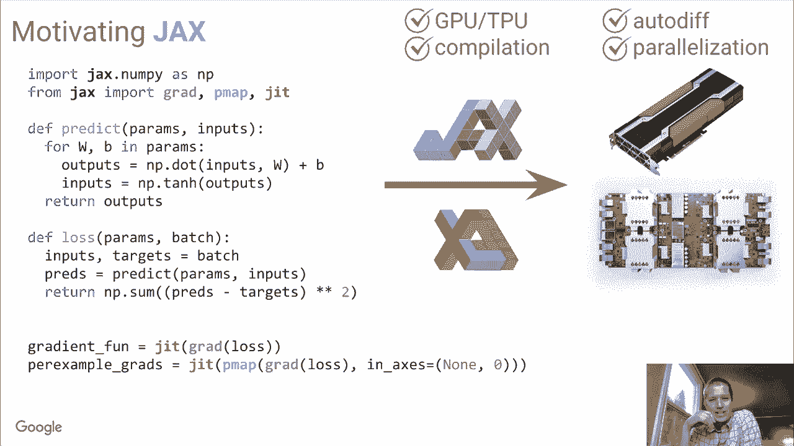
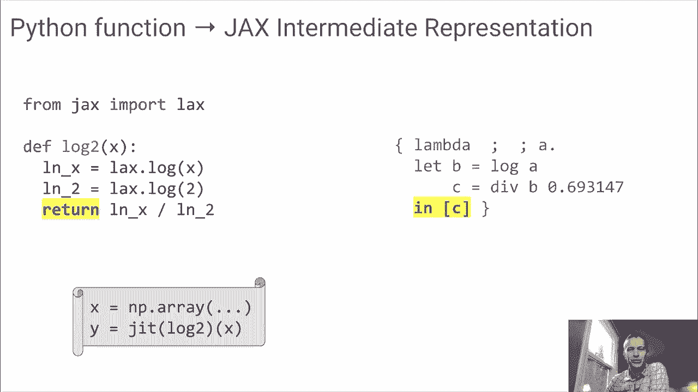
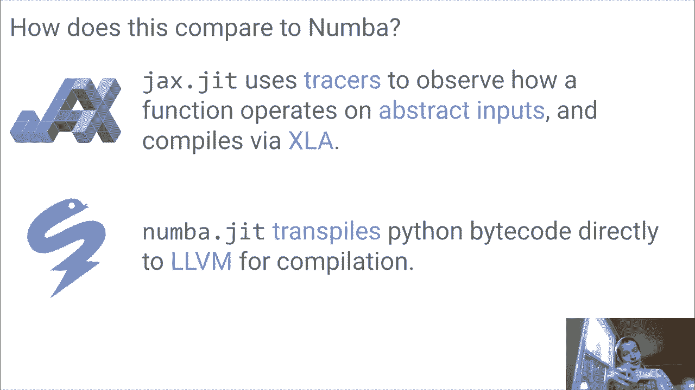

# SciPy 2020 (机器学习主题) - P5：JAX- Accelerated Machine Learning Research  ｜ VanderPlas - 爱可可-爱生活 - BV1Fv411q7k3

 Hi everyone， my name is Jake Vanderpluss。 I'm here to talk a little bit about the Jax project today。

 So what is Jax？ Jax is a project out of Google Research。

 And what it provides is a tool for accelerated machine。

 learning research should be a composable function， transformations in Python。

 So let me talk a little bit about what that is。

 and why you might want to use it。 So as a motivation for Jax， just imagine now。

 that you want to implement a deep neural network from scratch， in Python。

 Now there are a lot of tools out there， that let you-- that are purpose-built for neural networks。

 But if you want to implement one from scratch in a way that's， performant and scalable。

 it's a little bit difficult。 I mean， you can imagine using NumPy。

 to implement the core of what a neural network does。 So for example。

 here's a simple fully connected neural network。 And this is the prediction function you might use。

 There's a list of parameters that consists of a matrix， and an offset。

 You apply those matrix multiplications to your inputs。

 You do some sort of activation function like a tanh， and then return the results。

 And now this is the model。 We need some loss function in order to optimize it。

 So the loss function might look like this， where you apply the prediction to some inputs。

 and then compare the result of that prediction， to some target values。

 And you get a loss function that you minimize in order， to find the best model for your data。

 Now this right here is deep learning。 This is what deep learning is， except that to really go deep。

 to really scale this to lots of data， and to very large models， you need。

 to be a lot more efficient than what you can do with just， NumPy by itself。

 So what are some things that are missing here？ So often deep learning。

 in order to get this sort of performance， you need to do it well。

 You need to run on accelerated hardware like GPU and TPU。 That's difficult with stock NumPy。

 Another thing is for this optimization steps， since there's often a large number of parameters。

 we need some sort of automatic differentiation， in order to do the conjugate gradient descent。

 or whatever solder you're using to optimize loss function。 And that's difficult with NumPy as well。

 Another piece of this is compilation or fusing of operations。 For example。

 with NumPy doing the sum of the square， differences between predictions and targets。

 NumPy creates an array of the differences， creates another array of the square differences。

 and then finally evaluates the sum。 And it would be nice if we could put all of that。

 into kind of fuse that together into one operation。

 rather than having to instantiate all those intermediate arrays。 And finally。

 the last thing that would be nice to do， is to be able to parallelize this kind of distributing data。

 among different nodes using multiple compute nodes， to compute these things。 Now。

 this is where Jax comes in。 So the idea with Jax is that it gives you a NumPy-like API。

 that has all these added bells and whistles， that you need in order to do deep learning at scale。

 So the difference is that we switch from important NumPy， as NP to import Jax。Numpy as NP。 Now。

 this Jax。Numpy is not NumPy， but it's an API that provides the same set of abstractions， as NumPy。

 And now what happens if we run this， what Jax can do， is it can take this code， compile it down。

 to what's called XLA， which is the accelerated linear algebra。

 library that underlies some of what TensorFlow does， and run it on chips like GPUs and TPUs。

 So just by importing Jax。Numpy rather than NumPy， we get this first step of being able to run on accelerated。

 hardware。 But there's more。 No。 Next thing we can do is we can use some of these higher level。

 functions within Jax to do things like automatic differentiation。

 So here we've computed using the grad function in Jax。

 We've computed a new function that evaluates the gradient， of this loss function。

 And this is kind of magic， but the way it does this。

 is essentially Jax knows what's going on in all， of these operations in the loss function and predict function。

 and knows how to analytically compute the gradient of that。

 We can also do things like vectorization。 So if we want to map this gradient function across a number。

 of inputs， the V map will do that。 And then we can do compilation。

 We can use this JIT compilation function， which takes an input。

 and returns a function that wraps compiled XLA code。

 So what the compilation does is it takes these sorts of operations。

 like the square difference-- some of the square， differences of predictions and targets。

 and fuses them together so that they happen all at once。

 And if you want to parallelize this across multiple chips， changing this V map into a P map。

 allows you to map across parallel architecture， and to use distributed data and distributed computation。

 So effectively， what Jax is is you， can think of it as an extensible system for composable function。

 transformations of Python and NumPy code。 So you write your code that looks like NumPy。

 You add some of these higher level functions， that compile or compute gradients and things like this。

 And through that， you can create highly efficient programs。

 without-- from these composable building blocks， without having to rely on purpose-built systems。

 to get efficient computation。 So let's take a look at a demo and see some of this in action。

 So if you're used to using the NumPy library， you can do things like import NumPy as NP。

 and create a random array， for example， random。ran's 2000， 2000。 And then if you print the result。

 you， see that this is a representation of a 2000 by 2000， dense array in Python。

 And NumPy is nice because it provides you， all sorts of things you can do。

 You can do things like element-wise operations on your arrays。

 You can do more complicated operations， like signs and cosines and a number more。

 You can do things like broadcasted operations， where you do--， here。

 I'm taking the column-wise mean of the data， and subtracting that from each row。

 And you can do things like linear algebra。 So if I do dot x comma x， this is the matrix-wise--。

 matrix product of the matrix x with itself。 So this lets you do NumPy is really powerful。

 It lets you compose all these basic operations together。

 to create some really sophisticated operations in the end。

 It turns out Jax can basically do this same kind of thing。 So instead of importing NumPy as NP。

 I'm going to import Jax。 NumPy as JNP， just to distinguish it from the normal NumPy。

 And if we want to create a Jax array， we can-- one way to do this is just。

 to take-- to say array of x。 And this creates what's known as a device array。

 So what this is doing right here， we're running on a Colab GPU instance。

 And this device array took this 2000 by 2000 array， from the CPU memory that NumPy uses。

 and placed it in the GPU memory， where it can be operated on， by the GPU。

 And just like what we did with NumPy above， we can do all the same kinds of things with Jax。

 If we do 2 times y， it computes the element-wise double。

 of all the values and computes it on the GPU。 So we can do things like JNP。sign of y。

 and we get the sign computed on the GPU。 We can ask for individual elements of the array。

 and we can get those out。 We can do things like y minus the column-wise mean。

 and get broadcasted operations out as well。 And of course。

 just as we can do the dot product of the NumPy， arrays。

 we can do the dot product of the 2 Jax arrays。 Now， the cool thing is all of these operations that。

 are being expressed in the normal way， that you're familiar with in NumPy， are happening on the GPU。

 They're being computed on the GPU。 So if you do something like time at np。x， x， and compare。

 that to the time it of np。y， comma y， this top one is being computed in NumPy。

 This bottom one is being computed in Jax。 We run these。

 and we'll see that because the Jax operations， are being done on the GPU， they're。

 about 100 times faster， even than this optimized NumPy code。

 So this means that without much extra work， you can run really fast numerical operations on a GPU。

 without really changing your code。 And so this is one of the powerful things that Jax offers。

 So let's take a look at the next thing。 Another thing that Jax offers is just in time compilation。

 So let's take a look at what this is。 So just in time compilation is a way。

 to take code that you've written that looks like Jax NumPy code。

 and turn it into even more efficient kind of fused code， on the GPU。

 So let's look at what this looks like。 If we do something like def f of x and do a loop of 10。

 iterations and do some operation to it。 So this is maybe a little bit silly， but x equals 0。

1 times x。 x minus equals 0。1 times x。 This is a little bit silly。

 You could do this more efficiently。 But just to see what's going on here， let's take a look at this。

 So if we compute f of x， of course， Jax will-- or NumPy will evaluate that function。

 If we do f of y， then Jax will evaluate this function， and we get out the device array。

 But the problem is that all of these operations， are done kind of in sequence。

 You instantiate an array， subtract a bit from it， instantiate another array， subtract a bit from it。

 And so if you look at how much time it takes to do f of y。

 all of these operations are being done in sequence， and it's relatively slow。

 So what Jax provides for this is known as the JIT operator。 So if we do from Jax important J。

 JIT stands for just in time compilation。 Now we can do G equals JIT of f。 And what is this doing？

 This JIT operation is evaluating the code in here， and returning a compiled version of it。

 so that if we do G of y， we see that it returns the same result， same result as f of y。

 But if we do now time it of G of y， we can see that this is going to be quite a bit faster。

 Rather than 6。9 milliseconds， we're down to 282 microseconds。

 So we've gotten a factor of 10 or 15 out， of just running this code through the JIT。

 So this is pretty amazing because what it allows you to do。

 is to express your functions in terms of these NumPy。

 primitives and not even have to think about memory management。

 and order of operations and infusing operations， and things like this。

 You can-- all you have to do is write out the code that makes， sense。 And then Jax， the JIT。

 will take care， of taking those operations and making them efficient。

 by fusing them together and compiling them。 So this is quite cool。

 And we'll talk a little bit later about some of the caveats。

 to JIT and what it's actually doing under the hood。 OK。

 another thing that we can take a look at here， is automatic differentiation。

 So what is automatic differentiation？ So imagine you had a function like def f of x。

 Return x times j and p dot sine x。 So this is just a function that's。

 composed of operations that you can express within NumPy。 And if you were optimizing this function。

 in kind of a deep learning context， one of the ways that deep learning models can be optimized。

 quickly is via computing gradients。 So we can do f of 4 right here。

 And if you're-- if you've taken calculus recently， you could probably look at this and realize。

 that you can write the gradient of f right here just based， on the math。 So it's the chain rule。

 right？ So dx times sine x， which is turn j and p dot sine x plus x， times d sine x。

 so j and p dot sine x。 So this is like a little gradient function of x。

 And we can evaluate it there and get out the answer。 Now this is useful， but in general。

 with machine learning models and deep learning models， things aren't quite this clean and things。

 are a lot more complicated。 So having to write this out by hand every time。

 would not be very useful in practice。 So jax provides this grad object。

 And now let's do grad f from jax equals grad of f。 So what this does is it takes a function f。

 and returns a function that computes the gradients。 And just to prove to you that's what it's doing。

 Let's see grad f jax of 4。 Oops， it requires real value。 You can't take the gradient of an integer。

 so we're going to do a real valued input。 And we see that we get the same result。

 as this by hand gradient right here。 So this is very powerful because you。

 don't have to do the gradients by hand anymore。 And jax is not doing finite difference methods or anything。

 like that。 It's actually doing an analytic gradient solve under the hood。

 And it does this by looking at the function， and looking at the operations that the function is composed of。

 and essentially applying the chain rule， just like we did above， but doing this automatically。

 So it means that when you have a neural network prediction， and loss function。

 you can take the gradient， of that whole thing and very quickly， in that way。

 very quickly optimize the cost of these sorts of models。

 So the last transformation I want to tell you about， is what's known as vectorization。

 So let's write that here。 Vectorization。 So what is vectorization？

 Now imagine that you've created a function that， operates on a vector。

 I'm going to write a definite square of x return， chain p dot sum x squared。

 So this takes a vector x and returns the sum of squares， of the result。

 So if you want to apply this to an individual vector。

 you can do this square of chain p dot a range 10。 So this has taken the sum of all the squares of this vector。

 But what if you wanted to apply this over and over， to a sequence of vectors？ In Python。

 we can do this with a list comprehension。 So if we have， say， like x equals j and p dot a range 100。

 dot reshape 10， 10。 We could do something like square of xi for x， xi， and x。

 Or we might be able to call this a row， square of the row， for row and x just to be。

 And this is a nice NumPy way to do this sort of mapping， vectorization of things。

 But this is relatively inefficient， because it's taking an individual row。

 it's performing this operation， and then it's， returning the results。

 and then appending this together， in a list。 We can imagine that this operation could be done much more。

 efficiently as the compiler knew about the operation。

 and could kind of batch things together and do it once。 And this is where the vmap comes in。

 So if I do from jax and port vmap， the map square we could say is a--。

 let's just call it vmap of square。 So this is a function。

 vmap like grad and jit is an operator that， takes a function and returns a function。

 And now we can do something like map square of and just， pass in this x value。

 And we get all those values together in the row。 Now this might seem a little bit trivial。

 because we can do the same thing in Python。 But this is really sophisticated under the hood。

 actually。 It's looking at this operation and it's creating compiled code。

 that instead of doing 10 function calls in order， to compute all of these values。

 is doing essentially， a single batch function call。

 So it can happen much more quickly without any data， round tripping between the user and the GPU。

 And what this means is that you can take code， that you've written to work on the single input。

 and very quickly turn it into code that， works on multiple inputs without having。

 to do much extra work。 So these are some of the vmap， grad， and jit。

 These are some of the functions that Jax provides。

 that let you do some pretty amazing things with the library。 And now。

 so this kind of concludes the demo， and I'm going to bring us back to the presentation。

 So lastly here， let's talk a little bit about how Jax works。 How is this J compilation happening。

 when you pass an arbitrary function to it？ It's a little bit different than other JIP libraries out there。

 We can think about it by looking at this function， and saying， what does this function do？

 And you might say that this adds 2 to x。 And you'd be wrong， because in Python。

 functions variables can literally be anything。 Now， this might be an espresso delegator object。

 that when you add 2， it overloads it， to SSH or espresso machine and poor you two shots。

 So we can make a little progress by defining， what the type of the variable is。 But in general。

 a function like this， can take anything as its argument， and that argument can do anything。

 And Jax actually takes advantage of this fact， in figuring out what the function does in order。

 to compile it。 What Jax does is it passes an abstract value。

 that is not an array itself but knows how an array acts， under certain operations。

 And it uses that array to characterize what the function does。

 and get a list of operations that can then send to XLA， to compile。

 So let's take an example of this。 We have a function log2 that is built in terms。

 of these lax primitives that Jax knows how to transform。

 And we pass to it a tracer that represents an array。 And the first thing that it does is。

 computes the log of this tracer。 And that tracer， instead of actually computing any value。

 just records that a logarithm was computed of that value。 And then we take the log of 2。

 And this is interesting because it doesn't actually， have any data dependence。

 So what happens is the log of 2 is just output。 And then in this last operation， we。

 divide the data by this computed log of 2 value， and return the result。

 And this is a compact expression， a Jax intermediate。

 representation of what this function actually does。

 And notice we haven't actually done any compilation， of the byte code。

 Literally all we've done is passed in a value， and observed the transformations that the function does to it。

 This is how Jax is able to compile a black box function， like anything that you write。

 So if we compare this to other systems， this is a common question。

 What's the difference between Jax's dot JIT and number， got JIT？ Does Jax replace number？

 And the answer is no。 Jax is doing something much less sophisticated than number。

 It's using these tracers to observe， how a function operates on abstract inputs。

 And then to compile those operations， that it knows about into XLA。

 Number on the other hand is actually， transpiling Python byte code directly to LLVM。

 And so it's doing a lot more than Jax does。 Anyway。

 we think that this-- even though this JIT compilation， has a limited scope， it's really。

 really useful。

 And it's been gratifying to see all sorts of different research。

 projects starting to use Jax and to use， the primitive and composable operations that Jax provides。

 to implement some really interesting stuff， from molecular dynamics to robotic control。

 of physics simulations。 So I encourage you to please check this out。 Jax is on GitHub。

 You can pip install it。 And you can use it today to drive your scientific research， in Python。

 Thanks so much。 [BLANK_AUDIO]。