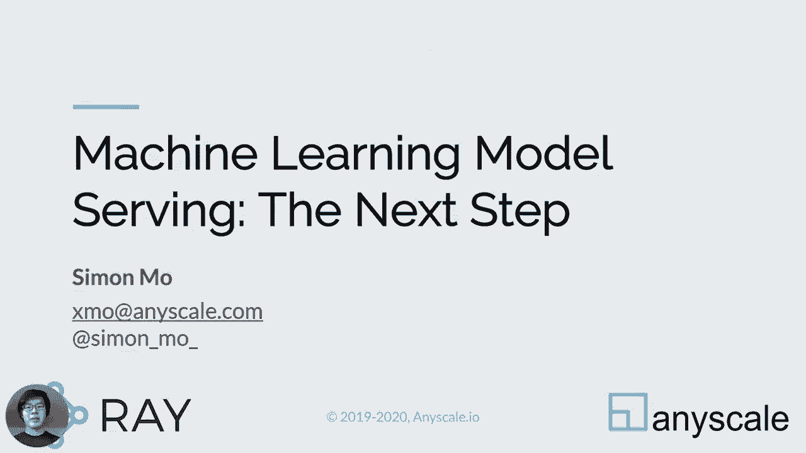
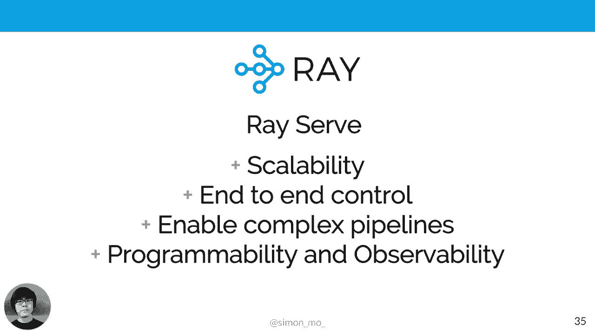
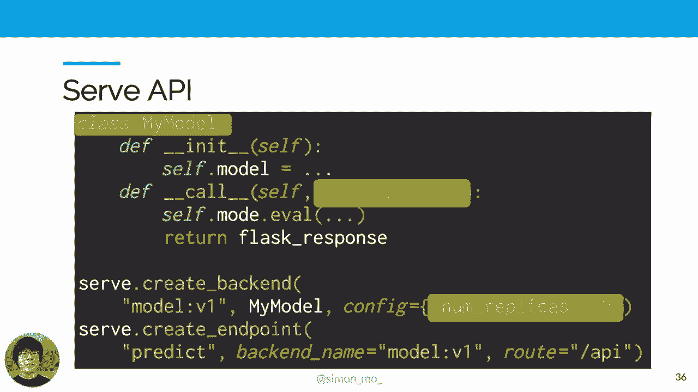

# SciPy 2020 (机器学习主题) - P7：Machine Learning Model Serving- The Next Step ｜ Simon Mo - 爱可可-爱生活 - BV1Fv411q7k3

 Hello， I'm ZaiPai 2020。 I'm Simon， and today I'll talk about machine learning model serving。

 I'll give you an overview of what serving machine learning models are being and why。

 it requires you。 After this talk， I hope you can take away with some understanding of the。

 model serving landscape， nerd and comer approaches and people， and nerd about a new library I've。

 been developing to overcome the common pain points。 So who am I？ I'm a software engineer。

 working at an early stage startup called Enesco， and Enesco is a company behind REI。

 which is a fast and simple framework for building and running distributed applications。 At Enesco。

 we'll work on to make it possible to program your cluster as easy as your laptop。 I actively。

 contribute to several open source software around machine learning， distributed data processing。

 and model serving in PISOC。 Let's start with what is model serving or model inference or some。

 people call it prediction serving。 In particular， where does it fit into the machine learning。

 life cycle？ To build and deploy machine learning power applications， we roughly has these three。

 major steps。 You first develop the model， and then you train the model， and you perform inference。

 on the model。 Model development is where we collect the data， analyze the data， and iteratively。

 improve the model。 Once we have the model， it is pushed into a training pipeline that。

 learns from live production data。 And what happens then， after we have several hundred。

 trend or even valid models， these models need to be put inside a prediction service suitable。

 for any user application。 And the last stage， the inference stage is what we care about when。

 we're talking about serving machine learning model and deploy to production。 So this talk。

 will be structured as follows。 I'll first discuss some requirement for model serving to get some。

 overview of what a typical model serving will play with site。 And then I'll talk about two。

 common approaches for model serving。 These two common approaches roughly covers always a。

 current model serving solution out there。 And lastly， I'll introduce ReServe， which is。

 a framework built on top of distributed runtime array and make it easy for serving machine。

 learning model， scouting into many machines while delivering end to end control over the。

 production。 Let's start with the requirements。 And what are some basic requirements for model。

 service？ So I list this seven of them， and there are definitely more。 Well， so let's start。

 with the basic one。 Well， first of all， in each of the deliver collections， given an。

 input right here， we have a cat， and you should run through the machine learning model， I'll。

 put the prediction， it's a cat。 But in many cases， we have more than just one type of model。

 There is a need to multiplex different models， regardless of different versions， different。

 algorithms， or even different model architecture， it is more than practical to use different。

 models for the even the same problem。 Different frameworks each have the current accounts and。

 specialties to solve a real world problem， we just need to grab the best tools available， answer。

 and then model servers should take care of multiplexing among different models。

 Another key characteristic of the machine learning models is that they're quite slow and resource。

 intensive。 We don't want the user to wait for the request to pile up。 What can we do？

 Most servers should be able to transparently scale the model to multiple replicas and know。

 about its amount， so requests can be paralyzed。 Despite being resource intensive and often， slow。

 machine learning models can actually utilize hardware parallelism like vectorizing， instruction。

 multi-strading， or multi-strading to efficiently perform inference on batch of， images。 Many times。

 performing inference on batch of， say， four images only come with， a very small。

 negligible cost compared to， say， just performing a batch of one image。

 Batching is a very simple technique to improve your hardware utilization and improve the。

 throughput of the model。 And when you put the modeling production， we often want to。

 periodically retrain the model on fresh data and experiment with different hyperparameter。

 This is when versioning becomes an important requirement。 Can the serving system enable。

 zero downtime deployment， gradual rollout and rollback， or A/B testing？ Can I transparently。

 update the version of the model and test the new version without any user notice any difference？

 And then there's also requirements for handling pre-processing and post-processing logic for。

 the models。 Typically， our models accept numeric tensors and output numeric tensors。

 But this is not what any user responds。 For the model， expect validated and transformed， inputs。

 The output array of floating points and numbers means nothing to the user of the。

 machine learning applications。 So therefore， pre-processing and post-processing logic is。

 critical to ML model servers。 And then last but not least。

 we need to pay attention to how much performance we're getting。

 out of the hardware and their relative cost。 Because machinery models are computationally。

 expensive， their relative throughput is low。 To handle large volume of inputming data， we。

 need to trade off cost， performance， latency and throughput。 Does your serving system allow。

 you to tweak this parameter？ Does your serving system help you optimize your cost， give your。

 performance requirements？ So in summary， serving machinery model has unique set of requirements。

 Let's actually， take a look at how people deploy models in production today。

 So there are two common approaches to deploy models in production。 I'll discuss them one， by one。

 One approach is to embed your model evaluation logic inside a NIN web server。

 The second approach is to offload the model prediction to an external specialized service。

 Let's take a look at the first approach。 The first approach typically wraps a model inside。

 a conventional web server。 I'll use Flask， a popular Python web framework as an example， here。

 When HTTP requests come in， the Flask server can dispatch the requests to different， API endpoints。

 We can make one of these endpoint handler to handle our model evaluation。 Next。

 it will reach slash API image predicting points。 The input will be transformed and evaluated。

 in the transfer form models。 The output result is captured inside the return phase box。 And。

 there we can have a very basic model servers。 Let's take a look at some personal accounts。

 of this approach。 The web server approach is simple and easy to build and easy to understand。

 It gives the developer and to control over how the request is handled and how the model， is served。

 If we're just doing simple demo， approve a concept， this approach is perfect。

 because it gets the job down。 However， a big downside of this approach happens whenever。

 you want to scale more than one query at a time or have multiple models to be served。

 at the same time。 And the model is typically loaded and some sort of global variable。 And。

 there's no way to manage a startup initialization， way loading and other lifecycle of the model。

 And lastly， if one of these model crashes， it can bring down the whole web server。 And。

 there are actually a few more hurdles to jump through with this kind of approach。 A difficult。

 deployment for Python web servers are process pool-based。 This means requests are low balance。

 requests different instantiation of the worker processes。 And as we discussed above， a model。

 is deeply stored as a global variable and there's no control over the loading of the， model。

 What happens when we say has three different models for the web server？ Let's， take a closer look。

 So we put three models for a web server and then using this kind of。

 process pool-based deployment mechanism， three models can quickly get turned into tens of， models。

 And then without any additional optimization， a typical deployment will often， counter memory issue。

 And that's not just it。 Another issue with this kind of web server。

 approach is that it's difficult to form inference Python。 What do I mean by that？ Let's say one。

 of these kind of circles represents a machine learning model。 In a typical user-facing machine。

 learning power application， model don't work in isolation。 Typically， there's a chain of。

 operators that involves pre-process and post-processing。

 And there are other cases where we need first， into embedding look-up or input data visualization。

 There are also cases when you split the requests， to different models to perform A/B testing。

 For example， we want to send 80% of the traffic， to one of the model and then the other 20% to the other model。

 And that's not just it。 There are also cases we can use Ensemble as a technique to improve accuracy of the prediction。

 So Ensemble means combining out of it from different models， either through say averaging。

 or voting the classification results。 And this can help combat model biases and also improve。

 the accuracy。 There are more advanced techniques like cascade。 For example， to optimize the。

 engine latency of a given query， we can first try to run the input on a faster and simpler， model。

 And only if the model outputs a low confidence will route the input to a heavier， weight。

 but more accurate model。 Otherwise， given this high confidence of the output， we。

 can just return the results from the faster model。 So in summary， a simple web server。

 is great for demos of Drupal concepts。 They actually require a lot of optimization to make。

 a production ready。 When just a simple web server is not enough， people change to the second。

 approach。 That is， awkward prediction to a specialized external services。 Using a previous。

 class example， the slash API image predict endpoint， when you receive the request， instead。

 of passing it through TensorFlow， it will now forward the request to some sort of external。

 services。 Here， represent in the cloud。 These kind of services， there are many out here。

 So some example will include like TensorFlow serving from Google， on extra on time from。

 Facebook and Microsoft， seldom TensorRT for NVIDIA and AWS SageMaker。

 Let's actually take a step back and examine this approach。 When request come in through， HTTP。

 there are many steps before it reaches the model for the core inference logic。 And。

 many steps after the inference logic。 When an HTTP request come in， it need to be checked。

 and validated and to be parsed and transformed with custom bits logic specific to the workload。

 And then we need to transform the inputs such that it can be run by the model。 And then。

 after we run the model， we also need to transform the model output with custom bits logic and。

 then finally turn into HTTP response。 So what happened when we have external service？

 Originally the entire stack of these kind of steps happened in the web browser。 When we。

 add the external service， the sort of inference step got shipped to the external service。 And。

 only the inference step， the input output transformation sort of span across different， webs。

 the web server and external services。 I will also characterize these kind of approach。

 like the external services as TensorFlow。 Because their interface is pretty limited to just。

 the network tensors or some bearing of it。 So as a concrete example， if we want to perform。

 image prediction classification， when you're taking bytes from API request， JPGC coded。

 and then do some maybe color normalization image resizing cropping and then convert it。

 to 3D RGB numeric arrays。 And then this is the point when we ship the sort of 3D numeric。

 arrays to the inference stage， to the external service。 And then when the external service。

 outputs some model prediction outputs， that's also the new rectentures。 And then back in。

 the web server when you translate the outputs to English labels or database IDs。 And it's。

 worth noting that some of these logic are tightly coupled with the model itself。 So if。

 we update the model step， we might actually do update the pre-processing of host processing。

 as well。 And additionally， the splits between one part of the request handler logic and the。

 other part of this kind of model inference logic really just brings a lot of operational。

 complexity。 So in summary， external service approach encourages separation constraint。

 And then but it sort of lets you have to manage different services separately and tune them。

 separately。 And then model evolution logic are now split from core business logic， changes。

 in one place， we need to go closely checked and sort of mirror to the other part as well。

 And this approach is hard to learn because now we have to learn a sort of new APIs and。

 new custom systems。 And they're also hard to debug because now it's no longer just instead。

 a simple single or process。 And then it's no longer you are doing， tuning using your original。

 training framework as you are familiar with， you now have to deal with RPCs， you now have。

 to check in like external service configuration， encoding decoding and even encryptions。 And then。

 think about how you deploy the models and tune the model。 Is there a better way？ So we。

 build research， research leverages the race system to easily and transparently scale the。

 model to a hundred cores。 And then you also give end to and control of how the request， is handled。

 And then just like the web server， but like we sort of put the model in isolated。

 components and we scale each model independently。 Reserve takes care of low balancing and manage。

 different model replicates。 And reserve is also pipeline native。 We enable user to easily。

 combine multiple models and easily construct and connect models in Python。 Reserve has built。

 in extensibility。 We call it a programmable serving system that allows you to modify how。

 it works while it's running。 We'll also offer monitoring and observability tool out of the， box。

 Let's actually take a closer look at the reserve API。 Model can be defined with simple。

 Python classes。 The model can be loaded in the init message。 You can add any member message。

 as you like。 The call message identifies an HTTP request handle。 The reserve exposes a。

 flash request interface。 So it's easy to use， easy to understand and easy to migrate your。

 existing demo of proof accounts application。 You can add arbitrary vis logic pre-processing。

 or post-processing to this handler。 The key is that model evaluation and surrounding vis。

 logic are now in one place。 Reserve has a concept of backends and endpoints。

 A backend is associated， with the modeling implementation and it's versioned and it's scalable。

 For example， you， can specify the number of replica in the create back end。

 Endpoint is a user-richable endpoint， that's associated with HTTP routes as well as it can be connected with multiple backends。

 Let's take a closer look。 Endpoints in a way is a logical service。 It can be reached by。

 URL and it can be mapped to multiple backends。 Backends are versioned models。 Under an endpoint。

 you can associate the endpoint with different backends which are their own scalable implementation。

 Under the illustration to the right， we're showing the endpoint/api which is what user。

 will call and then the incoming requests are split across different backends and each of。

 these backends actually have different numbers of replicas and they can be managed separately。

 and scaled separately。 And Reserve had composing this kind of built-in support for composing。

 models together。 In reserve， in your backend implementation， you can directly invoke queries。

 or invoke methods on the endpoints。 Instead of configuring your services with YAML， reserves。

 configuration language is just Python。 It is a language you are familiar with and this。

 is a language we'll use for you to configure the running system。 And because of what built。

 on top of RAID， the distributed run time allows us to update the running cluster and make。

 every single component fully fault-tolerant。 When component goes down， RAID can automatically。

 restart it and connect it with other components。 And Reserve is just a Python package so you。

 can run it on your laptop for quick demo and deployment development and then you can deploy。

 it to a server。 It also provides built-in template for you to run on reserve on Kubernetes as well。

 as always a major public cloud。 You can try it out today by just pip install and impulse， from RAID。

 impulse serve。 We have a vibrant community discussing the reserve in the race， lack。

 You can also check out the documentation in docs。radi。 Also， we recently published several。

 blog posts about Reserve， including a write-up version of this talk in our Medium page。

 Please check it out。 And then lastly， the key takeaway for this talk。 There are two common。

 approaches to model serving。 One is to just wrap your model in a web server and the other。

 approach is sort of this kind of off-flow prediction to a tensor and tensor system and。

 both of these approaches have their own flaws。 Race serve is a web framework that bridges the。

 benefits of these two approaches。 You can help you to scale model to many machines while。

 granting the data scientist the ability to sort of end to end control over whether machine。

 learning APIs。 And that's it for the doc and I hope you learned something。 Thank you。

 [BLANK_AUDIO]。