# SciPy 2020 (机器学习主题) - P8：Optimizing Humans and Machines to Advance Science  ｜ Ana Comesana - 爱可可-爱生活 - BV1Fv411q7k3

 Hello everyone， my name is Anna Kommesanya and I am a scientific engineering associate。

 at Lawrence Berkeley National Lab where I do data science as well as machine learning。

 And today we're going to be talking about optimizing humans and machines to advance。

 science specifically in the context of feature selection in machine learning。

 So we'll be talking about different types of feature selection methods as well as how。

 we would go about choosing one of those methods given our problem， the model that we're trying。

 to build。 And then we'll end with talking about a project where I performed feature selection so that。

 we can kind of see us navigate through that maze together。

 So let's start with the motivation behind feature selection。

 Machine learning works on one rule and that's if you put garbage in you're going to get。

 garbage out and if you look at high performing models out there whether it's in data science。

 competitions or in research papers they're not always using really complicated algorithms。

 for prediction or training their models in super computers。

 Creating good accurate models really starts with a good feature space which is not an easy， task。

 right？ Cutting down the features in your initial data set without deleting relevant ones or。

 leaving in a lot of useless ones is not trivial。 There doesn't currently exist a systematic way to do it but on the other hand if you try。

 to train a model with a lot of features it'll be one computationally expensive and two can。

 lead to overfitting and learning of spurious structures that randomly seem to make sense。

 but don't actually。 So let's start with an example。

 Let's say that we're trying to make a machine learning algorithm predict whether my cat。

 is purring or not。 Now we may want to include data such as am I petting her in the chin or is she relaxed。

 is she scared， etc。 But if I also include things like is the famous SciPy conference currently happening or how。

 many people in the world are currently trying to debug their code then we may end up getting。

 a model that predicts purring exclusively when I am petting her the SciPy conference's。

 incision and more than 100，000 people are trying to debug。

 And while it could be cool to think that my cat has psychic powers and I can feel how。

 many people are struggling with their code that model would simply be incorrect。

 And that's for feature selection and different feature selection methods come in。

 Feature selection is the active reducing feature space by throwing out some variables。

 It is related in a way to Occam's razor which is a problem solving principle that can be。

 boiled down to simple solutions are more likely to be correct than complex ones。

 It has different justifications including one that's based on probability theory and it。

 is one of the influences behind feature selection。

 So our goal is going to be to look for a representation of the data and the relationships。

 we are looking for through a smaller number of features than one we currently have。

 And that's going to have multiple benefits。 One， our model is going to train faster and we are going to end up with more cost effective。

 predictors。 Two， there is going to be a lower risk of overfitting which in turn is going to improve。

 the performance of our predictors。 And three， we are going to end up with easier to interpret models which can lead to better。

 understanding of the relationships embedded within the data。

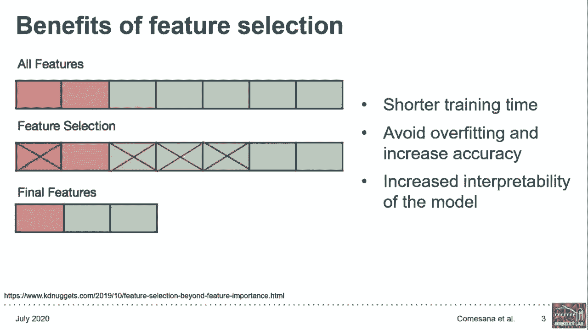

 So given those benefits there are two main lenses through which we can approach feature， selection。

 One of them relies on performance of the model as the only motivation behind performing feature。

 selection。 So our only goal would be to build a good predictor。

 For example if we are trying to build a classifier to differentiate between pictures of text。

 and people debugging code we don't particularly care about how it is going to differentiate。

 we just want it to perform well。 The second motivation lies around interpretability of a finalized model。

 So we are looking for insights based on what features are found to be relevant。

 For example we want to know what causes a certain disease so we can learn how to treat。

 it or prevent it。 And there doesn't need to be a tradeoff between these two approaches。

 There are certainly feature selection methods that yield good accuracy while still being。

 interpretable and helping to generate hypotheses about target feature relationships。

 In this presentation we are going to focus on those methods so that you can have your cake。

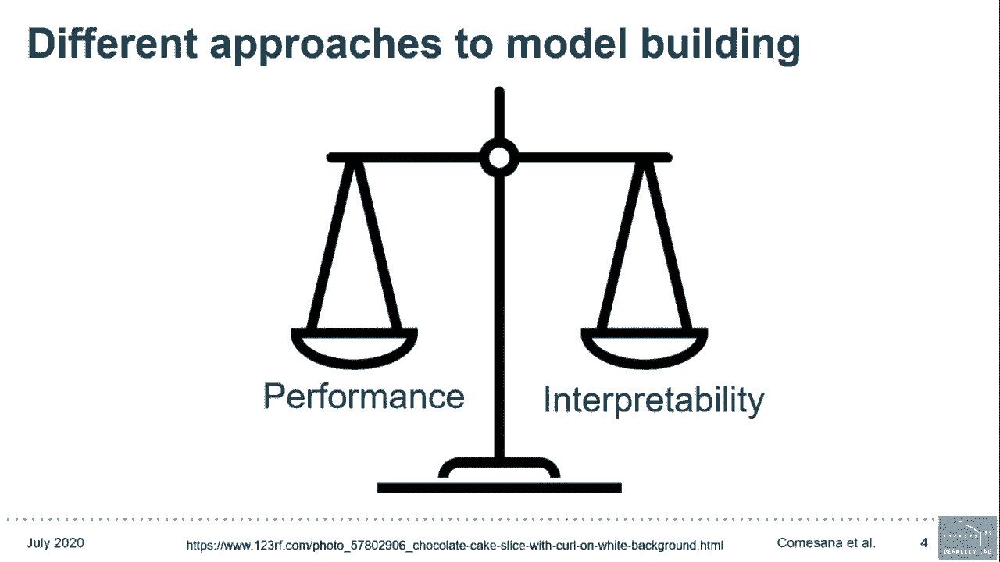

 and eat it too。 So there are three main types of feature selection methods as mentioned earlier。

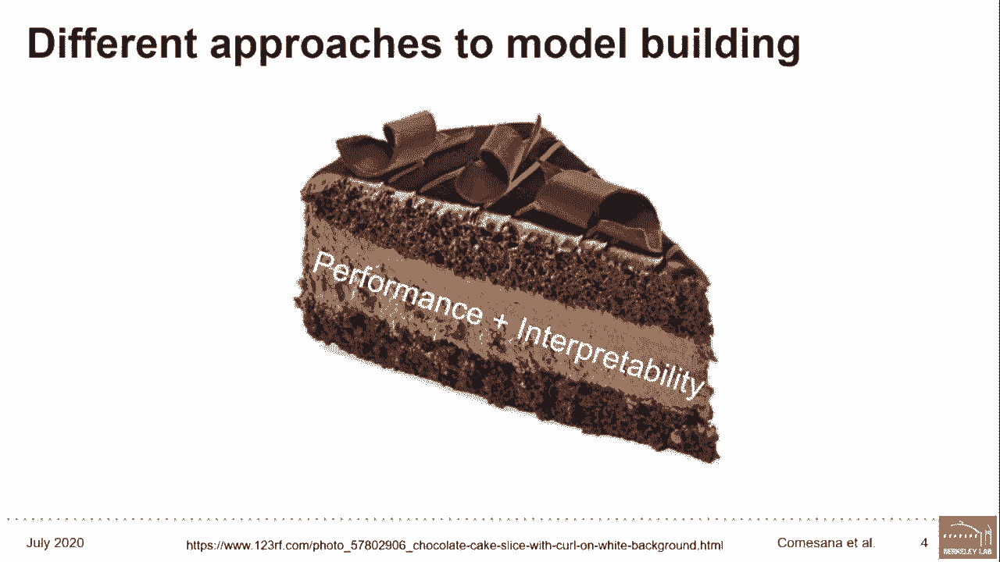

 The first one are going to be filter methods which extract features from data without learning。

 anything。 The second one are wrapper methods which use machine learning algorithms to rank features。

 by usefulness and then select the end top features。

 The third one are embedded methods which combine the feature selection and the model。

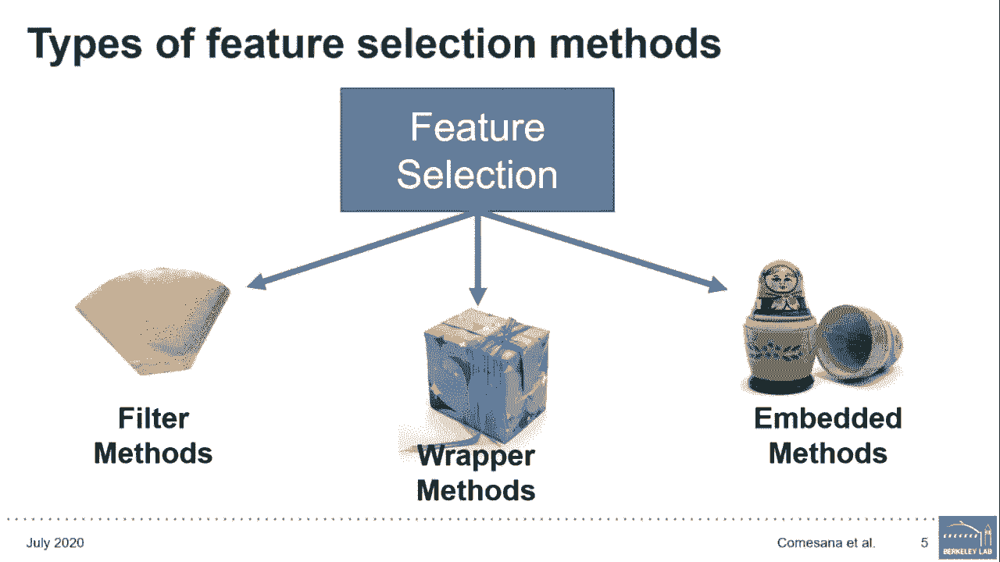

 training steps into one。 So let's start with filter methods。

 These are simple techniques for weeding out irrelevant features without sitting a model。

 and they are generally used as a data pre-processing step。

 The idea behind them is to assign a heuristic score to each feature in order to filter out。

 the useless ones。 The question that drives these methods is does this feature have enough data？

 And for that we use scores such as chi squared information gain， the key to mutual information。

 or different correlation coefficients。 So let's go back to my cat purring for example。

 If my dataset included the feature did on a drink coffee this morning it would be weeded。

 out due to the fact that I drink coffee every morning so we would just see yes for all samples。

 and that feature would not bring any new information。

 These methods can be broken down into two main categories as we can see on the slides。

 Univariate and multivariate methods。 Univariate methods will rank individual features according to some criteria and then select。

 the top and features。 This can include things such as variants of features and this is where we need drinking。

 coffee would be eliminated。 It's good for removing constant or quasi-constant features but it may leave us with redundant。

 variables since the relationship between features themselves is not taken into account。

 That's when multivariate methods come in。 They will look at the mutual relationship between the variables and so it will be good。

 for removing duplicated correlated features。 There's a number of ways to measure correlation between variables including the Pearson correlation。

 coefficient which is going to summarize the strength of a linear relationship or Spearman。

 which measures the degree of association between two variables with a monotonic function among。

 a lot of other correlation coefficients and choosing the right method for you requires。

 you to look at the type of data that you have。 Filter methods are good to use as an efficient initial step to filter lightly the data especially。

 if they're running time of your algorithm's problem。

 It's kind of cool to note that because these methods don't incorporate learning that is。

 they are independent of the model the features selected with filter methods can be used as。

 an input in any machine learning model or in other feature selection methods。

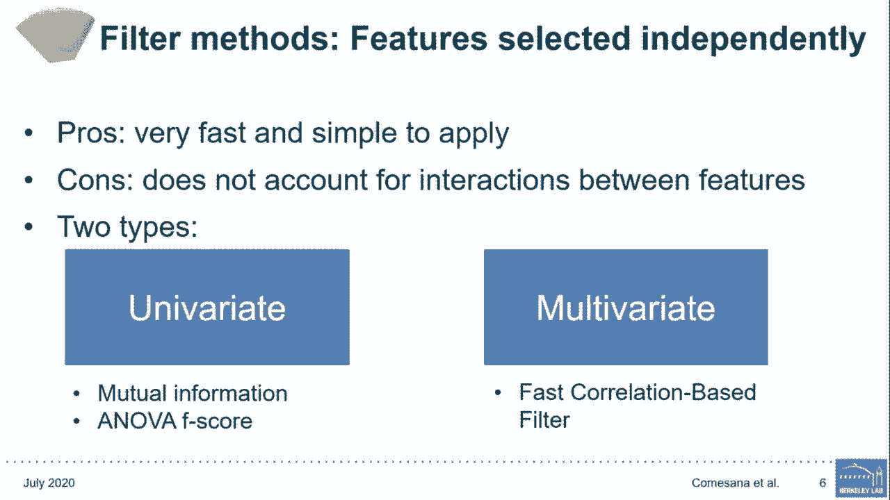

 Here's some quotes that you can see how these methods are implemented with scikit， learn。

 We've omitted loading the data as well as splitting it into training and testing sets。

 and all of that stuff。 Select k best the first one and it's a univariate filtering method。

 It will estimate the mutual information for variables and then select the k highest scoring。

 variables。 We could have changed the function used to rank features which is the scorefunct parameter。

 right there as well as the number of top features that are going to be chosen which is the。

 k parameter right there。 We can also use other univariate methods such as select percentile which we select to top。

 x percentile of features。 Then we also have the Pearson correlation coefficient which I mentioned earlier and it's。

 going to summarize the strength of the linear relationship between variables。

 So we're going to get that correlation matrix and then out of every pair of features with。

 the coefficient above 0。95 we are going to eliminate one out of the two features。

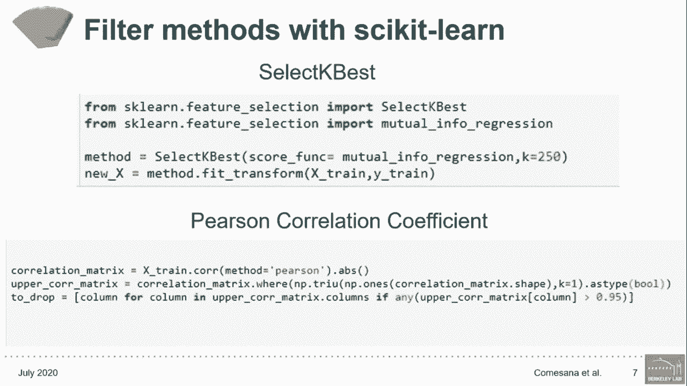

 Next we have wrapper methods。 These methods evaluate each subset of features based on the quality of the performance of。

 a given algorithm and they aim to find the best possible subset of features。

 They tend to perform better in selecting features because they detect interaction between。

 variables and most directly optimize prediction performance but they can be very expensive。

 and this is going to become more apparent as the feature space grows。

 An example of wrapper methods is forward selection。

 In forward selection we start with no features and with each iteration we add the one feature。

 which best improves the model until an addition of features does not improve the performance。

 anymore。 In backward elimination we start with all of the features and remove the least significant。

 one at each iteration until no improvement is observed upon removal of additional features。

 Now they sound great however they do have the limitations beyond how computationally expensive。

 they are。 For example forward selection can add a feature that was initially useful but no longer useful。

 after adding some other features in and with backward selection it could happen the other。

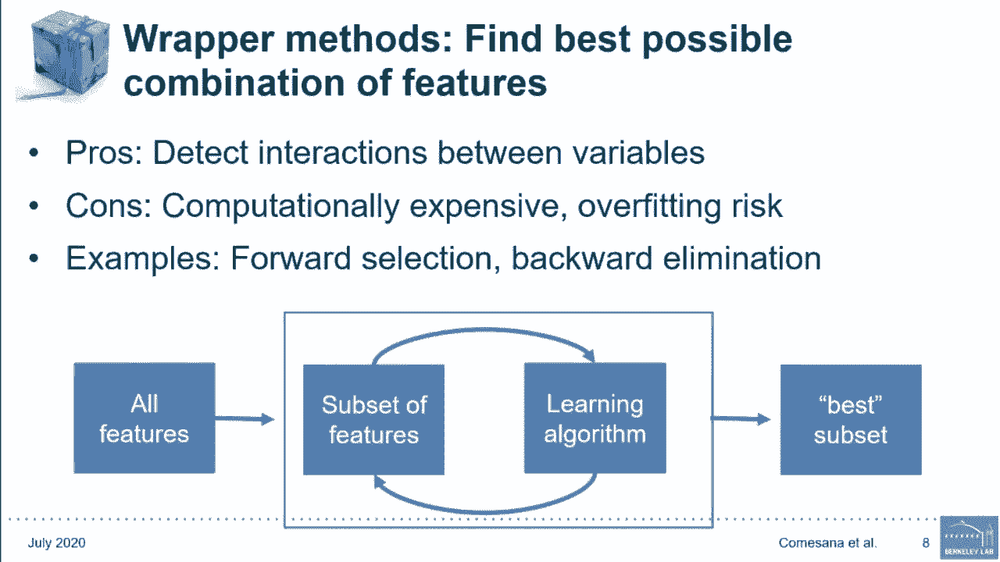

 way。 Now second learn doesn't seem to have a forward selection or backward elimination algorithm。

 but it does provide recursive feature elimination which is a greedy algorithm much like backward。

 elimination and we will talk about recursive feature elimination a little bit later in the。

 presentation。 The last category is embedded methods。

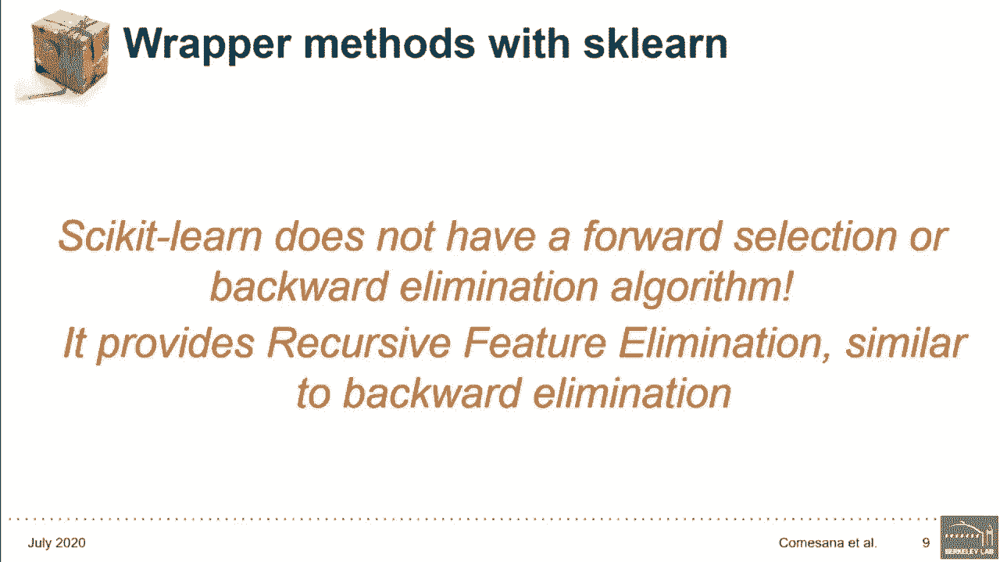

 The motivation for embedded methods is what if we can include the feature selection process。

 as a part of the model training process itself and these methods don't separate the learning。

 from the feature selection part so they are performing feature selection and ranking features。

 while training model。 There are a couple of different advantages to that。

 One much like wrappers these methods are going to take into consideration the interaction。

 between features。 Two they are relatively fast or at least faster than wrapper methods。

 One to three they tend to be more accurate than just filter methods unless prone to overfitting。

 However because they make classifier or regressor dependent selections the features resulting。

 from these methods may not work if that model is changed。

 An example of this are three based algorithms such as random forest which iteratively discard。

 is more fraction of the data seemed of lowest importance。

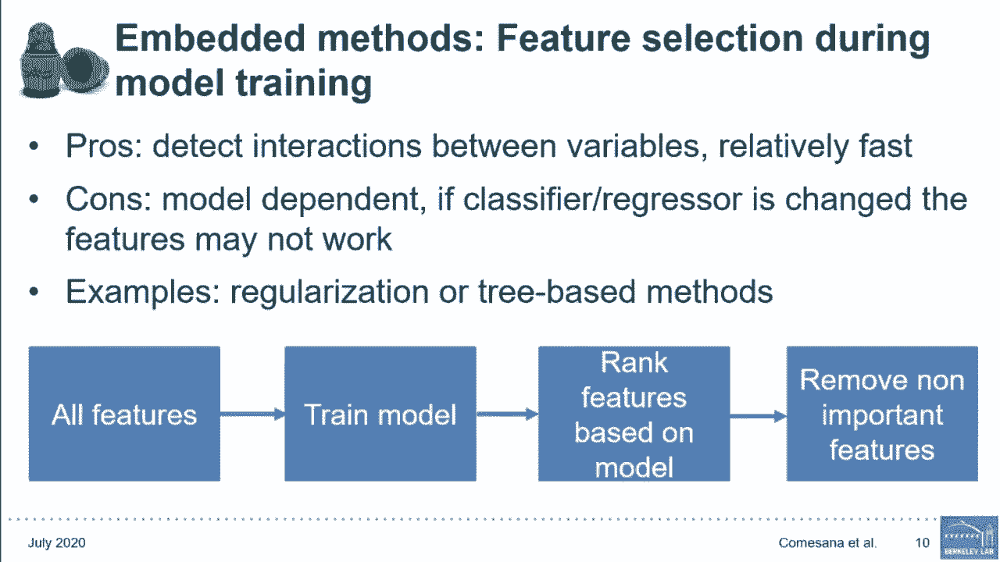

 Cheers once again a very simple example of one of these methods being implemented， scikit， learn。

 This is just going to be a random forest and with the feature importances in that last line。

 you can see how all of the features are ranked by this algorithm。

 From those feature selection approaches we can derive different hybrid methods which combine。

 the different approaches to get the best possible feature subset。

 The way to combine these methods is up to the engineer。

 You can start by performing filter methods to eliminate constant and duplicated features。

 and then use a wrapper method like the best subset of whatever features are left。

 The big advantage of these features is that they take the best parts from other feature。

 selection methods and can therefore reduce their disadvantages and the results in higher。

 performance， lower computational costs and more robust models。

 So here is an example of a hybrid method and that's going to be recursive feature elimination。

 Recursive feature elimination works as follows。 It trains a model on all the data features and evaluates its performance。

 Then it derives the feature importances and breaks the features， deleting the least important。

 features and retraining the model on the previous ones。

 Then it uses the previous evaluation metrics to calculate the performance on the resulting。

 model and tests whether the evaluation metric decreases by a certain threshold or not。 If it does。

 if it decreased by the threshold， it means the feature is important otherwise， we can remove it。

 The algorithm is going to continue deleting the least important feature or features until。

 all features are removed and then the rank of the features is the opposite order in which。

 they were eliminated。 It looks a little bit like backward elimination but the main difference is that backwards elimination。

 eliminates all features first in order to determine which one is important while recursive feature。

 elimination we're getting information from machine learning models derived importance。

 In this specific example we are using a random forest regressor that that could have been， changed。

 So now we've learned about all of these methods that are available to us but you might be asking。

 yourself how do we go about picking one？ And ultimately there is no best feature selection method and you do have to try and arrange。

 different models on different subsets of features to try and figure out what works best with。

 our data。 But some things can help us narrow down the search for example how computationally expensive。

 is your model fitting process。 How complex is the model you're trying to learn？

 For example if it's too complex something like just filtering or doing target correlation。

 may not capture that nonlinear relationship。 And three。

 does your regression or classification method admit embedded feature selection otherwise。

 you can't really use embedded methods。 Ultimately though it will come down to trying different algorithms and which one works best。

 for you and your data。

 So to demonstrate a sample workflow we're going to be talking about feedstock to function。

 This will predict properties of different bio derived jet fuels early in the field development。

 cycle and two sample properties that we're trying to predict and if we will be looking。

 at here our boiling point and yield suiting index which are two properties of importance。

 for understanding the performance of potential jet fuels。 So what about the features？

 Well we're going to use molecular descriptors and molecular descriptors are ways to mathematically。

 encode the chemical structure of a molecule。 And this can include things such as number of carbon atoms or number of rings etc。

 The features were automatically generated with the help of Mordred which is a descriptor。

 calculator software and it initially returned 1800 descriptors。

 Now from those we manually down selected them to 821 for boiling point and 940 for yield。

 suiting index and the number of compounds for each of those properties also appears on， the table。

 Now because our goal included generating hypotheses about potential relationships between molecular。

 structure and these properties we focused on keeping interpretability throughout our process。

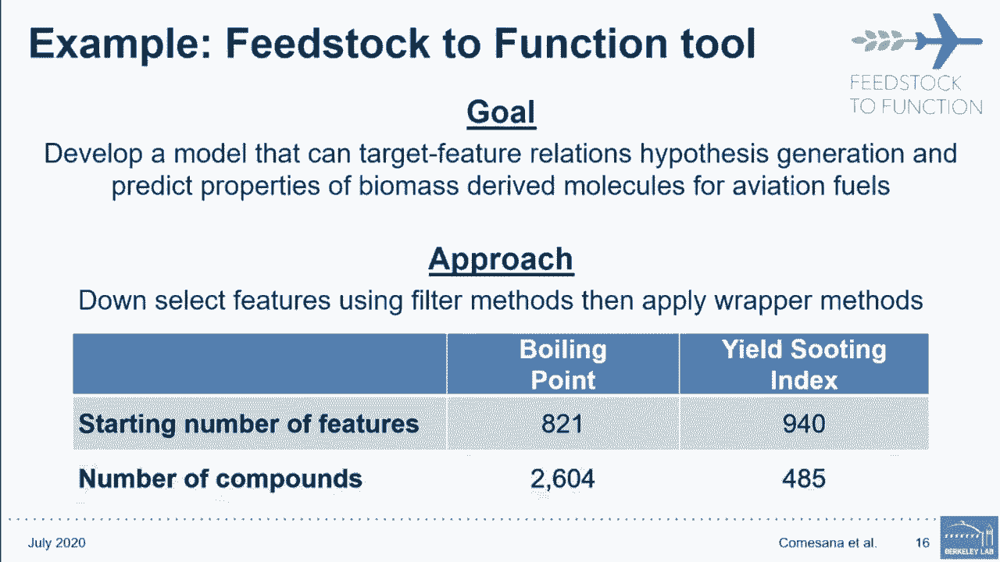

 So how did we go about reducing 1800 molecular descriptors？

 Well we started with a manual inspection of the descriptors like we knew some of them。

 were used for pharmaceutical applications or procurement uptake which is just outside。

 the scope of the project so we manually deleted those that were not or that had very little。

 possibility of being relevant to jet fuels。 Secondly there was some data pre-processing which we're all familiar with。

 Because there were still a lot of features and wrapper methods would have been expensive。

 and we started by using filters。 Now descriptors with the same value for all compounds were removed as was descriptors with。

 a correlation coefficient above a certain threshold which is like we did earlier。

 Now from there we tried to find the best way to narrow down the 500-700 descriptors that， were left。

 And this part became a little bit of trial and error。

 Now we tried different methods such as using random forest feature importances。

 We also tried linear support and vector regressors as well as lasso regression and other methods。

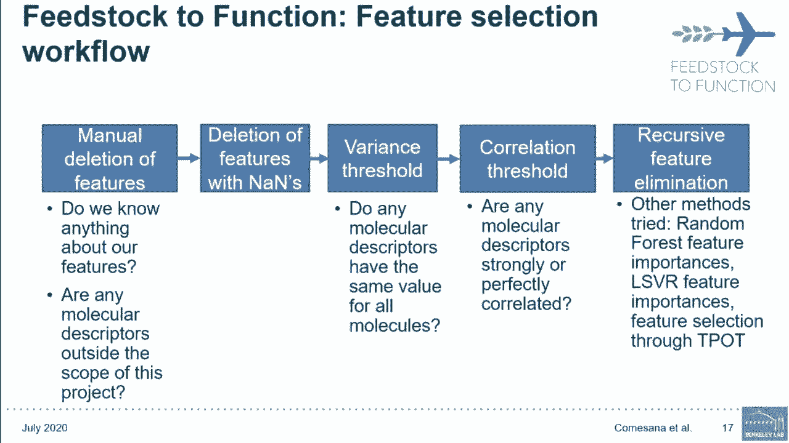

 And here is a more detailed view of that last step and how it came about。

 We had initially tried backward elimination as well as recursive feature elimination but。

 realized that it was taking a really long time and it was really computationally expensive。

 So we went with some more correlation threshold and correlation analysis where we looked at。

 both Pearson and Spearman correlation coefficients and eliminated further features based on that。

 After that we tried a myriad of different methods including random forest feature importances。

 where we took the top X features and ran a couple of different random forests to make。

 sure we were getting similar features every run。 We also tried lasso regression and finally recursive feature elimination again which this。

 time didn't take as long。 From there we plotted the number of features versus the performance of our model and what。

 we did was plot how the performance changed as we added lower and lower ranked features。

 from that recursive feature elimination into our feature set as well as lower ranked features。

 from the random forest。 And we realized that for model for our data using recursive feature elimination was the。

 optimal solution as well as using those plots with the number of features versus the performance。

 to kind of inform our decision as to the number of features to include in our feature set。

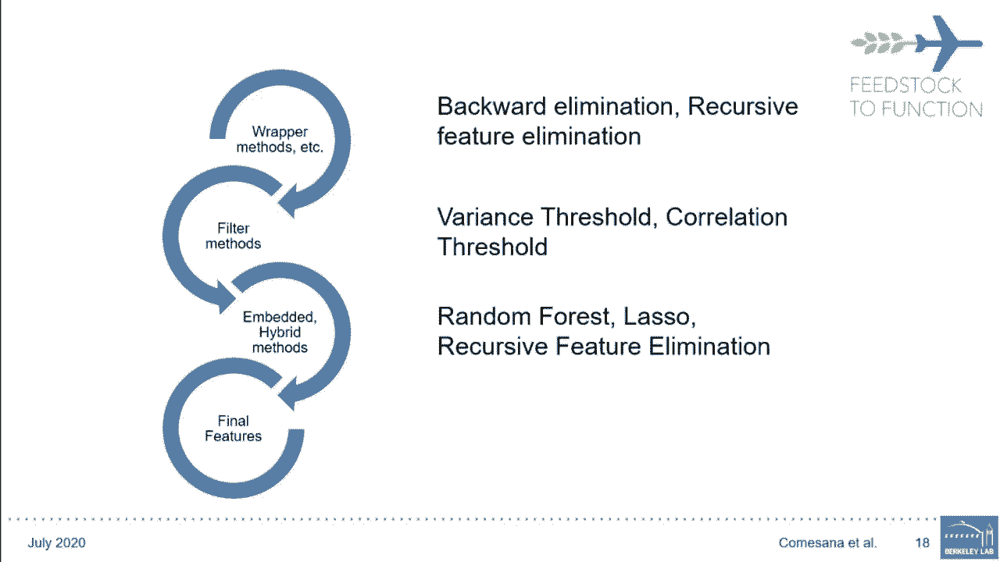

 And here we can see the results and compare the performance of our predictions prior to。

 and post feature selection。 We can see that for boiling point there was a small improvement in accuracy。

 Despite the fact that the improvement was small this was a big deal because instead。

 of working with 821 descriptors to try to figure out their relationship with boiling point we。

 were able to eliminate a little bit under two thirds of the descriptors。

 And it's a work in progress and we're still working to narrow it down that number a little。

 bit more so we can better figure out what are the main components driving boiling point。

 For yield-sooting index though we were able to narrow it down from 940 descriptors to 7。

 which increased the accuracy by a large margin。 It also has already given us some insights into understanding the drivers for estimating。

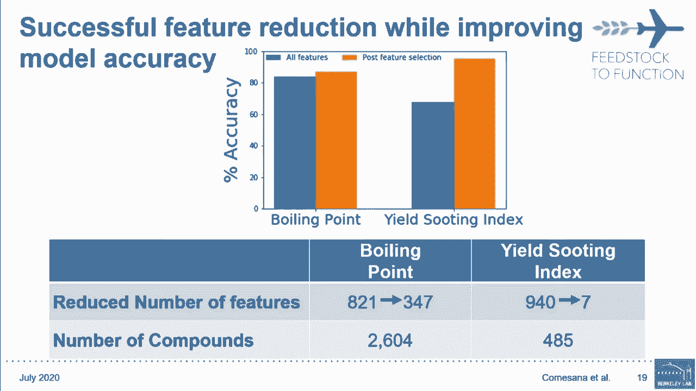

 yield-sooting index。 Overall we have looked at different types of feature selection methods including filter。

 wrapper and embedded methods。 The hybrid methods which are a combination of the three tend to be better。

 As you've noticed there doesn't need to be a trade-off between accuracy and interpretability。

 And as I've showed you we were able to take over 900 features and narrow them down to 7。

 while improving accuracy and better be able to interpret our model and find relationships。

 between our molecular descriptors and our target properties。

 Remember that your data can give you hints as to what feature selection method can work， best。

 But questions about the computational cost of your process， the complexity of the relationship。

 you're trying to model and about the type of model that you're using can also give you。

 hints as to how to best optimize your search through feature selection algorithms。

 Although your data or model might look different than ours this example can help guide how。

 you approach the similar problem feature selection。

 But there may be some optimization not only in terms of the machine itself but also from。

 you as the machine learning engineer so that you're better able to advance whichever field。

 you work in。

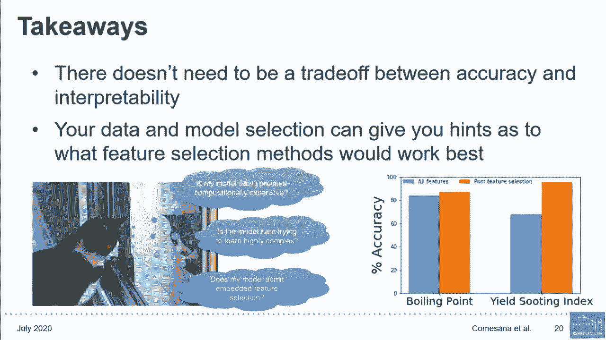

 I'd like to acknowledge and thank the rest of my team for supporting my work both from。

 Lawrence Berkeley National Lab and from Oregon State University。

 I also want to thank our funders from the Bioenergy Technologies Office。

 And thank you for attending my talk。

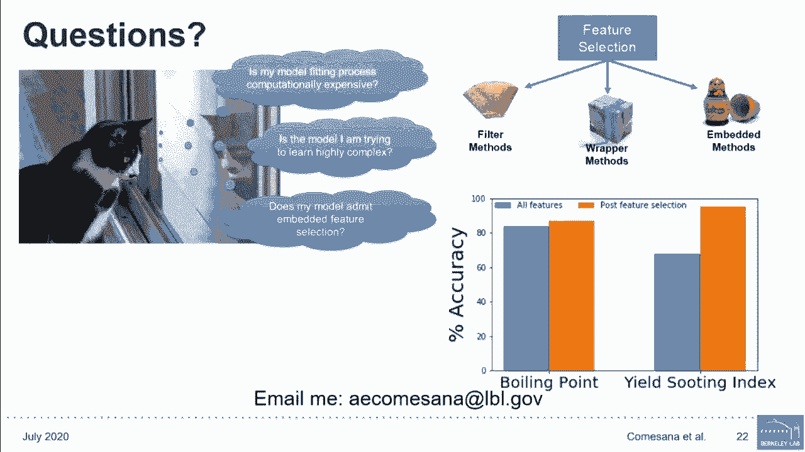

 With that are there any questions I can answer？ [BLANK_AUDIO]。

