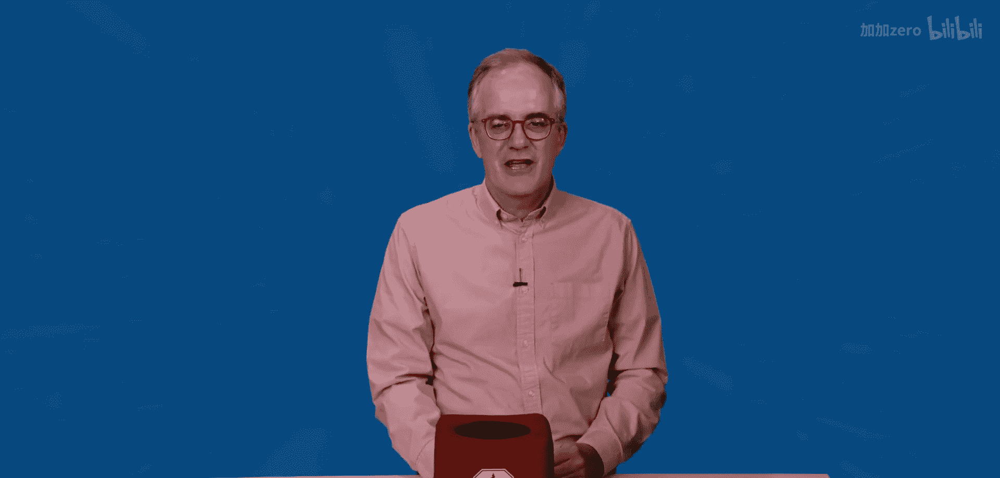
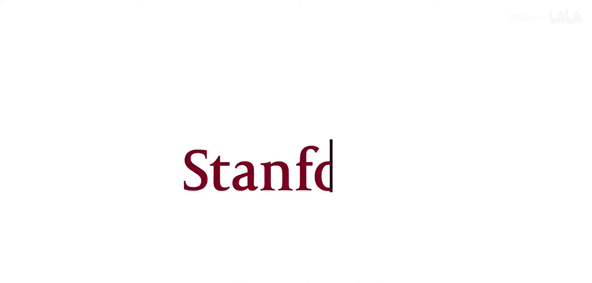

人工智能职业发展：01：克里斯·曼宁教授答疑


在本节课中，我们将学习斯坦福大学克里斯·曼宁教授对于人工智能领域职业发展相关问题的解答。教授将分享如何深化对AI的理解、AI领域的新兴职业路径以及完成基础知识学习后的进阶方向。

---

### 🛠️ 如何超越现成工具包，深化对AI的理解？

上一节我们介绍了课程概述，本节中我们来看看如何提升对人工智能的实质理解，而不仅仅是使用现成的工具包。

教授的核心建议是：**你必须动手构建项目**。许多顶尖的AI从业者都投入了大量精力为自己构建项目，甚至重新实现已有的算法或框架。一个著名的例子是斯坦福博士毕业生安德烈·卡帕西。他不仅在特斯拉和OpenAI有着辉煌的职业生涯，同时也是一位喜欢在周末动手构建项目的“黑客”。

关键在于，**从零开始为自己构建项目**，即使只是复现他人或大公司已经完成的工作，这个过程也能让你学到极多。这是一个极佳的学习锻炼方式。

**核心行动公式**：
```
深化理解 = 动手构建(从零开始的项目)
```

---

### 🚀 AI领域有哪些有前景的新兴职业路径？

在了解了如何深化学习后，我们自然会关心学成后的职业机会。本节我们来探讨AI领域的新兴职业方向。

目前，市场对机器学习工程师、以及对神经网络、自然语言处理、机器人及相关技术有深刻理解的人才，存在巨大的需求缺口。因此，如果你在这些领域掌握了扎实的技能，你将拥有广泛的选择。

以下是你可以涉足的部分行业领域：
*   **汽车工业**
*   **银行与金融业**
*   **建筑业**
*   **矿业与农业自动化**

简而言之，**几乎每个行业都在寻找利用人工智能进行革新和重塑的方法**。

---

### 📈 完成机器学习和深度学习基础后，下一步该学什么？

掌握了基础知识和职业前景后，初学者常会困惑于如何规划下一步学习。本节我们讨论完成基础学习后的进阶路径。

这个问题没有“一刀切”的标准答案。一个有效的策略是：**找到一个你真正感兴趣的项目**。这个项目可以是工作相关的，也可以纯粹是个人爱好的延伸。

**亲自动手，从头到尾构建一个完整的AI应用**，这本身就是一个强大的深度学习过程，其价值远超完成一两门课程。当然，你也可以选择学习其他优秀的进阶课程，但此时的选择应更多地取决于你的个人兴趣方向。

**核心建议**：
```python
if 已完成基础学习:
    下一步 = 选择(感兴趣的项目, 进阶课程)
    # 优先推荐通过项目实践来学习
```

---




### 总结




本节课中我们一起学习了克里斯·曼宁教授关于AI职业发展的三点关键建议：**通过从零构建项目来深化理解**；认识到**AI技能在各行各业都有广泛的应用前景和人才需求**；以及在完成基础学习后，**通过实践个人感兴趣的项目来驱动下一步的进阶学习**。