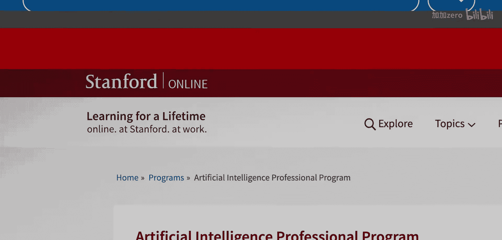

# 003：大语言模型之后与未来应用

在本节课中，我们将学习斯坦福大学克里斯·曼宁教授关于大语言模型未来发展的核心观点。我们将探讨大语言模型之后的技术方向、其在不同领域的应用潜力，以及人工智能与人类互动关系的未来展望。

## 大语言模型之后的技术方向 🚀

上一节我们介绍了大语言模型的基本概念，本节中我们来看看其核心原理与未来的技术演进方向。

大语言模型的技术本质是：我们可以取一段文本，遮盖其中的一部分，然后尝试预测被遮盖部分的内容。这个过程可以概括为**预测下一个词**。模型通过不断学习预测结果是否正确，并在数十亿次的重复中改进。

这种“遮盖与预测”的策略非常成功，可以扩展到人类经验和科学研究的许多其他领域。

以下是该策略在不同领域的应用示例：
*   **图像领域**：可以遮盖图片的一部分，尝试预测缺失部分的内容。
*   **基因序列领域**：可以遮盖一段基因序列，尝试预测被遮盖的部分。

因此，这是一种可以用于多种领域的通用策略。在不久的将来，我们将看到基础模型得到更广泛的应用。

尽管大语言模型取得了巨大成功，但它们似乎并未构建出人类所拥有的那种世界模型。人类的世界模型包含对物理实体、特定事物（尤其是人类）及其关系的感知，这比特定的词语序列更为抽象。

这表明我们需要一种不同的人工智能模型。但目前，还没有人确切知道如何成功实现这一点，这也是我们仍在进行学术研究的原因。

## 自然语言处理的未来应用 💡

上一节我们探讨了技术原理，本节中我们来看看这些技术将如何改变现实世界。

我认为，我们将看到更多的自然语言处理系统被成功部署到各个角落。许多网站已经在右下角设置了小型AI助手。未来，我们将看到由大语言模型驱动的新一代助手，它们的工作将更加流畅。

我们将看到对话式助手得到更广泛的应用。例如，当你思考如何给老板写邮件，或者不确定该对男友说什么时，你可以从大语言模型那里获得建议、起草帮助或说话提示，这在当下已经非常有用。

我们的世界是高度基于语言的，因此存在无数种使用这些模型的方式。我们所有人都在探索其中的一些可能性。

## 人工智能会超越人类吗？🤖

关于人工智能的未来，一个核心问题是它是否会变得不再需要人类输入。诚实的答案是：没有人知道。

在遥远的未来，存在一种可能的世界：人工智能系统可以从周围环境中学习所需的一切，而不再需要我们告诉它事情。但目前也存在许多非常热烈的炒作。有些人认为，到2030年，计算机将在几乎所有任务上都优于人类。

我认为，其中很多观点是相当非理性的繁荣，人们对我们已经取得的真正巨大进步感到有些过于兴奋。

但在其他方面，人类的知识和在世界中运作的能力，在未来几十年内仍可能优于我们的人工智能模型。

## 对话助手会取代搜索引擎吗？🔍

对于不同类型的搜索，答案是不同的。

一种情况是，人们心中有一个具体的问题，例如“加州初选何时举行”。对于这类问题，对话代理和大语言模型非常适合这个目的，它们比其他可用工具更快、更好。你也可以将它们用于各种其他问答相关目的。

有时人们使用搜索是因为他们想自己深入研究。例如，他们想购买一个新帐篷，并希望自己做出决定。此外，还有导航类查询，用户只想被带到某个特定页面。这显然无法通过使用大语言模型来满足。

---

本节课中我们一起学习了克里斯·曼宁教授对大语言模型技术原理、未来应用方向以及人机关系演变的见解。我们了解到，“遮盖与预测”是核心学习范式，其应用将超越文本领域。同时，尽管AI助手将更深入地融入生活，但在可预见的未来，人类智能与AI仍将是一种互补共生的关系。