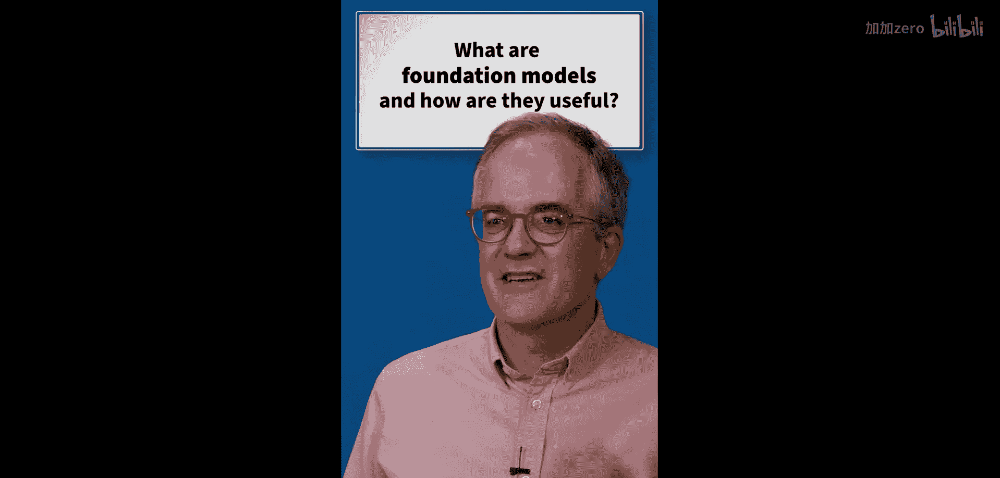
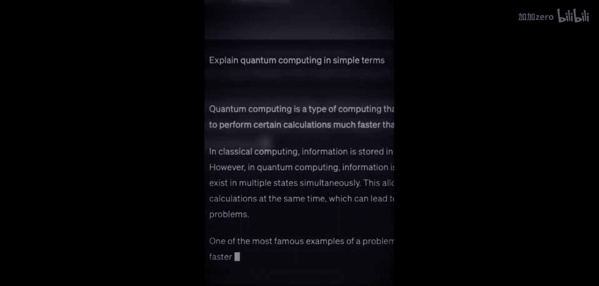

# 004：什么是基础模型及其价值

在本节课中，我们将要学习“基础模型”这一核心概念。基础模型是近年来人工智能领域最具影响力的突破之一，它彻底改变了我们利用AI处理语言、视觉乃至更多领域任务的方式。

## 什么是基础模型？

“基础模型”这个术语由斯坦福大学的研究人员提出，用于描述近期发布并产生巨大影响的一类新型、庞大的人工智能神经网络模型。

上一节我们介绍了基础模型的定义，本节中我们来看看其核心思想。该思想认为，通过让模型“观看”海量世界数据来进行训练的方法，其应用范围可以非常广泛。

以下是该方法可以应用的主要领域：
*   语言
*   视觉
*   基因组序列
*   机器人技术
*   其他信号（如雷达信号）

## 基础模型如何工作？

其核心理念是，通过让大型神经网络接触海量数据，它们能够深入理解世界。如果训练数据是人类语言，那么模型就能深入理解人类语言。

这个过程可以抽象为以下公式：
**模型理解能力 ∝ 模型规模 × 数据量**

这些基础模型为我们提供了具备更强理解能力的计算机模型，目前正被广泛部署，并正在重塑我们利用人工智能所能实现的目标。

本节课中我们一起学习了基础模型的概念、其核心思想以及工作原理。基础模型通过在海量数据上进行预训练，获得了广泛而深入的世界知识，成为支撑当前众多AI应用的基石。