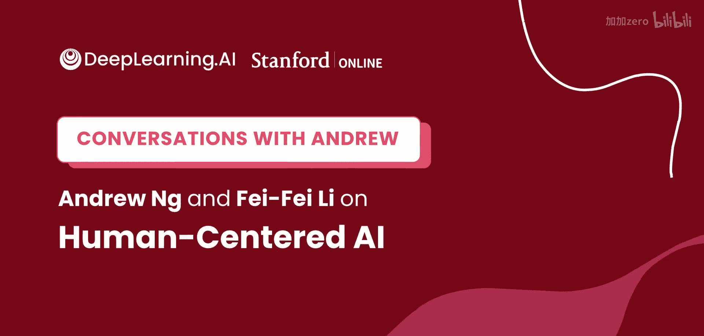
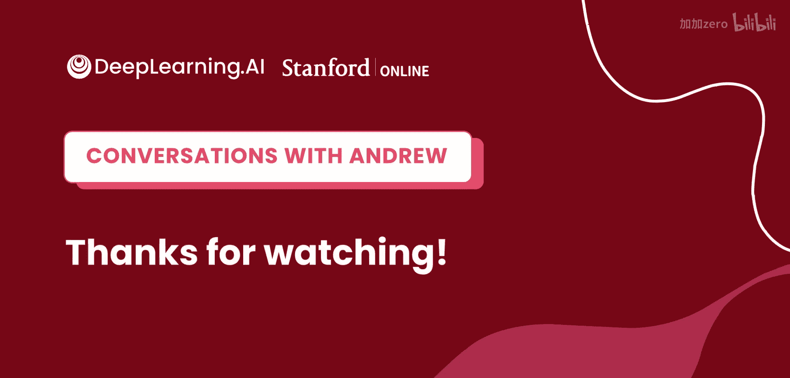

# 007：吴恩达与李飞飞关于以人为本的人工智能的对话

## 概述

在本节课程中，我们将跟随吴恩达（Andrew Ng）与李飞飞（Fei-Fei Li）的对话，了解李飞飞教授从物理学背景转向人工智能领域的独特历程，探讨她对人工智能本质的宏大思考，并回顾ImageNet等里程碑项目的起源故事。我们还将学习她如何将AI技术应用于医疗健康等关键领域，以及她在推动AI教育普及和政策制定方面所做的努力。本次对话为初学者提供了一个了解顶尖AI科学家思想与经历的窗口。

## 从物理学到人工智能的转变 🧠

上一节我们介绍了本次对话的背景。本节中，我们来看看李飞飞教授如何从一个物理学学生转变为全球知名的人工智能科学家。

李飞飞教授最初在普林斯顿大学主修物理学。物理学训练了她提出宏大问题、追寻“北极星”（指引方向的核心问题）的激情。在阅读20世纪伟大物理学家的著作时，她发现许多物理学家后期都在思考生命、智能和人类意识等同样大胆的问题。

这引发了她对智能主题的好奇。在大学期间，她开始在神经科学实验室实习，特别是与视觉相关的领域。她发现，探索智能的本质与探索宇宙起源或物质构成一样，是一个极其大胆而迷人的问题。

因此，尽管当时正处于“AI寒冬”，人工智能并非热门领域，她依然决定从物理学转向人工智能领域攻读研究生学位。她认为，与物理学、化学和生物学这些已有数百年历史的学科相比，现代人工智能科学只有大约60年的历史，是一个非常新兴且充满机遇的领域。

## 追寻智能的“北极星”问题 🔭

上一节我们了解了李飞飞教授的学科转变。本节中，我们来探讨她一直追寻的核心科学问题。

李飞飞教授至今仍在思考一个宏大问题：智能。自艾伦·图灵以来，人类尚未完全理解智能背后的基本计算原理。她梦想能找到一组简单的**公式**或原则，来定义智能的过程，无论是动物智能还是机器智能。

她用一个类比来说明：人类发明飞机，并非单纯模仿鸟类飞行，而是掌握了背后的空气动力学和物理学原理。同样，无论是构建智能系统还是研究大脑，她相信终有一天我们能发现支配智能过程的根本原理。

她认为当前的人工智能领域仍处于“前牛顿时代”，正在经历作为一门基础科学的激动人心的成长期，未来还有巨大的探索空间。

## ImageNet的起源故事 📸

上一节我们探讨了李飞飞教授的科研驱动力。本节中，我们来看看她最具影响力的项目之一——ImageNet是如何诞生的。

李飞飞教授在研究生阶段，正值机器学习开始应用于计算机视觉的时期。同时，数十年认知科学和神经科学在人类视觉研究上取得了关键进展，确立了物体识别等核心问题。

她和导师意识到，当时的研究面临一个根本性挑战：**模型泛化能力不足**，容易过拟合，且缺乏数据。为了推动物体识别这一“北极星”问题的发展，他们决定创建一个大规模数据集。

以下是这个项目的演进过程：
*   **Caltech 101**：这是他们的第一个尝试。当时互联网兴起，他们利用谷歌图片搜索下载图像，与家人和少数本科生一起标注，建立了包含101个物体类别、约数万张图片的数据集。
*   **ImageNet**：成为斯坦福大学助理教授后，李飞飞意识到问题远比想象中宏大。Caltech 101的数据量已不足以驱动更强大的算法。于是，她提出了一个更雄心勃勃的计划：下载整个互联网的图片，并映射所有英语名词，构建包含22000个类别、1500万张图像的巨型数据集ImageNet。这个想法最初遭到了不少质疑。

ImageNet的成功结合了对正确“北极星”问题的坚持以及驱动它所需的大规模数据。这个故事也说明，研究可以从较小的项目开始，积累经验，逐步迈向更大的目标，但内心始终要有一个宏大的愿景驱动。

## 将AI应用于医疗健康 🏥

随着研究项目的拓展，李飞飞教授将她在计算机视觉和神经科学方面的基础，应用到了多个重要领域，尤其是医疗健康。

她的研究演进部分遵循了动物视觉智能的发展规律。她关注两个核心方向：一是寻找能改善人类生活的 impactful 应用领域（如医疗健康），二是探索视觉的本质，试图闭环感知与机器人学习。

大约十年前，一个数据令她震惊：**每年有约25万美国人死于医疗差错**。其中，每年因医院获得性感染导致的死亡超过9.5万例，是交通事故死亡人数的2.5倍以上。而手部卫生执行不佳是主要原因之一。

当时正值自动驾驶技术兴起，她观察到自动驾驶汽车使用的智能传感、摄像头和机器学习算法，能够理解复杂的高风险环境。她意识到，在医疗服务过程中，许多人类行为流程处于“黑暗”中，如果能在病房或老年公寓部署智能传感器，帮助医护人员和患者更安全，将意义重大。

于是，她与合作伙伴开始了“环境智能”研究。将AI应用于真实人类环境时，会面临许多机器学习问题之外的人类问题，例如隐私。他们的早期技术使用不捕获RGB信息的深度摄像头来保护隐私。近年来，技术进步提供了更多隐私保护工具，例如：
*   **设备端推理**
*   **联邦学习**
*   **差分隐私**
*   **加密技术**

公众对隐私的日益关注也在推动科学家开发更好的机器学习技术。

## 参与政策制定与AI普及教育 📜

除了技术研究，李飞飞教授也深入参与人工智能的政策制定和普及教育工作。

大约四年前，在斯坦福大学多位领导的推动下，他们意识到斯坦福在AI发展中的历史责任，认为下一代AI教育、研究和政策需要是“以人为本”的。因此成立了“以人为本人工智能研究所”（HAI）。

其中一项重要工作是深度参与政策讨论。AI对人类生活的影响迅速且深远，作为专家，有必要与政策制定者共同努力，确保技术更好地服务于人。这涉及公平性、隐私、人才流向产业、数据和算力集中在少数公司等问题。

斯坦福HAI参与推动的一项政策是《国家人工智能研究资源（NAIRR）法案》。该法案旨在建立一个任务组，为美国公共部门（尤其是高等教育和研究机构）制定路线图，以增加其获取AI计算资源和数据的机会，从而重振美国AI创新与研究的生态系统。李飞飞教授是该法案下设的12人任务组成员之一。

在AI教育普及方面，李飞飞教授在2015年发起了“AI4ALL”项目（最初名为“SAILORS”）。当时，AI领域存在严重的代表性不足问题。该项目最初邀请高中女生参加暑期项目，激发她们学习AI的兴趣。后来在多方支持下，发展成为全国性的非营利组织“AI4ALL”，致力于培养来自各行各业、特别是传统上服务不足和代表性不足社区的学生，成为塑造AI未来的明日领袖。该项目通过夏令营、在线课程和大学通路项目等方式持续支持学生。

## 给AI初学者的建议 🚀

对于刚刚开始接触机器学习的人来说，这个领域可能令人眼花缭乱。李飞飞教授给出了她的建议。

今天AI的入口比他们当年要宽广得多。对于有技术兴趣和资源的人，互联网上有大量优质资源（如Coursera、YouTube等），鼓励大家利用这些资源学习，这充满乐趣。

对于非技术背景但同样对AI充满热情的人，无论是下游应用、创造力、政策与社会角度，还是重要的社会问题（如数字经济、治理、历史、伦理、政治科学），AI领域都有大量工作需要完成，存在许多未知问题。例如：
*   数字时代如何定义和衡量经济？
*   生成式AI的进步对音乐、艺术、写作等领域的创造力意味着什么？

总之，这是一个非常激动人心的时代。无论你来自何种背景，只要对AI充满热情，都能在其中找到自己的角色。AI是一项通用技术，将你当前的兴趣与AI结合，往往能产生 promising 的前景。

## 总结

本节课中，我们一起学习了李飞飞教授的学术与职业旅程。我们从她由物理学转向AI的故事开始，了解了她对智能本质这一“北极星”问题的持续追寻。我们回顾了ImageNet这一深度学习关键数据集的诞生历程，看到了从Caltech 101到ImageNet的迭代与坚持。接着，我们探讨了她将AI技术应用于医疗健康等重大社会问题的实践，以及她对隐私等伦理挑战的应对。最后，我们了解了她在推动AI政策制定和教育普及方面所做的努力，并收获了她给AI初学者的宝贵建议。李飞飞教授的经历表明，AI是一个年轻而广阔的领域，无论背景如何，只要有热情和毅力，任何人都可以为塑造其未来贡献力量。

