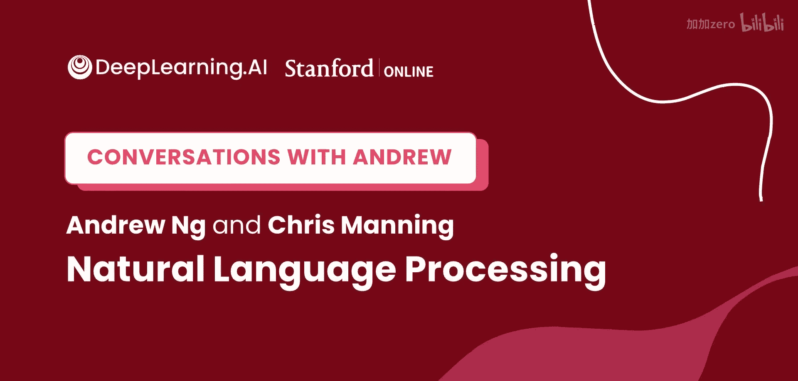
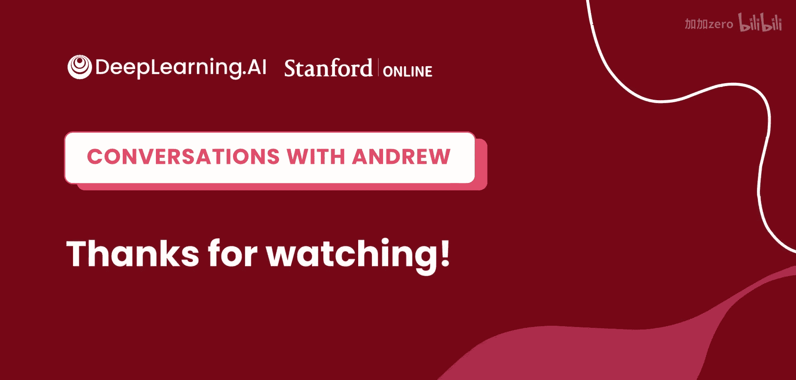

# 009：从语言学博士到NLP先驱——Chris Manning的旅程与洞见

在本节课中，我们将跟随斯坦福大学教授、人工智能实验室主任Chris Manning的视角，了解他如何从语言学领域转向自然语言处理研究，并探讨NLP领域从规则系统到统计方法，再到深度学习与大语言模型的关键演变历程。

## 概述

Chris Manning教授是自然语言处理领域的顶尖研究者。本次对话回顾了他的学术旅程，并深入探讨了NLP的核心概念、历史转折点以及未来发展方向。我们将学习到NLP是什么、它如何演变，以及当前最前沿的大语言模型技术。

## 从语言学转向计算

上一节我们介绍了Chris Manning的背景，本节中我们来看看他如何从纯粹的语言学研究转向计算与自然语言处理的交叉领域。

Chris Manning最初对人类语言本身充满兴趣，关注人们如何理解、使用和习得语言。这种兴趣很自然地引导他开始思考如今我们视为机器学习或计算领域的问题。他特别关注两个核心问题：儿童如何习得语言，以及成人如何进行高效的语言交流。这些问题促使他早期就开始接触机器学习。

他认为，所有人类语言都是后天习得的，这引发了一个思考：机器是否也能学习语言？这种好奇心成为了他转向计算语言学研究的起点。

## 学术背景与早期研究

Chris Manning在本科阶段同时学习了数学、计算机科学和语言学三个专业。在申请研究生时，他同时考虑了计算语言学强校卡内基梅隆大学和以语言学见长的斯坦福大学，最终选择了斯坦福。

在90年代初期，NLP领域主要由**基于规则的、逻辑的、声明式的系统**主导。然而，一个关键的转变正在发生：数字化的文本和语音材料（如法律文件、报纸文章、议会记录）开始大量出现。这为从海量语言数据中开展实证研究提供了可能，也让他投身于一种新型的自然语言处理研究中。

## 什么是自然语言处理？

在了解了研究背景后，我们来看看NLP的具体定义。

NLP代表自然语言处理。另一个常用术语是“计算语言学”，两者基本同义。NLP这个术语本身有些特别，因为它默认“语言”指的是编程语言，所以需要加上“自然”来特指人类使用的语言。

总体而言，自然语言处理是指对人类语言进行任何智能化的操作。这可以分解为理解、生成和习得人类语言。人们通常从应用角度来思考NLP，例如：
*   机器翻译
*   问答系统
*   广告文案生成
*   文本摘要

由于人类世界的绝大部分信息都是通过语言传递和处理的，因此NLP有着极其广泛的应用。其中，**网络搜索是NLP最大规模的应用**。早期的搜索主要基于关键词匹配和页面质量评估，而如今，搜索引擎越来越多地执行真正的自然语言理解任务，例如从文本中提取答案并高亮显示。

## NLP的技术演变：从规则到统计，再到深度学习

上一节我们定义了NLP，本节中我们来看看其核心技术是如何一步步发展至今的。

Chris Manning的研究生涯亲历了NLP从规则系统到统计方法，再到深度学习的完整演变过程。

**1. 规则系统时代**
早期，NLP主要依赖手工构建的系统，这些系统使用规则和推理程序来尝试构建对文本的理解路径。例如：
*   语法规则：`一个英语句子通常由主语名词短语 + 动词 + 宾语名词短语构成`。
*   词义消歧规则：在“电影”语境下，“star”这个词很可能指人而非天体。

**2. 统计方法崛起**
随着数字化文本的普及，研究人员开始转向计算语言材料的统计数据并构建机器学习模型。在1990年代中后期至2010年左右，**统计自然语言处理**或更广义的**概率化人工智能方法**成为主流。

**3. 深度学习革命**
大约在2010年，使用大型人工神经网络的深度学习开始兴起。Chris Manning受到当时同在斯坦福的吴恩达教授的启发，较早地开始了神经网络的研究。在2018年之前，深度学习模型在许多任务上取得了成功，但其范式仍是用更好的神经网络模型去完成相同的任务。

**4. 大语言模型与自监督学习的拐点**
2018年左右成为一个更重要的分水岭，其标志是像BERT和GPT这样的**大型自监督模型**的出现。这些模型仅通过在海量文本上进行词语预测，就能获得关于人类语言的惊人知识。这彻底改变了NLP的工作方式。

## 词向量与自监督学习的先驱

在迈向大语言模型的道路上，词向量技术是一个重要的里程碑。

词向量技术通过神经网络学习用一串数字（向量）来表示一个单词。Chris Manning参与的GloVe项目简化了相关数学，使得学习词语的细致语义表示成为可能。这项技术已经展示了**自监督学习**的威力：仅需海量文本，模型就能学到关于词语意义的丰富知识。

通过简单的“给定上下文预测单词”的任务，模型不仅能学到词语的相似性，还能学会类比推理，例如：`铅笔：画画 -> 画笔：绘画`。这为后续能够理解整段文本和上下文的大语言模型（如BERT、GPT）奠定了基础。

## 大语言模型的工作原理与“AI完备”争议

那么，驱动大语言模型的核心任务究竟是什么？它又有多强大呢？

大语言模型的核心预训练任务是**根据上文预测下一个词**。这个看似简单的任务被证明是极其有效的学习目标。为了尽可能做好这个预测，模型实际上需要：
1.  理解整个句子的结构和含义。
2.  掌握关于世界的知识。

例如，要预测“斐济使用的货币是___”这句话的下一个词，模型需要知道“斐济元”这个事实。因此，有人认为“预测下一个词”是一个**AI完备**的任务——即解决这个问题几乎需要解决人工智能的所有问题。

Chris Manning对此持保留意见。他认为人类在数学、三维空间操作等方面的洞察力并不完全是语言问题。但他也承认，语言所涵盖的世界知识远超想象，我们通过语言描述和思考了世界的绝大部分。

## 大语言模型的应用与提示工程

大语言模型如此强大，我们该如何使用它来完成具体任务呢？

使用大语言模型通常分为两个阶段：
1.  **预训练**：在海量文本上执行“预测下一个词”任务，获得一个基础模型。
2.  **下游应用**：针对具体任务（如问答、摘要、检测有害内容）使用该模型。传统方法是进行**监督微调**，即用特定任务的标注数据继续训练模型。得益于预训练获得的大量语言知识，模型只需少量标注样本就能取得很好效果。

近年来，更激动人心的进展是**提示**或**指令**方法。用户可以直接用自然语言（有时附带例子或明确指令）告诉模型要做什么，而无需微调。例如，直接说“请总结以下文本”。这种能力令人惊叹。

目前，**提示工程**（精心设计输入指令的措辞）对结果影响很大。Chris Manning认为，这既是未来的方向，也是一个暂时的技巧。他期望未来模型能像人类一样，理解不同措辞表达的相同意图，使得用自然语言指挥计算机成为常态。

## 未来展望：数据驱动与结构化学习

展望未来，NLP技术将如何平衡数据驱动与结构化知识呢？

毫无疑问，**从数据中学习是未来的方向**。但Chris Manning认为，融入更多**结构性归纳偏置**、利用语言本质的模型仍有空间。

当前成功的Transformer模型是一个巨大的“关联机器”，它从海量数据（数百亿甚至数千亿单词）中吸收一切关联。这种规模扩展策略极其有效，但也凸显出**人类学习从有限数据中提取信息的能力要高效得多**。

他认为，改进的学习算法不会来自人工编码语言学规则，而是来自模型自身对语言结构的发现。事实上，Transformer模型正在自动学习语言学家数十年发现的语言结构（如主谓宾顺序）。未来的高效学习算法，可能是Transformer的改进版，或是全新的架构。

## 给入门者的建议

对于想要进入机器学习、AI或NLP领域的新人，Chris Manning给出了以下建议：

这是一个进入该领域的绝佳时机。软件和计算机科学正在基于机器学习被重塑，各行各业都存在自动化与利用人类语言材料的巨大机会。

**以下是打好基础的关键点：**
*   **掌握核心机器学习技术**：理解如何从数据构建模型、定义损失函数、进行训练和误差诊断。
*   **学习特定模型**：特别是Transformer架构，它已广泛应用于视觉、生物信息学乃至机器人学。
*   **了解人类语言**：即使不直接编码规则，理解语言中的现象、挑战和可能建模的方向仍然很有用。

对于来自非计算机科学背景（如化学、物理、历史）的转行者：
*   **入门层面**：当前优秀的深度学习框架（如PyTorch, TensorFlow）非常易用，不需要高深的技术知识即可开始构建模型。
*   **深入层面**：若想深入理解，一定的数学基础（如微积分）是必要的，因为深度学习本质上是基于函数的优化。但很多人可以通过复习重新掌握这些知识。

关于高级框架是否降低了对微积分知识的需求，他认为确实如此。自动微分等技术让开发者无需手动计算导数。然而，拥有更深层的知识在理解原理、调试问题和把握新硬件机遇时仍有价值。这类似于现代程序员不一定需要懂量子物理也能编写软件，但底层知识在关键时刻可能发挥作用。

## 总结

本节课中，我们一起学习了Chris Manning教授从语言学走向NLP顶尖研究者的旅程，回顾了自然语言处理领域从规则系统到统计方法，再到深度学习与大语言模型的关键演变。我们探讨了NLP的定义、核心任务（如下一个词预测）、当前最前沿的提示工程应用，以及未来在数据驱动与结构化学习之间平衡的发展方向。最后，Chris Manning为所有希望进入这一激动人心领域的初学者提供了宝贵的建议。这是一个建立在巨人肩膀上的领域，每月都有新的复杂进展和令人兴奋的可能性，期待更多人加入共同探索。