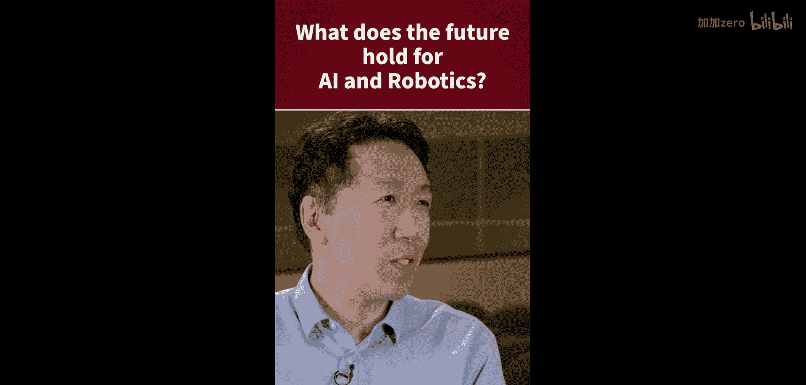
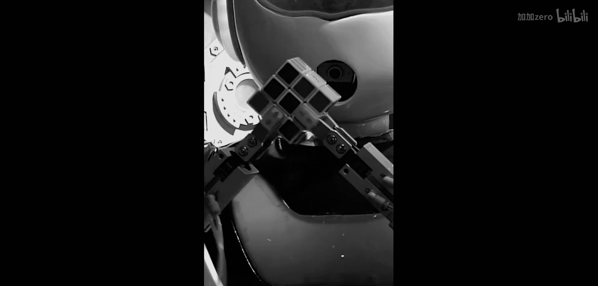
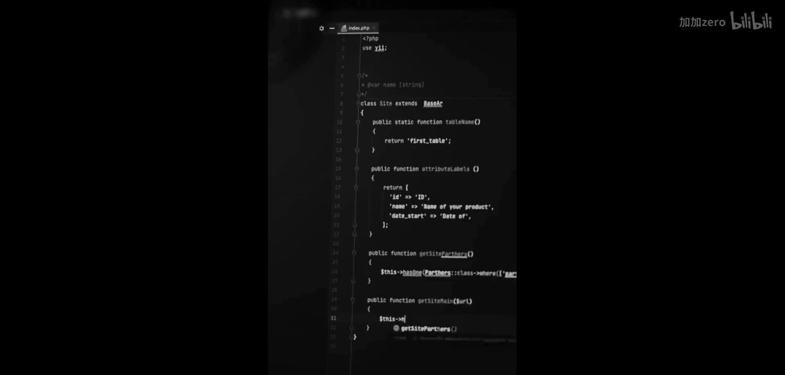
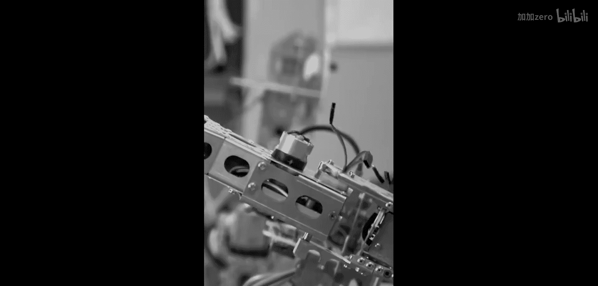
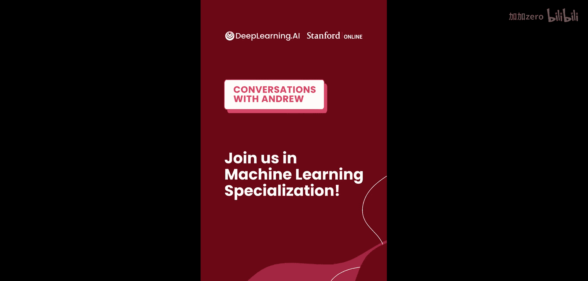

# 010：未来展望 🤖

在本章中，我们将探讨人工智能与机器人学领域的未来发展趋势，重点关注数据共享与规模化训练如何推动机器人技术的进步。

## 概述

上一章我们讨论了机器人学习中的具体挑战。本节中，我们将基于切尔西·芬恩和吴恩达的观点，展望该领域的未来方向。核心预测是，通过跨机构、跨平台的数据共享与规模化训练，机器人系统将能更好地应对现实世界中的多样性与复杂性。

## 未来趋势：规模化数据与泛化能力

我认为该领域将继续显著发展。我希望这能说服更多人相信，这种范式对机器人学也极具前景，尤其是在处理世界上物体和环境的巨大多样性方面。

展望未来，我真正感到兴奋的一点是尝试在更广泛的数据集上训练机器人。目前，机器人学习领域的很多工作仍是在实验室中为特定项目收集数据，然后在那小规模数据上进行训练。数据规模小是必然的，因为它是为那个特定项目收集的。

因此，我预测至少在未来几年，我们将转向一种新范式：跨机构、跨机器人平台共享数据，并扩大这些系统的训练数据规模，从而使它们能够实现更广泛的泛化。

以下是实现这一愿景可能涉及的几个关键转变：

*   **数据共享**：打破实验室间的数据孤岛，建立共享数据集。
*   **平台标准化**：推动不同机器人平台的数据格式与接口标准化，以方便整合。
*   **规模化训练**：利用海量、多样化的数据训练模型，其核心目标可以表示为 **提升模型在未见过的任务和环境中的性能**。

## 总结

本节课中，我们一起学习了人工智能与机器人学的一个重要未来方向。关键在于从依赖小规模、特定项目的数据，转向构建大规模、共享的数据生态系统。通过这种方式，我们有望开发出适应能力更强、应用范围更广的机器人系统。