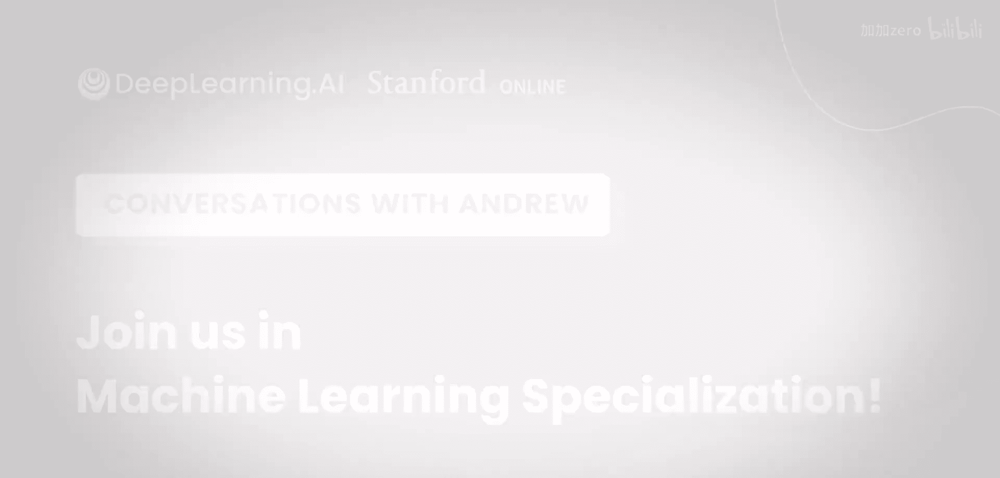

# 011：AI职业适合我吗？🤔

在本章中，我们将探讨一个普遍存在的疑问：我是否适合从事人工智能和机器学习领域的工作？我们将通过李飞飞教授和Andrew Ng的对话，了解他们进入AI领域的个人经历，并分析AI行业对人才背景的开放性。

---

## 概述

如今，各行各业的人都在进入人工智能领域。尽管如此，人们有时仍会疑惑：AI对我来说是正确的道路吗？事实是，如果我在20多年前就能进入AI领域，那么今天任何人都可以进入。因为AI已经成为一项如此普遍且具有全球影响力的技术。

上一节我们提到了AI领域的广泛吸引力，本节中我们来看看两位顶尖AI研究者的亲身经历，了解他们是如何开启AI生涯的。

## 从物理学到人工智能的转变

Andrew Ng最初学习的并非计算机科学或人工智能，而是物理学。那么，他是如何完成从物理学到AI的转变的呢？

物理学曾是我从初中、高中到大学一直以来的热情所在。物理学至今教会我的一件事，就是对提出宏大问题的热情，以及对追寻“北极星”（指引方向的目标）的热情。

我做过的一件事，就是阅读20世纪伟大物理学家的故事和著作。一个非常有趣的发现是，在这些伟大物理学家职业生涯的后期，他们的许多著作不再仅仅关乎物理世界，而是开始思考同样大胆的问题，例如生命、智能以及人类的处境。这让我对“智能”这个话题产生了极大的好奇心。

以下是促成这一转变的几个关键因素：
*   **对宏大问题的热情**：物理学培养了他探索根本性问题的思维方式。
*   **广泛的阅读**：通过阅读物理学家的后期著作，他的兴趣从物理世界扩展到了生命与智能等跨学科领域。
*   **实践探索**：大学期间，他在几个实验室实习，特别是与视觉相关的实验室，这让他亲身体验到AI研究的魅力。

一件事导致另一件事。大学期间，我在几个实验室实习，特别是与视觉相关的实验室。我当时的感觉是：哇，这（研究智能）是一个与“宇宙的起源”或“物质由什么构成”同样大胆的问题。这促使我从本科的物理学转向了研究生阶段的AI研究。

## 进入AI领域的当代机遇

因此，我认为今天进入智能科学领域、学习AI是非常令人兴奋的。

## 总结

在本章中，我们一起学习了AI职业道路的包容性。关键要点在于，进入AI领域并不一定需要传统的计算机科学背景。对根本性问题的好奇心、跨学科的视野以及实践的探索精神，都是开启AI生涯的重要动力。正如Andrew Ng的经历所示，从物理学等其他领域转向AI不仅是可能的，而且其培养的思维模式可能成为独特的优势。