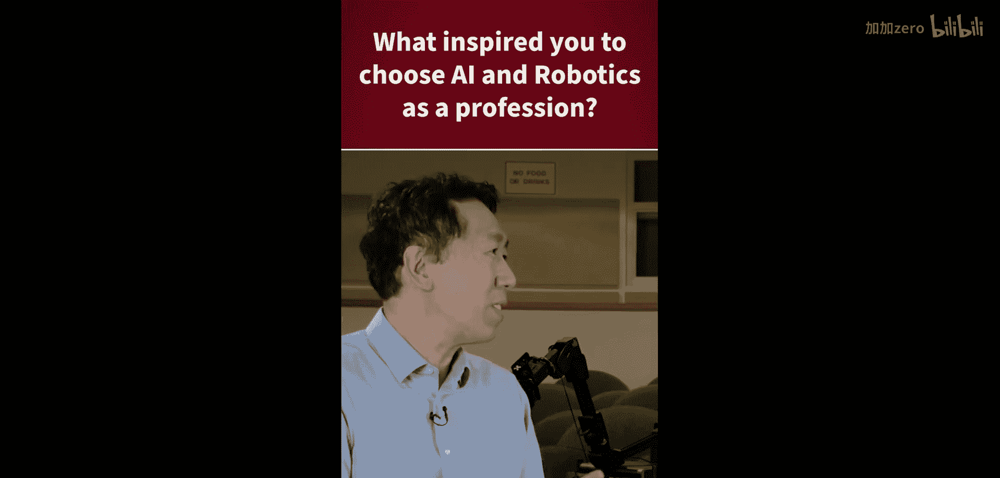
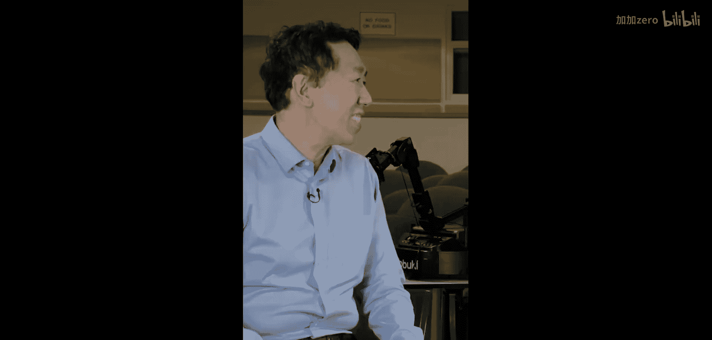
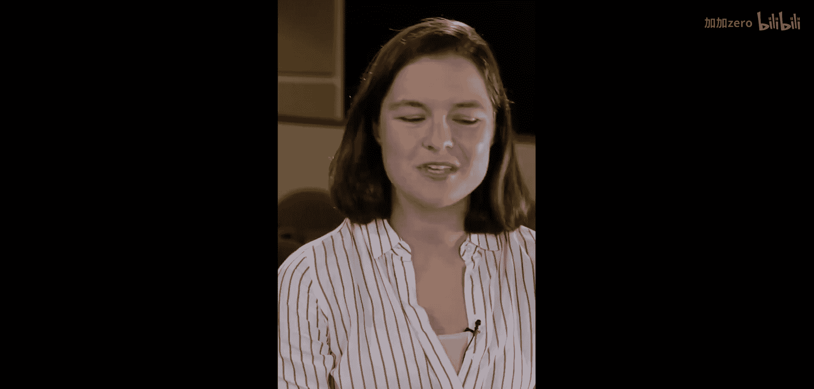
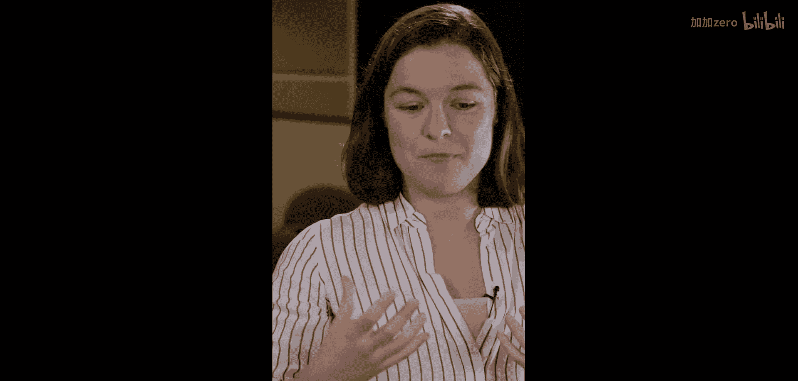
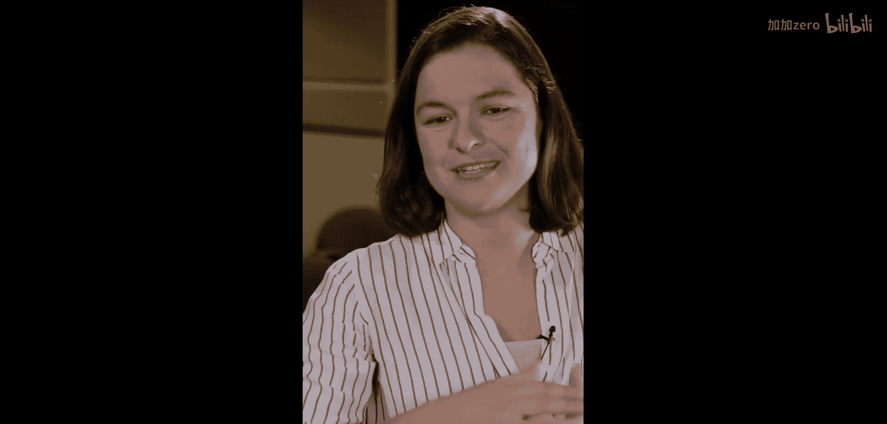
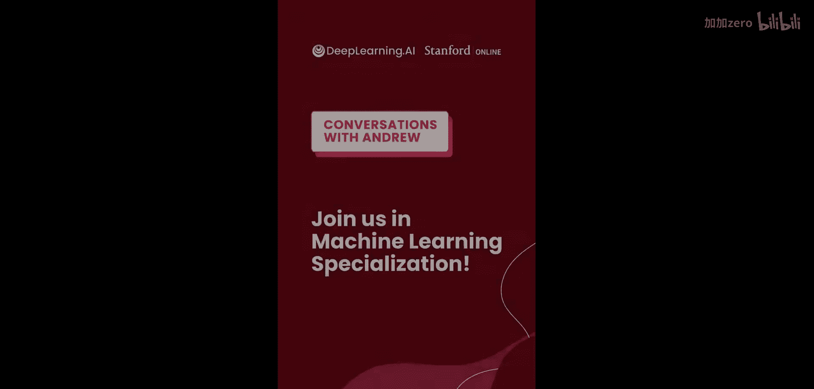

# 012：从兴趣到专业

在本节课中，我们将通过切尔西·芬恩的分享，了解她选择人工智能与机器人学作为职业的思考过程。我们将学习如何从广泛的兴趣中聚焦，并理解计算机科学作为基础学科的强大灵活性。

## 概述

切尔西·芬恩在职业选择初期，曾考虑过从生物学到航空航天等多个领域。最终，她选择了人工智能与机器人学。本节将解析她做出这一决定的关键因素，特别是计算机科学所提供的核心优势。

## 广泛的兴趣与工程学的吸引力

切尔西最初被工程学吸引，因为她热衷于解决难题。在众多工程学科中，她首先注意到了计算机科学。

## 选择计算机科学的核心原因

计算机科学最吸引她的地方在于其**灵活性**。这门学科赋予人们通过软件和代码构建各种事物的能力。这种能力可以表示为：

**能力 = 软件 + 代码**

这意味着掌握了计算机科学，就拥有了进入多个前沿领域的通行证。

以下是计算机科学灵活性带来的可能性：
*   可以进入生物学领域进行研究。
*   可以投身于机器人学进行开发。
*   可以实现各种激动人心的创新项目。

## 人工智能的具体挑战

除了灵活性，一个具体的挑战也深深吸引着切尔西：如何让计算机像人类一样“看”世界。这涉及到两个核心问题：
1.  让计算机能够理解图像中的内容（**图像感知**）。
2.  让计算机能够根据感知在现实世界中采取行动（**行动决策**）。

上一节我们探讨了计算机科学的灵活性，本节中我们来看看这个具体挑战如何将兴趣最终引向人工智能。

## 总结

本节课中我们一起学习了切尔西·芬恩的职业选择路径。她的经历表明，从解决难题的普遍兴趣出发，到被计算机科学的**强大灵活性**所吸引，最终聚焦于“让机器像人一样感知与行动”这一具体而激动人心的挑战，是通往人工智能与机器人学专业的一条清晰道路。关键在于找到基础技能（编程与算法）与终极愿景（如智能机器）之间的连接点。