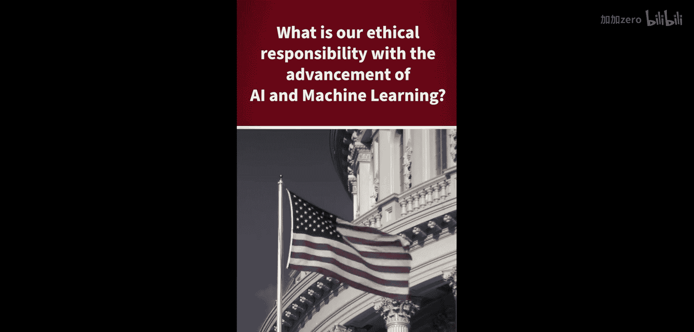
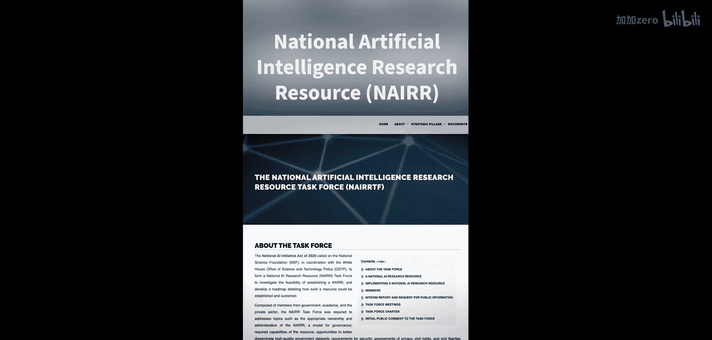

# 013：AI伦理责任与政策倡导

在本章中，我们将探讨人工智能领域的伦理责任，并了解如何通过政策倡导来引导AI技术向积极方向发展。我们将重点关注李飞飞教授分享的关于推动政府制定更好AI法规的经验。

---

你正在进行的一项非常有趣的工作，是领导多项努力，帮助教育政府，推动制定与AI相关的更好的法律和监管。我们很想了解更多这方面的信息。

硅谷有一种文化，认为我们只需不断创造事物，法律自然会跟上。但AI正在影响人类生活，有时是负面影响。我们讨论公平性，讨论隐私。

作为一所顶尖大学，我们推动了一项名为“国家AI研究资源”的法案。这项法案呼吁成立一个特别工作组，为美国的公共部门制定路线图，以增加他们获取AI计算资源和AI数据的机会。这不是一项监管政策，而是一项激励政策，旨在建设和振兴生态系统。

上一节我们介绍了通过政策激励来构建AI生态系统的理念，本节中我们来看看推动此类政策的具体行动和考量。

---

推动AI政策需要多方面的努力。以下是几个关键的行动方向：

*   **教育与倡导**：向政策制定者普及AI技术的基本原理、潜力与风险，是制定明智政策的第一步。
*   **跨领域合作**：将技术人员、伦理学家、法律专家和社会科学家聚集在一起，共同为政策制定提供全面视角。
*   **制定路线图**：通过成立特别工作组，为公共部门如何获取和利用AI资源制定清晰的、可执行的计划。

---

在本章中，我们一起学习了AI技术发展伴随的伦理责任，以及通过教育倡导和制定激励性政策（如“国家AI研究资源”法案）来引导AI积极发展的重要性。关键在于主动构建健康的技术生态系统，而非被动等待监管。