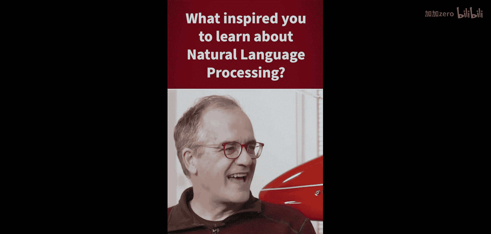
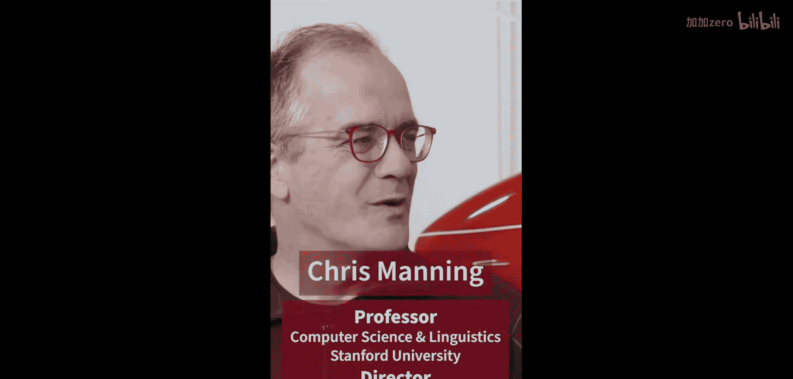
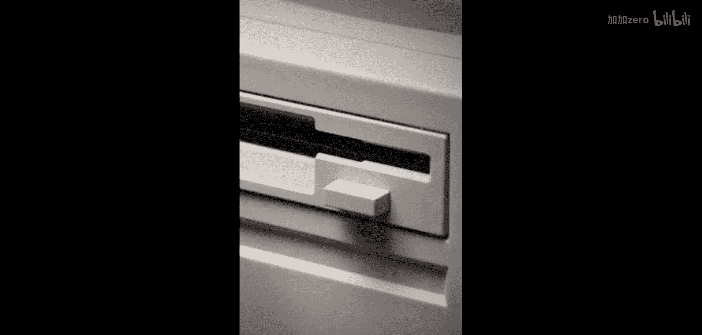
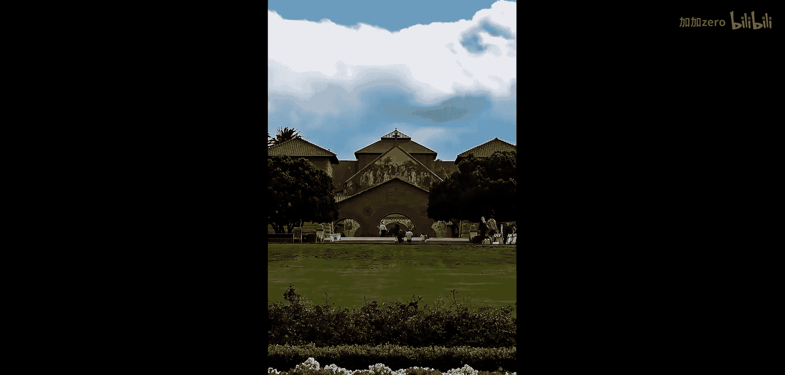
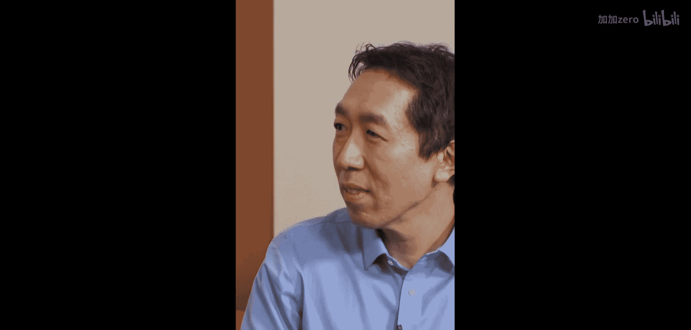
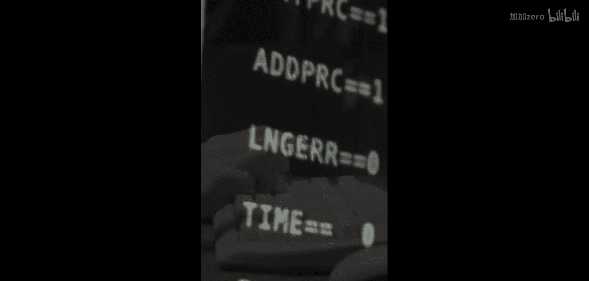
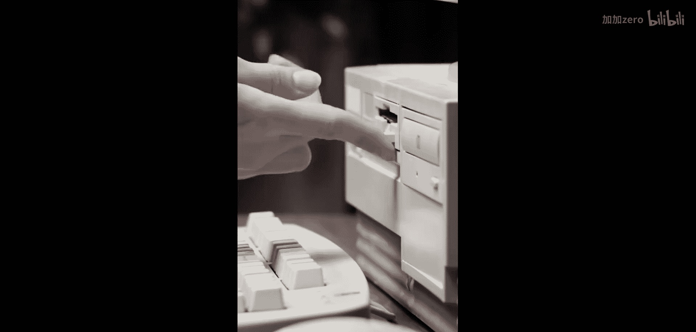
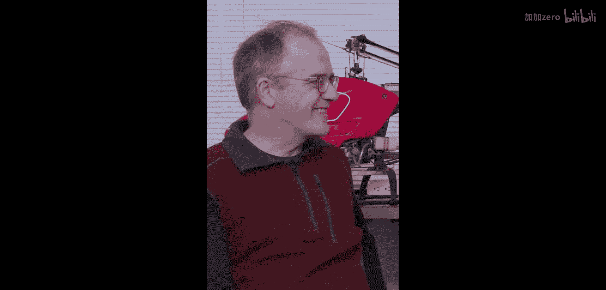

自然语言处理入门：01：从语言学研究者到NLP研究者的转变之路

在本节课中，我们将跟随斯坦福大学教授克里斯·曼宁的分享，了解他如何从一名语言学学生转变为自然语言处理领域的研究者。我们将探讨这一转变背后的时代背景、个人兴趣以及关键的技术转折点。

---

### **个人兴趣的起点**

最初，我对人类语言及其运作方式非常感兴趣，也对人们如何理解语言充满好奇。与此同时，我对计算机科学也抱有浓厚的兴趣。因此，我的兴趣是混合型的。

上一节我们了解了曼宁教授的个人兴趣起点，本节中我们来看看他学术生涯的具体转折点。

### **学术生涯的转折点**

我最终以语言学学生的身份进入了斯坦福大学。在90年代初，情况开始发生变化。当时，首次出现了大量以数字形式存在的人类语言材料，包括文本和语音。这正好是在万维网爆发式增长之前。

从大量人类语言材料出发进行实证研究，显然能做出令人兴奋的成果。正是这一点真正让我投身于一种新型的自然语言处理研究，并由此开启了我后续的职业生涯。

---

### **时代背景与技术条件**

90年代初是一个关键时期，数字化文本和语音数据的出现为语言研究提供了全新的可能性。以下是当时促成NLP发展的几个关键因素：

*   **数据的数字化**：文本和语音开始以数字形式存储和处理。
*   **互联网的前夜**：万维网即将爆发，预示着信息将以前所未有的规模互联。
*   **实证研究的兴起**：基于大规模真实语言数据的研究方法变得可行。

---

### **总结**

本节课中我们一起学习了克里斯·曼宁教授从语言学转向自然语言处理研究的关键历程。我们了解到，个人对语言和计算机的双重兴趣是内在动力，而90年代初数字化语言材料的出现和互联网的萌芽，则为这种结合提供了历史性的机遇，催生了基于大规模实证数据的新一代NLP研究。

