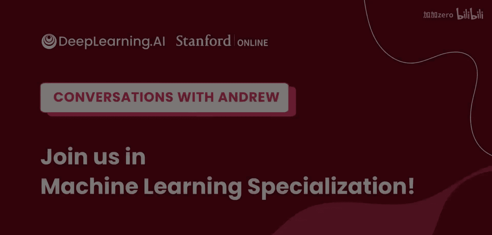

**人工智能入门指南：P16：给初学者的建议**

在本节课中，我们将学习斯坦福大学教授Chris Manning对于希望进入人工智能领域的新手所给出的核心建议。这些建议涵盖了从基础知识到实践技能的关键方面。

---

上一节我们探讨了人工智能的广阔前景，本节中我们来看看如何为进入这个领域打下坚实的基础。Chris Manning教授认为，当前是进入AI领域的绝佳时机。

我们正处于这场由新方法驱动的变革的早期阶段。本质上，软件和计算机科学正在被重塑。在实现更多自动化、更好地利用人类语言材料（或视觉、机器人等其他领域）方面，存在着大量的机遇。

因此，你需要建立良好的基础。以下是构建基础所需的核心要素：

*   **掌握机器学习核心技术**：理解机器学习的核心方法。
*   **学会从数据构建模型**：掌握如何利用数据来构建有效的模型。
*   **掌握错误诊断方法**：学会分析和诊断模型中的错误。

除了这些技术核心，了解一些问题领域的知识也很有用。以自然语言处理为例：

即使人们不再直接将人类语言规则编码到计算系统中，但对语言中会发生何种现象、需要注意什么以及你可能想要建模的内容保持敏感，这仍然是一项有用的技能。

---

本节课中我们一起学习了进入AI领域的关键建议：抓住当前的发展机遇，扎实掌握机器学习建模与诊断的核心技术，并培养对特定应用领域（如人类语言）的敏感度和理解。这些是构建成功AI职业生涯的重要基石。