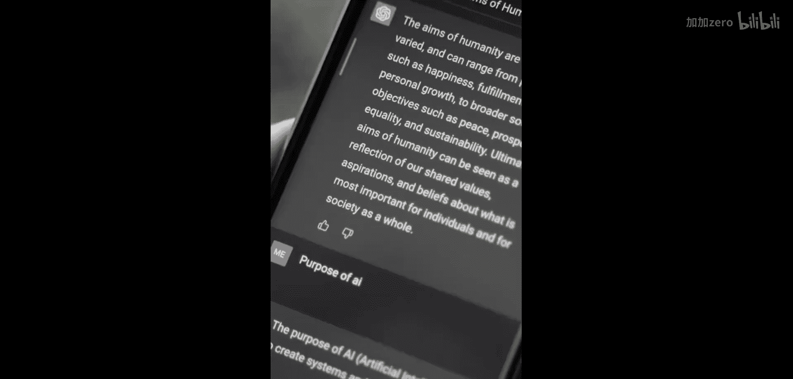

# 017：自然语言处理的未来展望

在本节课中，我们将一起探讨自然语言处理（NLP）领域的未来发展趋势。我们将基于专家观点，了解人类语言如何成为计算机的指令语言，以及这一转变将带来的巨大变革。

## 概述：一个光明的未来

毫无疑问，自然语言处理的未来前景极为光明。我们正在进入一个新时代，在这个时代，人类语言将能够作为一种指令语言，用来告诉计算机执行任务。

上一节我们概述了NLP的广阔前景，本节中我们来看看它与现有技术的区别。

## 与现有语音助手的区别

一种理解这种差异的方式是与现有的语音助手或虚拟助手进行比较。我们大多数人都有过这样的体验：这些助手并非总是表现良好。如果你知道如何用正确的措辞表达，它们就能完成任务；但如果你使用了错误的措辞，它们就无法理解。

以下是现有语音助手的主要局限性：
*   对指令的措辞要求严格。
*   容错能力较低，无法理解自然、模糊的人类表达。

与人类交流时，你通常不需要过多思考措辞。我认为，随着这些模型的发展，我们将开始看到同样的进步。这个时代正在我们面前开启，并将带来巨大的变革。

## 总结

本节课中，我们一起学习了自然语言处理未来的发展方向。核心在于，人类语言将演变为一种更自然、更强大的计算机指令语言，这将极大地改变我们与技术的交互方式。尽管当前技术（如语音助手）在理解自然语言方面仍有局限，但未来的模型将朝着更接近人类交流宽容度和理解力的方向演进。