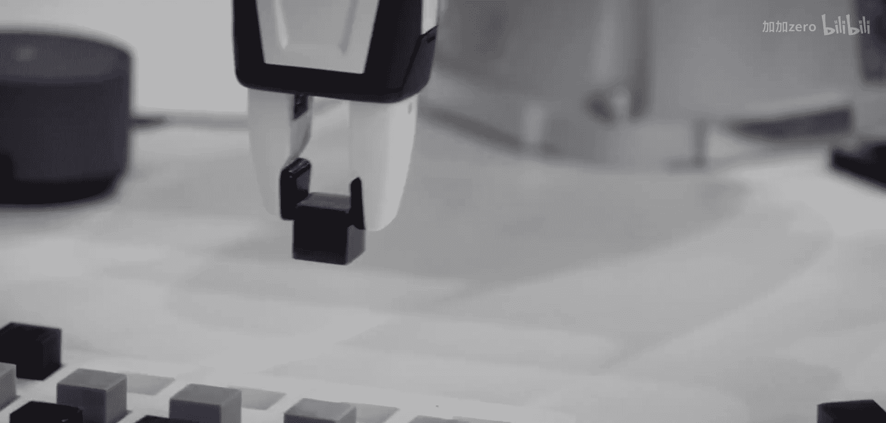

# 018：机器人实验室日常工作

在本节课中，我们将了解在人工智能机器人实验室工作的具体日常流程。我们将跟随研究人员的视角，探索从代码实验到实体机器人操作的全过程。

## 概述

在人工智能领域，机器人实验室的工作融合了算法开发与物理系统交互。本节将详细介绍实验室中的典型工作流程，包括仿真实验设计、模型训练评估以及实体机器人的部署与调试。

## 日常工作流程

实验室的工作与运行机器学习实验并无本质不同。核心流程包括运行代码、训练模型以及评估模型性能。此外，还需要与实体机器人进行交互。

以下是实验室工作的主要组成部分：

1.  **运行代码与训练模型**：研究人员编写并执行代码，以训练特定的机器学习模型。
2.  **评估模型性能**：在训练完成后，对模型的效果进行评估和分析。
3.  **与实体机器人交互**：将训练好的模型部署到机器人硬件上，并观察其实际表现。

## 从仿真到现实

许多项目会从仿真环境开始。这通常涉及设计仿真的各个方面，以验证特定的研究假设。仿真阶段允许研究人员在安全、可控且成本较低的环境中快速迭代想法。

在实体机器人上工作时，流程则有所不同。以下是实体机器人部署的关键步骤：

1.  **设置控制栈**：配置软件系统，确保能够向机器人发送有效的控制指令。
2.  **配置传感器**：设置摄像头等传感器，并确保数据能够被正确采集和记录。
3.  **数据收集与可视化**：研究人员需要查看机器人“看到”的图像，并可视化模型学习到的特征，以深入理解其决策过程。

## 工作的乐趣与挑战

对我而言，这是一个充满乐趣的过程。亲眼看到机器人执行任务，而不仅仅是看到模型准确率等数字，会带来极大的成就感。

然而，这项工作也需要极大的耐心和毅力。机器人系统可能出现故障。过去在操作直升机机器人时，每次坠毁都意味着需要重新建造一个。相比之下，机械臂的“坠毁”频率要低得多，这或许是一个更稳妥的研究方向。

## 总结

本节课我们一起学习了人工智能机器人实验室的日常工作。我们了解到，这项工作结合了算法开发（运行代码、训练模型）与物理系统操作（仿真设计、机器人部署）。虽然过程充满挑战，需要应对硬件故障等问题，但亲眼见证机器人成功完成任务所带来的回报是无可比拟的。