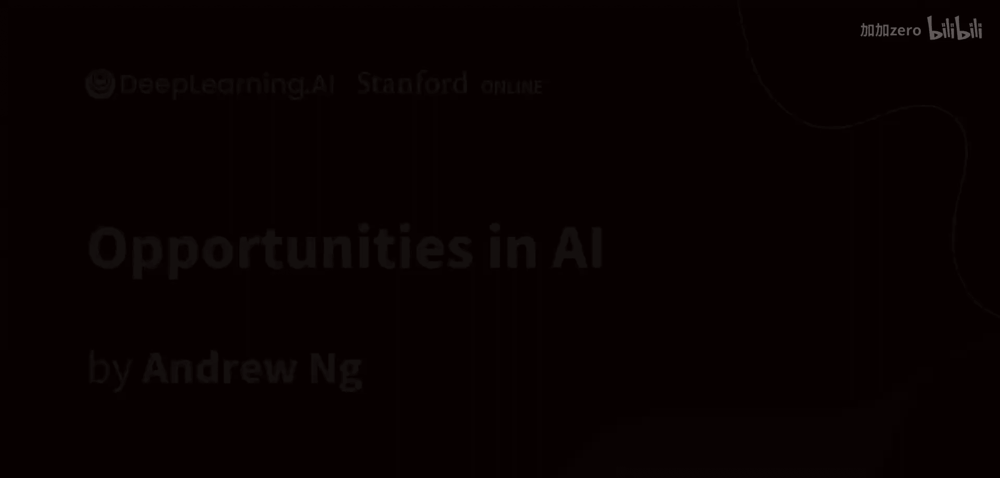
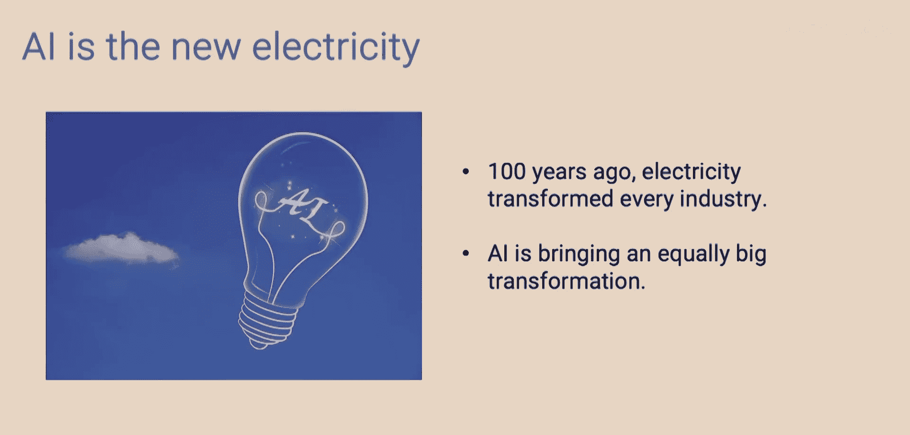
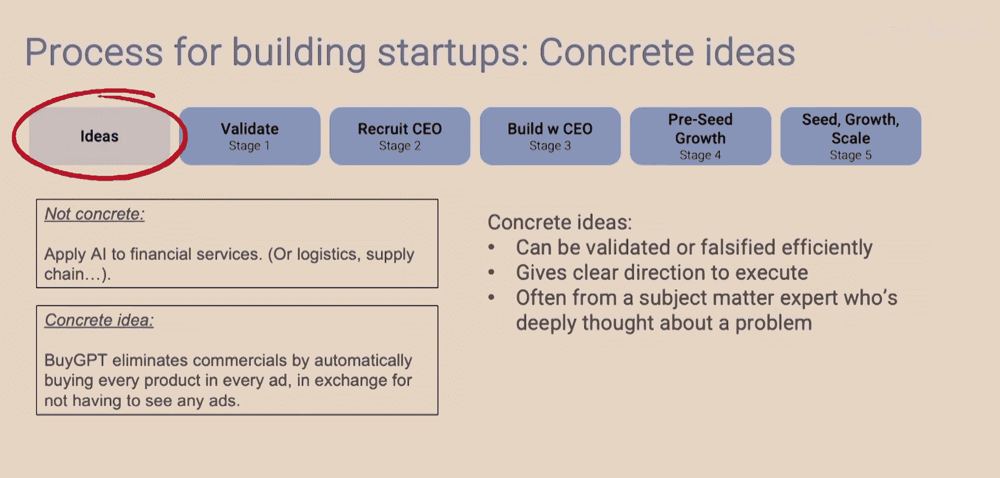
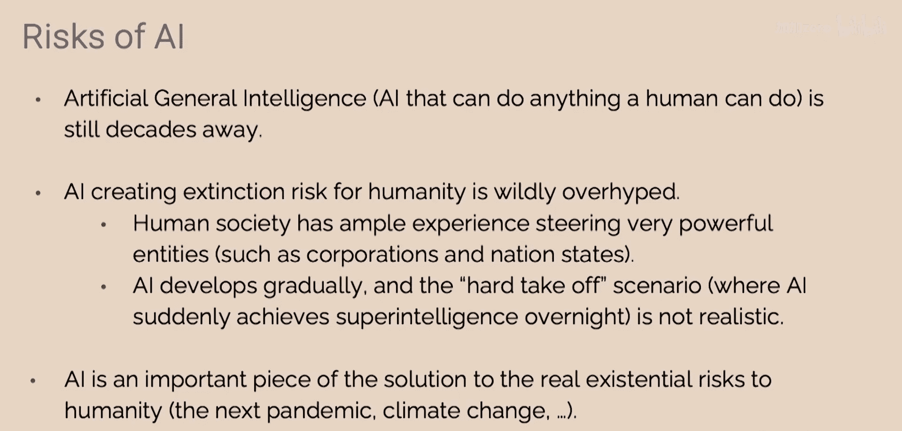
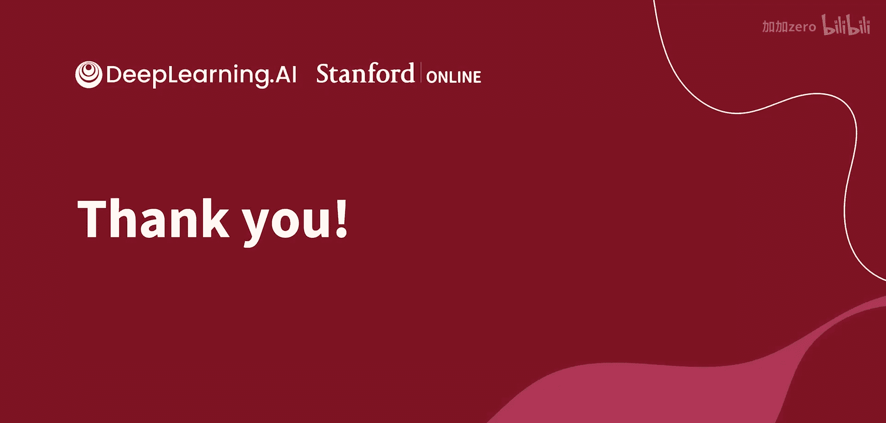

# 019：人工智能技术全景与核心工具




在本节课中，我们将学习人工智能（AI）的技术全景，并重点介绍当前最重要的两种工具：监督学习和生成式AI。




人工智能是一种通用技术，这意味着它并非仅适用于单一任务，而是像电力一样，可以应用于众多不同的领域。理解这一点对于把握AI的机遇至关重要。

## 监督学习：从输入到输出的映射

上一节我们介绍了AI作为通用技术的概念，本节中我们来看看第一种核心工具：监督学习。

监督学习非常擅长识别事物、为事物打标签，或者计算从输入A到输出B的映射关系。其核心公式可以表示为：给定输入A，预测输出B。

以下是监督学习的一些应用实例：
*   **垃圾邮件过滤**：给定一封电子邮件，将其标记为垃圾邮件或非垃圾邮件。
*   **在线广告**：给定一个广告，预测用户点击的可能性，从而展示更相关的广告。
*   **自动驾驶**：给定汽车的传感器数据，标注出其他车辆的位置。
*   **船舶航线优化**：给定一条航线，预测其燃油消耗量，以优化能效。
*   **工业视觉检测**：给定一张刚生产的智能手机照片，检测是否存在划痕或其他缺陷。
*   **情感分析**：给定一条餐厅评论，判断其情感是正面还是负面。

监督学习的一个显著特点是，它并非只对一件事有用，而是可以应用于上述所有领域以及更多其他场景。

## 监督学习的工作流程

以下是构建一个监督学习项目（例如餐厅评论情感分析系统）的具体工作流程：
1.  **收集标注数据**：获取大量带有标签的训练样本。例如，“最好的五香熏牛肉三明治很棒”标记为正面，“服务很慢”标记为负面。
2.  **训练AI模型**：由AI工程团队使用这些数据训练一个模型，使其学习从评论文本到情感标签的映射关系。
3.  **部署与运行**：将训练好的模型部署到云服务上。之后，输入新的评论（如“你吃过的最好的伏特加”），模型即可输出预测的情感（如正面）。

过去十年可以被视为大规模监督学习的十年。我们发现，当使用强大的计算资源（如GPU）训练非常大的AI模型，并为其提供海量数据时，其性能会持续提升。这一方法推动了AI在过去十年的巨大进步。

## 生成式AI：预测下一个词

如果说过去十年是监督学习的时代，那么当前十年则在监督学习的基础上，加入了令人兴奋的新工具：生成式AI。

许多人都体验过ChatGPT等工具。其核心在于，给定一段文本（称为提示词），模型能够生成后续内容。例如，输入“我喜欢吃”，模型可能生成“百吉饼配奶油奶酪和熏鲑鱼”。

生成式AI（至少文本生成类）的核心，实际上是使用监督学习来反复预测下一个词。具体过程如下：
1.  模型从互联网等来源读取大量文本。
2.  它将句子分解为训练数据。例如，对于句子“我最喜欢的食物是配奶油奶酪的百吉饼”，可以创建以下训练样本：
    *   输入：“我最喜欢的食物是”，目标输出：“配”
    *   输入：“我最喜欢的食物是配”，目标输出：“奶油奶酪”
    *   输入：“我最喜欢的食物是配奶油奶酪”，目标输出：“的”
    *   输入：“我最喜欢的食物是配奶油奶酪的”，目标输出：“百吉饼”
3.  通过在海量文本（数千亿甚至上万亿词）上训练一个巨大的AI模型来学习预测下一个词（或词元），就得到了大型语言模型（如ChatGPT）。此外，还有像RLHF（人类反馈强化学习）等技术来进一步调整AI输出，使其更有帮助、更诚实、更无害。

## 生成式AI作为开发工具

许多人将大型语言模型视为出色的消费者工具。然而，一个尚未被充分认识的趋势是，它同样是一个强大的开发工具。

以前，构建一个商业级的监督学习系统（如餐厅评论情感分析）可能需要6到12个月，涉及数据收集、模型训练调优和部署维护。

而现在，基于提示词的AI开发流程则快得多：
1.  **编写提示词**：这可能只需要几分钟或几小时。
2.  **部署到云端**：这可能只需要几小时或几天。

因此，许多过去需要数月才能构建的AI应用，现在全球的团队可能在一周内就能完成。这正在开启一波由更多人构建定制化AI应用的浪潮。

以下是一个使用代码构建情感分类器的例子，展示了其简洁性：

```python
import openai

response = openai.Completion.create(
  model="text-davinci-003",
  prompt="""将下面用三个破折号分隔的文本分类为具有正面或负面情感。

文本：---
在斯坦福商学院度过了一段美妙时光。学到了很多，也结交了很棒的新朋友。
---""",
  max_tokens=10
)

print(response.choices[0].text.strip())
```

如今，全球的开发者可能只需10分钟就能构建出类似的系统。

## 当前与未来的价值分布

本节我们来探讨不同AI技术当前及未来的价值分布。

我认为，目前AI的绝大部分经济价值仍然来自监督学习。对于像谷歌这样的单一公司，其价值可能超过每年1000亿美元。同时，有数百万开发者正在构建监督学习应用，它已经具有巨大价值和发展势头。

生成式AI是令人兴奋的新进入者，目前规模较小，但预计未来三年将增长超过一倍。如果保持接近的复合增长率，六年后其规模将更加庞大。

这些技术都是通用技术。对于监督学习，过去十年及未来十年的许多工作在于识别和执行具体的用例。这个过程也正在生成式AI领域展开。




## 需要注意的短期热潮

在追寻机遇的同时，需要注意短期的热潮。例如，曾风靡一时的AI换脸应用Lensa，它是一个好产品，但它是构建在他人强大API之上的一个较薄的软件层，缺乏长期的防御性，容易被复制或整合到操作系统底层。

这类似于iPhone早期，有人开发了售价1.99美元、用于打开LED灯当手电筒的App。它有用，但并非长期可防御的业务。

真正令人兴奋的是，像iOS和iPhone的崛起催生了Uber、Airbnb、Tinder等具有长期防御性和持续价值的深度应用。随着生成式AI等新AI工具的崛起，我们有机会创建那些真正深入、困难且能创造长期价值的应用。

## 总结






本节课中我们一起学习了人工智能的技术全景与核心工具。我们了解到AI是一种像电力一样的通用技术。监督学习擅长输入到输出的映射，在过去十年创造了巨大价值。生成式AI的核心是基于监督学习预测下一个词，它不仅是一个消费者工具，更是一个能极大加速应用开发的强大开发者工具。我们看到了AI价值在当前和未来的分布，并认识到在追逐长期深度应用机会的同时，需要警惕短期的技术热潮。