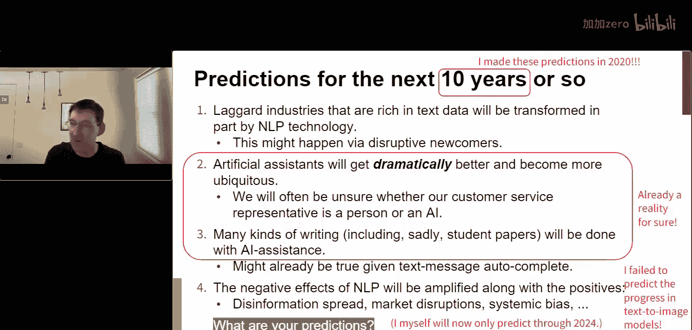
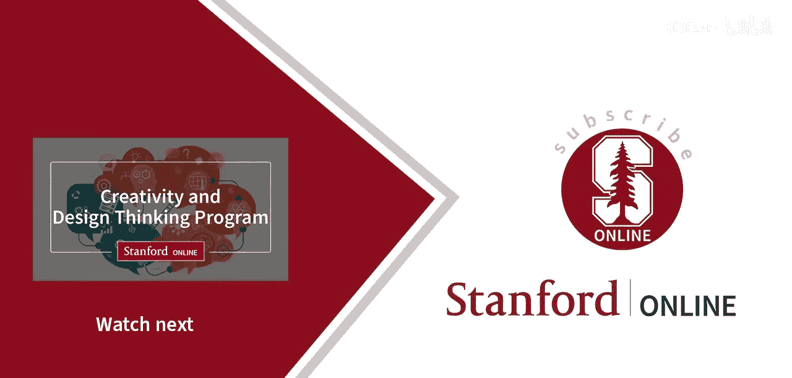

# 020：大型语言模型与上下文学习

在本节课中，我们将学习大型语言模型（如GPT-3）的核心概念、其背后的技术原理，以及它们如何通过“上下文学习”这一新范式改变人工智能领域。我们还将探讨如何在这一快速发展的领域中做出自己的贡献。

---

## 背景介绍

克里斯·波茨教授是斯坦福大学语言学系主任，并在计算机科学系兼任教授。他是自然语言理解领域的专家，并教授相关研究生课程。我们正处在一个自然语言理解的黄金时代，充满了创新与变革。

## 黄金时代的标志

过去十年，人工智能领域取得了惊人进步。如今，我们可以直接使用或通过API调用各种强大的模型。

*   **图像生成模型**：如DALL-E 2、Stable Diffusion，能根据文本生成图像。
*   **代码生成模型**：如GitHub Copilot（基于Codex模型），能辅助编写代码。
*   **搜索技术**：如You.com，正在改变搜索体验。
*   **语音转文本模型**：如OpenAI的Whisper AI，其通用模型性能已超越10年前最好的定制模型。
*   **大型语言模型**：如GPT-3，以及开源的GPT-Neo等模型，能力非凡。

以下是GPT-3模型的一个演示示例。当被问及“斯坦福大学于哪年成立？首批学生何时入学？现任校长是谁？吉祥物是什么？”时，模型能给出流畅且完全正确的答案。这展示了其强大的能力。

模型也在快速迭代进步。例如，GPT-3的Da Vinci 3引擎相比前代Da Vinci 2，在对抗性测试中表现更稳健。当被问及“是否可能雇佣一群狨猴来粉刷房子，并支付它们足够的水果以满足加州最低工资要求？”时，Da Vinci 2被细节迷惑，给出了肯定答案。而Da Vinci 3则给出了更合理的否定回答。这表明模型正朝着更可靠的方向发展。

## 科学创新的速度

这种进步也体现在衡量系统性能的基准测试上。基准被“饱和”（即模型性能达到或超越人类水平估计）的速度越来越快。

*   **MNIST（手写数字识别）**：1990年代推出，约20年后达到人类水平。
*   **Switchboard（语音转文本）**：1990年代推出，约20年后达到人类水平。
*   **ImageNet（图像分类）**：2009年推出，约10年后达到人类水平。
*   **SQuAD 1.1（问答）**：约3年被解决。
*   **SQuAD 2.0**：不到2年被解决。
*   **GLUE基准**：推出后不到一年即被饱和。其升级版SuperGLUE旨在更难，但也在不到一年内被饱和。

这无疑是一个快速进步的故事。即使对人类性能的衡量标准持怀疑态度，我们仍能看到变化速率在急剧增加。

在当下的大型语言模型时代，这种趋势仍在继续。研究表明，当模型规模达到某个临界点时，会“涌现”出执行复杂任务的能力。对于许多旨在挑战最大模型的任务，它们正被逐一攻克。

## 驱动进步的核心因素

上一节我们看到了进步的标志，本节我们来探讨驱动大型语言模型取得巨大进展的几个关键因素。

### 1. 模型规模

一个主要因素是模型的**巨大规模**。模型参数数量呈爆炸式增长。
*   2018年，最大模型约有1亿参数。
*   2019年末至2020年初，模型规模开始迅速增长。
*   2020年末，出现了83亿参数的Megatron模型。
*   随后，GPT-3拥有1750亿参数。
*   如今，一些模型参数已超过5000亿。

为了正确展示这个尺度，我们需要将展示1亿参数模型的幻灯片堆叠5000张。这种规模是巨大的，远超早期的预期。

### 2.  Transformer架构

**Transformer架构**是几乎所有现代语言模型的基本构建块。其核心是**注意力机制**，这使其与此前流行的LSTM等机制有显著不同。Transformer从词嵌入和位置编码开始，通过多层注意力机制和前馈层进行处理。

深入研究Transformer后，人们通常会经历一个过程：最初疑惑它为何有效，然后理解它由许多简单机制组成，最终产生一个核心问题——**为什么它如此有效？** 这仍然是一个开放的研究领域。

### 3. 自监督学习

**自监督学习**是一种通过序列中的共现模式来获取丰富形式和意义表示的强大机制。模型的基本目标是学习为训练序列分配高概率，这纯粹是分布学习。生成文本只是从这个模型中采样，是一个衍生过程。

有趣的是，这些序列可以包含多种符号，如语言、代码、传感器读数甚至图像。自监督学习与标准监督学习的关键区别在于，其目标不涉及任何特定符号或关系，完全专注于学习共现模式。这几乎不需要人工标注，只需海量的符号流。

### 4. 大规模预训练

与自监督学习相辅相成的是**大规模预训练**。早期的词表示模型（如Word2Vec）证明了在海量数据上进行自监督预训练的力量，并且**发布预训练参数**让社区在此基础上构建，极大地推动了有效系统的开发。从ELMo（首个上下文词表示模型）到BERT、GPT，再到GPT-3，规模不断扩大。

### 5. 人类反馈

我们不应忽视**人类反馈**的作用。最好的模型（如OpenAI的Instruct系列）不仅使用自监督学习。它们通常经过两个阶段优化：
1.  基于人类对生成结果好坏的二元判断进行微调。
2.  人类对模型多个输出进行排序，该反馈被用于轻量级强化学习。

这些人类反馈步骤对于模型达到顶尖水平至关重要，也部分解释了模型为何能取得如此成就。

### 6. 提示工程

最后，**提示工程**本身已成为一门学问。从最初直接提问，发展到设计能引导模型进行“逐步推理”的提示。例如，在提示中先说明“这是一场逻辑和常识推理考试”，然后给出推理示例，再提出实际问题，要求模型先阐述推理过程再给出答案。这种方式可以显著提升模型表现。

这就像是在学习如何与“外星生物”沟通。提示工程正在成为一种使用自然语言“编程”AI系统的轻量级方法，这将极大地赋能系统开发和实验。

## 核心研究问题：如何做出贡献？

面对这些庞然大物，研究人员可能会感到担忧：在这个时代，如何为自然语言理解研究做出贡献？我们可以通过一个流程图来思考。

首要问题：**你是否有5000万美元并且热爱深度学习基础设施？**
*   如果答案是**是**，那么鼓励你去构建自己的大型语言模型，这可能会改变世界。
*   但大多数人（包括我本人）的答案是**否**。我们既没有巨额资金，也对深度学习基础设施没有特别热爱。

即使答案为否，仍有大量工作可以做。以下是一些前沿方向：
1.  **检索增强的上下文学习**：结合检索器与语言模型。
2.  **创建更好的基准测试**：这是该领域长期面临的挑战，可能是最重要的工作之一。
3.  **解决“最后一英里”问题**：将AI核心进展转化为对人们生活有积极影响的实际应用。
4.  **实现忠实、人类可理解的模型解释**：为了信任模型，我们需要在人类层面理解它们的行为。

由于时间有限，我们将聚焦于第一个主题——**检索增强的上下文学习**，这是一个所有人都能以多种创新方式参与的领域。

## 深入探讨：检索增强的上下文学习

在深入主要话题前，我们需要理解大型语言模型带来的一个核心范式转变：**上下文学习的兴起**。

上下文学习可追溯到GPT-3论文。其工作方式是：我们向大型语言模型输入一段提示，其中包含背景文本、一个或多个任务演示（示例），最后是实际要回答的问题。模型的目标是从上下文中学习我们期望的行为。

这与**标准监督学习**范式截然不同。以前，对于每个任务（如文本分类），我们都需要创建带标签的数据集并训练定制模型。而上下文学习的承诺是，一个单一的、固定的大型语言模型可以通过不同的提示，服务于无数目标。在提示中，任务标签（如“紧张期待”）本身没有特殊地位，模型需要从文本中理解所有术语的含义和我们的意图。

### 检索增强 vs. “LLM搞定一切”方法

大型语言模型已经革新了搜索领域。但更令人兴奋的是，搜索技术正在反过来革新NLP，帮助我们处理更多需要知识的任务。

以问答为例。传统NLP问答在测试时给定背景段落和问题，答案必须是段落的子串。而**开放域问答**更接近现实：只给定问题，需要依靠检索机制从大型语料库或网络中查找相关证据。这更难，但也更重要。

另一种叙事是“**LLM搞定一切**”方法：没有显式检索器，只有一个大模型直接处理问题并生成答案。这是一个鼓舞人心的愿景，但也存在风险区：
*   **效率**：模型同时充当知识库和语言处理器，导致模型规模爆炸。
*   **可更新性**：世界事实变化时，难以更新大模型的参数。
*   **可追溯性**：用户无法验证答案来源，破坏了搜索技术中用户期望的“可验证”契约。

相比之下，**检索增强方法**结合了语言模型和检索器（检索器本身也是语言模型）。其流程如下：
1.  使用语言模型将查询编码为密集向量。
2.  使用语言模型处理文档集合中的所有文档，得到向量表示。
3.  在语义空间中计算查询与文档的相关性得分，返回排名结果。
4.  （可选）另一个“阅读器/生成器”语言模型可以吸收检索到的段落，综合生成单一答案。

这种方法优势明显：
*   **效率**：参数量可以远小于集成方法。
*   **可更新性**：文档库更新时，只需用冻结的语言模型重新处理文档，即可反映变化。
*   **可追溯性**：保留了文档来源，可以传递给用户。
*   **有效性**：文献表明，检索增强方法通常优于“LLM搞定一切”方法。
*   **信息综合**：保留了生成模型直接满足信息需求的能力。

### 新的系统设计范式

系统设计方式也在快速变化。过去，我们需要用任务特定参数将各种预训练组件（检索器、语言模型等）捆绑在一起，然后进行微调。调试和改进这种复杂系统非常困难。

而现在，我们可能正在进入一个新时代。许多模型原则上可以用自然语言通信。检索器抽象上是输入文本、输出带分数文本的设备，语言模型也是。我们可以通过**提示**让这些模型之间以复杂的方式进行消息传递，从而构建系统。这为系统设计带来了全新的、民主化的方法。

### 广阔的设计空间

以下是一个搜索场景的例子，展示了设计空间有多么开放：
*   **基础**：提示中包含用户问题。
*   **+ 检索背景**：使用检索器为问题查找相关背景段落。
*   **+ 演示示例**：在提示中加入少量演示（QA对），指导模型行为。
*   **+ 检索增强演示**：不是随机选演示，而是用检索器找到与用户问题最相似的演示。
*   **+ 为演示检索背景**：为每个演示也检索相关背景段落，形成信息包。
*   **+ 查询重写**：根据构建的演示重写用户查询，以获得更好的检索结果。
*   **+ 生成后处理**：对模型的生成结果进行过滤（例如，只保留与背景段落子串匹配的答案），或使用更复杂的概率模型（如RAG）最大化利用信息。

我们正在见证一种新的编程模式出现：使用大型预训练组件，通过编写**提示**来设计AI系统，这些提示本质上是关于这些冻结组件之间消息传递的完整程序。

这方面的研究才刚刚开始，我们只探索了这个空间的极小一部分，现有方法都远非最优。这正是可能取得巨大性能飞跃的条件。

## 其他重要的贡献领域

虽然我们聚焦于检索增强学习，但其他领域同样至关重要。

### 1. 数据集与基准测试

贡献新的基准**数据集**始终是最重要的工作之一。数据是进步所依赖的资源。我们需要不断创建更困难、更接近人类真实能力的任务，以避免陷入自我满足的进步假象。

### 2. 模型可解释性与可靠性

在这个产生巨大影响的时代，我们必须认真对待系统**可靠性、安全性、信任、合理使用和社会偏见**等问题。由于这些系统是庞大、不透明的“黑箱”，实现对其行为的**忠实、人类可理解的解释**，是解决上述任何问题的先决条件。

### 3. 解决“最后一英里”问题

基础AI进展带我们走了95%的路，但剩下的5%往往和前面一样困难。以**图像无障碍访问**为例，尽管图像描述生成技术在过去十年进步巨大，但仍无法为视障用户生成真正有用的描述。解决这“最后一英里”需要HCI研究、语言学研究、AI基础进步以及大量新数据的结合。拥有领域专业知识的人可以在此类应用问题上发挥关键作用，产生真正的影响力。

## 未来预测与结语

最后，让我们做一些预测。我在2020年曾做出以下预测，预计其有效期为10年：
1.  拥有丰富文本数据的落后行业将被NLP技术部分改造。
2.  人工智能辅助将变得更好、更普遍，以至于你常常无法分辨客服是人还是AI。
3.  许多类型的写作（包括大学论文）将在AI写作辅助下完成。
4.  NLP和AI的负面影响将与正面影响一同被放大，可能会出现因AI技术误用导致的灾难性世界事件。

然而，仅仅两年后，预测2和3似乎已经成真。另一方面，我完全未能预测到文本到图像模型（如DALL-E 2）的突破性进展。

因此，我的新规则是：只预测到2024年。因为10年后，我们必将处在一个与现在截然不同的地方，但具体如何，无人能知。唯一确定的是，变化将持续加速。

---

## 总结

本节课中，我们一起学习了大型语言模型（如GPT-3）的崛起及其背后的关键技术，包括Transformer架构、自监督学习、大规模预训练和人类反馈。我们重点探讨了**上下文学习**这一新范式，以及**检索增强的上下文学习**如何结合检索器与语言模型，以更高效、可追溯、可更新的方式处理知识密集型任务。我们还回顾了在这一黄金时代做出贡献的多种途径，包括创建基准、提高模型可解释性以及解决实际应用中的“最后一英里”问题。未来充满不确定性，但也充满了让研究者与实践者共同塑造的机会。