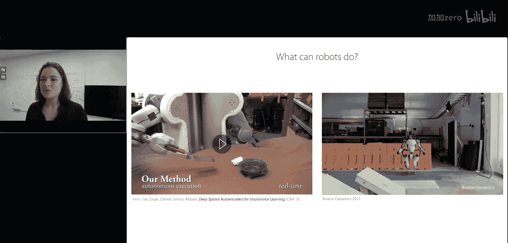
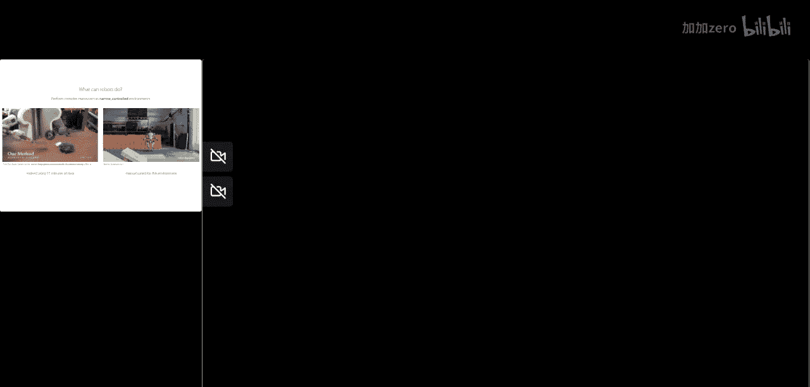
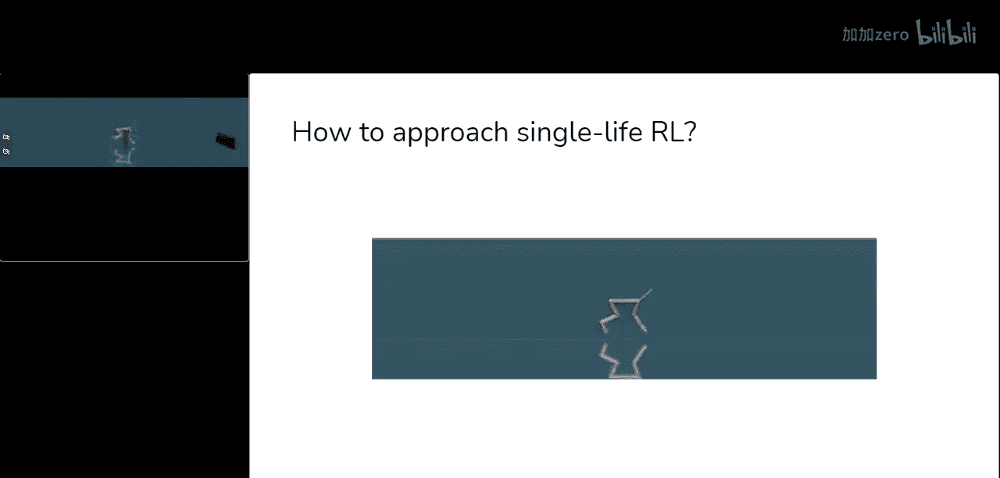
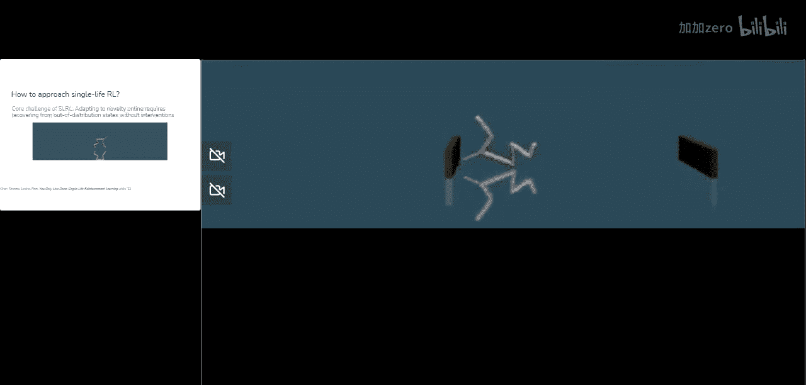
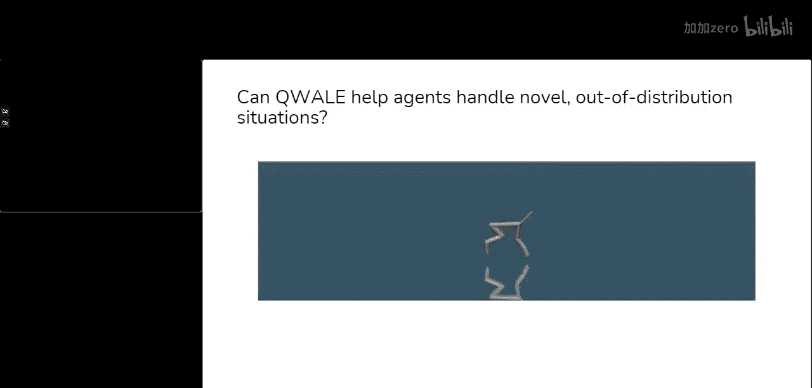
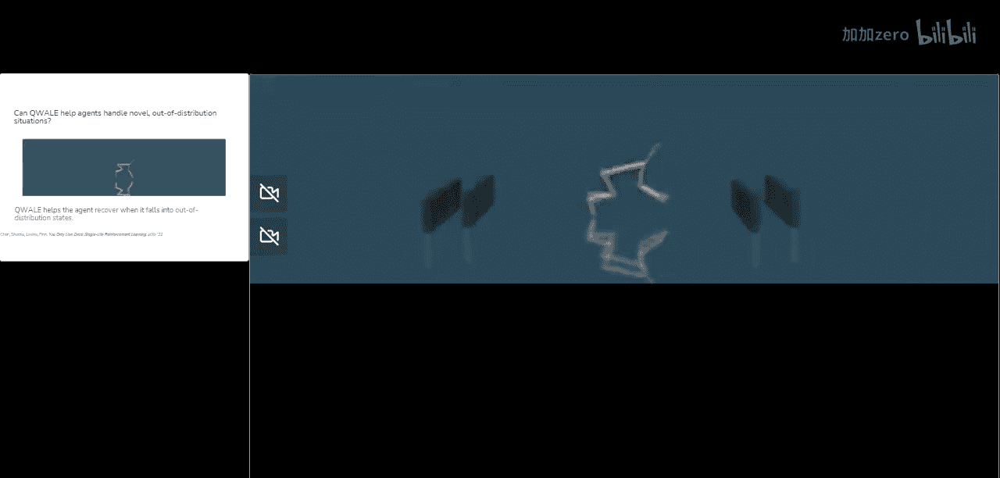
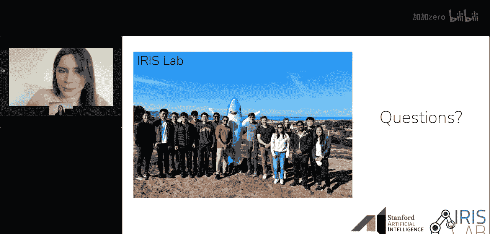

# 021：斯坦福大学切尔西·芬恩讲座

## 概述
在本节课中，我们将学习斯坦福大学助理教授切尔西·芬恩关于机器人深度学习前沿的分享。核心内容包括：如何通过扩大数据集训练机器人实现泛化，以及如何让机器人在测试时适应新环境。我们将探讨当前机器人能力的局限性，并展望通过数据共享和自适应学习来突破这些限制的未来方向。

---

## 章节 1：当前机器人的能力与局限

上一节我们概述了课程内容，本节中我们来看看机器人目前能做什么，以及存在哪些主要限制。

我们见过机器人完成相当复杂的操作任务，例如用铲子将物体舀入碗中。也有来自波士顿动力公司的令人印象深刻的视频，展示了机器人进行类似跑酷的复杂机动动作。

然而，这些令人印象深刻的行为存在一个关键问题。以波士顿动力机器人的行为为例，它无疑令人惊叹，但该行为是针对这一个特定环境进行手动调整的。而那个使用铲子的操作任务，则是在该环境中用15分钟的数据训练出来的。

因此，这些行为都专门针对它们被训练和调整的环境。这意味着机器人学习的是非常狭窄的行为，只能在受控的狭窄环境中执行复杂操作。如果你将这些平台稍微移动一点，或者给机器人一个不同的铲子，该行为最终都会失败。

所以，我真正感兴趣的是，我们如何能让机器人真正走进现实世界，例如家庭、办公室等真实环境，并让它们在这些场景中泛化执行智能行为。

---

## 章节 2：泛化的挑战与两种解决方案

上一节我们介绍了当前机器人的局限性，本节中我们来看看实现泛化所面临的挑战以及两种潜在的解决方案。

棘手之处在于，我们通常在相当狭窄的分布上训练机器人，例如实验室环境。我们的目标是能够将这些机器人部署到现实世界中。从机器学习的角度来看，这意味着泛化到更广泛的分布是相当具有挑战性的，因为训练是在一个对象和环境数量都很少的狭窄分布上进行的。

我认为有两种可能的解决方案，并且两者都非常重要。
第一种是**在更大、更广泛的数据上进行训练**。思考我们是否可以扩展训练机器人的数据规模，使它们能够相当广泛地泛化。可以说，在更大数据集上训练神经网络，是唯一被证实在其他领域（如语音识别、机器翻译和图像分类）实现“野外”泛化的方法。我认为这类方法对于让机器人实现泛化将非常重要且必要。

但我认为仅这样做可能还不够，因为机器人不可避免地会遇到与训练场景略有不同的情况，仅仅因为世界是广阔的，有大量不同的场景、环境和物体等。

因此，我认为第二个非常重要的因素是，思考**机器人如何也能泛化到超出其训练数据的范围**。我们不能指望预测到每一个可能的场景，所以我们要研究的是，是否也能让机器人在测试时进行适应。如果它们能够在测试时吸收少量经验并进行适应和学习，那么它们或许就能真正处理新颖的情况。

所以，**在更广泛的数据集上训练**和**泛化到训练分布之外**，是我将在本次网络研讨会中讨论的两个主要内容。当然，这只是机器人深度学习这个广阔主题的冰山一角，但应该能让你对当今该领域的现状有一个很好的了解。

---

## 章节 3：通过多样化任务训练实现泛化

上一节我们探讨了泛化的总体思路，本节中我们具体看看如何通过让机器人学习多样化任务来实现对新任务的泛化。

首先，让我们思考是否可以让机器人学习许多不同的任务。我们将关注的具体目标是：让机器人能够泛化到一个它没有被专门训练过的新任务。我们希望通过拓宽训练数据分布来实现这一点。

值得一提的是，之前的一些研究工作试图通过例如让机器人泛化到新物体（但所有训练和测试都在“放置”这一单一技能内），或泛化到新的语言指令（但新指令描述的是数据中见过的行为）等方式来实现泛化。

我们想更进一步，研究如何让机器人泛化到跨越广泛技能的不同物体组合。

为了评估机器人是否能执行新任务，我们来看一个例子。假设机器人处于这个场景中，我们想告诉它“将葡萄放入陶瓷碗中”。在这种情况下，机器人看到过的数据会展示如何将其他物体放入陶瓷碗，以及如何用葡萄做其他事情，但它从未见过一个完整的轨迹演示如何拿起葡萄并放入陶瓷碗。为了让事情更难一点，我们实际上只向它展示来自两个不同物体集合的数据，它从未见过葡萄和这个陶瓷碗出现在同一个场景中的数据。

我们将在总共100组任务上进行训练，一个任务对应一种特定的行为或轨迹。这些任务涵盖九种不同的基本技能，包括抓取、放置、推动、擦拭等。这些行为的示例如下视频所示，你可以看到诸如将香蕉放入托盘、拖着陶瓷碗画圈等例子。

这是向机器人展示行为的示例，这些数据是通过使用VR控制器以特定方式移动机器人夹爪来收集的。这是12个不同任务的示例，但我们将展示大约100个不同任务的数据。

收集了这100个不同任务的演示数据后，我们将训练一个神经网络策略。该策略以RGB图像作为输入，输出夹爪期望的目标位置和方向。

因此，这个策略将输出7个数字：3个表示位置，3个表示方向，以及1个表示夹爪的打开和关闭。该策略以10赫兹的频率运行，即每秒接收10次新图像并预测一个新动作。

我们选择这种表示是因为它具有最大的通用性。原则上，这种策略可以根据你训练的数据执行许多不同的任务。重要的是，这个策略还将以任务描述为条件。我们将特别使用语言描述，并使用一个固定的预训练语言模型来获取这些指令的嵌入表示，然后将这些嵌入传递给策略。

一旦我们在多样化数据集上训练了这个策略，为了让机器人泛化到新任务，机器人需要能够：首先正确解释语言命令；其次，视觉识别相关物体和干扰物；最后，将其对指令的解释和所见内容转化为机器人的动作空间。对于一个新任务来说，完成所有这些步骤是相当具有挑战性的。

我们将看到，我们实际上能够获得一定程度的泛化。例如，回到我们之前看的场景，目标是“将葡萄放入陶瓷碗”，我们给出完全相同的语言指令，这同样是一个它在数据中从未见过的任务轨迹，而机器人能够成功完成任务。

同样，真正棒的是，机器人不仅仅能执行一种任务，实际上能够执行许多在训练集中未见过的不同任务，例如将香蕉放在白色海绵上、将瓶子放入托盘、将紫色碗推过桌子等。

现在，让我们看看一些实际评估策略成功率的定量实验。我们预先选择了一组28个任务，这些任务与所有训练数据都不同。然后我们评估了性能。我强调“预先选择”的意思是，我们并非只挑选机器人成功的任务，而是预先选择了一系列完全不同的任务。

所有这些任务都显示在这个大表格中。首先我们看到，对于28个不同任务中的20个，机器人的成功率不为零。所有28个任务的平均成功率约为32%。这表明，首先，机器人确实显示出能够执行它从未见过训练数据的任务的实质性迹象，这非常令人兴奋；但其次，也有相当大的改进空间来实际提升这个数字，从32%向上提高。

那么，你可以问，在机器人执行这些任务的能力方面，改进空间在哪里？为了理解改进空间，我们评估了机器人在训练任务上的性能，分别使用任务的独热编码ID和语言指令作为条件。当然，我们也评估了使用语言条件时在不同任务上约32%的成功率。

首先我们看到，如果我们在训练任务上评估机器人，即评估它被训练去做的任务，其性能实际上只有40%。泛化到新任务只有8%的差距。而真正更大的差距实际上是将这个42%的数字提升到100%。这意味着，真正的瓶颈首先是机器人完成任务的能力本身。

我们可以看看一些失败案例的例子，看看机器人对于那些成功率为0%的任务做了什么。这些视频显示，即使这个策略的成功率为0%，机器人实际上也非常接近完成任务。例如，对于“将香蕉放入陶瓷杯”的任务，它知道拿起香蕉并移向杯子，但没有完全完成任务的最后阶段。对于“用海绵擦拭托盘”的第二个任务，它也明白应该拿起海绵并试图移向托盘，但未能完成任务的最后阶段。

这表明，首先，0%的成功率指标相当严格；其次也表明，仅仅是控制机器人手臂的能力是完成这些任务的主要瓶颈。

这是一个概念验证，表明我们实际上可以让机器人泛化到新任务，这是一个相当令人兴奋的开始。

---

## 章节 4：扩大数据规模与改进模型架构

上一节我们展示了在约100个任务上训练的初步成果，本节中我们来看看如果进一步扩大数据规模会发生什么，以及如何改进模型架构来吸收更多信息。

现在的问题是，如果我们进一步扩大规模会怎样？我们之前研究了大约100个任务。下一步，我们尝试将其扩展到超过700个任务，使用了130,000条这些任务的轨迹或演示。我们发现，如果我们采用之前提到的模型并试图简单地将其变大，这实际上并不一定能提高性能。似乎这种更大的模型架构无法真正吸收这个更大数据中的所有信息。

因此，一旦我们扩展了这个数据集，我们尝试设计一个能更好地捕捉这个更大数据中所有详细信息的架构。

具体来说，我们设计了一个称为“机器人Transformer”的架构，类似于之前的模型，它可以接收输入图像和指令，并输出动作。但有一些重要组件使这个架构能够更好地吸收大量数据。

首先，我们将对输入和输出进行**标记化**，转化为离散的标记。我们将使用**Transformer**作为该架构的一部分，Transformer已广泛应用于自然语言处理，我们发现它在这里也是一个非常有效的架构，能够利用大量数据。由于我们的动作现在通过标记进行了离散化，我们将使用一种**交叉熵风格的目标函数**。

然后，为了读取输入图像，我们将使用一种称为**EfficientNet**的卷积神经网络，以及一个**FiLM架构**来以指令为条件。这个网络的主干将被预训练，然后这些图像嵌入的输出将通过一个**标记学习器**进行标记化。这里我不想深入太多细节。

但最重要的部分是，我们能够在130,000条轨迹上真正训练这个模型，这些数据是在17个月内通过13台机器人收集的，涵盖了700多个任务。我们发现，当我们在场景任务以及包含未见过的干扰物和不同背景场景的任务上评估这个模型时，这个以蓝色显示的模型架构能够显著超越之前的模型架构，包括我们在之前工作中使用的架构，以及由DeepMind开发的Gato风格架构。

这里的要点是，如果我们扩大机器人数据规模，并在这些广泛的数据集上训练这些大型策略，就能让机器人开始以多种不同方式泛化，包括泛化到新任务、场景中的新干扰物以及场景中的新背景。

我们还发布了第一项工作的数据，链接就在这里。

---

## 章节 5：数据共享与社区协作的重要性

上一节我们讨论了扩大数据规模的技术方案，本节中我们从更宏观的角度看看机器人学习研究中的数据共享问题。

我想简要谈到的关于数据集前沿的另一件事，是这种更宏观的图景。通常，在机器人学习研究中，大多数研究的进展方式是：首先，为一个项目收集一个数据集；然后，用那个数据集完成那个项目；接着，在下一个项目中不再使用那些数据，而是为下一个项目收集一个新的数据集。

正如你可能想象的那样，这效率非常低。如果你将此与机器人学之外典型的机器学习研究进行对比，通常，一个数据集（如ImageNet或WikiText）被收集一次，然后被许多不同的研究项目重复使用多次。或者更好的是，我们可能不是重复使用数据，而是重复使用在该数据上预训练的模型，并对该模型进行微调或使用其嵌入表示。

因此，我认为对于整个机器人学习研究来说，转向第二种范式，努力迈向一个跨机构（当然也跨项目）共享数据和预训练模型的场景，是非常重要的。

如果我们能够在机器人学中共享数据和预训练模型，那么我们或许能在出现的真正具有挑战性的研究问题上取得更多进展。例如，想象一下，如果机器学习研究像机器人学习研究那样做，为每个项目重新收集ImageNet，那可能会非常昂贵，计算机视觉可能也不会发展到今天的地步。

那么，我也简要评论一下，目前是什么阻止了我们在机构间共享数据。我认为我们面临一些挑战，我可以打个比方：我认为目前机器人数据领域的状况就像是在这片巨大的海洋中，有许多不同的岛屿。

我们有这些被收集的不同机器人数据集，每个都像一个岛屿，覆盖了整个可能的机器人配置、环境、物体等空间。因为这些数据集不是超级多样化，而且整个机器人硬件、环境等可能空间是如此广阔，这意味着当另一个研究项目试图尝试一项任务或研究一个特定问题时，该项目通常最终会落在这里或那里。这意味着，之前收集的数据集对于实际推进那个新的机器人实验或新的任务、问题或环境并没有用处。

因此，我们目前正在努力做的一件事是，首先尝试看看我们是否可以从许多不同的环境中收集数据，而不仅仅是从一栋建筑。同时，尝试看看我们是否可以有一个更集中的、社区驱动的数据收集工作，使我们能够统一一些设计选择，这样首先我们可以拥有一个更大的岛屿，其次我们可以通过让每个人都同意某些设计选择，将更多人引向同一个岛屿。

我们的目标是从许多不同的真实家庭环境中收集数据，我们最初的目标是大约50个不同的家庭，但实际上我们认为，根据目前看到的兴趣，我们或许能够显著扩大这个规模。我们一直在努力整合来自许多不同大学的人员，以尝试为这项努力做出贡献。当然，如果你有兴趣贡献，请随时联系我们。

---

## 章节 6：超越训练分布：测试时自适应

课程的第一部分讨论了尝试在更广泛的数据集上训练机器人，我们看到了一些零样本泛化到新任务和环境的迹象。但我们也应该尝试在机构间共享数据并更频繁地重用数据，以便让机器人能够进一步泛化，泛化到我们在机器人学之外看到的良好泛化程度。

现在，我也想简要谈谈机器人如何能够泛化到训练分布之外。我们首先在一个简单的抓取问题背景下看这个问题。

训练环境和抓取策略最初是在这种环境中训练的。这是一个箱子，目标是从这个箱子里抓取物体。然后，我们尝试在多种不同的环境中测试该策略，我们实际上特意挑选了一些我们发现策略表现不佳的环境。

这包括：严苛的照明条件、训练中未见的透明物体、棋盘背景，以及一个物理变化——我们实际上将机器人的夹爪移动了10厘米。

在训练环境中，该策略相当成功，成功率为86%。当我们尝试将其置于这些新条件下时，成功率显著下降到32%、49%、50%和43%。

我之前提到过，预测并为机器人可能遇到的任何可能场景做好准备是不可能的。因此，我们要做的是，尝试看看机器人是否能适应在这个新环境中收集的少量数据。

具体来说，情况是这样的：我们有在原始环境中收集的原始数据，我们使用一种称为QT-Opt的强化学习算法来训练一个Q函数和一个在该环境中抓取的策略。这个策略再次获得了86%的成功率。

然后，我们将允许机器人收集非常少量的数据，仅800次尝试，这可以在大约一个下午的时间内收集到。在这个新环境中（本例中是夹爪位移的环境）。然后，我们将获取我们的Q函数，并简单地在这个目标数据上对其进行微调，混合使用基础数据和新数据。

通过这种非常简化的调整程序（这在机器学习的其他领域非常常见），我们看到该策略可以获得约98%的成功率，即使这种环境与训练期间所见完全不同。

我们进行了相当全面的定量评估，研究了各种物理变化和视觉变化。我不想在这里列出所有数字，但一些亮点是：首先，即使在新环境中只有25次新尝试，我们也能看到成功率的显著提高。这里实际上是该策略在其中一个新环境中的视频。在这种情况下，通过大约一个下午的数据，它能够适应这个新场景并成功处理我们施加在机器人上的物理变化。

---

## 章节 7：单次生命强化学习：自主适应新环境

上一节我们展示了在抓取任务中通过少量数据实现自适应的例子，本节中我们探讨一个更普遍的问题：能否让机器人在任何任务中都实现这种自适应？

这都是在抓取的具体背景下进行的，我们看到机器人可以自主收集一些数据来适应新环境。现在，更普遍地说，我们能否为任何类型的机器人任务做到这一点？理想情况下，我们可以让机器人自主收集数据并用收集的数据进行适应，但这里有一点挑战。

挑战在于：如果我们用强化学习收集一条轨迹——机器人尝试任务，收集一条轨迹，然后收集另一条轨迹，依此类推——通常在这种试错过程的强化学习中，我们假设机器人可以多次尝试任务。但一个微妙之处是，如果我们希望机器人自主适应，实际上不清楚它将如何从一条轨迹的最后一个状态回到下一次尝试任务的第一个状态。

在许多模拟环境中，你可以直接重置环境并让它再次尝试。但在现实世界中，如果我们希望机器人在其新部署环境中即时适应，这种重置是不可能的，可能需要人类来做些什么，这阻碍了机器人用少量数据自主适应。

因此，通常的情况是，例如，如果一个机器人试图将冰球击入球门，这个机器人实际上无法物理地将冰球移回原位，通常人类会在每次尝试之间重置冰球。或者，如果机器人试图学习如何开门，一个人会在每次尝试前关上门。

理想情况下，我们希望能够在没有这类重置的情况下让机器人适应。

你可能会问，也许我们可以直接运行强化学习算法而不重置，就运行那些在有重置时使用的相同算法，也许它们仍然有效。我们尝试了这样做，我们采用了一个非常简单的环境，目标是让这个鱼形智能体在模拟中移动到某个目标。

事实证明，如果你每1000步给它一次重置，它能学会一个高性能的策略。但如果你只每2000步给它一次重置，它在学习过程中就无法达到那么高的性能。如果你给它重置的频率更低，机器人几乎完全无法学会该任务的策略。

因此，也许令人惊讶的是，强化学习算法并不适合机器人完全自主运行的场景。这意味着，如果我们想使用这些算法让机器人在现实世界中的部署测试时进行适应，它们将不太适合。

这促使我们引入了**单次生命强化学习**的问题。与可以反复尝试或重置的情节式强化学习，或者可以学习如何执行任务和撤销任务的免重置强化学习不同，我们要研究的是这样一种场景：我们有一些先前的经验，因此机器人可能已经利用这些先前经验学会了一个好的策略。然后，智能体在测试时面临一个新环境，其目标是在该新环境中，在没有任何人类重置的情况下，在一个单一的情节内完全自主地完成任务。

更简洁地说，给定训练环境中的先前数据，机器人或智能体只有一次生命在新场景中自主完成任务。

我们开始在一个非常简单的模拟环境中研究这个问题。我将展示一些在HalfCheetah环境中的例子，例如，在训练期间，它只需要向前跑，而在测试时，它会看到一个与训练期间所见完全不同的场景，具体来说，会有一个障碍物使其更难向前推进。

我们的目标实际上是让机器人能够在测试时在一个单一的情节内找出如何适应。

那么，我们如何着手解决这个问题？首先，我们尝试在这个环境中运行机器人，其目标是到达绿色方块。它是在一个没有任何障碍物的环境中训练的。

我们在这里所做的是在模拟环境中运行机器人，并使用强化学习对其进行微调，试图让它更新其策略并最终到达绿色方块。理想情况下，我们看到它实际上有点卡住了，它被撞得四脚朝天，挣扎着向前推进，首先需要弄清楚如何站起来，然后弄清楚如何越过障碍物到达目标。

因此，这种单次生命强化学习问题的核心挑战是处理这种新颖性，并从这些分布外状态（例如被撞得四脚朝天）中恢复，而无需任何人为干预。

标准的强化学习算法在这种环境中进行微调时，不会鼓励智能体从分布外状态恢复。

现在，我们要做的是：首先，鼓励智能体**朝着先前数据的分布移动**，因为这应该有助于它明白，当它被撞翻时，应该尝试站起来，因为那是它在先前数据中见过的状态。

但我们不想完全这样做。这类先前的方法通常假设有专家演示，并且旨在匹配整个先前数据的分布。相反，我们将让它尝试匹配先前数据，但以一种**由这些状态的估计价值加权**的方式进行。

Q函数或Q值函数将估计状态的可取性。我们可以在先前数据上预训练一个Q函数，然后尝试匹配由这些经验的指数化Q值加权的先前数据。这将驱使它朝着在先前数据中具有良好结果的状态移动。

我们实际上尝试在之前提到的同一个例子上运行这个方法。我们看到，机器人再次试图越过障碍物。理想情况下，它会自己找出如何到达目标，而我们确实看到了这一点。所以它确实有一次翻了个底朝天，但最重要的是，它实际上能够弄清楚如何重新站起来，并且弄清楚如何越过障碍物，最终到达目标。

我们还在其他几个场景上定量评估了这种方法，而不仅仅是我展示给你的那个。我们发现，与使用强化学习进行微调相比，这种以黄色显示的方法在测试时更成功地完成了任务，并且能够以更少的步骤完成。当然，还有很大的改进空间。我认为我们首次引入的这种问题设置实际上可以进一步研究，并有望在长期内让机器人能够适应新环境并处理新颖状态。

总结第二部分，我认为让机器人通过尝试在测试时解决问题和学习来泛化到训练期间未见的新场景非常重要。我们看到了一些初步证据，表明我们或许可以通过鼓励机器人朝着过去见过的先前数据移动来实现这一点。当然，在长期内这成为可行解决方案之前，还有许多重要的研究工作要做。我们正在积极努力将其部署到真实机器人上，以便机器人能够在测试时尝试适应，而不是部署一个静态策略。

---

## 章节 8：超越泛化：实现灵巧复杂操作

上一节我们讨论了泛化和自适应，本节中我们看看机器人研究的另一个重要方向：执行复杂灵巧的任务。

除了泛化，我还想谈到的最后一点是，我也认为让机器人执行非常复杂和灵巧的任务很重要。我们在这场讲座中确实重点讨论了很多关于泛化的内容。但理想情况下，机器人不应该只做非常简单的任务，比如我展示给你的非常简单的运动问题、抓取和拾放任务。理想情况下，我们也能让机器人做更复杂的任务，比如叠衣服，或者需要相当精细操作的任务，例如剥煮熟的鸡蛋。

我认为要做好这一点，我们需要一个数据收集设置，允许机器人完成相当复杂的任务，并且理想情况下，这个设置应该是低成本的，并拥有易于使用的遥操作系统。

这是我们实际上一直在开发的东西。它仍处于早期阶段，但我们开发了一个低成本系统，允许机器人完成相当精细的操作任务，比如打开糖果包装、将扎带绑在电缆上、拉上连帽衫的拉链等等。

这个设置真正酷的地方在于，所有四个机械臂的总成本以及其他部件不到2万美元，这低于单个工业机械臂的成本。我们还计划开源硬件设置以及我们为该系统开发的一些软件。它也很有趣，我认为它将帮助我们超越简单的拾放任务，转向你在这里看到的一些需要灵巧性、需要非常快速动作的任务等等。

我们还有一些初步结果发现，对于其中一些任务，我们实际上可以训练机器人自主完成。另外要提的是，这些机器人成本相当低。我实际上不确定这些低成本机器人能否完成其中一些任务，实际上这些机器人的制造商Trossen Robotics也不知道他们自己的机器人能够完成诸如将RAM插入主板之类的任务。

---

## 章节 9：总结与问答环节

在本节课中，我们一起学习了如何通过训练更广泛的数据集以及让机器人适应训练分布之外的情况，来使机器人实现广泛泛化。我们还探讨了实现复杂灵巧操作的可能性，以及数据共享和社区协作对未来机器人发展的重要性。

以下是讲座问答环节的部分精选内容：

**问：使用的数据集是什么样的？**
答：在第一部分讲座中，数据对应于遥操作演示。这意味着我们使用VR控制器控制机器人，基本上编程让机器人的末端执行器匹配VR控制器的位置。在这个过程中，我们记录机器人摄像头的图像、机械臂的位置（通过所有关节的角度测量，也可以计算机械爪的3D位置和方向），以及发送给机器人的动作指令。通常，你可以将其视为视频加上机器人手臂的低维传感器测量序列。在讲座的第二部分和其他工作中，情况非常相似。我们通常使用RGB图像作为机器人的观察空间。在展示的简单模拟跑步任务中，使用的是所有关节位置等低维数据，但在其他所有工作中，我们都使用图像观察。也可以使用深度、触觉传感器等，不同传感器各有优缺点。但我们发现RGB摄像头（如网络摄像头）是一个非常简单且可扩展的解决方案。

**问：图像处理的优缺点是什么？如何改进？**
答：在所有这些工作中，我们基本上都是端到端地训练神经网络。我们训练一个单一的神经网络，以图像作为输入，输出动作。这意味着没有任何计算机视觉流水线试图在图像中寻找物体。我们实际上只是针对机器人试图完成的任务来监督模型的视觉主干。这样做的一个优点是，这意味着机器人的感知是针对任务优化的。原因在于，如果你想象一个操作水瓶的任务，如果你试图为此开发一个视觉流水线，你可能会尝试精确表示瓶子的3D姿态和形状。不可避免地，视觉系统会有一些失败，无法精确估计所有这些信息。而实际上，为了执行像拿起瓶子这样非常简单的任务，你并不需要精确知道3D位置。通过针对任务优化感知流水线，它可以学习启发式方法和捷径，只表示任务所需的感知信息。

**问：关于跨项目和机构重用数据，您能深入谈谈吗？**
答：我认为开始真正共享数据和预训练模型（理想情况下）至关重要。我的梦想是，至少在短期内，能够开发出类似于BERT或GPT风格的模型，人们可以在机器人上开箱即用。当然，不是用于文本生成，而是用于在机器人流水线中表示动作和图像等，并从这些模型中获取价值。我认为这对社区来说非常重要。当然也有挑战，一个挑战是不同的人使用不同的控制栈和不同的机器人。我们最初的努力是，至少在我们提到的社区驱动工作中，我们试图至少从一个单一的机器人平台和设置开始，然后在环境、物体、任务等方面进行多样化。这至少可以给我们一些确定性，让我们可以专注于社区中许多人使用的平台，风险也小一些。从长远来看，我认为开发对特定硬件更加无关的预训练模型也非常重要，这样也许你不能零样本处理一个新的机器人，但你可以比从头开始更快地启动一个新的机器人平台。

**问：在复杂操作（如剥糖纸）方面，我们离实际应用还有多远？**
答：我们也对这个项目感到非常兴奋，并且正在积极研究。我们实际上将在大约一周后（肯定在未来两周内）发布一篇关于这项工作的论文。我们在这方面的初步进展是，我们已经能够训练神经网络来完成某些类似的任务，特别是像将电池插入遥控器、撕下一段胶带贴在盒子上、给人穿鞋等任务。但也有许多挑战。首先，正如我提到的，我们将开源硬件设置，因此我们希望其他人能像我们一样对这个平台感到兴奋，并实际开发它，或者自己购买、在上面收集数据等。在让策略执行这类任务方面也存在其他挑战。我们遇到的一个挑战是，我们已经能够完成一些任务，比如撕下一段胶带等，但对于其他任务，你需要能够对正在发生的事情做出非常快速的反应。例如，在打开糖果包装时，我们实际上能够让策略完成最初的步骤，比如拿起两边然后拉开，但下一步涉及找到糖果上的翻盖然后打开。在大约50次演示的小数据量下，我们发现机器人无法完成找到翻盖然后打开的下一步。我们认为有了更多数据，我们应该能够处理这类挑战。但也存在需要多少数据的问题，因此我们也试图沿着推动机器人高效应对这些特定场景的能力进行研究。

**问：您认为构建人工智能机器人最有前途的方法是什么？**
答：我认为我今天谈到的那些方法是最有前途的，因为如果我不认为它们最有前途，我就不会研究它们。所以，扩大数据规模确实非常重要，允许机器人适应也非常重要。我喜欢研究机器人，因为它们在现实世界中是具身的，与我们生活的世界互动，并且与语言模型等不同，它们必须应对现实世界中出现的许多真正具有挑战性的事情。我还要提到的是，我谈了很多关于扩大数据规模的问题，我认为我们之前讨论的很多数据都是由人控制机器人收集的。从长远来看，我们真的需要能够自主收集数据并在现实世界中自主运行的机器人。这种自主性出奇地困难，我们发现智能体和机器人经常会卡住，不知道该怎么办。也许我们需要“父母”来帮助机器人，就像孩子有乐于助人的父母一样。总的来说，我认为最有前途的事情是沿着我今天介绍的方向。

**问：对于机器人领域的新手，您有什么建议？如何入门？**
答：我最大的建议是尝试入门，亲自动手。我的第一次工作经历……我在中学时玩过一些乐高机器人，那很有趣，确实介绍了构建一个具有不同组件、传感器、执行器的系统所带来的所有挑战。那是相当容易接触的。后来在大学里，我上了一门机器人课程，那是一门实验课，我们从头开始构建了一个机器人，为它构建了一些传感器，并且……是的，还让机器人执行了各种任务。在我们的研究中，我们大多购买现成的机器人，并真正专注于机器人的“大脑”，我认为这才是真正的瓶颈。我不认为我们受硬件限制那么大。幸运的是，有一些机器人平台变得越来越便宜。有各种移动机器人平台，有几个轮子，比如亚马逊有一个叫Deep Racer的平台，几百美元，还有其他一些平台。如果条件允许，尝试在机器人上实际动手是一个很好的起点。当然，另一个起点是学习更多关于强化学习的知识。正如Pero提到的，我将在春季教授一门深度强化学习课程，网上也有很多资源可以探索这些内容。

**问：您推荐哪些资源来了解机器人领域的最新动态？**
答：在工具方面，我们经常使用的一个物理模拟器是MuJoCo物理模拟器，它是完全开源的。如果你想开始在模拟中摆弄机器人，这可能是一个不错的起点，我认为有一些入门示例，你可以尝试让模拟中的机器人做不同的事情。在了解该领域高层次思想资源方面，Pieter Abbeel（他实际上是我博士导师之一）有一个播客叫“The Robot Brains Podcast”，这是了解该领域各种专家（包括学术界和工业界人士）的好地方。如果你想深入钻研，可以看看机器人会议，比如“Robotics: Science and Systems”和“Conference on Robot Learning”，这两个会议我们都经常投稿，而且它们通常除了论文会议录外，还有会议演讲视频在线提供。另外，我认为各种课程内容也很棒，在某些方面可能比会议视频更具教育性和实用性，因为它们旨在教学，而不是分享最新的研究成果。这取决于你在寻找什么。

---

## 总结
本节课中，我们一起探讨了机器人深度学习的两个核心前沿方向：通过扩大和多样化数据集训练来实现广泛泛化，以及开发在测试时能自主适应新环境的算法。我们看到了在多样化任务上训练能让机器人执行未见指令的初步成功，也认识到数据共享和社区协作对加速进展的关键作用。同时，实现复杂灵巧操作和真正的终身自适应学习仍是充满挑战但激动人心的未来研究方向。机器人要走出实验室，融入我们复杂多变的现实世界，仍需在算法、数据和系统层面持续创新。