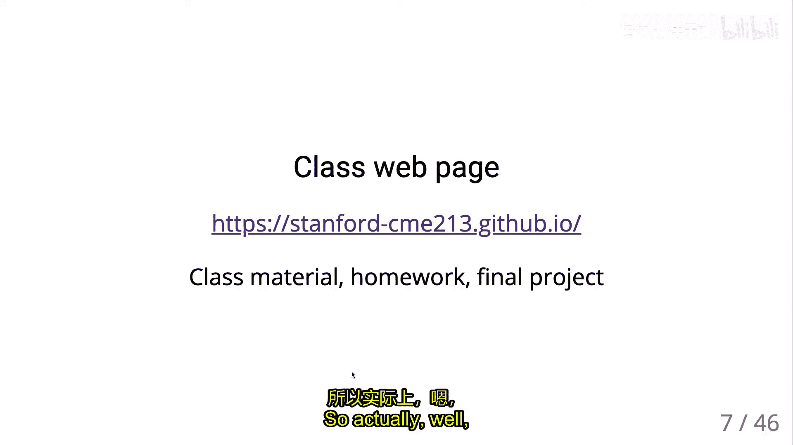
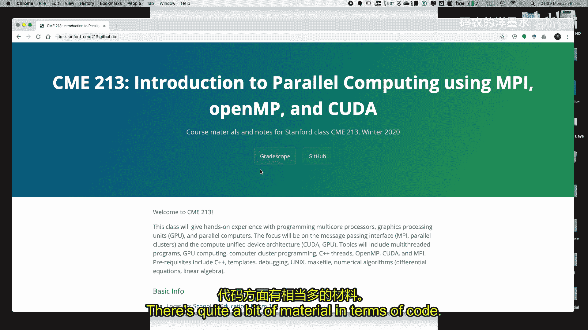
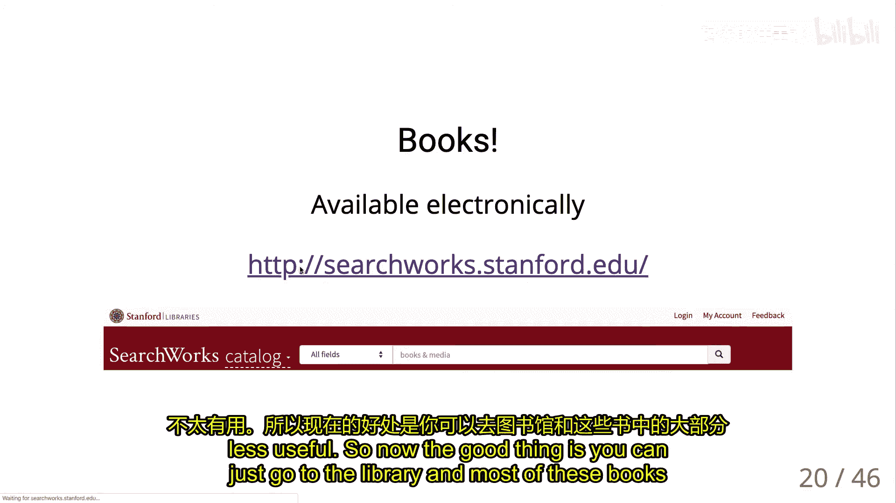
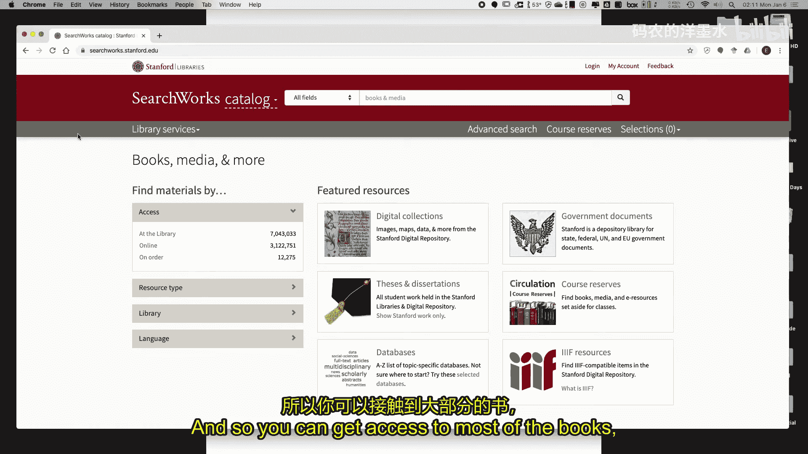
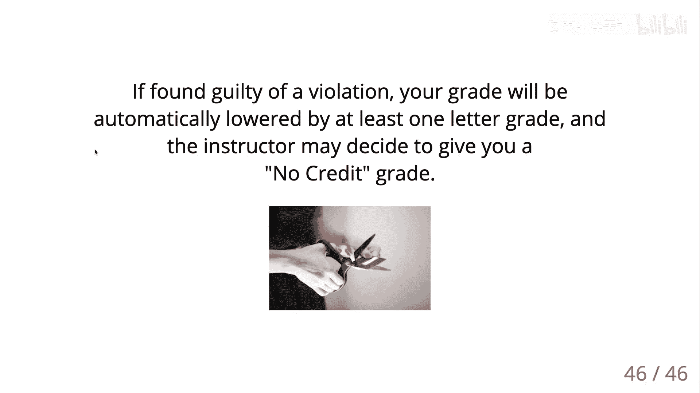

# 001：课程介绍与概述

在本节课中，我们将学习并行计算的基本概念、课程结构、所需工具以及学习目标。课程将涵盖多核编程、GPU计算和分布式计算等核心主题。

## 课程概述

欢迎来到CME 213/ME 339课程，即并行计算导论。本学期将由我（Eric Darve教授）主讲。今天的课程主要是介绍，正式内容将从周三开始。

我是机械工程系的教授，同时隶属于计算与数学工程研究所（ICME）。我的研究方向包括数值线性代数和并行计算。本学期，我们还将邀请我的学生以及英伟达的工程师进行客座讲座，特别是关于CUDA GPU编程的部分。

## 教学团队介绍

以下是本课程的教学助理：

*   **William**：去年也担任了本课程的助教，经验丰富。
*   **King Wei Yang**：去年春季选修了本课程并取得了优异成绩。

两位助教将在办公时间为大家提供帮助。

## 课程时间安排

课程安排在周一、周三、周五。通常，**主要的讲座将在周三和周五进行**。周一的时间通常用于补课或额外的复习课。本学期第一周比较特殊，周一和周三有课，周五将安排一次可选的C++复习课，由William主讲。

## 课程资源与提交

*   **课程网站**：所有课程材料，包括讲义、作业代码和阅读资料，都将发布在GitHub页面上。
*   **课程讨论与公告**：我们将使用Canvas平台进行课程讨论、发布公告和最终的成绩管理。
*   **作业提交**：作业需提交到Stanford的Cardinal系统。你需要将文件复制到你的Stanford主目录，并运行一个脚本进行提交。我们会使用Gradescope进行评分和成绩管理，但**提交的截止时间以Cardinal系统为准**。
*   **在线讨论**：鼓励大家在Canvas论坛上提问，教学团队和其他同学会尽力解答。请注意论坛是公开的，发言时请保持礼貌和专业。

## 课程结构与评分

本课程侧重于学习如何为多核处理器和GPU机器编程。

*   **作业**：共有5次作业，占总成绩的65%。作业每隔一周发布一次。
*   **期末项目**：占总成绩的35%。项目内容是**在GPU上实现一个用于MNIST手写数字识别的神经网络**，并将结合使用CUDA和MPI在多个GPU上运行。这相当于一个规模更大的综合性作业。

**给初学者的建议**：并行代码的调试可能比较耗时。强烈建议大家提前开始作业，不要拖到最后一刻，以便有充足的时间寻求帮助。

## 期末项目预览

期末项目旨在应用课程所学的概念。你将实现一个两层全连接神经网络。项目的核心是在GPU上高效实现矩阵乘法，并学习使用MPI在多个进程和GPU之间协调计算。最终，你的代码将在4个GPU上运行。

神经网络的基本结构如下：
*   **输入**：手写数字图像（像素向量）。
*   **全连接层**：执行密集矩阵乘法，后接非线性激活函数（如ReLU）。
*   **输出层**：使用Softmax函数产生10个类别的概率分布。

虽然这不是一个机器学习课程，但项目将让你实践如何将并行计算技术应用于实际的计算任务。

## 计算资源访问

课程前期作业可使用标准多核处理器。从课程中期的CUDA部分开始，**需要访问GPU资源**。

我们将使用**Google Cloud**平台。学校提供了资助，每位同学将获得代金券来支付云服务费用。你需要按照指南申请GPU配额并配置环境。请注意监控你的云资源使用量，避免在非使用时仍运行实例而产生不必要的费用。

## 参考书目

并行计算领域更新迅速，以下书籍可供参考：

*   **通用并行计算**：
    *   《Introduction to Parallel Computing》
    *   《Parallel Scientific Computing in C++ and MPI》
    *   《An Introduction to Parallel Programming》
*   **多核编程（OpenMP）**：
    *   《The Art of Multiprocessor Programming》
    *   《Using OpenMP: The Next Step》
*   **CUDA编程**：
    *   《Programming Massively Parallel Processors》
    *   《The CUDA Handbook》
    *   《CUDA by Example》
*   **MPI编程**：
    *   《Using MPI: Portable Parallel Programming with the Message-Passing Interface》
    *   《Using Advanced MPI》

**最重要的资源**：对于CUDA，**英伟达官方的编程指南和文档**是最新、最全面的学习材料，强烈推荐。

## 课程技术栈

本课程将围绕三大主题展开：

1.  **多核处理器编程**：首先介绍底层线程概念（Pthreads, C++ Threads），然后学习高级抽象工具**OpenMP**。OpenMP是科学计算中共享内存并行编程的主力工具，能快速将串行代码并行化。
2.  **GPU计算**：学习使用**CUDA**为英伟达GPU编写高性能计算程序。
3.  **分布式计算**：学习使用**消息传递接口（MPI）** 在计算机集群上进行分布式内存编程，以解决超大规模问题。

我们将通过一些经典并行算法（如排序、扫描、归约）和数值线性代数运算来演示这些技术的应用。

## 先修知识要求

为了能顺利学习本课程，你需要具备以下基础：

*   **Unix/Linux基础**：熟悉SSH登录、SCP传输文件、使用编译器（g++）、链接库、使用Makefile等。所有作业都将提供Makefile。
*   **C++编程经验**：需要了解类、内存管理（new/delete）、运算符重载等基础知识。课程不要求非常高级的C++特性（如模板元编程）。
*   **调试经验**：**这是最关键的一点**。你必须拥有系统化调试代码的经验和能力，知道如何编写可测试的代码块，并遵循流程逐步定位和修复错误。缺乏有效的调试方法将使完成作业变得极其困难和耗时。

如果你不具备这些先修知识，强烈建议你先学习相关课程（如CME 211/212），否则在本课程中可能会感到非常吃力。

## 总结

本节课我们一起了解了CME 213并行计算导论的课程全貌。我们介绍了教学团队、课程安排、评分方式以及重要的期末项目。我们明确了学习本课程所需的先修技能和将使用的计算资源（Google Cloud）。从下节课开始，我们将正式踏入并行计算的世界，首先从多核编程的基础概念学起。