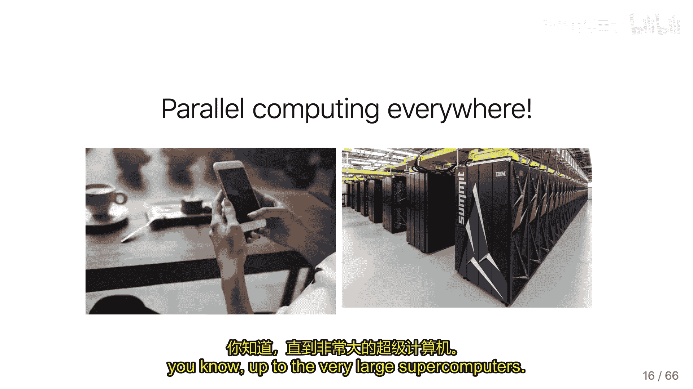
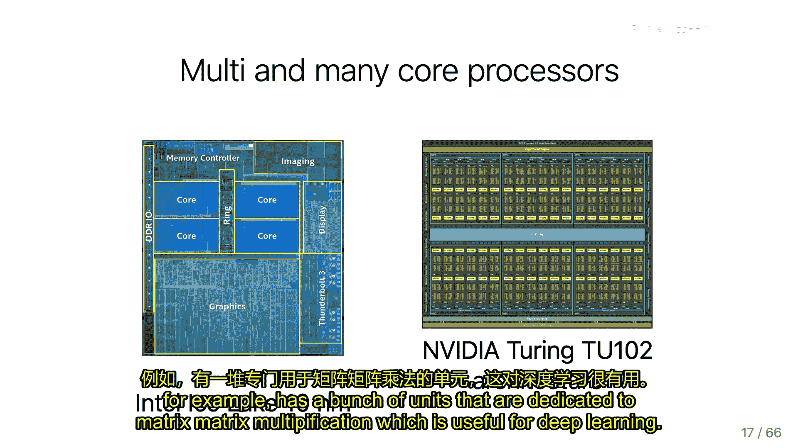
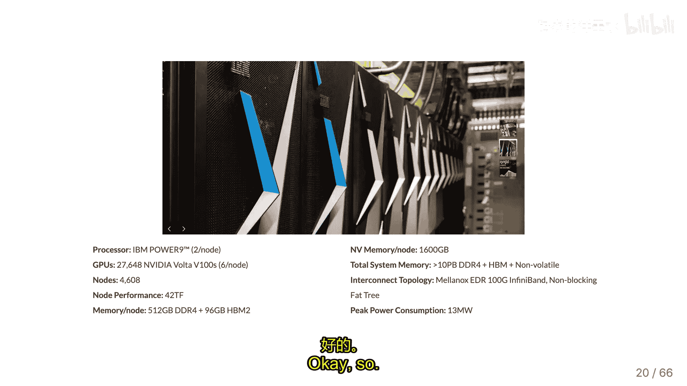
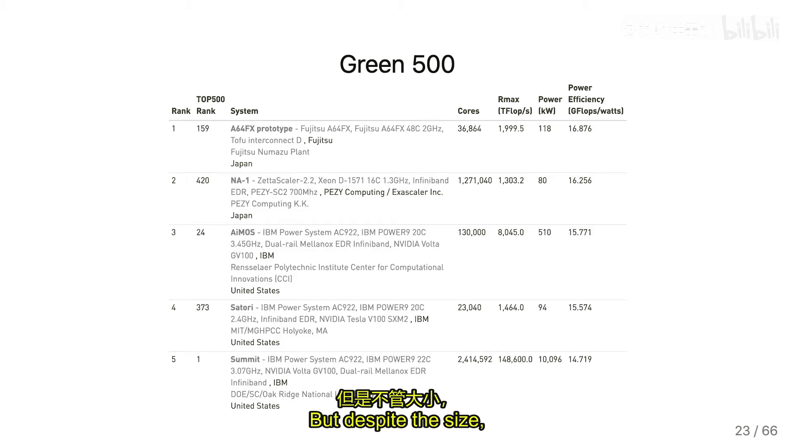
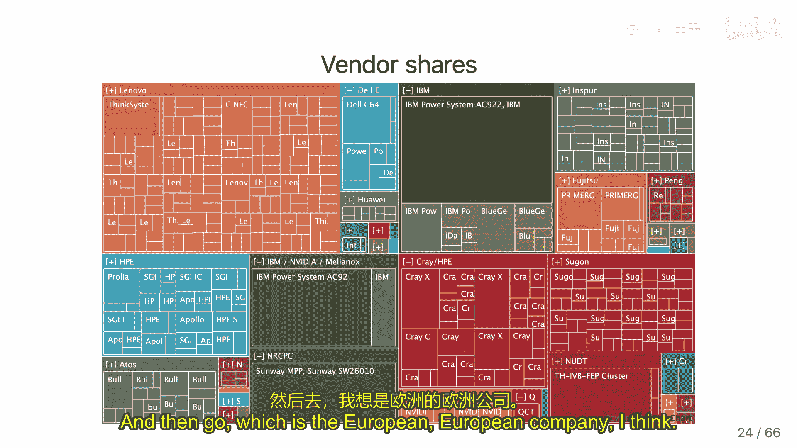
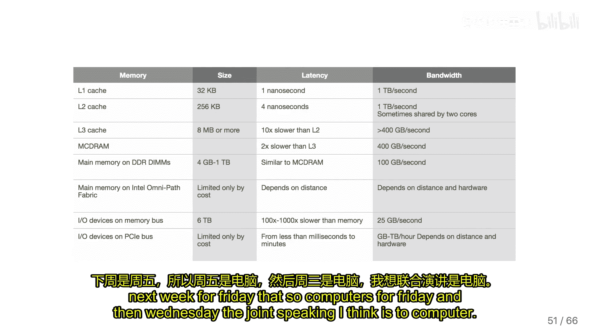

# 002：并行计算基础

## 概述
在本节课中，我们将要学习并行计算的基本概念、历史背景、硬件架构以及一个简单的并行求和算法示例。我们将了解为何并行计算在现代计算中变得至关重要，并初步接触共享内存并行编程模型。

## 课程内容

### 并行计算的历史背景与必要性
上一节我们介绍了课程的基本安排，本节中我们来看看并行计算为何成为必然趋势。

早期，通过提升单个处理器的时钟频率（主频）来获得性能提升是主要途径。程序员更倾向于编写简单的串行代码，而非复杂的并行程序。然而，由于物理限制（如功耗、散热和晶体管尺寸），处理器主频的提升在2005年左右趋于停滞。摩尔定律关于晶体管数量翻倍的预测依然成立，但性能提升必须通过增加处理器核心数量（即并行化）来实现。

这催生了两种主要的并行计算类型：
*   **共享内存并行**：在单个处理器上使用多个核心。
*   **分布式内存并行**：将多台计算机通过高速网络连接起来。

### 现代处理器架构：CPU与GPU
上一节我们了解了并行化的驱动力，本节中我们来看看两种主流的并行硬件设计。

现代处理器主要分为两类，它们针对不同的计算任务进行了优化：

1.  **通用多核CPU**（如Intel或AMD处理器）：
    *   核心数量相对较少（例如4、6或12个）。
    *   每个核心设计复杂、速度快，拥有大容量缓存和多种优化，适合处理通用任务和复杂逻辑。

2.  **专用加速器/GPU**（如NVIDIA GPU）：
    *   拥有成千上万个非常简单的计算核心。
    *   每个核心能力有限，但数量庞大，特别适合执行大量结构规整的简单运算，例如线性代数或深度学习中的矩阵运算。

### 内存墙（Memory Wall）问题
在讨论了计算核心之后，我们需要关注另一个关键瓶颈：内存访问。

内存访问速度的提升远落后于计算速度的提升。这导致了“内存墙”问题。衡量这一问题的关键指标是**计算内存比（Compute-to-Memory Ratio）**：






`计算内存比 = 峰值计算性能 (GFlops/s) / 峰值内存带宽 (GB/s)`

这个比值表示，在等待下一个数据从内存中读取出来的时间里，一个计算单元能执行多少次浮点运算。如果该比值很高，意味着许多应用程序的性能将受限于内存带宽，计算单元会经常空闲等待数据。例如，在矩阵向量乘法中，每读取一个数据元素只进行很少的运算，因此性能完全由内存带宽决定。


优化算法以减少不必要的数据传输，是高性能计算中的核心挑战之一。

### 并行计算系统概览
了解了核心与内存的瓶颈后，我们来看看不同规模的并行计算系统。



并行计算现已无处不在，从智能手机到超级计算机。系统架构多样：





*   **共享内存多核处理器**：如个人电脑和服务器。
*   **GPU加速器**：通过PCIe总线与CPU协同工作。
*   **高性能计算集群**：由大量计算节点通过高速网络（如InfiniBand）互连，结构紧凑，散热和功耗是重大挑战。
*   **云计算平台**：提供虚拟化计算资源，用户按需获取具有特定核心数和内存量的虚拟机器。
*   **顶级超级计算机**：例如Summit系统，拥有数千个节点和数万个GPU，功耗可达数十兆瓦，用于核武器模拟、气候预测等尖端科学计算。

### 并行编程模型：从串行到并行思维
面对如此多样的硬件，编写并行程序与串行程序有根本不同。

串行程序像一条直线，步骤依次执行。并行程序则更像一张有向无环图（DAG），其中：
*   节点代表**任务**（一段串行计算）。
*   边代表任务间的**数据依赖关系**。

这种模型称为**基于任务的并行计算**。系统需要调度这些任务到各个核心上执行，同时满足依赖关系。我们本学期将学习的OpenMP和MPI是更简单但效率稍低的编程模型，而基于任务的模型代表了更先进的并行编程思想。

### 一个简单的并行求和算法示例
为了具体理解并行编程，让我们分析一个经典的例子：并行求和。

假设我们需要计算 `sum = Σ compute(x_i)`，其中 `compute` 是一个计算开销较大的函数。我们想用 `P` 个核心来加速。

**基本策略（朴素版本）：**
1.  **数据划分**：将 `N` 个数据项分成 `P` 个大小近似相等的块。
2.  **局部求和**：每个核心独立计算其分配数据块的局部和 `partial_sum`。
3.  **全局归约**：一个指定的主核心（如核心0）收集所有其他核心的 `partial_sum`，并将其相加得到最终总和。

以下是该策略的简化伪代码逻辑：

```c
// 每个核心（编号为 rank）都执行以下代码
int start = rank * (N / P);
int end = (rank + 1) * (N / P);
float my_sum = 0;
for (int i = start; i < end; i++) {
    my_sum += compute(x_i); // 第一阶段：并行计算局部和
}

if (rank == 0) {
    // 主核心：接收并累加所有局部和
    float total_sum = my_sum;
    for (int r = 1; r < P; r++) {
        float received_sum;
        receive(&received_sum, from_core=r); // 接收数据
        total_sum += received_sum; // 第二阶段：串行累加
    }
    // total_sum 即为最终结果
} else {
    // 其他核心：发送自己的局部和给主核心
    send(my_sum, to_core=0);
}
```

**性能分析：**
该算法的总运行时间 `T` 可建模为：
`T ≈ (N/P) * t_compute + (P-1) * (t_comm + t_add)`

其中：
*   `(N/P) * t_compute`：并行计算阶段的时间，随核心数 `P` 增加而减少。
*   `(P-1) * (t_comm + t_add)`：全局归约阶段的时间，随核心数 `P` 增加而**线性增长**。

当 `P` 很大时，第二阶段的串行累加将成为瓶颈。为了解决这个问题，可以使用**树形归约**算法，将全局累加的时间复杂度从 `O(P)` 降低到 `O(log P)`，这对于GPU等拥有大量线程的设备至关重要。

### 共享内存并行编程模型
最后，我们简要介绍本课程首先涉及的共享内存模型。

在共享内存模型中，多个处理器（核心）通过一个互联网络访问同一块物理内存。程序员可以假设所有核心访问任何内存地址的速度是近似相同的（统一内存访问，UMA）。然而，在现代多路处理器系统中，由于内存物理上分布在不同的“插槽”附近，访问不同位置内存的实际延迟可能差异很大，这被称为**非统一内存访问（NUMA）**，它会使性能分析和优化变得复杂。

共享内存编程相对简单，因为数据交换通过直接读写内存完成，无需显式的发送/接收消息。OpenMP就是基于此模型的编程接口。



## 总结
本节课中我们一起学习了并行计算的基础知识。我们回顾了从提升主频到增加核心数的计算发展史，认识了CPU和GPU两种不同的并行硬件架构，并理解了“内存墙”这一关键性能瓶颈。我们还通过并行求和的例子，体会了并行算法设计的基本思路与性能考量，并初步了解了共享内存并行编程模型。在接下来的课程中，我们将深入实践这些概念，学习具体的并行编程工具。