# 003：C++ 线程

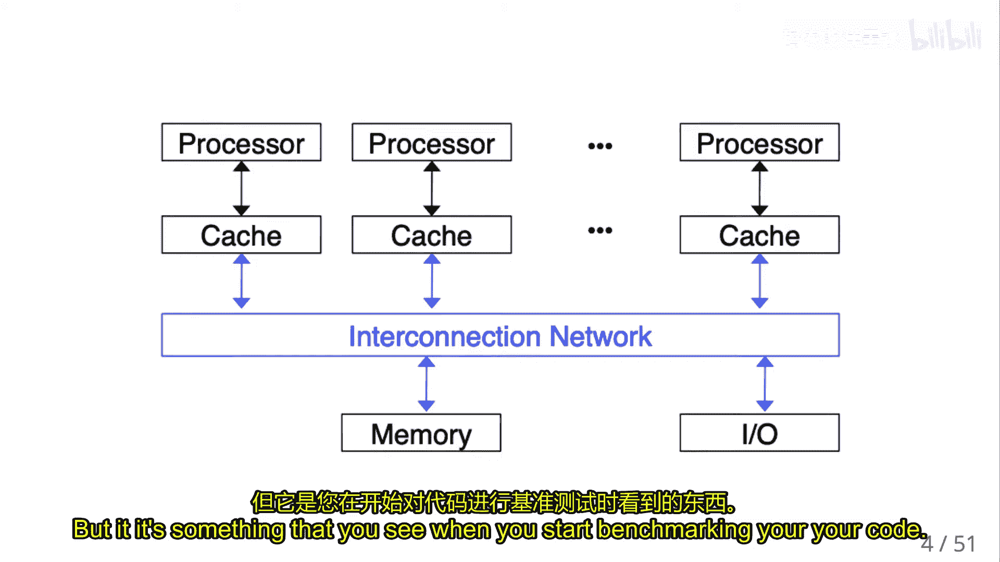

在本节课中，我们将要学习共享内存多处理器编程的基础概念，特别是如何使用 C++ 线程库来创建和管理并行执行的任务。我们将从硬件架构的简要回顾开始，逐步深入到线程的创建、同步、数据共享以及如何避免常见的并发错误。

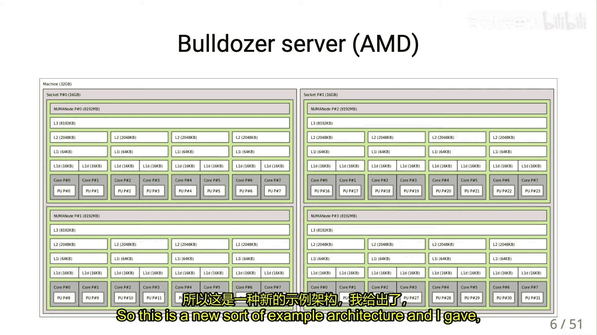

## 共享内存架构回顾

上一节我们介绍了并行计算的基本概念，本节中我们来看看共享内存机器的具体架构。在共享内存多处理器中，所有处理器核心共享同一块物理内存。

当为这种计算机编程时，逻辑上非常简单：只有一块大内存，问题仅在于你读写的是哪个内存地址。然而在现实中，连接内存和计算单元（及其寄存器文件）的网络具有一定的复杂性，在优化共享内存机器的代码时需要考虑到这一点。

我们主要关注两种架构类型：
*   **统一内存访问**：所有处理器拥有自己的本地缓存，内存位于一侧，通过一个网络连接到所有处理器。内存看起来是“平坦”的，无论读写哪个位置，性能大致相同。
*   **非统一内存访问**：某些处理器拥有“近端”内存，访问速度更快。如果需要访问内存的其他部分，则必须经过网络，因此会产生延迟。根据访问的内存地址不同，带宽表现也不同（本地空间快，远端空间慢）。

对于程序员而言，编写的程序代码是完全相同的。但在解释性能结果以及实现能利用此特性的代码时，需要考虑 NUMA 的影响，这在基准测试代码时会显现出来。

下图展示了一个 NUMA 服务器的复杂内存层次结构示例：


例如，一个核心可以非常快速地访问其 L1 缓存，访问共享的 L2 缓存稍慢，而访问处理器上所有核心共享的 L3 缓存则更慢，最后是访问主内存。

总的来说，离寄存器文件越近的内存，容量越小，但延迟越短，带宽越高。
*   **延迟**：指访问第一个字节所需的时间，可以看作是“预热”时间。
*   **带宽**：当你开始连续传输大量数据并达到峰值速率时，观察到的是带宽。

因此，如果你的代码进行大量随机内存读取，性能将受延迟限制；如果访问连续的内存块，性能则更受带宽限制。

## 进程与线程

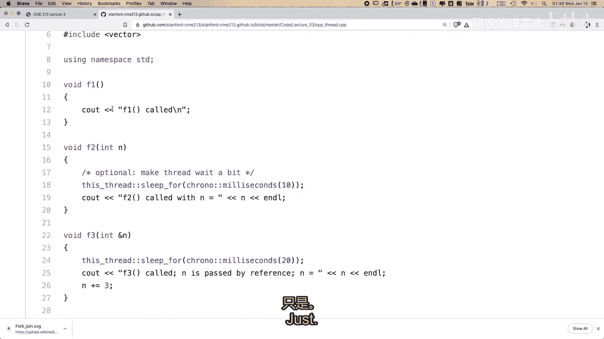

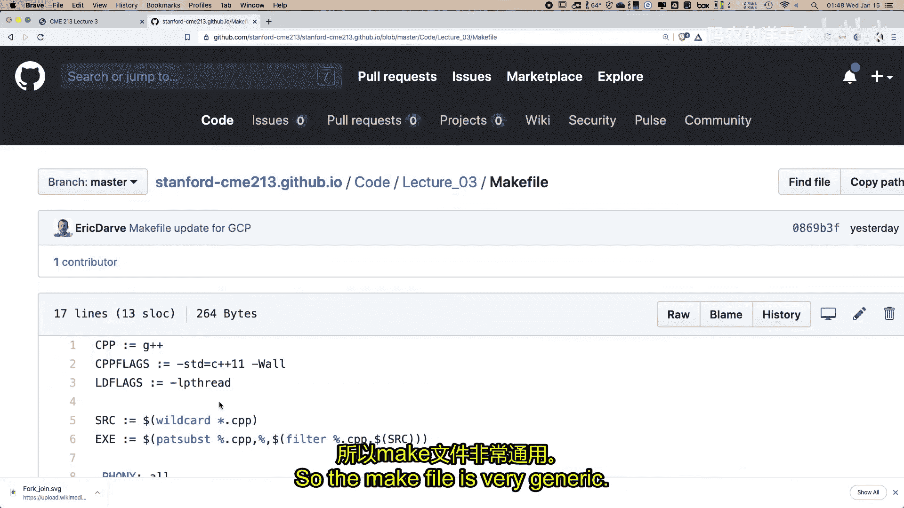

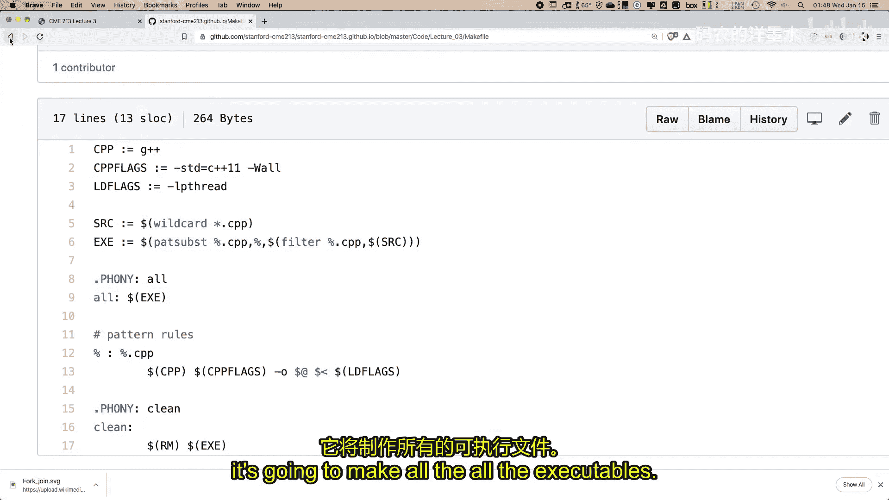

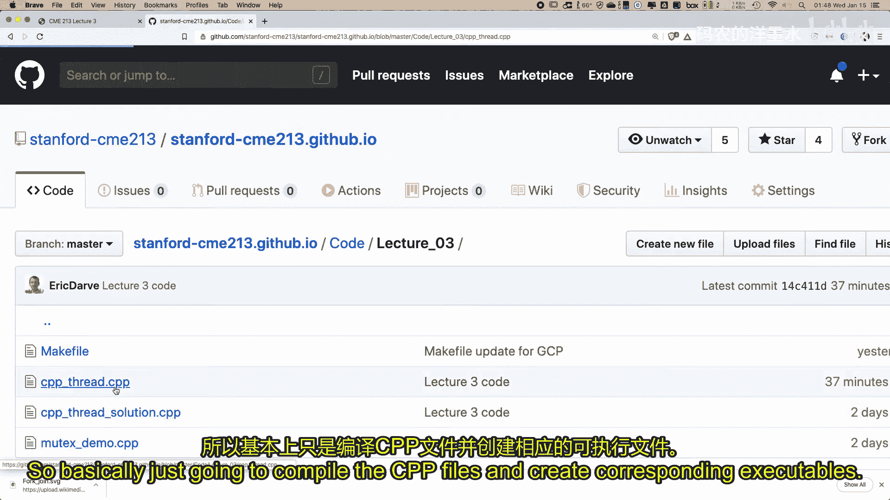

现在，让我们进入如何为多处理器编程的部分。多处理器编程的基本组织单位是**进程**和**线程**。

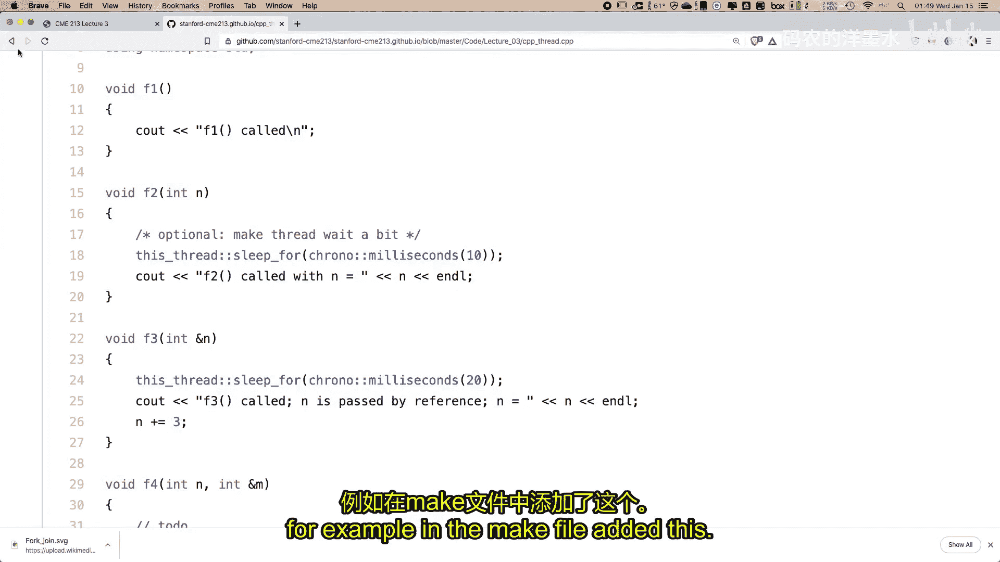

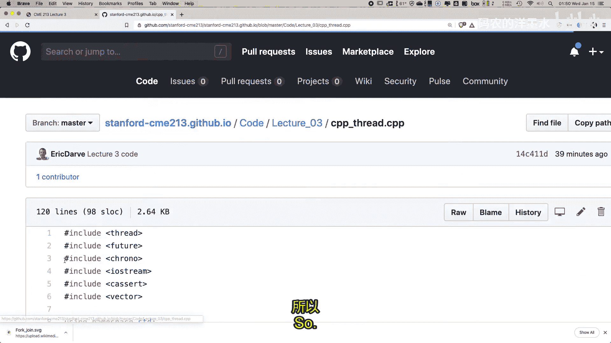

**进程**是基本单位。每次启动一个程序，本质上就是启动了一个单独的进程。每个进程都是一个正在执行的程序，附带操作系统执行该程序所需的一系列信息。

**线程**是一个对我们至关重要的概念。它因多处理的需求而产生。假设你想运行一个程序，但你有四个核心，你希望利用这四个核心。从某个层面看，你需要运行四个“程序”。但进程是一个相当“重量级”的对象，维护其状态需要很多额外数据和开销。

因此，人们提出了**线程**的概念。线程与进程类似，但**轻量级**得多。你可以启动一个程序（主进程），然后创建大量线程。目标是尽量减少线程的开销，使其尽可能轻量，因为很多信息已经存在于主进程中。

从程序员的角度看，我们通常这样理解线程：你将在程序中定义一个常规的 C++ 函数，然后声明一个 C++ `thread` 对象来运行这个函数。这个函数可能与常规函数略有不同，它可能包含一个循环，持续运行，检查是否有工作要做，或查看数据结构以了解计算的进展。

因此，进程和线程是层次化的：你有一个与运行程序相关联的进程，而每个进程都有能力创建和销毁这些独立的控制流，即线程。当你编写 C++ 代码时，你将能够创建和销毁线程，操作系统则负责创建和销毁相应的资源。

## 线程的内存视图

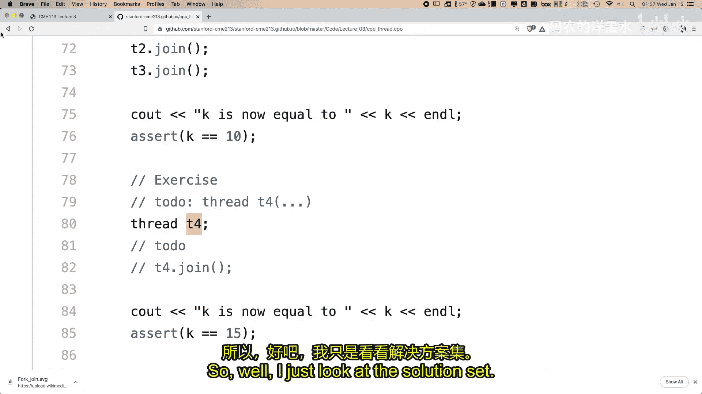

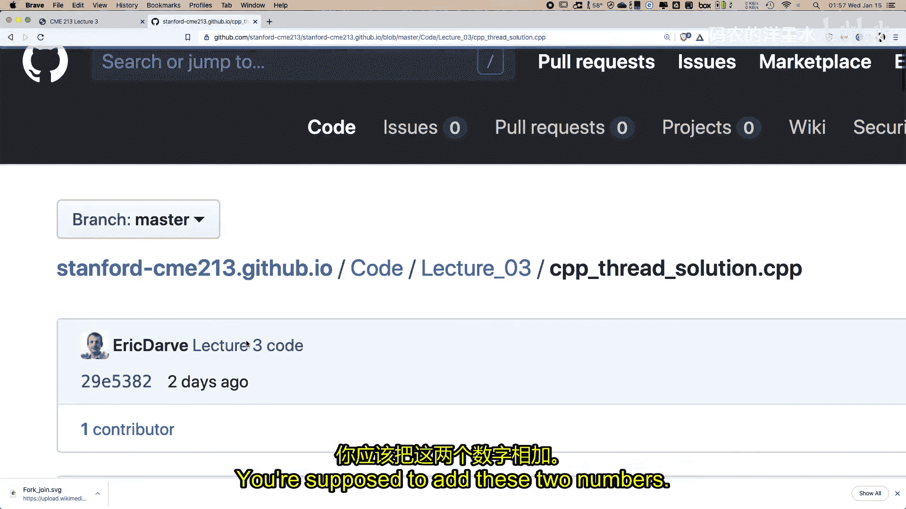

从程序员的角度看一个多线程程序：你会定义一些将由线程运行的函数。在程序中，你定义这些函数，然后定义 `thread` 对象，并指定每个线程应该运行哪个函数。当程序执行时，线程对象被实例化，但执行由操作系统管理。你无法直接控制函数何时运行，但在某个时刻它会被执行。

每个线程都可以**并发**或独立地运行。例如，如果你有四个核心，主线程可能驻留在一个核心上，如果你创建了三个线程，它们可能会占据处理器上的其他三个核心。通常，创建的线程数量可能与机器上的核心数相等。

当一个程序运行时，进程有能力分配内存。相应地，线程能够访问由进程分配的所有内存。所有线程共享一个共同的地址空间，这是线程间交换数据的基础方式：一个线程写入某个内存位置，之后其他线程可以从该位置读取。

## 线程局部存储与共享内存

这一点非常重要，尤其是在使用 OpenMP 时可能不那么明显，需要加以区分。

所有内存都是进程分配的一部分，但在逻辑上可以这样划分：
*   **线程局部存储**：每个线程运行一个函数。在该函数内部，可以有局部变量。这些变量仅对该线程可见，其他线程无法访问，就像任何常规函数内的局部变量一样。
*   **共享内存**：由主程序（主线程）分配的变量（例如通过 `new` 或 `vector` 分配）可以被所有线程访问。如果所有线程都只是读取这些内存位置，那没有问题。但如果一些线程在读取而另一些线程在写入，则需要小心协调，以确保正确性。

## C++ 线程编程

在实现上有很多选择，本节课我们将主要关注 **C++ 线程**，即 C++11 标准引入的 `std::thread` 库。其他选项包括历史更悠久的 Pthreads（遵循 C 语言范式）、Java 线程、Python 线程、Intel 的 TBB 以及 Julia 中的线程等。周五我们将学习 **OpenMP**，它使用指令而非显式操作线程。

为了理解线程的基本概念，我们从 C++ 线程开始。

### 创建线程

以下是如何创建线程的基本示例。我们通过一个练习来学习。

首先，你有一个函数，例如：
```cpp
void f1() {
    std::cout << "Hello from f1" << std::endl;
}
```
要创建一个运行此函数的线程，只需：
```cpp
std::thread t1(f1);
```
`std::thread` 的构造函数接受要运行的函数名。如果函数需要参数，只需在函数名后附加所有参数，其数量和类型需与函数定义匹配。

关于参数传递有一个细节需要注意：线程会在某个不确定的时间运行函数，因此它通常会**按值**复制所有参数以保存状态。如果你的函数参数是**引用**，则需要使用 `std::ref` 来包装参数，以确保传递的是引用而非值的副本。
```cpp
void f3(int& k) { k = 10; }
int main() {
    int k = 0;
    std::thread t3(f3, std::ref(k)); // 使用 std::ref 传递引用
    // ... 其他操作
}
```

### 线程同步：join

由于线程异步执行，主线程无法知道线程函数何时执行完毕。为了确保线程完成工作并获取其结果，需要进行同步。最基本的方法是使用 `join()`。

`join()` 是一个**阻塞**调用。调用 `join()` 的线程（通常是主线程）会在此处停止，等待对应的线程完成其函数执行并返回。当线程返回后，其所有资源被释放，主线程才能继续执行。
```cpp
std::thread t3(f3, std::ref(k));
t3.join(); // 主线程在此等待，直到 t3 执行完 f3
assert(k == 10); // 此时可以安全地断言 k 的值
```
如果没有 `join()`，主线程可能在线程更新 `k` 之前就执行 `assert` 语句，导致未定义行为或断言失败。

### 练习：创建与同步线程

以下是第一个练习的概要：你需要实现一个线程 `t4` 来运行函数 `f4`，该函数将两个整数相加。
```cpp
void f4(int m, int& n) {
    // 你的代码：将 m 加到 n 上
}
int main() {
    int m = 5, k = 10;
    std::thread t4(f4, m, std::ref(k));
    t4.join(); // 等待 t4 完成
    assert(k == 15); // 验证结果
    std::cout << "k = " << k << std::endl;
}
```
关键步骤：
1.  正确声明线程 `t4`，传递参数 `m` 和 `k`（注意 `k` 是引用）。
2.  在函数 `f4` 中实现加法逻辑。
3.  在查询 `k` 的值之前调用 `t4.join()` 以确保计算完成。

### 线程数量与开销

你可以启动的线程数量基本上由操作系统决定，可以非常大。例如，浏览器标签页可能各自对应线程，但大多数时间它们可能在等待，处于睡眠状态。

然而，对于计算密集型任务（如科学计算），通常创建的线程数量应与物理核心数相匹配，以最大化利用硬件。有些处理器支持超线程，操作系统可以优化运行两个线程 per 核心，此时线程数可以翻倍。

创建线程是有开销的（可能约毫秒级），因为操作系统需要管理其状态（寄存器、指令指针等）。因此，对于大量细粒度任务，更好的模式是创建一个**线程池**：先创建少量线程，然后通过任务队列等方式持续给它们分配工作，从而分摊创建线程的开销。

## 使用 Promise 和 Future 传递结果

`join()` 是一种同步机制，但它要求等待整个线程函数结束。C++11 提供了更灵活的机制：**`std::promise`** 和 **`std::future`**，用于在线程运行过程中异步地传递单个计算结果。

其核心思想是：
*   **`promise`**：作为一个存储空间，线程可以将计算结果存入其中。
*   **`future`**：与 `promise` 关联，主线程可以通过它来查询和获取存储的值，即使产生该值的线程还在执行其他任务。

基本用法如下：
```cpp
#include <future>
void accumulate(std::vector<int>::iterator first,
                std::vector<int>::iterator last,
                std::promise<int> accumulate_promise) {
    int sum = std::accumulate(first, last, 0);
    accumulate_promise.set_value(sum); // 将结果存入 promise
}
int main() {
    std::vector<int> numbers = {1, 2, 3, 4, 5};
    std::promise<int> accumulate_promise;
    std::future<int> accumulate_future = accumulate_promise.get_future();
    std::thread t5(accumulate, numbers.begin(), numbers.end(),
                   std::move(accumulate_promise));
    // ... 主线程可以同时做其他事情 ...
    int result = accumulate_future.get(); // 阻塞直到 promise 被设置值
    std::cout << "result=" << result << std::endl;
    t5.join();
}
```
`std::move` 用于高效转移 `promise` 的所有权给线程函数。`future.get()` 调用会阻塞，直到关联的 `promise` 调用了 `set_value`。

### 练习：使用 Promise/Future 计算最大值

第二个练习是仿照上面的例子，实现一个计算向量最大值的线程函数。
```cpp
void get_max(std::vector<int>::iterator first,
             std::vector<int>::iterator last,
             std::promise<int> max_promise) {
    // 你的代码：找到最大值并用 set_value 存入 promise
}
int main() {
    std::vector<int> numbers2 = {1, 5, 3, 4, 2};
    std::promise<int> max_promise;
    std::future<int> max_future = max_promise.get_future();
    std::thread t6(get_max, numbers2.begin(), numbers2.end(),
                   std::move(max_promise));
    int max_result = max_future.get();
    assert(max_result == 5);
    t6.join();
}
```

## 数据竞争与互斥锁

多线程编程的一个主要难点是**协调**。当多个线程并发运行并访问共享资源时，可能会出现问题。

考虑一个经典的“银行账户”场景：两个线程同时向同一个账户存款。
1.  线程A 读取当前余额（1000）。
2.  线程B 也读取当前余额（1000）。
3.  线程A 存入100，计算新余额为1100，并写回。
4.  线程B 存入300，计算新余额为1300，并写回（覆盖了线程A的结果）。

最终余额是1300，而不是正确的1400。这就是**数据竞争**：当多个线程访问同一共享内存位置，其中至少一个是写入操作，且访问未同步时，就会发生数据竞争。

数据竞争不仅限于“写后读”或“读后写”，任何对共享数据结构的非原子修改（如向链表添加节点）都需要同步。

C++ 提供了 **`std::mutex`** 来解决这个问题。`mutex` 代表“互斥锁”，它确保一段代码（临界区）在同一时刻只能被一个线程执行。

基本模式如下：
```cpp
std::mutex mtx;
void safe_increment(int& counter) {
    mtx.lock();   // 加锁：如果锁已被其他线程持有，则当前线程在此等待
    ++counter;    // 临界区：安全地修改共享数据
    mtx.unlock(); // 解锁：允许其他线程进入临界区
}
```
更推荐使用 **`std::lock_guard`**，它利用 RAII 思想在构造时加锁，析构时自动解锁，避免忘记解锁。
```cpp
void safer_increment(int& counter) {
    std::lock_guard<std::mutex> lock(mtx); // 构造时加锁
    ++counter; // 临界区
} // lock_guard 析构时自动解锁
```

### 示例：线程安全的任务队列

一个更实际的例子是“披萨店”模型：主线程准备订单列表（一个队列），然后多个“配送员”线程从该队列中获取并处理订单。

以下是关键代码逻辑：
```cpp
std::queue<std::string> task_queue;
std::mutex task_mutex;
void pizza_delivery(int thread_id) {
    while (true) {
        std::string order;
        {
            std::lock_guard<std::mutex> lock(task_mutex); // 保护对队列的访问
            if (task_queue.empty()) {
                return; // 队列为空，线程结束。lock_guard 会自动解锁。
            }
            order = task_queue.front();
            task_queue.pop();
        } // lock_guard 在此作用域结束处解锁
        // 模拟配送过程（这部分是线程独立的，无需加锁）
        std::this_thread::sleep_for(std::chrono::milliseconds(100));
        std::cout << "Thread " << thread_id << " delivering: " << order << std::endl;
    }
}
```
在这个例子中：
1.  多个配送员线程并发运行。
2.  每个线程在检查队列、获取订单时，必须先用互斥锁保护。
3.  一旦获取到订单，立即释放锁，然后独立进行配送（耗时操作），这样其他线程就可以同时去获取其他订单。
4.  使用 `lock_guard` 确保即使提前返回（队列为空时），互斥锁也能被正确释放。

## 总结

本节课中我们一起学习了共享内存并行编程的基础——C++ 线程。
1.  我们回顾了共享内存架构（UMA/NUMA）及其对性能的影响。
2.  我们理解了**进程**与**线程**的区别，线程是更轻量级的执行单元。
3.  我们学习了如何使用 `std::thread` **创建线程**，并注意了引用参数的传递方式（`std::ref`）。
4.  我们认识到线程的异步特性，并学会了使用 `join()` 进行基本的**线程同步**，以确保任务完成。
5.  我们探讨了更灵活的异步结果传递机制：**`std::promise`** 和 **`std::future`**，允许在主线程中等待特定的计算结果，而不必等待整个线程结束。
6.  我们深入了解了多线程编程中的核心挑战：**数据竞争**。当多个线程无协调地访问共享可写数据时，会导致未定义行为和错误结果。
7.  我们学习了使用 **`std::mutex`** 来保护临界区，实现**互斥访问**，并介绍了使用 `std::lock_guard` 进行更安全、更便捷的锁管理。

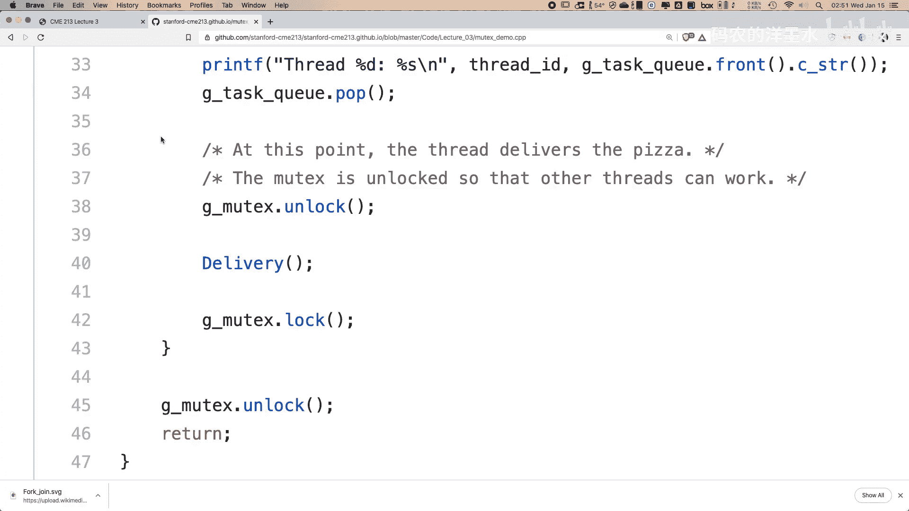

理解这些基础概念对于编写正确、高效的多线程程序至关重要。在接下来的课程中，我们将学习更高级的并行编程模型，如 OpenMP，它会在底层处理许多线程管理的细节，但其核心思想仍建立在今天所学的概念之上。