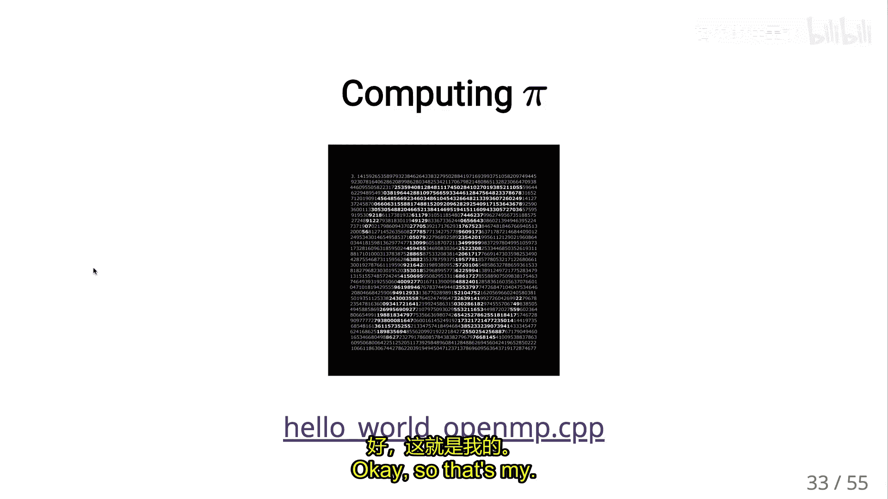
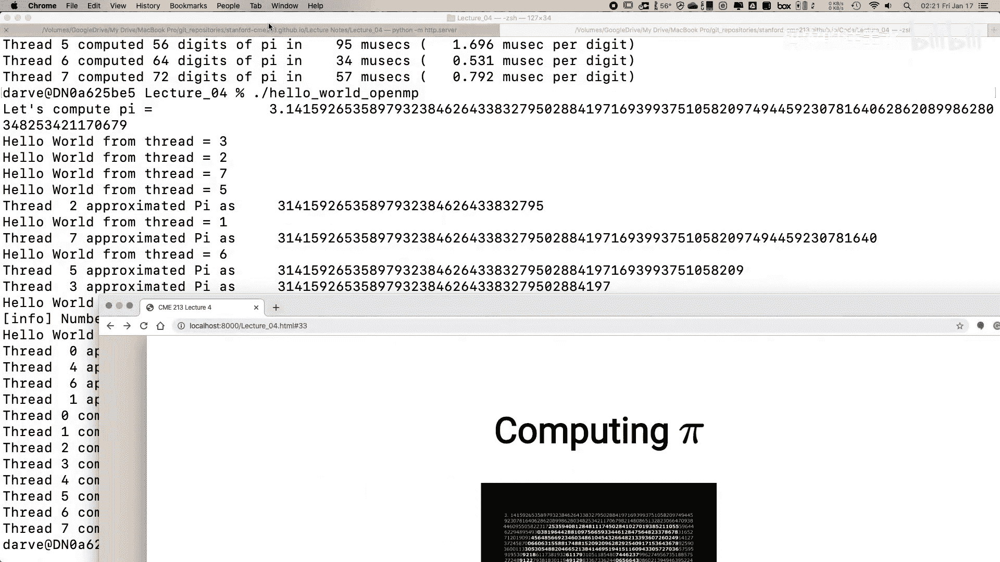
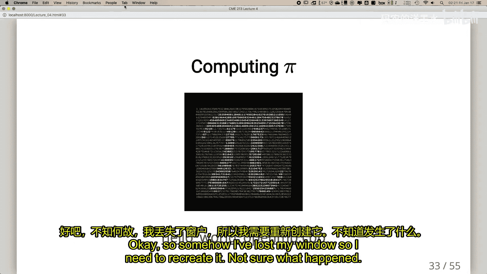
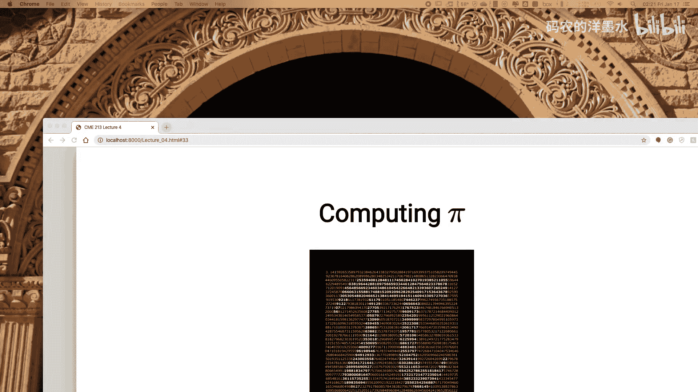
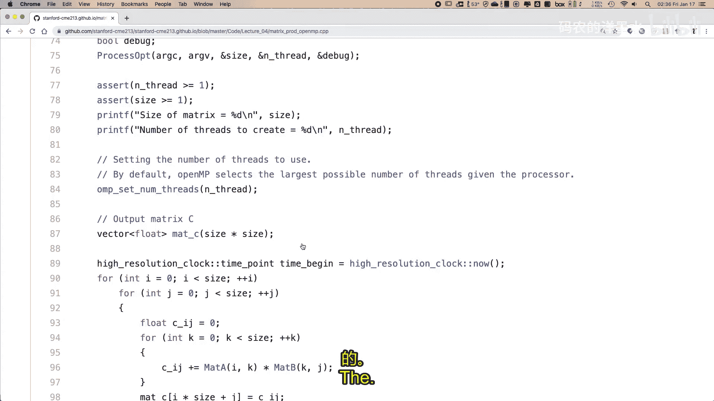
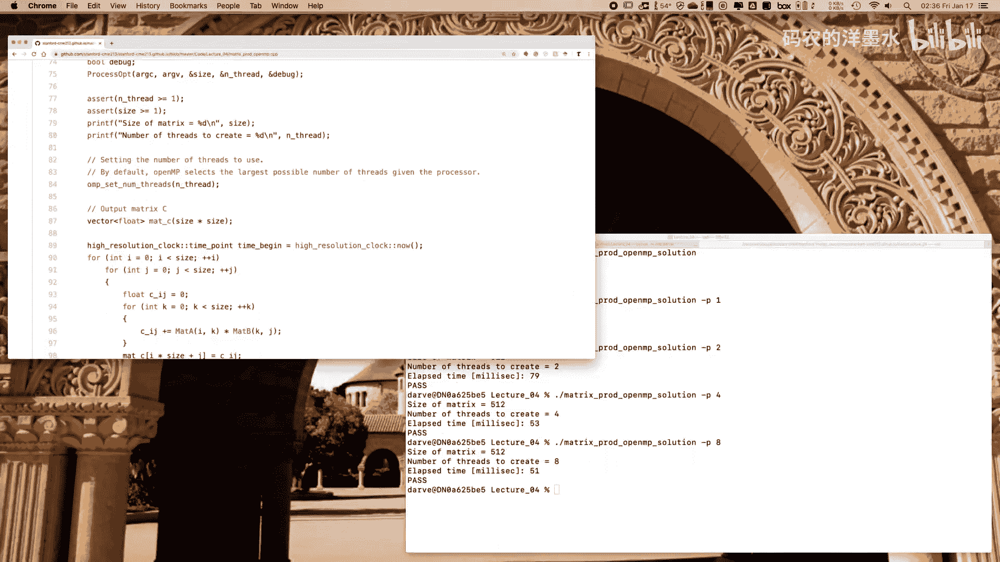

# 004：OpenMP 1

## 概述
在本节课中，我们将要学习并行编程的一个重要工具——OpenMP。我们将从如何设置Google Cloud平台开始，然后深入探讨OpenMP的基本概念，特别是如何利用它来并行化循环，这是科学计算中最常见的并行化场景。

## Google Cloud平台设置

首先，我们简要介绍Google Cloud平台。这是本课程将使用的硬件平台，你应该已经收到了包含优惠券的邮件，可以获取一些积分。

以下是设置的主要步骤：

1.  **创建项目**：首先需要在Google Cloud上创建一个项目。所有虚拟机都将在这个项目下运行。
2.  **安装本地软件**：需要在本地计算机上安装一些软件，以便连接和与虚拟机交互。网站上有针对Linux、Mac和Windows的详细安装说明。
3.  **创建虚拟机**：虚拟机由两部分组成：虚拟硬件配置（如CPU核心数、是否包含GPU）和操作系统选择（如Ubuntu Linux）。我们将使用脚本来创建和配置虚拟机。
4.  **连接与文件传输**：虚拟机启动后，可以使用SSH登录，并使用SCP在本地和云端之间传输文件。

设置过程虽然步骤较多，但按照指南操作并不复杂。一旦理解其组织逻辑，就会变得非常直观。

## OpenMP简介

上一节我们介绍了课程的计算环境，本节中我们来看看本课的核心主题——OpenMP。

OpenMP是一个用于共享内存并行编程的应用程序编程接口标准。它旨在简化多核处理器的编程，特别是针对科学计算中常见的循环结构。

与C++线程相比，OpenMP的主要优势在于其简洁性。使用C++线程编写并行科学代码可能会使代码变得复杂且难以阅读。而OpenMP允许程序员通过添加简单的编译指令（pragma）来并行化代码，通常只需一行代码，就能将顺序循环转换为并行循环，同时保持代码的清晰度。

然而，对于更复杂的并行模式（如遍历链表），OpenMP的高级特性可能会变得和直接使用线程一样复杂。OpenMP标准在不断发展，最新版本已开始支持GPU等加速器。

## OpenMP基础：并行区域

OpenMP的核心思想是“fork-join”模型。程序大部分时间顺序执行，当遇到特定的编译指令时，会“fork”（派生）出一组线程来并行执行一个代码块，执行完毕后“join”（合并）回主线程。

最基本的指令是 `#pragma omp parallel`，它定义了一个并行区域。

```cpp
#pragma omp parallel
{
    // 这个代码块内的所有指令将被多个线程并行执行
    int tid = omp_get_thread_num();
    printf("Hello from thread %d\n", tid);
}
// 此处恢复为顺序执行
```

当程序执行到 `#pragma omp parallel` 时，会创建一个线程团队。花括号 `{}` 内的代码块会被每个线程同时执行。每个线程可以通过 `omp_get_thread_num()` 获取自己的ID。代码块结束后，所有线程同步，程序继续顺序执行。

与C++线程不同，OpenMP的线程通常在程序启动时就创建好并放入池中。进入并行区域时，系统只是将工作分配给这些已存在的线程，避免了频繁创建和销毁线程的开销。



## 实践：并行化循环







对于科学计算，最常见的并行化目标是`for`循环。OpenMP提供了非常便捷的方式来实现这一点。

最常用的指令是 `#pragma omp parallel for`，它将创建并行区域和分割循环两个步骤合二为一。

```cpp
#pragma omp parallel for
for (int i = 0; i < N; ++i) {
    c[i] = a[i] + b[i]; // 循环迭代之间必须没有依赖关系
}
```

这个指令告诉编译器：接下来的`for`循环的各个迭代是独立的，可以将迭代划分给不同的线程同时执行。编译器会自动生成代码来管理线程和工作分配。





以下是循环调度策略，可以通过 `schedule` 子句指定：

*   **静态调度**：假设每次迭代工作量相同。循环会预先被分成大小相等的块（或指定大小的块）分配给各线程。开销最小，适用于规则计算。
    *   示例：`#pragma omp parallel for schedule(static)`
*   **动态调度**：假设每次迭代工作量可能不同。使用一个任务池，线程完成当前块后，动态请求下一个块。负载更均衡，但有一定调度开销。
    *   示例：`#pragma omp parallel for schedule(dynamic, chunk_size)`
*   **指导性调度**：类似动态调度，但块大小开始时较大，然后逐渐减小。这是一种自适应策略，旨在更好地处理不规则负载。
    *   示例：`#pragma omp parallel for schedule(guided)`

## 变量作用域：shared与private

在并行区域内，变量的作用域至关重要。

*   **共享变量**：在并行区域外声明的变量，默认在区域内是共享的。所有线程读写的是同一内存地址。
    *   示例：`int shared_var; #pragma omp parallel { shared_var++; }` （这会导致竞态条件！）
*   **私有变量**：每个线程拥有该变量的独立副本，互不干扰。循环索引（如`i`）在 `parallel for` 中自动成为私有变量。也可以通过 `private` 子句显式声明。
    *   示例：`int private_var; #pragma omp parallel private(private_var) { private_var = omp_get_thread_num(); }`

## 总结


本节课中我们一起学习了OpenMP并行编程的基础知识。我们首先了解了如何设置Google Cloud平台作为实验环境。然后，我们探讨了OpenMP的设计哲学，即通过简单的编译指令来简化共享内存并行编程。我们重点学习了`parallel`区域和`parallel for`指令，这是并行化循环结构的强大工具。此外，我们还介绍了循环调度策略和变量作用域控制，这些对于编写正确、高效的OpenMP程序至关重要。掌握这些核心概念，你就能开始将许多顺序计算代码转化为并行代码，从而充分利用多核处理器的计算能力。下节课我们将继续探讨OpenMP更高级的特性，如任务（tasks）模型。