# 006：排序算法 🧮

在本节课中，我们将学习几种经典的排序算法，并探讨如何在共享内存机器上并行实现它们。我们将重点回顾快速排序、归并排序、基数排序以及双调排序，并分析它们在并行化时面临的挑战和策略。

## 数组归约操作

上一节我们讨论了并行计算中的一些基本概念，本节中我们来看看OpenMP中的一个特定功能：数组归约。

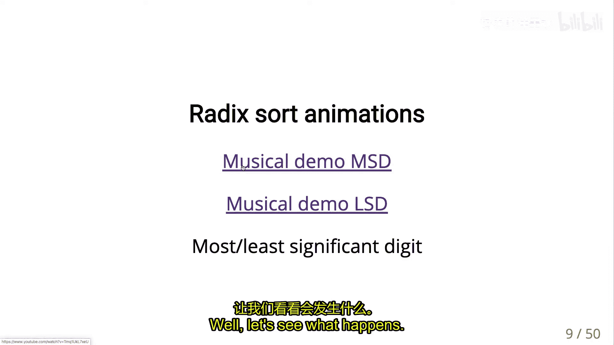

在OpenMP中，可以使用`reduction`子句对数组进行归约操作。其语法允许指定数组的起始索引和处理的元素数量。例如，对于一个数组`a`，可以使用`reduction(+:a[0:n])`来对前`n`个元素进行求和归约。如果需要对跨步的元素进行操作，语法为`reduction(+:a[LB:STRIDE*N])`，其中`LB`是起始索引，`STRIDE`是步长，`N`是处理的元素数量。

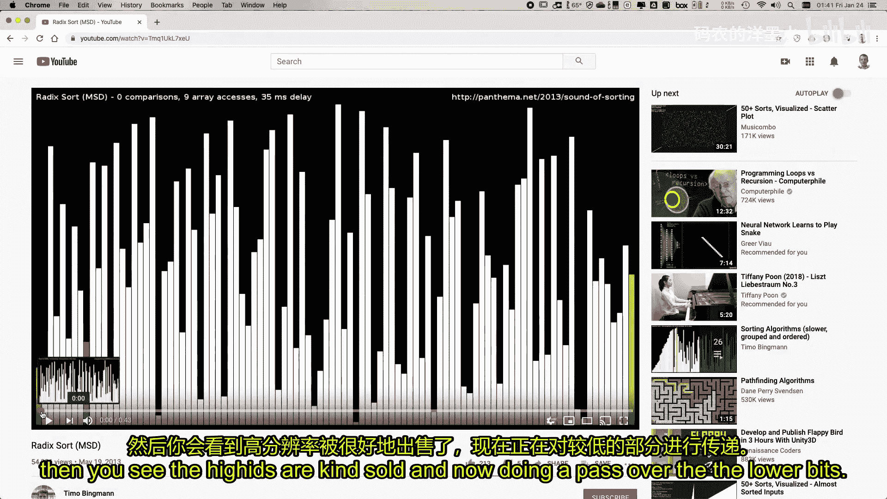

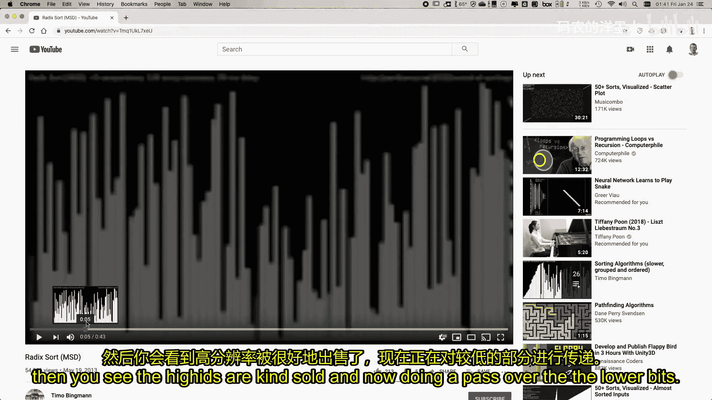

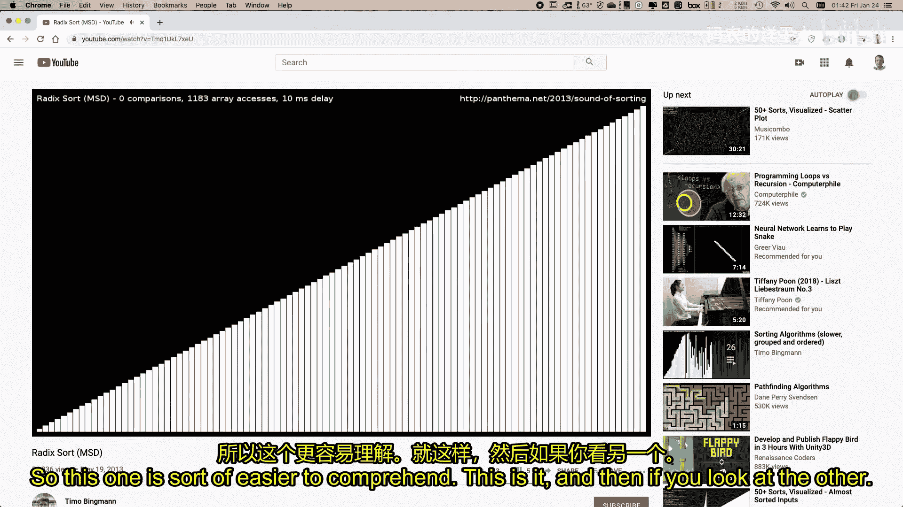

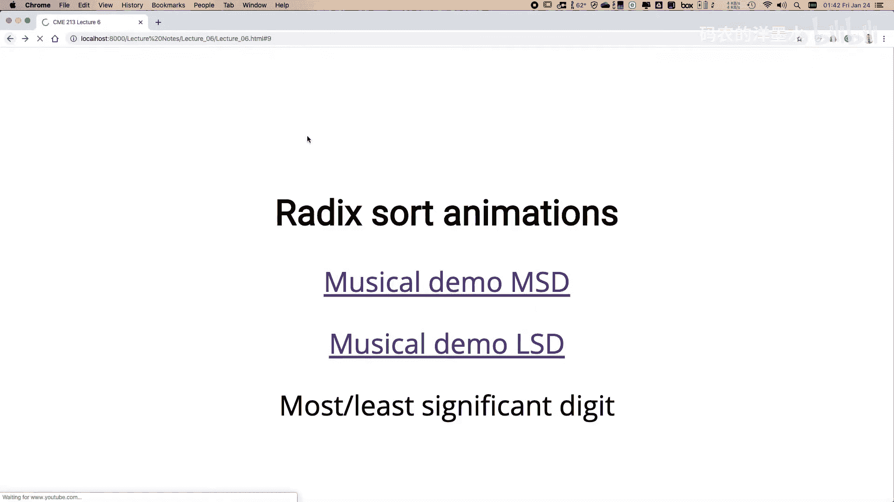

**核心概念公式**：
`reduction(操作符: 数组名[起始索引:长度])`

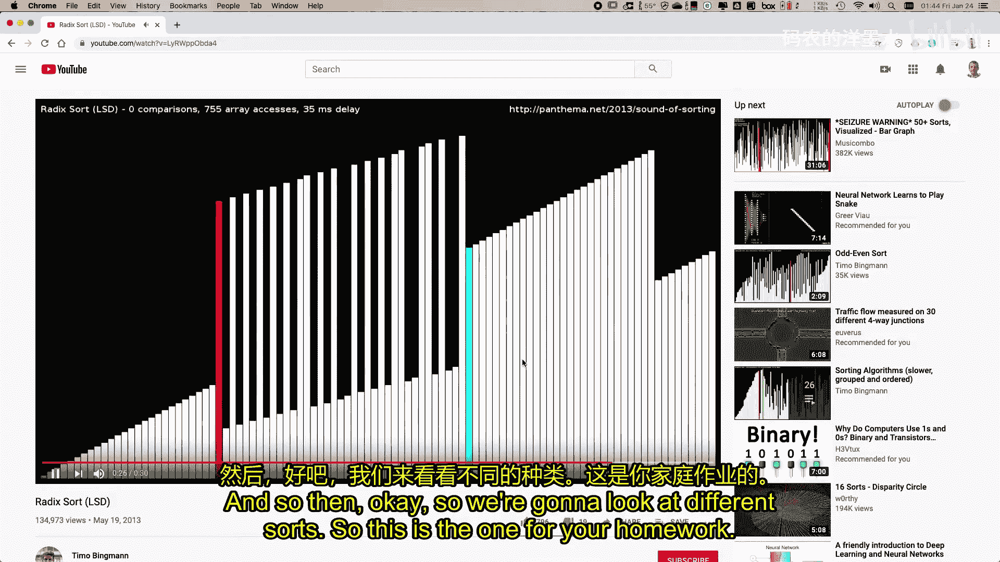

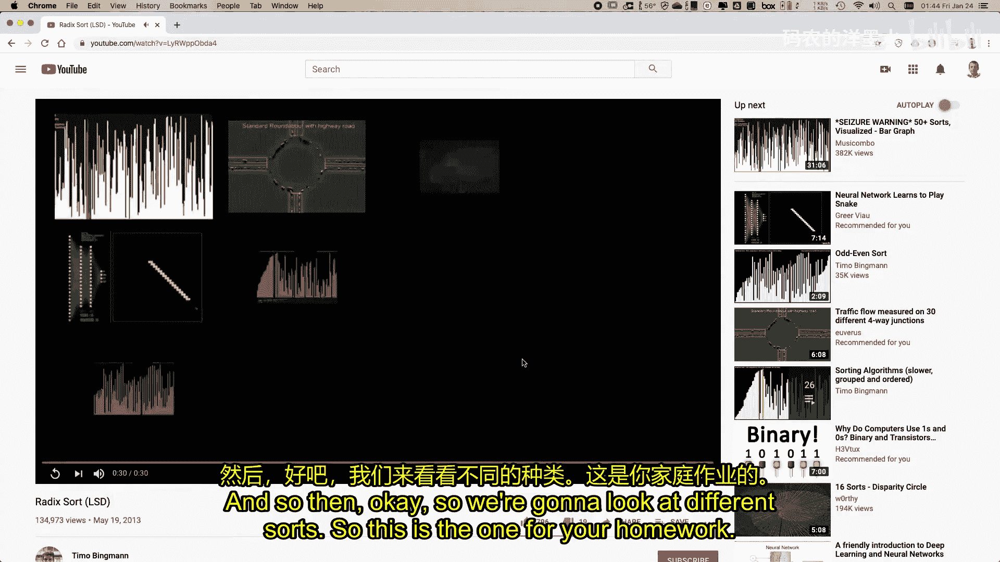

需要注意的是，数组归约操作在幕后会为每个线程创建数组的局部副本，并在并行区域结束后合并这些副本。这涉及到内存分配和复制，可能会影响性能。在多线程代码中，动态内存分配通常代价高昂，因此最好预先分配所有所需内存。

## 排序算法概述

排序是计算机科学中的核心问题。我们将回顾几种常见排序算法，并重点关注它们在共享内存计算机上的实现挑战。

### 基数排序

基数排序是当前作业的焦点。它适用于整数或浮点数等可以用比特表示的数据类型。其核心思想是基于数据的比特位进行排序。

**算法核心步骤**：
1.  将每个数字的比特位分成较小的组（例如，每组3比特，对应0到7）。
2.  根据当前处理的比特组，创建相应数量的桶（例如，8个桶）。
3.  遍历所有数字，根据当前比特组的数值将其放入对应的桶中。
4.  重复此过程，处理所有比特组，最终得到有序数组。

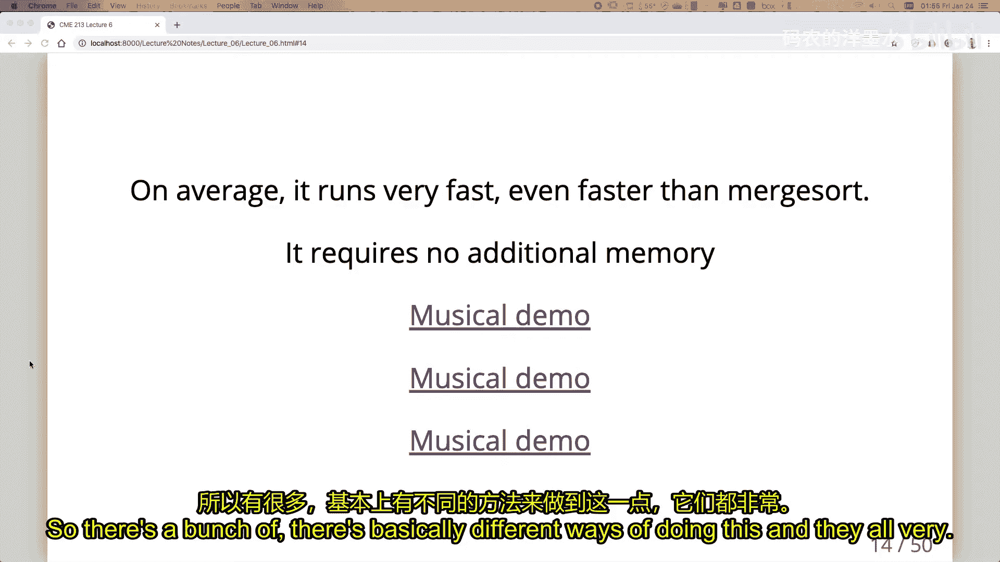

基数排序可以是**稳定排序**，即如果输入中两个数在当前比特位上相等，它们在输出中的相对顺序保持不变。这保证了在按高位比特排序后，再按低位比特排序时，高位相同的数字会作为一个整体被正确排序。

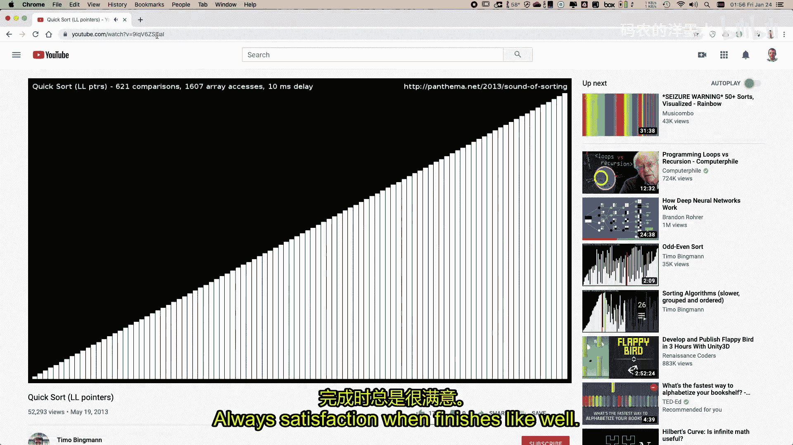

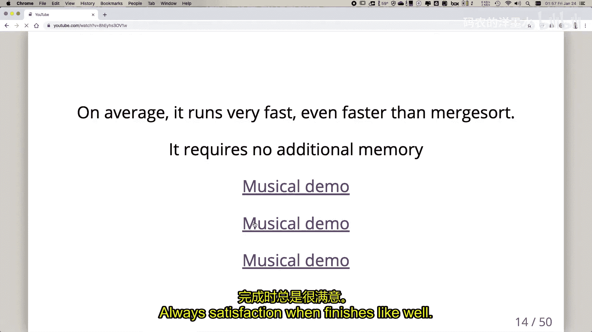

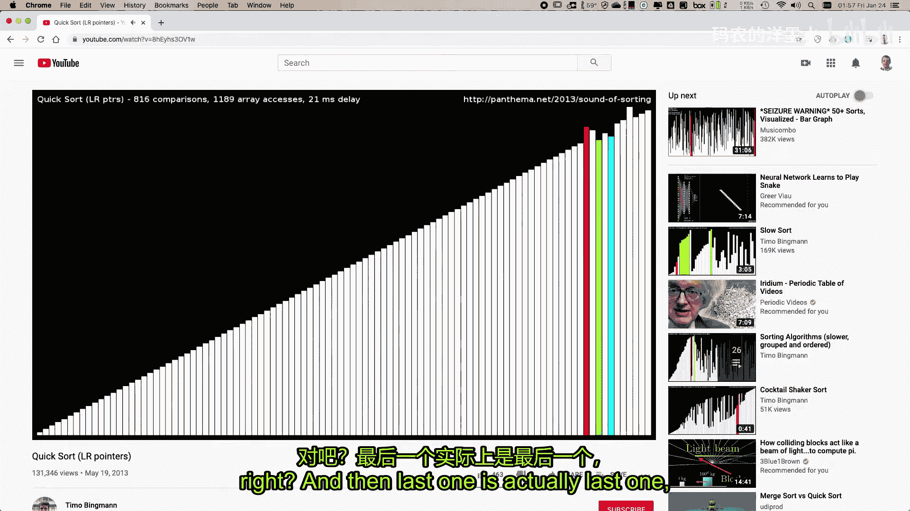

### 快速排序

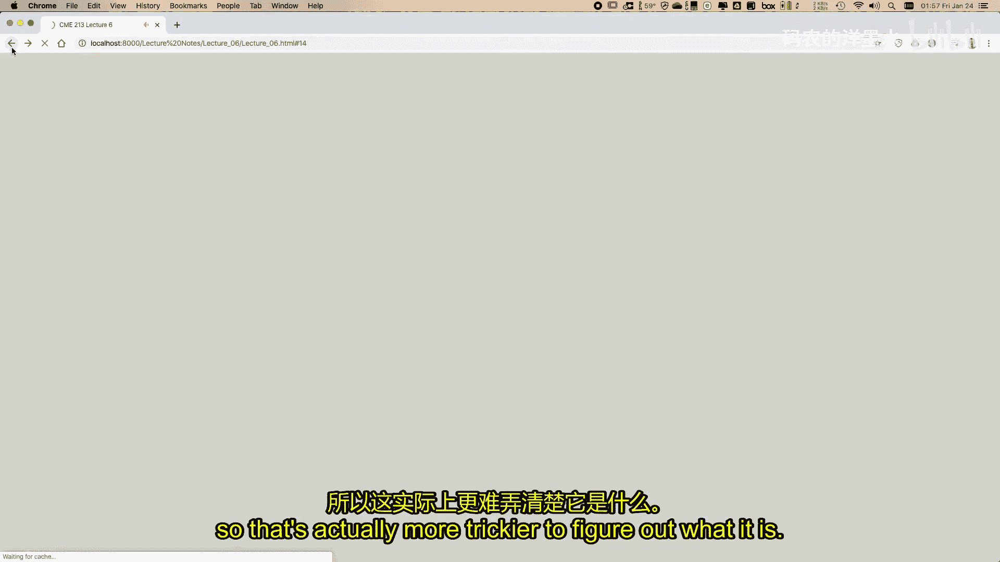

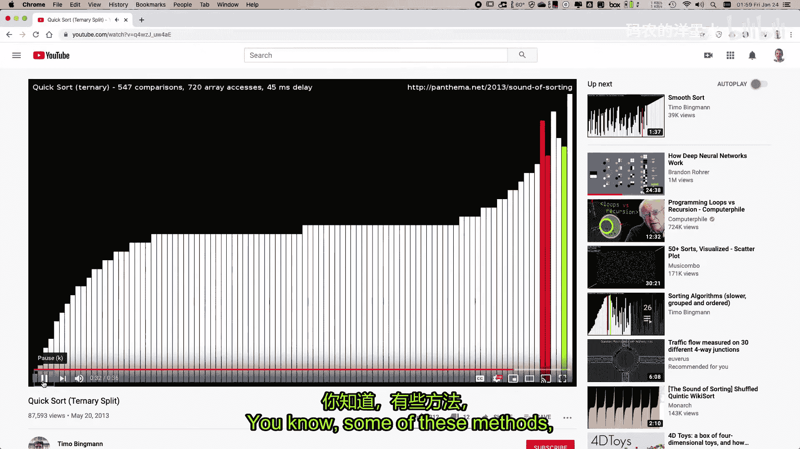

快速排序是一种广泛使用的高效排序算法，通常是原地排序（不需要额外存储空间）。

**算法核心步骤**：
1.  **选择枢轴**：从数组中选择一个元素作为枢轴。
2.  **分区**：重新排列数组，使得所有小于枢轴的元素都在其左侧，所有大于枢轴的元素都在其右侧。这个步骤需要进行一系列交换操作。
3.  **递归**：对枢轴左侧和右侧的子数组递归地应用快速排序。

快速排序的平均时间复杂度为`O(n log n)`，但在最坏情况下（例如输入已排序）会退化到`O(n^2)`。它通常不是稳定排序。

**并行化策略**：
在共享内存系统中并行化快速排序的思路如下：
1.  所有线程共享枢轴值。
2.  每个线程对自己分配到的数据子集进行本地分区操作（分为小于和大于枢轴的两部分）。
3.  进行全局重排列：这需要计算每个线程的“小于”和“大于”分区的大小（直方图），然后通过前缀和计算每个线程在全局输出数组中的写入起始位置。
4.  每个线程根据计算出的位置，将自己的数据写入全局数组的相应区域。
5.  递归地对新形成的两个子数组进行排序，并动态分配线程给它们。

这种方法的挑战在于**负载均衡**，因为分区后子数组的大小可能不均匀。

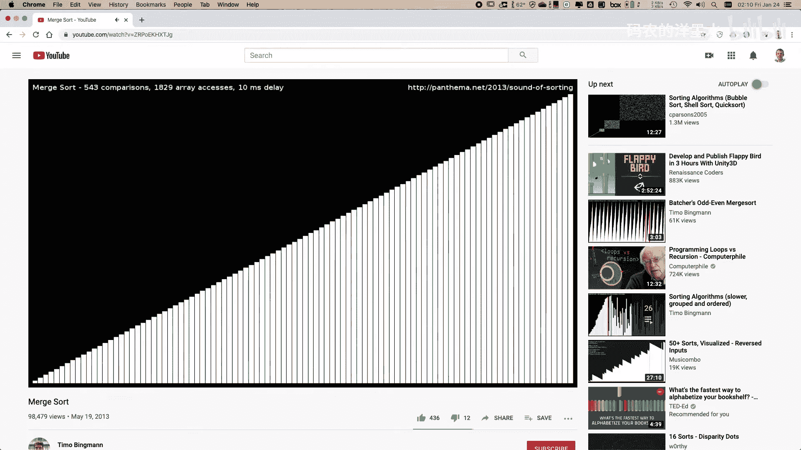

### 归并排序

归并排序是另一种高效算法，其最坏情况时间复杂度稳定为`O(n log n)`。

**算法核心步骤**：
1.  **分割**：递归地将数组分割成两半，直到子数组长度为1。
2.  **归并**：将两个已排序的子数组合并成一个大的有序数组。合并时使用两个指针，每次选择较小的元素。

归并排序的难点在于合并步骤本质上是顺序的。

**并行化策略**：
一种并行合并的策略借鉴了快速排序的思想：
1.  从较长的子数组中选择一个枢轴元素`x`。
2.  由于两个子数组都已排序，可以使用`O(log n)`的二分查找在另一个子数组中定位`x`应插入的位置，从而将每个子数组分为“小于等于x”和“大于x”两部分。
3.  现在，第一个子数组的“小于等于x”部分可以与第二个子数组的“小于等于x”部分并行合并；同样，两个“大于x”部分也可以并行合并。
这个策略的效果取决于枢轴选择的好坏，可能导致负载不均。

### 桶排序与采样排序

桶排序是基数排序的变体，适用于已知数据范围的数值排序。

**算法核心步骤**：
1.  确定数据的最小值`A`和最大值`B`。
2.  将区间`[A, B]`划分为`P`个连续的桶。
3.  遍历数据，将每个元素放入对应的桶中。
4.  并行地对每个桶内的数据进行排序。

桶排序的挑战在于数据分布可能不均匀，导致某些桶过满，某些桶为空，造成**负载失衡**。

采样排序试图通过优化桶的边界来改善负载均衡。

**算法核心步骤**：
1.  每个进程对自己本地的数据样本进行排序。
2.  每个进程从本地有序数据中选取`P-1`个“分割器”，这些分割器将其本地数据均匀分成`P`份。
3.  收集所有进程的本地分割器，形成一个更大的集合。
4.  从这个集合中再选取最终的`P-1`个全局分割器，以期望它们能将全局数据大致均匀地分到`P`个桶中。
5.  后续步骤与桶排序类似：根据全局分割器将数据分到桶中，然后并行排序每个桶。

## 双调排序 🌀

双调排序是一种基于比较-交换操作的排序网络算法。其独特之处在于操作序列完全确定，与输入数据无关，这使得它非常适合硬件实现和在GPU等架构上获得高性能。

**核心概念**：
*   **双调序列**：一个序列先单调递增然后单调递减，或者先单调递减然后单调递增。
*   **比较-交换操作**：对两个元素`(a, b)`，如果`a > b`则交换，否则不变。

**算法核心步骤（双调归并）**：
给定一个双调序列，可以通过一系列固定的比较-交换操作（称为“双调归并”），将其转换为两个双调序列，且第一个序列中的所有元素都小于第二个序列中的所有元素。具体操作是：将序列前半部分与后半部分的对应元素进行比较，并将较小者放在前半部分，较大者放在后半部分。

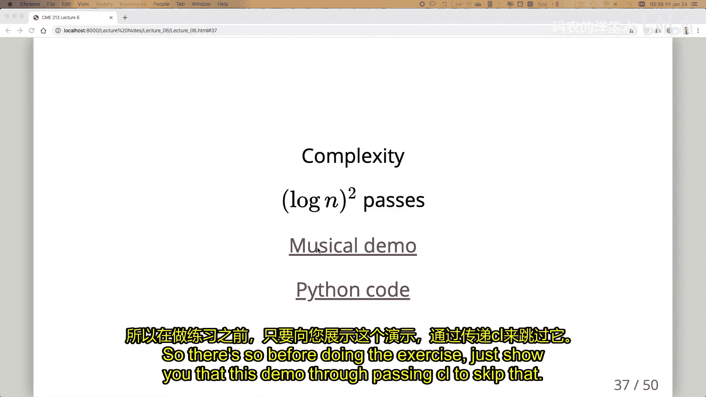

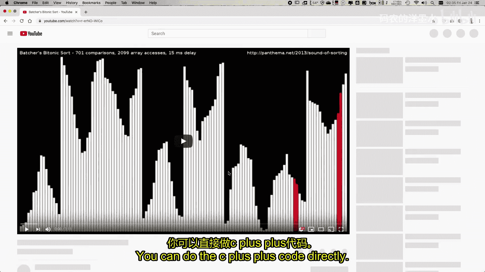

**完整双调排序过程**：
1.  从最小的双调序列（长度为2的相邻元素对）开始，通过比较-交换将其排序为升序或降序，从而形成小的双调序列。
2.  将相邻的小双调序列通过“双调归并”操作合并成更大的双调序列。
3.  递归地重复这一过程，双调序列的规模不断翻倍，直到整个序列成为一个双调序列，最终经过一步排序后得到完全有序的序列。

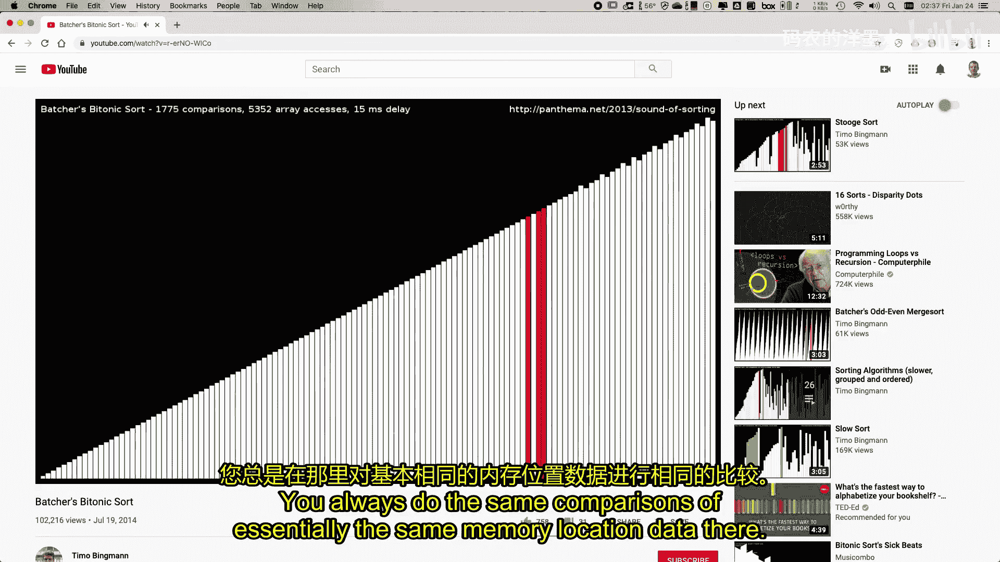

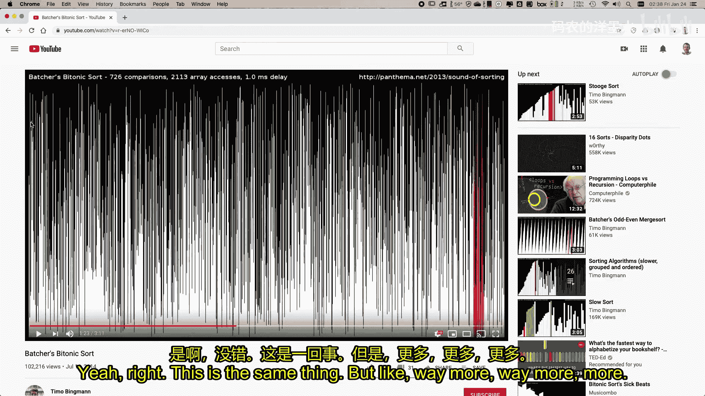

整个算法需要约`(log n)^2`级操作，每级操作都可以高度并行化。

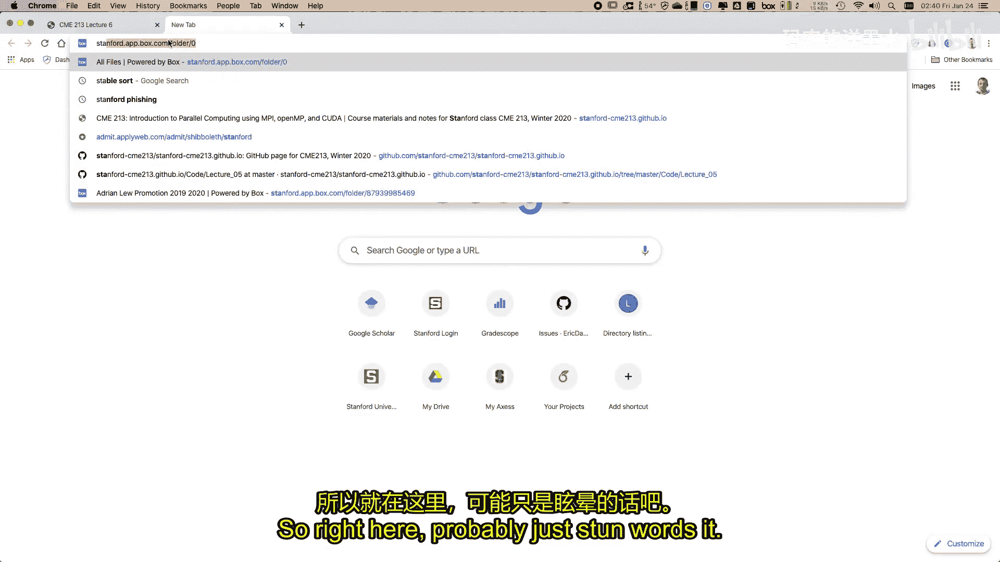

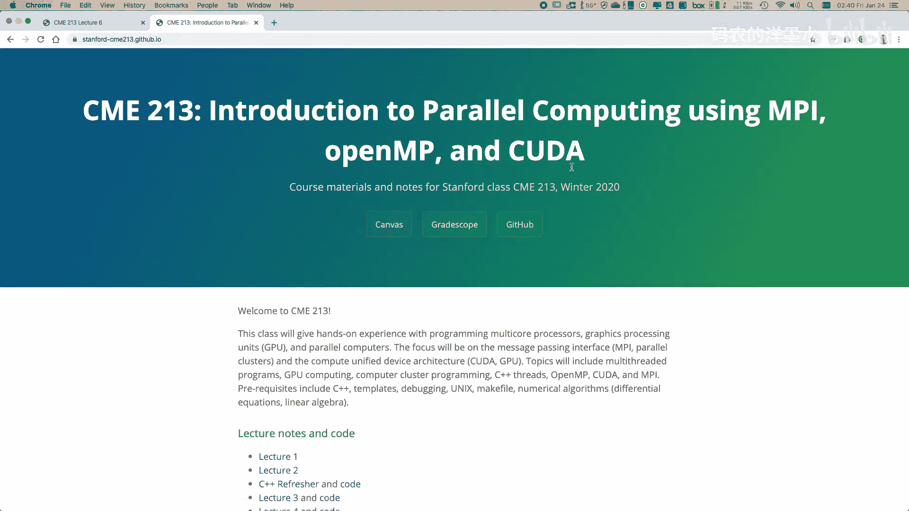

### 双调排序的并行实现练习

以下是对提供的代码进行并行化的策略概要：

**实现策略**：
双调排序算法包含多层循环。并行化的关键在于识别哪些循环迭代是独立的。
1.  外层循环（`i`，控制双调序列的规模）通常是顺序的，因为后续步骤依赖于前一步的结果。
2.  内层循环（`j`，遍历不同的双调序列）在序列规模较小时，有很多独立的序列可以并行处理。
3.  当序列规模变大后，内层循环的迭代次数变少，但每个序列内部的“比较-交换”操作（另一个内层循环，如`k`）变得非常庞大，此时可以并行化这个内部操作循环。

因此，一个高效的并行实现可能需要根据当前处理的序列大小，在两种并行模式间切换：
*   **模式A**：当有很多小的独立双调序列时，并行化遍历这些序列的循环。
*   **模式B**：当处理少数大型双调序列时，并行化每个序列内部的比较-交换操作循环。

在代码中，这通常体现为设置一个阈值（`chunk`）。当序列规模小于阈值时，采用模式A（并行化`j`循环）；当序列规模大于阈值时，采用模式B（调用一个并行化的排序函数，该函数内部并行化比较循环）。此外，在递归排序函数中，当问题规模缩小到一定程度时，可能需要切换回模式A以充分利用并行性。

**性能期望**：
通过这种混合并行策略，可以在多核处理器上获得良好的加速比，例如从1线程到4线程可能获得接近4倍的线性加速。

## 总结

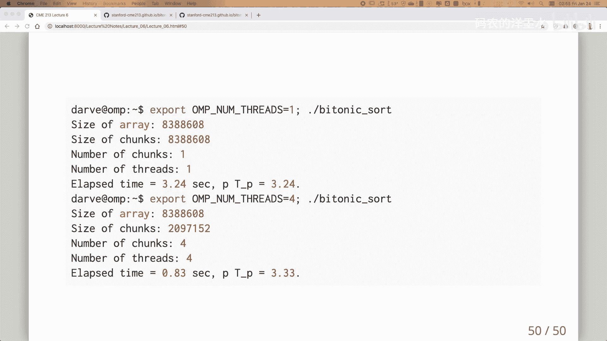

本节课我们一起学习了多种排序算法及其并行化策略。我们回顾了快速排序、归并排序、基数排序和桶排序的基本思想，并深入探讨了双调排序这一具有固定、规则操作模式的特殊算法。我们了解到，并行化排序算法的关键在于识别独立任务、管理数据重排列以及解决负载均衡问题。不同的算法因其固有特性（如快速排序的分区、归并排序的合并、双调排序的规则网络）而面临不同的并行化挑战和机遇。通过结合算法特性和并行编程模型（如OpenMP），可以有效地利用多核处理器的计算能力来加速排序过程。