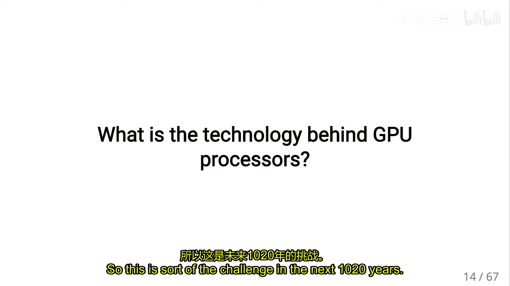
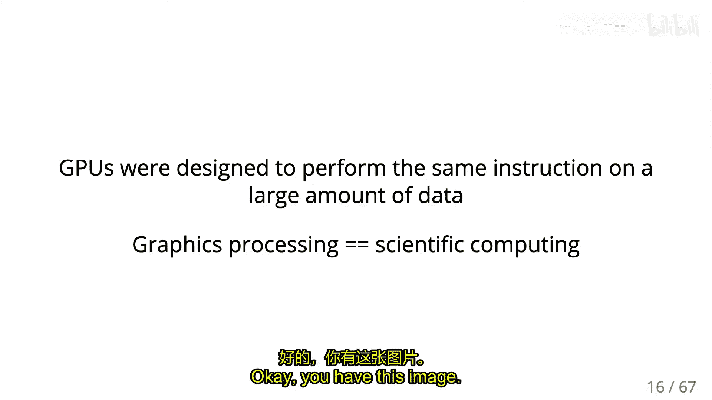
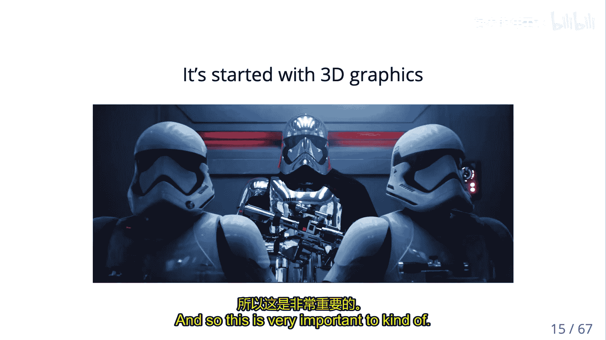
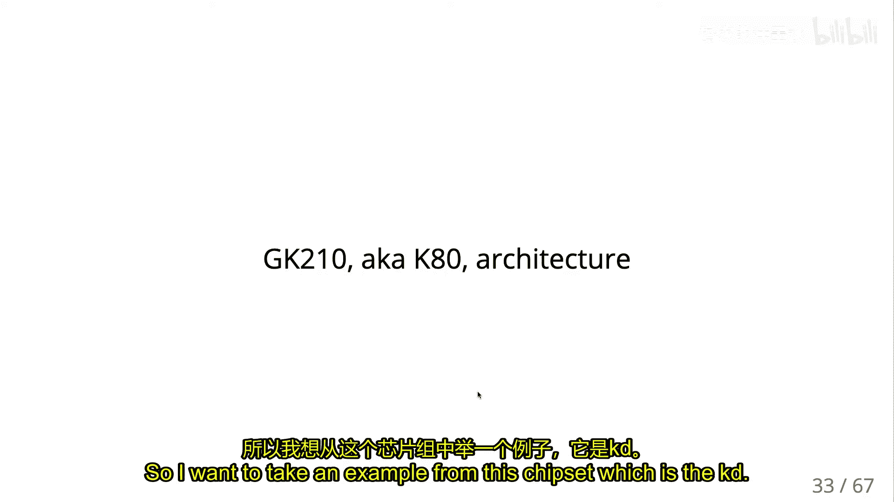
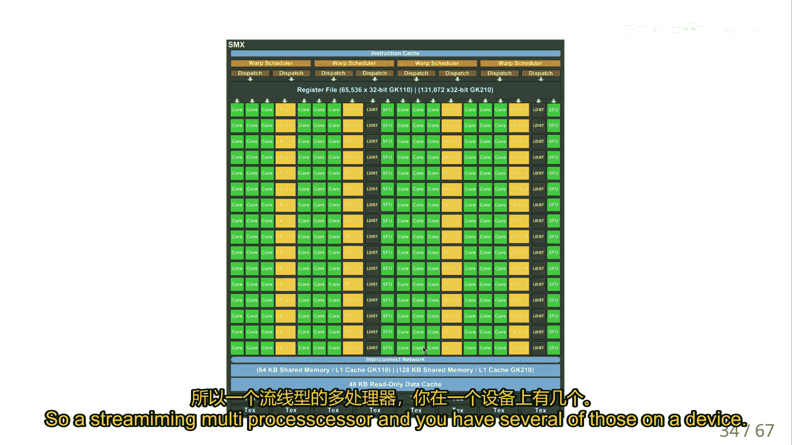
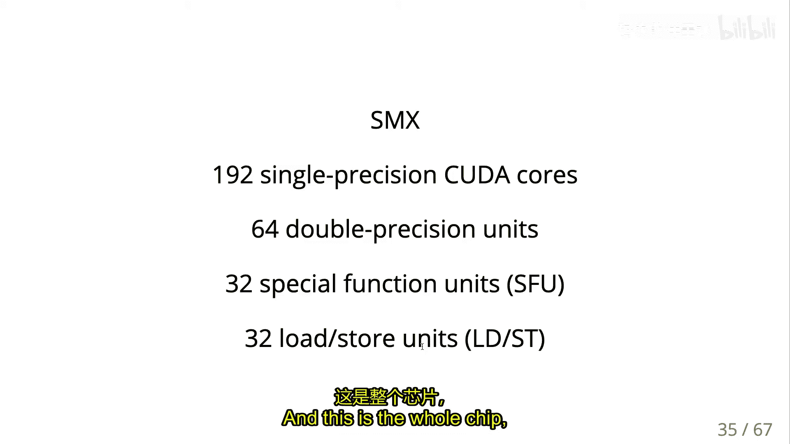
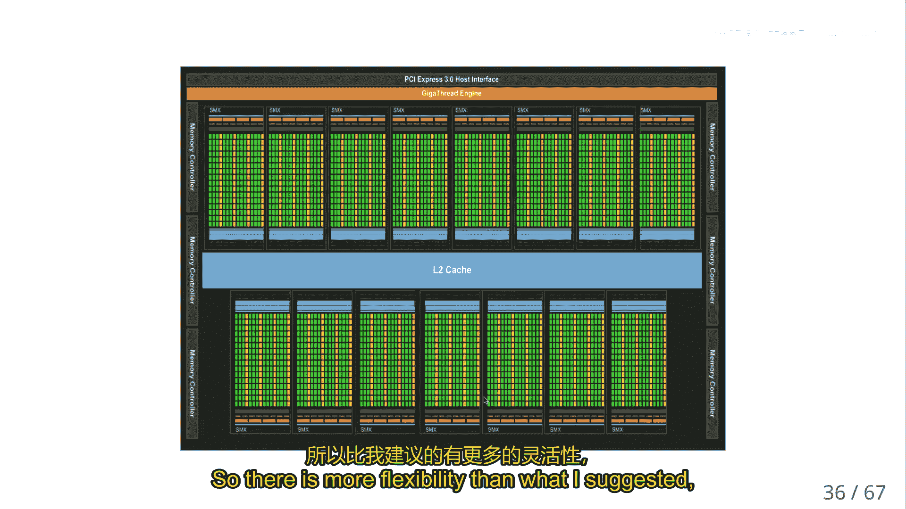
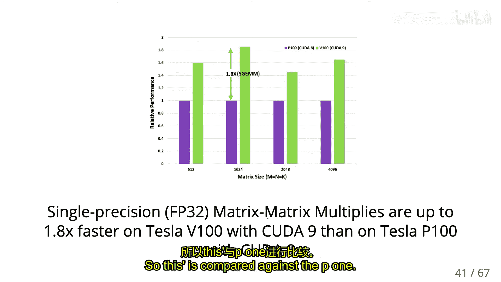
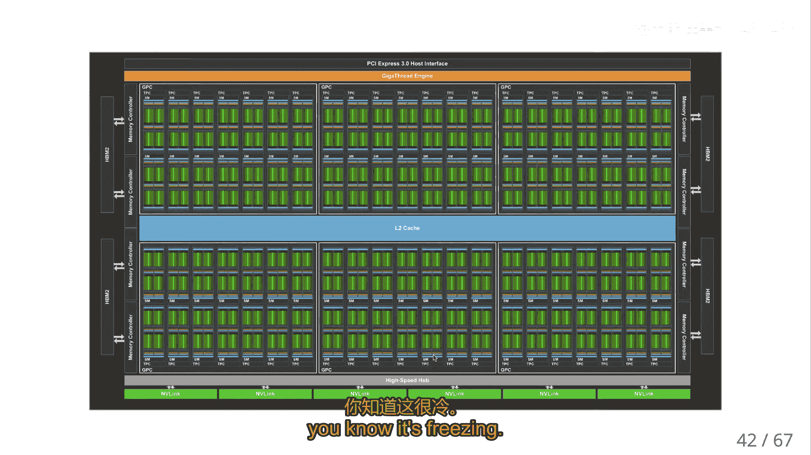
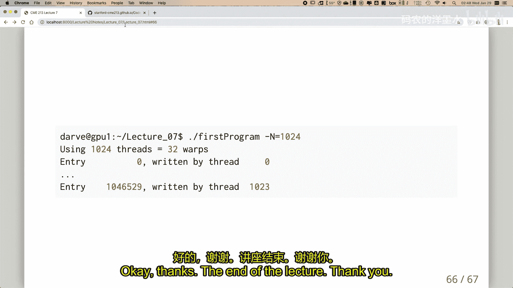

# 007：GPU计算入门

在本节课中，我们将要学习GPU计算的基础知识。我们将从硬件趋势和GPU的设计哲学开始，了解其与CPU的根本区别，并初步接触CUDA编程模型。本节课是后续深入GPU编程的基石。

## 硬件趋势与GPU的兴起

上一节我们介绍了多核CPU编程，本节中我们来看看另一种并行计算范式——GPU计算。其兴起与硬件发展的特定趋势密切相关。

传统CPU的性能提升在频率和单核效率方面已接近物理极限。获取更高性能的主要途径是增加核心数量，走向大规模并行。GPU正是这一趋势的产物，它通过集成大量小型、简单的计算核心来实现极高的理论峰值计算能力。

然而，这种高性能并非没有代价。GPU的高吞吐量设计基于一个核心假设：大量计算单元必须执行**相同的指令**，但操作**不同的数据**。这种模式被称为**单指令多线程**。

## GPU的设计哲学：吞吐量优先

CPU与GPU的设计目标不同，导致了架构上的根本差异。

CPU是“大而智能”的通用处理器。它拥有复杂的控制逻辑、大型缓存和强大的单线程性能，擅长处理分支预测、乱序执行等复杂任务，但对功耗和芯片面积的开销较大。

GPU则是“小而专注”的吞吐量处理器。它包含成千上万个简化后的计算核心，每个核心的能力有限（例如，缓存很小，控制逻辑简单），但整体上能并行处理海量数据。其设计哲学类似于管理一支军队：如果所有士兵（线程）步调一致地执行相同命令，管理就非常高效；但如果每个士兵都想做不同的事情，指挥就会陷入混乱。

因此，GPU编程的关键在于发掘和表达应用程序中的**规则并行性**。典型的适用场景包括：
*   图像渲染（每个像素的计算独立且相似）
*   稠密矩阵运算
*   规则网格上的有限差分计算
*   深度学习中的张量运算

## GPU作为协处理器

GPU通常被称为“加速器”或“协处理器”，这意味着它不能独立运行完整的程序或操作系统。

编程模型是**主机-设备**模型：
*   **主机**：CPU及其内存（主机内存）。
*   **设备**：GPU及其内存（设备内存）。

程序流程如下：
1.  CPU代码在主机上执行。
2.  当需要GPU计算时，CPU会：
    *   在GPU上分配内存 (`cudaMalloc`)。
    *   将数据从主机内存复制到设备内存 (`cudaMemcpy`)。
    *   启动一个在GPU上执行的函数，称为**内核** (`kernel<<<...>>>`)。
    *   将结果从设备内存复制回主机内存 (`cudaMemcpy`)。
    *   释放设备内存 (`cudaFree`)。

需要特别注意，内核启动是**异步**的：CPU在发出启动指令后立即继续执行，而不会等待内核完成。数据拷贝操作（如从设备到主机）通常是**同步**的，会阻塞CPU直到传输完成。

## CUDA编程模型核心概念

CUDA的编程模型直接反映了GPU的硬件层级结构，主要包含以下几个核心概念：

### 线程、线程块与网格
这是CUDA编程模型的层次结构。
*   **线程**：最基本的执行单元。但请注意，GPU线程比CPU线程“轻量”得多，创建和切换开销极低，因为所有资源在启动内核时已预分配。
*   **线程块**：一组线程的集合。一个块内的线程：
    *   被调度到同一个**流式多处理器**上执行。
    *   可以**通过共享内存进行高效通信**。
    *   可以**相互同步**。
    *   数量有限制（例如，通常最多1024个线程）。
*   **网格**：所有线程块的集合，代表了一次内核启动的全部工作。

### 线程束
**线程束**是GPU硬件执行的基本单位，大小固定为**32个线程**。一个线程束中的所有线程在每个时钟周期必须执行**相同的指令**。如果线程间存在分支（如if/else），会导致线程束**分化**，即不同路径的线程必须串行执行，严重降低性能。因此，编写高效GPU代码时，应尽量避免线程束内的分支。

### 内存层次
GPU拥有复杂的内存层次，对性能至关重要：
*   **寄存器**：最快，每个线程私有。
*   **共享内存**：一个线程块内共享，速度快，用于线程间协作。
*   **全局内存**：所有线程可访问，容量大但速度慢（相对而言）。
*   **常量内存**、**纹理内存**：具有缓存特性的只读内存。

高效编程的关键是尽可能让数据驻留在靠近计算单元的快速度内存中（寄存器和共享内存），并合并对全局内存的访问（即让一个线程束中的线程访问连续的内存地址），以利用高带宽。

## 实践准备：环境设置与第一个程序

为了将理论付诸实践，我们需要设置GPU编程环境。

以下是环境设置步骤：
1.  确保拥有支持CUDA的NVIDIA GPU和驱动程序。
2.  安装CUDA工具包。
3.  使用`deviceQuery`程序验证安装并查看设备属性（如计算能力、核心数量、内存带宽）。
4.  使用`bandwidthTest`程序测试主机与设备之间的数据传输带宽。

我们将编译并运行一个简单的向量加法内核示例。这个程序揭示了CUDA编程的基本结构：
*   主机代码负责分配内存、复制数据和启动内核。
*   设备代码（内核）使用特殊的`__global__`关键字声明，并通过`threadIdx.x`、`blockIdx.x`等内置变量来区分不同线程的工作。

在接下来的课程中，我们将详细剖析这段代码，并探索如何优化它以充分利用GPU硬件。

## 总结

本节课中我们一起学习了GPU计算的入门知识。我们了解到GPU是一种为高吞吐量而设计的并行处理器，其核心哲学是通过大量简单核心执行相同指令来获得性能。我们介绍了主机-设备编程模型，以及CUDA中线程、线程块、网格和线程束的核心概念。最后，我们为动手实践设置了环境。理解这些基础是后续学习更复杂GPU编程技术和优化策略的关键。