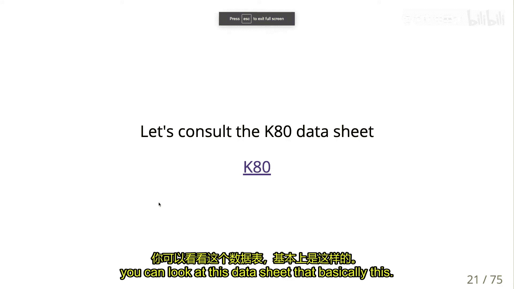
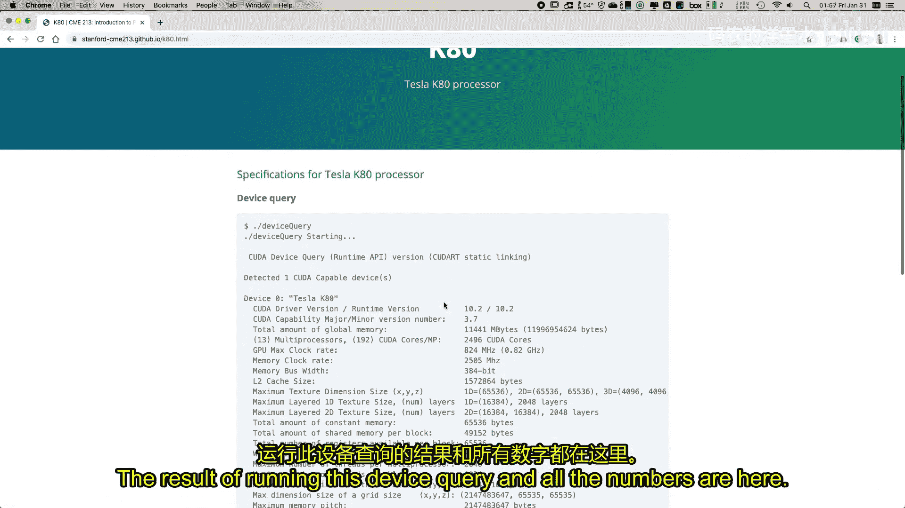
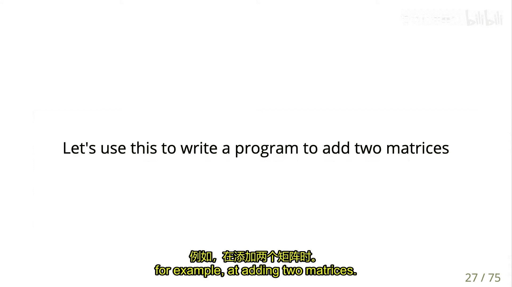
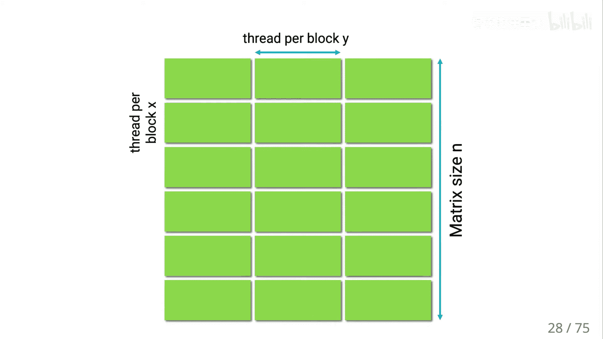

# 008：NVCC与CUDA编程基础 🚀

在本节课中，我们将学习CUDA编程的基础知识，包括如何编译和运行CUDA程序，理解线程、块和网格的组织方式，以及掌握内存管理和内核启动的基本语法。

---

## 概述

本节课将介绍CUDA编程的核心概念。我们将从如何设置GPU环境开始，逐步深入到CUDA内核的编写、编译过程以及线程的组织模型。理解这些内容是完成后续作业和进行GPU编程的基础。

---

## 环境设置与第一个程序

上一节我们介绍了GPU计算的基本架构。本节中，我们来看看如何设置环境并运行第一个CUDA程序。

首先，你需要获取并运行一个包含CUDA环境的脚本。该脚本将创建一个名为`gpu1`的虚拟机实例。你可以使用`gcloud compute ssh`命令登录该虚拟机。

将本地文件复制到虚拟机实例后，解压文件并确保`helper`头文件库存在。接着，你可以编译并运行`deviceQuery`程序来获取GPU设备信息，以及运行`bandwidthTest`程序来测量主机与设备之间的数据传输带宽。





以下是将文件复制到虚拟机的命令示例：
```bash
scp -r local_directory user@gpu1-instance-ip:remote_directory
```

---

## CUDA内核与内存管理

现在我们已经有了运行环境，接下来深入了解CUDA程序的结构。

在CUDA中，内核是运行在GPU上的函数。内核启动是异步的，这意味着CPU在启动内核后会继续执行后续代码，而不会等待内核完成。因此，内核中的错误通常不会直接反映到CPU端，需要使用`checkCudaErrors`函数来检查CUDA API调用是否成功。

内存管理在CUDA中有所不同。使用`cudaMalloc`在GPU上分配内存，使用`cudaMemcpy`在主机（CPU）和设备（GPU）之间传输数据，最后使用`cudaFree`释放内存。

以下是一个简单的内存分配和内核启动示例：
```c
int *d_output;
cudaMalloc(&d_output, n * sizeof(int));
kernel<<<1, n>>>(d_output);
cudaMemcpy(h_output.data(), d_output, n * sizeof(int), cudaMemcpyDeviceToHost);
cudaFree(d_output);
```



变量`d_output`存储在CPU内存中，但其值是一个指向GPU内存地址的指针。在CPU上解引用这个指针（如`*d_output`）是没有意义的。

---



## 线程组织：块与网格

理解了基本的内存操作后，我们来看看CUDA如何组织大量的并行线程。

内核通过三重尖括号`<<< >>>`语法启动。第一个参数是**网格（Grid）**中**块（Block）**的数量，第二个参数是每个块中**线程（Thread）**的数量。例如，`kernel<<<numBlocks, threadsPerBlock>>>`。

一个块中的所有线程必须位于同一个**流式多处理器（SM）**上。每个SM有资源限制，例如最大线程数。因此，块的大小（线程数）不能超过`1024`。网格则可以包含大量块，足以覆盖整个计算问题。

线程的执行模型类似于一个隐式的并行循环。每个线程通过内置变量`threadIdx.x`获取其在线程块内的唯一索引，通过`blockIdx.x`获取其所在块的索引。线程的全局ID可以通过以下公式计算：
```
globalId = blockIdx.x * blockDim.x + threadIdx.x
```

为了确保所有线程都能有效工作，线程总数（即`网格大小 × 块大小`）应略大于或等于需要处理的数据量`N`，通常使用向上取整的公式：
```
numBlocks = (N + threadsPerBlock - 1) / threadsPerBlock
```
在内核中，需要添加条件判断，防止超出`N`的线程进行无效操作。

---

## 编译CUDA代码：NVCC与PTX

掌握了编程模型后，我们需要了解如何将CUDA代码编译成可执行文件。

CUDA的编译分为两个阶段，以平衡性能与兼容性。
1.  **第一阶段**：生成**PTX**（Parallel Thread Execution）代码。PTX是一种虚拟架构的中间代码，它定义了一组功能特性。
2.  **第二阶段**：将PTX代码编译为特定GPU架构（如`sm_37`）的本地二进制代码（称为`cubin`）。

使用`nvcc`编译器时，用`-arch=compute_XX`指定虚拟架构（生成PTX），用`-code=sm_YY`指定真实架构（生成二进制）。例如：
```bash
nvcc -arch=compute_50 -code=sm_50,sm_52 mycode.cu -o myprogram
```
如果运行时没有找到匹配的二进制代码，但存在兼容的PTX代码，驱动程序会进行**即时编译（JIT）**，将PTX转换为当前GPU的二进制代码，但这会增加启动时间。

对于本课程使用的硬件（计算能力3.7），编译命令通常简化为：
```bash
nvcc -arch=sm_37 mycode.cu -o myprogram
```

---

## 总结


本节课我们一起学习了CUDA编程的入门知识。我们了解了如何设置GPU环境，掌握了CUDA程序的基本结构，包括内核启动、设备内存管理以及主机与设备间的数据传输。我们深入探讨了CUDA的线程组织模型，理解了网格、块和线程的层次关系及其索引方式。最后，我们学习了CUDA的两阶段编译过程，以及如何为特定硬件架构编译代码。这些概念是进行高效GPU并行计算的基础。