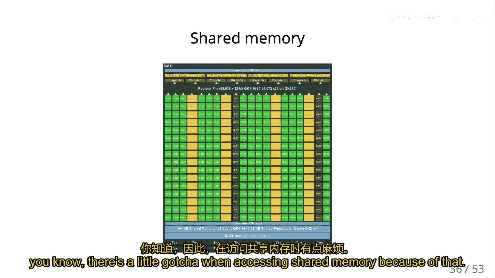
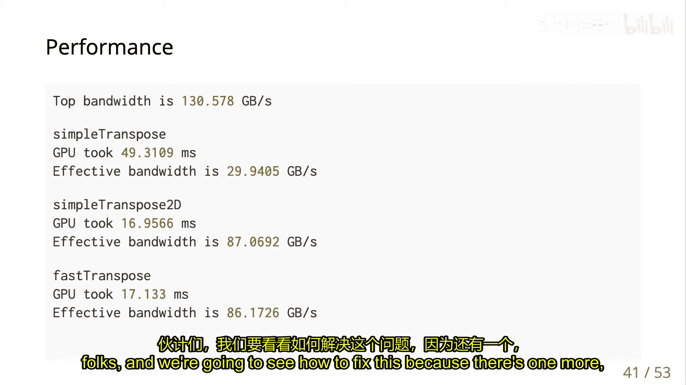
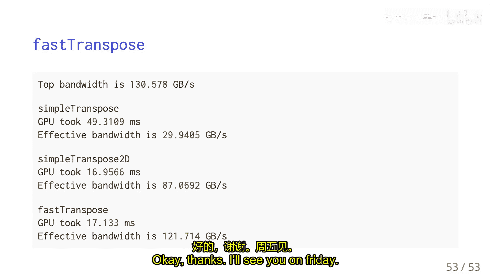

# 009：GPU共享内存优化 🚀

在本节课中，我们将深入学习GPU编程中的内存层次结构，特别是共享内存的使用。我们将探讨如何通过优化内存访问模式来提升GPU程序的性能，并详细分析矩阵转置这一经典案例。

## 概述

GPU的性能瓶颈通常在于内存带宽。为了最大化性能，我们需要理解并优化数据在GPU不同内存层级（如全局内存、共享内存、缓存）之间的传输。本节课将重点介绍共享内存的概念、工作原理以及如何利用它来优化内存访问模式，特别是通过矩阵转置的例子来展示优化前后的性能差异。

## GPU内存层次与缓存

上一节我们介绍了GPU的基本架构。本节中，我们来看看GPU的内存层次结构，特别是L1和L2缓存的作用。

GPU拥有L1和L2缓存，但其具体使用方式取决于显卡的计算能力（CUDA Capability）。通常，L1缓存与特定的流式多处理器（SMX）关联，而L2缓存则在所有SMX之间共享。

*   **L1缓存**：在现代GPU中，L1缓存不仅用于缓存从全局内存获取的数据，更重要的是，它被用来存储线程的局部变量，甚至作为寄存器文件的扩展。这使得单个线程可用的寄存器数量远多于传统CPU。
*   **L2缓存**：这是一个更传统的缓存，主要用于缓存对全局内存的读写访问，以减少对主内存的直接访问。

内存访问的基本单位是**缓存行**。当从内存请求一个变量（如一个4字节的浮点数）时，硬件通常会一次性获取一个连续的32字节（或128字节）的数据块。这意味着，如果程序只使用了这32字节中的一小部分，内存带宽就被浪费了。

## 内存访问模式与性能

理解内存访问模式是优化的关键。在GPU上，我们需要在**线程束**的层面进行分析，而不是单个线程的顺序访问。

一个线程束包含32个线程，它们在同一时刻执行相同的指令但处理不同的数据。当线程束执行一条加载或存储指令时，硬件会收集所有32个线程请求的内存地址，并将它们合并成尽可能少的缓存行请求。

以下是分析内存访问效率的要点：

*   **合并访问**：理想情况下，一个线程束中所有线程访问的内存地址是连续的。这样，对全局内存的一次请求就能获取所有需要的数据，带宽利用率最高。
*   **非合并访问**：如果线程束访问的地址分散或不连续，则可能需要多个缓存行请求来获取相同数量的数据，导致带宽浪费和性能下降。

让我们通过一个简单的内存复制内核代码来理解：

```cuda
__global__ void copy_kernel(float *out, const float *in, int n) {
    int idx = blockIdx.x * blockDim.x + threadIdx.x;
    if (idx < n) {
        out[idx] = in[idx];
    }
}
```

对于这个内核，线程束`0`的线程（`idx`从0到31）将访问`in[0]`到`in[31]`。这是一个连续的块，因此读取操作是完美合并的。写入`out`数组同理。

## 矩阵转置：基础实现与问题

现在，我们应用这些概念来分析一个经典问题：矩阵转置。我们将看到初始实现的问题，并逐步优化。

矩阵转置的操作是将矩阵的行和列互换。一个基础的实现如下：

```cuda
__global__ void transpose_naive(float *out, const float *in, int nx, int ny) {
    int ix = blockIdx.x * blockDim.x + threadIdx.x;
    int iy = blockIdx.y * blockDim.y + threadIdx.y;
    if (ix < nx && iy < ny) {
        out[ix * ny + iy] = in[iy * nx + ix]; // 读 in[iy][ix], 写 out[ix][iy]
    }
}
```

在这个实现中：
*   **读取模式**：对于固定的`iy`（行），`ix`（列）连续变化。因此，从`in`矩阵的读取是合并的（“好家伙”）。
*   **写入模式**：对于固定的`ix`（现在作为输出矩阵的行），`iy`连续变化。这意味着写入`out`矩阵时，相邻线程写入的内存地址间隔了`ny`个元素（一行的长度）。如果`ny`很大，这会导致严重的非合并访问（“坏家伙”），性能低下。

## 使用共享内存优化矩阵转置

为了同时优化读取和写入，我们可以引入**共享内存**。共享内存是位于GPU芯片上的高速内存，由一个线程块内的所有线程共享。其延迟极低，带宽很高。

使用共享内存优化转置的策略分为三步：
1.  **从全局内存合并读取**一个数据块到共享内存。
2.  在线程块内部进行**转置操作**（在共享内存中完成，成本极低）。
3.  从共享内存**合并写入**转置后的数据块到全局内存。

以下是优化后的内核代码框架：



```cuda
__global__ void transpose_shared(float *out, const float *in, int nx, int ny) {
    __shared__ float tile[BLOCK_DIM][BLOCK_DIM];
    int x = blockIdx.x * BLOCK_DIM + threadIdx.x;
    int y = blockIdx.y * BLOCK_DIM + threadIdx.y;

    // 1. 合并读取到共享内存
    if (x < nx && y < ny) {
        tile[threadIdx.y][threadIdx.x] = in[y * nx + x];
    }
    __syncthreads(); // 等待块内所有线程完成加载

    // 2. 计算转置后的全局坐标
    int x_out = blockIdx.y * BLOCK_DIM + threadIdx.x;
    int y_out = blockIdx.x * BLOCK_DIM + threadIdx.y;

    // 3. 从共享内存合并写入到全局内存
    if (x_out < ny && y_out < nx) {
        out[y_out * ny + x_out] = tile[threadIdx.x][threadIdx.y];
    }
}
```

**`__syncthreads()`** 是必要的，它确保线程块中的所有线程都已完成将数据写入共享内存`tile`的操作后，才允许任何线程开始从`tile`中读取数据。

## 共享内存的存储体冲突

然而，简单地使用共享内存可能不会带来预期性能提升，因为存在**存储体冲突**的问题。



共享内存被划分为多个（例如32个）大小相等的存储体。理想情况下，一个线程束中的32个线程应同时访问32个不同的存储体，从而实现完全的并行访问，获得最大带宽。


如果线程束中多个线程访问同一个存储体（除非访问的是完全相同的内存地址），就会发生存储体冲突。冲突的访问会被序列化处理，从而降低有效带宽。

在之前的转置代码中，读取`tile[threadIdx.y][threadIdx.x]`是连续的（无冲突），但写入`tile[threadIdx.x][threadIdx.y]`时，当`BLOCK_DIM`是存储体数量的整数倍（如32）时，就会发生严重的存储体冲突。

**解决方案**：填充共享内存数组。通过将共享内存数组的宽度增加1，可以改变访问模式，避免存储体冲突。

```cuda
__shared__ float tile[BLOCK_DIM][BLOCK_DIM + 1]; // 填充以避免存储体冲突
```
这样，`tile[threadIdx.x][threadIdx.y]`的访问模式就从步长为`BLOCK_DIM`变为步长为`BLOCK_DIM+1`（一个奇数），从而确保线程束中的线程访问不同的存储体。

## 总结

本节课中我们一起学习了GPU内存优化的核心知识。我们首先回顾了GPU的内存层次和缓存行概念，理解了合并访问对性能的关键影响。然后，我们以矩阵转置为例，分析了基础实现中写入操作的非合并访问问题。接着，我们引入了共享内存作为解决方案，通过“全局内存->共享内存（合并读）->块内转置->全局内存（合并写）”的三步策略来优化。最后，我们揭示了共享内存使用中的陷阱——存储体冲突，并通过数组填充技术解决了它。



掌握这些概念和技术，对于编写高性能的GPU程序至关重要。在接下来的课程和作业中，你将有机会亲自实践这些优化技巧。