# 010：作业4详解与性能优化

在本节课中，我们将回顾上一讲的部分内容，并重点讲解作业4。作业4是课程中较为复杂的作业之一，涉及CUDA编程中的性能优化核心概念。我们将学习如何通过优化线程块配置、内存访问模式和算术强度来提升GPU内核的性能。

---

## 课程安排与作业说明

上一节我们介绍了GPU的硬件执行模型。本节中，我们来看看具体的课程安排和作业要求。

作业3的截止日期是下周三。为了让大家有更灵活的时间安排，并确保能在学期末完成所有工作，作业4的截止日期有所延后。但请注意，作业4本身较为复杂，建议尽早开始。

关于最终项目，我们将在两周后启动，并持续到学期末。强烈建议大家在开始最终项目前完成作业4，以便能集中精力应对更具挑战性的项目。

---

## 核心概念：延迟、带宽与流水线

为了理解GPU性能优化的本质，我们需要引入一个类比：全球贸易。

假设在美国生产铅笔成本高昂，因此选择在中国外包生产。虽然跨太平洋运输需要数月，但通过使用大量货轮并行运输，可以使得货物几乎每天都能抵达，从而隐藏了漫长的单次运输延迟。

这个类比精确地对应了处理器设计中的**流水线**技术。

*   **延迟**： 完成单个操作所需的总时间。例如，进行一次浮点加法可能需要20个时钟周期。
*   **带宽**： 当流水线完全充满时，单位时间内完成操作的数量。例如，每个时钟周期都能输出一个浮点加法结果。

**公式**:
*   延迟 = 操作从开始到结束的总时间
*   带宽 = 单位时间内完成的操作数量

硬件设计者将复杂操作（如浮点运算、内存访问）分解为多个阶段，形成流水线。只要我们有足够多**独立**的操作任务，就能让流水线的每个阶段在每个时钟周期都处于忙碌状态，从而用高带宽掩盖了高延迟。

这带来了两个关键要求：
1.  需要有大量独立的任务（高并发性）。
2.  任务数量需要远大于流水线的深度。

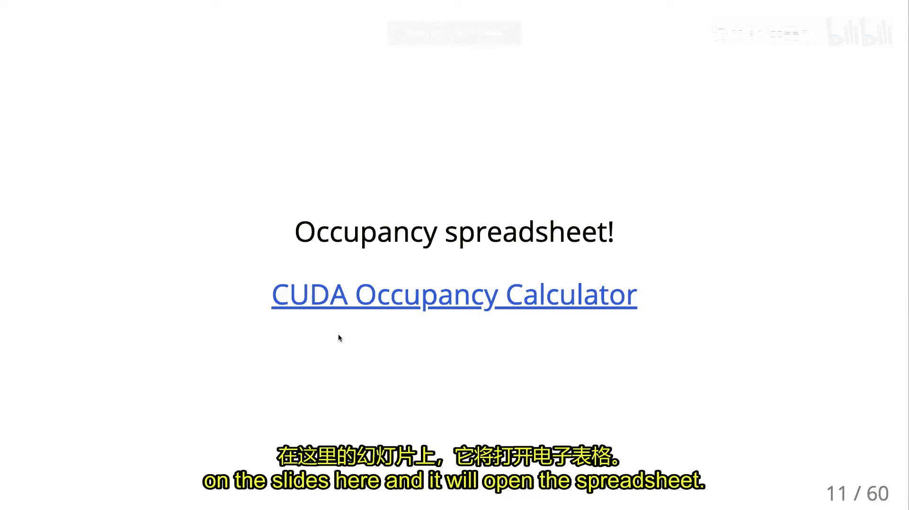

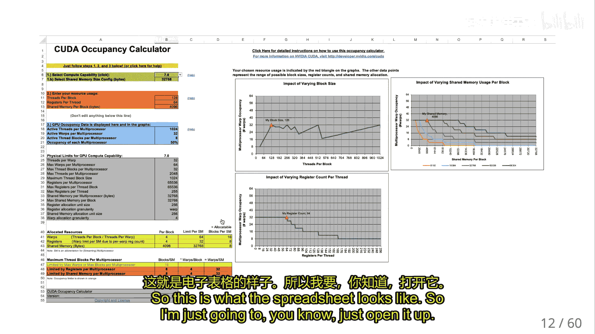

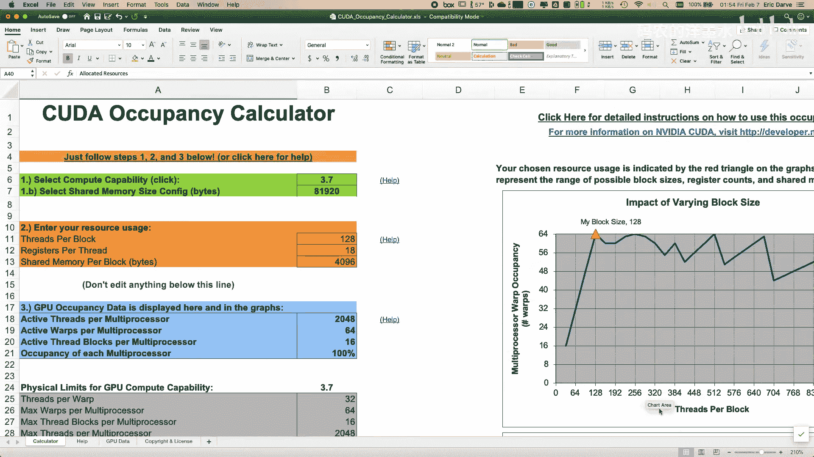

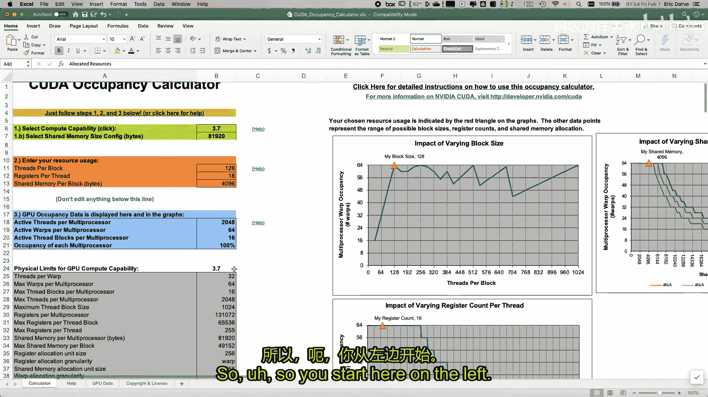

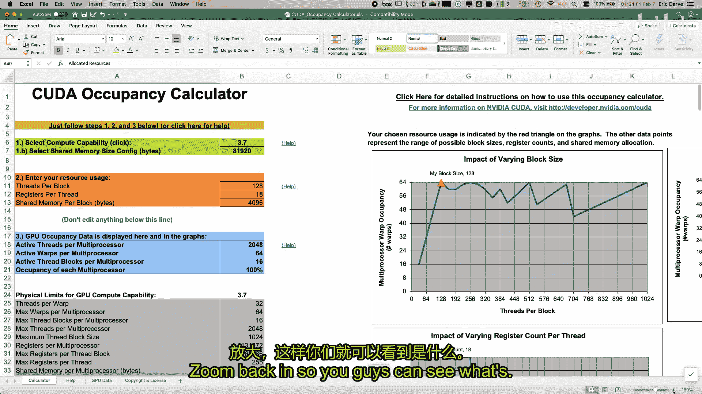

---

## GPU资源限制与占用率

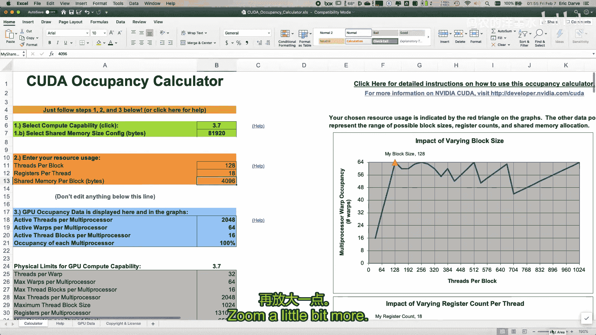

那么，如何在实际编程中实现高并发呢？我们受到GPU硬件资源的限制。

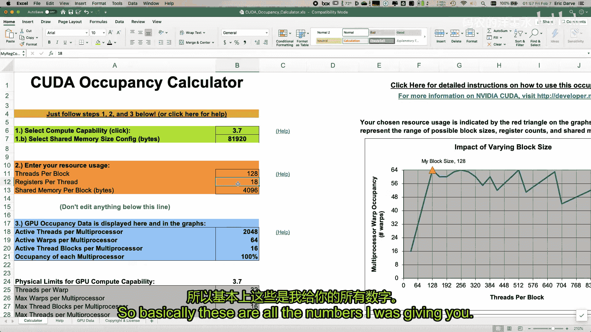

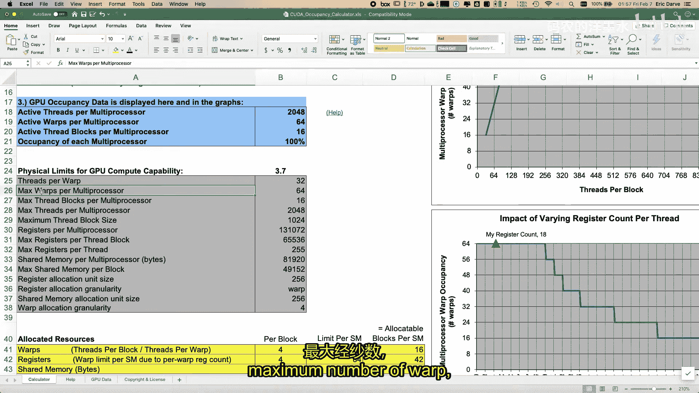

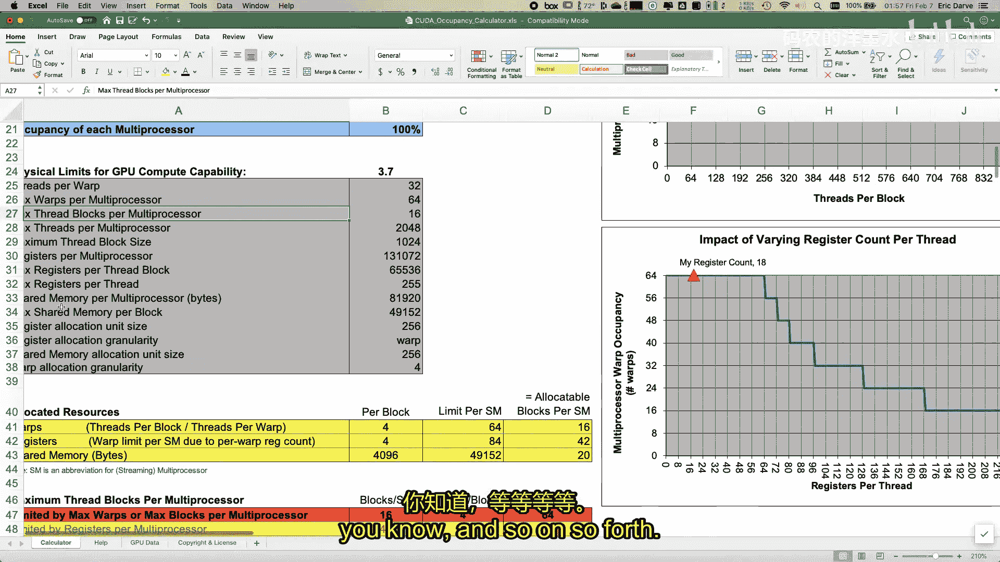

以下是限制活动线程数量的主要硬件资源因素：
*   每个线程块的线程数上限。
*   每个流多处理器上可驻留的线程块数量上限。
*   每个流多处理器上可驻留的线程束数量上限。
*   每个线程块可使用的寄存器数量上限。
*   每个线程块可使用的共享内存上限。

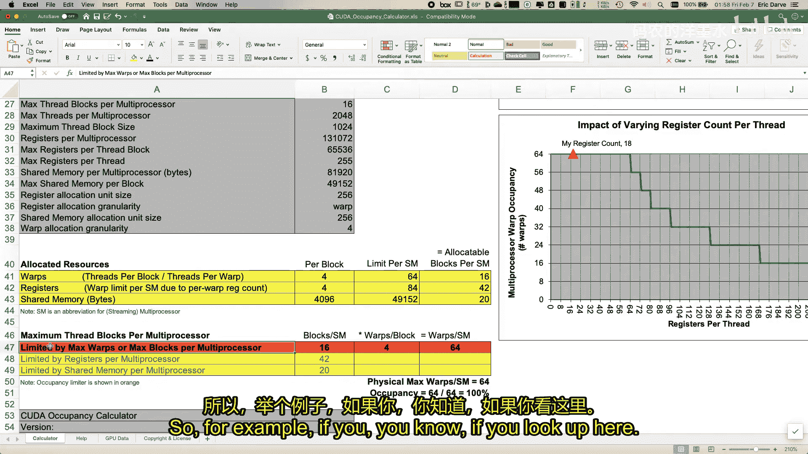

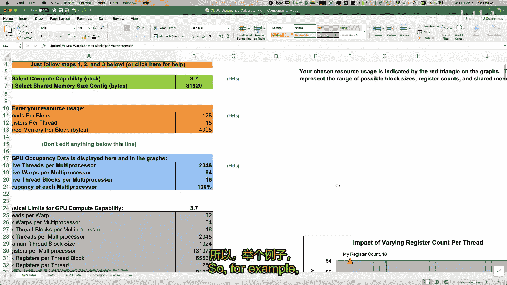

**占用率** 是衡量我们利用硬件并发能力程度的指标。它表示每个流多处理器上实际运行的线程数与其最大支持线程数的比值。我们通常希望获得较高的占用率（例如50%以上）。

为了优化占用率，我们需要选择合适的线程块大小。NVIDIA提供了两种工具：
1.  CUDA API函数（如 `cudaOccupancyMaxPotentialBlockSize`），可在运行时计算推荐配置。
2.  **CUDA占用率计算器** 电子表格，这是一个更直观的离线工具。

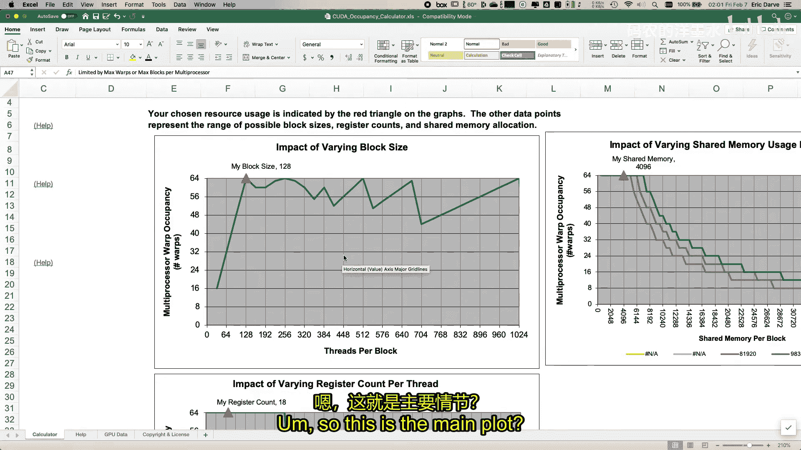

以下是如何使用占用率计算器电子表格的简要说明：
1.  输入计算能力（例如3.7）。
2.  输入内核参数：每个线程块的线程数、每个线程使用的寄存器数量、每个线程块使用的共享内存量。
3.  电子表格会自动计算并显示占用率，并指出当前的限制因素（如线程块数量上限或寄存器数量）。

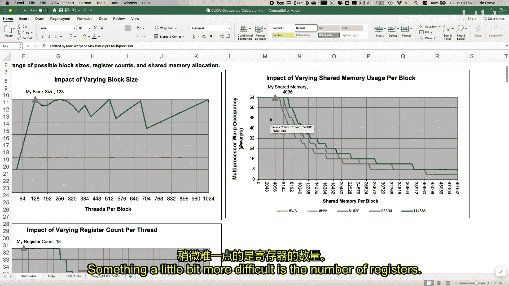

通过调整线程块大小（如256或512），通常可以获得接近100%的占用率。编译代码时，可以使用 `-Xptxas -v` 选项让编译器报告内核使用的寄存器数量和共享内存大小，以便填入电子表格。

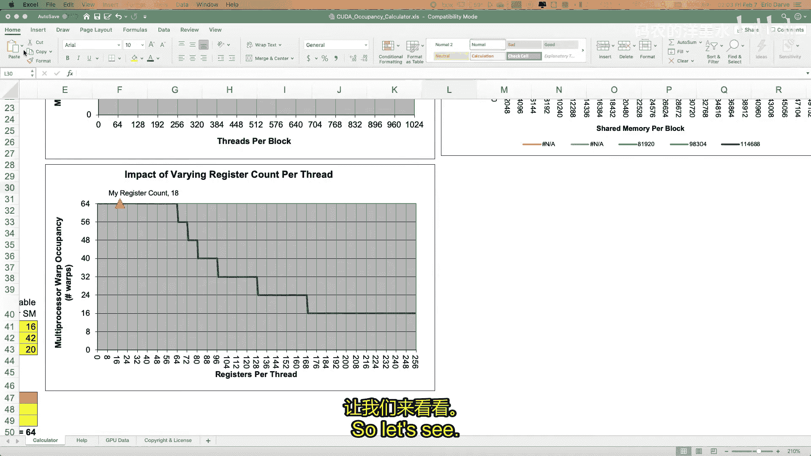

---

## 分支与线程束分化

在GPU编程中，另一个至关重要的性能概念是**分支执行**。

GPU的基本执行单位是**线程束**，包含32个线程。在Volta架构之前，一个线程束中的所有线程共享一个程序计数器，意味着它们必须在同一时刻执行相同的指令。

当代码中存在条件分支（如 `if` 语句）时，如果线程束内的线程走向不同的分支，就会发生**线程束分化**。硬件会通过掩码机制，先串行执行一个分支（其他分支的线程被禁用），再串行执行另一个分支，最后合并。这会导致性能严重下降。

**关键点**： 应尽量确保同一个线程束内的线程执行相同的代码路径。如果分支条件依赖于线程ID，且能确保分支决策在**线程束级别**（而不是线程级别）保持一致，则可以避免分化。

Volta及之后的架构引入了**独立线程调度**，每个线程拥有独立的程序计数器。这缓解了某些由线程束分化导致的复杂死锁问题（例如在锁实现中），但并未从根本上改变所有线程仍需执行相同指令的事实，因此分支优化仍然重要。

---

## 作业4：有限差分法

现在，我们将这些概念应用到作业4中。作业的目标是实现一个2D热传导方程的显式有限差分求解器。

核心操作是应用一个**模板**来更新网格点。对于二阶中心差分，更新点 `(i, j)` 需要其东、南、西、北四个邻居的值。

**代码示例（二阶模板）**:
```cpp
T_new[i][j] = T_old[i][j] + alpha * dt * (
    (T_old[i+1][j] - 2*T_old[i][j] + T_old[i-1][j]) / (dx*dx) +
    (T_old[i][j+1] - 2*T_old[i][j] + T_old[i][j-1]) / (dy*dy)
);
```

作业要求实现不同优化程度的内核，并分析其性能。

---

## 性能分析：算术强度与内存层次

要理解性能瓶颈，需要计算内核的**算术强度**。

**公式**:
`算术强度 = 浮点运算次数 / 内存访问字节数`

*   如果算术强度低，计算受限于**内存带宽**。
*   如果算术强度高，计算受限于**处理器计算能力**。

对于二阶模板：
*   **浮点运算次数**： 大约10次（加法和乘法）。
*   **内存访问次数**： 读取5个点，写入1个点，共6个浮点数（24字节）。
*   **算术强度**： 约 `10 ops / 24 bytes ≈ 0.42 ops/byte` 或 `1.67 ops/flop`（假设单精度）。这个值很低，因此内核很可能是**内存带宽受限**。

我们的优化目标就是：**在保持计算量不变的前提下，减少对慢速全局内存的访问次数**。

---

## 优化策略一：全局内存与缓存利用

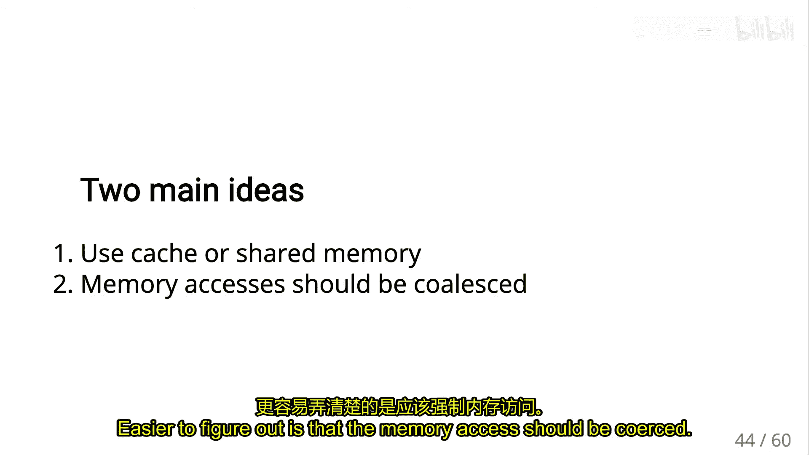

第一种实现（`global`）最简单：每个线程直接读取全局内存中所需的5个点。
*   **优点**： 简单。
*   **缺点**： 内存访问量大，且数据复用率低。相邻线程读取的数据有重叠（如中心点），但L2缓存可能无法有效保留这些数据供其他线程块使用。

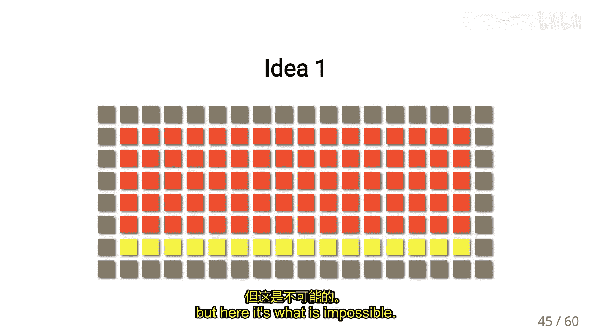

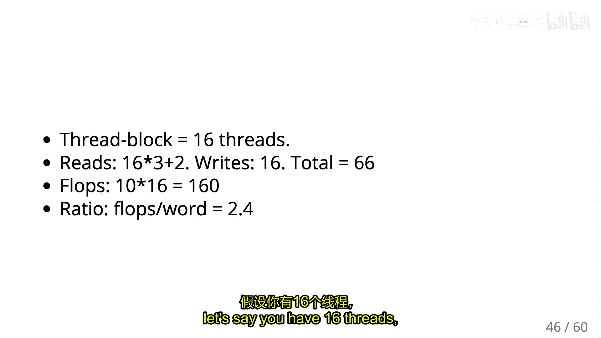

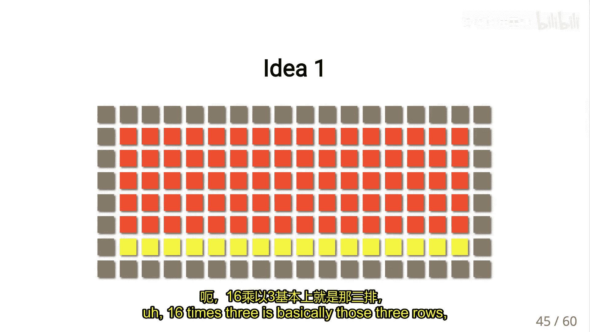

---

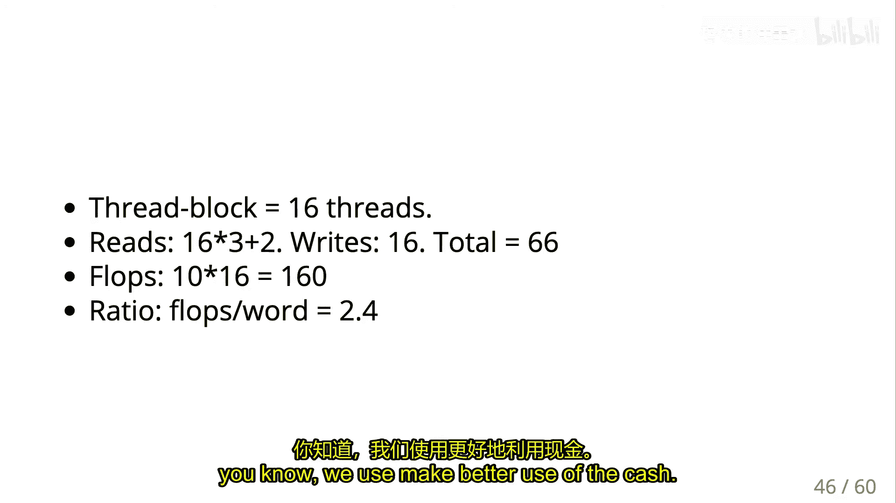

## 优化策略二：平铺与协作加载

第二种实现（`global_tiled`）采用了**平铺**技术。
1.  将线程块分配为处理网格上的一个**矩形区域**。
2.  通过循环，让线程块分批次加载并处理这个矩形区域的多行数据。
3.  当处理下一批行时，上一批的部分数据可能仍在L1/L2缓存中，从而被复用。

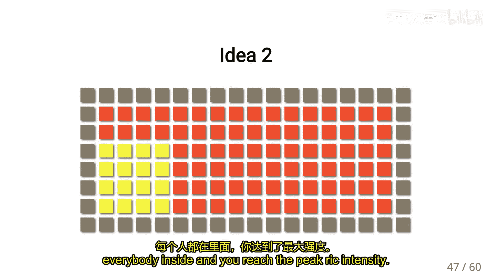

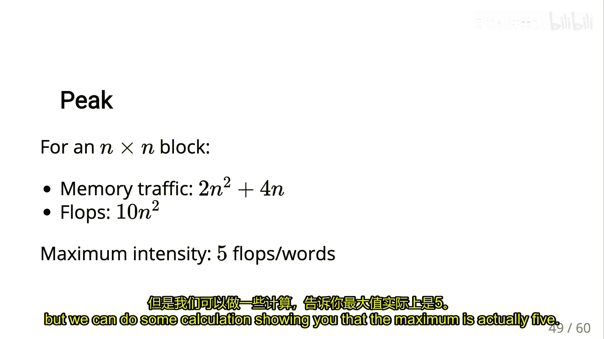

这模拟了“面积/体积比”的优化思想。处理一个大的正方形区域时，内部的数据点被多个线程多次使用（高复用），而边界的数据点使用次数较少。增大这个“瓦片”的尺寸可以提高算术强度。

此外，要确保线程束对全局内存的访问是**合并**的，即连续线程访问连续的内存地址。这通常要求线程块在X方向的维度是合适的倍数（如32或128）。

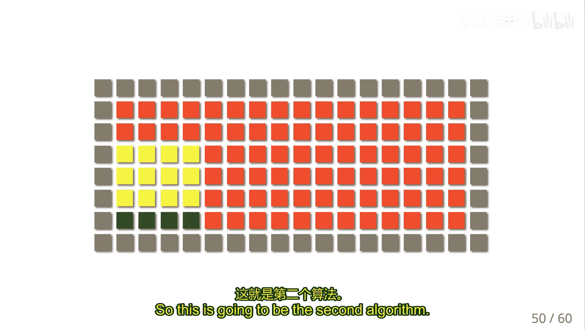

---

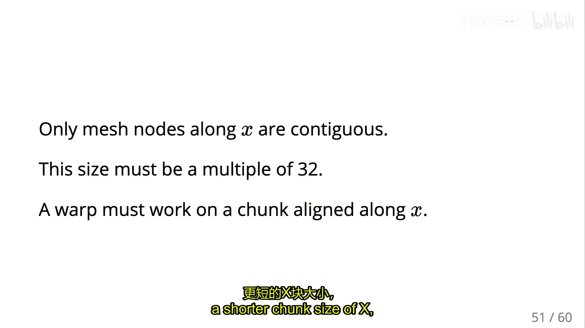

## 优化策略三：共享内存

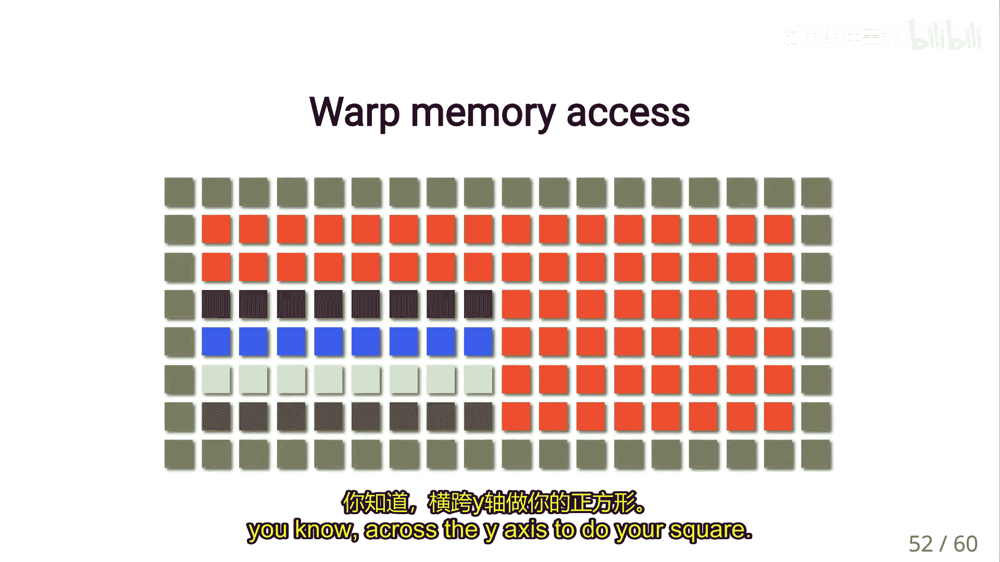

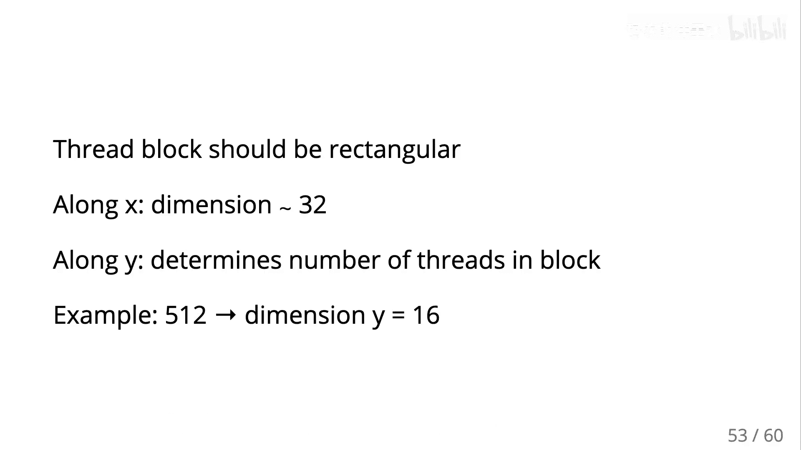

第三种实现（`shared`）使用**共享内存**进行显式数据管理。
1.  **加载阶段**： 线程块的所有线程协作，将所需矩形区域（包括模板所需的**光环区域**）的数据从全局内存加载到共享内存中。
2.  **同步**： 调用 `__syncthreads()` 确保所有数据加载完毕。
3.  **计算阶段**： 每个线程从共享内存中快速读取数据，执行模板计算，并将结果写回全局内存。


共享内存是片上内存，带宽高、延迟低，并且其生命周期在线程块内可控。这确保了数据的复用发生在高速存储器中，最大程度减少了对全局内存的访问。

**注意**： 需要仔细处理边界，确保不越界。分配给共享内存的矩形大小需要在数据复用和线程块并发数量之间取得平衡。

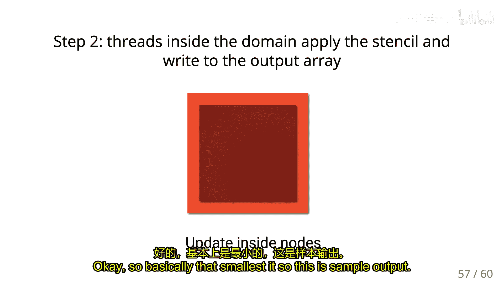

---

## 总结

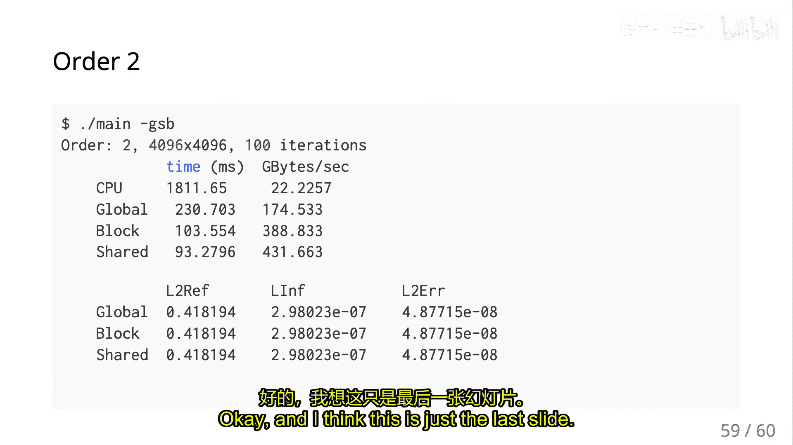

本节课中我们一起学习了：
1.  **流水线、延迟与带宽**： 理解了如何通过高并发隐藏操作延迟。
2.  **GPU资源与占用率**： 学会了使用工具分析和优化内核的线程块配置，以提高硬件占用率。
3.  **分支与线程束分化**： 认识了条件分支对GPU性能的潜在影响及优化原则。
4.  **作业4的有限差分法**： 掌握了实现2D模板计算的基本方法。
5.  **性能优化核心**： 明确了**算术强度**的概念，并学习了三种递进的优化策略：
    *   **全局内存访问**： 基础实现，性能最低。
    *   **平铺技术**： 利用缓存隐式复用数据，提升内存效率。
    *   **共享内存**： 显式管理数据复用，最大化内存带宽利用，性能最佳。

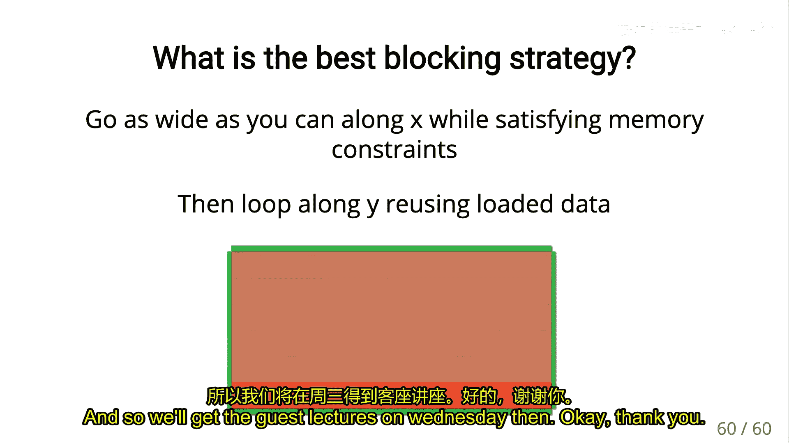

通过完成作业4，你将亲身体验如何将这些理论应用于实践，并显著提升CUDA内核的性能。