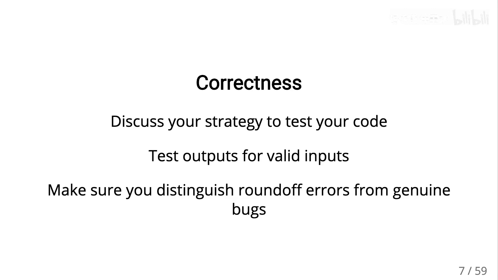
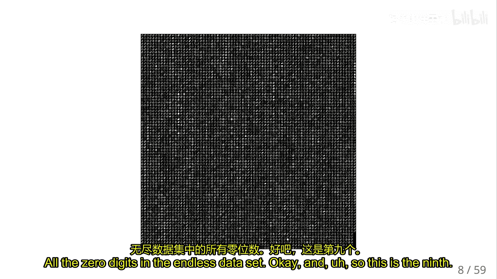
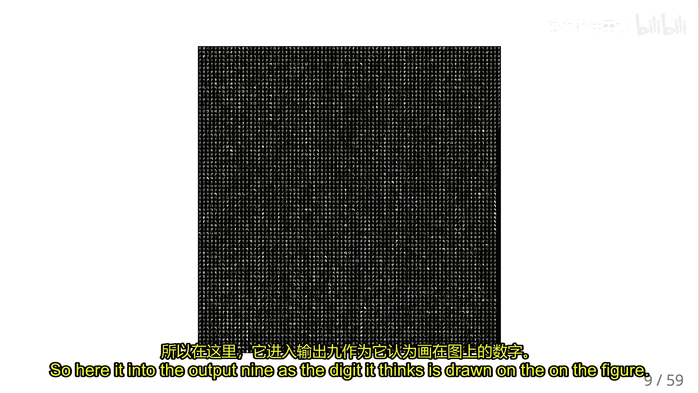
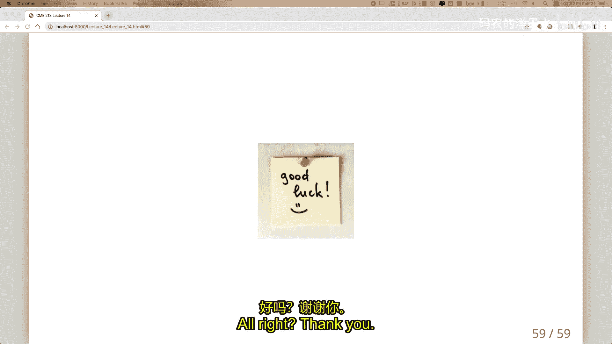

# 011：最终项目概述 🧠

在本节课中，我们将要学习课程最终项目的整体框架与核心要求。该项目要求我们实现一个用于识别手写数字的神经网络，并重点探讨其在CUDA和MPI环境下的并行实现与优化。

## 项目简介与目标

最终项目要求实现一个神经网络，用于识别手写数字。这是一个机器学习中的标准问题，其核心挑战在于如何在CUDA和MPI框架下高效地实现和优化该网络。

项目的核心目标是：
*   实现一个能够正确识别MNIST数据集中手写数字的神经网络。
*   在CUDA平台上进行GPU并行化实现。
*   在MPI框架下进行分布式内存并行化实现。
*   对代码进行性能分析和优化。

## 项目时间线与要求

项目分为两个主要阶段，每个阶段都有明确的交付物和侧重点。

### 初步报告

初步报告的重点是**代码的正确性**。截止日期为3月6日（周五）。你需要提交一份能够通过基础测试、功能正常的代码，并附上一份简短报告说明已完成的工作。此阶段**不考虑性能优化**。

### 最终报告

最终报告是项目的核心，截止日期为3月18日。报告需要详细阐述你所做的优化工作，并包含以下内容：
*   **性能分析**：展示收集的数据、绘制的图表，并对图表进行分析。
*   **性能结果**：最终代码的运行速度，以及优化达到的程度。
*   **报告质量**：报告的组织结构、语法和整体呈现质量。

报告的核心讨论应围绕以下几点展开：
*   如何识别代码中的性能瓶颈（例如通过性能剖析）。
*   如何提出解决方案来解决这些瓶颈。
*   最终的实施结果是什么。

**特别强调**：代码的正确性至关重要，远比实现复杂的优化更重要。在最终阶段，务必确保有一个可以正常工作的“后备”方案，即使它不如你最初设想的方案先进。

## 神经网络基础与项目设定

我们将实现一个相对简单的全连接神经网络来处理MNIST数据集。

### MNIST数据集与网络结构

MNIST数据集包含28x28像素的灰度手写数字图像（0-9）。神经网络的输入是一个展平的图像向量，输出是一个10维向量，代表网络预测该图像为每个数字（0-9）的概率。

我们使用的网络结构包含一个隐藏层：
1.  **输入层**：接收图像向量（例如784维）。
2.  **隐藏层**：进行矩阵乘法 `Z1 = W1 * X + B1`，然后应用非线性激活函数（本项目使用Sigmoid）`A1 = σ(Z1)`。
3.  **输出层**：进行矩阵乘法 `Z2 = W2 * A1 + B2`，然后应用Softmax函数将`Z2`转换为概率分布 `Y_hat = softmax(Z2)`。

选择全连接层（而非卷积层）是为了使项目更专注于矩阵乘法（GEMM）的并行优化，这在CUDA和MPI中都是有趣且核心的问题。

### 训练过程：梯度下降与反向传播

神经网络的训练目标是调整权重（`W1`, `B1`, `W2`, `B2`）以最小化损失函数`J`（例如交叉熵损失），它衡量了网络预测`Y_hat`与真实标签`Y`之间的差异。

训练采用**随机梯度下降（SGD）** 算法：
1.  **前向传播**：输入数据，计算得到预测输出`Y_hat`和损失`J`。
2.  **反向传播**：利用链式法则，从输出层向输入层计算损失函数`J`关于所有权重参数的梯度（`∂J/∂W2`, `∂J/∂B2`, `∂J/∂W1`, `∂J/∂B1`）。
3.  **参数更新**：使用计算出的梯度更新权重：`W = W - α * ∂J/∂W`，其中`α`是学习率。

在SGD中，我们不是在所有训练数据上计算梯度，而是将数据分成小批量（mini-batch），每次仅在一个小批量上计算梯度并更新参数。这能加速收敛并有助于避免陷入局部最优解。

### 过拟合与正则化

当模型参数过多或训练数据有噪声时，模型可能会“过拟合”——即在训练集上表现很好，但在未见过的测试集上表现很差。

为了缓解过拟合，我们引入**L2正则化**。它在损失函数中添加一个惩罚项，鼓励权重值变小：
`J_reg = J + λ * ||W||²`
其中`λ`是正则化系数。较大的`λ`会更强地约束权重，使模型更简单（倾向于线性决策边界）；较小的`λ`则让模型更专注于拟合训练数据。需要通过验证集来调整合适的`λ`值。

## CUDA实现核心：高效GEMM

神经网络计算的核心是稠密矩阵乘法（GEMM）。在CUDA上实现高性能GEMM的关键在于**提高算术强度**，即每次从内存中加载数据后执行更多的浮点运算。

一个朴素的方法是让一个线程计算结果矩阵`C`中的一个元素`C(i,j)`，这需要循环遍历`k`，并加载`A(i,k)`和`B(k,j)`，算术强度很低。

高效的方法是使用**分块矩阵乘法**和**秩1更新**策略：
*   **线程块分块**：一个线程块负责计算`C`中一个`BxB`大小的子块。
*   **数据复用**：该线程块一次性加载`A`的一列块（`B`个元素）和`B`的一行块（`B`个元素）到共享内存。
*   **秩1更新**：利用加载的这`2B`个数据，通过外积运算可以更新整个`BxB`子块，从而进行`B²`次乘加运算。
*   通过增大分块大小`B`，可以显著提高算术强度（`B² / 2B = B/2`），从而逼近GPU的峰值性能。

## MPI并行化策略

在分布式内存系统上，有两种主要的并行化策略。

### 策略一：数据并行

这是较为直观的策略。
*   **数据划分**：将训练图像数据集划分到不同的MPI进程（节点）。
*   **本地计算**：每个进程用自己的数据子集进行前向传播和反向传播，计算**局部梯度**。
*   **梯度聚合**：所有进程使用`MPI_Allreduce`等通信操作，将局部梯度求和，得到**全局梯度**。
*   **参数更新**：每个进程使用相同的全局梯度更新其本地的权重副本。

**优点**：实现简单。
**缺点**：在梯度聚合步骤需要进行大量的全局通信，通信开销可能很大，特别是当权重矩阵很大时。

### 策略二：模型并行（针对全连接层）

这是一种更高效但理解起来更复杂的策略。
*   **数据复制**：每个MPI进程都拥有**全部**的训练图像数据。（初始通信开销，但相对较小且可管理）。
*   **模型划分**：将神经网络的权重矩阵`W1`和`W2`进行划分。例如，在4个进程上，将`W1`按行分成4块，`W2`也相应按行划分。
*   **计算流程**：
    1.  每个进程用完整的输入数据`X`与自己负责的`W1`块相乘，得到`Z1`的局部部分。
    2.  进行激活函数计算（本地）。
    3.  每个进程用自己得到的`A1`局部部分与自己负责的`W2`块相乘，得到`Z2`的局部部分。
    4.  使用`MPI_Allreduce`对`Z2`的局部部分（一个非常“瘦”的矩阵，仅10行）进行求和，得到完整的`Z2`。这一步通信量很小。
    5.  计算输出和损失（本地）。
*   **反向传播的妙处**：在反向传播更新`W1`和`W2`时，由于数据完备性和矩阵划分的对应关系，**除了步骤4中的一次小型Allreduce外，整个过程不需要额外的进程间通信**。每个进程可以独立地更新自己负责的那部分权重。

**优点**：通信开销极低，性能通常远优于数据并行。
**缺点**：算法设计更精巧，需要仔细推导以确保通信最小化。

## 总结与后续安排

本节课我们一起学习了最终项目的全貌。我们明确了项目目标是实现并优化一个手写数字识别神经网络，理解了正确性优先于性能优化的原则。我们回顾了神经网络的前向传播、反向传播和随机梯度下降训练过程。最后，我们探讨了在CUDA上实现高性能GEMM的核心思想，以及MPI环境下数据并行和模型并行两种策略的优劣。

请仔细阅读项目说明文档（Part One和后续的Part Two），其中包含了详细的数学公式、代码框架和实现指引。项目的实践细节和测试方法将在Part Two中提供。

**下节课预告**：我们将进行一次关于代码风格的团队练习活动，这将是富有成效且有趣的一课。请关注邮件通知，确保能够参加。