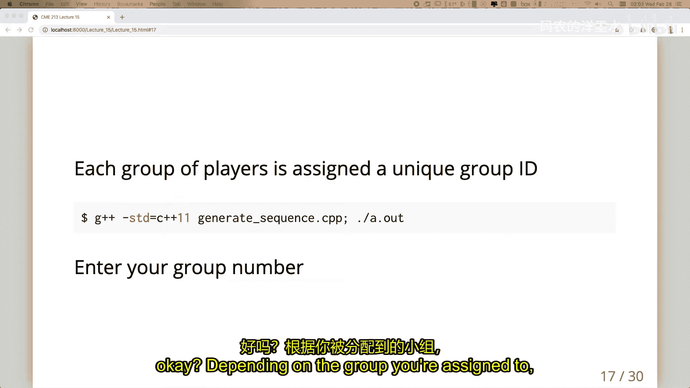
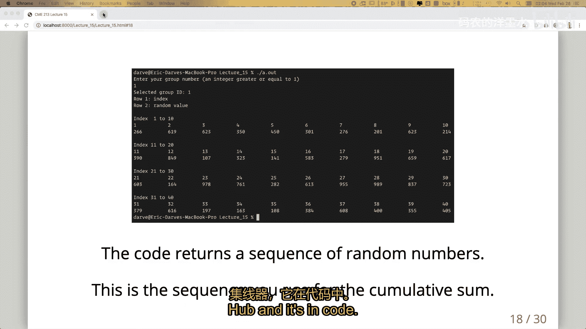
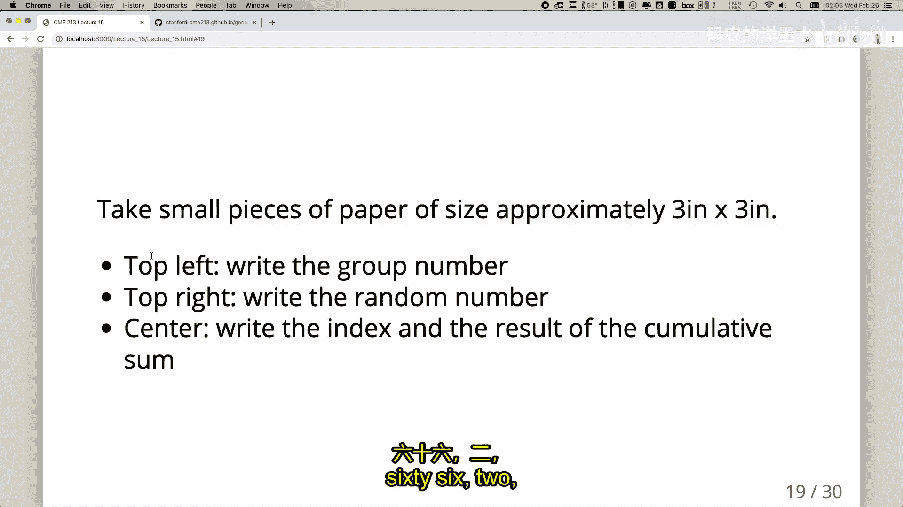
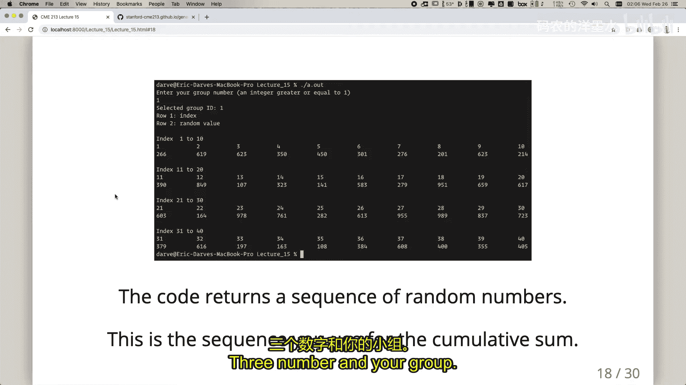
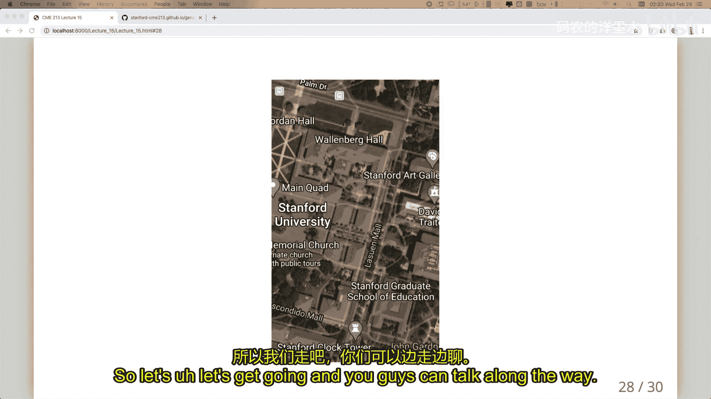

# 012：前缀扫描 🧮

在本节课中，我们将学习并行计算中的一个核心算法——前缀扫描。我们将探讨其基本概念、两种不同的并行实现算法，并通过一个有趣的实践活动来加深理解。

## 概述：什么是前缀扫描？

前缀扫描，有时也称为前缀和，是一种将数组中的每个元素替换为从数组起始位置到该位置所有元素之和的操作。例如，给定数组 `[3, 5, 6, 2, 4, 1, 0, 5]`，其前缀扫描结果为 `[3, 8, 14, 16, 20, 21, 21, 26]`。最后一个元素 `26` 也是整个数组的归约和。这是一个看似顺序的操作，但我们可以利用并行性来加速计算。

## 并行归约：基础回顾

在深入前缀扫描之前，我们先回顾一下并行归约。归约操作（如求和）本质上是顺序的，但通过利用运算的结合律，我们可以并行执行。

**算法流程**：
假设我们有8个数字，我们可以让4个处理器同时进行两两相加，得到4个中间结果。然后，再用2个处理器对这些中间结果进行两两相加，最后用一个处理器完成最终求和。

**复杂度分析**：
*   **时间步数**：在拥有足够多处理器的理想情况下，完成归约所需的时间步数为 **log₂(n)**，其中 `n` 是元素数量。在上述8个元素的例子中，需要3步。
*   **工作量**：并行算法执行的总操作数（浮点运算次数）。一个“工作高效”的算法，其并行工作量与顺序工作量成比例（即比值为常数）。

上一节我们回顾了并行归约的基础，本节中我们来看看如何将类似的思想应用于更复杂的前缀扫描。

## 工作高效的前缀扫描算法

第一种算法是“工作高效”的，意味着其并行工作量与顺序工作量大致成正比（通常有一个常数因子，如2倍）。

该算法分为两个阶段：
1.  **归约阶段**：与标准的并行归约树完全相同。我们自底向上计算部分和，并将结果存储在树节点中。
2.  **分发阶段**：利用第一阶段计算出的部分和，自顶向下地将这些值分发到每个输出位置，从而计算出每个索引对应的前缀和。

**算法特点**：
*   **时间步数**：总共需要 **2 * log₂(n)** 步（归约 log₂(n) 步，分发 log₂(n) 步）。
*   **工作量**：大约为 **2n** 次操作，而顺序扫描需要 `n` 次操作。比值为2，是常数，因此是工作高效的。
*   **处理器利用率**：在计算过程中，并非所有处理器时刻都在忙碌。

以下是该算法电路图的一个简化表示，展示了数据流和加法操作：

```
输入: [a0, a1, a2, a3, a4, a5, a6, a7]
归约阶段:
步骤1: [a0+a1, a2+a3, a4+a5, a6+a7]
步骤2: [(a0+a1)+(a2+a3), (a4+a5)+(a6+a7)]
步骤3: [(a0+a1)+(a2+a3)+(a4+a5)+(a6+a7)]
（分发阶段从这些部分和生成所有前缀和）
```

## 希尔-斯蒂尔前缀扫描算法

第二种算法称为希尔-斯蒂尔算法。它的设计哲学不同：为了减少总的时间步数，它愿意执行更多的工作。

**核心思想**：
该算法尝试同时为所有输出位置构建其对应的“归约树”。通过观察可以发现，相邻输出位置所需的归约树有很大部分是重叠的。算法通过巧妙的“数据偏移”加法来复用这些重叠的计算部分。

**算法步骤**（伪代码描述）：
对于数组 `x`，长度为 `n`（假设是2的幂）：
```cpp
for (int stride = 1; stride < n; stride *= 2) {
    for (int i = stride; i < n; i++) {
        x[i] = x[i] + x[i - stride];
    }
}
```

**算法特点**：
*   **时间步数**：仅需 **log₂(n)** 步。每一步中，所有符合条件的操作都可以并行执行。
*   **工作量**：大约为 **n * log₂(n)** 次操作，远大于顺序的 `n` 次操作。工作量与顺序工作量的比值随 `n` 增长而增长（`log₂(n)` 倍），因此是**工作低效**的。
*   **处理器利用率**：如果处理器数量充足（接近 `n` 个），每一步都能让几乎所有处理器保持忙碌，从而以更少的步数完成计算。

**选择哪种算法？**
这取决于可用的处理器数量：
*   如果处理器数量**远少于**数据量（`n`），工作高效算法通常更快，因为它总工作量更小。
*   如果处理器数量**充足**（与 `n` 可比），希尔-斯蒂尔算法可能更快，因为它所需的同步步数（时间步数）更少。



## 实践活动：人类并行前缀扫描 🏃‍♂️💨

现在，我们将通过一个模拟活动来亲身体验并行计算中的挑战。你们将分组扮演计算机中的不同部件，共同完成一次前缀扫描计算。



### 活动目标与规则





每个小组需要计算本组获得的一组随机数的前缀扫描。我们将模拟一个简化的计算架构，包含三种角色：

**1. 内存单元**
*   **职责**：持有“数据纸片”。每张纸片同一时间只能写一个数字（可以擦除重写）。负责组织和协调整个计算流程，决定下一步操作，并将相应的纸片交给“网络”角色。
*   **类比**：计算机中的内存或寄存器文件，以及控制单元。

**2. 网络单元**
*   **职责**：在“内存单元”和“计算单元”之间搬运数据纸片。一次最多只能搬运**3张**纸片。这模拟了数据在内存和处理器之间传输的延迟。
*   **关键限制**：搬运距离设定为20米。这是性能的关键瓶颈之一。

**3. 计算单元**
*   **职责**：执行加法运算。从“网络单元”接收3张纸片：其中两张写有输入数字，第三张是空白的。将两个输入数字相加，结果写在第三张纸上，然后交还给“网络单元”。
*   **类比**：算术逻辑单元。

### 活动流程与策略

1.  **组队与准备**：分成3组，每组约7人。运行提供的程序生成本组的40个随机数，并将每个数字及其索引写在单独的纸片上。
2.  **角色分配与规划**：小组内部讨论，分配成员扮演上述三种角色。需要考虑：
    *   如何组织算法？（是模仿工作高效算法还是希尔-斯蒂尔算法？）
    *   需要几个“计算单元”？几个“网络单元”？
    *   “内存单元”如何高效地调度操作，避免“计算单元”空闲或“网络单元”拥堵？
    *   如何管理纸片（数据）的流动，确保步骤正确？
3.  **执行计算**：在指定场地，“内存单元”和“计算单元”分区就坐，“网络单元”在期间奔跑传递数据。目标是正确且快速地计算出40个数字的前缀扫描结果。
4.  **总结与反思**：计算结束后，思考哪种角色成为瓶颈？你们的组织策略有效吗？如何改进？

这个活动生动地展示了并行计算中算法选择、负载平衡、通信延迟与计算速度匹配的重要性。

## 总结



本节课中我们一起学习了并行计算中的前缀扫描算法。
*   我们首先理解了前缀扫描的定义及其与归约操作的联系。
*   接着，我们分析了两种经典的并行前缀扫描算法：**工作高效算法**和**希尔-斯蒂尔算法**。前者工作量小但步数多，后者工作量大但步数少，其优劣取决于具体的硬件并行度。
*   最后，通过人类模拟计算的活动，我们直观地体验了并行计算中任务分工、通信开销和资源协调的核心挑战，将理论知识与实践感受结合了起来。