# 013：MPI 消息传递接口

在本节课中，我们将学习并行计算的最后一部分内容：MPI（消息传递接口）。我们将探讨分布式内存计算模型，了解MPI的基本概念、编程模式以及核心通信操作。这对于完成课程作业和最终项目（实现深度神经网络）至关重要。

## 概述：从共享内存到分布式内存

上一节我们介绍了共享内存并行编程。从编程角度看，共享内存平台更简单，因为任何进程都可以访问相同的内存位置，程序员无需担心显式通信。然而，这要求操作系统负责数据移动和一致性维护，当涉及缓存和多核时，事情会变得非常复杂。此外，共享内存的可扩展性存在限制，主要受限于能够有效读写同一内存的核心数量。

因此，更可扩展的方法是将负担转移给程序员，即采用分布式内存模型。在这种模型中，计算节点是独立的，通过网络连接，每个进程只能读写自己的内存。如果进程需要访问其他进程的数据，必须通过显式的消息传递机制。这种方法允许构建具有大量处理器的大型计算机，硬件实现也大大简化。

## MPI 基本概念

MPI 的核心思想是**消息传递**。一个消息是一段连续的内存数据（起始地址和字节数）。如果一个进程（例如 P0）需要将数据发送给另一个进程（例如 P1），它会将这段内存数据通过网络发送出去，接收进程 P1 则将其写入自己的某个内存位置。

这种数据交换通过 **发送（Send）** 和 **接收（Receive）** 操作对完成。程序员需要在代码中明确指出何时发送哪个数组、从哪个进程发送到哪个进程。MPI 是一个定义了一系列函数行为的 API 标准，由不同的供应商库实现，已成为分布式内存计算的事实标准，专注于高性能和高效率。

## 弗林分类法简介

在深入MPI之前，我们简要回顾一下计算机体系结构的经典分类（弗林分类法），这有助于理解不同的并行计算模型：

*   **SIMT（单指令多线程）**： 我们在 CUDA 中见过的模型。一个调度器为线程束（Warp）发出单条指令，束内的所有线程同时执行该指令。线程有一定独立性，但在指令执行上是锁步的。
*   **SIMD（单指令多数据）**： 一个更早的概念，与 GPU 密切相关。处理器具备执行短向量操作的能力（如媒体处理），多个处理单元对不同的数据执行相同的操作，但没有独立的“线程”概念。
*   **MIMD（多指令多数据）**： 多核处理器/多线程的典型模型。不同的处理单元可以执行不同的指令，处理不同的数据，灵活性远高于GPU模型。
*   **SPMD（单程序多数据）**： **这就是 MPI 采用的模型**。多个节点运行**相同的程序**，每个进程被分配一个唯一的 ID（**秩，Rank**，从 0 到 N-1）。根据秩的不同，每个进程可以执行程序的不同分支，处理不同的数据子集（例如计算网格的不同子域或矩阵的不同块）。

## MPI 程序模型与约束

一个典型的 MPI 程序运行流程如下：多个进程运行同一份程序代码，每个进程根据其秩执行不同的任务。进程间通过调用 MPI 的发送和接收函数来显式交换数据。

这种通信被称为 **双面通信（Two-sided Communication）**，必须成对出现（一个发送匹配一个接收）。原因很实际：发送方需要确保数据已就绪；接收方必须提前分配好内存缓冲区来存放即将到来的数据，并且该缓冲区在通信期间不能被其他计算使用。通信完成后，接收方才能使用缓冲区中的数据。

MPI 也有更新的 **单面通信（One-sided Communication）**，但通常需要特定条件保证，通用性不如双面通信。

## 第一个 MPI 程序

MPI 是一个标准，有多种实现库（如 Open MPI、MVAPICH）。它高度可移植，可以在单台多核计算机或大型集群上运行。在云计算环境中（如 GCP），你获得的是虚拟硬件，其底层网络性能可能不如专用高性能集群稳定和快速。

编译 MPI 程序通常使用 `mpic++`。启动 MPI 程序不是简单地执行可执行文件，而是使用 `mpirun` 或 `mpiexec` 命令，例如 `mpirun -n 8 ./my_program` 会在可用资源上启动 8 个进程副本。

以下是一个简单的 MPI 程序 “Hello World” 的结构要点：


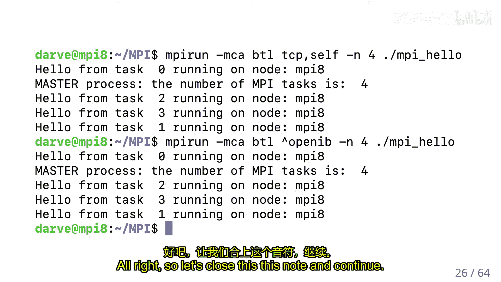

1.  **初始化**： `MPI_Init` 设置 MPI 环境。
2.  **获取信息**：
    *   `MPI_Comm_size`： 获取通信域（communicator，默认是 `MPI_COMM_WORLD`，包含所有进程）中的进程总数。
    *   `MPI_Comm_rank`： 获取当前进程在通信域中的秩（ID）。
3.  **执行计算**： 各进程根据其秩执行相应代码。
4.  **终止**： `MPI_Finalize` 清理 MPI 环境，标志程序正常结束。

## 点对点通信：发送与接收

让我们看一个更复杂的例子：使用蒙特卡洛方法并行计算 π。每个进程独立生成随机点并统计落在单位圆内的点数，然后需要将所有进程的统计结果汇总（归约）到主进程（例如秩为 0 的进程）以计算最终的 π 估计值。

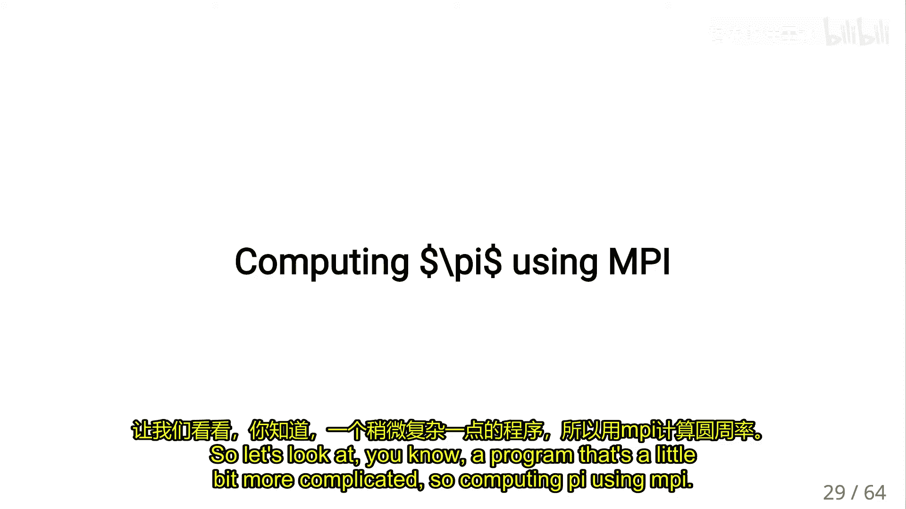

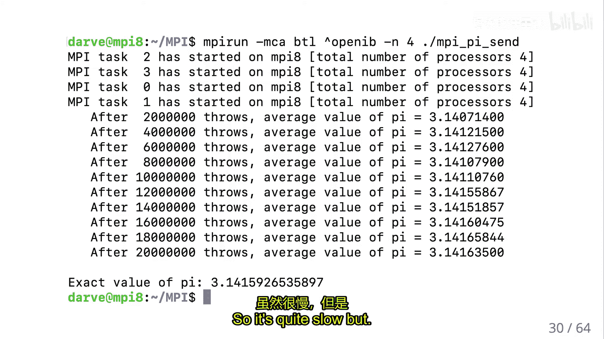

这涉及到显式的**点对点通信**。非主进程需要将结果发送给主进程，主进程需要接收所有来自其他进程的结果。

以下是 MPI 发送和接收函数的基本形式：

**MPI_Send 函数原型**：
```c
int MPI_Send(const void *buf, int count, MPI_Datatype datatype, int dest, int tag, MPI_Comm comm)
```
*   `buf`: 发送缓冲区的起始地址。
*   `count`: 发送的元素个数。
*   `datatype`: 发送数据的数据类型（如 `MPI_INT`, `MPI_DOUBLE`）。
*   `dest`: 目标进程的秩。
*   `tag`: 消息标签，用于区分不同类型或轮次的消息。
*   `comm`: 通信域。

**MPI_Recv 函数原型**：
```c
int MPI_Recv(void *buf, int count, MPI_Datatype datatype, int source, int tag, MPI_Comm comm, MPI_Status *status)
```
*   `buf`: 接收缓冲区的起始地址。
*   `count`: 缓冲区最多能容纳的元素个数。
*   `datatype`: 接收数据的数据类型。
*   `source`: 发送进程的秩，或使用 `MPI_ANY_SOURCE` 接受来自任何进程的消息。
*   `tag`: 期望的消息标签，或使用 `MPI_ANY_TAG`。
*   `comm`: 通信域。
*   `status`: 返回状态信息，当使用通配符（`ANY_SOURCE`/`ANY_TAG`）时，可从中查询实际的消息来源和标签。

**关键点**：
*   **数据类型**： 必须指定。这是因为不同架构的字节序、浮点数格式等可能不同，MPI 库需要在必要时进行转换以保证数据的正确性。
*   **匹配性**： 每个发送操作必须有一个匹配的接收操作，且数据类型、标签和通信域必须一致，否则程序可能死锁。
*   **顺序性**： MPI 保证，从同一个进程发送到同一个进程的消息，其接收顺序与发送顺序一致。
*   **标签（Tag）的使用**： 在迭代计算中非常有用。例如，主进程在每一轮迭代中等待带有特定标签（如迭代次数）的消息，可以防止不同轮次的数据被混淆。

## 集体通信

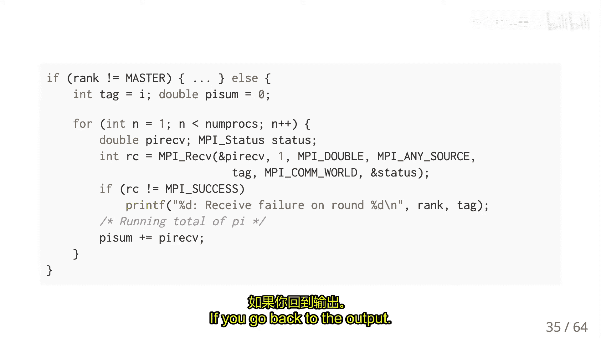

上一节我们介绍了基本的点对点通信。然而，许多并行算法需要所有进程或一组进程协同完成某个操作，如果只用点对点通信来实现，不仅代码复杂，而且效率低下，因为无法充分利用网络的整体带宽。

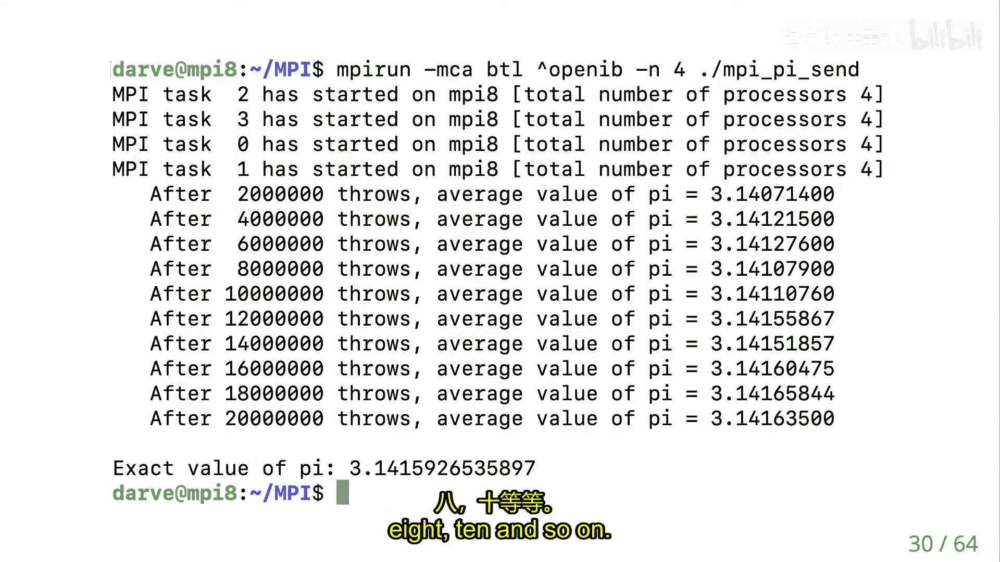

MPI 提供了一系列**集体通信（Collective Communication）** 操作来高效地完成这些常见模式。它们通常涉及通信域内的所有进程。

以下是几种核心的集体通信操作：

**广播（Broadcast）**
一个进程（根进程）将相同的数据发送给通信域内的所有其他进程。
```c
int MPI_Bcast(void *buffer, int count, MPI_Datatype datatype, int root, MPI_Comm comm)
```

**归约（Reduce）**
所有进程都提供一个数据，通过一个操作（如求和、求最大值）将这些数据合并为单个结果，存放在根进程中。
```c
int MPI_Reduce(const void *sendbuf, void *recvbuf, int count, MPI_Datatype datatype, MPI_Op op, int root, MPI_Comm comm)
```
操作 `op` 可以是预定义的，如 `MPI_SUM`, `MPI_MAX`, `MPI_MIN`, `MPI_PROD`。

**带位置的归约（如 Maxloc/Minloc）**
在归约值的同时，附带一个位置信息（如索引或进程秩）。例如，`MPI_MAXLOC` 在找到最大值的同时，记录该最大值来自哪个进程。
```c
// 使用 MPI_2INT 等复合数据类型
int MPI_Reduce(const void *sendbuf, void *recvbuf, int count, MPI_Datatype datatype, MPI_Op op, int root, MPI_Comm comm)
```

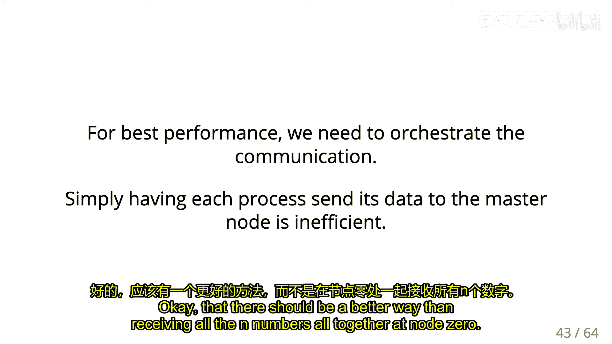

**全归约（Allreduce）**
归约操作完成后，结果被复制到所有进程，而不仅仅是根进程。这在需要所有进程都得到全局结果的场景中非常有用，例如在分布式梯度下降中，所有进程都需要全局梯度来更新模型参数。
```c
int MPI_Allreduce(const void *sendbuf, void *recvbuf, int count, MPI_Datatype datatype, MPI_Op op, MPI_Comm comm)
```

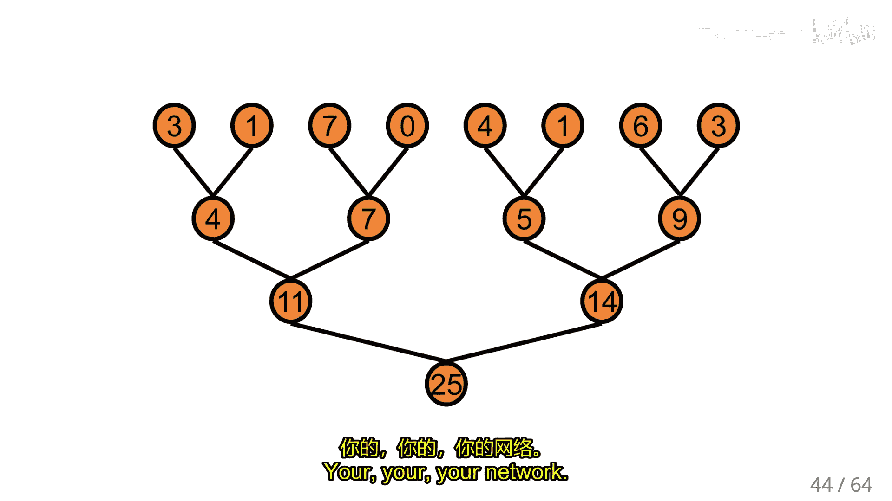

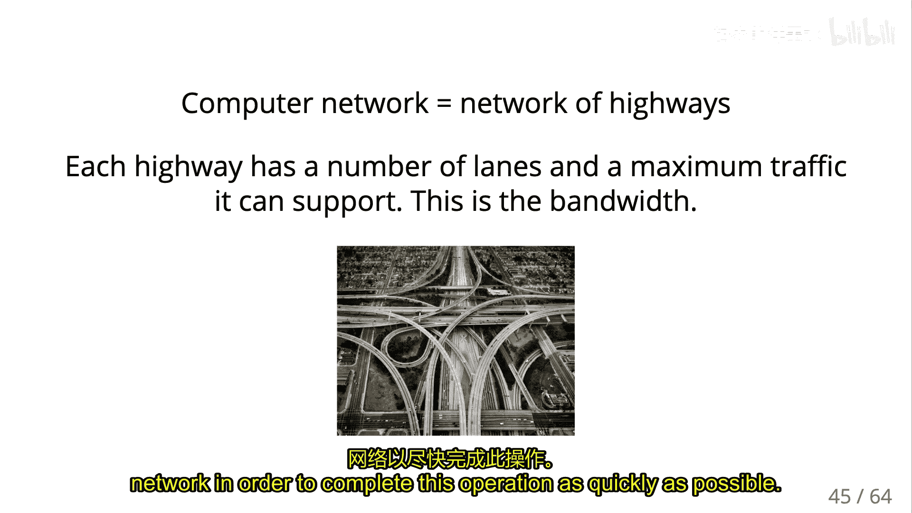

**收集（Gather）**
所有进程将数据发送到根进程，根进程将这些数据按进程秩顺序拼接成一个数组。
```c
int MPI_Gather(const void *sendbuf, int sendcount, MPI_Datatype sendtype, void *recvbuf, int recvcount, MPI_Datatype recvtype, int root, MPI_Comm comm)
```

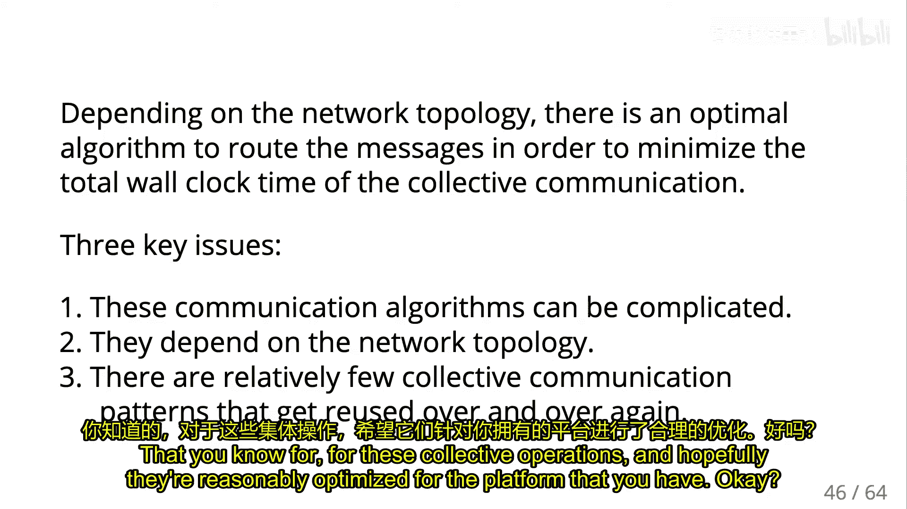

**散播（Scatter）**
根进程将一个数组的不同部分发送给各个进程。这是 Gather 的逆操作。
```c
int MPI_Scatter(const void *sendbuf, int sendcount, MPI_Datatype sendtype, void *recvbuf, int recvcount, MPI_Datatype recvtype, int root, MPI_Comm comm)
```

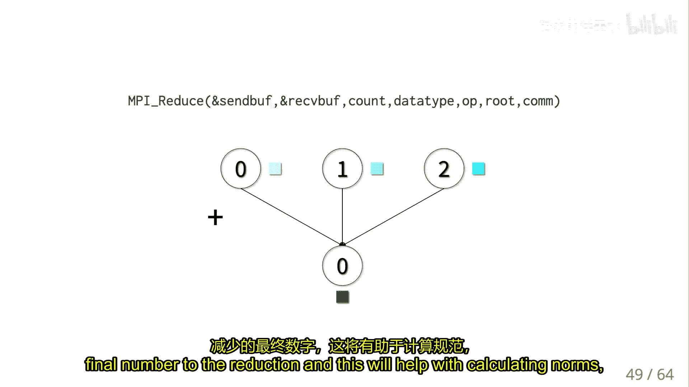

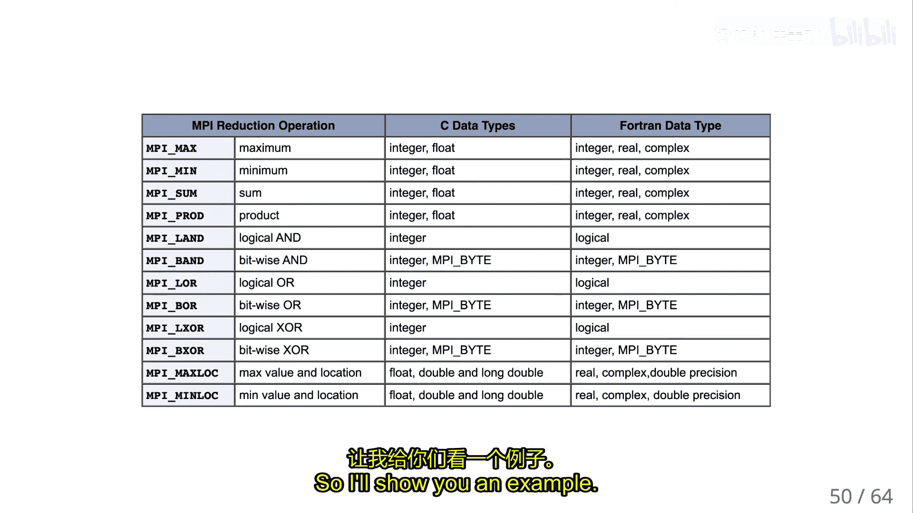

**全收集（Allgather）**
相当于每个进程都执行一次 Gather 操作，最终所有进程都拥有完整的数据集合。
```c
int MPI_Allgather(const void *sendbuf, int sendcount, MPI_Datatype sendtype, void *recvbuf, int recvcount, MPI_Datatype recvtype, MPI_Comm comm)
```

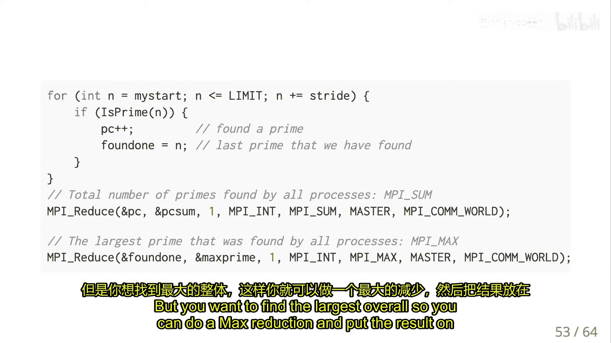

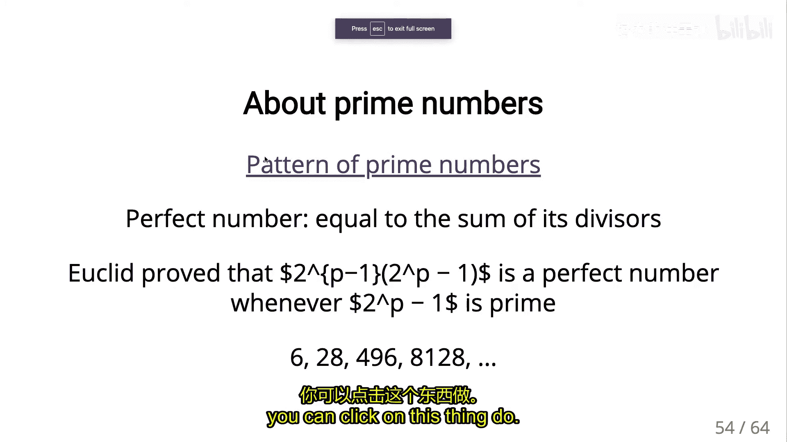

**全到全（Alltoall）**
每个进程向所有其他进程发送不同的数据，同时也从所有其他进程接收数据。可以看作是一个矩阵转置操作：开始时，每个进程拥有矩阵的一行；操作后，每个进程拥有矩阵的一列。
```c
int MPI_Alltoall(const void *sendbuf, int sendcount, MPI_Datatype sendtype, void *recvbuf, int recvcount, MPI_Datatype recvtype, MPI_Comm comm)
```

## 总结

本节课我们一起学习了 MPI 消息传递接口的基础知识。我们从共享内存的局限性出发，引出了分布式内存模型和消息传递的必要性。我们了解了 MPI 的 SPMD 编程模型、进程的秩（Rank）和通信域（Communicator）概念。

我们详细探讨了点对点通信，包括 `MPI_Send` 和 `MPI_Recv` 的用法、匹配规则以及消息标签的作用。接着，我们介绍了更高效、更简洁的集体通信操作，如广播、归约、全归约、散播和收集等，这些操作是构建高效并行应用的核心工具，也将在最终的深度神经网络项目中发挥关键作用。

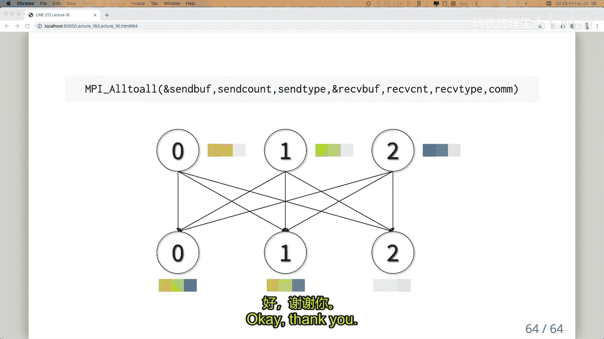

MPI 是一个强大而复杂的库，本节课只是一个入门。要熟练使用 MPI，还需要在实践中深入理解其同步、非阻塞通信、通信域管理等更多高级特性。