# 014：等效率分析

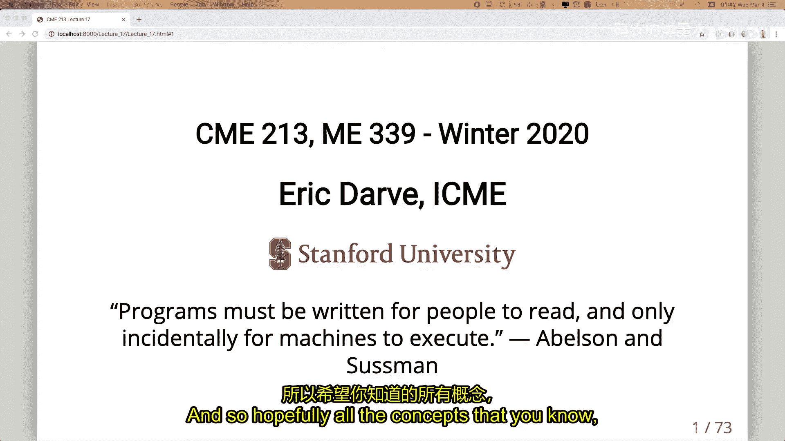

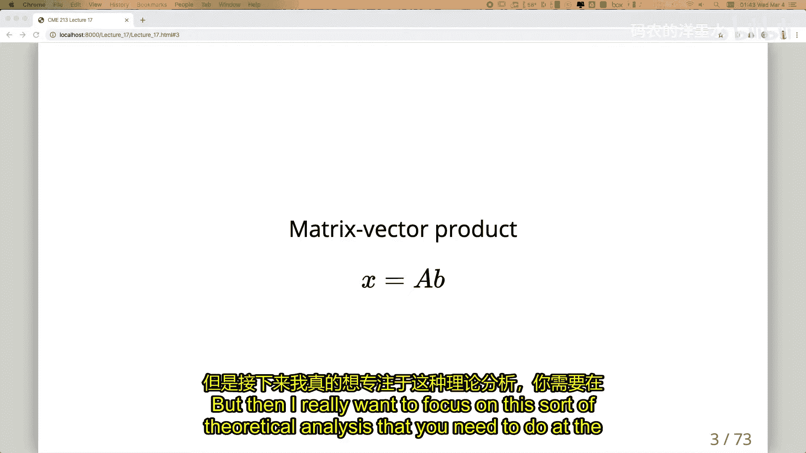

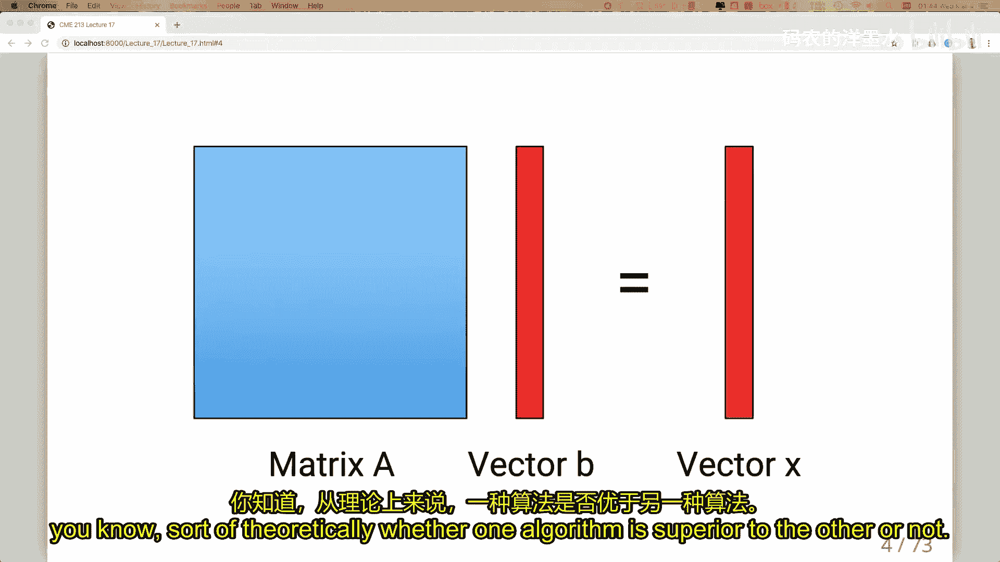

在本节课中，我们将学习如何分析并行算法的性能，特别是通过“等效率”这一概念来比较不同数据划分方案（如行划分、列划分和二维块划分）在矩阵向量乘法中的效率。我们将从简单的算法实现开始，逐步深入到理论建模，以理解如何量化并行算法的可扩展性。

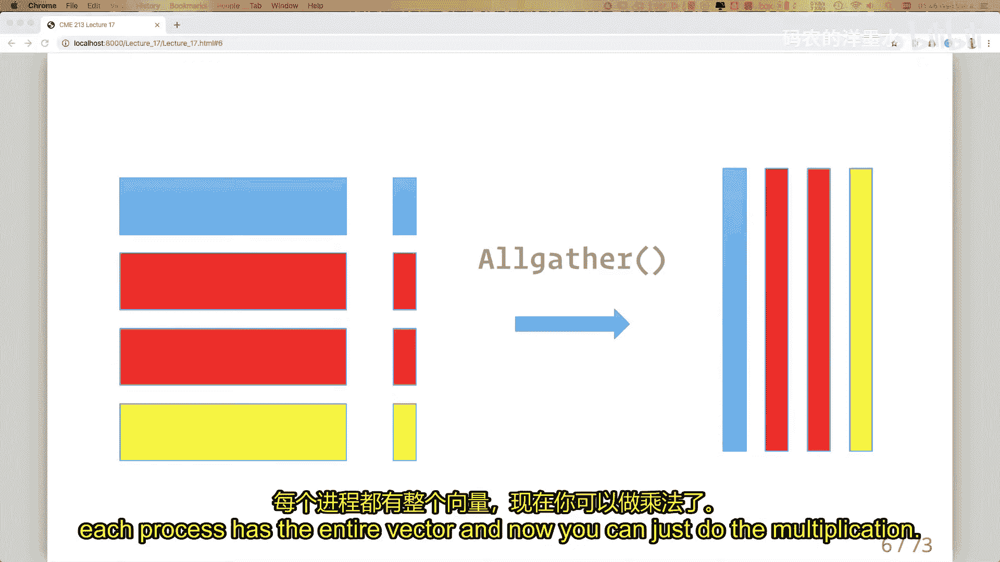

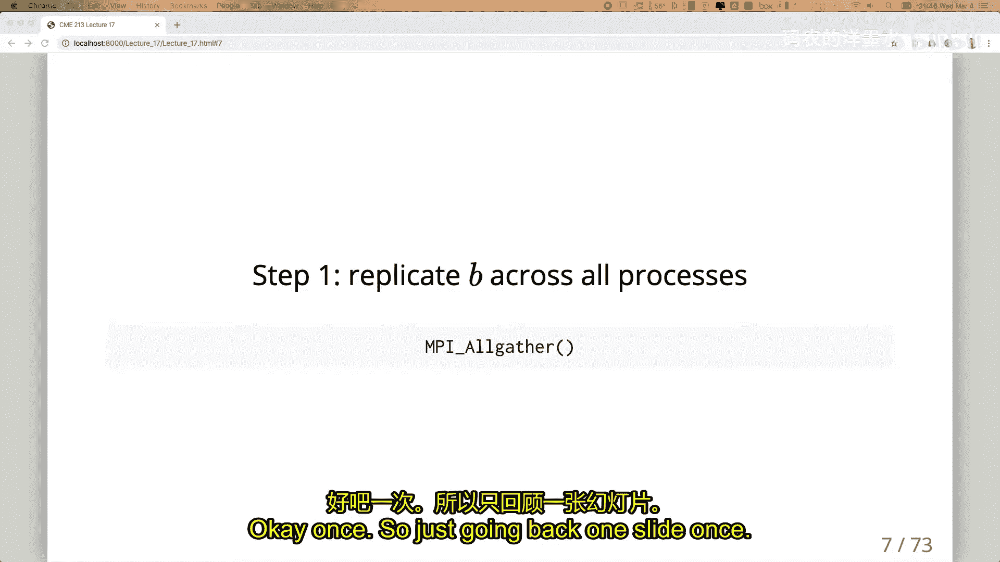

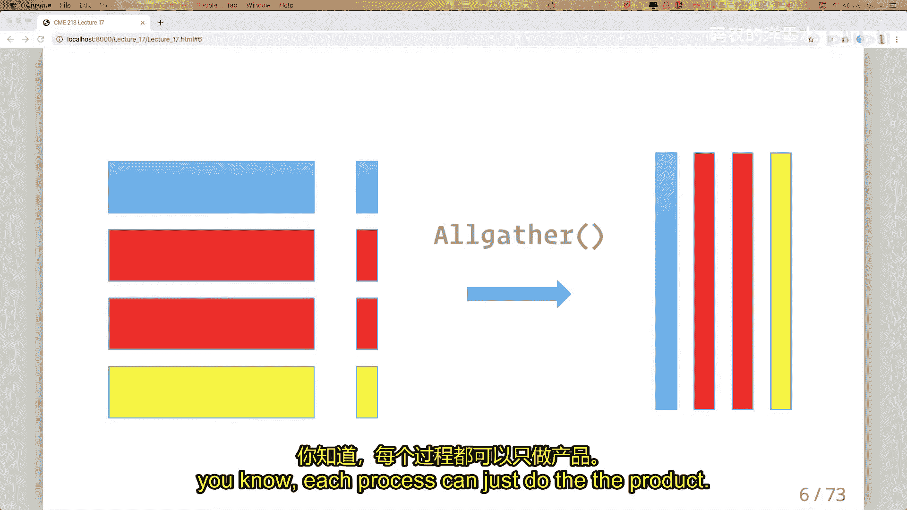

## 矩阵向量乘法的并行方案

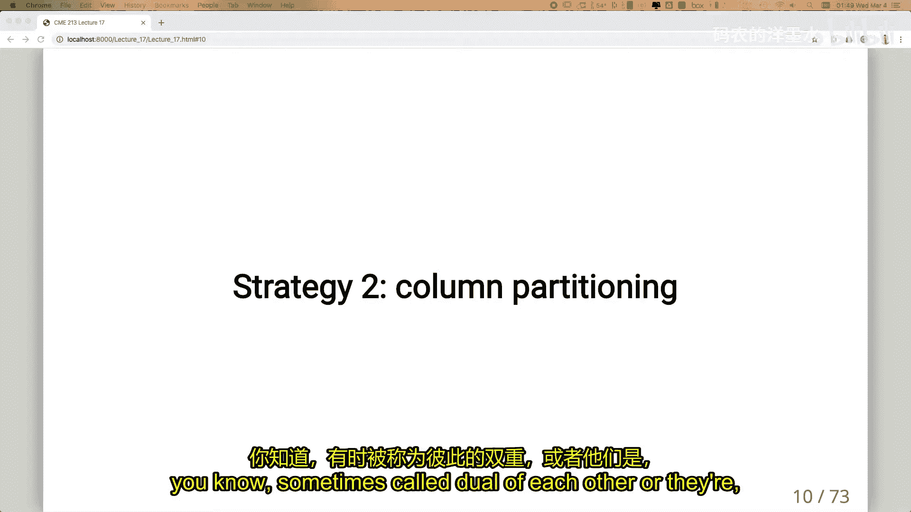

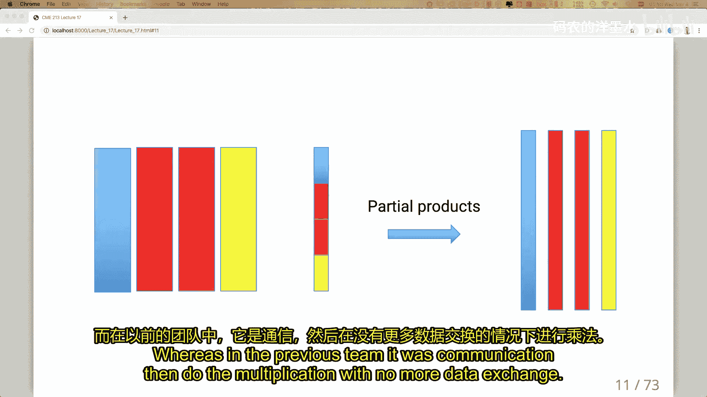

上一节我们介绍了并行计算的基本概念。本节中，我们来看看如何将矩阵向量乘法 `x = A * b` 并行化。核心问题是如何在多个进程间分布矩阵 `A` 和向量 `b`。我们将探讨三种主要的数据划分方案。

### 方案一：行划分 (Row Partitioning)

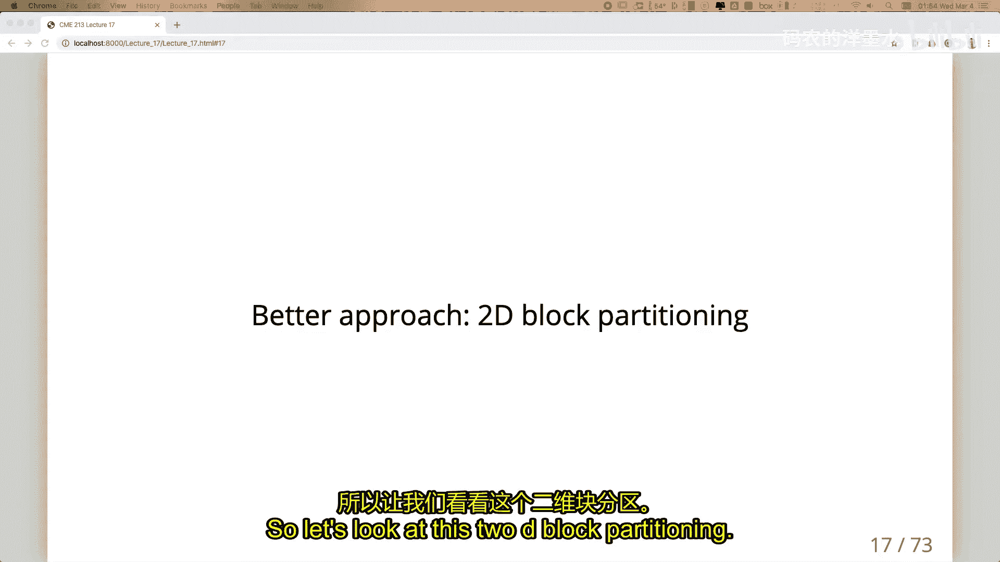

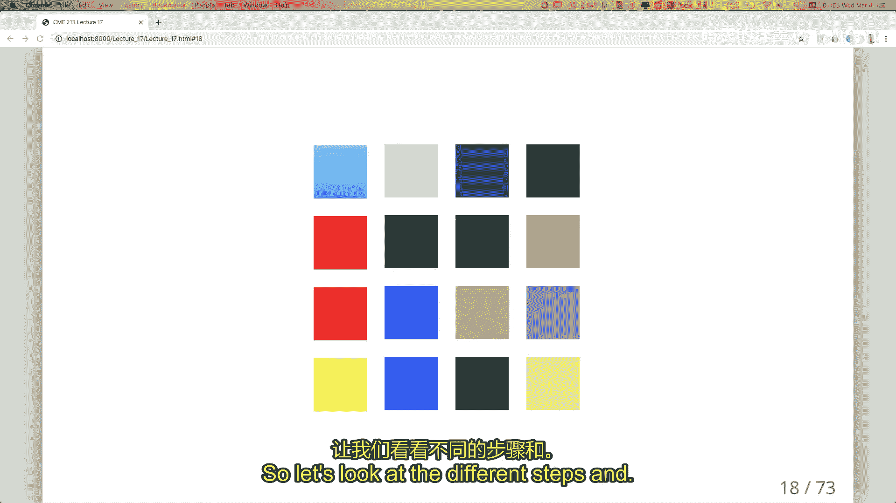

在行划分方案中，矩阵 `A` 被按行分割，每个进程获得一组连续的行。向量 `b` 最初也被相应分割。

**算法步骤：**
1.  **通信阶段**：每个进程最初只拥有向量 `b` 的一部分。为了计算，每个进程都需要完整的向量 `b`。这通过一个 `MPI_Allgather` 集体通信操作实现，完成后每个进程都拥有 `b` 的完整副本。
    *代码示例：`MPI_Allgather(&local_b, local_size, MPI_FLOAT, &full_b, local_size, MPI_FLOAT, MPI_COMM_WORLD);`
2.  **计算阶段**：每个进程使用自己拥有的 `A` 的行块和完整的 `b` 向量，独立计算部分结果 `x_local`。此阶段无需进一步通信。
    *公式：`x_local[i] = sum(A_local[i][j] * full_b[j] for j in range(n))`
3.  **结果**：每个进程计算出的 `x_local` 直接就是最终结果向量 `x` 中对应部分，无需汇总。

### 方案二：列划分 (Column Partitioning)

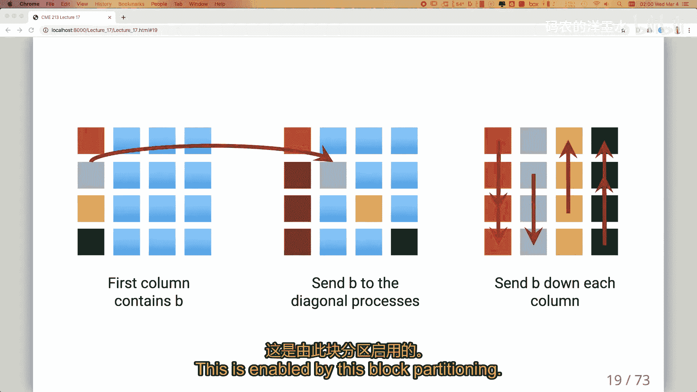

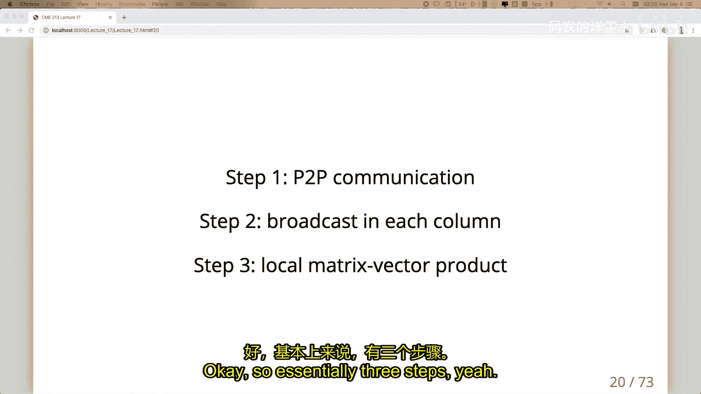

列划分与行划分对偶。矩阵 `A` 被按列分割，每个进程获得一组连续的列。向量 `b` 也按相同方式分割。

**算法步骤：**
1.  **计算阶段**：每个进程使用自己拥有的 `A` 的列块和对应的 `b` 片段，独立计算一个部分和。此阶段无需通信。
    *公式：`partial_x[i] += A_local[i][j] * local_b[j] for j in local columns`
2.  **通信阶段**：每个进程得到的是对最终结果 `x` 的部分贡献。需要将所有进程的部分结果相加。这通过一个 `MPI_Reduce` 操作（例如求和）实现，结果可能集中在某个根进程。
    *代码示例：`MPI_Reduce(&partial_x, &global_x, n, MPI_FLOAT, MPI_SUM, root, MPI_COMM_WORLD);`
3.  **结果分发（可选）**：如果需要让所有进程都拥有结果向量 `x`，可以从根进程执行一个 `MPI_Scatter` 操作。

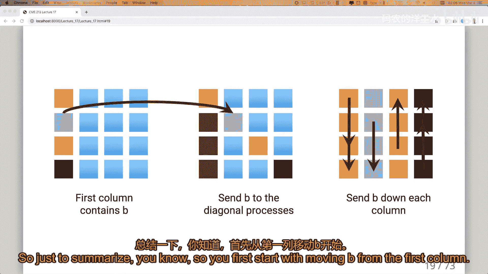

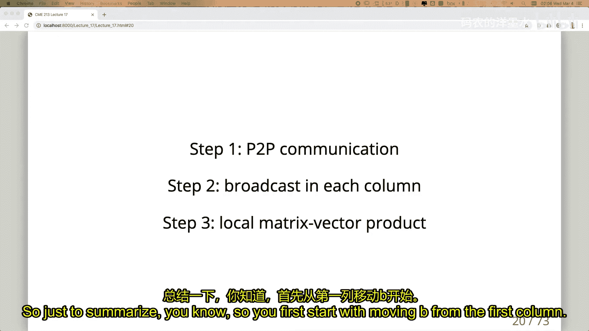

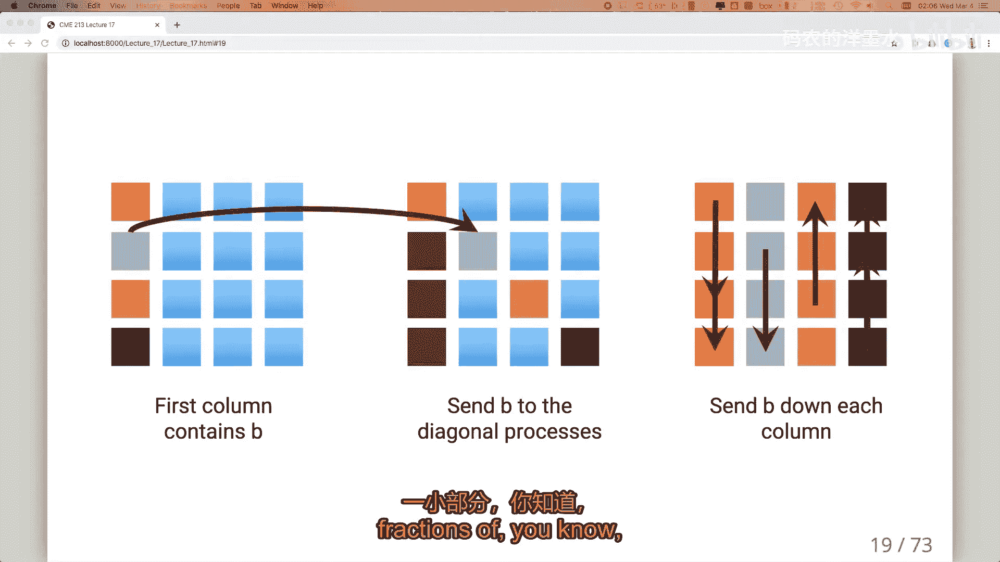

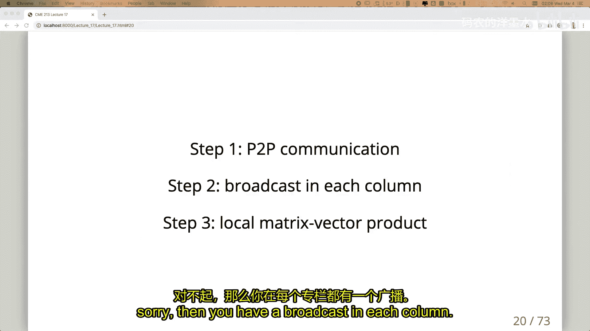

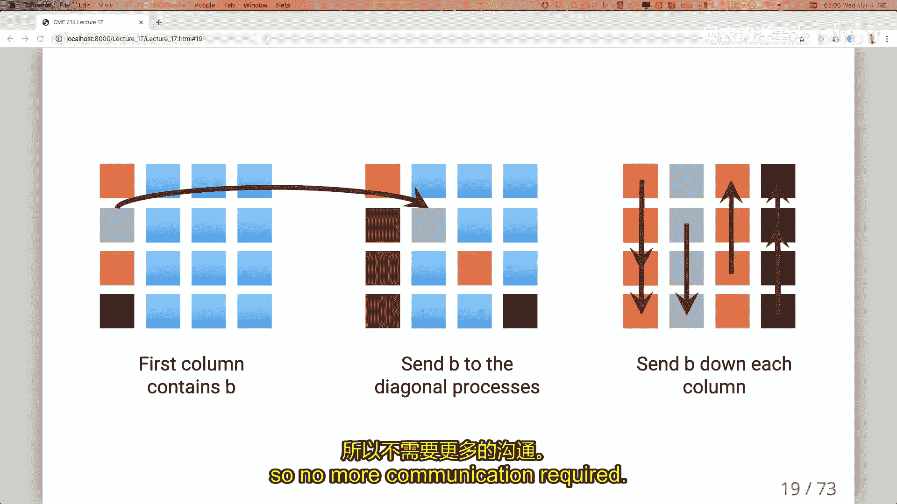

### 方案三：二维块划分 (2D Block Partitioning)

行和列划分在进程数增多时效率会下降。二维块划分将矩阵 `A` 划分为一个网格状的块，每个进程负责一个块。这通常能实现更好的可扩展性。

假设进程排列成 `sqrt(P) x sqrt(P)` 的网格。向量 `b` 最初分布在第一列进程（`j=0`）中。

**算法步骤：**
1.  **列内广播**：首先，每个第一列的进程将其拥有的 `b` 片段广播给同列的其他进程。这通过 `MPI_Bcast` 在列通信子内完成。
    *代码示例：`MPI_Bcast(&local_b_segment, segment_size, MPI_FLOAT, 0, col_comm);`
2.  **计算阶段**：现在，每个进程都拥有了计算其负责的 `A` 块与对应的 `b` 片段乘积所需的全部数据，可以独立计算部分结果。
    *公式：`block_partial_x = A_block * b_segment`
3.  **行内规约**：每个进程计算出的部分结果是针对最终 `x` 向量的部分贡献。需要将同一行内所有进程的结果相加。这通过 `MPI_Reduce` 在行通信子内完成。
    *代码示例：`MPI_Reduce(&block_partial_x, &row_result, n/sqrt(P), MPI_FLOAT, MPI_SUM, 0, row_comm);`

## 并行性能建模与等效率分析

仅仅感觉二维块划分“更快”是不够的。我们需要一个理论框架来量化比较不同算法的可扩展性。这引入了并行运行时间模型和等效率概念。

### 基本概念定义

*   **并行运行时间 T(p, n)**：使用 `p` 个进程解决规模为 `n` 的问题所需的时间。它包含计算时间和通信时间。
*   **加速比 (Speedup) S(p, n)**：串行运行时间 `T(1, n)` 与并行运行时间 `T(p, n)` 的比值。`S(p, n) = T(1, n) / T(p, n)`。理想情况下，加速比应等于进程数 `p`（线性加速）。
*   **效率 (Efficiency) E(p, n)**：加速比与进程数的比值，衡量处理器的利用率。`E(p, n) = S(p, n) / p = T(1, n) / (p * T(p, n))`。理想效率为 1（或 100%）。

### 通信时间模型

我们使用一个简单的模型来估算通信时间：`T_comm = t_s + t_w * L`。
*   `t_s`：启动时间或延迟，与消息大小无关。
*   `t_w`：传输每个字节所需时间的倒数（与带宽相关）。
*   `L`：消息长度（字节数）。

对于集体通信（如广播、规约），其时间可以根据网络拓扑（如超立方体）建模。例如，在 `p` 个进程上的广播时间可近似为 `T_bcast ≈ (t_s + t_w * L) * log(p)`。

### 等效率 (Isoefficiency) 概念

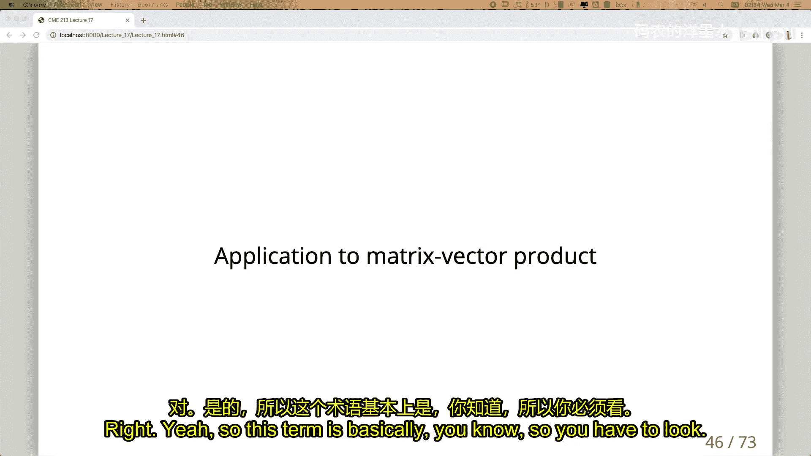

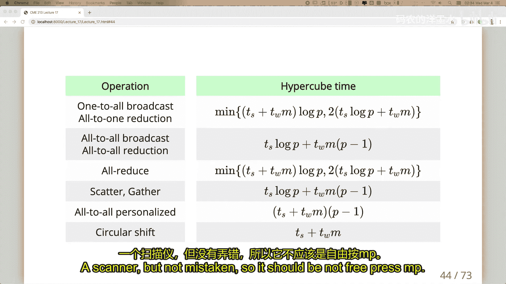

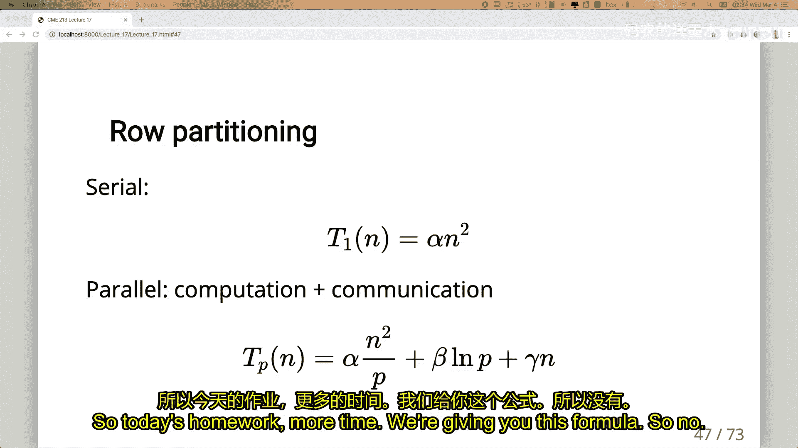

随着进程数 `p` 增加，效率 `E` 通常会下降。为了维持恒定的效率（例如 50%），当增加 `p` 时，必须同时增加问题规模 `n`。**等效率函数** `p = f(n)` 描述了为保持效率恒定，问题规模 `n` 需要如何随进程数 `p` 增长。

**等效率分析步骤：**
1.  为特定算法和划分方案写出效率 `E(p, n)` 的表达式。
2.  令 `E(p, n)` 等于一个常数。
3.  分析表达式中各项，找出使 `p` 和 `n` 保持恒定关系的条件。通常需要令主导项（随 `p` 增大而增长最快的项）为常数，并检查其他项是否趋于零或常数。

### 应用于矩阵向量乘法

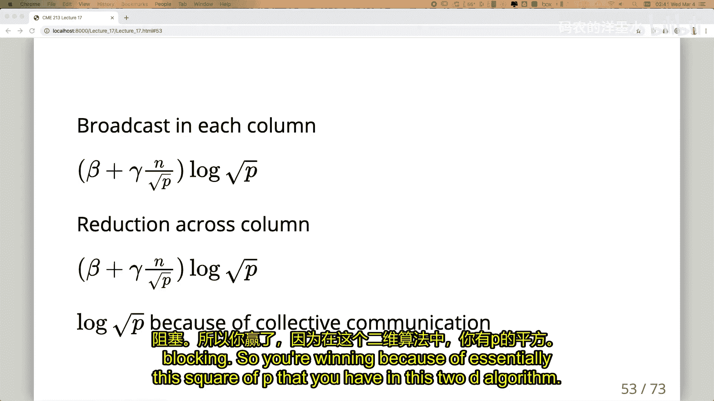

以下是两种划分方案的等效率分析结果（假设计算复杂度为 O(n²)）：

*   **行/列划分**：等效率函数要求 `p` 与 `n` 成正比，即 `p = O(n)`。这意味着要维持效率，问题规模只需线性增长。
*   **二维块划分**：等效率函数要求 `p` 与 `n² / log²(n)` 成正比，即 `p = O(n² / log²(n))`。这意味着问题规模可以接近平方级增长，从而允许使用更多的进程而保持高效率。

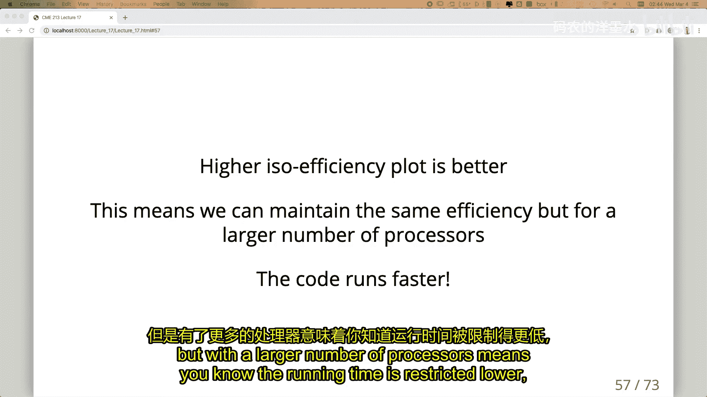

**结论**：二维块划分的等效率曲线更高。这意味着在相同的问题规模 `n` 下，二维块划分能支持更多的进程 `p` 同时保持较高的效率，因此它具有更好的可扩展性，是更优的并行方案。

## 总结

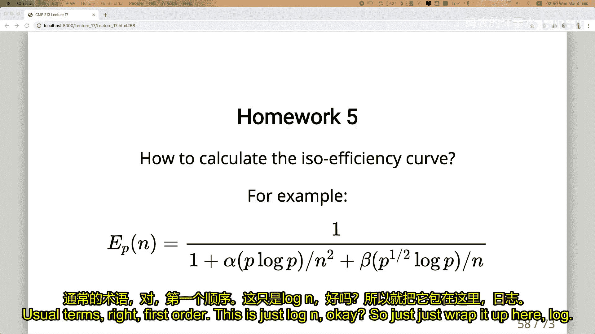

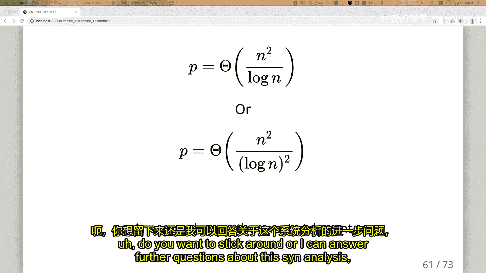

本节课中我们一起学习了矩阵向量乘法的不同并行划分策略，并引入了等效率分析这一强大的理论工具。我们了解到：
1.  行划分和列划分简单直观，但可扩展性有限。
2.  二维块划分通过将计算和通信限制在进程网格的行和列内，减少了通信开销和竞争，从而获得了更优的可扩展性。
3.  通过建立并行运行时间模型并推导等效率函数，我们可以定量地比较不同算法的可扩展性。更高的等效率曲线意味着算法能更有效地利用大量处理器。
4.  等效率分析是设计和评估并行算法的重要步骤，它帮助我们理解如何平衡问题规模与处理器数量以达到最佳性能。