# 1：Transformer 架构入门 🚀

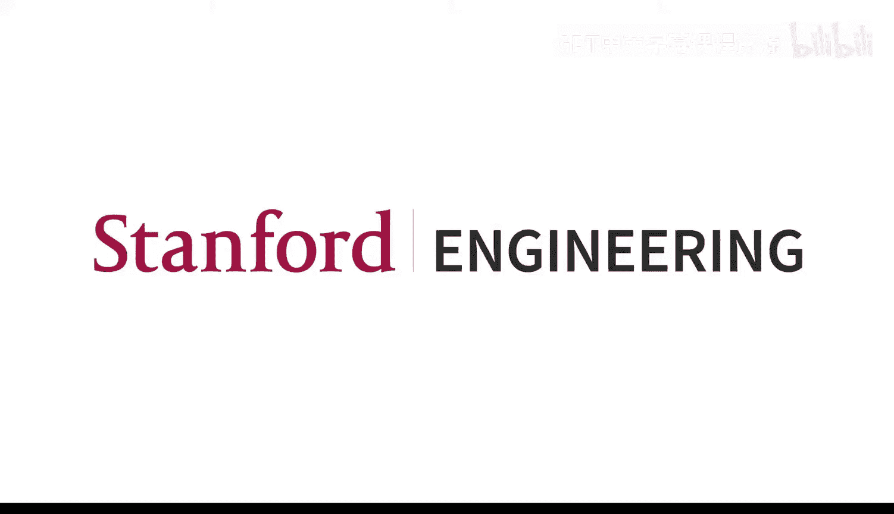

在本节课中，我们将要学习自然语言处理的基础知识，并深入理解 Transformer 架构的核心原理。我们将从文本表示开始，逐步探讨如何让模型理解并生成语言。

## 概述：从文本到模型理解

自然语言处理旨在让机器能够理解和处理人类语言。为了实现这一目标，我们需要将文本转换为模型能够处理的数值形式，并设计能够捕捉语言复杂性的模型架构。

## 文本的表示与处理

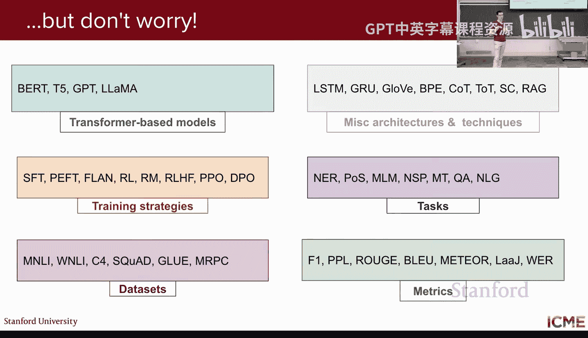

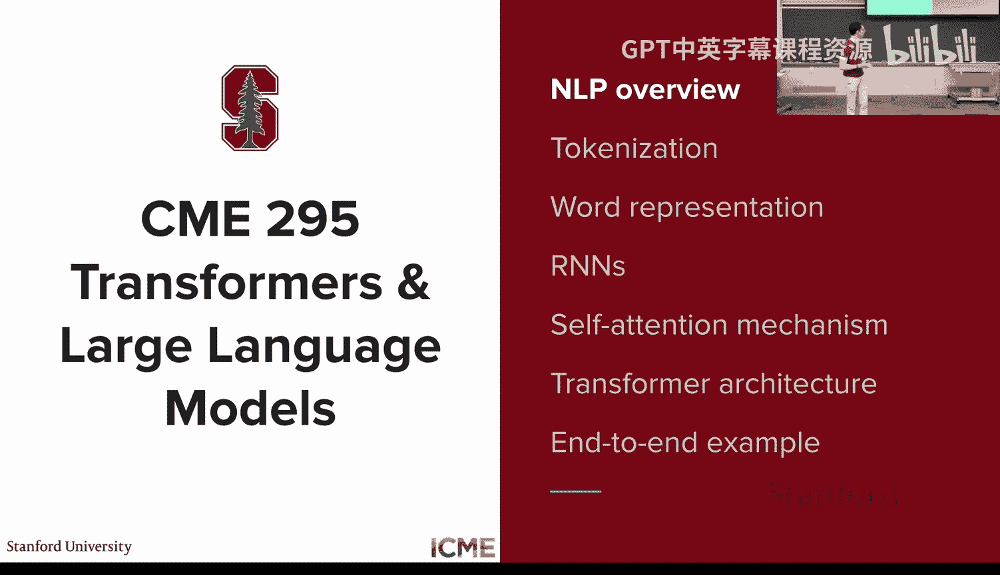

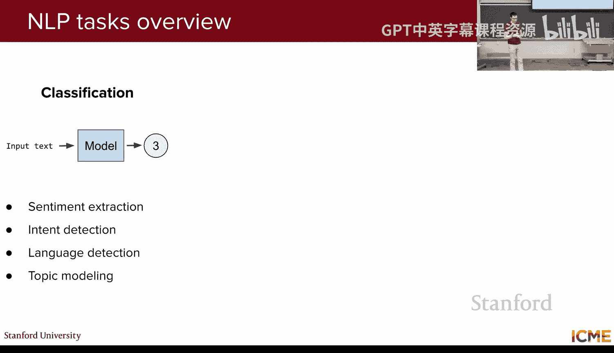

上一节我们介绍了 NLP 的基本概念，本节中我们来看看如何将文本转化为模型可以处理的格式。

### 分词：将文本切分为基本单元

模型无法直接理解文本，因此第一步是将文本切分为更小的单元，这个过程称为分词。分词有多种策略，各有优劣。

以下是常见的分词方法：
*   **词级分词**：将文本按单词切分。优点是简单直观，但无法处理未登录词，且会忽略词根信息。
*   **子词分词**：将单词进一步切分为更常见的子单元（如前缀、后缀、词根）。优点是能有效处理未登录词并利用词根信息，但会导致序列变长。
*   **字符级分词**：将文本按单个字符切分。优点是能处理拼写错误，但序列长度会急剧增加，且单个字符的语义信息有限。

### 词嵌入：为词语赋予含义

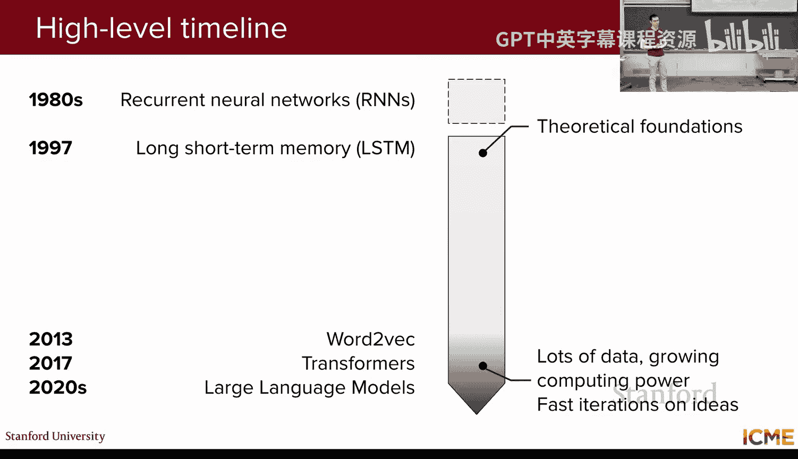

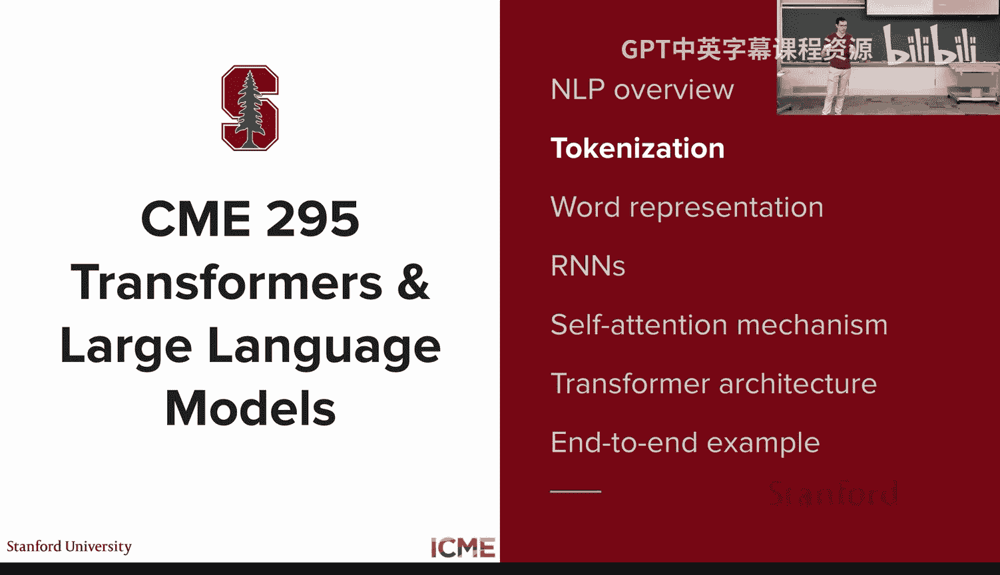

分词后，我们需要将每个词元（token）转换为一个数值向量，即词嵌入。简单的独热编码无法表达词语之间的语义关系。

**独热编码示例**：
假设词汇表为 `[“book”, “soft”, “teddy bear”]`，则：
*   `“soft”` 的向量为 `[1, 0, 0]`
*   `“teddy bear”` 的向量为 `[0, 1, 0]`
*   `“book”` 的向量为 `[0, 0, 1]`

这些向量彼此正交，无法反映“teddy bear”和“soft”之间的语义相似性。因此，我们需要从数据中学习有意义的嵌入。

### 学习词嵌入：Word2Vec

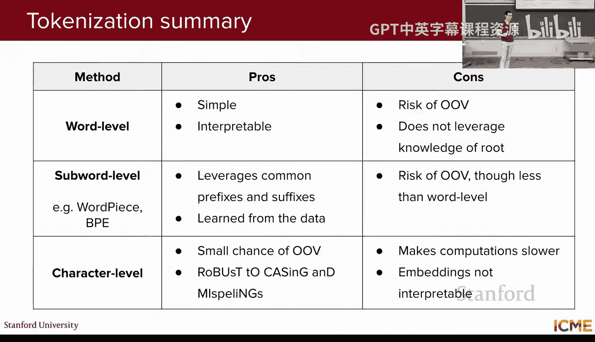

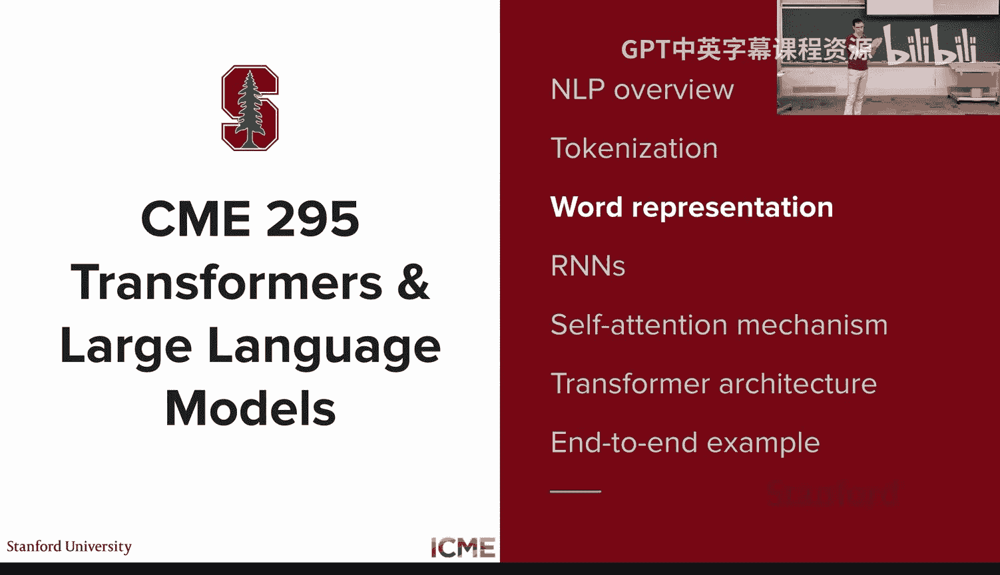

Word2Vec 通过一个代理任务来学习词嵌入，其核心思想是：具有相似上下文的词语，其含义也相似。

它有两种主要训练方式：
1.  **连续词袋模型**：根据上下文词语预测中心词。
2.  **Skip-gram 模型**：根据中心词预测其上下文词语。

通过训练一个简单的神经网络来完成这个预测任务，网络中间层的权重矩阵就成为了我们所需的词嵌入查找表。

## 序列建模与注意力机制

仅仅学习静态的词嵌入还不够，我们需要模型能够理解词语在序列中的顺序和依赖关系。

### 循环神经网络的局限

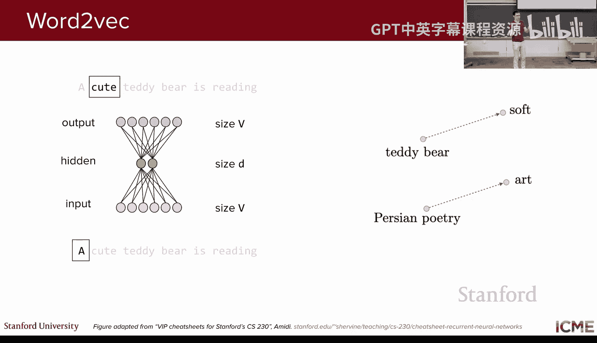

循环神经网络通过维护一个隐藏状态来依次处理序列中的词元，从而捕捉顺序信息。然而，RNN 存在**长程依赖问题**。在反向传播时，梯度需要跨越多个时间步进行传递，容易导致梯度消失或爆炸，使得模型难以记住远距离的信息。

### 注意力机制的引入

为了解决 RNN 的局限，注意力机制被提出。其核心思想是：在生成当前输出时，让模型能够直接“关注”输入序列中的任何部分，而不仅仅是最后的状态。

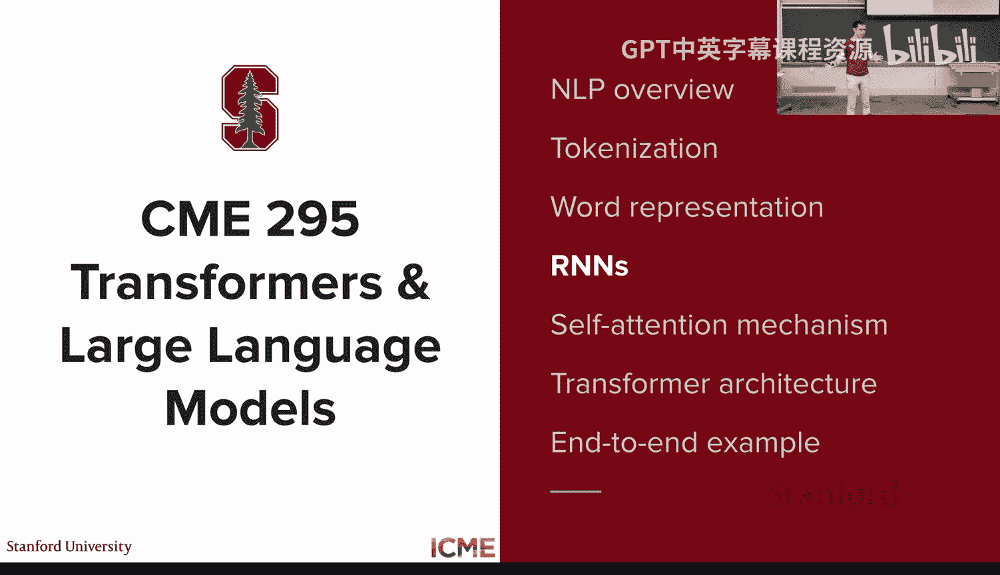

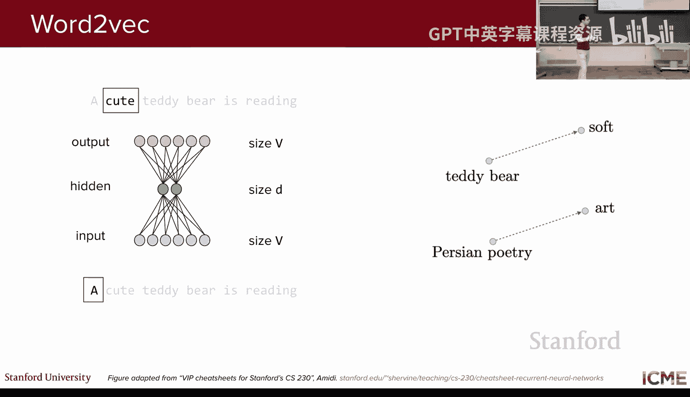

在机器翻译中，当解码器生成目标语言的一个词时，它会计算一个注意力分布，该分布决定了它应该“看”源语言句子中的哪些词。这通过查询、键和值来实现：
*   **查询**：当前解码器状态（“我想知道什么？”）。
*   **键**：编码器对所有输入词元的表示（“每个输入词元能提供什么信息？”）。
*   **值**：编码器对所有输入词元的另一种表示（“每个输入词元的实际内容是什么？”）。

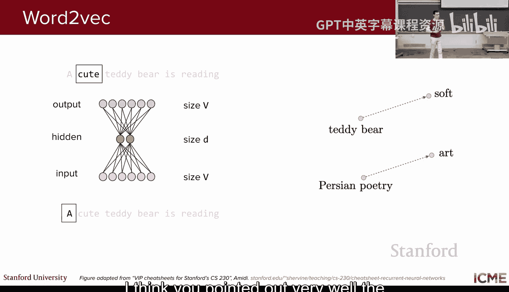

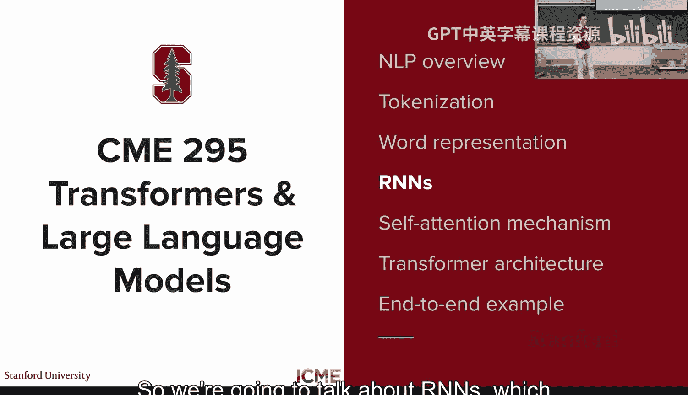

模型计算查询与所有键的相似度，得到一个权重分布，然后用这个权重对值进行加权求和，得到最终的上下文向量。

**注意力权重计算公式**：
`注意力权重 = softmax( (Q * K^T) / sqrt(d_k) )`
`输出 = 注意力权重 * V`

其中，`d_k` 是键向量的维度，除以 `sqrt(d_k)` 是为了防止点积结果过大导致 softmax 梯度太小。

## Transformer 架构详解

上一节我们介绍了注意力机制如何解决长程依赖问题，本节中我们来看看完全基于注意力构建的 Transformer 模型。

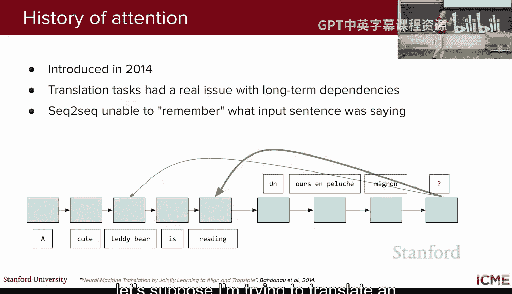

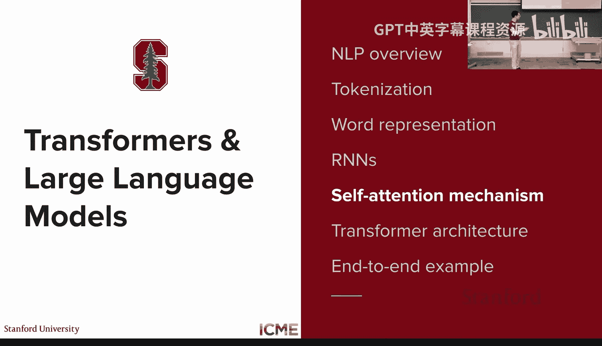

### 整体架构

Transformer 完全摒弃了 RNN 的循环结构，仅依赖注意力机制。它由编码器和解码器堆叠而成。

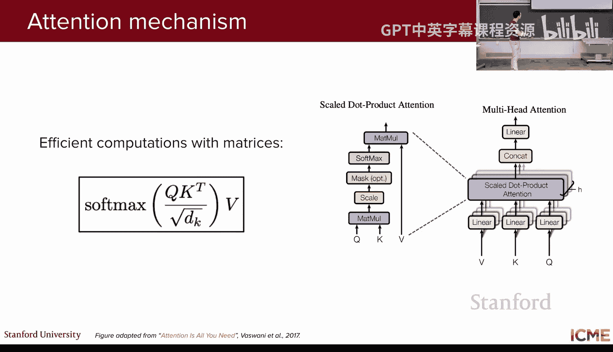

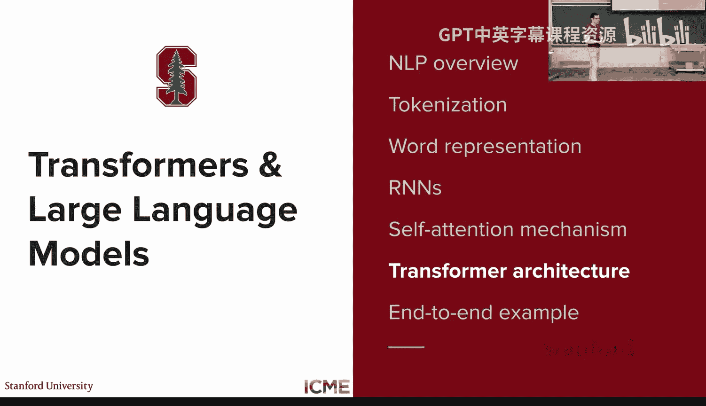

**编码器**：处理输入序列（如源语言句子）。它由多个相同的层组成，每层包含一个**多头自注意力机制**和一个**前馈神经网络**。自注意力让输入序列中的每个词元都能直接关注序列中的所有其他词元，从而生成富含上下文信息的表示。

**解码器**：生成输出序列（如目标语言句子）。它也由多个相同的层组成，每层包含三个子层：
1.  **掩码多头自注意力机制**：确保在预测当前位置时，只能看到已生成的输出（防止信息泄露）。
2.  **多头交叉注意力机制**：让解码器关注编码器的最终输出。
3.  **前馈神经网络**。

### 位置编码

由于 Transformer 没有循环结构，它本身无法感知词元的位置信息。因此，需要向输入嵌入中添加**位置编码**。原始论文使用不同频率的正弦和余弦函数来生成位置编码向量，然后将其与词嵌入相加。

### 多头注意力

这是 Transformer 的一个关键创新。与其只计算一次注意力，模型并行地学习多组不同的查询、键、值投影矩阵（即多个“头”）。每个头可以关注输入的不同方面（例如语法、语义、指代关系）。最后，所有头的输出被拼接起来，并通过一个线性层投影回原始维度。

**多头注意力优势**：
*   扩展了模型关注不同位置的能力。
*   为注意力层提供了多个“表示子空间”。

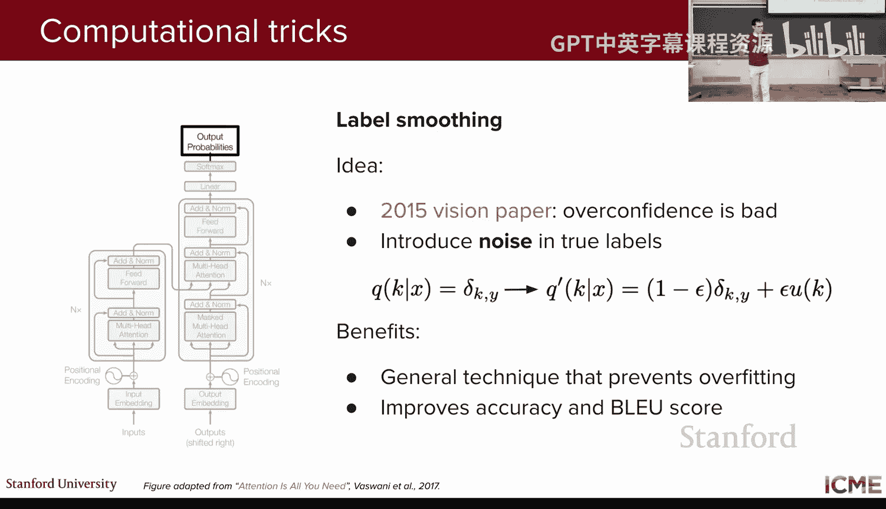

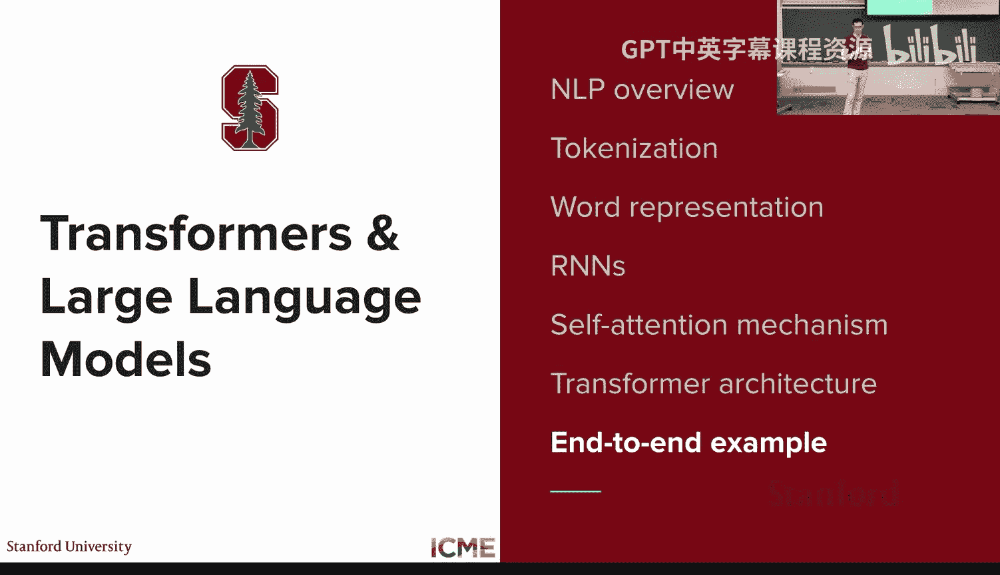

### 前馈神经网络

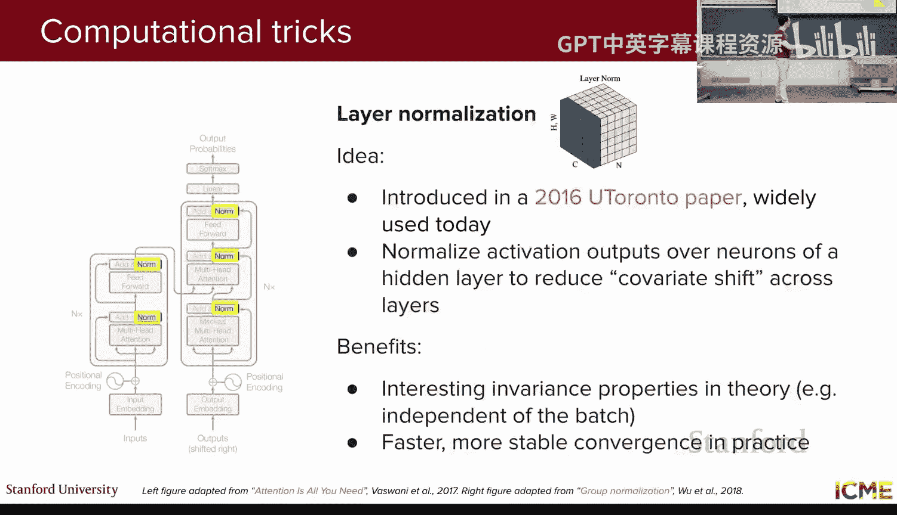

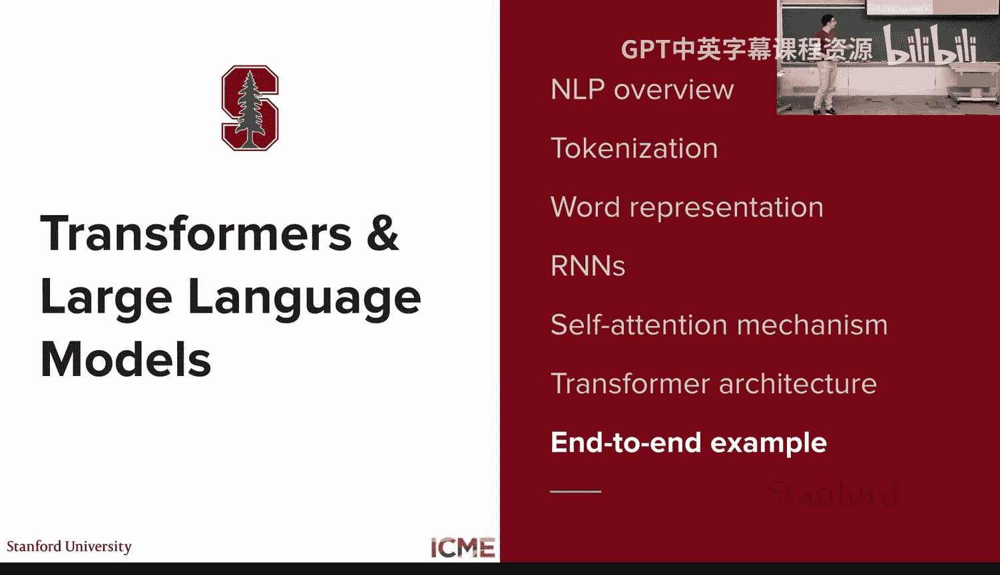

编码器和解码器中的每个注意力层后面都跟着一个相同的前馈神经网络。它是一个简单的两层全连接网络，中间有一个 ReLU 激活函数。它为模型提供了额外的非线性变换能力。

**前馈网络公式**：
`FFN(x) = max(0, xW1 + b1)W2 + b2`

### 训练技巧：标签平滑

在训练时，通常使用交叉熵损失，目标是一个“硬”的独热标签。**标签平滑**将硬标签“软化”，例如将 `[0, 0, 1, 0]` 变为 `[0.1, 0.1, 0.7, 0.1]`。这可以防止模型对其预测过于自信，起到正则化作用，通常能提升模型的泛化能力和最终性能。

## 总结

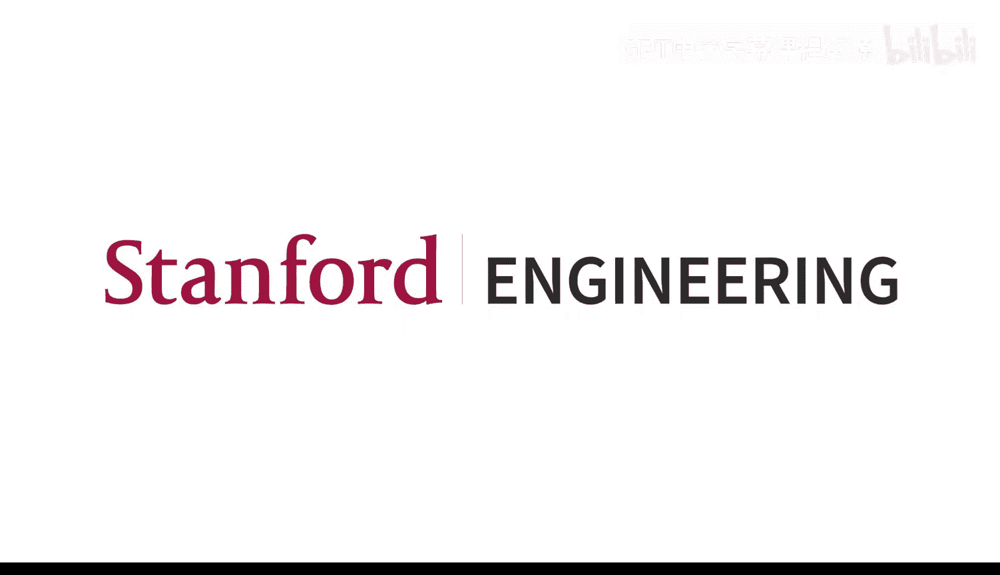

本节课中我们一起学习了自然语言处理和 Transformer 架构的基础知识。我们从如何将文本分词并表示为词嵌入开始，探讨了 RNN 在处理长序列时的局限性，并引出了革命性的注意力机制。最后，我们深入剖析了完全基于注意力构建的 Transformer 模型，包括其编码器-解码器结构、多头注意力、位置编码和前馈网络等核心组件。Transformer 以其并行计算的优势和强大的序列建模能力，成为了当今大语言模型的基石架构。