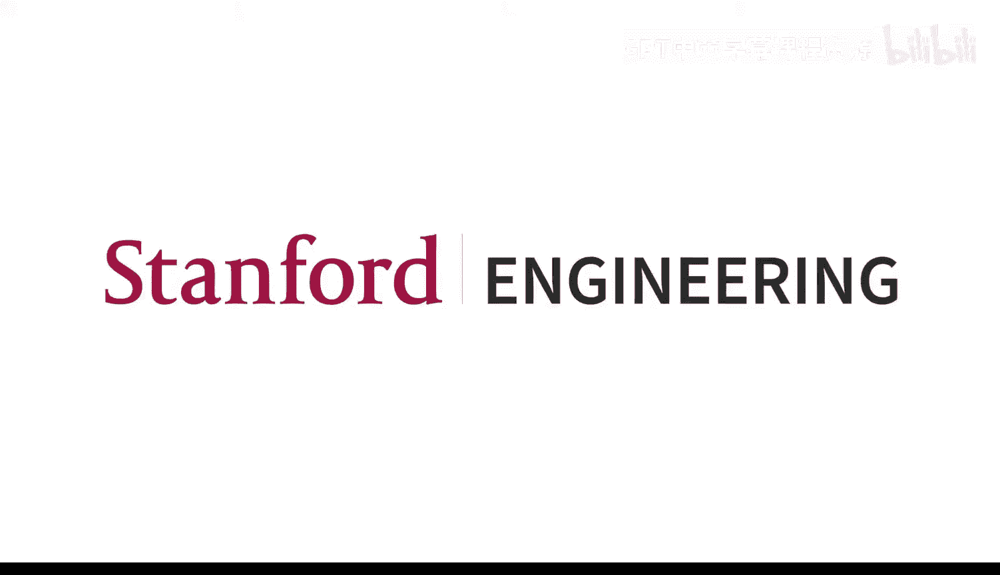
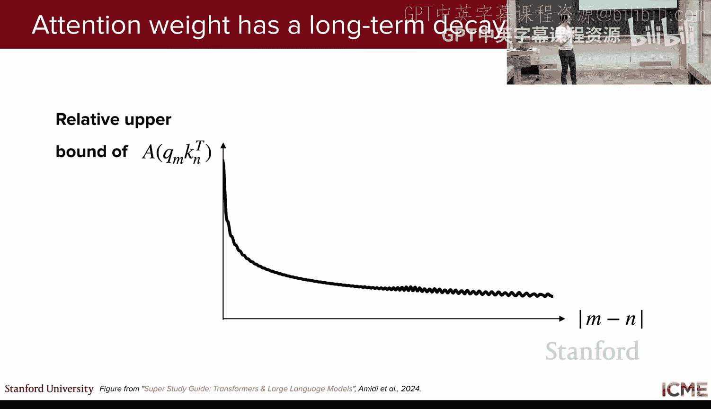
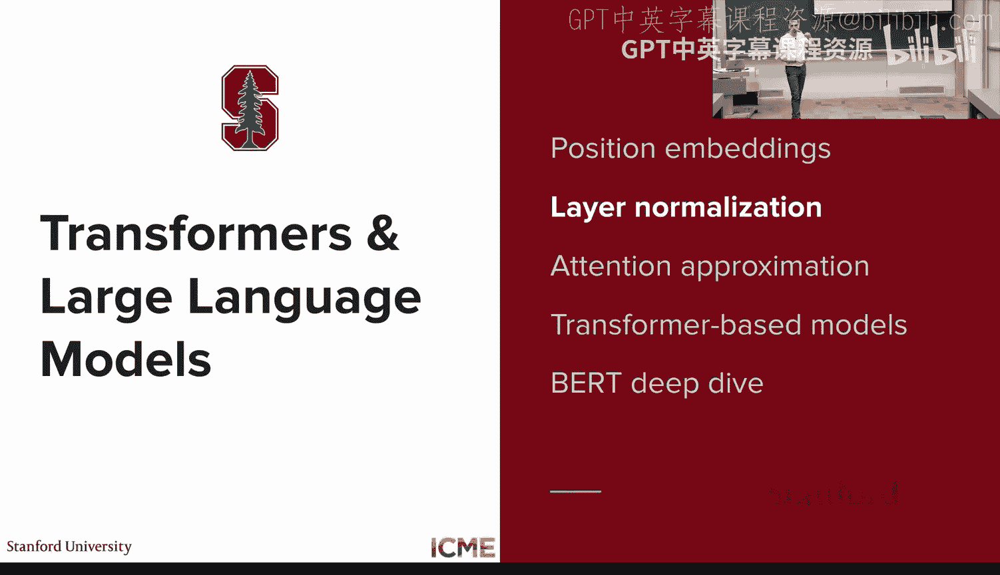
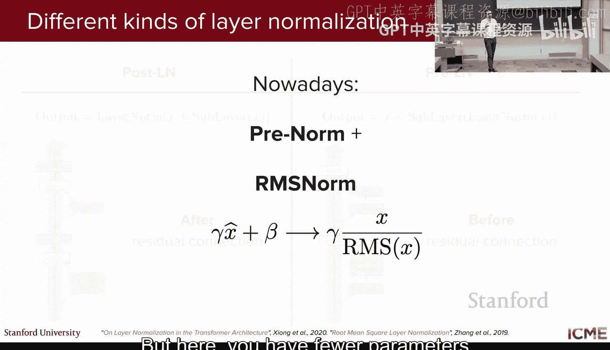
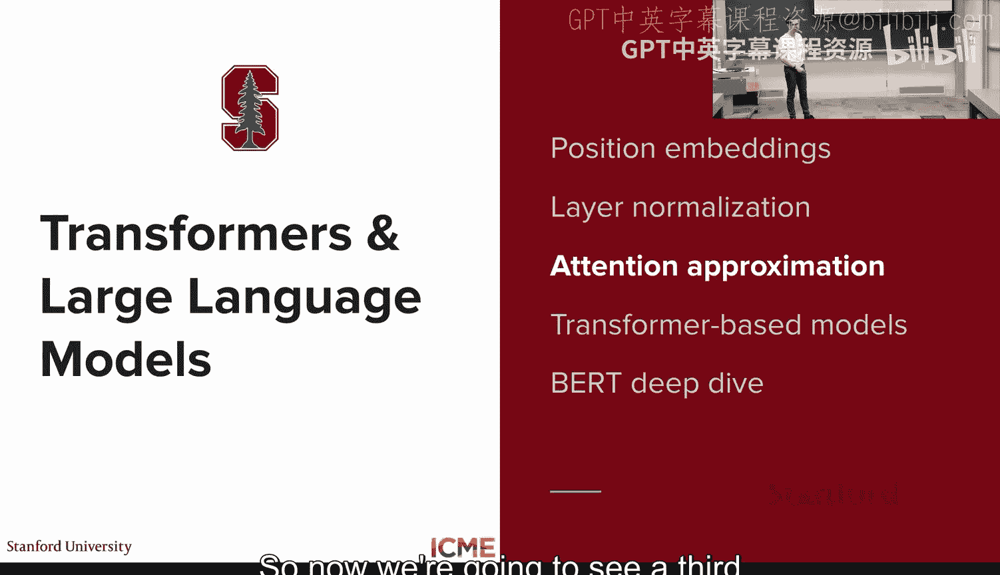
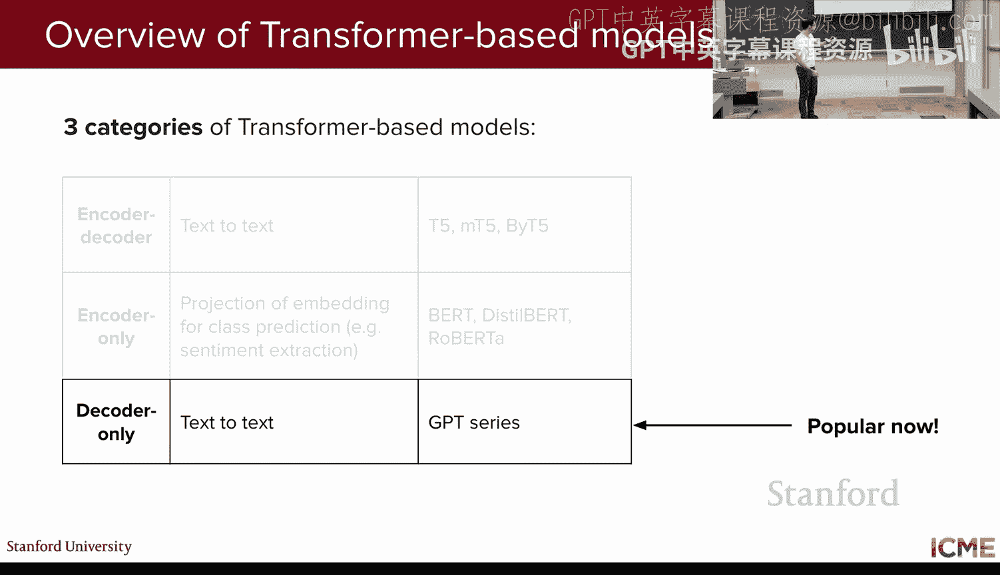

# 2：基于Transformer的模型与技巧 🧠




## 概述
在本节课中，我们将深入学习Transformer架构的关键组成部分及其后续演变。我们将探讨位置编码、层归一化和注意力机制的重要变体，并深入分析仅编码器架构（如BERT）的工作原理及其在分类任务中的应用。

---

## 课程回顾
上一讲我们介绍了自注意力机制的核心概念。自注意力允许序列中的每个词元通过查询、键和值的机制关注所有其他词元。其核心公式为：

**公式：自注意力**
```
Attention(Q, K, V) = softmax(Q * K^T / sqrt(d_k)) * V
```

这个公式经过高度优化，能够利用硬件高效执行大规模矩阵乘法。我们还介绍了Transformer的原始架构，它由编码器和解码器两部分组成，最初用于机器翻译任务。其中，多头注意力层是自注意力发生的地方，每个“头”都学习一种将输入投影为查询、键或值的方式。

为了理解每个“头”的作用，我们可以查看“注意力图”。例如，对于一个特定的词元（如“eats”），注意力图可以显示它与序列中哪些其他词元（如“law”和“application”）最相似，从而帮助模型学习词语间的关联。

---

## Transformer架构的演变
令人惊讶的是，2017年提出的Transformer架构至今仍然具有重要影响力。虽然某些组件略有变化，但当今的模型大多基于最初的Transformer架构。本节课将分为两部分：首先，我们将探讨Transformer中发生重要变化的部分；其次，我们将了解当今模型的命名规则及其与原始Transformer的关系。

### 1. 位置编码
在自注意力机制中，词元可以直接与所有其他词元交互，这失去了像RNN那样的顺序依赖信息。因此，我们需要一种方法来量化每个位置，并将位置信息注入到模型处理输入的过程中。

#### 原始方法：可学习的位置嵌入
原始Transformer论文的作者选择为每个位置设置一个专用的嵌入向量。例如，位置1有一个嵌入向量，位置2有另一个，依此类推。然后，将这个位置嵌入向量加到输入词元的嵌入向量上。

**方法特点：**
*   **可学习**：模型通过梯度下降学习每个位置的嵌入。
*   **局限性**：
    1.  模型性能依赖于训练数据中位置的分布。
    2.  只能学习到训练集中出现过的最大位置。如果在推理时遇到更长的序列，模型无法处理未见过的位置。

#### 改进方法：正弦/余弦位置编码
为了克服上述限制，作者提出了第二种方法：使用预定的正弦和余弦函数公式来计算位置嵌入，而不是学习它们。

**公式：正弦/余弦位置编码**
对于位置 `pos` 和维度 `i`：
```
PE(pos, 2i) = sin(pos / 10000^(2i/d_model))
PE(pos, 2i+1) = cos(pos / 10000^(2i/d_model))
```

**为什么有效？**
这种设计的核心直觉是：位置相近的词元应该比位置相距较远的词元更相似。通过三角函数公式可以证明，两个位置嵌入的点积仅取决于它们的相对距离 `(m-n)`。当两个位置相同时（相对距离为0），点积值最大，表示最相似。这符合我们的直觉。

**优势：**
*   **可扩展到任意长度**：由于使用公式计算，可以处理远超训练时所见长度的序列。
*   **性能相当**：论文中指出，这种方法与可学习的位置嵌入性能相当。



#### 现代方法：直接修改注意力（如RoPE）
现代模型更倾向于将位置信息直接注入到注意力计算中，而不是仅仅添加到输入里。因为自注意力的相似性计算发生在注意力层，直接修改注意力公式能更有效地反映“相近词元更相似”的直觉。

**常见变体：**
*   **T5的相对位置偏置**：学习一个与相对距离 `(m-n)` 相关的偏置项，并将其加到注意力分数的softmax之前。
*   **ALiBi（线性偏置注意力）**：使用一个确定的公式（基于相对距离）作为偏置，而不是学习它。
*   **RoPE（旋转位置编码）**：目前被许多主流模型（如LLaMA）采用。其核心思想是**根据词元的位置，旋转其查询和键向量**。



**RoPE直觉：**
通过旋转，查询向量和键向量的点积结果会自然地成为它们相对距离的函数。这能保证位置相近的词元具有更高的注意力分数上限，而远离的词元分数上限会衰减，从而在数学上保证了长期衰减的特性。



---

### 2. 层归一化
在Transformer架构中，编码器和解码器的每个子层（如注意力层或前馈网络）后都有一个“Add & Norm”操作。这意味着将子层的输入与其输出相加，然后进行归一化。



**作用：** 这种技巧被实践证明可以**提高训练的稳定性和收敛速度**。它通过将激活值的分量归一化到一个稳定的范围内，缓解了内部协变量偏移问题。

**公式：层归一化**
对于向量 `x`：
```
LayerNorm(x) = γ * (x - μ) / σ + β
```
其中 `μ` 是 `x` 的均值，`σ` 是标准差，`γ` 和 `β` 是可学习的缩放和偏移参数。

**演变：**
1.  **后归一化**：原始Transformer采用的方式，即 `Norm(x + Sublayer(x))`。
2.  **前归一化**：现代架构更常用的方式，即 `x + Sublayer(Norm(x))`，将归一化置于子层之前，通常能带来更稳定的训练。
3.  **RMS Norm**：一种更简单的变体，只使用均方根进行缩放，不计算均值和方差，也不使用偏移参数 `β`。公式为 `RMSNorm(x) = (x / RMS(x)) * γ`，其中 `RMS(x) = sqrt(mean(x_i^2))`。它能减少参数量并保持相当的收敛性能。

**与批归一化的区别：**
批归一化是在批次维度上进行归一化，而层归一化是在特征维度上进行。对于Transformer类模型，层归一化通常效果更好，且避免了训练与推理时因批次统计量不同而引入的差异。

---

### 3. 注意力机制的优化
标准的自注意力复杂度为 O(n²)，其中 n 是序列长度。当序列很长时，计算开销巨大。因此，研究者们提出了多种优化方法。

#### 局部注意力/滑动窗口注意力
一种直观的优化是限制每个词元只能关注其邻近的词元，而不是整个序列。

**方法：** 例如，Longformer 模型让每个词元只与其左右一定窗口内的词元进行注意力计算。
**类比：** 这与卷积神经网络中的局部感受野概念相似。通过堆叠多层这样的局部注意力层，一个词元最终也能间接地与较远处的词元交互。
**现代应用：** 当今的模型通常会交错使用局部注意力层和全局注意力层，以在效率和效果之间取得平衡。

#### 共享投影矩阵：多查询注意力与分组查询注意力
在标准的多头注意力中，每个头都有自己独立的查询、键、值投影矩阵。为了提升效率，特别是解码时的内存和速度，可以共享键和值的投影矩阵。




以下是几种变体：
*   **多查询注意力**：所有头共享同一套键和值投影矩阵。
*   **分组查询注意力**：将头分成若干组，组内共享键和值投影矩阵。
*   **标准多头注意力**：每个头都有自己独立的查询、键、值投影矩阵。

**为什么共享键和值？**
在自回归解码（生成文本）过程中，每当生成一个新词元，都需要用其查询向量与之前所有词元的键向量计算注意力，并加权求和对应的值向量。如果共享键和值的投影，就可以在推理时缓存这些投影结果，显著减少内存占用和计算量，这对长序列生成尤为重要。

---

## Transformer架构的三大类别
基于对编码器和解码器组件的不同使用，基于Transformer的模型主要分为三类：

1.  **编码器-解码器架构**：原始Transformer形态。代表：T5系列模型。
    *   T5使用“跨度破坏”目标进行训练，即随机遮盖输入文本的连续片段，让解码器重建这些片段。
2.  **仅编码器架构**：只保留编码器部分，擅长获取双向上下文表示，适用于分类任务（如情感分析、命名实体识别）。代表：BERT及其变体（如DistilBERT， RoBERTa）。
3.  **仅解码器架构**：只保留解码器部分，使用掩码自注意力确保生成过程是因果的（只能看到当前及之前的词元）。这是当今大多数大语言模型采用的架构，专长于文本生成。代表：GPT系列、LLaMA等。

---

## 深入剖析：仅编码器模型（以BERT为例）
本节我们将深入探讨仅编码器模型的代表——BERT。

### BERT 是什么？
BERT 代表 **B**idirectional **E**ncoder **R**epresentations from **T**ransformers。
*   **编码器**：使用了Transformer的编码器部分。
*   **双向**：由于去除了掩码，编码器中的自注意力允许每个词元同时关注序列中所有其他词元（前后文），从而获得真正双向的上下文表示。

### BERT 的训练：两阶段流程
BERT采用预训练和微调的两阶段范式。

#### 阶段一：预训练
在大量无标注文本上，使用两个无监督任务进行训练：
1.  **掩码语言建模**：随机遮盖输入句子中15%的词元。其中：
    *   80%的概率替换为 `[MASK]` 标记。
    *   10%的概率替换为随机词元。
    *   10%的概率保持不变。
    *   **目标**：让模型根据上下文预测被遮盖的原始词元。这迫使模型学习双向语境信息。
2.  **下一句预测**：给定两个句子A和B，50%的情况下B是A的实际下一句，50%的情况下B是随机选取的。
    *   **目标**：让模型判断B是否是A的下一句。这有助于模型理解句子间关系。

**输入表示：**
BERT的输入嵌入是三种嵌入的总和：
*   **词元嵌入**：从词汇表中查找。
*   **位置嵌入**：使用正弦/余弦公式。
*   **段落嵌入**：新增的嵌入类型。用于区分两个句子（句子A和句子B），以辅助NSP任务。

此外，输入序列的开头会添加特殊的 `[CLS]` 标记，句子之间和末尾会添加 `[SEP]` 标记。

#### 阶段二：微调
将预训练好的BERT模型用于下游任务。根据任务类型，在BERT的输出之上添加一个简单的输出层（如线性分类器）。
*   **句子级任务**（如情感分类）：使用 `[CLS]` 标记的最终输出向量作为整个序列的表示，输入分类器。
*   **词元级任务**（如问答、命名实体识别）：使用每个词元对应的输出向量分别进行分类。

**为什么 `[CLS]` 标记可用于分类？**
`[CLS]` 标记在序列开头，通过多层自注意力机制，它聚合了序列中所有词元的双向上下文信息。因此，它的最终输出向量可以作为整个序列的有效摘要，用于分类。

### BERT 的变体与改进
1.  **DistilBERT**：通过**知识蒸馏**技术，用一个较小的“学生”模型去学习大型“教师”BERT模型的输出分布（而不仅仅是硬标签）。在减少约40%参数的情况下，能保留教师模型97%的性能，速度提升60%。
2.  **RoBERTa**：对BERT的预训练过程进行了精细调整。
    *   **移除NSP任务**：发现仅使用MLM任务效果更好。
    *   **动态掩码**：在每个epoch对同一数据生成不同的掩码模式，增加多样性。
    *   **更大批次、更多数据**：使用更大量的数据训练更长时间。
    *   这些改动显著提升了模型在各种基准测试上的性能。

---


## 总结
本节课我们一起深入学习了Transformer架构的关键演变。我们探讨了从正弦/余弦编码到RoPE的位置编码进化，了解了层归一化及其变体RMS Norm的作用，并分析了注意力机制在效率和内存上的优化策略，如局部注意力和分组查询注意力。最后，我们深入剖析了仅编码器模型BERT的工作原理、两阶段训练流程及其重要变体DistilBERT和RoBERTa。理解这些基础组件和模型类别，是进一步学习现代大语言模型的坚实基础。