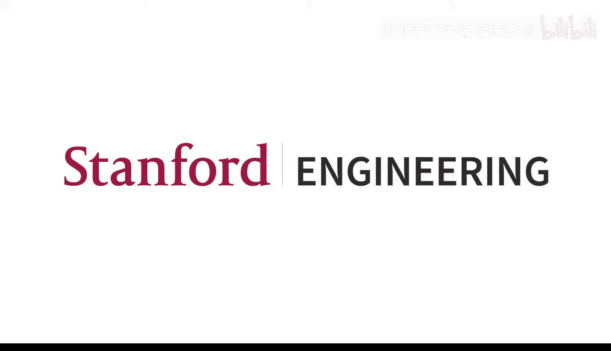
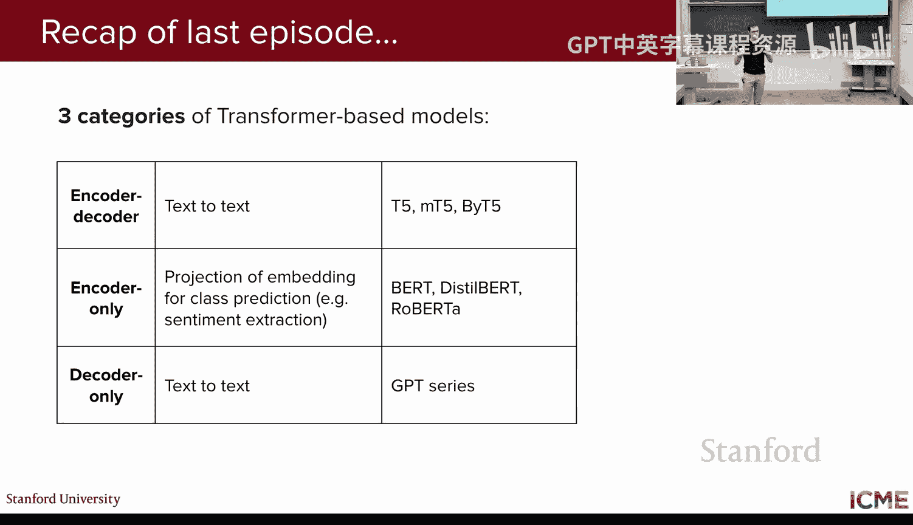
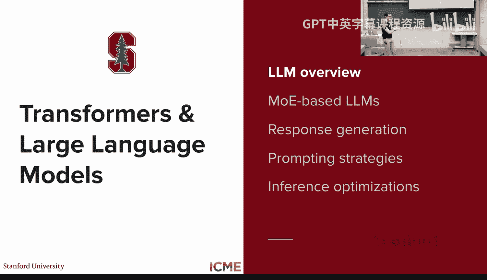
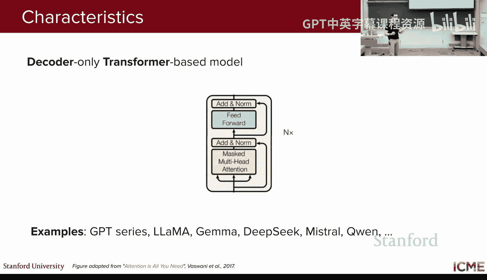
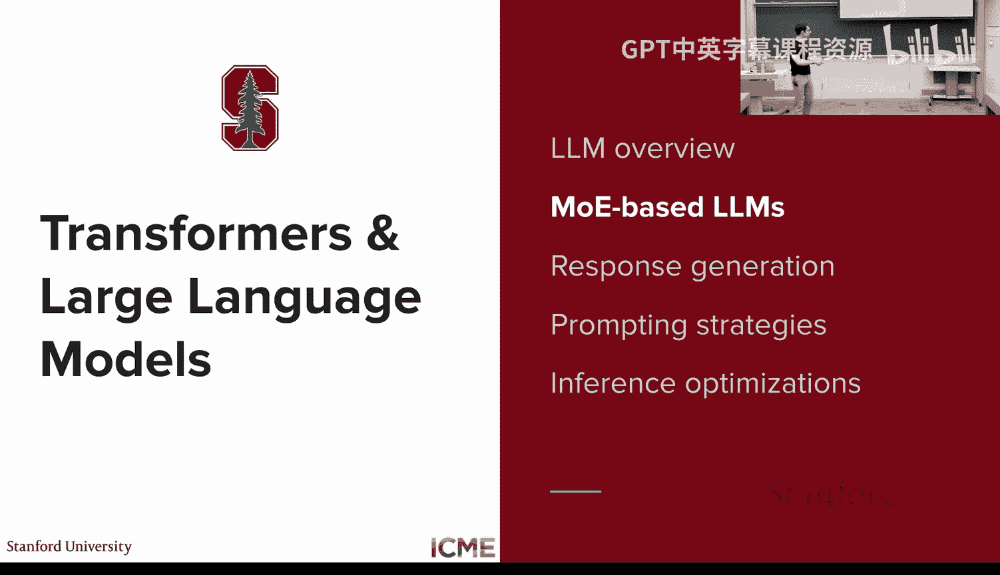
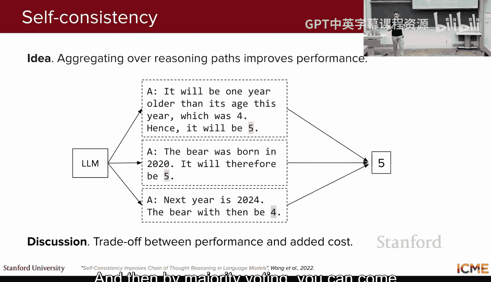
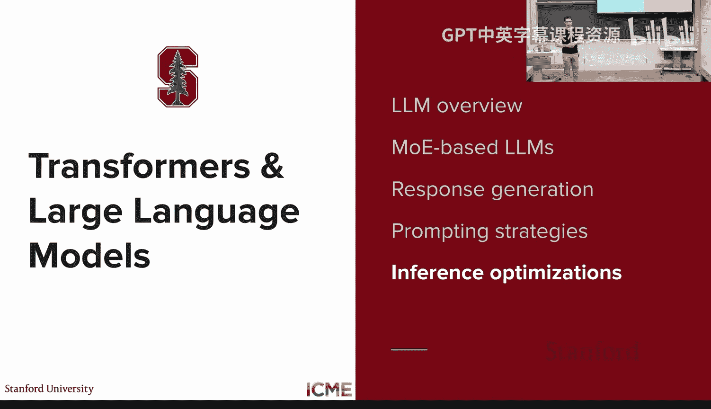
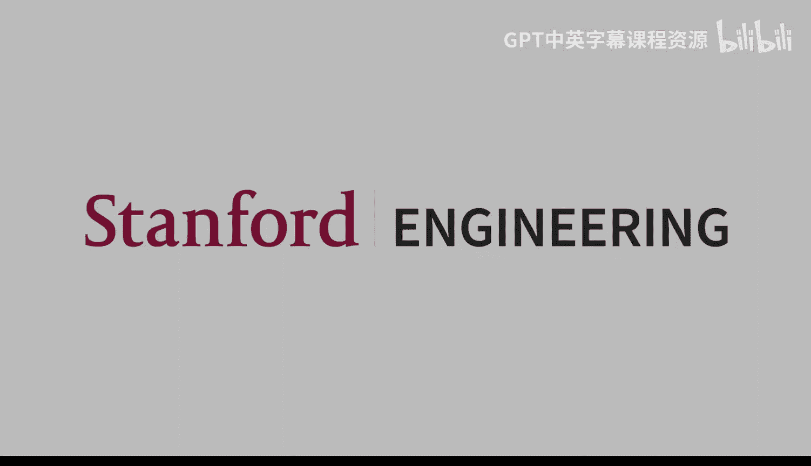

# 3：大语言模型与高效推理 🚀

在本节课中，我们将要学习大语言模型的核心概念、其内部工作原理，以及如何高效地使用它们生成文本。我们将从回顾Transformer架构开始，深入探讨大语言模型的定义、其独特的专家混合架构，并详细讲解文本生成的各种策略。最后，我们将了解一系列用于提升大语言模型推理效率的先进技术。

## 课程回顾与LLM定义

上一讲我们介绍了基于Transformer的三种主要模型类别：编码器-解码器模型、仅编码器模型和仅解码器模型。本节中，我们来看看现代大语言模型的核心。

大语言模型是一种语言模型，它为词元序列分配概率，其核心任务是预测下一个词元。它之所以“大”，体现在三个方面：
*   **模型规模巨大**：参数数量通常在十亿级别以上，甚至达到数千亿。
*   **训练数据海量**：预训练使用的词元数量可达数百亿甚至数万亿。
*   **计算需求极高**：训练和推理需要大量的计算资源。

值得注意的是，当前主流的大语言模型几乎都是**仅解码器**模型。它们移除了Transformer中的编码器和交叉注意力层，仅保留掩码自注意力层和前馈神经网络。

## 专家混合架构

上一节我们介绍了大语言模型的基本构成，本节中我们来看看一种用于扩展模型容量而不显著增加单次推理计算量的关键技术：专家混合。

核心思想是，对于给定的输入，无需激活模型中的所有参数。我们可以训练一组“专家”网络和一个“路由器”。路由器根据输入决定将词元路由到哪个（或哪几个）专家网络进行处理。

以下是两种主要的专家混合类型：
*   **密集专家混合**：所有专家都参与计算，但路由器为每个专家分配不同的权重。
*   **稀疏专家混合**：只激活排名前K的专家（通常K=1或2），这能显著减少计算量。

在大语言模型中，专家混合层通常被放置在计算密集的**前馈神经网络**位置，而不是注意力层。每个词元会独立地被路由到最适合它的专家。

训练专家混合模型的一个关键挑战是**路由崩溃**，即路由器可能总是选择少数几个专家。为了解决这个问题，可以在损失函数中添加一个辅助项，鼓励路由器更均匀地使用所有专家。

## 文本生成策略

了解了模型如何工作后，本节我们来看看如何使用大语言模型生成文本。模型最终会输出一个覆盖整个词表的概率分布，表示下一个词元的可能性。如何从这个分布中选择词元，有多种策略。

以下是三种主要的解码策略：
1.  **贪婪解码**：总是选择概率最高的词元。这种方法简单快速，但缺乏多样性，且可能无法得到全局最优的序列。
2.  **束搜索**：同时跟踪K个最有可能的序列路径（K为束宽）。它在每一步都保留概率最高的K个候选序列，最终选择整体概率最高的序列。这种方法比贪婪解码更可能找到高质量输出，但仍缺乏创造性，且计算成本较高。
3.  **采样**：根据模型输出的概率分布随机抽取下一个词元。这种方法能产生多样化和创造性的文本。

为了在采样时平衡多样性与质量，常采用以下技巧：
*   **Top-k采样**：仅从概率最高的k个词元中采样。
*   **Top-p采样**：仅从累积概率超过阈值p的最小词元集合中采样。

这些概率分布是通过在模型最后一层添加线性层和Softmax函数得到的。Softmax函数中有一个关键的超参数——**温度**。

**公式**：`P(token_i) = exp(z_i / T) / Σ_j exp(z_j / T)`
其中，`z_i`是模型对词元i的原始输出分数，`T`是温度。
*   **低温（T → 0）**：概率分布变得尖锐，模型输出更确定、更保守。
*   **高温（T → ∞）**：概率分布趋于均匀，模型输出更随机、更有创造性。

## 提示工程与上下文学习

现在我们知道如何生成响应了，本节中我们来看看如何通过设计输入提示来引导模型生成我们想要的响应。输入提示的长度（即词元数量）被称为**上下文长度**。

一个结构良好的提示通常包含以下部分：
*   **上下文**：设定场景和背景。
*   **指令**：明确要求模型执行的任务。
*   **输入**：任务的具体输入内容。
*   **约束**：对输出格式、内容等的限制。

无需调整模型权重，仅通过设计提示就能让模型执行新任务，这被称为**上下文学习**。主要有两种方式：
*   **零样本学习**：仅提供任务指令和输入，不提供示例。
*   **少样本学习**：在指令和输入之前，提供少量输入-输出示例作为示范。

为了进一步提升模型在复杂任务（如数学推理）上的表现，可以采用**思维链**技术。即要求模型在给出最终答案前，先输出其推理步骤。这能显著提高答案的准确性。

更进一步的技巧是**自洽性**：对同一个问题多次采样，得到多个带有推理链的答案，然后通过多数投票选择最常出现的最终答案，以得到更可靠的结果。

## 高效推理技术

大语言模型推理成本高昂，本节我们来看看一系列提升推理效率的技术。这些技术可分为两类：保持计算精确的优化方法和引入近似以换取速度的方法。

首先，我们关注注意力层的优化。在自回归生成中，当前词元需要与之前所有词元计算注意力。为了避免重复计算，可以使用**KV缓存**：在生成每个词元后，将其键和值向量缓存起来，供后续词元直接使用。

为了减少需要缓存的KV对数量，可以采用**分组查询注意力**（如GQA、MQA），让多个查询头共享同一组键和值。

在硬件层面，为了高效管理不同请求的KV缓存内存，避免碎片化，可以使用**PagedAttention**技术（由vLLM项目实现）。它将缓存空间划分为固定大小的块，按需分配，极大提升了内存利用率。

另一种压缩思路是**多潜在注意力**（如DeepSeek-V2采用）。它通过一个低维的共享潜在表示来压缩键和值向量，大幅减少了需要存储的缓存大小。

其次，在词元生成层面，**推测解码**是一项革命性技术。它使用一个更快的小模型（草稿模型）预先生成多个候选词元，然后一次性提交给大模型（目标模型）进行验证。通过一个基于概率的接受/拒绝算法，可以在数学上保证最终输出的分布与直接使用大模型采样一致，从而用一次大模型前向传播的成本生成多个词元。

与此类似，**多词元预测**技术在训练时就让模型同时预测后续多个词元。在推理时，模型自身的多个预测头充当了草稿模型，与第一个预测头（目标模型）配合，实现高效的推测解码。

---

本节课中我们一起学习了现代大语言模型的基础。我们明确了LLM作为大规模仅解码器模型的定义，探讨了用于扩展容量的专家混合架构。我们深入分析了从贪婪解码到采样的各种文本生成策略，以及温度参数的关键作用。接着，我们学习了如何通过提示工程和上下文学习技术来引导模型行为。最后，我们回顾了从KV缓存、PagedAttention到推测解码等一系列用于提升大语言模型推理效率的前沿技术，理解了如何在保持效果的同时显著降低计算成本。