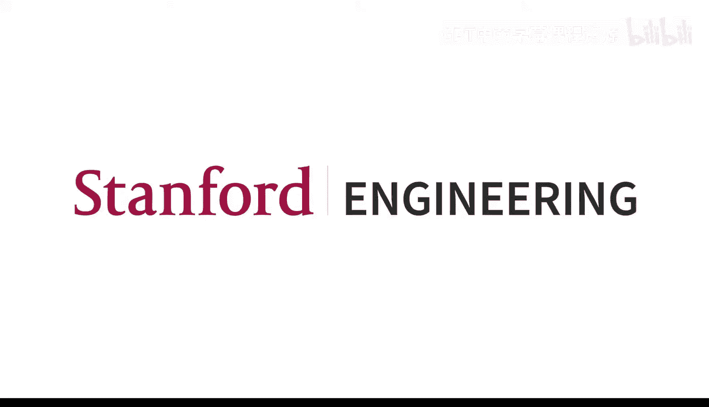
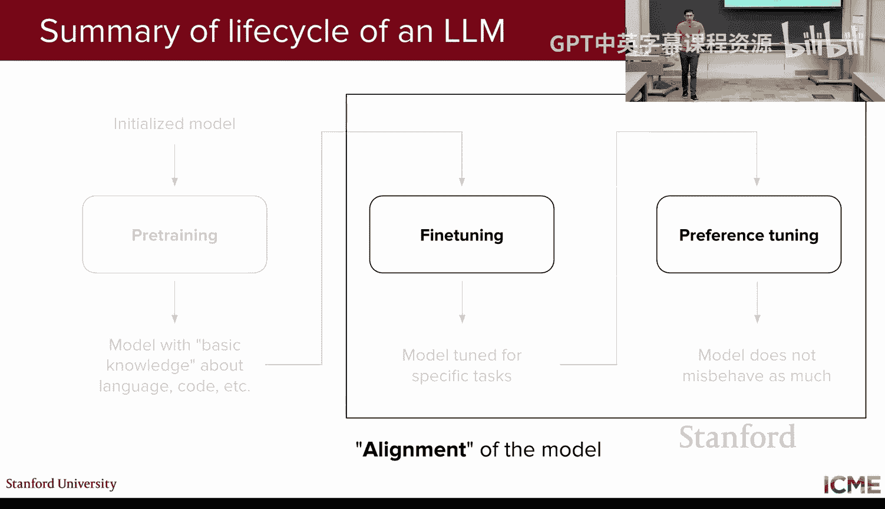
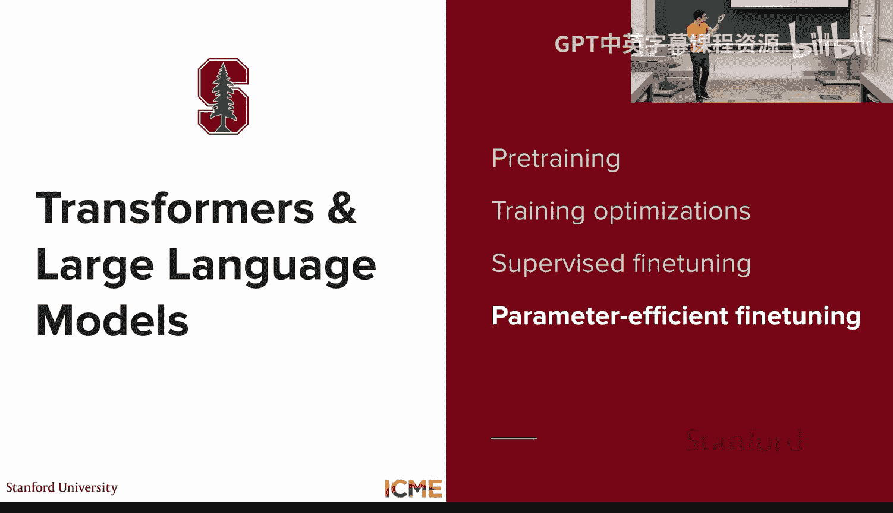
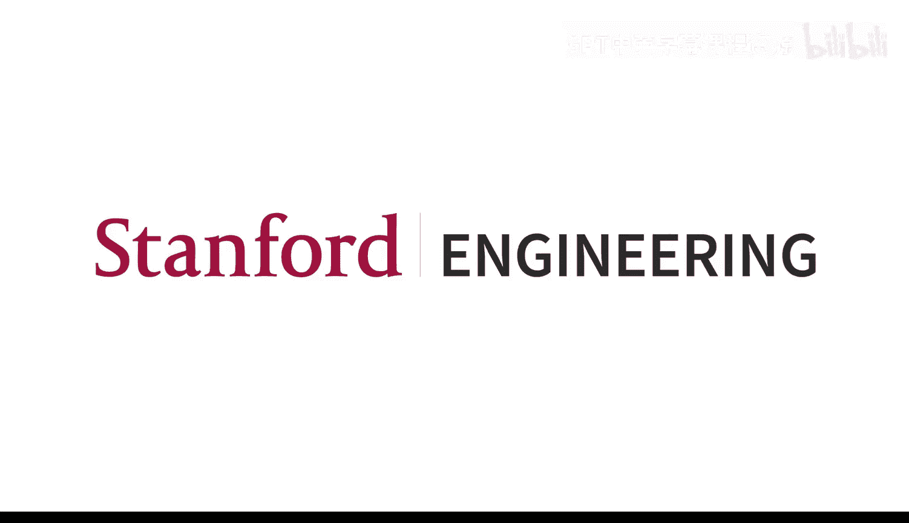

# 4：LLM 训练

## 概述
在本节课中，我们将要学习大语言模型（LLM）是如何训练的。我们将从预训练开始，了解模型如何从海量数据中学习语言的基本结构，然后探讨如何通过微调使模型适应特定任务或变得更有帮助。我们还将介绍训练过程中面临的计算挑战以及一些关键的优化技术。

## 预训练：构建语言理解的基础

上一节我们介绍了LLM的基本概念和推理方法，本节中我们来看看如何训练它们。

在机器学习领域，传统上，每个任务都需要训练一个专门的模型。然而，许多任务都涉及对文本的理解，因此可以共享知识。这种共享知识的方法被称为**迁移学习**。LLM的训练正是基于此范式。

预训练是LLM训练中最昂贵、计算量最大的阶段。其目标是让模型学会预测下一个词元（token）。模型（通常是仅解码器架构）接收输入文本，并迭代地预测序列中的下一个词元。

以下是预训练阶段使用的典型数据集：
*   **Common Crawl**：包含从互联网抓取的数十亿网页。
*   **维基百科文章**：提供结构化的高质量文本。
*   **社交媒体对话**：例如来自Reddit的对话。
*   **代码库**：来自GitHub、Stack Overflow等平台的代码。

数据集的规模通常以**词元**数量衡量，可达数百亿甚至数万亿。例如，GPT-3在3000亿词元上训练，而Llama 3在15万亿词元上训练。

为了量化计算需求，我们引入两个概念：
*   **FLOPs**：浮点运算次数，衡量总计算量。训练LLM通常需要 `10^25` 量级的FLOPs。
*   **FLOPS**：每秒浮点运算次数，衡量计算速度。GPU的性能常用此指标描述。

研究表明，模型性能随模型规模、训练数据量和计算量的增加而提升。给定固定计算预算时，存在一个模型参数量与训练词元数之间的**最优比例**（例如，训练词元数约为模型参数量的20倍），这被称为 **Chinchilla 最优法则**。

预训练面临诸多挑战：
1.  **成本高昂**：通常需要数百万甚至数千万美元。
2.  **知识截止日期**：模型的知识仅限于训练数据收集的时间点。
3.  **知识编辑困难**：很难在不影响其他能力的情况下更新模型知识。
4.  **抄袭风险**：模型可能逐字生成训练时见过的内容。

## 训练的计算挑战与并行策略

我们已经了解了预训练的重要性及其巨大规模。那么，如何实际训练如此庞大的模型和处理海量数据呢？

LLM本质上是基于Transformer的仅解码器模型，其核心运算是矩阵乘法，因此非常适合在**GPU**上进行加速。然而，单个GPU的内存有限（例如80GB），无法容纳整个训练过程所需的数据。

训练步骤包括：
1.  **前向传播**：计算损失，需要保存各层的**激活值**。
2.  **反向传播**：计算损失相对于每个参数的**梯度**。
3.  **权重更新**：使用优化器（如Adam）更新权重，优化器需要保存**动量**等状态。

所有这些中间变量都需要存储在GPU内存中。为了应对内存限制，我们需要在多个GPU之间分配计算负载。

以下是主要的并行策略：

**数据并行**
*   **核心思想**：将训练数据批次划分到多个GPU上，每个GPU持有完整的模型副本，独立进行前向和反向传播。
*   **优点**：减少了与批次大小相关的内存压力。
*   **挑战**：需要跨GPU通信以聚合梯度；每个GPU仍需容纳整个模型。

**零冗余优化**
*   **核心思想**：消除数据并行中的冗余存储，将优化器状态、梯度和模型参数分区存储在不同的GPU上。
*   **优点**：显著降低了每个GPU的内存占用。
*   **挑战**：引入了更多的通信开销。

**模型并行**
*   **核心思想**：将模型本身（而不仅仅是数据）划分到多个GPU上。
*   **常见类型**：
    *   **专家并行**：将混合专家模型中的不同专家分配到不同GPU。
    *   **张量并行**：将大型矩阵运算拆分到多个GPU。
    *   **流水线并行**：将模型的不同层分配到不同GPU。

## 注意力机制优化：Flash Attention

我们看到了如何通过并行策略分配计算。现在，让我们深入一个关键的运算——自注意力机制，并了解如何优化它。

GPU内存分为两部分：
*   **高带宽内存**：容量大（数十GB），但速度相对较慢。
*   **片上内存**：容量小（数十MB），但速度极快（SRAM）。

标准的注意力计算 `softmax(QK^T / sqrt(d)) V` 涉及与序列长度平方相关的大矩阵乘法。传统实现需要频繁在慢速的HBM和快速的SRAM之间读写数据，成为性能瓶颈。

**Flash Attention** 的核心思想是使用**分块**计算来最小化对HBM的读写次数。它将输入矩阵分块，将小块数据送入SRAM，在SRAM内完成该块的所有计算（包括softmax），然后再写回HBM。

其关键技巧在于，**softmax** 可以迭代计算。对于分块的矩阵，可以通过维护一个额外的缩放因子，在遍历块的过程中逐步计算出整个行的softmax结果，而无需一次性看到所有数据。

Flash Attention 还引入了**重计算**技术。在反向传播时，不存储前向传播中的大量中间激活值，而是在需要时利用Flash Attention快速的前向计算能力重新计算它们。这样虽然增加了总FLOPs，但大幅减少了内存访问，最终在**减少内存占用**的同时也**加快了训练速度**。

## 量化与混合精度训练

除了优化计算流程，我们还可以通过降低数值表示的精度来节省内存和加速计算。

**量化**是将模型权重从高精度格式（如FP32）转换为低精度格式（如INT8）的过程。不同的浮点数格式占用不同比特位，用于表示符号、指数和尾数。

以下是常见格式：
*   **FP32**：单精度浮点数，32位。
*   **FP16/BF16**：半精度浮点数，16位。

降低精度可以：
1.  **减少内存占用**：例如，FP16的存储空间是FP32的一半。
2.  **提高计算速度**：GPU在低精度格式下通常有更高的理论算力。

**混合精度训练**是一种实用的量化应用策略：
*   **权重**：以FP32格式保存（主权重）。
*   **前向/反向传播**：使用FP16进行计算，减少内存和加速。
*   **权重更新**：将FP16计算得到的梯度用于更新FP32的主权重。

这样做的直觉是：前向传播和梯度计算可以容忍一定精度损失，但保持权重更新在高精度进行可以避免误差累积，确保训练稳定性。

## 监督微调：让模型变得有用

我们已经掌握了预训练如何赋予模型基础语言能力。现在，我们来看看如何通过**监督微调**使模型变得有帮助、能遵循指令。

预训练模型擅长预测下一个词元，但它可能不会以“助手”的方式回应用户查询。SFT的目标是调整模型权重，使其能够根据给定的指令生成有帮助的、准确的回复。

在SFT中，我们使用高质量的**指令-输出对**数据集。模型的训练目标不再是预测整个输入序列的下一个词元，而是在给定指令（作为固定输入）的条件下，预测后续的正确输出序列。

以下是SFT数据集的常见类别：
*   **创意写作**：故事、诗歌生成。
*   **信息组织**：列表生成、总结。
*   **推理与解释**：数学解题、代码解释。
*   **安全与拒绝**：训练模型以无害方式拒绝不当请求。

SFT的数据规模远小于预训练，通常只有数万到数百万个示例，但质量要求极高。经过SFT后，模型能够从“语言建模者”转变为“有帮助的助手”。

## 模型评估的挑战

微调后，我们需要评估模型的表现。然而，评估LLM是一个复杂的问题。

常用的评估方式包括：
*   **基准测试**：在MMLU（大规模多任务语言理解）、GSM8K（数学推理）、HumanEval（代码生成）等标准化数据集上打分。
*   **人工偏好排名**：如Chatbot Arena，让用户比较不同模型的匿名输出并投票。

然而，这些方法都存在挑战：
1.  **测试数据污染**：如果模型在训练中见过与测试任务相似的数据，其高分可能无法反映真实泛化能力。
2.  **主观性**：帮助性、流畅性、是否喜欢使用表情符号等标准因人而异。
3.  **安全与帮助性的权衡**：用户可能更喜欢总是回答问题的模型，即使有些回答可能不安全。
4.  **评估者偏差**：参与评估的用户群体可能与最终用户群体分布不同。

因此，没有一个单一的指标能完美衡量模型质量，需要结合具体用例进行多维度评估。

## 高效微调技术：LoRA

SFT虽然数据量较小，但直接更新拥有数百亿参数的全部权重仍然计算昂贵。**LoRA** 是一种高效微调技术，可以大幅减少可训练参数量。

LoRA的核心思想是：不对原始预训练权重 `W0` 进行直接更新，而是通过一个低秩分解来注入任务特定的适应能力。其更新公式为：

`W = W0 + ΔW = W0 + B * A`

其中：
*   `W0` 是冻结的预训练权重。
*   `B` 和 `A` 是可训练的低秩矩阵，其乘积 `B*A` 的秩 `r` 很小（通常为4-64）。
*   原始权重维度为 `d x k`，则 `B` 的维度为 `d x r`，`A` 的维度为 `r x k`。

由于 `r` 远小于 `d` 和 `k`，可训练参数数量从 `d*k` 减少到 `(d+k)*r`，实现了巨大的参数效率提升。每个任务可以学习一组独立的 `B` 和 `A` 矩阵，轻松实现多任务适配。

实践表明，将LoRA适配器应用于**前馈网络层**通常比仅应用于注意力层效果更好。使用LoRA时，通常需要采用更高的学习率。

为了进一步压缩，可以将**量化**与LoRA结合，即 **QLoRA**：
*   将冻结的预训练权重 `W0` 量化为低精度格式（如NF4）。
*   可训练的适配器矩阵 `B` 和 `A` 仍用较高精度（如BF16）存储和更新。
*   这能在几乎不损失性能的前提下，极大降低微调所需的内存。

## 总结
本节课中我们一起学习了LLM训练的全过程。我们从计算密集型的**预训练**开始，了解了模型如何从海量数据中学习语言基础。接着，我们探讨了训练中的计算挑战及**数据并行**、**模型并行**等分布式策略，以及**Flash Attention**这一关键优化。然后，我们介绍了**量化**和**混合精度训练**以节省内存。在模型能力塑造方面，我们学习了**监督微调**如何使模型遵循指令，并讨论了**模型评估**的复杂性。最后，我们掌握了**LoRA**这一高效微调技术，它能以极少的参数量实现模型适配。这些步骤共同构成了现代大语言模型从“原始语言建模者”到“有用助手”的蜕变之路。