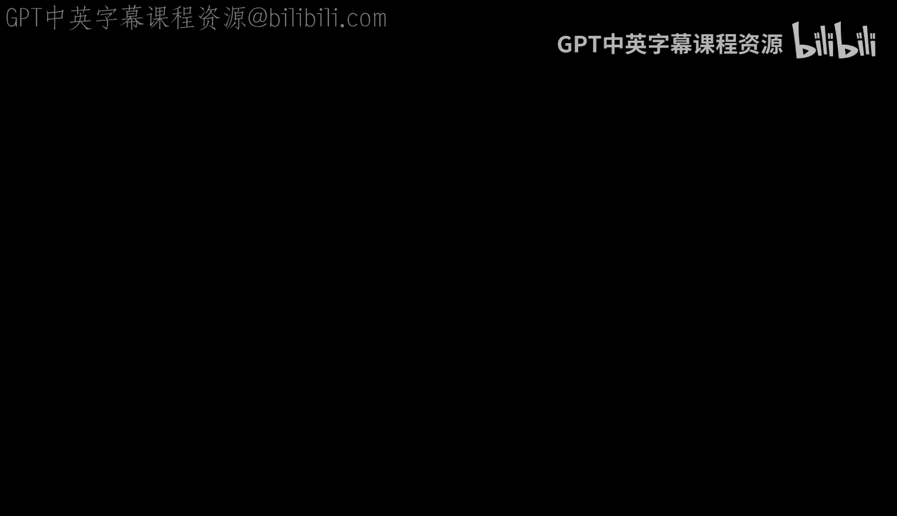
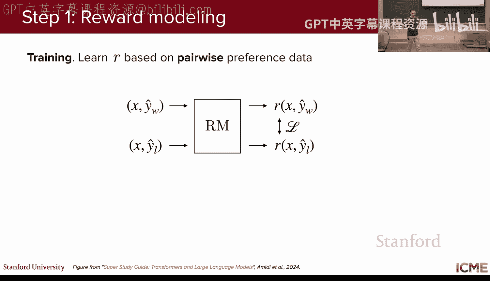
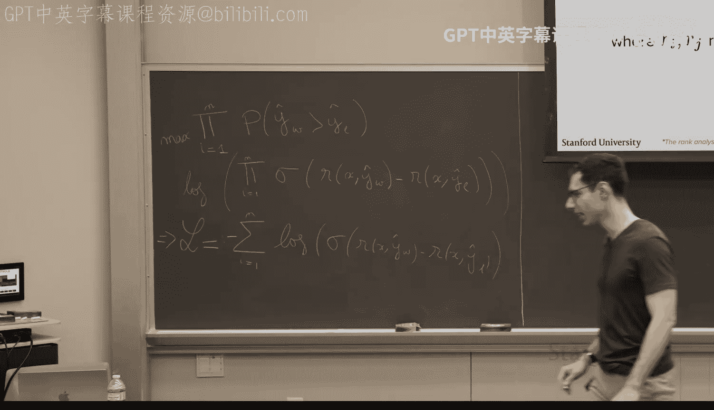

# 5：LLM调优

## 概述

在本节课中，我们将要学习大语言模型（LLM）调优的第三个关键步骤：偏好对齐。我们将探讨如何通过收集人类偏好数据，并使用强化学习从人类反馈（RLHF）或直接偏好优化（DPO）等方法，使模型的行为更符合人类的期望，例如更友好、更安全或更有帮助。

---

## 回顾：LLM训练流程

上一节我们介绍了如何训练一个大语言模型，主要包含两个步骤：预训练（Pre-training）和监督微调（Supervised Fine-Tuning, SFT）。预训练让模型学习语言和代码的结构，而SFT则针对特定任务（如聊天助手）教导模型如何生成期望的回复。

本节中，我们来看看如何进一步“对齐”模型，使其输出更符合人类的偏好。

---

## 什么是偏好对齐？

经过SFT的模型虽然能完成任务，但其回复的“风格”或“安全性”可能仍不理想。例如，一个助手可能给出技术上正确但语气生硬的回答。偏好对齐的目标就是调整模型，使其输出更受人类喜爱。

**核心概念**：给定一个提示（Prompt），模型会生成多个可能的回复。我们的目标是让模型学会**偏好**那些被人类评为“更好”的回复。

---

## 如何收集偏好数据？

为了训练模型理解“好”与“坏”，我们首先需要收集偏好数据。以下是几种常见的数据收集方式：

1.  **点对点评分**：为每个单独的回复打分（例如0-10分）。这种方法比较困难，因为评分标准难以统一。
2.  **成对比较**：同时展示两个回复，让标注者选择哪个更好。这种方法更直观、更常用。
3.  **列表排序**：展示多个回复，让标注者进行排序。这比成对比较更复杂。

**实践中，最常用的是成对比较数据**。数据收集的典型流程如下：
*   使用一个提示，让模型在不同随机性（温度参数）下生成两个不同的回复。
*   通过人类标注者、另一个LLM（作为裁判）或基于规则的指标（如BLEU、ROUGE）来比较这两个回复，判断孰优孰劣。
*   也可以从日志中找出“坏”的回复，并人工重写为“好”的回复，从而构成一个偏好对。

---

## 强化学习从人类反馈（RLHF）

RLHF是一种流行的偏好对齐方法，它分为两个主要阶段。

### 第一阶段：训练奖励模型

我们首先需要训练一个模型，让它学会给“好”的回复打高分，给“坏”的回复打低分。这个模型称为**奖励模型**。

**核心公式**：我们使用**布拉德利-特里模型**来构建损失函数。该模型认为，回复 `y_w` 优于回复 `y_l` 的概率为：
`P(y_w > y_l) = σ( R(x, y_w) - R(x, y_l) )`
其中，`σ` 是sigmoid函数，`R(x, y)` 是奖励模型对给定提示 `x` 和回复 `y` 的打分。

**损失函数**：我们希望最大化观察到的偏好数据出现的概率。通过取负对数，我们得到可最小化的损失函数：
`L_RM = -E[ log( σ( R(x, y_w) - R(x, y_l) ) ) ]`
通过优化这个损失函数，我们训练奖励模型学会区分回复的好坏。

### 第二阶段：使用强化学习对齐策略

现在，我们利用训练好的奖励模型来调整我们原始的SFT模型（称为**策略**）。

**基本思想**：
1.  策略模型根据提示生成一个完整的回复。
2.  奖励模型对这个回复进行打分。
3.  我们根据这个分数来更新策略模型，目标是**最大化期望奖励**。

**关键挑战与PPO算法**：
如果我们只追求最大化奖励，模型可能会过度优化有缺陷的奖励模型，产生不合理输出（**奖励黑客**），或忘记之前学到的知识。因此，我们需要约束策略模型不要偏离原始SFT模型太远。

**近端策略优化**算法通过修改目标函数来解决这个问题。其目标函数通常包含两部分：
`L_PPO = E[ (优势函数) ] - β * KL( π_θ || π_ref )`
*   **第一部分**：鼓励获得高奖励（通过优势函数估计，它衡量了当前动作相对于平均水平的优劣）。
*   **第二部分**：一个KL散度惩罚项，防止当前策略 `π_θ` 与参考策略（即原始SFT模型 `π_ref`）相差太远。`β` 是一个控制惩罚强度的超参数。

PPO算法虽然强大，但需要同时维护和训练策略模型、价值函数模型、奖励模型和参考模型，过程复杂且调参困难。

---

## 替代方案：直接偏好优化（DPO）

由于RLHF/PPO流程复杂，研究者提出了更简单的监督学习方法——直接偏好优化。

**核心思想**：DPO绕过了显式训练奖励模型和复杂的RL循环。它推导出一个可以直接在偏好数据上优化的损失函数。

**DPO损失函数**：
`L_DPO = -E[ log( σ( β * log( π_θ(y_w|x) / π_ref(y_w|x) ) - β * log( π_θ(y_l|x) / π_ref(y_l|x) ) ) ) ]`

**公式解读**：
*   `π_θ` 是待训练的策略模型。
*   `π_ref` 是固定的参考模型（即SFT模型）。
*   `β` 是控制偏离参考模型程度的超参数。
*   损失函数直接比较当前策略生成“好”回复和“坏”回复的相对概率，并利用sigmoid函数和偏好标签进行优化。

**DPO的优势**：
*   **简单**：只需一个监督损失函数，无需训练奖励模型或运行RL循环。
*   **稳定**：训练过程更类似于标准的SFT，更易于收敛。
*   **高效**：只需要维护两个模型（当前策略和参考模型）。

**DPO的潜在局限**：其性能可能依赖于偏好数据的质量，并且在某些复杂任务上，其峰值性能可能略低于精心调优的PPO。

---

## 简单实践方法：Best-of-N采样

如果你有一个训练好的奖励模型，但又不想进行复杂的RL训练，一个简单的方法是**Best-of-N采样**。

**流程**：
1.  对于每个用户提示，让SFT模型生成 `N` 个不同的回复。
2.  用奖励模型给这 `N` 个回复分别打分。
3.  选择得分最高的那个回复返回给用户。

**优点**：实现简单，无需额外训练。
**缺点**：推理成本高（需要生成N次），且无法从根本上提升模型的内在能力。

---

## 总结

本节课中我们一起学习了LLM调优中的偏好对齐阶段。
*   我们了解了**偏好数据**的收集方式，特别是成对比较法。
*   我们深入探讨了**RLHF**的两阶段流程：先训练奖励模型区分好坏，再用PPO等强化学习算法对齐策略模型，同时要防止奖励黑客和灾难性遗忘。
*   我们介绍了更简洁的**DPO**方法，它通过一个监督损失函数直接优化模型偏好，省去了中间步骤。
*   我们还提到了**Best-of-N采样**这种无需训练的实用技巧。

选择哪种方法取决于你的具体需求：追求极致性能且资源充足时可考虑PPO；希望快速实现且稳定可控时，DPO是优秀的选择；临时部署或快速验证则可采用Best-of-N。

通过偏好对齐，我们可以让大语言模型不仅“正确”，而且“友好”、“安全”、“有帮助”，从而更好地服务于实际应用。