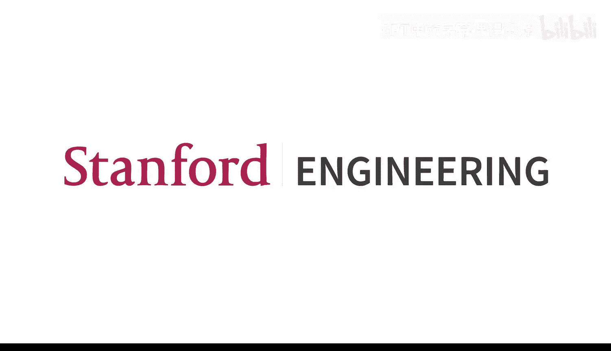
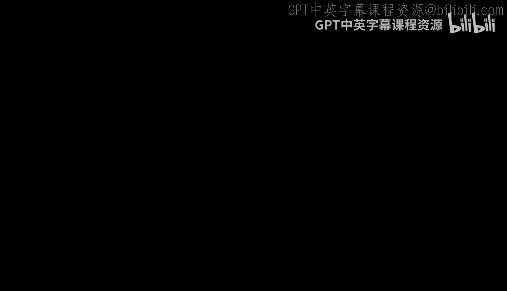
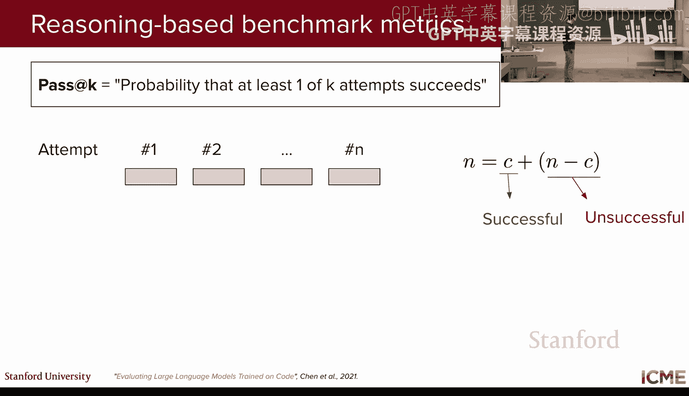
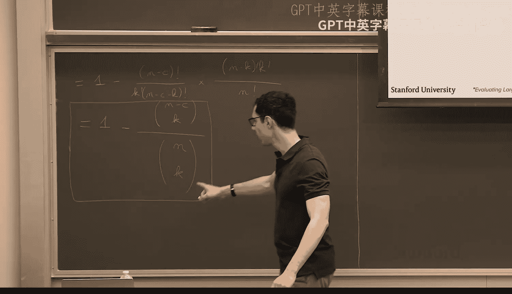
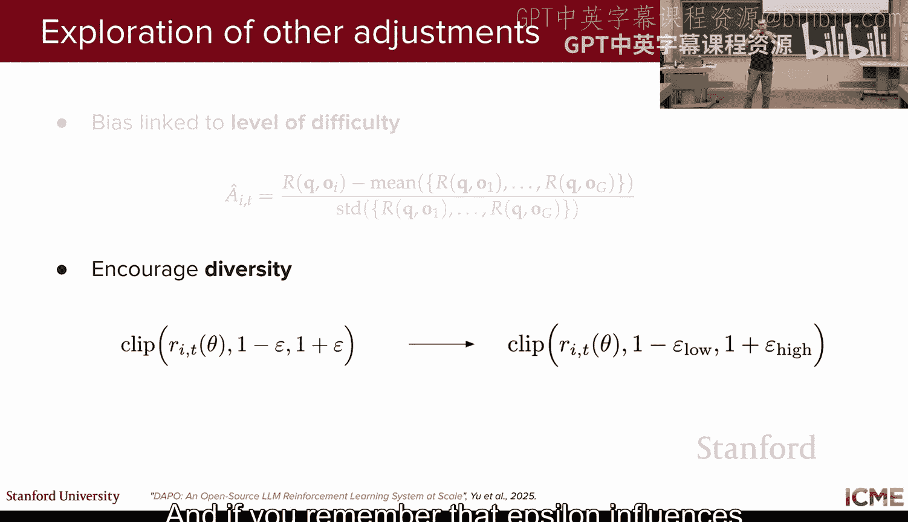
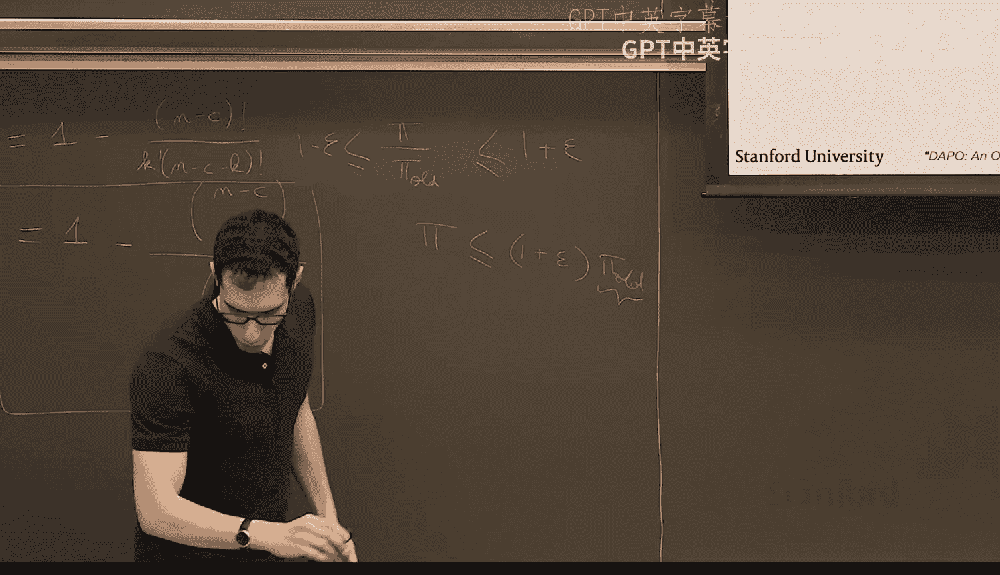
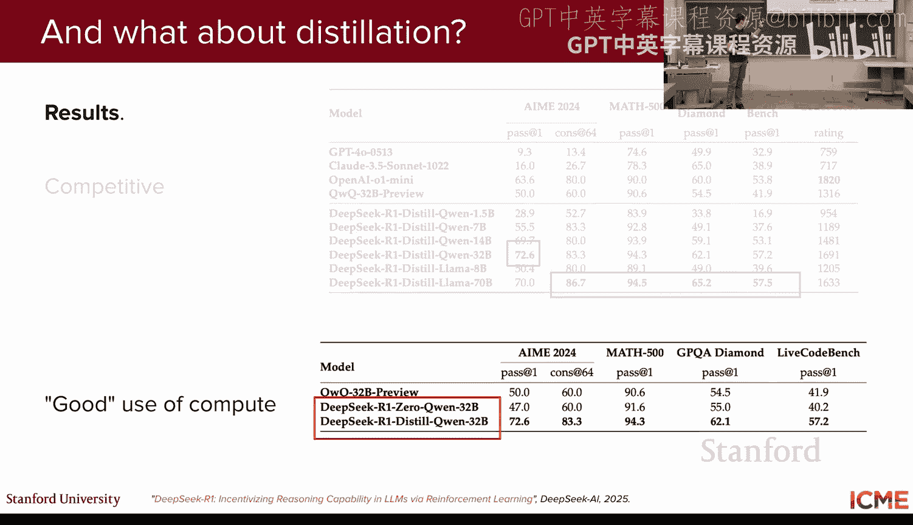
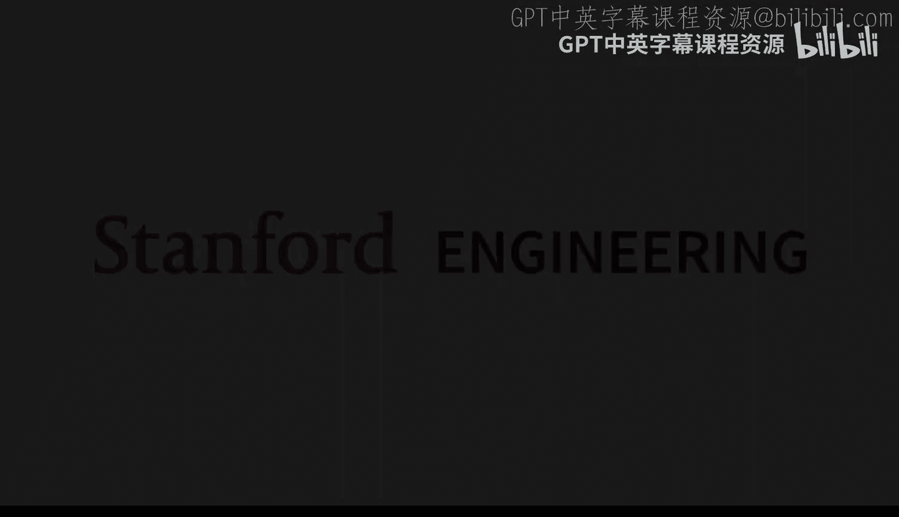

# 6：大语言模型推理

大家好，欢迎来到CME 295课程的第6讲。

今天我们将讨论一个在过去一年左右非常热门的话题：大语言模型的推理能力。这实际上是我们上一讲内容的很好延续，上一讲我们讨论了偏好微调，因为第5讲中使用的许多方法将成为本讲的基础。

在开始之前，我们照例快速回顾一下上一讲的内容。

如果你还记得，第4讲和第5讲都是关于如何训练模型的。在第4讲，我们看到了第一部分，即预训练阶段，这是计算最密集的步骤。我们基本上是在教模型文本和代码的结构，进行大规模的训练。在这个预训练步骤结束时，我们得到一个了解代码和语言的模型，但它只知道如何自动补全序列。

因此，我们还看到了第二步，即微调步骤。我们拿预训练模型，并尝试让它变得有用。我们看到的一个用例是助手，我们尝试调整它，使其能够回答问题。这里涉及准备SFT数据的工作，SFT数据是一个高质量创建的数据集，我们可以用它来教模型如何表现。在这个第二步结束时，我们得到了一个为特定任务（例如回答查询）调整好的模型。

然后，在上次讲座中，我们看到了第三步：偏好微调步骤。这里的目的是使我们的模型与人类偏好保持一致。我们特别看到了RHF，这是一种常用的方法。我们看到它有两个步骤：第一部分是使用人类偏好数据学习区分好坏；第二部分是强化学习阶段，这个阶段今天会很有用。

具体来说，如果你还记得，我们比较了传统强化学习设置和LLM设置。在传统设置中，有一个与环境交互的智能体。它根据所处的状态，遵循一个策略（即动作上的概率分布）采取行动，并因此获得奖励。我们看到，在LLM设置中，我们的“智能体”就是LLM本身。它交互的“环境”只是一组可以预测的标记。给定它到目前为止收到的输入，它可以预测下一个标记是什么（即动作），并使用概率分布（即语言模型预测的结果）来做到这一点。我们看到，我们可以获得每个补全的人类偏好。你有一个提示、一个补全，然后得到这些人类偏好，然后你用它来调整LLM。因为这一步是关于使模型与人类偏好保持一致，而人类偏好被封装在奖励中。

我们看到，强化学习阶段的损失函数由两部分组成。第一部分是优势最大化，我们看到优势是基于奖励的，并且有一些基线来减少梯度的方差。但我们也看到了另一部分：我们不希望我们的模型偏离太多，无论是相对于前一次迭代，还是相对于我们的初始模型（即我们的基础模型，这里是SFT模型）。我们不想改变太多的原因是，我们的模型已经学到了很多，它在所做的事情上已经相当高效，我们只是想让它与人类偏好保持一致，而不是希望模型完全改变。

我认为有点吓人的部分是实际的损失函数。如果你还记得，在RLHF设置中通常使用的主要算法是PPO（近端策略优化）。有一个变体叫做PPO Clip，它会限制从一个迭代到另一个迭代的更新。这里的R实际上不是奖励，而是比率（我知道这个符号很令人困惑），它是当前策略与旧策略之间的比率，旧策略是前一次强化学习迭代的策略。我们有一个剪裁机制，使得比率不能超过某些阈值，这样我们就不想激励模型进行太大的更新。

我们还看到了PPO的另一个变体，叫做PPO KL惩罚。这个变体使用KL散度来惩罚模型改变太多。在原始的PPO论文中，我们使用了模型的“旧”版本（即前一次RL迭代的模型），但在现代RLHF训练中，这个KL散度通常应用于基础模型（即SFT模型）。简而言之，原始PPO论文中引入了这两种PPO变体，但在现代RLHF训练中，我们通常混合使用这两种损失函数。

到目前为止，我们已经看到了我称之为“普通”大语言模型的东西，这些模型接受一些输入（例如提示），然后直接给出一些答案。这些普通语言模型有很多我们可以享受的优势。首先，我们看到这些语言模型非常了解文本和代码的结构。特别是，如果你想调试代码，它们很擅长找出错误所在，也很擅长生成代码。它们还擅长生成文章或诗歌，在这方面非常出色。

但我也想指出一些弱点。我想指出的第一个弱点是，这些普通大语言模型具有“有限的推理能力”。通常，如果你有一些复杂的数学问题，它可能无法真正想出解决方案，因为它可能会在过程中迷失方向。因为到目前为止，我们的模型主要是训练成给定一个提示就做出回应，使用下一个标记预测，所以它没有真正的理由能够解决复杂问题。这是第一个弱点。

第二个弱点是，我们的大语言模型是在海量静态数据上预训练的。这意味着大语言模型获得的知识受限于我们截取和形成预训练数据的截止日期。例如，几天前我们有一次选举，如果我们基于选举前的数据训练大语言模型，然后今天问它“X的当选官员是谁”，它将无法回答，因为它无法访问该日期之后的知识。

第三个弱点是，到目前为止，它只是输出，没有行动。你只是提示你的大语言模型，但如果你想下订单或执行某些操作，你无法做到。

最后一个弱点（顺便说一句，这不是一个详尽的列表）是，与传统NLP模型相比，大语言模型生成自由形式的文本，很难用机器学习社区直到几年前采用的框架来评估它们。例如，如果你熟悉翻译领域，你会使用基于规则的指标，如BLEU或用于摘要的ROUGE来评估输出。但在这里，大语言模型能做的远不止这些，因此很难评估它们。

我想说的是，这只是大语言模型可能具有的所有弱点的一个子集。最后三个弱点将是我们在下一讲和第8讲中要讨论的主题。正如我之前提到的，今天的重点是推理，所以我们将看看如何改进我们的大语言模型的推理方式。

这是一个非常新的主题，所谓新，大概只有一年左右的时间，所以我们将要看到的内容几乎都来自2024年或2025年。我们现在有足够的后见之明来知道哪些部分比其他部分更重要。

今天的目标是了解什么是推理模型，第二个大目标是了解它们是如何训练的。希望在本讲结束时，如果你对这两个问题有很好的答案，那就意味着我们做得很好。

那么，让我们从推理模型开始，它们在哪里？要回答这个问题，我们首先需要定义什么是推理。坏消息是，目前还没有普遍认同的推理定义，所以我将尽力定义它。

在这里，我们将推理定义为解决问题的能力。这里的问题，我们通常更多地考虑数学问题或编码问题。希望这些能力也能扩展到其他领域。为了解决这个问题，我们通常需要一个多步骤的推理过程，有点像你参加考试时，遇到一个不简单的问题，你通常会把它分解成几个步骤，然后逐步完成，最后得出最终答案。所以，我认为推理问题会有这样的模式。

为了说明这一点，让我们确保我们都在想同一件事。一个非推理问题可能是：“斯坦福大学Transformers和LLM课程的课程代码是什么？”这是一个知识性问题，每个人都知道是CME 295。相比之下，一个基于推理的问题可能是一个数学问题，例如：“假设一只熊出生于2020年，那么它在2025年现在多大了？”当然，这超级简单，你可以想象比这难得多的问题，这就属于推理问题。

现在我们对推理有了一点了解，接下来我们将看看如何获得一个能够处理这类提示的模型。这里的核心思想是利用我们在课程早期看到的一个概念。

我不确定是否记得，但在第2或第3讲中，我们看到了一个叫做“思维链”的技术。谁还记得思维链是什么？是的，答案是你分步骤思考，而不是直接给出一个笼统的答案。很好的回答。为了说明这一点，是的。哦，是的，很好的观点。问题是，对于某些问题，你需要一些上下文元素。例如，这里你需要你的大语言模型知道今年，今天是2025年11月7日。是的，很好的观点，所以有两个部分。对于那个具体问题，通常大语言模型有一些我们称为“前言”的东西，告诉你一些上下文，通常日期是我们放在前言中的信息。对于这个非常具体的情况，日期将是LLM已经可以获得的信息。但对于其他一些问题，你可能确实没有信息或上下文。在第7讲中，我们将看到如何附加这些信息，这肯定会非常有用。但就今天而言，我们将更多地将其视为推理模型的扩展，而不是其工作原理的基础。我们将在下一讲回应这部分内容。

我们正要说明思维链是什么样子。正如你提到的，我们想要的不是直接给出一个笼统的答案，而是解释推理过程。思维链通过提供一些明确展示推理过程的上下文学习示例来做到这一点，以鼓励模型在提供答案之前也这样做。这就是思维链背后的想法。我们在这里想做的是，在更大的规模上做到这一点。

我想建立一种直觉，说明为什么这可能对我们有帮助。大语言模型基本上是用下一个标记预测目标训练的。它们回应我们提问的方式通常是听起来合理，以最大化或优化你想要生成的标记发生的概率。如果你向大语言模型提出一个非常难的问题，这个问题出现在训练集中的机会非常小。这里的想法是让大语言模型将问题分解成可处理的部分，然后依靠它在训练期间看到的模式来解决所有这些更易处理的问题。这有点像你或我们当学生时，当我们给你一个问题时，你试图将其与你已知的、在训练时（比如学习时）见过的东西联系起来，以便找到答案。我想这就是直觉。你可以想到的另一个原因是，当你让大语言模型生成更多标记时，你实际上给了它更多的计算资源。因为在每个生成步骤，你都有整个前向传播过程。当你这样做更多次时，你就给了它更多的计算。我们将看到一个术语，叫做“计算预算”，即你希望你的大语言模型生成响应所拥有的预算，我们稍后会看到。是的，所以这也起到了一定作用。

大家都清楚推理模型的总体思路了吗？好的，完美。为了再次确保我们都清楚这一点，到目前为止，我们有所谓的“普通”大语言模型，它们以提示或问题作为输入，并以某些内容作为输出进行响应。在我们的案例中，我们想要的是，给定一个问题作为输入，我们不希望直接生成答案。我们首先想要思考。在这里，我们通过首先输出一个推理链来思考，然后提供答案。所以，这里大语言模型的输出不仅仅是答案，而是推理加上答案。

我说过这个话题在过去一年非常热门和流行，所以这是推理模型时间线的一个小预览。推理本身是一个被研究了一年多的话题，但推理模型大约从OpenAI在2024年9月发布o1 Preview开始出现。之后，基本上所有AI实验室都在尝试看看我们能做些什么来提高模型的推理能力，所以每个人都在研究这个。然后，谷歌在12月发布了Gemini 2.0 Flash Thinking。从2025年开始，1月份发表了DeepSeek R1论文，引起了很大轰动，因为他们能够匹配OpenAI的推理能力性能，并且他们在论文中实际描述了他们的方法。那是2025年1月的重要时刻。之后，所有这些其他模型也增加了推理能力，比如来自XAI、Anthropic的Claude以及其他实验室的模型，还有来自Mistral的模型。这个时间线并不详尽，但只是向你展示这些模型有多新。我想需要记住的一点是，它基本上始于2024年底。

我知道你们很多人，如果不是所有人，每天都在使用大语言模型作为聊天机器人，比如ChatGPT或Gemini。所以我想让你们知道，当你交互的模型是一个推理模型时。我有个问题问你：我前几天和ChatGPT讨论，我在想，它是在使用推理模型吗？如果你盯着截图看，你怎么想？是的，等等。没错，关键词是“思考”。他们把“思考”这个词放在各处。当用户界面向你展示思考过程时，他们实际上并不展示完整的推理过程，我们将会看到原因。但他们告诉你他们花时间思考。那个思考时间实际上是产生推理链所需的时间。例如，对于ChatGPT，你可以将思考从标准更改为扩展等，其他模型也有这个功能。特别是，你看到的“思考摘要”不是原始的推理链，而是它的摘要。他们这样做的原因，我推测，一是因为原始链可能从人类的角度来看不完全可理解；二是因为也许你作为用户，不想阅读成页成页的内容；第三，如果我们有推理链，我们可以训练一个模型来模仿这些能力，这可能是他们通常不展示原始链的原因。

在定价方面，我们看到推理模型的输出不仅是答案，还包括推理本身。所以你会看到，在这些API中，你实际上需要为此付费。你不一定能获得所有推理链，但如果你查看文档，总会有一两句话说明你实际上是为输出标记付费，而那些输出标记也包括推理标记。我认为这也是需要知道的好事。从用户的角度来看，这也激励了人们以最少的推理标记获得最大的推理能力，因为你不想支付太多。我们稍后会看到如何处理这个问题，但这只是需要注意的一点。

我们讨论了什么是推理，或者至少是一个尝试性的定义。我们看到了推理模型背后的核心思想。现在我们将讨论人们用来量化推理能力的一些基准。

第一个基准，正如我之前提到的，是关于评估编码能力的。这里的目通常是解决编码问题或修复错误。你通常有以下设置：给定一个问题，你想产生一个能够通过测试用例的解决方案。如果你有一个通过所有测试用例的解决方案，那么你就有一个有效的解决方案。这是我们验证生成的响应是否正确的方法。这是针对编码的。

为了让你了解现有的基准类型，我们有HumanEval（这里的截图），我相信这是一组大约10个由人类编写的编码问题，所以它被称为HumanEval。然后还有Codeforces，它来自一个竞争性编程网站，你们有些人可能知道。还有SWE-bench，我相信这是一组源自GitHub问题的问题，所以这些都是实际的问题。你会看到，在这些报告中，这些推理模型通常都有沿着这些基准的结果。这是针对编码的。

对于数学，目标是解决问题。它的工作方式是：给定一个问题，你想要答案，当然你让你的模型生成一些推理。为了验证你的解决方案是否有效，你需要解析答案，然后将其与一些基本事实进行比较。这样我们才能真正知道你的模型产生的答案是否正确。你可能会问我，如何解析？你可以在提示中强制你的模型以可解析的方式输出答案，有时人们把它放在一些方括号里，所以有很多不同的方法可以做到这一点。问题看起来像这样：你有一个问题，然后让你的模型生成一个推理链和答案，然后你可以将这里的答案与基本事实进行比较。

我想补充一点，现有的基准通常基于实际上并不简单的问题。你会经常看到一个名字是AIME（美国数学邀请赛），它是美国数学奥林匹克竞赛的资格赛。有很多模型基于此量化它们的性能。还有GSM8K，这是一个小学数学问题。现在你的问题可能是：很好，我们有所有这些基准，但用什么指标来量化你所做的是好是坏呢？有一个你会经常看到的指标，我们现在就来看看，因为它并不那么明显。

这个指标叫做“Pass@K”。Pass@K的定义是一个试图估计在K次尝试中至少有一次成功的概率的指标。这里我们说的是，假设我们有一个编码问题，我们告诉我们的模型生成K个答案。Pass@K是这K个答案中至少有一个通过的概率。这有意义吗？顺便问一下，为什么Pass@K有意义？这并不超级简单，你可能有一些用例，你可以负担得起花更多时间来生成更多答案，如果你知道你有更多机会得到正确答案，那么你可以花更多时间生成更多答案，以便得到正确的那个。在像编码这样的问题中，好处是你可以检查你的答案是否正确。这里的想法是，如果你处于可以负担得起生成不止一个答案，而是多个答案的情况下，那么如果这意味着在其中一次尝试中得到正确答案的概率更高，那么花更多时间、更多计算来生成更多答案可能是值得的。我们上次讲座看到的一种技术，你们可能熟悉，叫做“Best of N”，还记得吗？是的，大致上，Best of N是我们上周看到的方法，你生成N个答案，使用你的奖励模型对所有答案进行评分，然后取其中最好的一个。这里你可以把它看作是类似的，只是我们没有奖励模型，我们有一种确定性的、可验证的方式来检查某些东西是否正确。所以它非常相似。

现在我们将花几分钟时间来调整我们对如何估计这样一个量的理解。这是一个很好的问题，问题是：你选择一个特定的温度吗？我有一张关于这个的幻灯片，所以我先保留你的问题。顺便说一下，如果有任何其他问题，我很乐意回答。还有其他问题吗？大家都清楚了，好的，酷。我们在这里想做的是估计这个概率。但你可能会告诉我，只需生成K次尝试，然后计算正确的尝试次数来估计。但问题是，如果你只做这K次，你的估计可能非常嘈杂，因为纯粹偶然，你可能有一个实例有，比如，五次中三次正确，另一个实例一次正确，所以你希望有一个方差没那么大的估计。你通常做的是生成不是K个，而是N个答案。在这N个答案中，你将会有C个成功，N-C个不成功。你在这里问自己的问题是：在这N次尝试中，你想量化从这N次尝试中选择K次，其中至少有一次正确的概率。所以问题是，如果你有这些N个观察结果，如果你要选择K个，那么这K个中至少有一个通过的概率是多少？这就是问题。

我们时间有点紧，我现在就来推导一下。我想这样做的原因是答案不一定简单，我不希望你在不知道它从哪里来的情况下对它看起来的样子感到太惊讶。我们将推导这个概率，我们想推导从这N个样本中选择K次尝试，其中至少一次尝试正确的概率。为了做到这一点，我将把它写下来。Pass@K，我们想要它的估计值。所以它将是至少一次尝试正确的概率。如果你学过一些概率，有一个非常常见的技巧，就是如果你有“至少一个”的概率，它是1减去“所有都不正确”的概率。你们都知道这个技巧吗？好的，我们将使用这个技巧，所以它将是1减去所有K次尝试都不正确的概率。好的，现在我们将尝试量化这个概率。

你在这N次中找到一次不成功尝试的概率是多少？你有N-C次不成功，你有N个观察结果。它将是(N - C) / N。这是你的第一次不成功尝试。现在，在已知第一次的情况下，你找到另一次不成功尝试的概率是多少？你有N - C - 1次其他不成功尝试，除以N - 1，因为你已经取走了一个。你继续这样做K次：(N - C - K + 1) / (N - K + 1)。大家都同意吗？这里我们量化的是，如果我们从这N个中随机抽取K个样本，所有K个都不正确的概率。我们通过计算第一次尝试不正确的概率，然后第二次尝试不正确（已知第一次不正确）的概率等等来计算这个，我们得到了这个公式。如果你在概率课上学过，这基本上就是无放回抽样。

现在，这样做的好处是，你可以用一个漂亮的数学符号来表达它。对于知道的人来说，n选k等于n! / (k! * (n - k)!)。这是这个量的定义，我们将在这里使用它。这里我们有一系列乘积，所以我们可以用阶乘除以另一个阶乘来表达它。这里是(N - C)! / (N - C - K)!，然后这个量，我们也可以用阶乘来表达。它是N!，分子是(N - K)!。大家都同意这里的数学吗？我认为是的。然后我们将以某种方式简化上面的表达式，它等于1减去... 所以 (N - C)! / (N - C - K)!，然后是K!，然后这里我们要说，这个，K!，除以N!。这里我玩了个把戏。我基本上是将分子和分母都乘以了K!。所以我有1减去... 所以，这是 (N - C) 选 K 除以 N 选 K。这就是我们对Pass@K的估计。