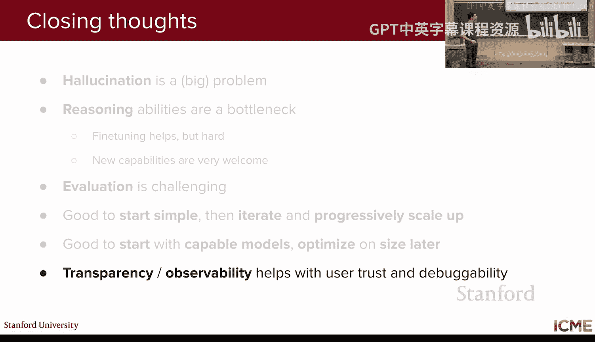

# 7：智能体式大语言模型 🧠

在本节课中，我们将学习如何让大语言模型与外部世界和其他系统进行交互。到目前为止，我们的大语言模型都是独立运行的，我们训练了它，也看到了它如何解决数学和编程问题。现在，我们希望将大语言模型置于其他系统的上下文中使用。因此，今天的课程将重点介绍你可能听说过的检索增强生成、工具调用和智能体。

## 课程回顾

上一讲我们聚焦于推理模型，并看到了推理模型与我们所称的“普通”大语言模型之间的区别。具体来说，在上一讲之前，我们看到的是将提示词输入大语言模型，它直接给出响应。但上一讲我们看到，如果让大语言模型在输出响应之前先进行推理，那么在数学和编程等推理任务上，我们可以获得更好的性能。特别是，推理模型所做的是将提示词作为输入，输出则同时包含一个推理链（通常对用户隐藏）和一个响应。我们看到了如何训练一个模型更像推理模型，并介绍了一个核心的强化学习算法——GRPO。我们观察到，随着强化学习的进行，模型在这些推理任务上的性能有所提升，但同时也注意到模型输出的响应越来越长，存在“长度偏差”现象，并探讨了一些缓解策略。

## 引言：大语言模型的局限与机遇

在开始推理课程之前，我们列举了普通大语言模型的优势和劣势。上一讲我们专注于如何改进普通大语言模型有限的推理能力。在本讲中，我们将做两件事：第一，看看如何将我们的大语言模型连接到不断发展的知识库，特别是如何获取最新信息；第二，看看我们的大语言模型如何帮助我们执行操作，我们将通过工具调用和智能体工作流来了解这一点。

## 第一部分：检索增强生成

首先，让我们从一种你可能听说过的方法——检索增强生成开始。

### 知识更新的挑战

假设你有一个训练好的模型，但问题是，你训练模型所用的预训练数据截止于，比如说，一个月前。现在，假设你想提示你的模型关于几周前发生的选举获胜者。你的模型将无法回答你，或者会输出错误的答案。因为到目前为止，我们的大语言模型没有任何链接到外部来源，它只依赖于训练期间获得的知识。因此，它给出的响应将仅基于截止日期（本例中是一个月前）之前训练的数据。我们面临一个很大的限制：大语言模型只知道它训练过的东西。所有模型都有“知识截止日期”。

你可能会问，为什么不直接在之后的数据上继续训练模型呢？这样做有几个问题：第一，在不引起性能倒退和其他问题的情况下改变大语言模型的知识非常棘手，人们通常尽量避免这样做；第二，这不切实际，因为你可能有需要微调此模型的用例。如果你有多个用例，就需要为所有用例更新权重，这会增加大量开销和维护成本。因此，人们通常更倾向于不通过额外训练来注入知识。

### 简单方法的局限性

一个想法可能是：在提示词中直接添加截止日期之后发生的所有事情，作为模型了解情况的途径。这种简单方法的问题是，上下文长度是有限的。模型通常有数十万token的上下文长度，这大约相当于数百页书的内容，虽然不小，但不足以让我们走这条非常简单的路线。即使上下文长度不受限，人们也注意到，如果向大语言模型输入大量不相关信息，其性能实际上会下降。人们进行了“大海捞针”测试，发现提示词的长度和放置事实的位置都很重要。即使上下文长度无限，我们仍然会遇到问题。此外，调用大语言模型是按token付费的，输入提示词越大，费用越高。因此，从成本角度考虑，你也有动机不在提示词中放入太多内容。

### RAG的核心思想

基于所有这些原因，我们需要一种更聪明的方法：不是将所有新信息一次性放入提示词，而是只找到相关信息并将其放入提示词。这就是检索增强生成背后的思想。RAG代表“检索增强生成”，其核心思想是用相关信息来增强提示词。这种方法的核心部分在于如何只将相关部分放入提示词。

从高层次看，你有一个问题作为输入，想法是获取正确或相关的信息片段，然后增强提示词以输出答案。

### RAG的三个主要步骤

我们强调一下RAG的三个主要步骤：
1.  **检索相关文档**：根据你的提示词，检索可能有助于回答的相关信息片段。你可以将提示词视为一个实体，并拥有一个知识库空间，其中存放所有文档。这一步是检索。
2.  **增强提示词**：一旦获取了相关信息，就将其放入你的提示词中，然后提出问题。例如，在本地选举的例子中，提示词变为：“这次选举的获胜者是谁？顺便说一下，这次选举于某时某地举行，获胜者是某某某。”换句话说，我们在提示词中给出了答案。
3.  **生成响应**：将增强后的提示词输入大语言模型以生成响应。

检索阶段非常重要，我们将重点讨论如何确保这一部分表现良好。

### 构建知识库

为了形成我们的知识库，我们通常收集可能有用的文档集。完成后，我们将它们分成所谓的“块”。一个块可以看作是文档的一个子集，具有给定的最大长度（以token数衡量，通常在数百个token的量级）。这里的核心概念是嵌入。我们计算每个块对应的嵌入向量。

创建知识库时，有几个超参数需要调整：
*   **嵌入大小**：通常，如果文档更复杂、更微妙，你会想要更大的尺寸。但更大的尺寸会占用更多空间，推理时计算量也更大。这是一个权衡。典型的嵌入大小在几百到一千左右。
*   **块大小**：块的大小。你不希望它太小，否则文本可能脱离上下文；也不希望它太大，否则嵌入可能无法有意义地表示内部内容。这又是一个权衡。人们通常选择大约500个token的块大小。
*   **块重叠**：块之间希望有多少重叠。在非常简单的划分中，所有块都是独立的，没有重叠。但通常，前一个块中的某些部分对于理解当前块是相关的，因此我们希望有一些重叠。人们通常也会设置这个参数，通常在几十到几百个token。

### 检索的两阶段方法

现在的问题是，给定一个提示词，如何检索相关文档？答案是我们通常分两步进行。这与推荐系统或搜索中的方法非常相似。
1.  **候选检索**：目标是从许多块中筛选出数量少得多的潜在相关候选集。在这个阶段，我们试图最大化召回率，进行粗略操作，以获取尽可能多的潜在相关候选。
2.  **重排序**：这个阶段有时是可选的，目的是确保排名靠前的文档确实是相关的。基于潜在相关文档列表，对它们进行排序，使真正相关的文档排在前面。在这个阶段，我们可以使用计算量稍大的模型或方法，因为我们需要排序的候选集要小得多。

### 候选检索：语义相似性搜索

在候选检索阶段，我们希望在庞大的知识库中筛选出，比如说，大约100个潜在相关候选。我们将利用在知识库初始化期间计算的嵌入向量，通过语义相似性搜索来获取潜在相关候选。

我们通过嵌入向量来表示查询和块，然后执行相似性操作（通常是余弦相似度）来获得相似性分数，并保留排名靠前的若干个。

这里有一些复杂性，因为知识库可能非常庞大。因此，人们通常使用所谓的“近似最近邻”方法。在构建知识库时，以某种方式对嵌入向量进行分区，以避免进行简单的线性搜索。

这种架构通常被称为“双编码器”，指的是我们通过一个编码器传递查询，再通过一个编码器传递块，两者是独立的，然后比较嵌入向量。通常，你会使用像BERT这样的模型来编码这些文档。

### 混合检索：结合关键词匹配

语义相似性意味着查找具有相同含义或相关的实体。但我们计算这些嵌入向量时，并不强制任何类型的关键词匹配。以这种方式检索文档时，匹配的文档可能没有任何共同词汇，但含义相同。有时，你需要确保搜索的内容完全包含提示词中的关键词。在这种情况下，你可能需要第二种方法。

你可能会看到BM25，它是一个基于查询和文档之间重叠程度的启发式评分函数。这对于你绝对希望文档包含查询关键词的情况非常方便。如今，人们会根据用例考虑是否在相关性评分中加入一些启发式方法。有些人采用嵌入搜索和启发式搜索的混合组合，例如结合嵌入向量和BM25，根据你的用例，可能会得到更相关的文档。

### 处理查询与文档的差异

另一个问题是，当人们想向大语言模型提问时，输入的查询与知识库中的内容性质不同。你的查询通常较短，可能是一个问题，而文档中的内容通常较长，是句子和段落。如果你使用相同的编码器来嵌入查询和文档，这两种嵌入向量并不完全可比，因为一个是针对问题，另一个是针对文档。

有一种扩展尝试缓解这个问题，它被称为“HyDE”。它的做法是：不是计算与提示词相关的嵌入向量，而是首先生成一个基于该提示词的“伪文档”，然后嵌入那个伪文档以查找相关块。这可能有效，也可能无效，并非所有人都使用。另一种方法可以是使用专门训练的编码器来分别编码查询和文档。人们通常不这样做是出于维护目的，但这也可以是另一种解决方案。

### 处理块脱离上下文的问题

关于如何使脱离上下文的块有意义的问题，这里的想法是预先添加一些文本，总结你需要知道的内容以便理解该块。具体做法是：你有一个文档，将其分成n个块。不是单独考虑这些块，而是为每个块计算基于整个文档的相关上下文。通常，你可以通过大语言模型调用来实现：提供整个文档和你想上下文化的块，然后要求模型提供一个简短的总结性上下文以使该块有意义。

你可能会说，这需要很多大语言模型调用，可能非常昂贵。有一种策略可以降低成本，称为“提示词缓存”。由于大语言模型是仅解码器架构，如果你对所有提示词使用相同的前缀，那么计算将是相同的。这里的想法是你只计算一次，保存所有相关的激活值，然后在需要时进行查找，而不是重新计算。一些闭源模型或服务提供商会提供提示词缓存选项，并使其更便宜。因此，在构建提示词时，尽量将所有可能在不同提示词间重复的内容放在开头，以便利用这种成本优势。

### 重排序阶段

到目前为止，我们已经看到了如何从数千甚至数百万个块中筛选出数百个潜在相关块。现在我们想以更有意义的方式对它们进行排序。第二阶段（重排序）更为可选，因为有时我们做的第一次筛选可能已经足够好。但这一步是为了更有意识地给出最终分数，以便真正选择出最终的top K个块。

第二阶段称为“排序”或“重排序”。我们不再使用计算嵌入向量之间相似性的快速操作，而是使用可能更复杂的方法。我们不是分别考虑查询和块，而是将两者一起输入编码器，并从中获得相关性分数。这样做可能更有意义，因为你有一个模型同时查看你的查询和块并给出分数。而在第一步中，你有一个查询的嵌入向量和一个块的嵌入向量，它们没有模型可以捕捉的那种交互。这种设置被称为“交叉编码器”设置，因为你的两个输入都被馈送到编码器中，存在交叉交互。

你对所有潜在相关块执行此操作，为每个块计算与提示词的分数，最终获得排名。现在的问题是，你对这个排名满意吗？为了回答这个问题，你需要一种量化性能的方法。

### 评估指标

接下来，我们将看看通常用于评估的指标。这与搜索或推荐系统中的指标非常相似。

假设你有一堆块，经过第一和第二步后，最终会有K个块排在顶部，你将其视为相关。你想将其与实际上相关的块进行比较。你可以将其视为二分类问题，有相关和不相关两类，你预测了一些相关的，想知道你做得如何。但在排序中，你需要以某种方式纳入你如何将内容排在较高位置的信息。

假设你按重要性从高到低对这些n个块进行了排序。因为你通常只关心前K个，在RAG设置中，你通常检索前K个相关的并将其放入提示词。

第一个你可能使用的指标是NDCG。它试图通过考虑你将相关文档排在何处来量化你的排序有多好。它激励你将相关文档排在更靠前的位置。NDCG是归一化折损累积增益，它将DCG除以理想的DCG进行归一化，目的是使分数有意义，如果你匹配了最优排序，则得分为1。

另一个更简单的指标是平均倒数排名。它取所有相关文档中最高排名的倒数。它不关心第一个相关文档之后的任何相关文档。这是一个更简单的指标，通常相关性很好，所以人们使用它。

当然，还有经典的分类指标：召回率和精确率。在排序中，召回率@K是：在所有实际相关的文档中，有多少被你预测为相关（即在前K名中）。精确率@K是：在你预测为相关的所有文档中（即你选择的前K名中），有多少是实际相关的。

这四个指标——NDCG、MRR、精确率@K、召回率@K——你会在一系列论文中看到。建议你熟悉它们的思想和公式。你可以使用这些指标来量化你的检索器是否表现良好。有一些基准测试，例如“大规模文本嵌入基准”，你可以用来测试你的检索器。

## 第二部分：工具调用与智能体

现在，我们进入我最喜欢的部分：工具调用和智能体世界。我们将看到大语言模型将变得多么强大。

### 从非结构化到结构化数据

Afsheen刚才提到的是如何处理将非结构化数据作为提示词的一部分注入大语言模型。现在，我们将看看，如果我们想要注入的数据是结构化的，我们可以做些什么。在RAG中，你有包含单词和句子的文档，你只想获取相关文档来回答你的提示词。但在这里，假设你的数据中有一些决定输入输出的结构。通常，你可以将其表示为表格，有单独的列，然后根据给定列的值，你有给定的输出。

我们可以将这种设置重新表述为一个函数。我们提到了工具调用，这种重新表述被称为函数调用。假设你通过一个函数获得了输入和输出之间的关系。在工具调用和函数调用的世界中，你经常会看到大语言模型倾向于使用Python作为语言，仅仅因为它易于阅读。我们将以此为例，但没有什么将我们必然绑定到Python。

### 工具调用的定义

工具调用允许自主系统通过动态访问外部资源来完成复杂任务。从这个定义中，你需要理解两点：第一，完成任务的概念；第二，可能依赖外部资源。它不一定非要依赖外部资源，但这是一个潜在的属性，可以帮助你填补Afsheen在讲座开头提到的关于预训练大语言模型知识缺口的问题。

### 工具调用示例：寻找泰迪熊

为了让这些陈述更贴近现实应用，让我们看一个具体例子。假设你喜欢泰迪熊，你现在在斯坦福大学，想要一个附近的泰迪熊。如果你拿出手机问：“在我附近找一个泰迪熊。”你当前没有工具的大语言模型不会知道泰迪熊的实时可用性，它可能会回答“我不知道”或“不确定”。但通过使用工具，我们可以看到如何达到一个阶段，注入必要的信息，使大语言模型知道如何响应你的查询。

接下来几分钟的目标是弄清楚我们可以做什么，比如我们可以在大语言模型的前言中注入什么，以及为了完成这样的请求，我们可以采取哪些步骤。

### 函数定义与调用过程

为了贴近现实，我们举一个函数定义的完整例子。在寻找泰迪熊的情况下，你可以想象一个名为`find_teddy_bear`的函数定义，它根据你的位置调用某个API并检索潜在的候选。

当我们想向模型展示这样的API时，你需要记录其输入和输出，以便模型知道这个函数的用途。通常，Python中函数下的描述对于模型了解其用途至关重要。然后，我们需要进行后端调用，这正是寻找附近泰迪熊所需要的，你需要查询某个API来检索可用的泰迪熊，并根据你的位置返回最近的。当它返回结构化的内容时，你有一些类定义将结构放入输出中，使其可解释。我们将很快看到，这个输出将是模型用来给出最终响应的依据。

所有这些实现细节都在你的代码库中，但大语言模型不会看到它。

### 工具调用的三个阶段

现在，让我们逐步了解如何使其工作。
1.  **第一阶段**：当你提出与你的函数相关的问题时，你会在前言的开头插入函数API（没有其实现）。你希望大语言模型基于用户查询为你的函数提供正确的参数。大语言模型的目标不是推断任何函数的实现，而是只推断我们应该为其提供什么参数。
2.  **第二阶段**：实际进行函数调用，这与大语言模型无关。你只需获取函数和参数并执行它。你会得到一些答案，答案以可理解的方式结构化。
3.  **第三阶段**：将该响应反馈给大语言模型以获得最终响应。当你要求大语言模型回答问题时，你不想要JSON格式的响应，而是自然语言的响应，这正是最后阶段的动机。

### 训练模型使用工具

现在的问题是，如何训练大语言模型使用这个工具？如果你要训练一个大语言模型来使用这个工具，你需要关注哪些步骤？答案是，你需要进行监督微调。

第一个大语言模型调用需要以某种方式识别函数实现和查询的模式，并将其链接到你要放入函数的参数。所以，是的，工具预测。你还需要第二组SFT配对吗？你有最后一个仍然由大语言模型驱动的阶段，你有工具答案，需要输出最终响应。你可能会说，大语言模型已经看到了大量结构化数据，并且知道如何将其转化为文字，这是一个合理的观点。但通常，你可能希望响应以特定方式格式化，因此你可能还需要进行这种映射的SFT配对。这就是为什么你通常有这两个SFT配对。更精确地说，第二个配对不仅仅是映射JSON响应到最终响应，它实际上是链接到目前为止的所有对话历史，以便它知道初始查询是有人在寻找泰迪熊，它知道已经进行了工具调用，并且知道结果对应于该工具调用。因此，在这个SFT配对中，输入会稍长一些。

如果你有更多工具，是否需要工具选择或更多示例？这是一个很好的话题，我们将在几页幻灯片后讨论。这是一种稍微复杂的方式，但如果你走SFT路线，你可以在SFT数据集中展示多种输入。

### 替代训练方法：提示工程与推理

但这不是训练模型这样做的唯一方法。如今，大语言模型在推理方面变得越来越强大，它们在预训练和初始指令微调中训练的数据类型通常是这类代码数据。因此，在最后，它们非常了解如何操作Python代码。你可能会问，是否真的需要教模型如何将查询映射到函数调用？这是一个非常有趣的观察，你会发现如今你可以放弃特定的SFT训练，而尝试仅通过提示工程来解决。

这里，我们不用编写SFT然后重新训练模型，我们将看到你实际上可以仅用一个解释来替代它。如何提出这样的解释呢？一种方法可以是少样本学习，你只需在上下文窗口中展示输入输出的样本。这是一个很好的观点，你绝对可以这样做，这通常是一种公认的做法。但如果我告诉你，少样本学习在泛化方面存在挑战，因为你需要给出具体的点作为输入输出，它可能适用于某些情况，但不一定能泛化到整个人类语言的范畴，是否有其他方法可以解决？答案是要求模型进行推理。编写一个以有意义的方式进行推理的提示词非常困难。在实践中，你不会自己写。你可以将这些SFT配对（你想要强制执行的行为）用作某种评估集。你可以运行你目前拥有的解释，针对评估集评估这些提示词，然后获得一些成功和失败，也许“在巴黎找一只熊”效果不好，其他提示词有效，所以你有一个每个样本带有分数的列表。然后你可以将其反馈给一个推理模型，通常，让它为你编写解释。这是一个