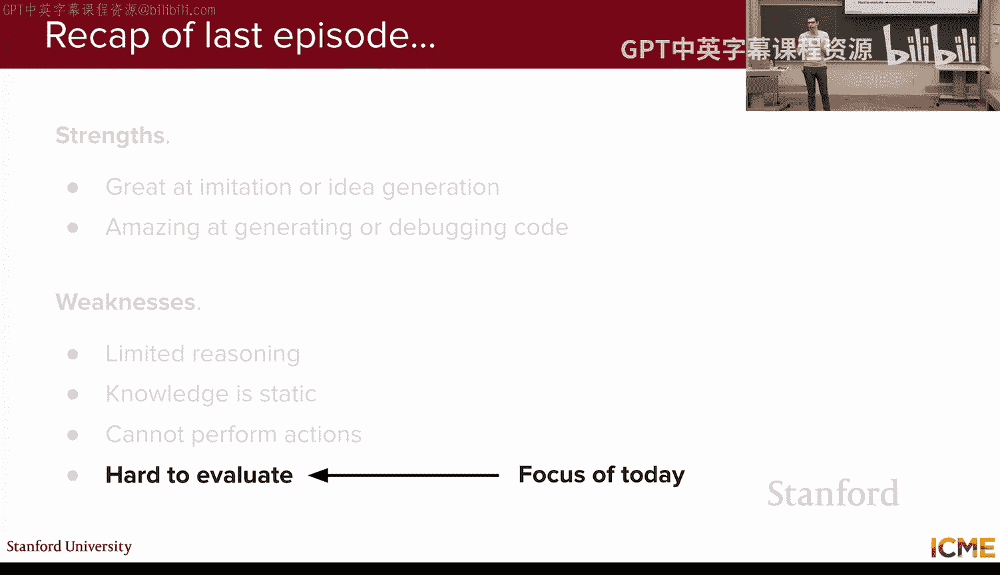
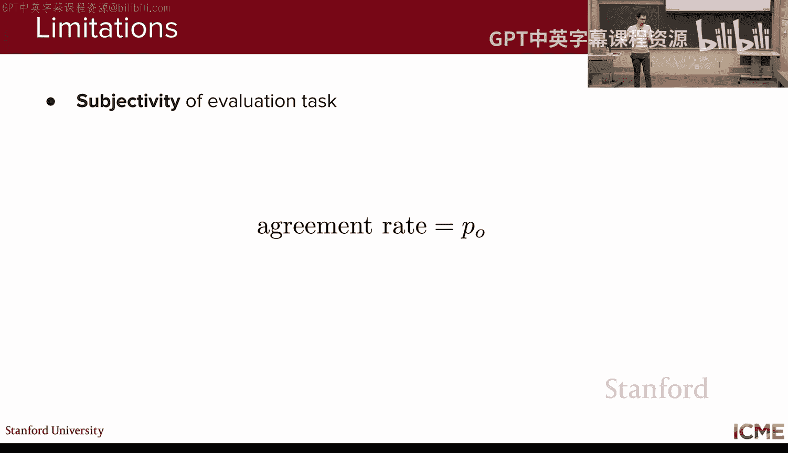
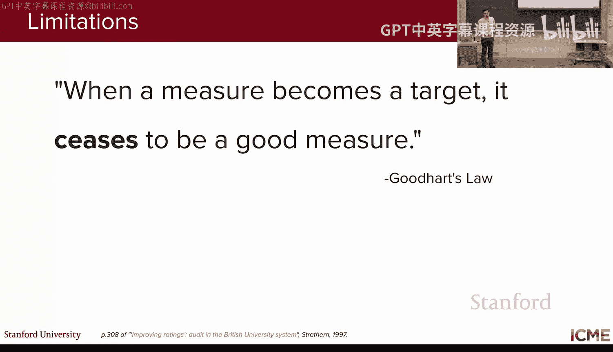

# 8：大语言模型评估 🧪

## 概述

在本节课中，我们将要学习如何评估大语言模型的性能。评估是模型开发中至关重要的一环，它帮助我们量化模型在各种情况下的表现，从而明确改进方向。我们将从理想的人工评估场景出发，探讨其局限性，然后介绍基于规则的自动评估方法，并重点讲解当前主流的“LLM即评委”技术。最后，我们将了解评估大语言模型时常用的各类基准测试。

## 课程回顾

上一节我们介绍了大语言模型如何与外部系统交互。我们看到了一个核心技术——检索增强生成，它允许LLM从外部知识库获取信息。我们还学习了如何改进检索系统，它通常包含候选检索和重排序两个主要步骤。此外，我们探讨了工具调用功能，即模型根据输入查询决定调用哪个工具及使用哪些参数。最后，我们了解了智能体工作流，它通常是RAG和工具调用的结合，例如在AI辅助编程中的应用。

## 评估的定义与挑战

首先，我们需要明确本讲座中“评估”一词的含义。当我们说“评估我的LLM”时，可能指代多种含义：评估输出性能、连贯性、事实准确性，或者评估延迟、定价、系统可用性等系统相关指标。本讲座将主要聚焦于**输出质量**的评估，特别是如何量化模型响应的好坏。

这是一个具有挑战性的问题，因为LLM是文本到文本模型，可以输出任何内容，如自然语言、代码、数学推理等。因此，很难找到通用的评估指标。接下来，我们将看看实践中是如何解决这个问题的。

## 人工评估：理想与局限

考虑到LLM生成的是自由形式的输出，评估其输出的理想场景是每次都由人类来为响应评分。然而，这种方法成本高昂且耗时。此外，即使是人类判断也可能存在模糊性，因为评分任务本身可能是主观的。

例如，对于“我应该买什么生日礼物？”这个问题，如果LLM回答“泰迪熊几乎总是一个贴心的礼物，选一个你觉得合适的就行。”，不同评分者对其“有用性”的判断可能不同。这引出了**评分者间一致性**的概念。我们需要确保评分指南足够清晰，以便所有人能以一致的方式评分。

为了量化这种一致性，人们提出了各种指标。一个简单的想法是计算“一致率”，即两位评分者给出相同评分的比例。然而，即使评分者随机评分，也可能产生一定比例的一致率。因此，人们引入了如**科恩卡帕系数**等指标，将观察到的同意率与随机情况下的同意率进行比较，从而得到更可靠的度量。

尽管我们可以通过一致性指标来量化和改善人工评估的主观性问题，但其**速度慢**和**成本高**的根本限制依然存在。因此，让人类为每个LLM输出评分并不现实。

## 基于规则的自动评估

为了克服人工评估的局限性，我们可以采用基于规则的自动评估方法。在这种设置下，我们不再要求人类为每个输出评分，而是让他们为一组固定的提示编写**参考答案**。然后，我们使用某种指标来比较LLM的输出与这些固定参考。

理想情况下，这些指标应能灵活反映LLM的性能，因为自然语言的表达方式可以多种多样。以下是几种常见的基于规则的评估指标：

*   **METEOR**：用于评估翻译的指标，全称是“具有显式排序的翻译评估指标”。它通过计算F值并惩罚词序错误来评估翻译质量。其公式为：`METEOR = F_score * (1 - Penalty)`。其中，F值是精确率和召回率的调和平均，惩罚项用于鼓励与参考译文相同的词序。
*   **BLEU**：双语评估替补，是一种侧重于精确度的指标。它查看预测中匹配的n-gram数量，并包含一个“简洁惩罚”项，以防止模型通过输出过短的翻译来“刷分”。
*   **ROUGE**：通常用于摘要任务，同样基于n-gram匹配。

这些基于规则的指标存在两个主要限制：
1.  **不允许风格变化**：它们严格比较输出与参考，对于语义相同但表述不同的文本，评分会很差。
2.  **与人类评分的相关性不高**：尽管通过调整超参数试图与人类评分对齐，但相关性并不理想。

## LLM即评委

鉴于上述方法的局限性，我们引入本节课的核心方法：**LLM即评委**。大语言模型经过海量数据预训练，并以匹配人类偏好为目标进行微调，因此它们包含了人类知识和偏好指示。这个想法是，将我们模型的响应作为**另一个LLM的输入**，由这个“评委”LLM来进行评分。

典型的输入包括：用于生成响应的提示、模型响应本身以及评估标准。LLM评委会输出两项内容：一个**分数**（例如二进制的是/否）和一个**评分理由**。评分理由是这种方法的关键优势，它使得评估结果具有可解释性。

一个技巧是要求模型**先输出理由，再输出分数**。这与我们在第六讲中看到的思维链推理模型思路一致，即让模型在给出最终答案前，先外化其推理过程，这有助于提高评分质量。

为了保证输出格式的稳定性（即确保总能解析出理由和分数），我们可以使用**结构化输出**技术。这本质上是我们第三讲中提到的**约束解码**，它通过限制模型只能从“有效令牌”中采样，来保证输出符合预定义的结构（如JSON格式）。各大模型提供商（如OpenAI、Gemini、Anthropic）都支持类似功能。

LLM即评委有两个主要优点：
1.  **无需参考答案或人工评分即可启动**：因为LLM本身已从预训练中获得了大量知识和人类偏好信息。
2.  **评分可解释**：通过输出的评分理由，我们可以理解分数背后的原因。

LLM评委主要有两种评估设置：
1.  **单输出评估**：给定一个响应，判断其好坏。
2.  **成对比较**：给定两个响应，判断哪个更好。这种设置对于生成用于训练奖励模型的偏好数据非常有用。

## LLM评委的潜在偏差及缓解措施

使用LLM作为评委时，需要注意几种潜在的偏差：

*   **位置偏差**：模型可能仅仅因为某个响应被首先提及而倾向于选择它。
    *   **缓解措施**：交换响应顺序多次提问，并采用多数投票。
*   **冗长偏差**：模型可能倾向于偏好更冗长、更详细的响应，而非更简洁但正确的响应。
    *   **缓解措施**：在评估指南中明确说明不应仅根据长度评分；提供上下文学习示例；或在点评估中引入对输出长度的惩罚。
*   **自我增强偏差**：模型在评估自身生成的输出时，可能倾向于给予更高评价。
    *   **缓解措施**：尽量避免使用同一个模型既用于生成又用于评估。通常，评估会使用一个能力更强、推理能力更佳的模型。

## 最佳实践

以下是使用LLM即评委时的一些最佳实践：

1.  **提供清晰明确的评估指南**：详细说明期望和不期望的内容。
2.  **使用二元评分标准**：如“通过/失败”。这简化了评委的任务，也更容易与人类评分对齐。
3.  **要求先输出理由，再输出分数**：这能提升评委的推理质量。
4.  **注意并缓解上述偏差**。
5.  **与人类评分进行校准**：尽管LLM评委可以独立启动，但最佳实践是收集一些人类评分，与LLM评分进行相关性分析，并据此优化提示词。
6.  **使用低温采样**：为了确保评估实验的可重复性，通常将温度参数设置为较低值（如0.1或0.2）。

## 评估维度

评估LLM输出时，主要关注两大维度：

1.  **任务性能**：响应是否有用、是否真实、是否相关等。
2.  **对齐性**：响应的格式、风格是否符合要求，是否包含不安全内容等。

其中，**事实性评估**需要特别关注。一段文本可能包含多个事实，且错误的严重程度不同。当前的主流方法是分步进行：
    *   **步骤一**：使用一个LLM调用，将原始文本分解为一个**事实列表**。
    *   **步骤二**：对列表中的每个事实进行**事实核查**（通常涉及RAG或网络搜索），判断其正确与否（二元判断）。
    *   **步骤三**：根据每个事实的重要性权重，聚合所有事实的核查结果，得到一个总体的事实性分数。公式类似于：`Factuality_Score = Σ (weight_i * is_correct_i) / Σ weight_i`。

## 智能体工作流的评估

对于上节课介绍的智能体工作流（如ReAct框架），其评估更为复杂。我们可以将一个工具调用循环分解为三个步骤：**工具预测**（选择正确的工具和参数）、**工具执行**、**结果合成**。每个步骤都可能出错：

*   **工具预测错误**：
    *   **未使用应使用的工具**：可能由于工具路由器的召回率问题，或模型未学会使用该工具。需检查工具路由器或重新训练/提示模型。
    *   **工具幻觉**：调用了一个不存在的函数。可能因为模型能力不足，或API设计/指令不清晰。需升级模型或优化API描述和顶层指令。
    *   **使用了错误的工具**：需明确工具范围，优化API描述。
    *   **参数错误**：使用了错误的参数。需确保上下文包含必要信息，或优化API描述。
*   **工具执行错误**：
    *   **工具返回错误**：可能是工具本身的代码错误。需要修复工具实现，并确保返回有意义的、结构化的输出而非原始错误。
    *   **工具无返回**：对于执行动作的工具，无返回会导致模型无法确认任务状态。应始终确保工具返回有意义的输出（即使是空JSON）。
*   **结果合成错误**：
    *   **模型未基于工具输出进行合成**：可能由于模型能力不足，或工具返回信息过多、格式混乱。需升级模型，或优化工具输出，使其更易于模型理解和利用。

评估智能体时，需要系统性地对错误进行分类和处理，保持条理性至关重要。

## 常用基准测试

为了系统性地评估和比较不同LLM，业界开发了多种基准测试。主要类别包括：

*   **知识型基准**：测试模型对广泛领域事实的掌握程度。
    *   **MMLU**：大规模多任务语言理解。包含近60个不同领域的多项选择题，评估模型的世界知识。
*   **推理型基准**：测试模型的逻辑和常识推理能力。
    *   **AIME**：基于美国数学邀请赛的数学推理测试，要求输出数值答案。
    *   **PIQA**：物理交互问答，测试基于物理常识的推理能力，为二选一选择题。
*   **代码型基准**：评估模型解决复杂编码问题的能力。
    *   **SWE-bench**：软件工程基准。要求模型解决真实的GitHub问题，并通过代码库中附带的测试来验证解决方案的正确性。
*   **安全性基准**：评估模型生成有害内容的倾向。由于安全策略具有主观性，这类基准需与提供商的策略对齐。
    *   **HarmBench**：有害行为基准。包含标准有害行为、版权侵权、上下文相关和多模态等类别，通常使用分类器进行评估。
*   **智能体基准**：专门评估工具使用和智能体工作流。
    *   **TaoBench**：工具-智能体-用户基准。在航空和零售领域提供工具和策略，通过模拟用户与智能体交互来评估任务完成成功率。它引入了 **Pass@K** 指标，即K次尝试全部成功的概率。

需要注意的是，基准测试结果用于刻画模型的**能力轮廓**，而非绝对好坏。实际应用中，应根据具体任务、成本、延迟等需求选择模型。同时，要警惕**数据污染**问题，即模型可能在训练数据中见过基准测试的题目。最后，记住古德哈特定律：“当一项测量成为目标，它就不再是一个好的测量。”基准测试结果需要结合实际用户体验来衡量。

## 总结

本节课我们一起学习了大语言模型评估的核心方法。我们从理想但昂贵的人工评估出发，探讨了基于规则方法的局限性，进而深入讲解了当前主流的“LLM即评委”技术，包括其设置、优点、潜在偏差及最佳实践。我们还分析了事实性评估的特殊性，以及评估智能体工作流的复杂性。最后，我们回顾了用于衡量LLM各方面能力的多种基准测试。理解这些评估方法对于开发和改进实用的大语言模型至关重要。