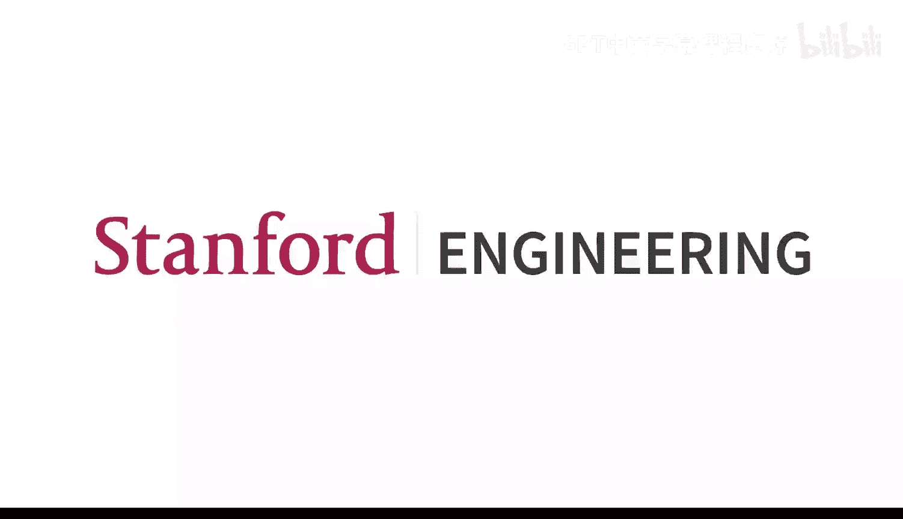
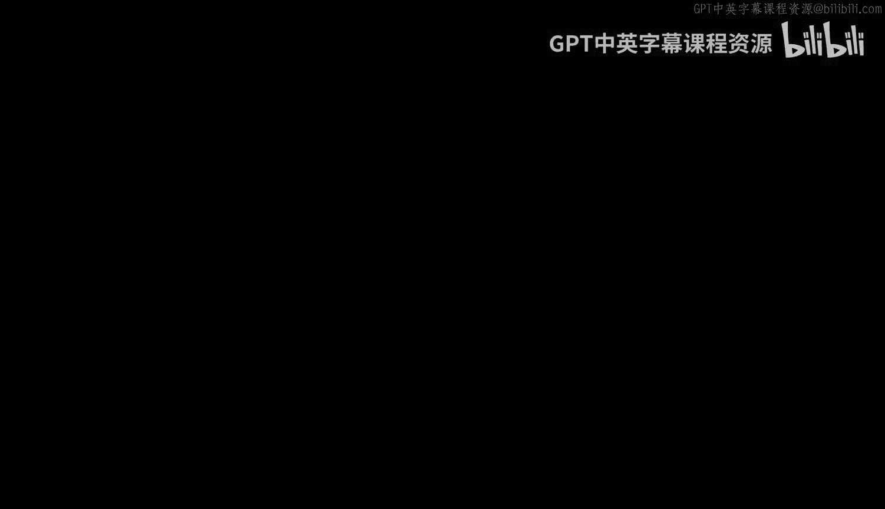
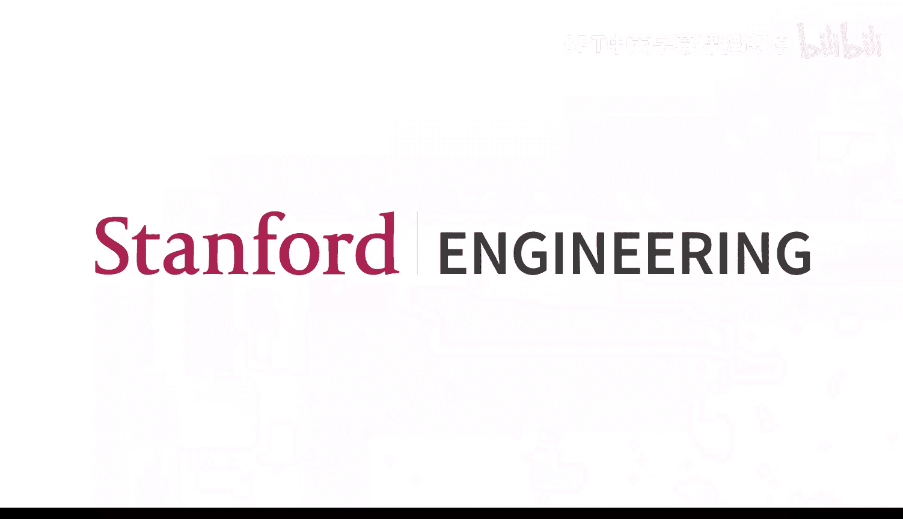

# 9：课程回顾与当前趋势 🎓

在本节课中，我们将对CME295课程的全部内容进行回顾，梳理从Transformer基础到大语言模型（LLM）训练与应用的知识脉络。随后，我们将探讨2025年及近期的一些前沿趋势，包括Transformer在其他领域的应用以及文本生成的新范式。最后，我们将进行课程总结，并展望未来的学习方向。

## 第一部分：课程内容回顾 📚

上一节我们介绍了本节课的议程，本节中我们将系统地回顾整个季度所学的核心知识。

### 从文本处理到Transformer

课程伊始，我们首先探讨了如何处理文本。第一步是**分词**，即将输入文本划分为原子单元（Token）。最常用的算法是**子词级分词器**，其优势在于可以复用和利用词根。

分词完成后，我们需要学习如何表示这些Token的**嵌入向量**。早期流行的方法如**Word2Vec**，通过预测中心词或上下文词等代理任务来学习表示，但其主要局限在于**缺乏上下文感知能力**，即同一个词在不同句子中的表示是相同的。

为了解决这个问题，我们学习了2010年代流行的**循环神经网络**。RNN通过循环结构逐个处理Token，并保留序列的内部表示。但其主要问题是**长距离依赖**，即随着序列变长，模型难以记住很久之前编码的信息。

这引出了本课程的核心思想：**自注意力机制**。它允许序列中的Token直接相互关注，无论它们相距多远。自注意力机制涉及三个核心术语：**查询、键和值**。其核心思想是计算查询与序列中所有键的相似度，并通过加权平均的方式聚合对应的值。

以下是自注意力机制的矩阵形式公式：
`注意力输出 = softmax(Q * K^T / sqrt(d_k)) * V`

自注意力机制能够高效地进行计算，非常适合现代硬件。第一讲最后，我们介绍了现代LLM的基石——**Transformer架构**。它主要由**编码器**和**解码器**两部分组成，最初在机器翻译任务中取得了巨大成功。

### Transformer的改进与衍生模型

在第二讲中，我们探讨了自2017年Transformer论文发表以来，人们对架构所做的改进。

一项重要改进是关于**位置编码**。原始Transformer使用**绝对位置编码**，为每个位置分配一个独立的嵌入向量。但更关键的是Token之间的**相对位置**。因此，**旋转位置编码** 应运而生，它通过在自注意力计算中旋转查询和键向量来编码相对距离信息。

其他改进包括对**多头注意力层**的优化，例如**分组查询注意力**，它允许对键和值的投影矩阵进行分组，减少参数量。此外，归一化层的位置也从子层之后（后归一化）移到了子层之前（前归一化）。

从Transformer架构中，衍生出了多种模型：
*   **仅编码器模型**：如BERT，擅长生成有意义的嵌入向量，适用于分类等下游任务，但不能生成文本。
*   **仅解码器模型**：如GPT，能够以自回归方式生成文本。
*   **编码器-解码器模型**：如T5，同样支持文本生成。

### 大语言模型及其训练

随后，我们聚焦于基于Transformer的、仅解码器的**大语言模型**。由于模型规模巨大，出现了新的技术来提升效率，例如**混合专家**。MoE不是让所有输入经过整个模型，而是稀疏地激活一组“专家”（如前馈神经网络），从而减少计算量。

在生成文本时，LLM通过预测下一个Token来工作。为了增加输出的多样性，我们通常从模型输出的概率分布中进行**采样**，而非总是选择概率最高的Token（贪婪解码）。可以通过调整**温度**超参数来控制输出的随机性：低温导致更确定性的输出，高温则更具创造性。

训练这些庞大的LLM需要巧妙的方法。在第四讲中，我们了解到，在给定计算预算下，存在模型参数量与训练数据量之间的**最优缩放定律**。一个经验法则是，模型至少应在**20倍于其参数数量的Token**上进行训练。

为了高效训练，我们学习了**Flash Attention**。该方法通过优化GPU内存（高速的SRAM和低速的HBM）之间的数据读写，并利用**重计算**策略，在不进行近似的情况下显著加速注意力计算。

我们还讨论了并行化训练技术，如**数据并行**和**模型并行**。

LLM的训练通常分为三个阶段：
1.  **预训练**：在海量数据上训练模型，使其学会语言和代码的结构，目标是预测下一个Token，得到一个擅长自动补全的模型。
2.  **监督微调**：在特定的输入-输出对上训练模型，使其行为符合我们的期望。
3.  **偏好调优**：向模型注入负面信号，教导它根据人类偏好（如有用性、安全性）来选择输出。

### 强化学习与对齐

第五讲深入探讨了如何使用强化学习技术进行偏好调优。我们将LLM生成Token的过程类比为强化学习中的**策略**：给定当前状态（已接收的输入），它采取行动（预测下一个Token），并在完成后获得奖励（人类偏好信号）。

由于人类偏好数据有限，我们需要训练一个**奖励模型**来评估输出。通常使用**Bradley-Terry模型**，以成对方式训练奖励模型，使其能够比较两个输出的优劣。

训练完成后，我们使用奖励模型来引导LLM。具体方法是：给定提示，让LLM生成回答，然后用奖励模型评估该回答，并更新LLM的权重以最大化奖励。同时，我们需要添加约束，防止LLM过度偏离原始的SFT模型或上一次迭代的模型，以避免**奖励黑客**问题。

### 思维链与推理

第六讲中，我们探讨了如何让LLM具备**推理能力**。关键思想是让模型在输出最终答案前，先输出一个**推理链**。这基于**思维链**提示技术，并能显著提升模型在数学等任务上的性能。

训练模型输出推理链的核心技术，同样是利用第五讲中的RL方法。近年来，**GRPO**算法因其不需要训练额外的价值函数，并且在有可验证奖励（如数学题答案）的任务上表现优异，逐渐受到青睐。

我们还讨论了GRPO的扩展，如**GRPO Done Right**和**DPO**，它们解决了原始GRPO可能偏向生成长度不正确答案的问题。

### 外部系统交互与评估

第七讲关注如何让LLM与外部系统交互以增强其能力。

**检索增强生成** 允许模型从知识库中检索相关文档来回答问题，以弥补其训练数据截止日期后的知识空白。RAG通常包含两步：1) **候选检索**：使用双编码器进行语义搜索；2) **重排序**：使用交叉编码器对候选文档进行更精确的评分。

**工具调用** 使LLM能够利用外部API。过程分为：1) LLM决定使用哪个API及其参数；2) 执行API调用；3) 将结果反馈给LLM以生成最终答案。现代智能体工作流通常结合RAG和工具调用。

在最后一讲中，我们探讨了如何**评估LLM**。传统的基于规则的指标（如BLEU, ROUGE）无法充分评估语言的多样性。因此，出现了**LLM即评委**的方法：让一个LLM根据给定标准，评估另一个LLM的输出，并同时输出评估理由和分数（通常是二元的通过/失败）。但这种方法也存在**位置偏差、冗长偏差和自我增强偏差**等问题。

此外，业界使用一系列基准测试来全面评估LLM，涵盖知识、推理、编码、安全等多个维度。

---
## 第二部分：前沿趋势探讨 🚀

上一节我们完整回顾了课程的核心内容，本节中我们来看看当前（2025年）及未来的一些重要趋势。

### Transformer在非文本领域的应用

一个自然的问题是：Transformer能否用于处理文本之外的数据？其核心自注意力机制处理的是向量，因此理论上可以应用于其他模态。

在**图像理解**任务中，研究者提出了**视觉Transformer**。其方法是将图像分割成块，每个块投影为一个向量，并加入位置信息。然后，仅使用Transformer的编码器部分处理这些向量，最后利用[CLS]标记的编码表示进行图像分类。ViT表明，即使对于图像这种传统上依赖卷积神经网络（具有较强归纳偏置）的任务，当提供足够数据时，低归纳偏置的Transformer也能取得卓越性能。

对于**视觉-语言多模态任务**（如图像问答），常见方法有两种：1) 将图像编码后的Token与文本Token拼接，一起输入给LLM；2) 在交叉注意力层中让图像特征与文本Token交互。第一种方法更为常见。

除了视觉理解，Transformer架构也被用于**图像生成**（如扩散Transformer）、推荐系统、语音处理等领域。Transformer已成功从机器翻译扩展到众多领域。

### 文本生成的新范式：扩散模型

另一个趋势是将其他领域（如图像生成）的成功范式引入文本世界，例如**基于扩散的LLM**。

目前主流的LLM是**自回归模型**，它逐个预测Token，无法在推理时并行化，生成长文本时延迟较高。而**扩散模型**在图像生成中表现优异，它从噪声开始，通过逐步去噪生成图像。

将扩散应用于文本的挑战在于文本是**离散的**，而图像是连续的。当前的研究将图像中的“噪声”类比为文本中的**掩码Token**。在文本扩散的前向过程中，不是添加噪声，而是逐步掩码更多Token，直到序列全被掩码。然后，模型学习如何逐步“去掩码”，以重建原始句子。

这种**掩码扩散模型**在推理时，从一个完全掩码的序列开始，通过少量步骤（远少于输出Token数）预测出所有Token，从而实现了**更快的生成速度**，尤其有利于代码生成等长文本任务。尽管当前性能可能尚未完全追上最前沿的自回归模型，但这是一个充满潜力的研究方向。

---
## 第三部分：总结与展望 🌟

在本节课中，我们一起回顾了Transformer和LLMs的核心知识体系，并探讨了当前的研究趋势。

### 跨模态的相互启发

我们看到，不同领域的技术正在相互借鉴和融合：
*   **架构层面**：图像领域的扩散思想被用于加速文本生成；文本领域的Transformer取代了图像中的卷积，成为扩散模型的主流骨架。
*   **输入表示**：研究表明，图像块作为Token具有强大的表示能力，甚至能有效编码文本信息。
*   **组件技巧**：文本中用于表示相对位置的**旋转位置编码**，可以被扩展并应用于2D图像或多模态场景。

### 持续演进的领域

Transformer和LLM的研究仍在快速发展中：
*   **架构细节**：优化器、归一化层的位置与类型、注意力机制的设计、激活函数、是否采用MoE等，都仍是活跃的研究课题。
*   **数据挑战**：随着网络中文LLM生成内容增多，如何获取高质量、多样化的训练数据，避免**模型崩溃**，变得愈发重要。
*   **硬件创新**：针对Transformer计算模式（如注意力计算）定制的新型硬件架构正在探索中，有望带来显著的延迟和能效提升。

### LLM的应用与未来挑战

LLM已在代码助手、通用问答、创意辅助、学习工具等领域深刻改变工作流。未来，智能体工作流的**民主化**、操作系统级别的AI集成、以及提供真正可靠、安全、个性化的服务是重要方向。

同时，我们也面临诸多挑战：如何实现**持续学习**、减少“幻觉”、提升**可解释性**和**安全性**等。

### 保持学习与更新

为了跟上领域发展，你可以：
*   关注**arXiv**、**NeurIPS**等顶会论文。
*   查阅论文附带的**代码库**。
*   利用**Hugging Face Trending Papers**、**X**、**YouTube**等平台跟踪社区动态。
*   参考优质的**公司技术博客**和**教育者视频**。

### 课程结语

感谢大家在整个季度的参与和互动，无论是现场还是在线学习的同学。希望本课程为大家打下了坚实的基础，并激发了进一步探索的兴趣。祝愿大家在未来的学习和工作中一切顺利！

**本节课中我们一起学习了CME295课程的完整知识脉络，探讨了Transformer和LLMs从基础到前沿的核心内容，并对未来的技术趋势和学习方向进行了展望。**