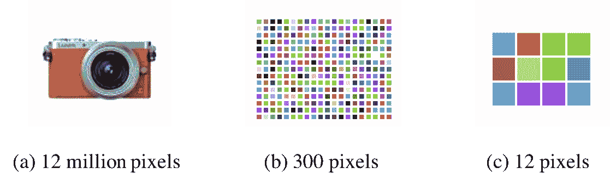
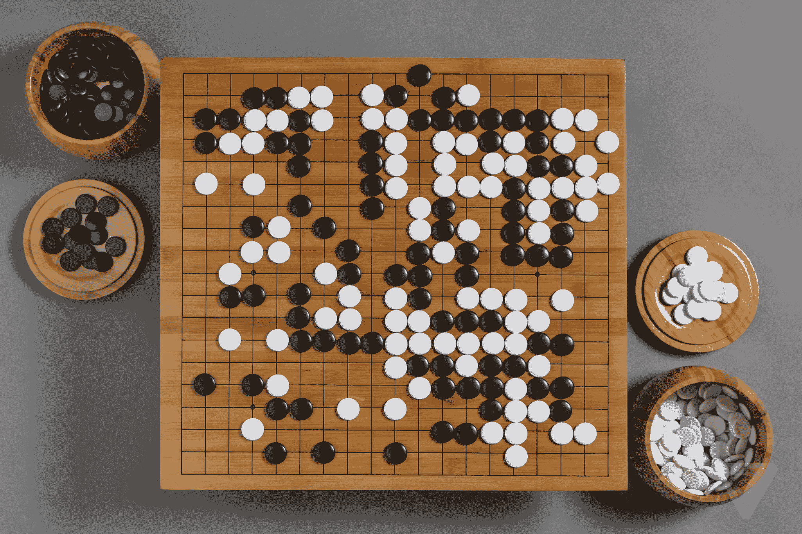

# 计数

> 原文：[`chrispiech.github.io/probabilityForComputerScientists/en/part1/counting/`](https://chrispiech.github.io/probabilityForComputerScientists/en/part1/counting/)

* * *

虽然你可能认为你在三岁时已经很好地掌握了计数的概念，但事实是你必须等到现在才能学会真正计数。你现在上这门课是不是很高兴？！但说真的，计数就像房子的基础（房子是我们将在本书后面做的所有伟大事情，比如机器学习）。房子很棒。另一方面，基础基本上只是洞里的混凝土。但不要没有基础就建房子。那样不会好。

## 步骤计数

***定义***：计数步骤规则（又称乘法计数规则）

如果一个实验有两个部分，第一部分可以产生 $m$ 种结果之一，而第二部分无论第一部分的结果如何都可以产生 $n$ 种结果之一，那么实验的总结果数是 $m \cdot n$。

使用集合符号重写，计数步骤规则表明，如果一个有两个部分的实验在第一部分有来自集合 $A$ 的结果，其中 $|A| = m$，在第二部分有来自集合 $B$ 的结果（无论第一部分的结果如何，$B$ 中的结果数量都是相同的），其中 $|B| = n$，那么实验的总结果数是 $|A||B| = m \cdot n $。

***简单示例***：考虑一个有 100 个桶的哈希表。两个任意字符串独立地散列并添加到表中。字符串存储在表中的可能方式有多少种？每个字符串可以被散列到 100 个桶中的任何一个。由于第一个字符串散列的结果不会影响第二个字符串的散列，因此两个字符串存储在哈希表中的方式有 100 * 100 = 10,000 种。

[彼得·诺维格](https://en.wikipedia.org/wiki/Peter_Norvig)，《人工智能》这一经典教科书的作者，提出了以下令人信服的观点，说明了为什么计算机科学家需要知道如何计数。首先，让我们为一个大数设定一个基准：可观测宇宙中原子的数量，通常估计为 $10^{80}$。宇宙中肯定有很多原子。正如一位领先专家所说，

“空间很大。真的很大。你简直无法相信它有多么广大，多么令人难以置信的大。我的意思是，你可能认为化学家在路上的距离很远，但与空间相比，那只是小菜一碟。” - 道格拉斯·亚当斯

这个数字经常被用来展示计算机永远无法解决的问题。问题可以迅速增长到荒谬的大小，我们可以通过使用计数步骤规则来理解这一点。

有一个艺术项目旨在展示所有可能的图片。这肯定需要很长时间，因为必须有很多可能的图片。但有多少呢？我们将假设一个名为[真彩色](https://en.wikipedia.org/wiki/Color_depth#True_color_(24-bit))的颜色模型，其中每个[像素](https://en.wikipedia.org/wiki/Pixel)可以是 $2^{24}$ ≈ 1700 万种不同颜色中的一种。

你可以从以下哪些中生成多少不同的图片：(a) 1200 万像素的手机相机，(b) 300 像素的网格，和(c) 只有 12 像素的网格？

答案：我们可以使用计数步骤规则。图像可以逐个像素、逐步创建。每次选择一个像素时，你可以在 1700 万种颜色中选择其颜色。一个包含 $n$ 个像素的数组可以产生 $(17 million)^n$ 种不同的图片。$(17 million)^{12}$ ≈ $10^{86}$，所以这个 12 像素的小网格产生的图片数量比宇宙中原子数量多一百万倍！那么 300 像素的网格呢？它可以产生 $10^{2167}$ 张图片。你可能认为宇宙中原子的数量很大，但与 300 像素网格中的图片数量相比，那只是小菜一碟。12M 像素呢？$10^{86696638}$ 张图片。

***示例***：围棋的独特状态

例如，围棋棋盘有 19×19 个点，用户可以在这些点上放置棋子。每个点可以是空的，或者被黑子或白子占据。通过计数步骤规则，我们可以计算出独特的棋盘配置数量。

*在围棋中，有 19×19 个点。每个点可以放置黑子、白子，或者完全不放子。*

在这里，我们将一步一步地构建棋盘，每次添加一个点，我们都有一个独特的选择，可以决定将该点设置为三种选项之一：{黑子，白子，无子}。使用这种构建方法，我们可以应用计数步骤规则。如果只有一个点，就会有三种独特的棋盘配置。如果有四个点，你会有 $3 \cdot 3 \cdot 3 \cdot 3 = 81$ 种独特的组合。在围棋中，有 $3^{(19×19)} ≈ 10^{172}$ 种可能的棋盘位置。我们构建棋盘的方式没有考虑到哪些是违反围棋规则的非法位置。结果是，“只有”大约 $10^{170}$ 个位置是合法的。这大约是宇宙中原子数量的平方。换句话说：如果每个原子都有一个原子组成的另一个宇宙，那么宇宙中的原子数量才会和围棋棋盘的独特配置数量一样多。

作为一名计算机科学家，这类结果可能非常重要。虽然计算机很强大，但需要存储棋盘每种配置的算法并不是一个合理的方案。没有计算机能存储比宇宙中原子数量平方还多的信息！

上述论点可能会让你觉得一些问题由于计数法则的乘积规则而变得极其困难。让我们花一点时间来谈谈计数法则的乘积规则是如何帮助我们的！大多数对数时间算法都利用了这个原则。

想象一下，你正在构建一个需要从数据中学习的机器学习系统，并且你想要为它合成生成一千万个独特的数据点。你需要编码多少步才能达到一千万？假设在每一步你都有一个二选一的选择，根据计数法则的步数规则，你产生的独特数据点的数量将是 $2^n$。如果我们选择 $n$ 使得 $\log_{2} 10,000,000 < n$。你只需要编码 $n=24$ 个二进制决策。

***示例***：掷两个骰子。两个六面的骰子，面数为 1 到 6，被掷出。掷骰子的可能结果有多少种？

* * *

***解答***：注意，我们并不关心两个骰子的总数值（“die”是“dice”的单数形式），而是关心所有掷骰子的明确结果集合。由于第一个骰子可以出现 6 种可能值，第二个骰子也有 6 种可能值（无论第一个骰子出现了什么），所以潜在的结果总数是 36（= 6 × 6）。这些可能的结果明确地列在下面，作为一系列的配对，表示这对骰子掷出的数值：

## 使用 **或** 进行计数

如果你想要考虑所有独特结果的总数，当结果可以来自源 $A$ **或**源 $B$ 时，你使用的方程取决于是否有一些结果同时存在于 $A$ 和 $B$ 中。如果没有，你可以使用更简单的“互斥计数”规则。否则，你需要使用稍微复杂一些的包含排除规则。

***定义***：互斥计数

如果一个实验的结果可以来自集合 $A$ 或集合 $B$，其中集合 $A$ 中的任何结果都不与集合 $B$ 中的任何结果相同（称为互斥），那么实验的可能结果有 $|A \or B| = |A|+|B|$ 种。

***示例***：路线总和。一个路线查找算法需要找到从内罗毕到达累斯萨拉姆的路线。它找到了通过乞力马扎罗山或蒙巴萨的路线。有 20 条通过乞力马扎罗山的路线，15 条通过蒙巴萨的路线，以及 0 条同时通过乞力马扎罗山和蒙巴萨的路线。总共有多少条路线？

* * *

***解答***：路线可以来自乞力马扎罗山 **或** 蒙巴萨。这两组路线是互斥的，因为两组中都没有共同的路线。因此，路线的总数是加法：20 + 15 = 35。

如果你能够证明两个组是互斥的，计数就变得简单了，只需要进行加法。当然，并不是所有的集合都是互斥的。在上面的例子中，假设有一条路线穿过乞力马扎罗山和蒙巴萨。我们会重复计算这条路线，因为它会被包含在这两个集合中。如果集合不是互斥的，计数“或”仍然是加法，我们只需要考虑任何重复计数。

***定义***：包含-排除计数

如果实验的结果可以来自集合 $A$ 或集合 $B$，并且集合 $A$ 和 $B$ 可能重叠（即 $A$ 和 $B$ 不是互斥的），那么实验的结果数量是 $|A \or B| = |A|+|B| −|A \and B|$。

注意，包含-排除原理推广了任意集合 $A$ 和 $B$ 的计数求和规则。在 $A \and B = ∅$ 的情况下，包含-排除原理给出了与计数求和规则相同的结果，因为 $|A \and B| = 0$。

***示例***：一个 8 位字符串（一个字节）通过网络发送。接收者识别的有效字符串集合必须以 "01" 开头或以 "10" 结尾。有多少这样的字符串？

* * *

***解答***：符合接收者标准的潜在位串可以是以 "01" 开头的 64 个字符串（因为最后 6 位是未指定的，允许有 $2⁶ = 64$ 种可能性）或者以 "10" 结尾的 64 个字符串（因为前 6 位是未指定的）。当然，这两个集合是重叠的，因为以 "01" 开头并以 "10" 结尾的字符串同时存在于这两个集合中。有 $2⁴$ = 16 个这样的字符串（因为中间的 4 位可以是任意的）。将这个描述转换为相应的集合表示法，我们有：$|A|$ = 64，$|B|$ = 64，$|A \and B|$ = 16，所以根据包含-排除原理，有 64 + 64 − 16 = 112 个字符串符合指定的接收者标准。

## 过度计数和纠正

计数的一个策略有时是先对解决方案进行过度计数，然后纠正任何重复的计数。这在更容易在放宽的假设下生成所有结果，或者有人引入约束时尤其常见。如果你能论证你过度计数的每个元素都是相同多次数，你可以简单地通过除法来纠正。如果你能精确地计算出有多少元素被过度计数，你可以通过减法来纠正。

作为证明这个观点的简单例子，让我们重新审视生成所有图像的问题，但这次我们只有 4 个像素（2x2），每个像素只能是**蓝色**或白色。有多少种独特的图像？生成任何图像是一个四步过程，你一次选择一个像素。由于每个像素有两个选择，所以有 $2⁴ = 16$ 种独特的图像（它们并不完全是毕加索的作品——但嘿，这是 4 个像素）：

现在假设我们增加一个新的“约束”条件，即我们只想接受那些蓝色像素数量为奇数的图片。有两种方法可以得到答案。你可以从最初的 16 张图片开始，计算出你需要减去 8 张图片，这些图片要么有 0 个、2 个或 4 个蓝色像素（这在下一章之后更容易计算）。或者你可以使用互斥计数法进行计数：有 4 种方法可以制作出只有 1 个蓝色像素的图片，有 4 种方法可以制作出有 3 个蓝色像素的图片。两种方法都会得到相同的答案，即 8。

接下来，让我们添加一个更难的约束条件：镜像不可区分性。如果你可以水平翻转任何图片以创建另一个，它们就不再被认为是独特的。例如，这两张图片都出现在我们的 8 张奇数蓝色像素图片集中，但现在它们被认为是相同的（在水平翻转后它们是不可区分的）：

考虑到镜像不可区分性，有多少图片的蓝色像素数量为奇数？答案是，对于每个具有奇数蓝色像素的独特图片，在这个新的约束条件下，你已经将其计算了两次：本身和它的水平翻转。为了让你确信每个图片都被精确地计算了两次，你可以查看包含 8 张具有奇数蓝色像素的图片集中的所有示例。每个图片旁边都有一个在水平翻转后不可区分的图片。由于每个图片在 8 张图片集中都被精确地计算了两次，我们可以除以 2 来得到更新后的计数。如果我们列出它们，我们可以确认在最后一个约束条件之后，剩下 8/2=4 张图片。

将任何数学（包括计数）应用于新颖的情境，可以像是一门艺术，也可以是一门科学。在下一章中，我们将通过逐步计数和“或”计数的基本第一原理构建一个有用的工具集。
