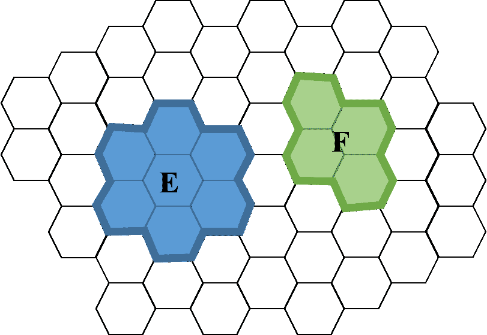

# “或”的概率

> 原文：[`chrispiech.github.io/probabilityForComputerScientists/en/part1/prob_or/`](https://chrispiech.github.io/probabilityForComputerScientists/en/part1/prob_or/)

* * *

计算事件 $E$ 或事件 $F$ 发生的概率的公式，写作 $\p(E \or F)$ 或等价地写作 $\p(E ∪ F)$，与计算两个集合的大小深度相似。就像计数一样，你可以使用的方程取决于事件是否“互斥”。如果事件是互斥的，计算任一事件发生的概率非常直接。否则，你需要更复杂的“包含排除”公式。

## 互斥事件

如果两个事件：$E$，$F$ 被认为是互斥的（在集合表示法中 $E ∩ F = ∅$），那么没有结果同时属于这两个事件（回想一下，事件是一组结果，它是样本空间的子集）。用英语来说，互斥意味着两个事件不能同时发生。

互斥性可以可视化。考虑以下视觉样本空间，其中每个结果是一个六边形。所有五十个六边形的集合是整个样本空间：

*两个事件：$E$，$F$ 的互斥示例。*

两个事件 $E$ 和 $F$ 是同一样本空间的子集。从视觉上看，我们可以注意到这两个集合没有重叠。它们是互斥的：没有结果同时属于这两个集合。

## **与互斥事件的“或”**

***定义***：互斥事件的“或”概率

如果两个事件：$E$，$F$ 是互斥的，那么 $E$ 或 $F$ 发生的概率是：$$ \p(E \or F) = \p(E) + \p(F) $$

这个性质适用于计算 $E$ 或 $F$ 的概率的任何方法。此外，这个想法可以扩展到超过两个事件。假设你有 $n$ 个事件 $E_1, E_2, \dots E_n$，其中每个事件与其他事件互斥（换句话说，没有结果在多个事件中）。那么：$$ \p(E_1 \or E_2 \or \dots \or E_n) = \p(E_1) + \p(E_2) + \dots + \p(E_n) = \sum_{i=1}^n \p(E_i) $$

你可能已经注意到，这是概率的一个公理。尽管它可能看起来直观，但它是我们接受而不需要证明的三个规则之一。

**注意**：互斥性仅使计算 $E \or F$ 的概率变得容易，而不是其他组合事件的方式，例如 $E \and F$。

到目前为止，我们知道如果事件具有互斥性质，我们就可以计算“或”事件的概率。如果它们不具有这种性质怎么办？

## **与非互斥事件的“或”**

不幸的是，并不是所有事件都是互斥的。如果你想计算 $\p(E \or F)$，其中事件 $E$ 和 $F$ **不是**互斥的，你不能**简单地**添加概率。作为一个简单的合理性检查，考虑事件 $E$：掷硬币得到正面，其中 $\p(E) = 0.5$。现在想象样本空间 $S$，掷硬币得到正面或反面。这些事件不是互斥的（正面的结果在两者中都有）。如果你错误地假设它们是互斥的，并试图计算 $\p(E \or S)$，你会得到这个错误的推导：

**错误的推导**：错误地假设了互斥性

计算事件 $E$，掷骰子得到偶数（2，4 或 6），或事件 $F$，掷骰子得到 3 或更少（1，2，3）的概率。$$ \begin{align} \p(E \or F) &= \p(E) + \p(F) && \text{错误地假设了互斥性} \\ &= 0.5 + 0.5 && \text{用 $E$ 和 $S$ 的概率替换} \\ &= 1.0 && \text{哎呀！} \end{align} $$

概率不能是 1，因为结果 5 既不是 3 或更少，也不是偶数。问题在于我们重复计算了得到 2 的概率，而解决方案是减去这个重复计算的概率。

发生了什么问题？如果两个事件不是互斥的，简单地添加它们的概率会重复计算任何在两个事件中都出现的结果的概率。有一个用于计算两个非互斥事件“或”的公式：它被称为“包含-排除”原理。

***定义***：包含-排除原理

对于任何两个事件：E，F：$$ \p(E \or F) = \p(E) + \p(F) − \p(E \and F) $$

这个公式也有超过两个事件的版本，但它会变得相当复杂。请参阅下两个部分以获取更多详细信息。

注意，包含-排除原理也适用于互斥事件。如果两个事件是互斥的，$\p(E \and F) = 0$，因为 $E$ 和 $F$ 同时发生是不可能的。因此，公式 $\p(E) + \p(F) - \p(E \and F)$ 简化为 $\p(E) + \p(F)$。

## 三事件的包含-排除原理

如果我们有三个事件，它们不是互斥的，并且我们想知道“或”的概率 $ \P(E_1 \or \E_2 \or E_3)$，包含-排除属性看起来是什么样子？

回想一下，如果它们是互斥的，我们只需添加概率。如果不是互斥的，你需要使用三个事件的包含-排除公式：

$$ \begin{aligned} \P(E_1 &\or \E_2 \or E_3) = \\ & + \P(E_1) \\ &+ \P(E_2) \\ &+ \P(E_3) \\ & -\P(E_1 \and E_2) \\ &-\P(E_1 \and E_3) \\ &-\P(E_2 \and E_3) \\ & +\P(E_1 \and E_2 \and E_3) \end{aligned} $$

用文字来说，要得到三个事件的概率，你需要：(1) 添加每个事件单独发生的概率。(2) 然后你需要减去每对事件同时发生的概率。(3) 最后，你需要加上所有三个事件同时发生的概率。

## $n$ 事件的包含-排除原理

在我们探讨一般公式之前，让我们再看一个例子。四个事件的包含-排除：

$$ \begin{aligned} \P(&E_1 \or E_2 \or E_3 \or E_4) =\\ &+ \P(E_1)\\ &+ \P(E_2)\\ &+ \P(E_3)\\ &+ \P(E_4)\\ &- \P(E_1 \and E_2) \\ &- \P(E_1 \and E_3) \\ &- \P(E_1 \and E_4) \\ &- \P(E_2 \and E_3) \\ &- \P(E_2 \and E_4) \\ &- \P(E_3 \and E_4) \\ &+ \P(E_1 \and E_2 \and E_3)\\ &+ \P(E_1 \and E_2 \and E_4)\\ &+ \P(E_1 \and E_3 \and E_4)\\ &+ \P(E_2 \and E_3 \and E_4)\\ &- \P(E_1 \and E_2 \and E_3 \and E_4) \end{aligned} $$

你看出了这个模式吗？对于 $n$ 个事件，$E_1, E_2, \dots E_n$：将每个事件单独的概率相加。然后减去所有事件对的概率。然后加上所有 3 个事件的子集。然后减去所有 4 个事件的子集。继续这个过程，直到子集的大小为 $n$，如果子集的大小是奇数，则加上子集，否则减去它们。交替相加和相减是包含-排除原理名称的由来。这是一个复杂的过程，你应该首先检查是否有更简单的方法来计算你的概率。这可以用数学公式表示——但它是一个相当难以用符号表达的复杂模式：

$$ \begin{gather} \P(E_1 \or E_2 \or \cdots \or E_n) = \sum\limits_{r=1}^n (-1)^{r+1} Y_r \\ \text{s.t. } Y_r = \sum\limits_{1 \leq i_1 < \cdots < i_r \leq n} \P(E_{i_1} \and \cdots \and E_{i_r}) \end{gather} $$

$Y_r$ 的符号特别难以解析。$Y_r$ 对所有选择 $r$ 个事件子集的方式求和。对于每个 $r$ 个事件的选取，计算这些事件的“与”的概率。$(-1)^{r+1}$ 表示：交替相加和相减，从相加开始。

在这里遵循数学符号并不是特别重要。主要的收获是，包含-排除原理在多个事件的情况下会变得极其复杂。通常，在这种情况下取得进展的方法是找到一种使用另一种方法来解决你的问题的方法。

计算非互斥事件的“或”的公式通常需要计算事件的“与”的概率。更多内容请参阅**和**的概率章节。
